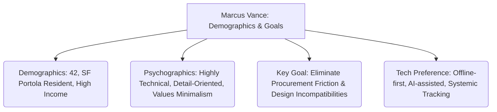

# Showroom & Materials Sourcing: User Persona & Customer Journey Map
**Project:** Home Remodeling Sourcing Suite
**Design Profile:** Monolith (Dark Theme, High Contrast, Ring/Divider-only Borders)
**Date:** June 21, 2026

---

## 1. User Persona: The Modernist Perfectionist

### Marcus Vance (42) — Principal Systems Architect (San Francisco)

> *"In software, we check compiler logs and compatibility matrixes before we deploy code. Why should my home remodel be any different? I need to know that my InvisaCook induction burner is compatible with my Porcelanosa tiles before my slab fabricator cuts the stone."*



#### Demographics & Context
* **Age/Location:** 42, living in SF (Zip code 94134 — Portola district). Subject to wind-tunnel microclimates, dense fog, and moisture constraints.
* **Occupation:** Principal Systems Architect at a top-tier tech firm.
* **Remodel Scope:** Mid-century modern home down-to-the-studs remodel, prioritizing high-end Italian casework (Rimadesio closets), flush interior doors (Insensation), hidden induction systems (InvisaCook), drywall reveals (Fry Reglet), and weathering facades (Corten steel).
* **Collaboration:** Partnered with an elite architect and a general contractor, but self-manages the sourcing, price optimization, and scheduling of materials.

#### Psychographics & Behaviors
* **Mental Model:** Remodeling is a massive, multi-threaded configuration management problem. Every finish material has mechanical and structural dependencies on the underlying framing, plumbing, or electrical layout.
* **Frustrations:** 
  * Lack of structural awareness in shopping tools (adding items without checking compatibility).
  * Sourcing fragmentation: visiting 5 different Bay Area cities in a weekend (San Carlos, SF Design District, Belmont, Alameda, Hayward) and losing track of what was seen where.
  * Retail markup anxiety: knowing that contractor accounts, trade discounts, Costco rebate programs, and clearance items (like his $5,500 Sub-Zero clearance find) exist but are hard to discover dynamically.
  * In-store tracking friction: spotty cellular reception inside steel-framed warehouses (e.g., Whole Wood) causing standard cloud apps to fail during product search or photo uploading.

---

## 2. Chronological Customer Journey Map

The journey maps Marcus's experience from the first design spark through the actual construction handoff, showing how the backend database schema (from [implementation_plan_v2.md](file:///Volumes/Projects/workers/core-remodel/docs/0001_showroom_planner/plans/implementation_plan_v2.md)) resolves specific pain points.

| Phase | User Actions | Touchpoints | Pain Points | Emotional Vibe | UX Opportunities (Monolith-aligned) | Backend/Schema Mapping |
| :--- | :--- | :--- | :--- | :--- | :--- | :--- |
| **1. Discovery** | • Browses architectural blueprints & moodboards.<br>• Extracts list of needed materials (plumbing, tile, closets, glazing).<br>• Identifies Bay Area showrooms to visit. | • Pinterest, PDFs, spreadsheets.<br>• Sourcing lists.<br>• Web search. | • Fragile spreadsheets.<br>• Hard to link a vibe ("moody concrete") to concrete products and local shops.<br>• Fragmented showroom hubs. | 📈 **High:** Excitement about design.<br>📉 **Low:** Mounting anxiety over volume of decisions. | • **Asymmetric Moodboard Ingest**: Upload floorplans/moodboards to auto-generate a draft materials list.<br>• **Hub-Level Map View**: View showrooms clustered by geographic hubs (Hubs A–E) to plan day trips. | • `store_product_area_def`<br>• `store_bayarea_cities`<br>• `showroom_tag_def` |
| **2. Onboarding** | • Populates materials schedule.<br>• Groups items by room (Kitchen, Master Bath, Closet).<br>• Input budgets and quantities. | • Materials onboarding wizard.<br>• Spreadsheet importer.<br>• Settings (SF zip code). | • Manual data-entry fatigue.<br>• Setting up technical parameters (dimensions, finishes) is tedious.<br>• Generic templates don't fit high-end needs. | 📉 **Low:** Data-entry friction.<br>📈 **High:** Relieved by pre-populated categories. | • **One-Click Blueprint Upload**: AI extracts structured line items from architectural specifications.<br>• **High-End Presets**: Pre-populate materials schedule with modernist defaults (e.g., flush trim, flangeless lighting, microcement). | • `showroom_store_products`<br>• `store_product_pa_mapping`<br>• `shopping_journal_entries` |
| **3. Core Task Execution** | • Visually inspects items at showrooms.<br>• Scans barcodes in-store, uploads photos.<br>• Annotates items with notes and sentiment.<br>• Triggers AI deep research for specs, price match, and reviews. | • Mobile Showroom Viewport.<br>• Barcode Scanner Dialog.<br>• Offline Sync Queue.<br>• Compatibility Warning Banners. | • Spotty cellular reception in warehouse zones.<br>• Hidden technical compatibility constraints (e.g., steam voltage).<br>• missing clearance/trade deals. | 📉 **Low:** Showroom crawl exhaustion.<br>📈 **High:** Thrill of finding clearance/discount matches (Sub-Zero). | • **Offline-First Scan Queue**: Caches barcode values/images in local storage and auto-syncs when online.<br>• **Digital Concierge (Deep Research)**: Agent auto-scours web for pricing, reviews, and clearance items based on user notes.<br>• **Compatibility Matrix Alerts**: Warning banners for mechanical mismatches (e.g., InvisaCook vs countertop stone thickness). | • `showroom_scan_log`<br>• `store_notes` / `store_product_notes`<br>• `store_product_research`<br>• `store_product_similar_model_map` |
| **4. Post-Task Engagement** | • Approves materials.<br>• Purchases items.<br>• Schedules deliveries to align with contractor construction timeline.<br>• Stores receipts/warranties. | • Procurement Dashboard.<br>• Lead-Time Timeline.<br>• Document Vault.<br>• Budget Impact Forecasts. | • Contractor waiting on site, causing delays due to late orders.<br>• Lost receipts and warranty booklets.<br>• Over-budget stress as invoices lock in. | 📈 **High:** Relief when items are purchased.<br>📉 **Low:** Logistics stress. | • **Mud-to-Finish Timeline**: Visualizes ordering deadlines based on framing/drywall phases (e.g. mud-in Fry Reglet trims must arrive early).<br>• **Warranty Extract**: Auto-parses uploaded invoices/manuals to map active warranties. | • `store_product_docs`<br>• `store_rating` / `store_product_rating`<br>• `store_similar_map` |

---

## 3. Interactive UX Concepts (Monolith Design Language)

These concepts are tailored for a dark-mode, borderless, high-contrast, type-focused interface that matches the visual aesthetics of the **Monolith** profile.

### Concept A: The Offline-First Barcode Scan Queue
* **Purpose:** Solves the warehouse dead-zone cellular coverage problem.
* **Interaction:** Inside the mobile web app, opening the scanner launches a lightweight web-cam capture viewport. If offline, the app captures the frame, decodes the barcode (using `@zxing/library` client-side), and pushes it to a local storage array.
* **Micro-interaction:** A subtle yellow indicator dot pulses at the bottom corner showing "Sync Status: 3 items queued." When connectivity returns, a micro-shimmer sweeps the indicator, changing it to a green checkmark, accompanied by a slide-in toast detailing the newly resolved products.

### Concept B: The Architectural Compatibility Alert System
* **Purpose:** Warns the user of technical dependencies (e.g., frameless pocket doors require specific drywall studs; hidden induction requires specific stone substrates).
* **UI Pattern:** In the **Material Viewport**, rather than using loud red borders or generic modals, the system renders an asymmetric warning badge next to the product header: `[Compat: Warning - Tap to Expand]`.
* **Details:** Expanding the card reveals the AI-interpreted reasoning in high-contrast monospaced font (`Geist Mono` or `Geist Mono`):
  ```
  [COMPATIBILITY SCANNER: RUN COMPLETED]
  > Parent Material: INVISACOOK RECESSED INDUCTION
  > Matched Substrate: CALACATTA GOLD MARBLE (NATURAL STONE)
  > CRITICAL CONSTRAINT FAILURE: InvisaCook operates strictly through certified 12mm-20mm porcelain slabs (e.g., Porcelanosa). 
  > RISK: Natural marble will crack or discolor under magnetic heat transfer.
  > RECOMMENDATION: Swapping marble for Porcelanosa XTONE slab.
  ```

### Concept C: The White-Glove Price & Clearance Concierge
* **Purpose:** Emulates a high-end sales associate who combs the web to find alternative options or clearances matching user journals.
* **UI Pattern:** If a user logs a note like *"Liked the Sub-Zero French Door fridge at Townsend Showroom, but $11,000 is way over budget,"* the `ShowroomResearchAgent` triggers.
* **Output Card:** A clean, borderless card surface (`bg-card` + `ring-1 ring-border/40`) slides into the viewport, displaying similar items, clearance products, or wholesale trade pricing:
  ```
  [CONCIERGE FIND: CLEARANCE EXCLUSION]
  > Location: Wedlock Showroom Outlet, San Carlos (Hub C)
  > Match: Unopened Sub-Zero 36" Built-in (Display Model)
  > Retail: $11,000.00 | Clearance: $5,500.00
  > Action: [Reserve Item] [Call Showroom] [Get Directions]
  ```

---

## 4. Prompts for the UX Agent (To Build Prototypes)

Copy these prompt blocks to direct your UX Agent. They are engineered to enforce the **Monolith** design language and prevent generic AI-generated templates.

### Prompt 1: The Unified Materials Schedule & Budget Forecaster
```text
Act as an Expert Frontend Engineer. Build a high-end, responsive Materials Schedule page.
This dashboard is designed for a premium home remodel project. Follow the "Monolith" design profile:
- Dark theme: Background is HSL(240 10% 4%), card surface is HSL(240 8% 7%), foreground is HSL(0 0% 98%).
- No traditional 1px borders. Use "ring-1 ring-border/40" for container boundaries and "divide-y divide-border/40" for rows.
- High-contrast typography: Headlines use Inter semibold, tracking-tight. Numbers use JetBrains Mono or Geist Mono with tabular numbers ("font-feature-settings: 'tnum'").
- Chart: Use Recharts wrapped in shadcn <ChartContainer>. Utilize the Monolith chart color overrides:
  - --chart-1: 217 95% 68% (Electric Blue)
  - --chart-2: 142 76% 56% (Vivid Green)
  - --chart-3: 45 95% 60% (Amber Gold)
  - --chart-4: 8 90% 65% (Hot Coral)
  - --chart-5: 290 75% 68% (Magenta Purple)

Key Layout Sections:
1. Asymmetric Header: Left-aligned title "Materials Schedule" with a small, high-contrast badge indicating total project spend vs budget.
2. Budget Chart: A stacked horizontal bar chart showing allocated vs spent vs projected costs across 6 areas: Kitchen, Bathroom, Closet, Living, Exterior, General.
3. Materials Directory: A dense table grouped by Product Area. For each material, show columns: Material Name (clickable link to viewport), Room, Budget Range, Qty, Procurement Status (Wishlist, Selected, Purchased, Delivered), and an "AI Alert" column showing compatibility warning icons where applicable.
4. Procurement Timeline Checklist: A sidebar or section highlighting immediate upcoming order deadlines (e.g., Fry Reglet mud-in drywall reveals, Insensation door frames) mapping back to construction milestones.
Do not use generic placeholder text or purple neon gradients. Ensure mobile responsiveness.
```

### Prompt 2: Interactive Showroom Hub Mapper & Wishlist Viewport
```text
Act as an Expert Frontend Engineer. Build a Showrooms Directory page.
Follow the "Monolith" design system (dark-only, borderless, Inter headlines, JetBrains Mono numbers, ring-1 focus rings).

Key Features:
1. Header & Filters: Filter options (City Hubs A-E, Specialty, Price Point $, $$, $$$, $$$$). Use a custom multi-select combobox (simulated as custom React islands) for filters.
2. Sourcing Map Canvas: A dark-themed layout block simulating an interactive map of the Bay Area. Show markers color-coded by Hub (A: SF, B: South Bay, C: Peninsula, D: East Bay, E: North Bay). Selecting a marker displays a high-contrast floating popover with a photo placeholder, showroom description, and a link to the Showroom Viewport.
3. Showroom Directory Table: Listed under the map in a clean tabular format using "divide-y divide-border/40". Show columns: Showroom Name (clickable link), Specialty Hub, Price Point, Hours (Open Saturdays/Sundays indicators), and Active Wishlist Count.
4. Wishlist Quick-Add: A slide-over panel that allows users to quickly map products they saw in-store to their materials schedule.
Avoid all caps for long text blocks. Use subtle scale transitions (spring: stiffness 200, damping 25) on hover states.
```

### Prompt 3: Material Detail Viewport & AI Research Concierge
```text
Act as an Expert Frontend Engineer. Build the Material Detail Viewport page.
Follow the "Monolith" design system. The page must feel moody, editorial, and highly technical.

Key Sections:
1. Product Hero Header: Large-format title of the material (e.g. "InvisaCook Hidden Induction Cooktop"), with primary metadata (Qty needed, Budget range, Brand, SKU, and local showroom source link) left-aligned.
2. Media Gallery: A grid of cropped, high-contrast imagery and linked PDF specifications.
3. Notes & Journal: A timeline of user-authored notes and ratings, including thumbs up/down icons and notes detailing specific style opinions ("Loved the flush installation, but worried about granite compatibility").
4. AI Research & Compatibility Console: A terminal-like monospaced display showing findings from the ShowroomResearchAgent DO. Use a distinct "bg-muted/30 p-4 rounded-md ring-1 ring-border/40 font-mono" box. Include sections:
   - "Technical Review": Web search summary of reviews, warranty, and lead times.
   - "Compatibility Warning Engine": Loud, high-contrast warning alerts about structural constraints (e.g. stone thickness requirements, electrical specifications for steam showers).
   - "Clearence & Discount Concierge": Curated recommendations for trade discounts or outlet store clearances matching this item (e.g., flagging Sub-Zero clearance deals in San Carlos).
Apply micro-shimmers on loading states and subtle staggering animations (40ms cascade) on the timeline elements.
```

### Prompt 4: Mobile Barcode Scan & Offline Queue Sync Interface
```text
Act as an Expert Frontend Engineer. Build a mobile-optimized Barcode Scan and Sync view.
The interface must target mobile safari/chrome, fitting exactly on 375px/414px width with zero horizontal scrolling. Follow the Monolith dark profile.

Layout and Components:
1. Scan Viewfinder Dialog: A full-screen dialog overlay simulating a camera stream. Include a centered, semi-transparent viewfinder mask with neon-like corner markers (white or electric blue) and a scanning laser guide line pulsing slowly.
2. Manual Barcode Entry Fallback: A text input at the bottom for manually typing SKUs when scanning fails.
3. Offline Queue status indicator: An sticky bottom banner that pulses when the device is simulated as "offline." It must read: "3 Scans Queued (Offline Mode). Your scans will sync automatically once a network connection is established."
4. Synced Scans List: Below the scanner, show a vertical card deck of successfully decoded scans. Each card shows: Decoded SKU, Scan Timestamp (formatted in Geist Mono), Matched Store Product, Price extraction status, and a "View Product" button.
Must support touch-friendly gestures (minimum 48px touch targets) and spring transitions on dialog dismissal.
```
