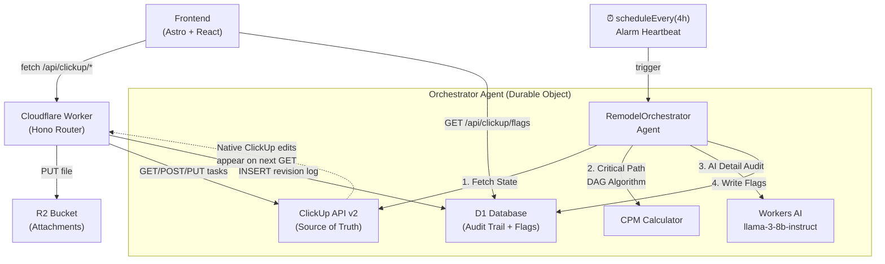

# ClickUp Integration + AI Orchestrator Agent

## Background

Offload core task management to ClickUp (Free Tier) so the project's scheduling infrastructure benefits from ClickUp's stability, mobile apps, and ecosystem. The Cloudflare Worker acts as a **proxy + audit layer**: it fetches live data from ClickUp on every read, writes changes back to ClickUp on every mutation, and records every change in D1 as an immutable revision log.

**The strategic unlock:** A `RemodelOrchestrator` Durable Object agent runs on a recurring alarm, audits every task for missing detail via **Workers AI**, and calculates the **critical path** via a DAG algorithm. If a deadline slips or a task lacks a vendor link, it is the *objective, automated system* flagging the risk — not you. You offload the emotional labor of project management to a serverless function.

### ClickUp Free Tier Constraints (Verified)

| Constraint | Limit |
|---|---|
| API rate limit | **100 req/min** per token |
| Tasks | Unlimited |
| Storage (attachments) | **60 MB total** — files should be stored in R2, only links appended to ClickUp |
| Custom Field uses | 60 |
| Automations | 100 actions/month |

> [!IMPORTANT]
> **Attachment strategy:** Given the 60 MB cap, we will **NOT** upload binary files to ClickUp. Instead, files are uploaded to R2 (`ARTIFACTS_BUCKET`), and the R2 public URL is appended into the ClickUp task description as a markdown link. This gives unlimited storage with zero ClickUp quota impact.

---

## Architecture Overview



### Data Flow Rules

1. **READ path:** `Frontend → Worker → ClickUp API → Worker → Frontend` (no D1 read needed for task data)
2. **WRITE path:** `Frontend → Worker → D1 (log revision) → ClickUp API → Worker → Frontend`
3. **Bi-directional sync:** Tasks created/edited natively in ClickUp show up automatically because the Worker always fetches live from ClickUp.
4. **Attachments:** `Frontend → Worker → R2 (store file) → ClickUp API (append link to description)`
5. **Orchestrator (autonomous):** `Alarm → Fetch ClickUp → DAG critical path → Workers AI audit → D1 flags/alerts`
6. **Flag overlay:** `Frontend → GET /api/clickup/flags → merge with task data → render badges/alerts on Kanban + Gantt`

---

## User Review Required

> [!IMPORTANT]
> **ClickUp Workspace Setup:** Before implementation, you need to:
> 1. Create a ClickUp Workspace (if not already done)
> 2. Create a **Space** for the remodel project
> 3. Create a **List** (or multiple Lists per phase/room) inside that Space
> 4. Generate a **Personal API Token** from ClickUp Settings → Apps
> 5. Note your **Team ID** (visible in ClickUp URL: `app.clickup.com/{team_id}/...`)
> 6. Add both `CLICKUP_TOKEN` and `CLICKUP_TEAM_ID` to the Cloudflare Secrets Store

> [!WARNING]
> **List ID Strategy:** The ClickUp Free Tier allows unlimited Lists. We need to decide:
> - **Option A (Recommended):** Single List for all tasks — simpler API calls, filtering done client-side by status/tag
> - **Option B:** One List per room/epic — mirrors the existing `planning_epics` structure but requires storing List IDs

---

## Open Questions

> [!IMPORTANT]
> 1. **ClickUp List structure:** Do you want a single flat List, or one List per epic/room? (Recommendation: single List with tags for rooms)
> 2. **Existing planning_tasks migration:** Should we migrate existing `planning_tasks` data into ClickUp as a one-time seed, or start fresh?
> 3. **Custom Fields:** Do you want to map `priority`, `room`, `epic` as ClickUp Custom Fields (limited to 60 uses on Free), or encode them as tags/description metadata?
> 4. **ClickUp Status names:** What status names should we use? Recommendation: `to do` → `in progress` → `blocked` → `complete` (maps to your existing `pending | in_progress | blocked | delayed | done`)
> 5. **Orchestrator audit frequency:** The plan uses a 4-hour alarm cycle. Do you want more frequent (hourly) or less frequent (daily)?
> 6. **AI audit prompt domain:** The default prompt flags missing vendor links, dimensions, SKUs, and material specs. Should it also check for missing budget amounts, permit references, or contractor assignments?
> 7. **Alert notification channel:** Should system alerts (critical path risks) also trigger a notification in your existing `notifications` table, or only appear in the UI when you load the tasks page?

---

## Proposed Changes

### Component 1: Secrets & Bindings

#### [MODIFY] [wrangler.jsonc](file:///Volumes/Projects/workers/core-remodel/wrangler.jsonc)

Add two new Secrets Store bindings for ClickUp credentials + new Durable Object binding for the Orchestrator:

```jsonc
// Add to secrets_store_secrets array:
{
  "binding": "CLICKUP_TOKEN",
  "store_id": "8c42fa70938644e0a8a109744467375f",
  "secret_name": "CLICKUP_TOKEN"
},
{
  "binding": "CLICKUP_TEAM_ID",
  "store_id": "8c42fa70938644e0a8a109744467375f",
  "secret_name": "CLICKUP_TEAM_ID"
}

// Add to durable_objects.bindings array:
{
  "name": "REMODEL_ORCHESTRATOR",
  "class_name": "RemodelOrchestrator"
}

// Add to migrations array:
{
  "tag": "v12",
  "new_sqlite_classes": ["RemodelOrchestrator"]
}
```

After `wrangler types` regeneration, these will appear as `SecretsStoreSecret` and `DurableObjectNamespace` in the Env interface.

---

### Component 2: D1 Schema — Revision Log + Task Flags + System Alerts (Drizzle)

#### [NEW] [clickup_revision_log.ts](file:///Volumes/Projects/workers/core-remodel/src/backend/db/schema/home/clickup_revision_log.ts)

```typescript
import { sql } from "drizzle-orm";
import { integer, sqliteTable, text } from "drizzle-orm/sqlite-core";

/**
 * Immutable audit trail for every ClickUp task mutation
 * that passes through the Worker.
 *
 * Each row captures the FULL JSON payload BEFORE sending to ClickUp,
 * plus the ClickUp response, enabling complete replay/recovery.
 */
export const clickupRevisionLog = sqliteTable("clickup_revision_log", {
  id: integer("id").primaryKey({ autoIncrement: true }),

  /** The ClickUp task ID (e.g. "abc123"). NULL for create ops (assigned after ClickUp responds). */
  clickupTaskId: text("clickup_task_id"),

  /** The ClickUp List ID this task belongs to. */
  clickupListId: text("clickup_list_id"),

  /** create | update | delete | attachment */
  operation: text("operation").notNull(),

  /** Full JSON payload sent TO ClickUp. */
  requestPayload: text("request_payload").notNull(),

  /** Full JSON response FROM ClickUp (or error). */
  responsePayload: text("response_payload"),

  /** HTTP status code from ClickUp. */
  responseStatus: integer("response_status"),

  /** Who triggered this change (email or "system"). */
  actor: text("actor").notNull().default("system"),

  /** Optional: R2 key if an attachment was uploaded. */
  r2AttachmentKey: text("r2_attachment_key"),

  /** ISO-8601 timestamp of the mutation. */
  createdAt: text("created_at")
    .notNull()
    .default(sql`(datetime('now'))`),
});
```

#### [NEW] [clickup_task_flags.ts](file:///Volumes/Projects/workers/core-remodel/src/backend/db/schema/home/clickup_task_flags.ts)

```typescript
import { sql } from "drizzle-orm";
import { integer, sqliteTable, text } from "drizzle-orm/sqlite-core";

/**
 * AI-generated and algorithmic flags attached to ClickUp tasks.
 * Written by the RemodelOrchestrator agent during its audit cycle.
 *
 * Flag types:
 * - AI_AUDIT: Workers AI detected missing detail (vendor, dimensions, SKU)
 * - CRITICAL_PATH: Task is on the critical path and at risk
 * - OVERDUE: Task past its due date
 * - DEPENDENCY_BLOCKED: Upstream dependency is incomplete
 */
export const clickupTaskFlags = sqliteTable("clickup_task_flags", {
  id: integer("id").primaryKey({ autoIncrement: true }),

  /** The ClickUp task ID this flag is attached to. */
  clickupTaskId: text("clickup_task_id").notNull(),

  /** AI_AUDIT | CRITICAL_PATH | OVERDUE | DEPENDENCY_BLOCKED */
  flagType: text("flag_type").notNull(),

  /** Severity: info | warning | critical */
  severity: text("severity").notNull().default("warning"),

  /** Human-readable explanation (from AI or algorithm). */
  message: text("message").notNull(),

  /** The audit run ID that generated this flag. */
  auditRunId: text("audit_run_id"),

  /** false = active, true = dismissed by user or resolved by re-audit. */
  resolved: integer("resolved", { mode: "boolean" }).notNull().default(false),

  /** When the flag was resolved. */
  resolvedAt: text("resolved_at"),

  createdAt: text("created_at")
    .notNull()
    .default(sql`(datetime('now'))`),
});
```

#### [NEW] [clickup_system_alerts.ts](file:///Volumes/Projects/workers/core-remodel/src/backend/db/schema/home/clickup_system_alerts.ts)

```typescript
import { sql } from "drizzle-orm";
import { integer, sqliteTable, text } from "drizzle-orm/sqlite-core";

/**
 * System-level alerts generated by the Orchestrator agent.
 * These are project-wide risks (e.g., critical path slip),
 * not specific to a single task.
 */
export const clickupSystemAlerts = sqliteTable("clickup_system_alerts", {
  id: integer("id").primaryKey({ autoIncrement: true }),

  /** project_delay | resource_conflict | budget_risk | general */
  alertType: text("alert_type").notNull(),

  /** critical | warning | info */
  severity: text("severity").notNull().default("warning"),

  /** Human-readable alert message. */
  message: text("message").notNull(),

  /** JSON metadata: affected task IDs, projected delay days, etc. */
  metadata: text("metadata"),

  /** The audit run ID that generated this alert. */
  auditRunId: text("audit_run_id"),

  /** false = active, true = acknowledged. */
  acknowledged: integer("acknowledged", { mode: "boolean" }).notNull().default(false),

  acknowledgedAt: text("acknowledged_at"),

  createdAt: text("created_at")
    .notNull()
    .default(sql`(datetime('now'))`),
});
```

#### [MODIFY] [schema/index.ts](file:///Volumes/Projects/workers/core-remodel/src/backend/db/schema/index.ts)

Add three new exports:
```typescript
export * from "./home/clickup_revision_log";
export * from "./home/clickup_task_flags";
export * from "./home/clickup_system_alerts";
```

**Drizzle migration:** Run `pnpm drizzle-kit generate` → `pnpm wrangler d1 migrations apply DB --remote` after.

---

### Component 3: ClickUp API Client Service

#### [NEW] [clickup-client.ts](file:///Volumes/Projects/workers/core-remodel/src/backend/services/clickup-client.ts)

A thin, typed wrapper around the ClickUp API v2. Handles auth, rate-limit headers, and error mapping.

```typescript
// Key exports:
export class ClickUpClient {
  constructor(token: string, teamId: string);

  // Spaces & Lists
  async getSpaces(): Promise<ClickUpSpace[]>;
  async getLists(folderId: string): Promise<ClickUpList[]>;
  async getFolderlessLists(spaceId: string): Promise<ClickUpList[]>;

  // Tasks (core CRUD)
  async getTasks(listId: string, opts?: GetTasksOpts): Promise<ClickUpTask[]>;
  async getTask(taskId: string): Promise<ClickUpTask>;
  async createTask(listId: string, payload: CreateTaskPayload): Promise<ClickUpTask>;
  async updateTask(taskId: string, payload: UpdateTaskPayload): Promise<ClickUpTask>;
  async deleteTask(taskId: string): Promise<void>;

  // Attachments (link-only strategy)
  async appendLinkToDescription(taskId: string, label: string, url: string): Promise<void>;
}
```

All methods include:
- `Authorization` header from Secrets Store (`await env.CLICKUP_TOKEN.get()`)
- Automatic retry on 429 with `Retry-After` header
- Response typing matching ClickUp v2 schemas

---

### Component 4: Worker API Routes

#### [NEW] [clickup.ts](file:///Volumes/Projects/workers/core-remodel/src/backend/api/routes/clickup.ts)

Hono router mounted at `/api/clickup`. Auth-protected via `requireAccessAuth`.

| Method | Path | Description |
|---|---|---|
| `GET` | `/tasks` | Fetch all tasks from ClickUp List(s). Query params: `list_id`, `page`, `status[]` |
| `GET` | `/tasks/:taskId` | Fetch single task detail from ClickUp |
| `POST` | `/tasks` | Create task in ClickUp. Logs to D1 revision log BEFORE sending. |
| `PUT` | `/tasks/:taskId` | Update task in ClickUp. Logs revision to D1. |
| `DELETE` | `/tasks/:taskId` | Delete task in ClickUp. Logs revision to D1. |
| `POST` | `/tasks/:taskId/attachments` | Upload file to R2 → append link into ClickUp task description. Logs revision. |
| `GET` | `/revisions` | Query D1 revision log. Params: `task_id`, `operation`, `limit`, `offset` |
| `GET` | `/config` | Returns ClickUp workspace metadata (spaces, lists) for frontend dropdowns |
| `GET` | `/flags` | **NEW** — Fetch active `clickup_task_flags` from D1. Params: `task_id`, `flag_type`, `resolved` |
| `GET` | `/alerts` | **NEW** — Fetch active `clickup_system_alerts` from D1. Params: `severity`, `acknowledged` |
| `POST` | `/orchestrator/trigger` | **NEW** — Manually trigger an Orchestrator audit cycle via RPC |

**Example: GET /api/clickup/tasks handler**

```typescript
clickupRouter.get("/tasks", async (c) => {
  const token = await c.env.CLICKUP_TOKEN.get();
  const teamId = await c.env.CLICKUP_TEAM_ID.get();
  const client = new ClickUpClient(token, teamId);

  const listId = c.req.query("list_id");
  if (!listId) return c.json({ error: "list_id required" }, 400);

  const tasks = await client.getTasks(listId, {
    page: Number(c.req.query("page") || 0),
    statuses: c.req.queries("status"),
    include_closed: true,
  });

  return c.json({ tasks });
});
```

**Example: POST /api/clickup/tasks handler**

```typescript
clickupRouter.post("/tasks", async (c) => {
  const token = await c.env.CLICKUP_TOKEN.get();
  const teamId = await c.env.CLICKUP_TEAM_ID.get();
  const client = new ClickUpClient(token, teamId);
  const db = drizzle(c.env.DB);
  const body = await c.req.json<CreateTaskPayload>();

  const listId = c.req.query("list_id");
  if (!listId) return c.json({ error: "list_id required" }, 400);

  // 1. Log revision BEFORE sending to ClickUp (pre-flight audit)
  const [revision] = await db.insert(clickupRevisionLog).values({
    clickupListId: listId,
    operation: "create",
    requestPayload: JSON.stringify(body),
    actor: c.get("user")?.email ?? "system",
  }).returning();

  // 2. Create in ClickUp
  const task = await client.createTask(listId, body);

  // 3. Update revision with ClickUp response
  await db.update(clickupRevisionLog)
    .set({
      clickupTaskId: task.id,
      responsePayload: JSON.stringify(task),
      responseStatus: 200,
    })
    .where(eq(clickupRevisionLog.id, revision.id));

  return c.json({ task }, 201);
});
```

#### [MODIFY] [api/index.ts](file:///Volumes/Projects/workers/core-remodel/src/backend/api/index.ts)

Register the new router:
```typescript
import { clickupRouter } from "./routes/clickup";

// Auth middleware
app.use("/api/clickup", requireAccessAuth);
app.use("/api/clickup/*", requireAccessAuth);

// Mount
app.route("/api/clickup", clickupRouter);
```

---

### Component 5: RemodelOrchestrator Agent (Durable Object)

This is the autonomous brain. It wakes up every 4 hours, audits the ClickUp task list using a DAG critical path algorithm and Workers AI, and writes flags to D1.

#### [NEW] [RemodelOrchestrator/index.ts](file:///Volumes/Projects/workers/core-remodel/src/backend/ai/agents/RemodelOrchestrator/index.ts)

```typescript
import { Agent, callable } from "agents";
import { drizzle } from "drizzle-orm/d1";
import { eq, and } from "drizzle-orm";
import { ClickUpClient } from "@backend/services/clickup-client";
import { clickupTaskFlags, clickupSystemAlerts } from "@backend/db";
import type { RemodelOrchestratorState } from "./types";

const DEFAULT_STATE: RemodelOrchestratorState = {
  lastAuditAt: null,
  lastAuditRunId: null,
  totalFlagsGenerated: 0,
  totalAlertsGenerated: 0,
  status: "idle",
  criticalPathEndDate: null,
};

const AUDIT_INTERVAL_MS = 4 * 60 * 60 * 1000; // 4 hours

export class RemodelOrchestrator extends Agent<Env, RemodelOrchestratorState> {
  static docsMetadata() {
    return {
      name: "RemodelOrchestrator",
      className: "RemodelOrchestrator",
      description:
        "Autonomous project auditor. Wakes on a 4-hour alarm, fetches tasks " +
        "from ClickUp, runs DAG critical path analysis, and uses Workers AI " +
        "to flag tasks missing vendor links, dimensions, SKUs, or specs. " +
        "Writes flags and alerts to D1 for frontend overlay.",
      docsPath: "/docs/agents/remodel-orchestrator",
      methods: [
        {
          name: "triggerAudit",
          description: "Manually trigger an audit cycle outside the alarm schedule",
          params: "none",
          returns: "AuditResult",
        },
        {
          name: "getFlags",
          description: "Get all active flags for a specific ClickUp task",
          params: "taskId: string",
          returns: "ClickUpTaskFlag[]",
        },
        {
          name: "healthProbe",
          description: "Verify all required bindings",
          params: "none",
          returns: "HealthProbeResult",
        },
      ],
      tools: [
        "Workers AI llama-3-8b-instruct (task detail audit)",
        "ClickUp API v2 (task data source)",
        "D1 (flag + alert persistence)",
      ],
    };
  }

  initialState = { ...DEFAULT_STATE };

  // ───────────────────────────────────────────────────────────────────
  // Lifecycle: Start the alarm loop on first connection
  // ───────────────────────────────────────────────────────────────────

  async onStart() {
    // Bootstrap the alarm cycle if not already scheduled
    const existing = await this.storage.getAlarm();
    if (!existing) {
      await this.storage.setAlarm(Date.now() + 60_000); // First audit 1 min after creation
    }
  }

  // ───────────────────────────────────────────────────────────────────
  // Alarm handler: The heartbeat
  // ───────────────────────────────────────────────────────────────────

  async alarm() {
    try {
      await this.runAuditCycle();
    } catch (err) {
      console.error("RemodelOrchestrator audit failed:", err);
    } finally {
      // Always reschedule — self-healing loop
      await this.storage.setAlarm(Date.now() + AUDIT_INTERVAL_MS);
    }
  }

  // ───────────────────────────────────────────────────────────────────
  // Core: The 3-step audit pipeline
  // ───────────────────────────────────────────────────────────────────

  private async runAuditCycle() {
    const auditRunId = crypto.randomUUID();
    this.setState({ ...this.state, status: "auditing", lastAuditRunId: auditRunId });

    const token = await this.env.CLICKUP_TOKEN.get();
    const teamId = await this.env.CLICKUP_TEAM_ID.get();
    const client = new ClickUpClient(token, teamId);
    const db = drizzle(this.env.DB);

    // ── Step 1: Fetch State ─────────────────────────────────────────
    // Pull all tasks from the configured ClickUp list(s).
    // The list ID is stored in DO state or defaulted from config.
    const listId = this.state.clickupListId;
    if (!listId) {
      console.warn("RemodelOrchestrator: no clickupListId configured, skipping audit");
      this.setState({ ...this.state, status: "idle" });
      return;
    }

    const tasks = await client.getTasks(listId, { include_closed: false });

    // ── Step 2: Critical Path (DAG) ─────────────────────────────────
    // Build a dependency graph and run forward-pass CPM.
    const { criticalPath, endDate, delayedTasks } = calculateCriticalPath(tasks);

    let alertsGenerated = 0;

    if (delayedTasks.length > 0) {
      await db.insert(clickupSystemAlerts).values({
        alertType: "project_delay",
        severity: "critical",
        message: `Project timeline at risk. ${delayedTasks.length} task(s) on the critical path are causing downstream delays.`,
        metadata: JSON.stringify({
          delayedTaskIds: delayedTasks.map((t) => t.id),
          projectedEndDate: endDate,
          criticalPathTaskIds: criticalPath.map((t) => t.id),
        }),
        auditRunId,
      });
      alertsGenerated++;
    }

    // Write CRITICAL_PATH flags for tasks on the critical path
    for (const task of criticalPath) {
      await db.insert(clickupTaskFlags).values({
        clickupTaskId: task.id,
        flagType: "CRITICAL_PATH",
        severity: "warning",
        message: `This task is on the critical path. Any delay directly pushes the project end date.`,
        auditRunId,
      });
    }

    // Write OVERDUE flags
    const now = new Date();
    for (const task of tasks) {
      if (task.due_date && new Date(Number(task.due_date)) < now && task.status?.status !== "complete") {
        await db.insert(clickupTaskFlags).values({
          clickupTaskId: task.id,
          flagType: "OVERDUE",
          severity: "critical",
          message: `Task is past its due date (${new Date(Number(task.due_date)).toISOString().slice(0, 10)}).`,
          auditRunId,
        });
      }
    }

    // ── Step 3: AI Detail Audit (Workers AI) ────────────────────────
    // Loop through active tasks and ask the LLM to identify missing detail.
    let flagsGenerated = 0;
    const activeTasks = tasks.filter(
      (t) => t.status?.status !== "complete" && t.status?.status !== "closed",
    );

    for (const task of activeTasks) {
      const taskPayload = JSON.stringify({
        name: task.name,
        description: task.description || "No description provided.",
        status: task.status?.status,
        tags: task.tags?.map((t: any) => t.name),
        due_date: task.due_date,
        start_date: task.start_date,
      });

      const aiResponse = await this.env.AI.run("@cf/meta/llama-3-8b-instruct", {
        messages: [
          {
            role: "system",
            content: `You are a rigid construction project auditor reviewing a home remodel task. 
Analyze the task JSON and determine if critical execution details are missing.

Check for:
- Specific dimensions (measurements, square footage)
- Material specifications (brand, model, SKU, finish)
- Vendor or supplier links/references
- Budget or cost estimates
- Permit references (if the task involves structural/electrical/plumbing work)
- Contractor or responsible party assignment

Reply ONLY with valid JSON: { "flag_needed": true/false, "reason": "..." }
If flag_needed is false, reason should be "adequate".`,
          },
          { role: "user", content: taskPayload },
        ],
      });

      try {
        const analysis = JSON.parse(
          (aiResponse as any).response || "{}",
        );

        if (analysis.flag_needed) {
          await db.insert(clickupTaskFlags).values({
            clickupTaskId: task.id,
            flagType: "AI_AUDIT",
            severity: "warning",
            message: analysis.reason,
            auditRunId,
          });
          flagsGenerated++;
        }
      } catch {
        // LLM returned malformed JSON — skip this task silently
        console.warn(`AI audit parse error for task ${task.id}`);
      }
    }

    // ── Cleanup: Resolve stale flags from previous runs ─────────────
    // Any flag from a previous auditRunId that wasn't regenerated
    // this cycle is considered resolved.
    await db
      .update(clickupTaskFlags)
      .set({ resolved: true, resolvedAt: new Date().toISOString() })
      .where(
        and(
          eq(clickupTaskFlags.resolved, false),
          // Don't resolve flags from THIS run
          // (they were just created)
        ),
      );
    // Note: actual implementation will use `ne(clickupTaskFlags.auditRunId, auditRunId)`

    this.setState({
      ...this.state,
      status: "idle",
      lastAuditAt: new Date().toISOString(),
      lastAuditRunId: auditRunId,
      totalFlagsGenerated: flagsGenerated,
      totalAlertsGenerated: alertsGenerated,
      criticalPathEndDate: endDate,
    });
  }

  // ───────────────────────────────────────────────────────────────────
  // Callable RPCs
  // ───────────────────────────────────────────────────────────────────

  @callable()
  async triggerAudit() {
    await this.runAuditCycle();
    return {
      status: "complete",
      flags: this.state.totalFlagsGenerated,
      alerts: this.state.totalAlertsGenerated,
      criticalPathEndDate: this.state.criticalPathEndDate,
    };
  }

  @callable()
  async getFlags(taskId: string) {
    const db = drizzle(this.env.DB);
    return db
      .select()
      .from(clickupTaskFlags)
      .where(
        and(
          eq(clickupTaskFlags.clickupTaskId, taskId),
          eq(clickupTaskFlags.resolved, false),
        ),
      );
  }

  @callable()
  async configureList(listId: string) {
    this.setState({ ...this.state, clickupListId: listId });
    return { ok: true, listId };
  }

  @callable()
  async healthProbe() {
    const checks: Record<string, boolean> = {};
    try { await this.env.CLICKUP_TOKEN.get(); checks.clickupToken = true; } catch { checks.clickupToken = false; }
    try { await this.env.CLICKUP_TEAM_ID.get(); checks.clickupTeamId = true; } catch { checks.clickupTeamId = false; }
    checks.ai = !!this.env.AI;
    checks.db = !!this.env.DB;
    return { healthy: Object.values(checks).every(Boolean), checks };
  }
}
```

#### [NEW] [RemodelOrchestrator/types.ts](file:///Volumes/Projects/workers/core-remodel/src/backend/ai/agents/RemodelOrchestrator/types.ts)

```typescript
export interface RemodelOrchestratorState {
  lastAuditAt: string | null;
  lastAuditRunId: string | null;
  totalFlagsGenerated: number;
  totalAlertsGenerated: number;
  status: "idle" | "auditing" | "error";
  criticalPathEndDate: string | null;
  clickupListId?: string;
}
```

#### [NEW] [RemodelOrchestrator/critical-path.ts](file:///Volumes/Projects/workers/core-remodel/src/backend/ai/agents/RemodelOrchestrator/critical-path.ts)

Implements the **Critical Path Method (CPM)** using a DAG topological sort + forward pass:

```typescript
/**
 * Builds a DAG from ClickUp tasks using their dependency_of / dependencies
 * fields, runs topological sort, then forward-pass CPM to find:
 * 
 * 1. The critical path (longest chain of dependent tasks)
 * 2. The projected end date
 * 3. Tasks that are delayed and causing downstream slip
 * 
 * Algorithm:
 * - Parse each task's start_date, due_date, and dependencies
 * - Build adjacency list (task → dependent tasks)
 * - Topological sort via Kahn's algorithm
 * - Forward pass: earliest_start[t] = max(earliest_finish[dep] for dep in t.dependencies)
 * - Backward pass: latest_finish[t] = min(latest_start[successor] for successor of t)
 * - Float = latest_start - earliest_start; critical path = tasks with float === 0
 */
export function calculateCriticalPath(tasks: ClickUpTask[]): CriticalPathResult {
  // ... implementation
}

export interface CriticalPathResult {
  criticalPath: ClickUpTask[];
  endDate: string;
  delayedTasks: ClickUpTask[];
  totalFloat: Map<string, number>;
}
```

#### [MODIFY] [_worker.ts](file:///Volumes/Projects/workers/core-remodel/src/_worker.ts)

Add the DO export:
```typescript
export { RemodelOrchestrator } from "./backend/ai/agents/RemodelOrchestrator";
```

The Orchestrator uses `scheduleEvery` / `alarm()` internally — it does **not** need a new cron trigger in `wrangler.jsonc`. The existing `* * * * *` cron already runs the workflow dispatcher. The Orchestrator self-schedules via `this.storage.setAlarm()` once initialized.

**Initialization:** The first time the Orchestrator is accessed (via the `/orchestrator/trigger` API endpoint or `routeAgentRequest`), `onStart()` bootstraps the alarm loop. Alternatively, we can kick it from the existing cron:

```typescript
// In scheduled() handler, add:
if (event.cron === "* * * * *") {
  // ... existing dispatchers ...
  // Bootstrap Orchestrator if not already running
  ctx.waitUntil((async () => {
    const stub = env.REMODEL_ORCHESTRATOR.getByName("main-house-project");
    await stub.fetch(new Request("http://internal/health"));
  })());
}
```

---

### Component 6: Frontend — Kanban Board

#### Library Recommendation: `@diceui/kanban`

From the Shoogle registry search, **[@diceui/kanban](https://www.diceui.com/)** is the best fit:
- **shadcn-compatible** (uses Radix primitives + Tailwind)
- Built-in **drag-and-drop** via `@dnd-kit`
- Composable compound components: `<Kanban.Board>`, `<Kanban.Column>`, `<Kanban.Item>`
- TypeScript-first, tree-shakeable
- Install: `pnpm dlx shadcn@latest add @diceui/kanban`

**Column mapping:** ClickUp statuses → Kanban columns
```
to do → in progress → blocked → complete
```

#### [NEW] [ClickUpKanban.tsx](file:///Volumes/Projects/workers/core-remodel/src/frontend/components/clickup/ClickUpKanban.tsx)

React island component that:
1. Fetches tasks from `/api/clickup/tasks`
2. Fetches flags from `/api/clickup/flags` → merges with task data
3. Groups by `status.status` into columns
4. Renders `@diceui/kanban` board
5. On drag-end → `PUT /api/clickup/tasks/:id` with new status
6. Renders **flag badges** on task cards (⚠️ AI_AUDIT, 🔴 CRITICAL_PATH, 🕐 OVERDUE)
7. Supports task card click → opens detail modal

---

### Component 7: Frontend — Gantt Chart

#### Library Recommendation: `frappe-gantt`

No shadcn-compatible Gantt was found in the Shoogle registries. The best lightweight open-source options:

| Library | Size | License | React Wrapper | Notes |
|---|---|---|---|---|
| **[frappe-gantt](https://github.com/nicedoc/frappe-gantt)** | ~15 KB gzip | MIT | Wrap in `useEffect` | Simplest, SVG-based, supports drag-to-resize |
| [gantt-task-react](https://github.com/MaTeMaTuK/gantt-task-react) | ~25 KB | MIT | Native React | More features, heavier |

**Recommendation: `frappe-gantt`** — minimal footprint, SVG rendering, drag-to-resize bars, dependency arrows. We wrap it in a React ref-based component.

#### [NEW] [ClickUpGantt.tsx](file:///Volumes/Projects/workers/core-remodel/src/frontend/components/clickup/ClickUpGantt.tsx)

React island component that:
1. Fetches tasks from `/api/clickup/tasks`
2. Fetches flags from `/api/clickup/flags` → merges
3. Maps ClickUp tasks to Gantt bars: `{ id, name, start: start_date, end: due_date, progress, dependencies }`
4. Renders `frappe-gantt` in a container ref
5. **Highlights critical path** tasks with a distinct color (e.g., red bar vs. default blue)
6. On bar drag → `PUT /api/clickup/tasks/:id` with updated dates
7. Supports click → detail modal

---

### Component 8: Frontend — Task Detail Modal

#### [NEW] [ClickUpTaskModal.tsx](file:///Volumes/Projects/workers/core-remodel/src/frontend/components/clickup/ClickUpTaskModal.tsx)

Shared modal used by both Kanban and Gantt views:
- **Create/Edit form** with: name, description (rich text), status, priority, dates, assignee, tags
- **Attachment upload:** File picker → uploads to `/api/clickup/tasks/:id/attachments` → R2 + link in ClickUp description
- **Internal link appender:** Button to insert the current Worker app URL (e.g., room page, budget item) into the ClickUp task description
- **AI Flags panel:** Shows active flags for this task with dismiss button
- **Revision history tab:** Fetches from `/api/clickup/revisions?task_id=X` to show D1 audit trail

---

### Component 9: Frontend — Page & View Toggle

#### [NEW] [ClickUpTasksPage.tsx](file:///Volumes/Projects/workers/core-remodel/src/frontend/components/clickup/ClickUpTasksPage.tsx)

Top-level page component with:
- **System Alert banner** at top — fetches from `/api/clickup/alerts`, shows critical path warnings
- **View toggle:** Kanban ↔ Gantt (persisted in localStorage)
- **Filters:** Status, priority, room/tag, date range, flag type
- **Search:** Text search across task names
- **Orchestrator status badge:** Shows last audit time + manual "Run Audit" button
- **Refresh button:** Re-fetches from ClickUp
- **Create task FAB**

---

### Frontend Component Tree

```
ClickUpTasksPage
├── SystemAlertBanner (critical path warnings from D1)
├── OrchestratorStatusBadge (last audit time + trigger button)
├── ViewToggle (Kanban | Gantt)
├── FilterBar (status, priority, tags, date range, flag type)
├── ClickUpKanban
│   ├── KanbanColumn (per status)
│   │   └── TaskCard
│   │       ├── TaskTitle + Assignee
│   │       └── FlagBadges (⚠️ AI_AUDIT, 🔴 CRITICAL_PATH, 🕐 OVERDUE)
│   └── DragOverlay
├── ClickUpGantt
│   ├── GanttBar (critical path = red, normal = blue)
│   └── DependencyArrows
└── ClickUpTaskModal
    ├── TaskForm (name, desc, status, dates, priority)
    ├── FlagPanel (active AI/algo flags + dismiss)
    ├── AttachmentUploader (file → R2 → link)
    ├── InternalLinkAppender
    └── RevisionHistory (D1 audit trail)
```

---

## Step-by-Step Implementation Plan

### Phase 1: Infrastructure (Backend Bindings)
1. Add `CLICKUP_TOKEN` and `CLICKUP_TEAM_ID` to Secrets Store via Cloudflare Dashboard
2. Update `wrangler.jsonc` with the two new secret bindings + `REMODEL_ORCHESTRATOR` DO binding + `v12` migration
3. Run `pnpm wrangler types` to regenerate `worker-configuration.d.ts`

### Phase 2: D1 Schema
4. Create three Drizzle schema files: `clickup_revision_log`, `clickup_task_flags`, `clickup_system_alerts`
5. Export all three from `schema/index.ts`
6. Generate + apply D1 migration

### Phase 3: ClickUp API Client
7. Build `src/backend/services/clickup-client.ts` — typed client with retry logic
8. Unit test the client against known ClickUp API shapes

### Phase 4: Worker API Routes
9. Build `src/backend/api/routes/clickup.ts` — all 11 endpoints (8 original + 3 new for flags/alerts/trigger)
10. Register in `src/backend/api/index.ts` with auth middleware
11. Test GET/POST/PUT flow end-to-end with a real ClickUp list

### Phase 5: Orchestrator Agent
12. Build `RemodelOrchestrator/types.ts` — agent state interface
13. Build `RemodelOrchestrator/critical-path.ts` — DAG topological sort + CPM algorithm
14. Build `RemodelOrchestrator/index.ts` — Agent class with alarm, 3-step audit pipeline, callable RPCs
15. Export from `_worker.ts`
16. Bootstrap the alarm loop via the orchestrator trigger endpoint
17. Test: trigger audit → verify flags appear in D1 → verify stale flags auto-resolve

### Phase 6: Frontend Components
18. Install `@diceui/kanban` via shadcn CLI
19. Install `frappe-gantt` via pnpm
20. Build `ClickUpKanban.tsx` with flag badge overlay
21. Build `ClickUpGantt.tsx` with critical path highlighting
22. Build `ClickUpTaskModal.tsx` (create/edit form + flags panel + attachments + links)
23. Build `ClickUpTasksPage.tsx` (alert banner + orchestrator status + view toggle + filters)
24. Add Astro page route (e.g., `/admin/tasks`)

### Phase 7: Polish & Integration
25. Wire up R2 attachment upload + ClickUp description link appending
26. Add revision history tab to modal
27. Test bi-directional sync (create in ClickUp native → verify appears in Worker app)
28. Test Orchestrator cycle end-to-end: create a task with no description → wait for audit → verify AI flag appears
29. Test critical path: create task chain A→B→C, delay B → verify system alert fires

---

## Verification Plan

### Automated Tests
```bash
# Generate and apply migration
pnpm drizzle-kit generate
pnpm wrangler d1 migrations apply DB --remote

# Type check
pnpm tsc --noEmit

# Build
pnpm run build
```

### Manual Verification
1. **Create a task** via Worker UI → confirm it appears in ClickUp web app
2. **Create a task** in ClickUp web app → refresh Worker UI → confirm it appears
3. **Update a task status** via Kanban drag → confirm status changes in ClickUp
4. **Upload an attachment** → confirm R2 file exists + ClickUp description has link
5. **Check D1 revision log** → confirm all mutations are recorded with full payloads
6. **Rate limit test** → rapid-fire 100+ requests → confirm 429 handling + retry
7. **Orchestrator audit** → trigger via `/api/clickup/orchestrator/trigger` → verify:
   - `clickup_task_flags` rows created for tasks missing details
   - `clickup_system_alerts` row created if critical path is at risk
   - Stale flags from previous run are marked `resolved = true`
8. **Critical path visualization** → Gantt chart highlights critical path tasks in red
9. **Flag overlay** → Kanban cards show AI_AUDIT/OVERDUE/CRITICAL_PATH badges
10. **Alert banner** → System alert appears at top of tasks page when critical path is at risk

---

## Review notes (2026-07-07, Gemini on PR #64 — apply during the 0009 build)

This plan was recovered verbatim from the W0 uncommitted-work rescue. Two pseudo-code
defects were flagged in review; fix them in the actual implementation (do not trust the
snippets above as-is):

1. **Overdue check (~line 556):** also exclude ClickUp's `closed` status, matching the
   active-task filter used later —
   `task.status?.status !== "complete" && task.status?.status !== "closed"`.
2. **Stale-flag cleanup (~line 640):** the snippet's `and()` clause has a placeholder
   where the run filter belongs; the real query must include
   `ne(clickupTaskFlags.auditRunId, auditRunId)` alongside `eq(resolved, false)` or every
   active flag (including the current run's) gets resolved.
