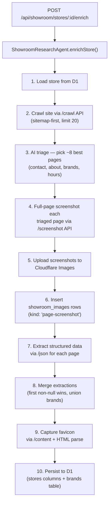

OPEN_QUESTIONS.md — Site/URL cleanup + roadmap
Legend: ⛔ blocks the named phase until answered. Pulled from your DRAFT_SITEMAP_NOTES.md [BROKEN?] / [HOLD] / "?" markers + ambiguities I found.

Naming & namespace conventions (⛔ Phase 1 — decide once, applies everywhere)

1. Singular vs plural: showroom vs showrooms, store vs stores, brand vs brands, product vs products — you used both. Canonical form for each collection route?
   > > Plural
   > > design vs designs: you wrote /admin/design/\* and /admin/designs/layouts/[id]. Pick one (I'll assume design).
   > > designs
   > > PMO namespace: confirm /admin/pmo/{operations,schedule/contractor} as the project-management home (vs folding into /admin/planning)?
   > > /admin/pmo/operations; /admin/pmo/schedule/contractor;  
   > > fyi, pmo = program management office

Taxonomy under config: /admin/brands/types → /admin/config/brands/types — should all taxonomy/enums live under /admin/config/\*?

> > For /admin/config/brands/types, yes definititely.

Deletions — hard-delete (with redirect) vs archive? (⛔ Phase 1)

> > I assume you are talking abnout hard deleting the items in the list that I marked as delete? Then if so, yes -- hard delete. --I would just ask that you keep a tally of which urls are being delete so we can make sure to replant.

/gallery, /supporting-docs, /photo-edits, /docs/[audience]/[slug], /docs/homeowners/permits, /admin/planning/decision-room, /admin/planning/moodboards(/[slug]), /admin/showrooms/[id]/brands/[brandId] — all confirmed hard-delete?

> > All of them confirmed for hard delete but preserve their desk stuff.

Questionnaire: /questionnaire\* → /admin/planning/questionnaire marked "HOLD, potentially delete." Move-and-keep, or delete now?

> > Move && Keep

Contractor/public boundary (⛔ Phase 1)

kitchen-layout is tagged [CONTRACTOR] but targeted to /admin/designs/layouts/[id] (an admin path). Which is it — public or admin?

> > ADMIN

/planning/design-master-plan is [CONTRACTOR] (public) but reads from /admin/design/decision-room (admin) config — confirm it's a public read-only render of admin data?

> > Public read-only render -- although it i possible for contractor to drop comments on the design-master-plan

Mood boards: public vs admin — the old sidebar had a conditional public "Mood Boards"; the new spec puts them all under /admin/design/\*. Any public moodboard view?

> > Not currently planned. The moodboard will be shared via the /planning/design-master-plan

Documents (⛔ Phase 2)
View-visibility precedence: a view marked contractor-visible exposes its member docs even if a doc is private — confirm the exact precedence + that the amber warnings fire on
(a) dynamic views lacking a visibility:public filter and (b) static views containing private docs.

> > This will be our default behavior

CAD/unpreviewable types: which extensions get the "download only" treatment vs an attempted preview?

> > Any documents that cannot be previewed in an iframe

Reusable uploader: confirm the OCR path (Workers AI VisionAI vs external) and that embeddings go to the existing Vectorize index.

> > you will use npm i @llamaindex/liteparse and workers ai vision to parse the oducment content

```tsx
try {
      // 2. Read the image binary data directly from the request body
      const imageBuffer = await request.arrayBuffer();
      const imageArray = [...new Uint8Array(imageBuffer)];

      // 3. Define the prompt optimized for structural text extraction
      const prompt = "Act as an OCR engine. Extract all readable text from this image exactly as it appears. Do not summarize, interpret, or add conversational filler. Maintain layout spacing where possible.";

      // 4. Invoke a hosted multimodal model via Workers AI
      const aiResponse = await env.AI.run("@cf/meta/llama-3.2-11b-vision-instruct", {
        image: imageArray,
        prompt: prompt,
        max_tokens: 1024,
      });

      // 5. Return the extracted text
      return new Response(JSON.stringify({ text: aiResponse.description || aiResponse.response || aiResponse }), {
        status: 200,
        headers: {
          "Content-Type": "application/json",
          "Access-Control-Allow-Origin": "*", // Enable CORS for frontend applications
        },
      });

    } catch (error: any) {
      return new Response(
        JSON.stringify({ error: "OCR processing failed", details: error.message }),
        { status: 500, headers: { "Content-Type": "application/json" } }
      );
    }
  },
} satisfies ExportedHandler<Env>;

```

Companies CRM (⛔ Phase 3)

Gmail integration (/admin/companies/[id]/emails) — this is the big one: which Google account, OAuth scopes (read + send?), and is domain-based thread matching acceptable for privacy? This likely needs its own mini-spec.

> > You will use existing secret store secrets for pulling down email content from our service account Domain Wide delegation -- The system should scan for new emails on my account (justin@126colby.com) every few hours by running search strings against the email domains of each contractor found in the d1 database -- any email snet to or from an email address belonging to the contractor currently being sought <via email domain> should be duduplicated against any priors email threads/messages received and already indexed -- the system should always capture email content in d1 -- we should capture a d1 table for gmail_threads (id auto pk, thread_id, timestamp_sent, subject) -- and -- gmail_messages (id auto pk, thread_id (fk but fk based on thread_id not thread.id -- thread_id is native to gmail api) , message_id [native to gmail api], timestamp, from_recipient:STRING, to_recipients:[STRING], subject:STRING, body:STRING, ai_summary:STRING, rag_uuid:STRING) -- message body has embeddings run and is then vectorized along with the rag_uuid and message_id and thread_id as the metadata in vectorize.

From here, you will provide the ability to review emails incoming and to send emails outgoing as reply alls via gmail api -- the user will send the emails, but the interface must be very seamless and must also offer workers-ai support to help the user draft the message.

There should be a cloudflare agent sdk setup that is studying each and every email and has all theat context and content loaded up in vectorize and is able to query against vectorize based on the current thread_id and then searching based on the parties involved. Having the agent read into whats going on is very helpful so that its responses are rooted in closer to reality. Eventually down the road, we will install some automated triggers based on incoming emails like -- having the agent to send out reminders on tasks being do and asking for follow up in email .. then if the contractor / user [whoeever the email was sent to] responds on the email with an update, then the agent would know how to stage the change immediately so the task is now updated in the system -- again, this automation from email trigger is new stuff and not within scope for this current iteration. I merely offered you this because i hope that you now understand why we are including it -- not just for the convenience of being able to review and respond directly within the app but also because of the future automation teed up and this is the leg work now.

````markdown
     {
      "binding": "GOOGLE_CREDS_SA_PRIVATE_KEY_PT_1",
      "store_id": "8c42fa70938644e0a8a109744467375f",
      "secret_name": "GOOGLE_CREDS_SA_PRIVATE_KEY_PT_1",
    },
    {
      "binding": "GOOGLE_CREDS_SA_PRIVATE_KEY_PT_2",
      "store_id": "8c42fa70938644e0a8a109744467375f",
      "secret_name": "GOOGLE_CREDS_SA_PRIVATE_KEY_PT_2",
    },
    {
      "binding": "GOOGLE_CREDS_SA_CLIENT_EMAIL",
      "store_id": "8c42fa70938644e0a8a109744467375f",
      "secret_name": "GOOGLE_CREDS_SA_CLIENT_EMAIL",
    },
    ```


    ```bash
    npx shadcn@latest add sidebar-09
    ```

    ```tsx
    import { AppSidebar } from "@/components/app-sidebar"

import {
Breadcrumb,
BreadcrumbItem,
BreadcrumbLink,
BreadcrumbList,
BreadcrumbPage,
BreadcrumbSeparator,
} from "@/components/ui/breadcrumb"
import { Separator } from "@/components/ui/separator"
import {
SidebarInset,
SidebarProvider,
SidebarTrigger,
} from "@/components/ui/sidebar"

export default function Page() {
return (
<SidebarProvider
style={
{
"--sidebar-width": "350px",
} as React.CSSProperties
} >
<AppSidebar />
<SidebarInset>
<header className="sticky top-0 flex shrink-0 items-center gap-2 border-b bg-background p-4">
<SidebarTrigger className="-ml-1" />
<Separator
            orientation="vertical"
            className="mr-2 data-[orientation=vertical]:h-4"
          />
<Breadcrumb>
<BreadcrumbList>
<BreadcrumbItem className="hidden md:block">
<BreadcrumbLink href="#">All Inboxes</BreadcrumbLink>
</BreadcrumbItem>
<BreadcrumbSeparator className="hidden md:block" />
<BreadcrumbItem>
<BreadcrumbPage>Inbox</BreadcrumbPage>
</BreadcrumbItem>
</BreadcrumbList>
</Breadcrumb>
</header>
<div className="flex flex-1 flex-col gap-4 p-4">
{Array.from({ length: 24 }).map((\_, index) => (
<div
              key={index}
              className="aspect-video h-12 w-full rounded-lg bg-muted/50"
            />
))}
</div>
</SidebarInset>
</SidebarProvider>
)
}

    ```

    ```tsx

"use client"

import \* as React from "react"
import { ArchiveX, Command, File, Inbox, Send, Trash2 } from "lucide-react"

import { NavUser } from "@/components/nav-user"
import { Label } from "@/components/ui/label"
import {
Sidebar,
SidebarContent,
SidebarFooter,
SidebarGroup,
SidebarGroupContent,
SidebarHeader,
SidebarInput,
SidebarMenu,
SidebarMenuButton,
SidebarMenuItem,
useSidebar,
} from "@/components/ui/sidebar"
import { Switch } from "@/components/ui/switch"

// This is sample data
const data = {
user: {
name: "shadcn",
email: "m@example.com",
avatar: "/avatars/shadcn.jpg",
},
navMain: [
{
title: "Inbox",
url: "#",
icon: Inbox,
isActive: true,
},
{
title: "Drafts",
url: "#",
icon: File,
isActive: false,
},
{
title: "Sent",
url: "#",
icon: Send,
isActive: false,
},
{
title: "Junk",
url: "#",
icon: ArchiveX,
isActive: false,
},
{
title: "Trash",
url: "#",
icon: Trash2,
isActive: false,
},
],
mails: [
{
name: "William Smith",
email: "williamsmith@example.com",
subject: "Meeting Tomorrow",
date: "09:34 AM",
teaser:
"Hi team, just a reminder about our meeting tomorrow at 10 AM.\nPlease come prepared with your project updates.",
},
{
name: "Alice Smith",
email: "alicesmith@example.com",
subject: "Re: Project Update",
date: "Yesterday",
teaser:
"Thanks for the update. The progress looks great so far.\nLet's schedule a call to discuss the next steps.",
},
{
name: "Bob Johnson",
email: "bobjohnson@example.com",
subject: "Weekend Plans",
date: "2 days ago",
teaser:
"Hey everyone! I'm thinking of organizing a team outing this weekend.\nWould you be interested in a hiking trip or a beach day?",
},
{
name: "Emily Davis",
email: "emilydavis@example.com",
subject: "Re: Question about Budget",
date: "2 days ago",
teaser:
"I've reviewed the budget numbers you sent over.\nCan we set up a quick call to discuss some potential adjustments?",
},
{
name: "Michael Wilson",
email: "michaelwilson@example.com",
subject: "Important Announcement",
date: "1 week ago",
teaser:
"Please join us for an all-hands meeting this Friday at 3 PM.\nWe have some exciting news to share about the company's future.",
},
{
name: "Sarah Brown",
email: "sarahbrown@example.com",
subject: "Re: Feedback on Proposal",
date: "1 week ago",
teaser:
"Thank you for sending over the proposal. I've reviewed it and have some thoughts.\nCould we schedule a meeting to discuss my feedback in detail?",
},
{
name: "David Lee",
email: "davidlee@example.com",
subject: "New Project Idea",
date: "1 week ago",
teaser:
"I've been brainstorming and came up with an interesting project concept.\nDo you have time this week to discuss its potential impact and feasibility?",
},
{
name: "Olivia Wilson",
email: "oliviawilson@example.com",
subject: "Vacation Plans",
date: "1 week ago",
teaser:
"Just a heads up that I'll be taking a two-week vacation next month.\nI'll make sure all my projects are up to date before I leave.",
},
{
name: "James Martin",
email: "jamesmartin@example.com",
subject: "Re: Conference Registration",
date: "1 week ago",
teaser:
"I've completed the registration for the upcoming tech conference.\nLet me know if you need any additional information from my end.",
},
{
name: "Sophia White",
email: "sophiawhite@example.com",
subject: "Team Dinner",
date: "1 week ago",
teaser:
"To celebrate our recent project success, I'd like to organize a team dinner.\nAre you available next Friday evening? Please let me know your preferences.",
},
],
}

export function AppSidebar({ ...props }: React.ComponentProps<typeof Sidebar>) {
// Note: I'm using state to show active item.
// IRL you should use the url/router.
const [activeItem, setActiveItem] = React.useState(data.navMain[0])
const [mails, setMails] = React.useState(data.mails)
const { setOpen } = useSidebar()

return (
<Sidebar
collapsible="icon"
className="overflow-hidden _:data-[sidebar=sidebar]:flex-row"
{...props} >
{/_ This is the first sidebar _/}
{/_ We disable collapsible and adjust width to icon. _/}
{/_ This will make the sidebar appear as icons. _/}
<Sidebar
        collapsible="none"
        className="w-[calc(var(--sidebar-width-icon)+1px)]! border-r"
      >
<SidebarHeader>
<SidebarMenu>
<SidebarMenuItem>
<SidebarMenuButton size="lg" asChild className="md:h-8 md:p-0">
<a href="#">
<div className="flex aspect-square size-8 items-center justify-center rounded-lg bg-sidebar-primary text-sidebar-primary-foreground">
<Command className="size-4" />
</div>
<div className="grid flex-1 text-left text-sm leading-tight">
<span className="truncate font-medium">Acme Inc</span>
<span className="truncate text-xs">Enterprise</span>
</div>
</a>
</SidebarMenuButton>
</SidebarMenuItem>
</SidebarMenu>
</SidebarHeader>
<SidebarContent>
<SidebarGroup>
<SidebarGroupContent className="px-1.5 md:px-0">
<SidebarMenu>
{data.navMain.map((item) => (
<SidebarMenuItem key={item.title}>
<SidebarMenuButton
tooltip={{
                        children: item.title,
                        hidden: false,
                      }}
onClick={() => {
setActiveItem(item)
const mail = data.mails.sort(() => Math.random() - 0.5)
setMails(
mail.slice(
0,
Math.max(5, Math.floor(Math.random() _ 10) + 1)
)
)
setOpen(true)
}}
isActive={activeItem?.title === item.title}
className="px-2.5 md:px-2" >
<item.icon />
<span>{item.title}</span>
</SidebarMenuButton>
</SidebarMenuItem>
))}
</SidebarMenu>
</SidebarGroupContent>
</SidebarGroup>
</SidebarContent>
<SidebarFooter>
<NavUser user={data.user} />
</SidebarFooter>
</Sidebar>

      {/* This is the second sidebar */}
      {/* We disable collapsible and let it fill remaining space */}
      <Sidebar collapsible="none" className="hidden flex-1 md:flex">
        <SidebarHeader className="gap-3.5 border-b p-4">
          <div className="flex w-full items-center justify-between">
            <div className="text-base font-medium text-foreground">
              {activeItem?.title}
            </div>
            <Label className="flex items-center gap-2 text-sm">
              <span>Unreads</span>
              <Switch className="shadow-none" />
            </Label>
          </div>
          <SidebarInput placeholder="Type to search..." />
        </SidebarHeader>
        <SidebarContent>
          <SidebarGroup className="px-0">
            <SidebarGroupContent>
              {mails.map((mail) => (
                <a
                  href="#"
                  key={mail.email}
                  className="flex flex-col items-start gap-2 border-b p-4 text-sm leading-tight whitespace-nowrap last:border-b-0 hover:bg-sidebar-accent hover:text-sidebar-accent-foreground"
                >
                  <div className="flex w-full items-center gap-2">
                    <span>{mail.name}</span>{" "}
                    <span className="ml-auto text-xs">{mail.date}</span>
                  </div>
                  <span className="font-medium">{mail.subject}</span>
                  <span className="line-clamp-2 w-[260px] text-xs whitespace-break-spaces">
                    {mail.teaser}
                  </span>
                </a>
              ))}
            </SidebarGroupContent>
          </SidebarGroup>
        </SidebarContent>
      </Sidebar>
    </Sidebar>

)
}

    ```


    ```tsx

"use client"

import {
BadgeCheck,
Bell,
ChevronsUpDown,
CreditCard,
LogOut,
Sparkles,
} from "lucide-react"

import {
Avatar,
AvatarFallback,
AvatarImage,
} from "@/components/ui/avatar"
import {
DropdownMenu,
DropdownMenuContent,
DropdownMenuGroup,
DropdownMenuItem,
DropdownMenuLabel,
DropdownMenuSeparator,
DropdownMenuTrigger,
} from "@/components/ui/dropdown-menu"
import {
SidebarMenu,
SidebarMenuButton,
SidebarMenuItem,
useSidebar,
} from "@/components/ui/sidebar"

export function NavUser({
user,
}: {
user: {
name: string
email: string
avatar: string
}
}) {
const { isMobile } = useSidebar()

return (
<SidebarMenu>
<SidebarMenuItem>
<DropdownMenu>
<DropdownMenuTrigger asChild>
<SidebarMenuButton
              size="lg"
              className="data-[state=open]:bg-sidebar-accent data-[state=open]:text-sidebar-accent-foreground md:h-8 md:p-0"
            >
<Avatar className="h-8 w-8 rounded-lg">
<AvatarImage src={user.avatar} alt={user.name} />
<AvatarFallback className="rounded-lg">CN</AvatarFallback>
</Avatar>
<div className="grid flex-1 text-left text-sm leading-tight">
<span className="truncate font-medium">{user.name}</span>
<span className="truncate text-xs">{user.email}</span>
</div>
<ChevronsUpDown className="ml-auto size-4" />
</SidebarMenuButton>
</DropdownMenuTrigger>
<DropdownMenuContent
className="w-(--radix-dropdown-menu-trigger-width) min-w-56 rounded-lg"
side={isMobile ? "bottom" : "right"}
align="end"
sideOffset={4} >
<DropdownMenuLabel className="p-0 font-normal">
<div className="flex items-center gap-2 px-1 py-1.5 text-left text-sm">
<Avatar className="h-8 w-8 rounded-lg">
<AvatarImage src={user.avatar} alt={user.name} />
<AvatarFallback className="rounded-lg">CN</AvatarFallback>
</Avatar>
<div className="grid flex-1 text-left text-sm leading-tight">
<span className="truncate font-medium">{user.name}</span>
<span className="truncate text-xs">{user.email}</span>
</div>
</div>
</DropdownMenuLabel>
<DropdownMenuSeparator />
<DropdownMenuGroup>
<DropdownMenuItem>
<Sparkles />
Upgrade to Pro
</DropdownMenuItem>
</DropdownMenuGroup>
<DropdownMenuSeparator />
<DropdownMenuGroup>
<DropdownMenuItem>
<BadgeCheck />
Account
</DropdownMenuItem>
<DropdownMenuItem>
<CreditCard />
Billing
</DropdownMenuItem>
<DropdownMenuItem>
<Bell />
Notifications
</DropdownMenuItem>
</DropdownMenuGroup>
<DropdownMenuSeparator />
<DropdownMenuItem>
<LogOut />
Log out
</DropdownMenuItem>
</DropdownMenuContent>
</DropdownMenu>
</SidebarMenuItem>
</SidebarMenu>
)
}

    ```

PIN/token auth for /bid: "likely just their phone number" as the PIN — confirm (phone-as-PIN is low-entropy; OK for this use, or want a generated token?).

> > phone number is just fine for now

Bids / Budget / Estimates (⛔ Phase 6)

Estimates vs Bids: /admin/estimates marked [DELETE] (fold into /admin/bids) — but /admin/estimates/new should "stay as a button." Confirm: estimates list is deleted, manual-estimate intake survives as /admin/bids/new?

> > Confirmed! estimates list is deleted, manual-estimate intake survives as /admin/bids/new?

/budget-reconciliation — "is this different from the Seed Homeowner Plan button on budget-tracker?" Same feature or distinct?

> > I think its the same in terms of whether it syncs from google spreadsheet directly via api or a CSV is uploaded, its still data that needs to be reconciled.
> > See src/frontend/components/BudgetReconciliationApp.tsx
> > See /api/budget-tracker/csv-ingestion

Showroom/sourcing "broken" routes (⛔ Phase 5 — confirm intended behavior)

/admin/showroom/schedule — obsolete now that hours show on the hero? (You proposed hours-on-hero → hyperlink to the full M–Sun D1 hours table.) Delete schedule?

> > 2 things should be shown here

> > 1.  Continue to show the hours on the header hero, just tighten that shit up and make it look professh.

```shell
npx shadcn add "https://ui.beste.co/r-base/footer55?email=jmbish04%40gmail.com&license_key=62M6-HGZ4-QQSG-QRET"
```
````

````markdown
This is a fantastic layout strategy for a local business page. Putting highly actionable items—like a click-to-call phone number, a map-linked address, and clear showroom hours—right in the hero section drastically improves mobile user experience and conversion rates.

I have transformed your footer component into a fully functional `BusinessHero` component.

Here are the key changes made to meet your requirements:

- **Showroom Hours:** Replaced the generic office hours with a prominent "Showroom Hours" section inside an elevated card.
- **Actionable Contact Info:** The phone number is now wrapped in a `tel:` link (stripping non-numeric characters automatically), and the address is wrapped in a dynamic Google Maps search link.
- **Conditional Social Icons:** I added a custom standard SVG for Pinterest (as it isn't always natively available in `lucide-react`) alongside Facebook and Instagram. The component maps through the provided URLs and strictly renders only the icons that have a valid link.
- **Hero Layout:** Shifted the architecture to a standard split hero (Left: Value Proposition + Calls to Action / Right: Showroom & Contact Card).

Here is the full, end-to-end code for your new component.

```tsx
"use client";

import {
  Calendar,
  Clock,
  Facebook,
  Instagram,
  type LucideIcon,
  MapPin,
  Phone,
  ArrowRight,
} from "lucide-react";
import Link from "next/link";
import { Button } from "@/components/ui/button";
import { cn } from "@/lib/utils";

// --- Custom Pinterest Icon (Fallback if not in lucide-react) ---
const Pinterest = ({ className }: { className?: string }) => (
  <svg
    className={className}
    fill="currentColor"
    viewBox="0 0 24 24"
    aria-hidden="true"
  >
    <path d="M12.017 0C5.396 0 .029 5.367.029 11.987c0 5.079 3.158 9.417 7.618 11.162-.105-.949-.199-2.403.041-3.439.219-.937 1.406-5.957 1.406-5.957s-.359-.72-.359-1.781c0-1.663.967-2.911 2.168-2.911 1.024 0 1.518.769 1.518 1.688 0 1.029-.653 2.567-.992 3.992-.285 1.193.6 2.165 1.775 2.165 2.128 0 3.768-2.245 3.768-5.487 0-2.861-2.063-4.869-5.008-4.869-3.41 0-5.409 2.562-5.409 5.199 0 1.033.394 2.143.889 2.741.099.12.112.225.085.345-.09.375-.293 1.199-.334 1.363-.053.225-.172.271-.401.165-1.495-.69-2.433-2.878-2.433-4.646 0-3.776 2.748-7.252 7.951-7.252 4.181 0 7.422 2.977 7.422 6.945 0 4.157-2.618 7.502-6.257 7.502-1.22 0-2.368-.633-2.76-1.38l-.752 2.861c-.272 1.039-1.011 2.34-1.506 3.133 1.15.352 2.373.541 3.639.541 6.621 0 11.988-5.368 11.988-11.987C24.004 5.367 18.638 0 12.017 0z" />
  </svg>
);

interface ButtonItem {
  label: string;
  href?: string;
  variant?:
    | "default"
    | "secondary"
    | "outline"
    | "ghost"
    | "link"
    | "destructive";
  icon?: LucideIcon;
}

interface SocialLinks {
  facebook?: string;
  instagram?: string;
  pinterest?: string;
}

interface ContactInfo {
  phone?: string;
  address?: string;
}

interface ShowroomHours {
  weekday?: string;
  weekend?: string;
}

interface BusinessHeroProps {
  badge?: string;
  title: string;
  subtitle?: string;
  buttons?: ButtonItem[];
  showroomHours?: ShowroomHours;
  contact?: ContactInfo;
  socials?: SocialLinks;
  className?: string;
}

// Map social keys to their respective components
const socialIconMap = {
  facebook: Facebook,
  instagram: Instagram,
  pinterest: Pinterest,
};

export const businessHeroDemo: BusinessHeroProps = {
  badge: "Welcome to Beste Inc.",
  title: "Elevate Your Smile, Transform Your Life.",
  subtitle:
    "Experience world-class dentistry in a modern, comfortable environment. We prioritize your health, comfort, and confidence above all else.",
  buttons: [
    {
      label: "Book Appointment",
      href: "/book",
      icon: Calendar,
      variant: "default",
    },
    {
      label: "Our Services",
      href: "/services",
      icon: ArrowRight,
      variant: "outline",
    },
  ],
  showroomHours: {
    weekday: "Mon - Fri: 8:00 AM - 6:00 PM",
    weekend: "Saturday: 9:00 AM - 2:00 PM",
  },
  contact: {
    phone: "(555) 123-SMILE",
    address: "321 Dental Plaza, Suite 100, Miami, FL 33101",
  },
  socials: {
    instagram: "https://instagram.com",
    facebook: "https://facebook.com",
    // Pinterest is intentionally left blank in the demo to show it hides properly.
    // Add a URL below to see it appear.
    pinterest: "",
  },
};

export function BusinessHero({
  badge,
  title,
  subtitle,
  buttons = [],
  showroomHours,
  contact,
  socials,
  className,
}: BusinessHeroProps = businessHeroDemo) {
  // Filter out any social links that don't have a valid URL provided
  const activeSocials = Object.entries(socials || {}).filter(
    ([_, url]) => url && url.trim() !== "",
  );

  return (
    <section
      className={cn(
        "relative overflow-hidden bg-background py-16 md:py-24 lg:py-32 border-b",
        className,
      )}
    >
      <div className="mx-auto max-w-7xl px-4 md:px-6">
        <div className="grid gap-12 lg:grid-cols-2 lg:gap-16 items-center">
          {/* Left Column: Hero Content */}
          <div className="flex flex-col items-start space-y-6">
            {badge && (
              <span className="inline-flex items-center rounded-full border bg-muted/50 px-3 py-1 text-sm font-medium">
                {badge}
              </span>
            )}
            <h1 className="text-4xl font-extrabold tracking-tight sm:text-5xl md:text-6xl lg:text-7xl">
              {title}
            </h1>
            {subtitle && (
              <p className="max-w-[42rem] leading-normal text-muted-foreground sm:text-xl sm:leading-8">
                {subtitle}
              </p>
            )}

            {buttons.length > 0 && (
              <div className="flex flex-wrap items-center gap-4 pt-4">
                {buttons.map((button, index) => {
                  const Icon = button.icon;
                  return (
                    <Button
                      key={index}
                      variant={button.variant ?? "default"}
                      size="lg"
                      asChild
                    >
                      <Link href={button.href ?? "#"}>
                        {Icon && <Icon className="mr-2 size-5" />}
                        {button.label}
                      </Link>
                    </Button>
                  );
                })}
              </div>
            )}
          </div>

          {/* Right Column: Interactive Showroom & Contact Card */}
          <div className="relative mx-auto w-full max-w-lg lg:max-w-none">
            {/* Optional decorative background blob */}
            <div className="absolute -inset-4 bg-primary/10 blur-3xl rounded-full opacity-50 pointer-events-none" />

            <div className="relative flex flex-col gap-8 rounded-2xl border bg-card p-8 shadow-lg">
              {/* Showroom Hours */}
              {showroomHours && (
                <div>
                  <h3 className="flex items-center gap-2 text-lg font-semibold text-foreground mb-4">
                    <Clock className="size-5 text-primary" />
                    Showroom Hours
                  </h3>
                  <div className="space-y-2 text-muted-foreground">
                    {showroomHours.weekday && (
                      <p className="flex justify-between items-center bg-muted/30 p-3 rounded-md">
                        <span className="font-medium">Weekdays</span>
                        <span>
                          {showroomHours.weekday.split(": ")[1] ||
                            showroomHours.weekday}
                        </span>
                      </p>
                    )}
                    {showroomHours.weekend && (
                      <p className="flex justify-between items-center bg-muted/30 p-3 rounded-md">
                        <span className="font-medium">Weekends</span>
                        <span>
                          {showroomHours.weekend.split(": ")[1] ||
                            showroomHours.weekend}
                        </span>
                      </p>
                    )}
                  </div>
                </div>
              )}

              {/* Contact Information */}
              {contact && (
                <div>
                  <h3 className="text-sm font-semibold text-muted-foreground uppercase tracking-wider mb-4">
                    Visit & Contact
                  </h3>
                  <div className="space-y-4">
                    {contact.phone && (
                      <a
                        href={`tel:${contact.phone.replace(/\D/g, "")}`}
                        className="group flex items-center gap-4 p-3 rounded-lg border bg-background hover:border-primary/50 hover:shadow-sm transition-all"
                      >
                        <div className="flex h-10 w-10 shrink-0 items-center justify-center rounded-full bg-primary/10 text-primary group-hover:bg-primary group-hover:text-primary-foreground transition-colors">
                          <Phone className="size-5" />
                        </div>
                        <div>
                          <p className="text-sm font-medium text-foreground">
                            Call Us Today
                          </p>
                          <p className="text-sm text-muted-foreground group-hover:text-primary transition-colors">
                            {contact.phone}
                          </p>
                        </div>
                      </a>
                    )}

                    {contact.address && (
                      <a
                        href={`https://maps.google.com/?q=${encodeURIComponent(contact.address)}`}
                        target="_blank"
                        rel="noopener noreferrer"
                        className="group flex items-center gap-4 p-3 rounded-lg border bg-background hover:border-primary/50 hover:shadow-sm transition-all"
                      >
                        <div className="flex h-10 w-10 shrink-0 items-center justify-center rounded-full bg-primary/10 text-primary group-hover:bg-primary group-hover:text-primary-foreground transition-colors">
                          <MapPin className="size-5" />
                        </div>
                        <div>
                          <p className="text-sm font-medium text-foreground">
                            Navigate to Showroom
                          </p>
                          <p className="text-sm text-muted-foreground line-clamp-1 group-hover:text-primary transition-colors">
                            {contact.address}
                          </p>
                        </div>
                      </a>
                    )}
                  </div>
                </div>
              )}

              {/* Social Links (Conditionally Rendered) */}
              {activeSocials.length > 0 && (
                <div className="pt-2 border-t">
                  <p className="text-sm font-medium text-muted-foreground mb-4">
                    Follow Our Journey
                  </p>
                  <div className="flex gap-4">
                    {activeSocials.map(([platform, url]) => {
                      const Icon =
                        socialIconMap[platform as keyof typeof socialIconMap];
                      if (!Icon) return null;

                      return (
                        <a
                          key={platform}
                          href={url}
                          target="_blank"
                          rel="noopener noreferrer"
                          className="flex h-10 w-10 items-center justify-center rounded-full border bg-background text-muted-foreground hover:bg-primary hover:text-primary-foreground hover:border-primary transition-all"
                          aria-label={`Visit our ${platform} page`}
                        >
                          <Icon className="size-5" />
                        </a>
                      );
                    })}
                  </div>
                </div>
              )}
            </div>
          </div>
        </div>
      </div>
    </section>
  );
}
```
````

````


>> 2) Apply the #1 changes to our List and Directory showroom cards -- And apply this tightened profesh shit over to the cards for the showrooms so its very easy to see showroom hours as well as click to call or navigate or brwose socials


>> 3) Make the showroom hours card (from the hero only .. we dont want this larger view hours modal to appear anywhere other than within the showroom viewport) clickable to showcase the full scheudle in a modal along with the other information such as phone, email, address etc.

```shell
npx shadcn add "https://ui.beste.co/r-base/food38?email=jmbish04%40gmail.com&license_key=62M6-HGZ4-QQSG-QRET"

````

````markdown
This is a great evolution for the component. Transitioning this from a generic restaurant block into a polished, modal-friendly Showroom Hours component makes a lot of sense for a homeowners app.

Here are the specific upgrades I've made to fit your use case:

- **Modal-Optimized Layout:** I removed the massive vertical padding (`py-16 md:py-24`) that makes sense on a full page but ruins the UX inside a modal. The layout is now tighter and more contained.
- **Homeowner-Centric Header:** The copy has been swapped from "We look forward to serving you" to a more professional "Plan your visit or get in touch with our design team."
- **Interactive Address Card:** I added the `address` prop. To accommodate the potential length of a physical address, the phone and email sit side-by-side, while the address spans full-width underneath them. It is wrapped in a dynamic Google Maps hyperlink.
- **Strict Conditional Socials:** Just like the Hero component, Facebook, Instagram, and Pinterest are supported. The component dynamically filters the list and _only_ renders the wrapper and icons if a valid URL string is provided.
- **Hyperlink Safety:** The `tel:` link automatically strips all non-numeric characters (except the leading `+` if present) so it never fails on mobile dialers.

Here is your fully updated, end-to-end component.

```tsx
"use client";

import {
  AlertCircle,
  Clock,
  Facebook,
  Instagram,
  Mail,
  MapPin,
  MessageCircle,
  Phone,
} from "lucide-react";

import { Badge } from "@/components/ui/badge";
import { Button } from "@/components/ui/button";
import Link from "next/link";
import { cn } from "@/lib/utils";

// --- Custom Pinterest Icon ---
const Pinterest = ({ className }: { className?: string }) => (
  <svg
    className={className}
    fill="currentColor"
    viewBox="0 0 24 24"
    aria-hidden="true"
  >
    <path d="M12.017 0C5.396 0 .029 5.367.029 11.987c0 5.079 3.158 9.417 7.618 11.162-.105-.949-.199-2.403.041-3.439.219-.937 1.406-5.957 1.406-5.957s-.359-.72-.359-1.781c0-1.663.967-2.911 2.168-2.911 1.024 0 1.518.769 1.518 1.688 0 1.029-.653 2.567-.992 3.992-.285 1.193.6 2.165 1.775 2.165 2.128 0 3.768-2.245 3.768-5.487 0-2.861-2.063-4.869-5.008-4.869-3.41 0-5.409 2.562-5.409 5.199 0 1.033.394 2.143.889 2.741.099.12.112.225.085.345-.09.375-.293 1.199-.334 1.363-.053.225-.172.271-.401.165-1.495-.69-2.433-2.878-2.433-4.646 0-3.776 2.748-7.252 7.951-7.252 4.181 0 7.422 2.977 7.422 6.945 0 4.157-2.618 7.502-6.257 7.502-1.22 0-2.368-.633-2.76-1.38l-.752 2.861c-.272 1.039-1.011 2.34-1.506 3.133 1.15.352 2.373.541 3.639.541 6.621 0 11.988-5.368 11.988-11.987C24.004 5.367 18.638 0 12.017 0z" />
  </svg>
);

const socialIconMap = {
  facebook: Facebook,
  instagram: Instagram,
  pinterest: Pinterest,
};

interface DayHours {
  day: string;
  hours: string;
  isToday?: boolean;
}

interface ButtonItem {
  label: string;
  href: string;
  icon?: React.ReactNode;
}

interface SocialLinks {
  facebook?: string;
  instagram?: string;
  pinterest?: string;
}

interface ShowroomContactProps {
  heading?: string;
  description?: string;
  schedule: DayHours[];
  holidayNotice?: string;
  phone?: string;
  email?: string;
  address?: string;
  socials?: SocialLinks;
  buttons?: ButtonItem[];
  labels?: {
    openingHours?: string;
    today?: string;
    holidayHours?: string;
    callUs?: string;
    emailUs?: string;
    address?: string;
    followUs?: string;
  };
  className?: string;
}

export const showroomContactDemo: ShowroomContactProps = {
  heading: "Showroom Hours & Location",
  description: "Plan your visit or get in touch with our design team.",
  schedule: [
    { day: "Monday", hours: "9:00 AM - 6:00 PM" },
    { day: "Tuesday", hours: "9:00 AM - 6:00 PM" },
    { day: "Wednesday", hours: "9:00 AM - 6:00 PM" },
    { day: "Thursday", hours: "9:00 AM - 8:00 PM" },
    { day: "Friday", hours: "9:00 AM - 6:00 PM", isToday: true },
    { day: "Saturday", hours: "10:00 AM - 4:00 PM" },
    { day: "Sunday", hours: "Closed" },
  ],
  holidayNotice:
    "Our showroom will be closed on Thanksgiving and Christmas Day.",
  phone: "(555) 867-5309",
  email: "design@beste.co",
  address: "321 Design District Blvd, Suite 100, Miami, FL 33101",
  socials: {
    instagram: "https://instagram.com",
    pinterest: "https://pinterest.com",
    facebook: "", // Left blank intentionally; won't render
  },
  buttons: [
    {
      label: "Start Live Chat",
      href: "/chat",
      icon: <MessageCircle className="mr-2 size-4" />,
    },
  ],
  labels: {
    openingHours: "Showroom Hours",
    today: "Today",
    holidayHours: "Holiday Notice",
    callUs: "Call Us",
    emailUs: "Email Us",
    address: "Visit Us",
    followUs: "Find Inspiration",
  },
};

export function ShowroomContact({
  heading,
  description,
  schedule = [],
  holidayNotice,
  phone,
  email,
  address,
  socials,
  buttons = [],
  labels = {},
  className,
}: ShowroomContactProps = showroomContactDemo) {
  const {
    openingHours: openingHoursLabel = "Showroom Hours",
    today: todayLabel = "Today",
    holidayHours: holidayHoursLabel = "Holiday Notice",
    callUs: callUsLabel = "Call Us",
    emailUs: emailUsLabel = "Email Us",
    address: addressLabel = "Visit Us",
    followUs: followUsLabel = "Find Inspiration",
  } = labels;

  // Filter out any social links that don't have a valid URL provided
  const activeSocials = Object.entries(socials || {}).filter(
    ([_, url]) => url && url.trim() !== "",
  );

  return (
    <div className={cn("w-full py-6 md:py-8", className)}>
      <div className="mx-auto max-w-xl px-4 md:px-6">
        {/* Header */}
        <div className="mb-8 text-center">
          {heading && (
            <h2 className="text-2xl font-bold tracking-tight md:text-3xl">
              {heading}
            </h2>
          )}
          {description && (
            <p className="mt-2 text-sm text-muted-foreground">{description}</p>
          )}
        </div>

        <div className="mx-auto w-full">
          {/* Hours Table */}
          <div className="mb-6 rounded-xl border bg-card p-5 shadow-sm">
            <div className="mb-4 flex items-center gap-2">
              <Clock className="size-5 text-primary" />
              <h3 className="font-semibold text-foreground">
                {openingHoursLabel}
              </h3>
            </div>
            <div className="space-y-1">
              {schedule.map((item, index) => (
                <div
                  key={index}
                  className={cn(
                    "flex items-center justify-between rounded-lg px-3 py-2.5 text-sm transition-colors",
                    item.isToday ? "bg-primary/10" : "hover:bg-muted/50",
                  )}
                >
                  <div className="flex items-center gap-2">
                    <span
                      className={cn(
                        "text-muted-foreground",
                        item.isToday && "font-medium text-primary",
                      )}
                    >
                      {item.day}
                    </span>
                    {item.isToday && (
                      <Badge
                        variant="default"
                        className="text-[10px] px-1.5 py-0 h-5"
                      >
                        {todayLabel}
                      </Badge>
                    )}
                  </div>
                  <span
                    className={cn(
                      "text-muted-foreground",
                      item.isToday && "font-semibold text-foreground",
                    )}
                  >
                    {item.hours}
                  </span>
                </div>
              ))}
            </div>
          </div>

          {/* Holiday Notice */}
          {holidayNotice && (
            <div className="mb-6 flex items-start gap-3 rounded-xl border border-amber-200 bg-amber-50 p-4 dark:border-amber-900/50 dark:bg-amber-950/20">
              <AlertCircle className="mt-0.5 size-5 flex-shrink-0 text-amber-600 dark:text-amber-500" />
              <div>
                <p className="text-sm font-medium text-amber-900 dark:text-amber-200">
                  {holidayHoursLabel}
                </p>
                <p className="mt-1 text-sm text-amber-700 dark:text-amber-400">
                  {holidayNotice}
                </p>
              </div>
            </div>
          )}

          {/* Contact Methods */}
          <div className="grid gap-3 sm:grid-cols-2">
            {phone && (
              <a
                href={`tel:${phone.replace(/[^\d+]/g, "")}`}
                className="group flex items-start gap-3 rounded-xl border bg-card p-4 hover:border-primary/50 hover:bg-muted/30 hover:shadow-sm transition-all"
              >
                <div className="rounded-full bg-primary/10 p-2 text-primary group-hover:bg-primary group-hover:text-primary-foreground transition-colors">
                  <Phone className="size-4" />
                </div>
                <div>
                  <p className="text-xs font-medium text-muted-foreground uppercase tracking-wider">
                    {callUsLabel}
                  </p>
                  <p className="mt-0.5 text-sm font-semibold text-foreground group-hover:text-primary transition-colors">
                    {phone}
                  </p>
                </div>
              </a>
            )}

            {email && (
              <a
                href={`mailto:${email}`}
                className="group flex items-start gap-3 rounded-xl border bg-card p-4 hover:border-primary/50 hover:bg-muted/30 hover:shadow-sm transition-all"
              >
                <div className="rounded-full bg-primary/10 p-2 text-primary group-hover:bg-primary group-hover:text-primary-foreground transition-colors">
                  <Mail className="size-4" />
                </div>
                <div>
                  <p className="text-xs font-medium text-muted-foreground uppercase tracking-wider">
                    {emailUsLabel}
                  </p>
                  <p className="mt-0.5 text-sm font-semibold text-foreground group-hover:text-primary transition-colors truncate">
                    {email}
                  </p>
                </div>
              </a>
            )}

            {address && (
              <a
                href={`https://maps.google.com/?q=${encodeURIComponent(address)}`}
                target="_blank"
                rel="noopener noreferrer"
                className="group sm:col-span-2 flex items-start gap-3 rounded-xl border bg-card p-4 hover:border-primary/50 hover:bg-muted/30 hover:shadow-sm transition-all"
              >
                <div className="rounded-full bg-primary/10 p-2 text-primary group-hover:bg-primary group-hover:text-primary-foreground transition-colors">
                  <MapPin className="size-4" />
                </div>
                <div>
                  <p className="text-xs font-medium text-muted-foreground uppercase tracking-wider">
                    {addressLabel}
                  </p>
                  <p className="mt-0.5 text-sm font-semibold text-foreground group-hover:text-primary transition-colors">
                    {address}
                  </p>
                </div>
              </a>
            )}
          </div>

          {/* Action Buttons */}
          {buttons.length > 0 && (
            <div className="mt-6 flex flex-wrap justify-center gap-3">
              {buttons.map((button, index) => (
                <Button key={index} asChild className="w-full sm:w-auto">
                  <Link href={button.href}>
                    {button.icon}
                    {button.label}
                  </Link>
                </Button>
              ))}
            </div>
          )}

          {/* Social Links (Conditionally Rendered) */}
          {activeSocials.length > 0 && (
            <div className="mt-8 flex flex-col items-center gap-4 border-t pt-6">
              <p className="text-sm font-medium text-muted-foreground">
                {followUsLabel}
              </p>
              <div className="flex gap-4">
                {activeSocials.map(([platform, url]) => {
                  const Icon =
                    socialIconMap[platform as keyof typeof socialIconMap];
                  if (!Icon) return null;

                  return (
                    <a
                      key={platform}
                      href={url}
                      target="_blank"
                      rel="noopener noreferrer"
                      className="flex h-10 w-10 items-center justify-center rounded-full border bg-card text-muted-foreground hover:border-primary hover:bg-primary/10 hover:text-primary transition-all"
                      aria-label={platform}
                    >
                      <Icon className="size-5" />
                    </a>
                  );
                })}
              </div>
            </div>
          )}
        </div>
      </div>
    </div>
  );
}
```
````

````


## Admin Showroom Flow (Keep/Repurpose/Delete)

- /admin/showroom/{sourcing,progress} — "what did this mean / not sure what this does." Keep, repurpose, or delete?
- /admin/showroom/scan — confirm it's business-card OCR (Workers AI) for POC autofill?
- /admin/showroom/intake — you prefer a dedicated page (linked from a "New showroom" button) over the current modal — confirm.
- /admin/showroom/showrooms/[tab] — delete (no more tabs)?

>> I found it in the code ... we should keep and you should integrate these pages back into our overall flow

```astro

src/frontend/pages/admin/showroom.astro

---
import BaseLayout from "@/layouts/BaseLayout.astro";

const links = [
  { href: "/admin/showroom/schedule", title: "Materials Schedule", desc: "The master list of materials to source." },
  { href: "/admin/showroom/showrooms", title: "Showrooms", desc: "Bay Area hub directory: map, list, and field directory." },
  { href: "/admin/showroom/gaps", title: "Coverage Gaps", desc: "Product areas with no showroom coverage yet." },
  { href: "/admin/showroom/intake", title: "Add Showroom", desc: "Google-powered intake: search, auto-fill, review, save." },
  { href: "/admin/showroom/products", title: "Products", desc: "Cross-store product catalog." },
  { href: "/admin/brands", title: "Brands", desc: "Brand directory with auto-scraped icons + type badges." },
  { href: "/admin/brands/types", title: "Brand Types", desc: "Manage brand type definitions (plumbing, lighting, ...)." },
  { href: "/admin/showroom/research", title: "Deep Research", desc: "Plan-gated sourcing research." },
  { href: "/admin/showroom/compare", title: "Compare", desc: "Side-by-side product decisions." },
  { href: "/admin/showroom/scan", title: "Field Scan", desc: "Capture products at showrooms." },
  { href: "/admin/showroom/progress", title: "Build Progress", desc: "Phased build-out tracker." },
];
---

<BaseLayout
  title="Showroom Planner — The Monolith"
  description="Launchpad for the showroom sourcing suite: materials, showrooms, products, research, compare, and field scan."
>
  <main class="container mx-auto max-w-4xl px-4 py-10">
    <h1 class="text-2xl font-semibold tracking-tight">Showroom Planner</h1>
    <p class="mt-1 text-sm text-muted-foreground">Materials-driven sourcing across Bay Area showrooms.</p>

    <div class="mt-6 grid grid-cols-1 gap-3 sm:grid-cols-2">
      {
        links.map((l) => (
          <a
            href={l.href}
            class="rounded-lg bg-card p-4 shadow-[inset_0_0_0_1px_rgba(255,255,255,0.06)] transition-colors hover:bg-muted/40"
          >
            <div class="font-medium">{l.title}</div>
            <div class="mt-0.5 text-sm text-muted-foreground">{l.desc}</div>
          </a>
        ))
      }
    </div>
  </main>
</BaseLayout>
````

Dedup (⛔ Phase 5)
/store/[id] (+/[section]) vs /admin/shopping/showrooms/[id] — collapse to one? Same for /product/[id] vs /admin/products/[id].

> > As mentioned above -- this was to simply jump straight to a tab and activate that tab on the showroom page because there were so many tabs before

Floor/room routing (⛔ Phase 7)
/floor-plan/floors/[id]/rooms/[id] — [id] = the numeric home/floors/home/rooms D1 id? And rooms/closets → a special "all closets" view?

> > [id] here is for the auto pk of the floor and then auto pk id of the room -- we do this so that we ensure we are always obtaining user intention -- that the user is not accidnetly mistaking the lower level living room for the upper level living room .. ebcaueas we force the user to use the floorplan map visual

> > Closet view -- yes, because we need to understand all of that floor space for laying down hardware flooring

Cross-initiative (⛔ roadmap ingestion)
ClickUp (0009) vs Scrum/tasks: you have both a ClickUp integration and an uncommitted scrum/ schema + /admin/tasks. Is task management ClickUp-backed, native-scrum, or both? Are 0009–0014 all still active, or has any been superseded?

> > Clickup backed: src/backend/services/clickup-client.ts -- but -- we should maintain copies in our databaes and also facilitate pmo on our end of the worker ... click up is just a ssafety precaution because its app is strong and can be fal back if something happens to business

---

Sidenote on the scraping of showroom websites that i just noticed while review a job that was perfomed

1. The /screenshot and other browser render analysis needs work -- we need to be able to caapture the entire page, socials, confirm contact info (phone, email, mailing address of showroom), hours of operation -- but also we need to do our best with scraping to ensure that we have extracted all possible brands 


```markdown
# Showroom Enrichment Pipeline — Sitemap-Driven Contact, Brand & Screenshot Intelligence

> **Handoff document for implementation.** This plan describes every file to create/modify, the exact function signatures, the types, and the step-by-step pipeline logic. All code lives in the existing `core-remodel` Cloudflare Worker.

---

## Architecture Summary



---

## Decisions (Pre-Resolved)

| Decision | Answer |
|----------|--------|
| Favicon storage | Upload to Cloudflare Images, store delivery URL in `showroom_stores.favicon_url` |
| Brand normalization | Store raw names per-store in `showroom_store_brands`; normalize later |
| Screenshot storage | Upload to Cloudflare Images → insert `showroom_images` row with `imageKind: "page-screenshot"` |
| Package manager | `pnpm` |
| ORM | Drizzle (D1 project) |

---

## File Change Index

| Action | File | Section |
|--------|------|---------|
| MODIFY | `src/backend/db/schema/showroom/stores.ts` | §1 |
| NEW | `src/backend/db/schema/showroom/store_brands.ts` | §1 |
| MODIFY | `src/backend/db/schema/showroom/index.ts` | §1 |
| MODIFY | `src/backend/db/schema/showroom/showroom_images.ts` | §1 |
| MODIFY | `src/backend/ai/tools/browser-rendering.ts` | §2 |
| MODIFY | `src/backend/ai/agents/ShowroomResearchAgent/types.ts` | §3 |
| NEW | `src/backend/ai/agents/ShowroomResearchAgent/methods/enrich-store.ts` | §4 |
| MODIFY | `src/backend/ai/agents/ShowroomResearchAgent/methods/index.ts` | §4 |
| MODIFY | `src/backend/ai/agents/ShowroomResearchAgent/index.ts` | §5 |
| MODIFY | `src/backend/api/routes/showroom-stores.ts` | §6 |

---

## §1 — Schema Changes

### [MODIFY] [stores.ts](file:///Volumes/Projects/workers/core-remodel/src/backend/db/schema/showroom/stores.ts)

Add these columns to the `showroomStores` table definition (place them after `locationNotes` on line 99, before `createdAt`):

```ts
// ── Favicon ─────────────────────────────────────────────────────────
/** Cloudflare Images delivery URL for the store's favicon. */
faviconUrl: text("favicon_url"),

// ── Structured hours (JSON) ─────────────────────────────────────────
/**
 * JSON blob with structured operating hours.
 * Shape: { monday?: string, tuesday?: string, ..., sunday?: string, notes?: string }
 * Coexists with the legacy weekday_hours / weekend_hours free-text columns.
 */
hoursJson: text("hours_json"),

// ── Social profiles ─────────────────────────────────────────────────
socialInstagram: text("social_instagram"),
socialFacebook: text("social_facebook"),
socialPinterest: text("social_pinterest"),
socialYoutube: text("social_youtube"),
socialTiktok: text("social_tiktok"),
socialLinkedin: text("social_linkedin"),
socialYelp: text("social_yelp"),
socialHouzz: text("social_houzz"),

// ── Enrichment metadata ─────────────────────────────────────────────
lastEnrichedAt: integer("last_enriched_at", { mode: "timestamp" }),
```

> [!IMPORTANT]
> After adding columns, run `pnpm drizzle-kit generate` to create the migration. Do NOT edit the generated SQL file manually.

---

### [NEW] [store_brands.ts](file:///Volumes/Projects/workers/core-remodel/src/backend/db/schema/showroom/store_brands.ts)

Create `src/backend/db/schema/showroom/store_brands.ts`:

```ts
import { sql } from "drizzle-orm";
import { sqliteTable, text, integer, index } from "drizzle-orm/sqlite-core";

import { showroomStores } from "./stores";

/**
 * Showroom Store Brands — brands/lines carried by each showroom, discovered
 * during the enrichment pipeline crawl.
 *
 * Stored as separate rows (not a JSON array) so we can query "which stores
 * carry Kohler?" across the entire directory.
 */
export const showroomStoreBrands = sqliteTable(
  "showroom_store_brands",
  {
    id: integer("id").primaryKey({ autoIncrement: true }),
    storeId: integer("store_id")
      .notNull()
      .references(() => showroomStores.id, { onDelete: "cascade" }),
    brandName: text("brand_name").notNull(),
    /** Official brand website URL (nullable). */
    brandUrl: text("brand_url"),
    /** Page where the brand mention was discovered. */
    sourceUrl: text("source_url"),
    /** AI extraction confidence (0-100). */
    confidence: integer("confidence").default(70),
    createdAt: integer("created_at", { mode: "timestamp" })
      .notNull()
      .default(sql`(unixepoch())`),
  },
  (table) => ({
    storeIdx: index("store_brands_store_idx").on(table.storeId),
    brandIdx: index("store_brands_name_idx").on(table.brandName),
  }),
);

export type ShowroomStoreBrand = typeof showroomStoreBrands.$inferSelect;
export type ShowroomStoreBrandInsert = typeof showroomStoreBrands.$inferInsert;
```

---

### [MODIFY] [showroom_images.ts](file:///Volumes/Projects/workers/core-remodel/src/backend/db/schema/showroom/showroom_images.ts)

Add `"page-screenshot"` to the `imageKind` enum (line 33-34):

```diff
     imageKind: text("image_kind", {
-      enum: ["storefront", "showroom", "logo", "map", "unknown"],
+      enum: ["storefront", "showroom", "logo", "map", "page-screenshot", "unknown"],
     })
```

---

### [MODIFY] [index.ts](file:///Volumes/Projects/workers/core-remodel/src/backend/db/schema/showroom/index.ts)

Add barrel export (after line 17):

```ts
export * from "./store_brands";
```

---

## §2 — Browser Rendering Util Additions

### [MODIFY] [browser-rendering.ts](file:///Volumes/Projects/workers/core-remodel/src/backend/ai/tools/browser-rendering.ts)

Add three new exported functions. Place them after the existing `extractMarkdown` function (after line 302).

#### 2a. `crawlSite` — Wraps `/crawl` with async polling

```ts
// ---------------------------------------------------------------------------
// /crawl — Sitemap-aware multi-page crawl
// ---------------------------------------------------------------------------

export type CrawlOptions = {
  /** Max pages to crawl (default: 20). */
  limit?: number;
  /** Max link depth from start URL (default: 2). */
  depth?: number;
  /** Discovery source: "all" | "sitemap" | "links" (default: "all"). */
  source?: "all" | "sitemap" | "links";
  /** Output formats (default: ["markdown"]). */
  formats?: ("markdown" | "html")[];
  /** Glob patterns to include (e.g. ["/brands/*", "/contact*"]). */
  includePatterns?: string[];
  /** Glob patterns to exclude (e.g. ["/blog/*"]). */
  excludePatterns?: string[];
  /** Cache staleness in seconds (default: 7200 = 2h). */
  maxAge?: number;
  /** Poll interval in ms (default: 5000). */
  pollIntervalMs?: number;
  /** Max time to wait for completion in ms (default: 120000 = 2min). */
  maxWaitMs?: number;
};

export type CrawledPage = {
  url: string;
  title?: string;
  markdown?: string;
  html?: string;
  links?: Array<{ href: string; text?: string }>;
  statusCode?: number;
};

export type CrawlResult = {
  jobId: string;
  status: string;
  pages: CrawledPage[];
};

/**
 * Crawls a website using the Browser Rendering `/crawl` API.
 * Starts a crawl job, polls until complete, returns all pages.
 *
 * The /crawl API auto-discovers sitemaps + page links.
 * See: scripts/browser-render/run_browser_render_crawler.sh for the bash equivalent.
 */
export async function crawlSite(
  env: Env,
  url: string,
  options: CrawlOptions = {},
): Promise<CrawlResult> {
  const base = await brBaseUrl(env);
  const headers = await brHeaders(env);

  const {
    limit = 20,
    depth = 2,
    source = "all",
    formats = ["markdown"],
    includePatterns,
    excludePatterns,
    maxAge = 7200,
    pollIntervalMs = 5000,
    maxWaitMs = 120_000,
  } = options;

  // 1. Start crawl job
  const initBody: Record<string, unknown> = {
    url,
    limit,
    depth,
    source,
    formats,
    maxAge,
    render: true,
    options: { includeExternalLinks: true, includeSubdomains: true },
  };
  if (includePatterns) initBody.includeGlobs = includePatterns;
  if (excludePatterns) initBody.excludeGlobs = excludePatterns;

  const initResponse = await fetch(`${base}/crawl`, {
    method: "POST",
    headers,
    body: JSON.stringify(initBody),
  });

  if (!initResponse.ok) {
    throw new Error(
      `Browser Rendering /crawl init failed: ${initResponse.status} ${await initResponse.text()}`,
    );
  }

  const initPayload = (await initResponse.json()) as {
    success: boolean;
    result: string; // job ID (raw UUID string)
  };
  const jobId = initPayload.result;
  if (!jobId) throw new Error("No job ID returned from /crawl");

  // 2. Poll until complete
  const deadline = Date.now() + maxWaitMs;
  while (Date.now() < deadline) {
    await new Promise((resolve) => setTimeout(resolve, pollIntervalMs));

    const statusResponse = await fetch(`${base}/crawl/${jobId}?limit=1`, {
      method: "GET",
      headers,
    });

    if (!statusResponse.ok) {
      throw new Error(
        `Browser Rendering /crawl poll failed: ${statusResponse.status} ${await statusResponse.text()}`,
      );
    }

    const statusPayload = (await statusResponse.json()) as {
      success: boolean;
      result: { status: string };
    };
    const status = statusPayload.result?.status ?? "unknown";

    if (status === "completed" || status === "success") break;
    if (
      status === "errored" ||
      status === "cancelled_due_to_timeout" ||
      status === "cancelled_due_to_limits" ||
      status === "cancelled_by_user"
    ) {
      throw new Error(`Crawl job ${jobId} failed with status: ${status}`);
    }
  }

  // 3. Fetch full results
  const fullResponse = await fetch(`${base}/crawl/${jobId}`, {
    method: "GET",
    headers,
  });

  if (!fullResponse.ok) {
    throw new Error(
      `Browser Rendering /crawl fetch failed: ${fullResponse.status} ${await fullResponse.text()}`,
    );
  }

  const fullPayload = (await fullResponse.json()) as {
    success: boolean;
    result: {
      status: string;
      pages?: Array<{
        url: string;
        title?: string;
        markdown?: string;
        html?: string;
        links?: Array<string | { href?: string; text?: string }>;
        statusCode?: number;
      }>;
    };
  };

  const pages: CrawledPage[] = (fullPayload.result?.pages ?? []).map((p) => ({
    url: p.url,
    title: p.title,
    markdown: p.markdown,
    html: p.html,
    links: normalizeLinks(p.links),
    statusCode: p.statusCode,
  }));

  return { jobId, status: fullPayload.result?.status ?? "completed", pages };
}
```

#### 2b. `screenshotPage` — Full-page screenshot via `/screenshot`

```ts
// ---------------------------------------------------------------------------
// /screenshot — Full-page screenshot capture
// ---------------------------------------------------------------------------

export type ScreenshotOptions = {
  /** Viewport width (default: 1280). */
  width?: number;
  /** Viewport height (default: 1080). */
  height?: number;
  /** Capture the full scrollable page (default: true). */
  fullPage?: boolean;
  /** Wait condition (default: "networkidle0"). */
  waitUntil?: "load" | "domcontentloaded" | "networkidle0" | "networkidle2";
  /** Navigation timeout in ms (default: 45000). */
  timeout?: number;
};

/**
 * Captures a full-page screenshot using the Browser Rendering `/screenshot`
 * endpoint. Returns raw PNG binary as an ArrayBuffer.
 *
 * Reference: scripts/browser-render/get_full_page_screenshot.py
 *
 * @example
 * ```ts
 * const png = await screenshotPage(env, "https://davincimarble.com/");
 * // Upload to Cloudflare Images...
 * ```
 */
export async function screenshotPage(
  env: Env,
  url: string,
  options: ScreenshotOptions = {},
): Promise<ArrayBuffer> {
  const base = await brBaseUrl(env);
  const headers = await brHeaders(env);

  const {
    width = 1280,
    height = 1080,
    fullPage = true,
    waitUntil = "networkidle0",
    timeout = 45000,
  } = options;

  const response = await fetch(`${base}/screenshot`, {
    method: "POST",
    headers,
    body: JSON.stringify({
      url,
      screenshotOptions: { fullPage },
      viewport: { width, height },
      gotoOptions: { waitUntil, timeout },
    }),
  });

  if (!response.ok) {
    throw new Error(
      `Browser Rendering /screenshot failed: ${response.status} ${await response.text()}`,
    );
  }

  // The /screenshot endpoint returns raw PNG binary (not JSON)
  const contentType = response.headers.get("content-type") ?? "";
  if (contentType.includes("application/json")) {
    const errorPayload = await response.json();
    throw new Error(
      `Browser Rendering /screenshot returned error: ${JSON.stringify(errorPayload)}`,
    );
  }

  return response.arrayBuffer();
}

/**
 * Captures a screenshot and uploads it to Cloudflare Images in one step.
 * Returns the Cloudflare Images delivery URL.
 */
export async function screenshotAndUpload(
  env: Env,
  url: string,
  metadata?: Record<string, string>,
  options?: ScreenshotOptions,
): Promise<string> {
  const pngBuffer = await screenshotPage(env, url, options);
  const base64 = bufferToBase64(pngBuffer);
  return uploadScreenshotToImages(env, base64, {
    source: "enrichment-screenshot",
    url,
    capturedAt: new Date().toISOString(),
    ...metadata,
  });
}

/** Convert ArrayBuffer to base64 string. */
function bufferToBase64(buffer: ArrayBuffer): string {
  const bytes = new Uint8Array(buffer);
  let binary = "";
  for (let i = 0; i < bytes.length; i++) {
    binary += String.fromCharCode(bytes[i]);
  }
  return btoa(binary);
}
```

#### 2c. `fetchFavicon` — HTML parse + download

```ts
// ---------------------------------------------------------------------------
// Favicon extraction
// ---------------------------------------------------------------------------

export type FaviconResult = {
  /** Raw favicon binary. */
  data: ArrayBuffer;
  /** MIME type (e.g. "image/png", "image/x-icon"). */
  contentType: string;
  /** Original URL where the favicon was found. */
  sourceUrl: string;
};

/**
 * Fetches a page's rendered HTML via `/content`, parses `<link rel="icon">`
 * tags, downloads the best favicon, and returns the binary data.
 *
 * Preference order: apple-touch-icon > icon (largest first) > /favicon.ico fallback.
 *
 * Reference: scripts/browser-render/get_favicon.py
 */
export async function fetchFavicon(
  env: Env,
  url: string,
): Promise<FaviconResult | null> {
  const base = await brBaseUrl(env);
  const headers = await brHeaders(env);

  // 1. Render the page to get HTML
  const response = await fetch(`${base}/content`, {
    method: "POST",
    headers,
    body: JSON.stringify({
      url,
      gotoOptions: { waitUntil: "networkidle2" },
    }),
  });

  if (!response.ok) return null;

  const contentType = response.headers.get("content-type") ?? "";
  let html: string;

  if (contentType.includes("application/json")) {
    const payload = (await response.json()) as {
      success: boolean;
      result?: string;
    };
    if (!payload.success || !payload.result) return null;
    html = payload.result;
  } else {
    html = await response.text();
  }

  // 2. Parse favicon links from HTML using regex (no DOM parser in Workers)
  //    Match: <link rel="icon" href="..."> and <link rel="apple-touch-icon" href="...">
  const linkRegex = /<link\s[^>]*rel=["']([^"']*icon[^"']*)["'][^>]*href=["']([^"']+)["'][^>]*>/gi;
  const hrefRelRegex = /<link\s[^>]*href=["']([^"']+)["'][^>]*rel=["']([^"']*icon[^"']*)["'][^>]*>/gi;

  const candidates: Array<{ href: string; rel: string }> = [];

  let match: RegExpExecArray | null;
  while ((match = linkRegex.exec(html)) !== null) {
    candidates.push({ rel: match[1].toLowerCase(), href: match[2] });
  }
  while ((match = hrefRelRegex.exec(html)) !== null) {
    candidates.push({ rel: match[2].toLowerCase(), href: match[1] });
  }

  // Deduplicate by href
  const seen = new Set<string>();
  const unique = candidates.filter((c) => {
    if (seen.has(c.href)) return false;
    seen.add(c.href);
    return true;
  });

  // Sort: apple-touch-icon first (usually highest res), then icon
  unique.sort((a, b) => {
    const aApple = a.rel.includes("apple") ? 0 : 1;
    const bApple = b.rel.includes("apple") ? 0 : 1;
    return aApple - bApple;
  });

  // 3. Try downloading each candidate until one succeeds
  for (const candidate of unique) {
    try {
      const faviconUrl = new URL(candidate.href, url).toString();
      const faviconResponse = await fetch(faviconUrl);
      if (!faviconResponse.ok) continue;

      const data = await faviconResponse.arrayBuffer();
      if (data.byteLength === 0) continue;

      return {
        data,
        contentType:
          faviconResponse.headers.get("content-type") ?? "image/x-icon",
        sourceUrl: faviconUrl,
      };
    } catch {
      continue;
    }
  }

  // 4. Fallback: try /favicon.ico
  try {
    const fallbackUrl = new URL("/favicon.ico", url).toString();
    const fallbackResponse = await fetch(fallbackUrl);
    if (fallbackResponse.ok) {
      const data = await fallbackResponse.arrayBuffer();
      if (data.byteLength > 0) {
        return {
          data,
          contentType:
            fallbackResponse.headers.get("content-type") ?? "image/x-icon",
          sourceUrl: fallbackUrl,
        };
      }
    }
  } catch {
    // No favicon available
  }

  return null;
}
```

> [!NOTE]
> `fetchFavicon` uses regex instead of a DOM parser because Cloudflare Workers doesn't have `DOMParser`. The regex approach is sufficient for `<link>` tags which are well-structured.

---

## §3 — Types

### [MODIFY] [types.ts](file:///Volumes/Projects/workers/core-remodel/src/backend/ai/agents/ShowroomResearchAgent/types.ts)

Append these types at the end of the file (after line 161):

```ts
// ---------------------------------------------------------------------------
// Store Enrichment (sitemap-driven contact/brand/screenshot pipeline)
// ---------------------------------------------------------------------------

export interface StoreEnrichmentExtraction {
  phone?: string;
  email?: string;
  address?: string;

  hours?: {
    monday?: string;
    tuesday?: string;
    wednesday?: string;
    thursday?: string;
    friday?: string;
    saturday?: string;
    sunday?: string;
    notes?: string;
  };

  socials?: {
    instagram?: string;
    facebook?: string;
    pinterest?: string;
    youtube?: string;
    tiktok?: string;
    linkedin?: string;
    yelp?: string;
    houzz?: string;
  };

  brands?: Array<{
    name: string;
    url?: string;
    confidence?: number;
  }>;
}

export interface EnrichStoreInput {
  storeId: number;
  /** Override the website URL (defaults to store.websiteUrl). */
  websiteUrl?: string;
  /** Discovery source for crawl (default: "all"). */
  crawlSource?: "all" | "sitemap" | "links";
  /** Max pages to crawl (default: 20). */
  crawlLimit?: number;
  /** Max pages to screenshot + extract after triage (default: 8). */
  maxTriagedPages?: number;
  /** Skip screenshot capture (faster but no visual archive). */
  skipScreenshots?: boolean;
}

export interface EnrichStoreResult {
  success: boolean;
  storeId: number;
  fieldsUpdated: string[];
  brandsFound: number;
  faviconCaptured: boolean;
  pagesAnalyzed: number;
  pagesCrawled: number;
  screenshotsCaptured: number;
  warnings: string[];
}
```

---

## §4 — Enrichment Pipeline Method

### [NEW] [enrich-store.ts](file:///Volumes/Projects/workers/core-remodel/src/backend/ai/agents/ShowroomResearchAgent/methods/enrich-store.ts)

Create `src/backend/ai/agents/ShowroomResearchAgent/methods/enrich-store.ts`.

This is the core pipeline. Here is the full pseudocode with exact imports and DB operations:

```ts
import { eq } from "drizzle-orm";
import { drizzle } from "drizzle-orm/d1";

import {
  showroomStores,
  showroomStoreBrands,
  showroomImages,
} from "@backend/db/schema/showroom/index";
import {
  crawlSite,
  extractJson,
  fetchFavicon,
  screenshotAndUpload,
  uploadScreenshotToImages,
  type CrawledPage,
} from "@backend/ai/tools/browser-rendering";
import { resolveCloudflareImagesCredentials } from "@backend/utils/secrets";
import { ImageProcessorService } from "@backend/services/image-processor";
import type {
  EnrichStoreInput,
  EnrichStoreResult,
  StoreEnrichmentExtraction,
} from "../types";

type ProgressReporter = (message: string, progress?: number) => void;

const ENRICHMENT_EXTRACTION_PROMPT = `Extract business contact information, operating hours, social media links, and brand names from this page.

Rules:
- phone: The main business phone number (not personal or sales-specific). Format as-is from the page.
- email: The main contact email address.
- address: The full street address including city, state, zip.
- hours: Structured operating hours per day of week. Use the format "9:00 AM - 5:00 PM" or "Closed" or "By appointment".
- socials: Full profile URLs for each social platform found (not just usernames).
- brands: Product brands, manufacturer lines, or designer names that this showroom carries or represents. Include brand URL if linked. Set confidence 90+ for brands explicitly listed on a "brands we carry" page, 70 for brands mentioned in product descriptions, 50 for brands only appearing in image alt text or metadata.

Return JSON matching the StoreEnrichmentExtraction schema. Omit fields you cannot find on this page.`;

const ENRICHMENT_JSON_SCHEMA = {
  type: "json_schema" as const,
  json_schema: {
    name: "store_enrichment",
    schema: {
      type: "object",
      properties: {
        phone: { type: "string" },
        email: { type: "string" },
        address: { type: "string" },
        hours: {
          type: "object",
          properties: {
            monday: { type: "string" },
            tuesday: { type: "string" },
            wednesday: { type: "string" },
            thursday: { type: "string" },
            friday: { type: "string" },
            saturday: { type: "string" },
            sunday: { type: "string" },
            notes: { type: "string" },
          },
        },
        socials: {
          type: "object",
          properties: {
            instagram: { type: "string" },
            facebook: { type: "string" },
            pinterest: { type: "string" },
            youtube: { type: "string" },
            tiktok: { type: "string" },
            linkedin: { type: "string" },
            yelp: { type: "string" },
            houzz: { type: "string" },
          },
        },
        brands: {
          type: "array",
          items: {
            type: "object",
            properties: {
              name: { type: "string" },
              url: { type: "string" },
              confidence: { type: "number" },
            },
          },
        },
      },
    },
  },
};

/**
 * Main enrichment pipeline.
 */
export async function enrichStore(
  env: Env,
  input: EnrichStoreInput,
  progress?: ProgressReporter,
): Promise<EnrichStoreResult> {
  const result: EnrichStoreResult = {
    success: true,
    storeId: input.storeId,
    fieldsUpdated: [],
    brandsFound: 0,
    faviconCaptured: false,
    pagesAnalyzed: 0,
    pagesCrawled: 0,
    screenshotsCaptured: 0,
    warnings: [],
  };

  const db = drizzle(env.DB);

  // ── Step 1: Load store ─────────────────────────────────────────────
  progress?.("Loading store", 5);
  const [store] = await db
    .select()
    .from(showroomStores)
    .where(eq(showroomStores.id, input.storeId))
    .limit(1);

  if (!store) throw new Error(`Store ${input.storeId} not found`);

  const websiteUrl = input.websiteUrl ?? store.websiteUrl;
  if (!websiteUrl) {
    result.success = false;
    result.warnings.push("No website URL available for this store");
    return result;
  }

  // ── Step 2: Crawl site ─────────────────────────────────────────────
  progress?.("Crawling website", 10);
  let crawlResult;
  try {
    crawlResult = await crawlSite(env, websiteUrl, {
      limit: input.crawlLimit ?? 20,
      depth: 2,
      source: input.crawlSource ?? "all",
      formats: ["markdown"],
    });
  } catch (error) {
    result.warnings.push(
      `Crawl failed: ${error instanceof Error ? error.message : String(error)}`,
    );
    result.success = false;
    return result;
  }
  result.pagesCrawled = crawlResult.pages.length;

  if (crawlResult.pages.length === 0) {
    result.warnings.push("Crawl returned no pages");
    result.success = false;
    return result;
  }

  // ── Step 3: AI triage — pick the most useful pages ─────────────────
  progress?.("Triaging pages", 20);
  const maxTriaged = input.maxTriagedPages ?? 8;
  const triagedPages = await triagePages(env, crawlResult.pages, maxTriaged);

  // ── Step 4 + 5: Screenshot each triaged page + upload ──────────────
  if (!input.skipScreenshots) {
    let ssIdx = 0;
    for (const page of triagedPages) {
      ssIdx++;
      progress?.(
        `Screenshotting page ${ssIdx}/${triagedPages.length}`,
        25 + (ssIdx / triagedPages.length) * 15,
      );
      try {
        const deliveryUrl = await screenshotAndUpload(env, page.url, {
          storeName: store.name,
          storeId: String(input.storeId),
          pageTitle: page.title ?? page.url,
        });

        // ── Step 6: Insert showroom_images row ───────────────────────
        await db.insert(showroomImages).values({
          storeId: input.storeId,
          sourceUrl: page.url,
          sourcePageUrl: page.url,
          deliveryUrl,
          altText: page.title ?? `Screenshot of ${page.url}`,
          imageKind: "page-screenshot",
          reviewStatus: "approved", // auto-approve screenshots
        }).onConflictDoNothing(); // skip if already screenshotted

        result.screenshotsCaptured++;
      } catch (error) {
        result.warnings.push(
          `Screenshot failed for ${page.url}: ${error instanceof Error ? error.message : String(error)}`,
        );
      }
    }
  }

  // ── Step 7: Extract structured data from each triaged page ─────────
  progress?.("Extracting contact & brand data", 45);
  const extractions: StoreEnrichmentExtraction[] = [];
  let extIdx = 0;
  for (const page of triagedPages) {
    extIdx++;
    progress?.(
      `Extracting page ${extIdx}/${triagedPages.length}`,
      45 + (extIdx / triagedPages.length) * 25,
    );
    try {
      const extraction = await extractJson<StoreEnrichmentExtraction>(
        env,
        page.url,
        {
          prompt: ENRICHMENT_EXTRACTION_PROMPT,
          responseFormat: ENRICHMENT_JSON_SCHEMA,
        },
      );
      extractions.push(extraction);
      result.pagesAnalyzed++;
    } catch (error) {
      result.warnings.push(
        `Extraction failed for ${page.url}: ${error instanceof Error ? error.message : String(error)}`,
      );
    }
  }

  // ── Step 8: Merge extractions ──────────────────────────────────────
  progress?.("Merging extracted data", 75);
  const merged = mergeExtractions(extractions);

  // ── Step 9: Capture favicon ────────────────────────────────────────
  progress?.("Capturing favicon", 80);
  let faviconDeliveryUrl: string | undefined;
  try {
    const favicon = await fetchFavicon(env, websiteUrl);
    if (favicon) {
      // Upload favicon binary to Cloudflare Images
      const base64 = bufferToBase64ForFavicon(favicon.data);
      faviconDeliveryUrl = await uploadFaviconToImages(
        env,
        base64,
        favicon.contentType,
        {
          storeName: store.name,
          storeId: String(input.storeId),
          sourceUrl: favicon.sourceUrl,
        },
      );
      result.faviconCaptured = true;
    }
  } catch (error) {
    result.warnings.push(
      `Favicon capture failed: ${error instanceof Error ? error.message : String(error)}`,
    );
  }

  // ── Step 10: Persist to D1 ─────────────────────────────────────────
  progress?.("Saving to database", 90);

  // 10a. Update showroom_stores columns
  const storeUpdate: Record<string, unknown> = {
    lastEnrichedAt: new Date(),
    updatedAt: new Date(),
  };

  if (merged.phone && !store.phoneNumber) {
    storeUpdate.phoneNumber = merged.phone;
    result.fieldsUpdated.push("phoneNumber");
  }
  if (merged.email && !store.emailAddress) {
    storeUpdate.emailAddress = merged.email;
    result.fieldsUpdated.push("emailAddress");
  }
  if (merged.address && !store.locationAddress) {
    storeUpdate.locationAddress = merged.address;
    result.fieldsUpdated.push("locationAddress");
  }
  if (merged.hours) {
    storeUpdate.hoursJson = JSON.stringify(merged.hours);
    result.fieldsUpdated.push("hoursJson");
    // Also populate legacy free-text fields if empty
    if (!store.weekdayHours && merged.hours.monday) {
      storeUpdate.weekdayHours = `Mon ${merged.hours.monday}, Tue ${merged.hours.tuesday ?? "?"}, Wed ${merged.hours.wednesday ?? "?"}, Thu ${merged.hours.thursday ?? "?"}, Fri ${merged.hours.friday ?? "?"}`;
      result.fieldsUpdated.push("weekdayHours");
    }
    if (!store.weekendHours && (merged.hours.saturday || merged.hours.sunday)) {
      storeUpdate.weekendHours = `Sat ${merged.hours.saturday ?? "Closed"}, Sun ${merged.hours.sunday ?? "Closed"}`;
      result.fieldsUpdated.push("weekendHours");
    }
  }

  // Social links — only update if currently null
  const socialMap: Record<string, keyof typeof store> = {
    instagram: "socialInstagram" as any,
    facebook: "socialFacebook" as any,
    pinterest: "socialPinterest" as any,
    youtube: "socialYoutube" as any,
    tiktok: "socialTiktok" as any,
    linkedin: "socialLinkedin" as any,
    yelp: "socialYelp" as any,
    houzz: "socialHouzz" as any,
  };
  if (merged.socials) {
    for (const [key, column] of Object.entries(socialMap)) {
      const value = merged.socials[key as keyof typeof merged.socials];
      if (value && !(store as any)[column]) {
        storeUpdate[column as string] = value;
        result.fieldsUpdated.push(column as string);
      }
    }
  }

  if (faviconDeliveryUrl) {
    storeUpdate.faviconUrl = faviconDeliveryUrl;
    result.fieldsUpdated.push("faviconUrl");
  }

  await db
    .update(showroomStores)
    .set(storeUpdate)
    .where(eq(showroomStores.id, input.storeId));

  // 10b. Insert brands
  if (merged.brands && merged.brands.length > 0) {
    const brandValues = merged.brands.map((b) => ({
      storeId: input.storeId,
      brandName: b.name,
      brandUrl: b.url ?? null,
      confidence: b.confidence ?? 70,
    }));
    await db.insert(showroomStoreBrands).values(brandValues).onConflictDoNothing();
    result.brandsFound = brandValues.length;
  }

  progress?.("Enrichment complete", 100);
  return result;
}
```

**Helper functions to include in the same file:**

```ts
/**
 * AI triage: ask Workers AI which crawled pages are most likely to contain
 * contact info, hours, brands, and about-us content.
 */
async function triagePages(
  env: Env,
  pages: CrawledPage[],
  maxPages: number,
): Promise<CrawledPage[]> {
  if (pages.length <= maxPages) return pages;

  const pageList = pages
    .map((p, i) => `${i}. ${p.title ?? "Untitled"} — ${p.url}`)
    .join("\n");

  const prompt = `Here are ${pages.length} pages discovered from a showroom website crawl. Select the ${maxPages} pages most likely to contain: business hours, phone/email/address, social media links, and brands/product lines carried.

Pages:
${pageList}

Return a JSON array of page indices (0-based), e.g. [0, 3, 5, 7]. Only return the JSON array, nothing else.`;

  try {
    const response = (await env.AI.run(
      "@cf/moonshotai/kimi-k2.6" as any,
      {
        messages: [
          { role: "system", content: "You are a web page classifier. Return only valid JSON." },
          { role: "user", content: prompt },
        ],
      } as any,
      { gateway: { id: env.AI_GATEWAY_ID } },
    )) as string | { response?: string };

    const rawOutput = typeof response === "string" ? response : response.response ?? "[]";

    // Parse the index array
    const arrayMatch = rawOutput.match(/\[[\d\s,]+\]/);
    if (!arrayMatch) return pages.slice(0, maxPages);

    const indices: number[] = JSON.parse(arrayMatch[0]);
    const selected = indices
      .filter((i) => i >= 0 && i < pages.length)
      .slice(0, maxPages)
      .map((i) => pages[i]);

    return selected.length > 0 ? selected : pages.slice(0, maxPages);
  } catch {
    // Fallback: take the first N pages
    return pages.slice(0, maxPages);
  }
}

/**
 * Merge multiple extraction results. First non-null wins for scalars;
 * union + deduplicate for brands.
 */
function mergeExtractions(
  extractions: StoreEnrichmentExtraction[],
): StoreEnrichmentExtraction {
  const merged: StoreEnrichmentExtraction = {};
  const brandSet = new Map<string, StoreEnrichmentExtraction["brands"][0]>();

  for (const ext of extractions) {
    if (ext.phone && !merged.phone) merged.phone = ext.phone;
    if (ext.email && !merged.email) merged.email = ext.email;
    if (ext.address && !merged.address) merged.address = ext.address;
    if (ext.hours && !merged.hours) merged.hours = ext.hours;

    // Merge socials (first non-null per platform)
    if (ext.socials) {
      if (!merged.socials) merged.socials = {};
      for (const [key, value] of Object.entries(ext.socials)) {
        if (value && !(merged.socials as any)[key]) {
          (merged.socials as any)[key] = value;
        }
      }
    }

    // Union brands by normalized name
    if (ext.brands) {
      for (const brand of ext.brands) {
        const key = brand.name.toLowerCase().trim();
        const existing = brandSet.get(key);
        if (!existing || (brand.confidence ?? 0) > (existing.confidence ?? 0)) {
          brandSet.set(key, brand);
        }
      }
    }
  }

  merged.brands = Array.from(brandSet.values());
  return merged;
}

/** Convert ArrayBuffer to base64 for favicon upload. */
function bufferToBase64ForFavicon(buffer: ArrayBuffer): string {
  const bytes = new Uint8Array(buffer);
  let binary = "";
  for (let i = 0; i < bytes.length; i++) {
    binary += String.fromCharCode(bytes[i]);
  }
  return btoa(binary);
}

/**
 * Upload a favicon to Cloudflare Images.
 * Re-uses the same pattern as uploadScreenshotToImages in browser-rendering.ts
 * but handles non-PNG content types (ico, svg).
 */
async function uploadFaviconToImages(
  env: Env,
  base64Data: string,
  contentType: string,
  metadata: Record<string, string>,
): Promise<string> {
  const accountId = await env.CLOUDFLARE_ACCOUNT_ID.get();
  // Re-use the existing CF Images token retrieval
  const { getCloudflareImagesToken } = await import("@backend/utils/secrets");
  const imagesToken = await getCloudflareImagesToken(env);

  const binaryString = atob(base64Data);
  const bytes = new Uint8Array(binaryString.length);
  for (let i = 0; i < binaryString.length; i++) {
    bytes[i] = binaryString.charCodeAt(i);
  }

  const ext = contentType.includes("png") ? "png" : contentType.includes("svg") ? "svg" : "ico";

  const formData = new FormData();
  formData.append("file", new File([bytes], `favicon.${ext}`, { type: contentType }));
  formData.append("metadata", JSON.stringify(metadata));

  const response = await fetch(
    `https://api.cloudflare.com/client/v4/accounts/${accountId}/images/v1`,
    {
      method: "POST",
      headers: { authorization: `Bearer ${imagesToken}` },
      body: formData,
    },
  );

  if (!response.ok) {
    throw new Error(`Favicon upload failed: ${response.status} ${await response.text()}`);
  }

  const payload = (await response.json()) as {
    success: boolean;
    result: { id: string; variants: string[] };
  };

  return payload.result.variants.find((v) => v.endsWith("/public")) ?? payload.result.variants[0];
}
```

### [MODIFY] [methods/index.ts](file:///Volumes/Projects/workers/core-remodel/src/backend/ai/agents/ShowroomResearchAgent/methods/index.ts)

Add export:

```ts
export { enrichStore } from "./enrich-store";
```

---

## §5 — Agent Integration

### [MODIFY] [ShowroomResearchAgent/index.ts](file:///Volumes/Projects/workers/core-remodel/src/backend/ai/agents/ShowroomResearchAgent/index.ts)

1. Add to imports (line ~30):
```ts
import { enrichStore as runEnrichStore } from "./methods";
import type { EnrichStoreInput, EnrichStoreResult } from "./types";
```

2. Add to `docsMetadata()` methods array (after the `generateHighlights` entry, ~line 123):
```ts
{
  name: "enrichStore",
  description:
    "Crawl a store's website (sitemap-first), screenshot every analyzed page, " +
    "extract contact info, hours, social links, brands, and favicon, then persist to D1.",
  params: "EnrichStoreInput",
  returns: "EnrichStoreResult",
},
```

3. Add the `@callable()` method (after the `generateHighlights` method, ~line 354):
```ts
@callable()
async enrichStore(input: EnrichStoreInput): Promise<EnrichStoreResult> {
  try {
    this.reportProgress("Starting store enrichment", 0);
    const result = await runEnrichStore(this.env, input, (message, progress) =>
      this.reportProgress(message, progress),
    );
    this.markComplete();
    return result;
  } catch (error) {
    this.markError(error);
    return {
      success: false,
      storeId: input.storeId,
      fieldsUpdated: [],
      brandsFound: 0,
      faviconCaptured: false,
      pagesAnalyzed: 0,
      pagesCrawled: 0,
      screenshotsCaptured: 0,
      warnings: [error instanceof Error ? error.message : String(error)],
    };
  }
}
```

---

## §6 — API Route

### [MODIFY] [showroom-stores.ts](file:///Volumes/Projects/workers/core-remodel/src/backend/api/routes/showroom-stores.ts)

Add a new endpoint. Find the pattern used by existing POST routes in this file and add:

```ts
// POST /api/showroom/stores/:id/enrich — Trigger enrichment pipeline
app.post("/:id/enrich", async (c) => {
  const storeId = Number(c.req.param("id"));
  if (!Number.isFinite(storeId)) return c.json({ error: "Invalid store ID" }, 400);

  const body = await c.req.json().catch(() => ({}));

  // Get the ShowroomResearchAgent DO
  const agentId = c.env.SHOWROOM_RESEARCH_AGENT.idFromName("showroom-research");
  const agent = c.env.SHOWROOM_RESEARCH_AGENT.get(agentId);

  // Call the enrichStore RPC method
  const result = await agent.enrichStore({
    storeId,
    websiteUrl: body.websiteUrl,
    crawlSource: body.crawlSource,
    crawlLimit: body.crawlLimit,
    maxTriagedPages: body.maxTriagedPages,
    skipScreenshots: body.skipScreenshots,
  });

  return c.json(result);
});
```

> [!NOTE]
> The exact RPC call syntax depends on how other DO methods are invoked in this file. Check existing patterns — it may use `getAgentByName()` or a Hono middleware that provides the stub. Follow the same pattern.

---

## Verification Plan

### Automated
```bash
# 1. Generate the migration
pnpm drizzle-kit generate

# 2. Type-check
pnpm tsc --noEmit
```

### Manual
1. Apply migration locally: `pnpm wrangler d1 migrations apply DB --local`
2. Start dev server: `pnpm run dev`
3. Pick a store with a website (e.g., Da Vinci Marble, id=X)
4. Hit: `POST /api/showroom/stores/X/enrich`
5. Verify:
   - `showroom_stores` row has: phone, email, address, hours_json, social_*, favicon_url, last_enriched_at
   - `showroom_store_brands` has brand rows for that store
   - `showroom_images` has `page-screenshot` rows with valid Cloudflare Images delivery URLs
   - Screenshots are viewable via the delivery URLs

---

## Existing Code References

| Pattern | File | Lines |
|---------|------|-------|
| Cloudflare Images upload (base64 → FormData) | [browser-rendering.ts](file:///Volumes/Projects/workers/core-remodel/src/backend/ai/tools/browser-rendering.ts) | L57–L99 |
| `/snapshot` scrape + screenshot upload | [browser-rendering.ts](file:///Volumes/Projects/workers/core-remodel/src/backend/ai/tools/browser-rendering.ts) | L110–L158 |
| `/json` AI extraction with JSON schema | [browser-rendering.ts](file:///Volumes/Projects/workers/core-remodel/src/backend/ai/tools/browser-rendering.ts) | L239–L273 |
| `/content` HTML fetch (JSON envelope handling) | [get_favicon.py](file:///Volumes/Projects/workers/core-remodel/scripts/browser-render/get_favicon.py) | L62–L73 |
| `/screenshot` full-page capture payload | [get_full_page_screenshot.py](file:///Volumes/Projects/workers/core-remodel/scripts/browser-render/get_full_page_screenshot.py) | L40–L53 |
| `/crawl` async job pattern (bash) | [run_browser_render_crawler.sh](file:///Volumes/Projects/workers/core-remodel/scripts/browser-render/run_browser_render_crawler.sh) | L20–L73 |
| Workers AI call pattern (kimi-k2.6) | [ShowroomResearchAgent/index.ts](file:///Volumes/Projects/workers/core-remodel/src/backend/ai/agents/ShowroomResearchAgent/index.ts) | L333–L345 |
| `@callable()` RPC method pattern | [ShowroomResearchAgent/index.ts](file:///Volumes/Projects/workers/core-remodel/src/backend/ai/agents/ShowroomResearchAgent/index.ts) | L159–L171 |
| `processStoreSource` (existing store sweep) | [deep-sweep.ts](file:///Volumes/Projects/workers/core-remodel/src/backend/ai/agents/ShowroomResearchAgent/methods/deep-sweep.ts) | L913–L960 |
| `extractSource` JSON schema pattern | [deep-sweep.ts](file:///Volumes/Projects/workers/core-remodel/src/backend/ai/agents/ShowroomResearchAgent/methods/deep-sweep.ts) | L329–L411 |
| `showroomImages` insert pattern | [deep-sweep.ts](file:///Volumes/Projects/workers/core-remodel/src/backend/ai/agents/ShowroomResearchAgent/methods/deep-sweep.ts) | L913–L950 |

```
