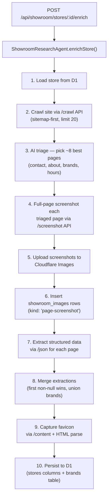

# Showroom Enrichment Pipeline — Sitemap-Driven Contact, Brand & Screenshot Intelligence

> **Handoff document for implementation.** This plan describes every file to create/modify, the exact function signatures, the types, and the step-by-step pipeline logic. All code lives in the existing `core-remodel` Cloudflare Worker.

---

## Architecture Summary



---

## Decisions (Pre-Resolved)

| Decision | Answer |
|----------|--------|
| Favicon storage | Upload to Cloudflare Images, store delivery URL in `showroom_stores.favicon_url` |
| Brand normalization | Store raw names per-store in `showroom_store_brands`; normalize later |
| Screenshot storage | Upload to Cloudflare Images → insert `showroom_images` row with `imageKind: "page-screenshot"` |
| Package manager | `pnpm` |
| ORM | Drizzle (D1 project) |

---

## File Change Index

| Action | File | Section |
|--------|------|---------|
| MODIFY | `src/backend/db/schema/showroom/stores.ts` | §1 |
| NEW | `src/backend/db/schema/showroom/store_brands.ts` | §1 |
| MODIFY | `src/backend/db/schema/showroom/index.ts` | §1 |
| MODIFY | `src/backend/db/schema/showroom/showroom_images.ts` | §1 |
| MODIFY | `src/backend/ai/tools/browser-rendering.ts` | §2 |
| MODIFY | `src/backend/ai/agents/ShowroomResearchAgent/types.ts` | §3 |
| NEW | `src/backend/ai/agents/ShowroomResearchAgent/methods/enrich-store.ts` | §4 |
| MODIFY | `src/backend/ai/agents/ShowroomResearchAgent/methods/index.ts` | §4 |
| MODIFY | `src/backend/ai/agents/ShowroomResearchAgent/index.ts` | §5 |
| MODIFY | `src/backend/api/routes/showroom-stores.ts` | §6 |

---

## §1 — Schema Changes

### [MODIFY] [stores.ts](file:///Volumes/Projects/workers/core-remodel/src/backend/db/schema/showroom/stores.ts)

Add these columns to the `showroomStores` table definition (place them after `locationNotes` on line 99, before `createdAt`):

```ts
// ── Favicon ─────────────────────────────────────────────────────────
/** Cloudflare Images delivery URL for the store's favicon. */
faviconUrl: text("favicon_url"),

// ── Structured hours (JSON) ─────────────────────────────────────────
/**
 * JSON blob with structured operating hours.
 * Shape: { monday?: string, tuesday?: string, ..., sunday?: string, notes?: string }
 * Coexists with the legacy weekday_hours / weekend_hours free-text columns.
 */
hoursJson: text("hours_json"),

// ── Social profiles ─────────────────────────────────────────────────
socialInstagram: text("social_instagram"),
socialFacebook: text("social_facebook"),
socialPinterest: text("social_pinterest"),
socialYoutube: text("social_youtube"),
socialTiktok: text("social_tiktok"),
socialLinkedin: text("social_linkedin"),
socialYelp: text("social_yelp"),
socialHouzz: text("social_houzz"),

// ── Enrichment metadata ─────────────────────────────────────────────
lastEnrichedAt: integer("last_enriched_at", { mode: "timestamp" }),
```

> [!IMPORTANT]
> After adding columns, run `pnpm drizzle-kit generate` to create the migration. Do NOT edit the generated SQL file manually.

---

### [NEW] [store_brands.ts](file:///Volumes/Projects/workers/core-remodel/src/backend/db/schema/showroom/store_brands.ts)

Create `src/backend/db/schema/showroom/store_brands.ts`:

```ts
import { sql } from "drizzle-orm";
import { sqliteTable, text, integer, index } from "drizzle-orm/sqlite-core";

import { showroomStores } from "./stores";

/**
 * Showroom Store Brands — brands/lines carried by each showroom, discovered
 * during the enrichment pipeline crawl.
 *
 * Stored as separate rows (not a JSON array) so we can query "which stores
 * carry Kohler?" across the entire directory.
 */
export const showroomStoreBrands = sqliteTable(
  "showroom_store_brands",
  {
    id: integer("id").primaryKey({ autoIncrement: true }),
    storeId: integer("store_id")
      .notNull()
      .references(() => showroomStores.id, { onDelete: "cascade" }),
    brandName: text("brand_name").notNull(),
    /** Official brand website URL (nullable). */
    brandUrl: text("brand_url"),
    /** Page where the brand mention was discovered. */
    sourceUrl: text("source_url"),
    /** AI extraction confidence (0-100). */
    confidence: integer("confidence").default(70),
    createdAt: integer("created_at", { mode: "timestamp" })
      .notNull()
      .default(sql`(unixepoch())`),
  },
  (table) => ({
    storeIdx: index("store_brands_store_idx").on(table.storeId),
    brandIdx: index("store_brands_name_idx").on(table.brandName),
  }),
);

export type ShowroomStoreBrand = typeof showroomStoreBrands.$inferSelect;
export type ShowroomStoreBrandInsert = typeof showroomStoreBrands.$inferInsert;
```

---

### [MODIFY] [showroom_images.ts](file:///Volumes/Projects/workers/core-remodel/src/backend/db/schema/showroom/showroom_images.ts)

Add `"page-screenshot"` to the `imageKind` enum (line 33-34):

```diff
     imageKind: text("image_kind", {
-      enum: ["storefront", "showroom", "logo", "map", "unknown"],
+      enum: ["storefront", "showroom", "logo", "map", "page-screenshot", "unknown"],
     })
```

---

### [MODIFY] [index.ts](file:///Volumes/Projects/workers/core-remodel/src/backend/db/schema/showroom/index.ts)

Add barrel export (after line 17):

```ts
export * from "./store_brands";
```

---

## §2 — Browser Rendering Util Additions

### [MODIFY] [browser-rendering.ts](file:///Volumes/Projects/workers/core-remodel/src/backend/ai/tools/browser-rendering.ts)

Add three new exported functions. Place them after the existing `extractMarkdown` function (after line 302).

#### 2a. `crawlSite` — Wraps `/crawl` with async polling

```ts
// ---------------------------------------------------------------------------
// /crawl — Sitemap-aware multi-page crawl
// ---------------------------------------------------------------------------

export type CrawlOptions = {
  /** Max pages to crawl (default: 20). */
  limit?: number;
  /** Max link depth from start URL (default: 2). */
  depth?: number;
  /** Discovery source: "all" | "sitemap" | "links" (default: "all"). */
  source?: "all" | "sitemap" | "links";
  /** Output formats (default: ["markdown"]). */
  formats?: ("markdown" | "html")[];
  /** Glob patterns to include (e.g. ["/brands/*", "/contact*"]). */
  includePatterns?: string[];
  /** Glob patterns to exclude (e.g. ["/blog/*"]). */
  excludePatterns?: string[];
  /** Cache staleness in seconds (default: 7200 = 2h). */
  maxAge?: number;
  /** Poll interval in ms (default: 5000). */
  pollIntervalMs?: number;
  /** Max time to wait for completion in ms (default: 120000 = 2min). */
  maxWaitMs?: number;
};

export type CrawledPage = {
  url: string;
  title?: string;
  markdown?: string;
  html?: string;
  links?: Array<{ href: string; text?: string }>;
  statusCode?: number;
};

export type CrawlResult = {
  jobId: string;
  status: string;
  pages: CrawledPage[];
};

/**
 * Crawls a website using the Browser Rendering `/crawl` API.
 * Starts a crawl job, polls until complete, returns all pages.
 *
 * The /crawl API auto-discovers sitemaps + page links.
 * See: scripts/browser-render/run_browser_render_crawler.sh for the bash equivalent.
 */
export async function crawlSite(
  env: Env,
  url: string,
  options: CrawlOptions = {},
): Promise<CrawlResult> {
  const base = await brBaseUrl(env);
  const headers = await brHeaders(env);

  const {
    limit = 20,
    depth = 2,
    source = "all",
    formats = ["markdown"],
    includePatterns,
    excludePatterns,
    maxAge = 7200,
    pollIntervalMs = 5000,
    maxWaitMs = 120_000,
  } = options;

  // 1. Start crawl job
  const initBody: Record<string, unknown> = {
    url,
    limit,
    depth,
    source,
    formats,
    maxAge,
    render: true,
    options: { includeExternalLinks: true, includeSubdomains: true },
  };
  if (includePatterns) initBody.includeGlobs = includePatterns;
  if (excludePatterns) initBody.excludeGlobs = excludePatterns;

  const initResponse = await fetch(`${base}/crawl`, {
    method: "POST",
    headers,
    body: JSON.stringify(initBody),
  });

  if (!initResponse.ok) {
    throw new Error(
      `Browser Rendering /crawl init failed: ${initResponse.status} ${await initResponse.text()}`,
    );
  }

  const initPayload = (await initResponse.json()) as {
    success: boolean;
    result: string; // job ID (raw UUID string)
  };
  const jobId = initPayload.result;
  if (!jobId) throw new Error("No job ID returned from /crawl");

  // 2. Poll until complete
  const deadline = Date.now() + maxWaitMs;
  while (Date.now() < deadline) {
    await new Promise((resolve) => setTimeout(resolve, pollIntervalMs));

    const statusResponse = await fetch(`${base}/crawl/${jobId}?limit=1`, {
      method: "GET",
      headers,
    });

    if (!statusResponse.ok) {
      throw new Error(
        `Browser Rendering /crawl poll failed: ${statusResponse.status} ${await statusResponse.text()}`,
      );
    }

    const statusPayload = (await statusResponse.json()) as {
      success: boolean;
      result: { status: string };
    };
    const status = statusPayload.result?.status ?? "unknown";

    if (status === "completed" || status === "success") break;
    if (
      status === "errored" ||
      status === "cancelled_due_to_timeout" ||
      status === "cancelled_due_to_limits" ||
      status === "cancelled_by_user"
    ) {
      throw new Error(`Crawl job ${jobId} failed with status: ${status}`);
    }
  }

  // 3. Fetch full results
  const fullResponse = await fetch(`${base}/crawl/${jobId}`, {
    method: "GET",
    headers,
  });

  if (!fullResponse.ok) {
    throw new Error(
      `Browser Rendering /crawl fetch failed: ${fullResponse.status} ${await fullResponse.text()}`,
    );
  }

  const fullPayload = (await fullResponse.json()) as {
    success: boolean;
    result: {
      status: string;
      pages?: Array<{
        url: string;
        title?: string;
        markdown?: string;
        html?: string;
        links?: Array<string | { href?: string; text?: string }>;
        statusCode?: number;
      }>;
    };
  };

  const pages: CrawledPage[] = (fullPayload.result?.pages ?? []).map((p) => ({
    url: p.url,
    title: p.title,
    markdown: p.markdown,
    html: p.html,
    links: normalizeLinks(p.links),
    statusCode: p.statusCode,
  }));

  return { jobId, status: fullPayload.result?.status ?? "completed", pages };
}
```

#### 2b. `screenshotPage` — Full-page screenshot via `/screenshot`

```ts
// ---------------------------------------------------------------------------
// /screenshot — Full-page screenshot capture
// ---------------------------------------------------------------------------

export type ScreenshotOptions = {
  /** Viewport width (default: 1280). */
  width?: number;
  /** Viewport height (default: 1080). */
  height?: number;
  /** Capture the full scrollable page (default: true). */
  fullPage?: boolean;
  /** Wait condition (default: "networkidle0"). */
  waitUntil?: "load" | "domcontentloaded" | "networkidle0" | "networkidle2";
  /** Navigation timeout in ms (default: 45000). */
  timeout?: number;
};

/**
 * Captures a full-page screenshot using the Browser Rendering `/screenshot`
 * endpoint. Returns raw PNG binary as an ArrayBuffer.
 *
 * Reference: scripts/browser-render/get_full_page_screenshot.py
 *
 * @example
 * ```ts
 * const png = await screenshotPage(env, "https://davincimarble.com/");
 * // Upload to Cloudflare Images...
 * ```
 */
export async function screenshotPage(
  env: Env,
  url: string,
  options: ScreenshotOptions = {},
): Promise<ArrayBuffer> {
  const base = await brBaseUrl(env);
  const headers = await brHeaders(env);

  const {
    width = 1280,
    height = 1080,
    fullPage = true,
    waitUntil = "networkidle0",
    timeout = 45000,
  } = options;

  const response = await fetch(`${base}/screenshot`, {
    method: "POST",
    headers,
    body: JSON.stringify({
      url,
      screenshotOptions: { fullPage },
      viewport: { width, height },
      gotoOptions: { waitUntil, timeout },
    }),
  });

  if (!response.ok) {
    throw new Error(
      `Browser Rendering /screenshot failed: ${response.status} ${await response.text()}`,
    );
  }

  // The /screenshot endpoint returns raw PNG binary (not JSON)
  const contentType = response.headers.get("content-type") ?? "";
  if (contentType.includes("application/json")) {
    const errorPayload = await response.json();
    throw new Error(
      `Browser Rendering /screenshot returned error: ${JSON.stringify(errorPayload)}`,
    );
  }

  return response.arrayBuffer();
}

/**
 * Captures a screenshot and uploads it to Cloudflare Images in one step.
 * Returns the Cloudflare Images delivery URL.
 */
export async function screenshotAndUpload(
  env: Env,
  url: string,
  metadata?: Record<string, string>,
  options?: ScreenshotOptions,
): Promise<string> {
  const pngBuffer = await screenshotPage(env, url, options);
  const base64 = bufferToBase64(pngBuffer);
  return uploadScreenshotToImages(env, base64, {
    source: "enrichment-screenshot",
    url,
    capturedAt: new Date().toISOString(),
    ...metadata,
  });
}

/** Convert ArrayBuffer to base64 string. */
function bufferToBase64(buffer: ArrayBuffer): string {
  const bytes = new Uint8Array(buffer);
  let binary = "";
  for (let i = 0; i < bytes.length; i++) {
    binary += String.fromCharCode(bytes[i]);
  }
  return btoa(binary);
}
```

#### 2c. `fetchFavicon` — HTML parse + download

```ts
// ---------------------------------------------------------------------------
// Favicon extraction
// ---------------------------------------------------------------------------

export type FaviconResult = {
  /** Raw favicon binary. */
  data: ArrayBuffer;
  /** MIME type (e.g. "image/png", "image/x-icon"). */
  contentType: string;
  /** Original URL where the favicon was found. */
  sourceUrl: string;
};

/**
 * Fetches a page's rendered HTML via `/content`, parses `<link rel="icon">`
 * tags, downloads the best favicon, and returns the binary data.
 *
 * Preference order: apple-touch-icon > icon (largest first) > /favicon.ico fallback.
 *
 * Reference: scripts/browser-render/get_favicon.py
 */
export async function fetchFavicon(
  env: Env,
  url: string,
): Promise<FaviconResult | null> {
  const base = await brBaseUrl(env);
  const headers = await brHeaders(env);

  // 1. Render the page to get HTML
  const response = await fetch(`${base}/content`, {
    method: "POST",
    headers,
    body: JSON.stringify({
      url,
      gotoOptions: { waitUntil: "networkidle2" },
    }),
  });

  if (!response.ok) return null;

  const contentType = response.headers.get("content-type") ?? "";
  let html: string;

  if (contentType.includes("application/json")) {
    const payload = (await response.json()) as {
      success: boolean;
      result?: string;
    };
    if (!payload.success || !payload.result) return null;
    html = payload.result;
  } else {
    html = await response.text();
  }

  // 2. Parse favicon links from HTML using regex (no DOM parser in Workers)
  //    Match: <link rel="icon" href="..."> and <link rel="apple-touch-icon" href="...">
  const linkRegex = /<link\s[^>]*rel=["']([^"']*icon[^"']*)["'][^>]*href=["']([^"']+)["'][^>]*>/gi;
  const hrefRelRegex = /<link\s[^>]*href=["']([^"']+)["'][^>]*rel=["']([^"']*icon[^"']*)["'][^>]*>/gi;

  const candidates: Array<{ href: string; rel: string }> = [];

  let match: RegExpExecArray | null;
  while ((match = linkRegex.exec(html)) !== null) {
    candidates.push({ rel: match[1].toLowerCase(), href: match[2] });
  }
  while ((match = hrefRelRegex.exec(html)) !== null) {
    candidates.push({ rel: match[2].toLowerCase(), href: match[1] });
  }

  // Deduplicate by href
  const seen = new Set<string>();
  const unique = candidates.filter((c) => {
    if (seen.has(c.href)) return false;
    seen.add(c.href);
    return true;
  });

  // Sort: apple-touch-icon first (usually highest res), then icon
  unique.sort((a, b) => {
    const aApple = a.rel.includes("apple") ? 0 : 1;
    const bApple = b.rel.includes("apple") ? 0 : 1;
    return aApple - bApple;
  });

  // 3. Try downloading each candidate until one succeeds
  for (const candidate of unique) {
    try {
      const faviconUrl = new URL(candidate.href, url).toString();
      const faviconResponse = await fetch(faviconUrl);
      if (!faviconResponse.ok) continue;

      const data = await faviconResponse.arrayBuffer();
      if (data.byteLength === 0) continue;

      return {
        data,
        contentType:
          faviconResponse.headers.get("content-type") ?? "image/x-icon",
        sourceUrl: faviconUrl,
      };
    } catch {
      continue;
    }
  }

  // 4. Fallback: try /favicon.ico
  try {
    const fallbackUrl = new URL("/favicon.ico", url).toString();
    const fallbackResponse = await fetch(fallbackUrl);
    if (fallbackResponse.ok) {
      const data = await fallbackResponse.arrayBuffer();
      if (data.byteLength > 0) {
        return {
          data,
          contentType:
            fallbackResponse.headers.get("content-type") ?? "image/x-icon",
          sourceUrl: fallbackUrl,
        };
      }
    }
  } catch {
    // No favicon available
  }

  return null;
}
```

> [!NOTE]
> `fetchFavicon` uses regex instead of a DOM parser because Cloudflare Workers doesn't have `DOMParser`. The regex approach is sufficient for `<link>` tags which are well-structured.

---

## §3 — Types

### [MODIFY] [types.ts](file:///Volumes/Projects/workers/core-remodel/src/backend/ai/agents/ShowroomResearchAgent/types.ts)

Append these types at the end of the file (after line 161):

```ts
// ---------------------------------------------------------------------------
// Store Enrichment (sitemap-driven contact/brand/screenshot pipeline)
// ---------------------------------------------------------------------------

export interface StoreEnrichmentExtraction {
  phone?: string;
  email?: string;
  address?: string;

  hours?: {
    monday?: string;
    tuesday?: string;
    wednesday?: string;
    thursday?: string;
    friday?: string;
    saturday?: string;
    sunday?: string;
    notes?: string;
  };

  socials?: {
    instagram?: string;
    facebook?: string;
    pinterest?: string;
    youtube?: string;
    tiktok?: string;
    linkedin?: string;
    yelp?: string;
    houzz?: string;
  };

  brands?: Array<{
    name: string;
    url?: string;
    confidence?: number;
  }>;
}

export interface EnrichStoreInput {
  storeId: number;
  /** Override the website URL (defaults to store.websiteUrl). */
  websiteUrl?: string;
  /** Discovery source for crawl (default: "all"). */
  crawlSource?: "all" | "sitemap" | "links";
  /** Max pages to crawl (default: 20). */
  crawlLimit?: number;
  /** Max pages to screenshot + extract after triage (default: 8). */
  maxTriagedPages?: number;
  /** Skip screenshot capture (faster but no visual archive). */
  skipScreenshots?: boolean;
}

export interface EnrichStoreResult {
  success: boolean;
  storeId: number;
  fieldsUpdated: string[];
  brandsFound: number;
  faviconCaptured: boolean;
  pagesAnalyzed: number;
  pagesCrawled: number;
  screenshotsCaptured: number;
  warnings: string[];
}
```

---

## §4 — Enrichment Pipeline Method

### [NEW] [enrich-store.ts](file:///Volumes/Projects/workers/core-remodel/src/backend/ai/agents/ShowroomResearchAgent/methods/enrich-store.ts)

Create `src/backend/ai/agents/ShowroomResearchAgent/methods/enrich-store.ts`.

This is the core pipeline. Here is the full pseudocode with exact imports and DB operations:

```ts
import { eq } from "drizzle-orm";
import { drizzle } from "drizzle-orm/d1";

import {
  showroomStores,
  showroomStoreBrands,
  showroomImages,
} from "@backend/db/schema/showroom/index";
import {
  crawlSite,
  extractJson,
  fetchFavicon,
  screenshotAndUpload,
  uploadScreenshotToImages,
  type CrawledPage,
} from "@backend/ai/tools/browser-rendering";
import { resolveCloudflareImagesCredentials } from "@backend/utils/secrets";
import { ImageProcessorService } from "@backend/services/image-processor";
import type {
  EnrichStoreInput,
  EnrichStoreResult,
  StoreEnrichmentExtraction,
} from "../types";

type ProgressReporter = (message: string, progress?: number) => void;

const ENRICHMENT_EXTRACTION_PROMPT = `Extract business contact information, operating hours, social media links, and brand names from this page.

Rules:
- phone: The main business phone number (not personal or sales-specific). Format as-is from the page.
- email: The main contact email address.
- address: The full street address including city, state, zip.
- hours: Structured operating hours per day of week. Use the format "9:00 AM - 5:00 PM" or "Closed" or "By appointment".
- socials: Full profile URLs for each social platform found (not just usernames).
- brands: Product brands, manufacturer lines, or designer names that this showroom carries or represents. Include brand URL if linked. Set confidence 90+ for brands explicitly listed on a "brands we carry" page, 70 for brands mentioned in product descriptions, 50 for brands only appearing in image alt text or metadata.

Return JSON matching the StoreEnrichmentExtraction schema. Omit fields you cannot find on this page.`;

const ENRICHMENT_JSON_SCHEMA = {
  type: "json_schema" as const,
  json_schema: {
    name: "store_enrichment",
    schema: {
      type: "object",
      properties: {
        phone: { type: "string" },
        email: { type: "string" },
        address: { type: "string" },
        hours: {
          type: "object",
          properties: {
            monday: { type: "string" },
            tuesday: { type: "string" },
            wednesday: { type: "string" },
            thursday: { type: "string" },
            friday: { type: "string" },
            saturday: { type: "string" },
            sunday: { type: "string" },
            notes: { type: "string" },
          },
        },
        socials: {
          type: "object",
          properties: {
            instagram: { type: "string" },
            facebook: { type: "string" },
            pinterest: { type: "string" },
            youtube: { type: "string" },
            tiktok: { type: "string" },
            linkedin: { type: "string" },
            yelp: { type: "string" },
            houzz: { type: "string" },
          },
        },
        brands: {
          type: "array",
          items: {
            type: "object",
            properties: {
              name: { type: "string" },
              url: { type: "string" },
              confidence: { type: "number" },
            },
          },
        },
      },
    },
  },
};

/**
 * Main enrichment pipeline.
 */
export async function enrichStore(
  env: Env,
  input: EnrichStoreInput,
  progress?: ProgressReporter,
): Promise<EnrichStoreResult> {
  const result: EnrichStoreResult = {
    success: true,
    storeId: input.storeId,
    fieldsUpdated: [],
    brandsFound: 0,
    faviconCaptured: false,
    pagesAnalyzed: 0,
    pagesCrawled: 0,
    screenshotsCaptured: 0,
    warnings: [],
  };

  const db = drizzle(env.DB);

  // ── Step 1: Load store ─────────────────────────────────────────────
  progress?.("Loading store", 5);
  const [store] = await db
    .select()
    .from(showroomStores)
    .where(eq(showroomStores.id, input.storeId))
    .limit(1);

  if (!store) throw new Error(`Store ${input.storeId} not found`);

  const websiteUrl = input.websiteUrl ?? store.websiteUrl;
  if (!websiteUrl) {
    result.success = false;
    result.warnings.push("No website URL available for this store");
    return result;
  }

  // ── Step 2: Crawl site ─────────────────────────────────────────────
  progress?.("Crawling website", 10);
  let crawlResult;
  try {
    crawlResult = await crawlSite(env, websiteUrl, {
      limit: input.crawlLimit ?? 20,
      depth: 2,
      source: input.crawlSource ?? "all",
      formats: ["markdown"],
    });
  } catch (error) {
    result.warnings.push(
      `Crawl failed: ${error instanceof Error ? error.message : String(error)}`,
    );
    result.success = false;
    return result;
  }
  result.pagesCrawled = crawlResult.pages.length;

  if (crawlResult.pages.length === 0) {
    result.warnings.push("Crawl returned no pages");
    result.success = false;
    return result;
  }

  // ── Step 3: AI triage — pick the most useful pages ─────────────────
  progress?.("Triaging pages", 20);
  const maxTriaged = input.maxTriagedPages ?? 8;
  const triagedPages = await triagePages(env, crawlResult.pages, maxTriaged);

  // ── Step 4 + 5: Screenshot each triaged page + upload ──────────────
  if (!input.skipScreenshots) {
    let ssIdx = 0;
    for (const page of triagedPages) {
      ssIdx++;
      progress?.(
        `Screenshotting page ${ssIdx}/${triagedPages.length}`,
        25 + (ssIdx / triagedPages.length) * 15,
      );
      try {
        const deliveryUrl = await screenshotAndUpload(env, page.url, {
          storeName: store.name,
          storeId: String(input.storeId),
          pageTitle: page.title ?? page.url,
        });

        // ── Step 6: Insert showroom_images row ───────────────────────
        await db.insert(showroomImages).values({
          storeId: input.storeId,
          sourceUrl: page.url,
          sourcePageUrl: page.url,
          deliveryUrl,
          altText: page.title ?? `Screenshot of ${page.url}`,
          imageKind: "page-screenshot",
          reviewStatus: "approved", // auto-approve screenshots
        }).onConflictDoNothing(); // skip if already screenshotted

        result.screenshotsCaptured++;
      } catch (error) {
        result.warnings.push(
          `Screenshot failed for ${page.url}: ${error instanceof Error ? error.message : String(error)}`,
        );
      }
    }
  }

  // ── Step 7: Extract structured data from each triaged page ─────────
  progress?.("Extracting contact & brand data", 45);
  const extractions: StoreEnrichmentExtraction[] = [];
  let extIdx = 0;
  for (const page of triagedPages) {
    extIdx++;
    progress?.(
      `Extracting page ${extIdx}/${triagedPages.length}`,
      45 + (extIdx / triagedPages.length) * 25,
    );
    try {
      const extraction = await extractJson<StoreEnrichmentExtraction>(
        env,
        page.url,
        {
          prompt: ENRICHMENT_EXTRACTION_PROMPT,
          responseFormat: ENRICHMENT_JSON_SCHEMA,
        },
      );
      extractions.push(extraction);
      result.pagesAnalyzed++;
    } catch (error) {
      result.warnings.push(
        `Extraction failed for ${page.url}: ${error instanceof Error ? error.message : String(error)}`,
      );
    }
  }

  // ── Step 8: Merge extractions ──────────────────────────────────────
  progress?.("Merging extracted data", 75);
  const merged = mergeExtractions(extractions);

  // ── Step 9: Capture favicon ────────────────────────────────────────
  progress?.("Capturing favicon", 80);
  let faviconDeliveryUrl: string | undefined;
  try {
    const favicon = await fetchFavicon(env, websiteUrl);
    if (favicon) {
      // Upload favicon binary to Cloudflare Images
      const base64 = bufferToBase64ForFavicon(favicon.data);
      faviconDeliveryUrl = await uploadFaviconToImages(
        env,
        base64,
        favicon.contentType,
        {
          storeName: store.name,
          storeId: String(input.storeId),
          sourceUrl: favicon.sourceUrl,
        },
      );
      result.faviconCaptured = true;
    }
  } catch (error) {
    result.warnings.push(
      `Favicon capture failed: ${error instanceof Error ? error.message : String(error)}`,
    );
  }

  // ── Step 10: Persist to D1 ─────────────────────────────────────────
  progress?.("Saving to database", 90);

  // 10a. Update showroom_stores columns
  const storeUpdate: Record<string, unknown> = {
    lastEnrichedAt: new Date(),
    updatedAt: new Date(),
  };

  if (merged.phone && !store.phoneNumber) {
    storeUpdate.phoneNumber = merged.phone;
    result.fieldsUpdated.push("phoneNumber");
  }
  if (merged.email && !store.emailAddress) {
    storeUpdate.emailAddress = merged.email;
    result.fieldsUpdated.push("emailAddress");
  }
  if (merged.address && !store.locationAddress) {
    storeUpdate.locationAddress = merged.address;
    result.fieldsUpdated.push("locationAddress");
  }
  if (merged.hours) {
    storeUpdate.hoursJson = JSON.stringify(merged.hours);
    result.fieldsUpdated.push("hoursJson");
    // Also populate legacy free-text fields if empty
    if (!store.weekdayHours && merged.hours.monday) {
      storeUpdate.weekdayHours = `Mon ${merged.hours.monday}, Tue ${merged.hours.tuesday ?? "?"}, Wed ${merged.hours.wednesday ?? "?"}, Thu ${merged.hours.thursday ?? "?"}, Fri ${merged.hours.friday ?? "?"}`;
      result.fieldsUpdated.push("weekdayHours");
    }
    if (!store.weekendHours && (merged.hours.saturday || merged.hours.sunday)) {
      storeUpdate.weekendHours = `Sat ${merged.hours.saturday ?? "Closed"}, Sun ${merged.hours.sunday ?? "Closed"}`;
      result.fieldsUpdated.push("weekendHours");
    }
  }

  // Social links — only update if currently null
  const socialMap: Record<string, keyof typeof store> = {
    instagram: "socialInstagram" as any,
    facebook: "socialFacebook" as any,
    pinterest: "socialPinterest" as any,
    youtube: "socialYoutube" as any,
    tiktok: "socialTiktok" as any,
    linkedin: "socialLinkedin" as any,
    yelp: "socialYelp" as any,
    houzz: "socialHouzz" as any,
  };
  if (merged.socials) {
    for (const [key, column] of Object.entries(socialMap)) {
      const value = merged.socials[key as keyof typeof merged.socials];
      if (value && !(store as any)[column]) {
        storeUpdate[column as string] = value;
        result.fieldsUpdated.push(column as string);
      }
    }
  }

  if (faviconDeliveryUrl) {
    storeUpdate.faviconUrl = faviconDeliveryUrl;
    result.fieldsUpdated.push("faviconUrl");
  }

  await db
    .update(showroomStores)
    .set(storeUpdate)
    .where(eq(showroomStores.id, input.storeId));

  // 10b. Insert brands
  if (merged.brands && merged.brands.length > 0) {
    const brandValues = merged.brands.map((b) => ({
      storeId: input.storeId,
      brandName: b.name,
      brandUrl: b.url ?? null,
      confidence: b.confidence ?? 70,
    }));
    await db.insert(showroomStoreBrands).values(brandValues).onConflictDoNothing();
    result.brandsFound = brandValues.length;
  }

  progress?.("Enrichment complete", 100);
  return result;
}
```

**Helper functions to include in the same file:**

```ts
/**
 * AI triage: ask Workers AI which crawled pages are most likely to contain
 * contact info, hours, brands, and about-us content.
 */
async function triagePages(
  env: Env,
  pages: CrawledPage[],
  maxPages: number,
): Promise<CrawledPage[]> {
  if (pages.length <= maxPages) return pages;

  const pageList = pages
    .map((p, i) => `${i}. ${p.title ?? "Untitled"} — ${p.url}`)
    .join("\n");

  const prompt = `Here are ${pages.length} pages discovered from a showroom website crawl. Select the ${maxPages} pages most likely to contain: business hours, phone/email/address, social media links, and brands/product lines carried.

Pages:
${pageList}

Return a JSON array of page indices (0-based), e.g. [0, 3, 5, 7]. Only return the JSON array, nothing else.`;

  try {
    const response = (await env.AI.run(
      "@cf/moonshotai/kimi-k2.6" as any,
      {
        messages: [
          { role: "system", content: "You are a web page classifier. Return only valid JSON." },
          { role: "user", content: prompt },
        ],
      } as any,
      { gateway: { id: env.AI_GATEWAY_ID } },
    )) as string | { response?: string };

    const rawOutput = typeof response === "string" ? response : response.response ?? "[]";

    // Parse the index array
    const arrayMatch = rawOutput.match(/\[[\d\s,]+\]/);
    if (!arrayMatch) return pages.slice(0, maxPages);

    const indices: number[] = JSON.parse(arrayMatch[0]);
    const selected = indices
      .filter((i) => i >= 0 && i < pages.length)
      .slice(0, maxPages)
      .map((i) => pages[i]);

    return selected.length > 0 ? selected : pages.slice(0, maxPages);
  } catch {
    // Fallback: take the first N pages
    return pages.slice(0, maxPages);
  }
}

/**
 * Merge multiple extraction results. First non-null wins for scalars;
 * union + deduplicate for brands.
 */
function mergeExtractions(
  extractions: StoreEnrichmentExtraction[],
): StoreEnrichmentExtraction {
  const merged: StoreEnrichmentExtraction = {};
  const brandSet = new Map<string, StoreEnrichmentExtraction["brands"][0]>();

  for (const ext of extractions) {
    if (ext.phone && !merged.phone) merged.phone = ext.phone;
    if (ext.email && !merged.email) merged.email = ext.email;
    if (ext.address && !merged.address) merged.address = ext.address;
    if (ext.hours && !merged.hours) merged.hours = ext.hours;

    // Merge socials (first non-null per platform)
    if (ext.socials) {
      if (!merged.socials) merged.socials = {};
      for (const [key, value] of Object.entries(ext.socials)) {
        if (value && !(merged.socials as any)[key]) {
          (merged.socials as any)[key] = value;
        }
      }
    }

    // Union brands by normalized name
    if (ext.brands) {
      for (const brand of ext.brands) {
        const key = brand.name.toLowerCase().trim();
        const existing = brandSet.get(key);
        if (!existing || (brand.confidence ?? 0) > (existing.confidence ?? 0)) {
          brandSet.set(key, brand);
        }
      }
    }
  }

  merged.brands = Array.from(brandSet.values());
  return merged;
}

/** Convert ArrayBuffer to base64 for favicon upload. */
function bufferToBase64ForFavicon(buffer: ArrayBuffer): string {
  const bytes = new Uint8Array(buffer);
  let binary = "";
  for (let i = 0; i < bytes.length; i++) {
    binary += String.fromCharCode(bytes[i]);
  }
  return btoa(binary);
}

/**
 * Upload a favicon to Cloudflare Images.
 * Re-uses the same pattern as uploadScreenshotToImages in browser-rendering.ts
 * but handles non-PNG content types (ico, svg).
 */
async function uploadFaviconToImages(
  env: Env,
  base64Data: string,
  contentType: string,
  metadata: Record<string, string>,
): Promise<string> {
  const accountId = await env.CLOUDFLARE_ACCOUNT_ID.get();
  // Re-use the existing CF Images token retrieval
  const { getCloudflareImagesToken } = await import("@backend/utils/secrets");
  const imagesToken = await getCloudflareImagesToken(env);

  const binaryString = atob(base64Data);
  const bytes = new Uint8Array(binaryString.length);
  for (let i = 0; i < binaryString.length; i++) {
    bytes[i] = binaryString.charCodeAt(i);
  }

  const ext = contentType.includes("png") ? "png" : contentType.includes("svg") ? "svg" : "ico";

  const formData = new FormData();
  formData.append("file", new File([bytes], `favicon.${ext}`, { type: contentType }));
  formData.append("metadata", JSON.stringify(metadata));

  const response = await fetch(
    `https://api.cloudflare.com/client/v4/accounts/${accountId}/images/v1`,
    {
      method: "POST",
      headers: { authorization: `Bearer ${imagesToken}` },
      body: formData,
    },
  );

  if (!response.ok) {
    throw new Error(`Favicon upload failed: ${response.status} ${await response.text()}`);
  }

  const payload = (await response.json()) as {
    success: boolean;
    result: { id: string; variants: string[] };
  };

  return payload.result.variants.find((v) => v.endsWith("/public")) ?? payload.result.variants[0];
}
```

### [MODIFY] [methods/index.ts](file:///Volumes/Projects/workers/core-remodel/src/backend/ai/agents/ShowroomResearchAgent/methods/index.ts)

Add export:

```ts
export { enrichStore } from "./enrich-store";
```

---

## §5 — Agent Integration

### [MODIFY] [ShowroomResearchAgent/index.ts](file:///Volumes/Projects/workers/core-remodel/src/backend/ai/agents/ShowroomResearchAgent/index.ts)

1. Add to imports (line ~30):
```ts
import { enrichStore as runEnrichStore } from "./methods";
import type { EnrichStoreInput, EnrichStoreResult } from "./types";
```

2. Add to `docsMetadata()` methods array (after the `generateHighlights` entry, ~line 123):
```ts
{
  name: "enrichStore",
  description:
    "Crawl a store's website (sitemap-first), screenshot every analyzed page, " +
    "extract contact info, hours, social links, brands, and favicon, then persist to D1.",
  params: "EnrichStoreInput",
  returns: "EnrichStoreResult",
},
```

3. Add the `@callable()` method (after the `generateHighlights` method, ~line 354):
```ts
@callable()
async enrichStore(input: EnrichStoreInput): Promise<EnrichStoreResult> {
  try {
    this.reportProgress("Starting store enrichment", 0);
    const result = await runEnrichStore(this.env, input, (message, progress) =>
      this.reportProgress(message, progress),
    );
    this.markComplete();
    return result;
  } catch (error) {
    this.markError(error);
    return {
      success: false,
      storeId: input.storeId,
      fieldsUpdated: [],
      brandsFound: 0,
      faviconCaptured: false,
      pagesAnalyzed: 0,
      pagesCrawled: 0,
      screenshotsCaptured: 0,
      warnings: [error instanceof Error ? error.message : String(error)],
    };
  }
}
```

---

## §6 — API Route

### [MODIFY] [showroom-stores.ts](file:///Volumes/Projects/workers/core-remodel/src/backend/api/routes/showroom-stores.ts)

Add a new endpoint. Find the pattern used by existing POST routes in this file and add:

```ts
// POST /api/showroom/stores/:id/enrich — Trigger enrichment pipeline
app.post("/:id/enrich", async (c) => {
  const storeId = Number(c.req.param("id"));
  if (!Number.isFinite(storeId)) return c.json({ error: "Invalid store ID" }, 400);

  const body = await c.req.json().catch(() => ({}));

  // Get the ShowroomResearchAgent DO
  const agentId = c.env.SHOWROOM_RESEARCH_AGENT.idFromName("showroom-research");
  const agent = c.env.SHOWROOM_RESEARCH_AGENT.get(agentId);

  // Call the enrichStore RPC method
  const result = await agent.enrichStore({
    storeId,
    websiteUrl: body.websiteUrl,
    crawlSource: body.crawlSource,
    crawlLimit: body.crawlLimit,
    maxTriagedPages: body.maxTriagedPages,
    skipScreenshots: body.skipScreenshots,
  });

  return c.json(result);
});
```

> [!NOTE]
> The exact RPC call syntax depends on how other DO methods are invoked in this file. Check existing patterns — it may use `getAgentByName()` or a Hono middleware that provides the stub. Follow the same pattern.

---

## Verification Plan

### Automated
```bash
# 1. Generate the migration
pnpm drizzle-kit generate

# 2. Type-check
pnpm tsc --noEmit
```

### Manual
1. Apply migration locally: `pnpm wrangler d1 migrations apply DB --local`
2. Start dev server: `pnpm run dev`
3. Pick a store with a website (e.g., Da Vinci Marble, id=X)
4. Hit: `POST /api/showroom/stores/X/enrich`
5. Verify:
   - `showroom_stores` row has: phone, email, address, hours_json, social_*, favicon_url, last_enriched_at
   - `showroom_store_brands` has brand rows for that store
   - `showroom_images` has `page-screenshot` rows with valid Cloudflare Images delivery URLs
   - Screenshots are viewable via the delivery URLs

---

## Existing Code References

| Pattern | File | Lines |
|---------|------|-------|
| Cloudflare Images upload (base64 → FormData) | [browser-rendering.ts](file:///Volumes/Projects/workers/core-remodel/src/backend/ai/tools/browser-rendering.ts) | L57–L99 |
| `/snapshot` scrape + screenshot upload | [browser-rendering.ts](file:///Volumes/Projects/workers/core-remodel/src/backend/ai/tools/browser-rendering.ts) | L110–L158 |
| `/json` AI extraction with JSON schema | [browser-rendering.ts](file:///Volumes/Projects/workers/core-remodel/src/backend/ai/tools/browser-rendering.ts) | L239–L273 |
| `/content` HTML fetch (JSON envelope handling) | [get_favicon.py](file:///Volumes/Projects/workers/core-remodel/scripts/browser-render/get_favicon.py) | L62–L73 |
| `/screenshot` full-page capture payload | [get_full_page_screenshot.py](file:///Volumes/Projects/workers/core-remodel/scripts/browser-render/get_full_page_screenshot.py) | L40–L53 |
| `/crawl` async job pattern (bash) | [run_browser_render_crawler.sh](file:///Volumes/Projects/workers/core-remodel/scripts/browser-render/run_browser_render_crawler.sh) | L20–L73 |
| Workers AI call pattern (kimi-k2.6) | [ShowroomResearchAgent/index.ts](file:///Volumes/Projects/workers/core-remodel/src/backend/ai/agents/ShowroomResearchAgent/index.ts) | L333–L345 |
| `@callable()` RPC method pattern | [ShowroomResearchAgent/index.ts](file:///Volumes/Projects/workers/core-remodel/src/backend/ai/agents/ShowroomResearchAgent/index.ts) | L159–L171 |
| `processStoreSource` (existing store sweep) | [deep-sweep.ts](file:///Volumes/Projects/workers/core-remodel/src/backend/ai/agents/ShowroomResearchAgent/methods/deep-sweep.ts) | L913–L960 |
| `extractSource` JSON schema pattern | [deep-sweep.ts](file:///Volumes/Projects/workers/core-remodel/src/backend/ai/agents/ShowroomResearchAgent/methods/deep-sweep.ts) | L329–L411 |
| `showroomImages` insert pattern | [deep-sweep.ts](file:///Volumes/Projects/workers/core-remodel/src/backend/ai/agents/ShowroomResearchAgent/methods/deep-sweep.ts) | L913–L950 |
