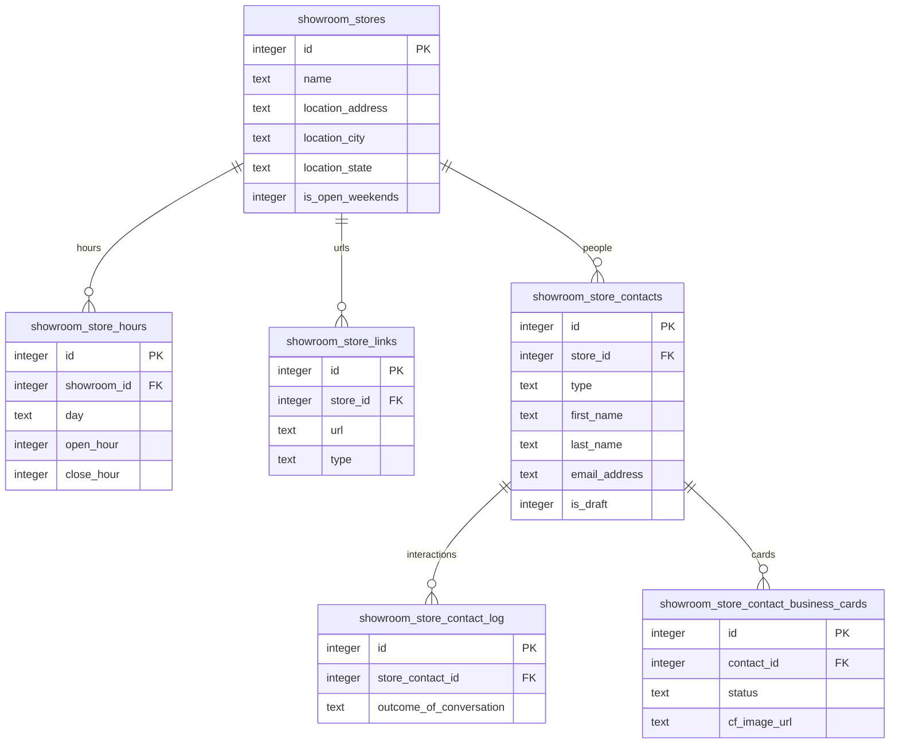
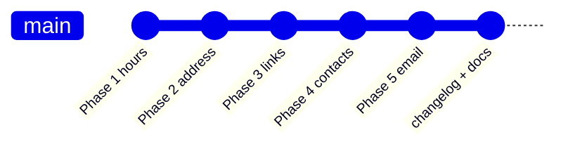
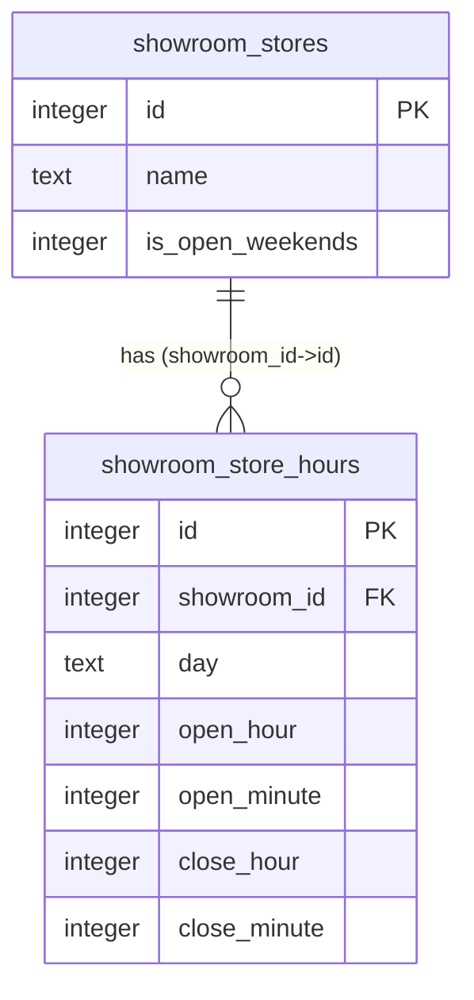
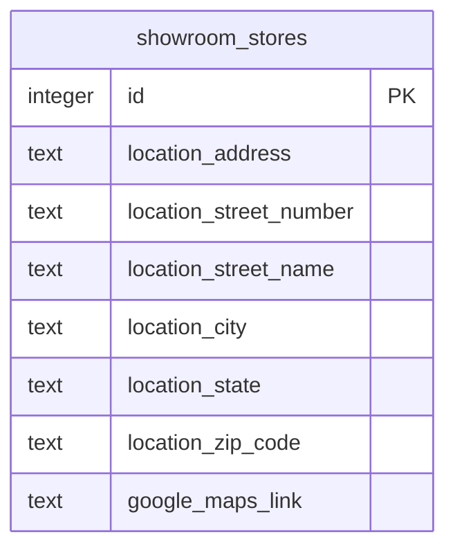
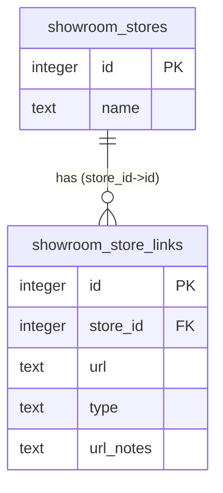
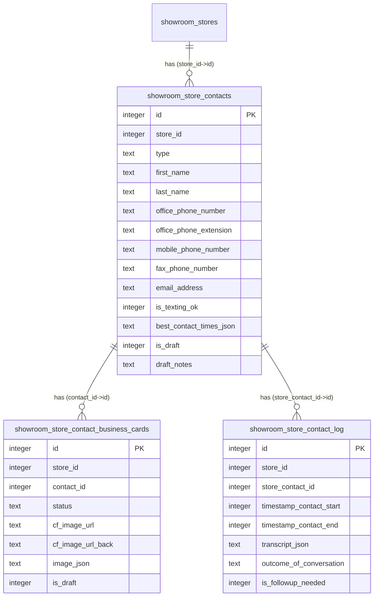
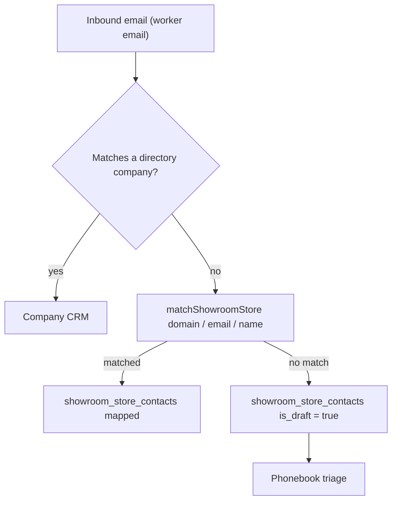

# showroom_stores cleanup — D1 ER diagrams

Validated with `pnpm run mermaid:validate docs/0015_showroom_stores_cleanup/diagrams.md`.
These are the focused per-phase diagrams embedded on the changelog detail pages
(`src/frontend/data/changelog-detail.ts`).

## Architecture overview (after)

The whole point of the cleanup: `showroom_stores` shed its inline columns into
typed child tables.

## Build timeline

## Phase 1 — Hours

## Phase 2 — Address

## Phase 3 — Links

## Phase 4 — Contacts

Generated from the migrations via `pnpm run mermaid:erd -- --tables 'showroom_store_contact*'`.

## Phase 5 — Email auto-populate

