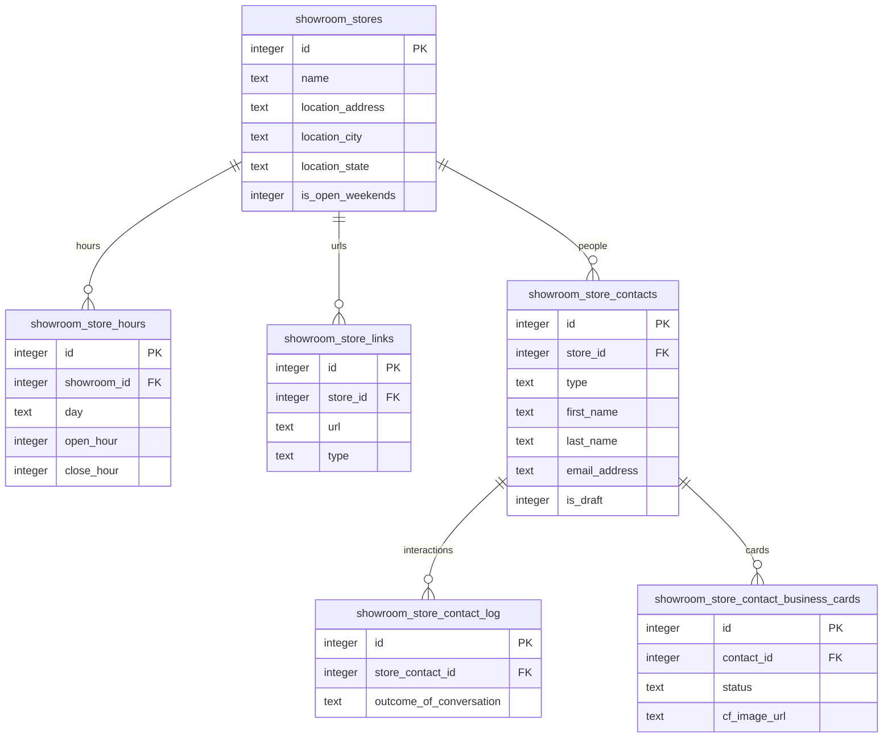
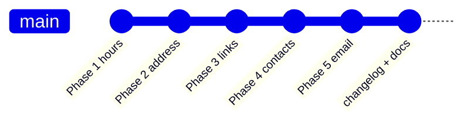
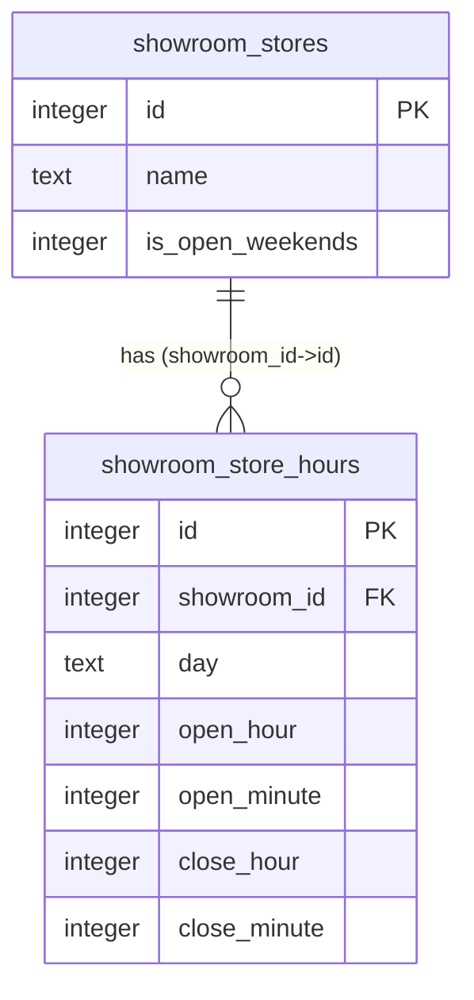
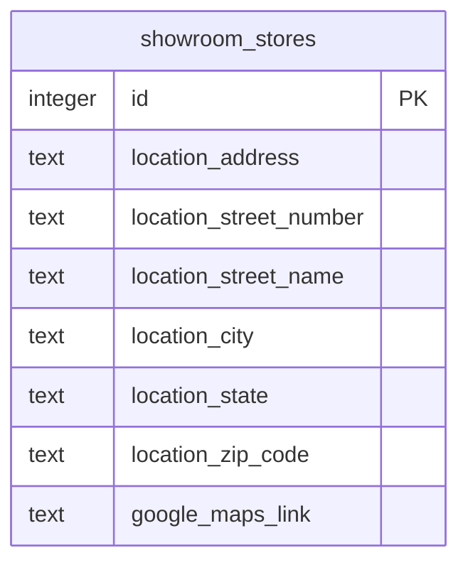
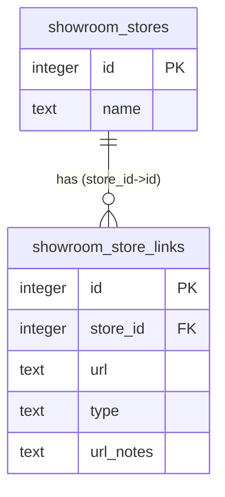
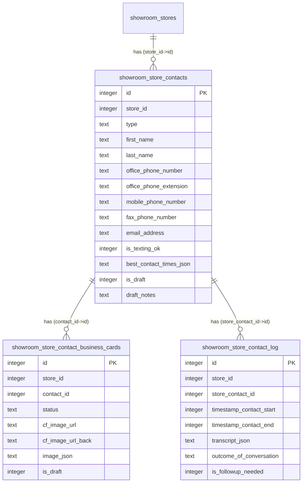
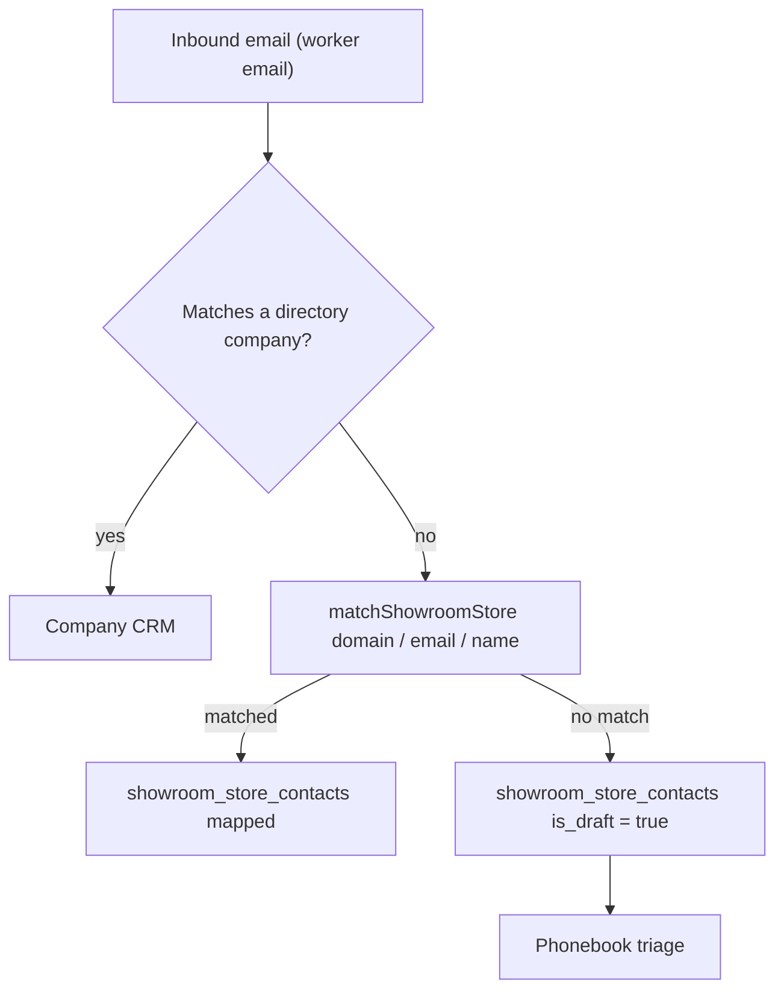

# showroom_stores cleanup — D1 ER diagrams

Validated with `pnpm run mermaid:validate docs/0015_showroom_stores_cleanup/diagrams.md`.
These are the focused per-phase diagrams embedded on the changelog detail pages
(`src/frontend/data/changelog-detail.ts`).

## Architecture overview (after)

The whole point of the cleanup: `showroom_stores` shed its inline columns into
typed child tables.



## Build timeline



## Phase 1 — Hours



## Phase 2 — Address



## Phase 3 — Links



## Phase 4 — Contacts

Generated from the migrations via `pnpm run mermaid:erd -- --tables 'showroom_store_contact*'`.



## Phase 5 — Email auto-populate



## System architecture (generated by `pnpm run mermaid:branch-impact`)

```mermaid
flowchart TD
  subgraph Frontend Applications
    FE_AdminContacts["Admin Shopping Contacts Page"]
    FE_ContactsApp["Contacts Phonebook App"]
    FE_ShowroomsDir["Showrooms Directory App"]
    FE_StoreViewport["Store Viewport App"]
  end

  subgraph Backend API Routes
    API_Contacts["POST/GET /api/showroom-contacts"]
    API_Stores["GET/PUT /api/showroom-stores"]
    API_Backfill["POST /api/showroom-backfill"]
  end

  subgraph Backend Services & Utilities
    S_GoogleMaps["Google Maps Service (Geocoding)"]
    S_EmailHandler["Email Handler Service"]
    U_ContactIntake["Contact Intake Utility"]
    U_ShowroomHours["Showroom Hours Utility (Parse/Format)"]
    U_ShowroomLinks["Showroom Links Utility"]
    S_ScrapeWorkflow["Showroom Scrape Workflow"]
  end

  subgraph AI Agents
    AI_ResearchAgent["Showroom Research Agent"]
  end

  subgraph Database Migration & Backfill Scripts
    S_BackfillHours[( "0083-Backfill Legacy Hours" )]
    S_BackfillLinks[( "0085-Backfill Store Links" )]
    S_BackfillHoursJson[( "0089-Backfill Hours JSON to Rows" )]
  end

  subgraph Database Schema
    D_Stores[("showroom_stores")]
    D_Hours[("showroom_store_hours")]
    D_Links[("showroom_store_links")]
    D_Contacts[("showroom_store_contacts")]
    D_ContactLogs[("showroom_store_contact_log")]
    D_ContactCards[("showroom_store_contact_business_cards")]
  end

  %% Frontend to Backend API
  FE_AdminContacts --> FE_ContactsApp
  FE_ContactsApp --> API_Contacts
  FE_ShowroomsDir --> API_Stores
  FE_StoreViewport --> API_Stores

  %% Backend API to Services/Utilities
  API_Contacts -- Manages --> U_ContactIntake
  API_Stores -- Uses --> U_ShowroomHours
  API_Stores -- Uses --> U_ShowroomLinks
  API_Stores -- Updates Location via --> S_GoogleMaps

  %% Services/Utilities Interactions
  U_ContactIntake -- Creates/Updates --> D_Contacts
  U_ContactIntake -- Triggers --> S_EmailHandler

  S_GoogleMaps -- Updates --> D_Stores

  S_ScrapeWorkflow -- Updates --> D_Stores
  S_ScrapeWorkflow -- Uses --> U_ShowroomHours
  S_ScrapeWorkflow -- Uses --> U_ShowroomLinks

  %% API to Database (Direct Interaction)
  API_Contacts -- CRUD --> D_Contacts
  API_Contacts -- Logs to --> D_ContactLogs
  API_Contacts -- Manages --> D_ContactCards

  API_Stores -- Reads/Updates --> D_Stores
  API_Stores -- Reads/Updates --> D_Hours
  API_Stores -- Reads/Updates --> D_Links

  %% Database Migrations & Backfill Orchestration
  API_Backfill --> S_BackfillHours
  API_Backfill --> S_BackfillLinks
  API_Backfill --> S_BackfillHoursJson

  %% Backfill Scripts Data Flow
  S_BackfillHours -- Reads old columns from --> D_Stores
  S_BackfillHours -- Writes structured data to --> D_Hours

  S_BackfillLinks -- Reads old columns from --> D_Stores
  S_BackfillLinks -- Writes structured data to --> D_Links

  S_BackfillHoursJson -- Reads JSON from --> D_Stores
  S_BackfillHoursJson -- Writes structured data to --> D_Hours

  %% AI Agents Interactions
  AI_ResearchAgent -- Reads from --> D_Stores
  AI_ResearchAgent -- Calls --> API_Stores
  AI_ResearchAgent -- Potentially feeds --> U_ContactIntake

  %% Implied DB Relationships (via Foreign Keys & logical grouping)
  D_Stores -- "1:N (has)" --> D_Hours
  D_Stores -- "1:N (has)" --> D_Links
  D_Stores -- "1:N (has)" --> D_Contacts
  D_Contacts -- "1:N (logs)" --> D_ContactLogs
  D_Contacts -- "1:N (cards)" --> D_ContactCards
```
