# 0022 — GPS Showroom Drives & Visit Logs

**Status:** Planning → ready to build
**Owner:** Justin (product + backend), coding agent (implementation), Claude AI Design (frontend, orchestrated)
**Plan slug (D1 `/admin/plans`):** `0022_gps_showroom_drives`
**Depends on (already shipped):** Drive Lists (#101/#117/#122), Tesla/Tessie nav + park auto-visit (#133), Fleet Telemetry ingest + `TESLA_DB` + automations placeholder (#136), single-active drive + admin auto-landing (#137).

---

## 1. Summary

Turn the Tesla the user already drives into a **hands-free field instrument** for showroom sourcing. While a drive list is active, the car's GPS + Fleet Telemetry stream *stages the busywork*: it records that the user arrived somewhere, pre-fills a visit-log entry, discovers unregistered remodel showrooms the user parked near, and hands the car turn-by-turn navigation across the whole route. When the user sits back down at a computer, the tedious part — "yes I was there, here's what they quoted, here's the vibe" — is already 80% filled in and waiting in a clean queue.

Two things this unlocks that matter beyond convenience:

1. **A real visit history, not a single overwrite.** Today a showroom stores one "latest visit." Sourcing a remodel means visiting the same stone yard three times over two months and catching them quoting three different numbers. A true multi-row `showroom_visit_log` is the receipts drawer.
2. **GPS-attested visits as a trust signal (future product moat).** If this app is ever sold, a review that is *paired with GPS dwell data* is categorically more credible than a typed-in star rating. We capture the provenance now (`type`, arrival/departure timestamps, coordinates) so "this reviewer's car actually sat at this address for 40 minutes" is a fact we can surface later. We are **not** building the public-review surface in 0022 — we are making sure the data model can back it.

---

## 2. Goals / Non-goals

### Goals
- **G1.** Multi-visit history per showroom (`showroom_visit_log`), each visit richly typed and GPS-attributable.
- **G2.** Near-zero-friction visit capture: the drive list check-off and the Tesla park event both *stage* a visit-log entry the user finalizes in a couple taps later.
- **G3.** A dedicated **Visit Logs** workspace (`/admin/shopping/showrooms/visitlogs`) where staged/pending entries are triaged first, and a "you're all caught up" empty state rewards a clear queue.
- **G4.** Organic discovery: when the user parks near a remodel-related place that isn't a registered showroom, stage it into a **HITL discovery queue** for one-tap approve/reject → normal intake.
- **G5.** Reusable **"Navigate via Tesla"** action on drive-list stops *and* on any showroom viewport, plus a **"Send whole drive to the car"** multi-waypoint action.
- **G6.** A **Tesla config surface** (`/admin/config/tesla`) that master-gates telemetry recording and defines home/work so the system knows when the day is done.
- **G7.** Everything the AI model can do for the user via MCP: stage visits, ask "what's near me," triage discoveries, drive the car.

### Non-goals (explicitly out of 0022)
- **N1.** Public/marketplace review surface or the GPS-attestation *badge shown to other buyers*. (We capture provenance; we don't publish it.)
- **N2.** Always-on proximity scanning **while driving with no active drive list.** The user wants this eventually; it needs a cost model first (see §9, Deferred). 0022 scans **only on park events, only while a drive list is active.**
- **N3.** Any multi-user / tenant work. Single operator (Justin) for now.
- **N4.** Replacing the existing denormalized "latest visit" snapshot on `showroom_stores`; we keep it as a cache and additionally write the log.

---

## 3. Personas & Jobs-To-Be-Done

**Justin — the sourcing driver (primary).**
- *When I'm driving between showrooms, I want the app to keep the drive list and my visit notes current for me, so I'm not fumbling with my phone at a red light.*
- *When I get home, I want a short, obvious list of "finish these visits" rather than a blank notes field, so logging actually happens instead of being skipped.*
- *When I revisit a place, I want to see what they told me last time, so I can catch inconsistent quotes.*
- *When I stumble on a showroom that wasn't on my radar, I want it captured automatically so I can decide later whether it's worth adding.*

**Justin — the AI co-pilot operator (voice, on the road).**
- *I have a live voice session with Claude; I want to say "what's near me?" and have it use my live car location, so it can surface nearby showrooms without me reading coordinates.*
- *I want to say "stage visits for the three places I hit today" and have them waiting as drafts.*

**Future buyer of the app (informs the model, not the 0022 UI).**
- *When I read another user's showroom review, I want to know whether they actually went, so I can trust it.*

### 3.1 The day in the life (user journey)
Scores = how good the moment feels today (1 = painful). 0022 targets the low scores.

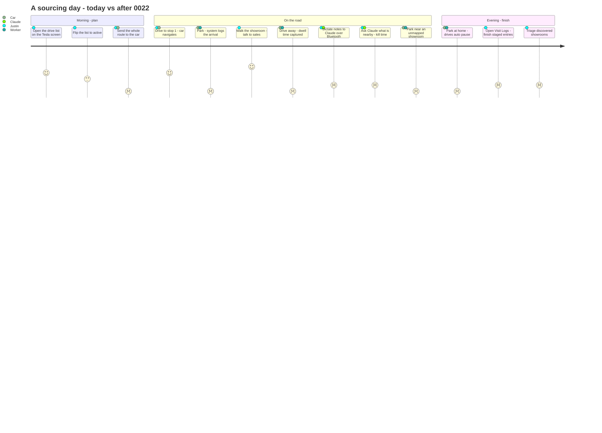

---

## 4. Current state (what already exists — do not rebuild)

| Capability | Where |
|---|---|
| Drive lists + stops (D1) | `src/backend/db/schema/drives/{drive_lists,drive_list_stops}.ts` |
| Drive list API + create service | `src/backend/api/routes/drive-lists.ts`, `src/backend/services/drive-lists.ts` |
| Single-active invariant + admin auto-landing | `drive-lists.ts` (`demoteOtherActiveDrives`, `getActiveDriveLandingPath`), `src/_worker.ts` root `/` |
| Drive viewport + route map + per-stop Tesla button | `src/frontend/components/drives/DriveViewportApp.tsx`, `DriveRouteMap.tsx` |
| Tessie client: `getLocation`, `sendNavigation` | `src/backend/services/tesla.ts` |
| Park → nearest-active-stop match | `src/backend/services/drive-geo-match.ts` (`matchAndMarkVisited`, haversine, 250 m default) |
| Telemetry + webhook ingest → `TESLA_DB`; automations placeholder | `src/backend/api/routes/tesla.ts` (`/telemetry`, `/webhook`), `src/backend/services/tesla-automations.ts` (`evaluateAutomations` stub), `src/backend/db/schema/tesla/{telemetry_events,webhook_events}.ts` |
| Telemetry DB binding | `TESLA_DB` (`core-remodel-tesla-telemetry`, `1e291822-…`) |
| Showroom store schema (has `latitude`,`longitude`,`place_id`, denormalized `rating`/`ratingContextHtml`/`ratingContextMarkdown`) | `src/backend/db/schema/showroom/stores.ts` |
| Rating history (rating-only) | `src/backend/db/schema/showroom/ratings.ts` (`store_rating`) |
| Contact + interaction log | `src/backend/db/schema/showroom/contacts.ts` (`showroom_store_contacts`, `showroom_store_contact_log`) |
| PlateJS note editor → `{markdown, html}` | `src/frontend/components/showroom/OverviewNoteEditor.tsx`; stored as `contentHtml`/`contentMarkdown` (`store_notes`) |
| Showroom intake from Place | `src/backend/services/showroom/onboarding.ts`, `POST /api/showroom-stores`, `ShowroomIntakeApp.tsx`, MCP `import_showroom_from_place` |
| Showroom viewport | `src/frontend/components/showroom/StoreViewportApp.tsx` (bento sections), routes `/admin/shopping/store/[id]/[section]` |
| Global key-value config | `project_system_variables` + `GET/POST /api/admin/config`; pattern `PropertyAddressConfigApp.tsx` + `ConfigShell`/`config-nav.ts` |
| Sidebar nav groups | `src/frontend/components/sidebar/nav-groups.ts` (`shopping` group) |
| MCP tool registry | `src/backend/mcp/{types,registry}.ts`, tools in `src/backend/mcp/tools/*`, barrel `tools/index.ts` |

---

## 5. Data model

> **PlateJS rule (applies to every note field below):** any user-authored rich text is captured with PlateJS and persisted as **both** `*_markdown` **and** `*_html` columns. Never store only one. See the AGENTS.md rule added in this plan.

### 5.0 Map of the app-DB changes
Legend — 🆕 new table · ✏️ existing table gaining columns · ⬜ existing, untouched (shown for context).

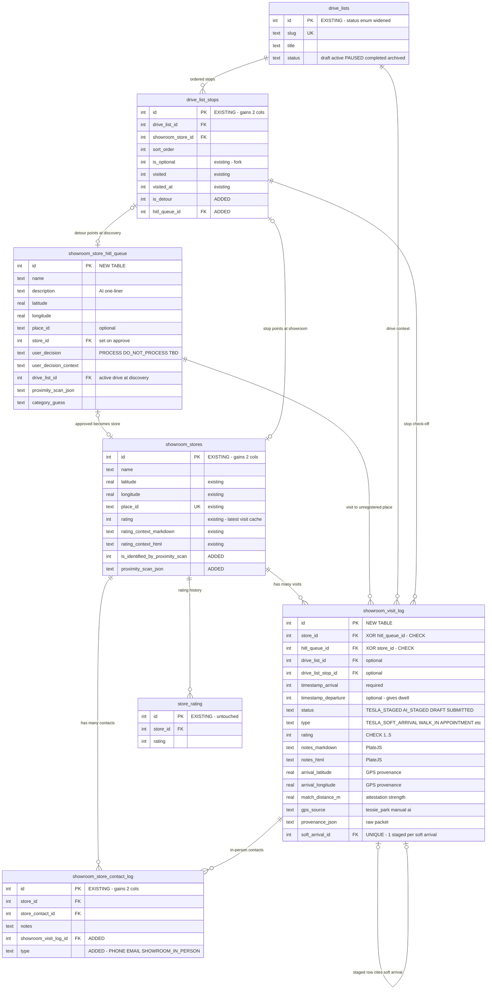

### 5.1 NEW — `showroom_visit_log`  (app `DB`)
The receipts drawer. One row per visit (or staged/soft-arrival event).

| column | type | notes |
|---|---|---|
| `id` | int PK autoinc | |
| `store_id` | int FK → `showroom_stores.id` (set null) | nullable — a visit is to a known store… |
| `hitl_queue_id` | int FK → `showroom_store_hitl_queue.id` (set null) | …**or** to a not-yet-registered discovery. Exactly one of the two is set. |
| `drive_list_id` | int FK → `drive_lists.id` (set null) | optional, when the visit came from a drive |
| `drive_list_stop_id` | int FK → `drive_list_stops.id` (set null) | optional, ties the visit to the specific stop check-off |
| `timestamp_arrival` | int timestamp | **required** |
| `timestamp_departure` | int timestamp | optional (not always known) |
| `status` | text enum | `TESLA_STAGED` \| `AI_STAGED` \| `DRAFT` \| `SUBMITTED` |
| `type` | text enum | `TESLA_SOFT_ARRIVAL` \| `TESLA_STAGED` \| `AI_STAGED` \| `WALK_IN_NO_SALES_INTERACTION` \| `WALK_IN_FULL_SALES_EXPERIENCE` \| `DEDICATED_APPOINTMENT` |
| `rating` | int | optional 1–5 (multi-visit rating; supersedes the store snapshot when SUBMITTED). **DB CHECK `rating IS NULL OR rating BETWEEN 1 AND 5`.** |
| `notes_markdown` | text | PlateJS markdown |
| `notes_html` | text | PlateJS html |
| `arrival_latitude` / `arrival_longitude` | real | GPS provenance of the arrival |
| `match_distance_m` | real | how far the park was from the matched store (attestation strength) |
| `gps_source` | text | e.g. `tessie_park`, `tessie_location`, `manual`, `ai` |
| `provenance_json` | text (json) | raw Tesla/Tessie packet, active drive id at capture, match reasoning |
| `soft_arrival_id` | int FK → self (set null) | staged row points back to its `TESLA_SOFT_ARRIVAL` row |
| `created_at` / `updated_at` | int timestamp | |

Indexes: `store_id`, `hitl_queue_id`, `drive_list_id`, `status`, `type`, `timestamp_arrival`.
**Unique index on `soft_arrival_id`** (partial / where not null) — each `TESLA_SOFT_ARRIVAL` gets at most **one** `TESLA_STAGED` follow-up (enforces the 1-to-1 at the DB level, not just in code).
**XOR invariant — enforce at BOTH layers:** application validation AND a table **CHECK constraint** `((store_id IS NOT NULL) <> (hitl_queue_id IS NOT NULL))`, so a direct D1 write or an alternate API path can't create a row that is neither/both. (SQLite `<>` on the two `IS NOT NULL` booleans is a true XOR.)

**Visit-log lifecycle** — how a row reaches `SUBMITTED` from each origin:

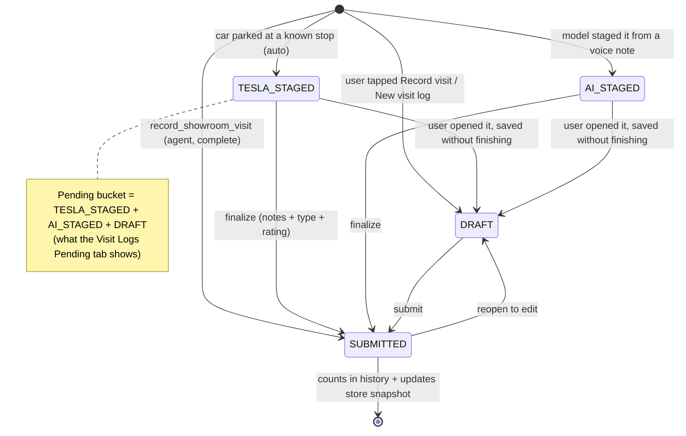

### 5.2 NEW — `showroom_store_hitl_queue`  (app `DB`)
Staging area for showrooms discovered by proximity scan (or added by the AI) awaiting the user's approve/reject before normal intake.

| column | type | notes |
|---|---|---|
| `id` | int PK autoinc | |
| `timestamp` | int timestamp | discovery time |
| `name` | text | best-guess name (Places / AI) |
| `description` | text | AI one-liner (what kind of remodel showroom) |
| `latitude` / `longitude` | real | |
| `place_id` | text | optional (Google Places) |
| `store_id` | int FK → `showroom_stores.id` (set null) | set when approved → intake produces a store |
| `user_decision` | text enum | `PROCESS` \| `DO_NOT_PROCESS` \| `TBD` (default `TBD`) |
| `user_decision_context` | text | why the user accepted/rejected |
| `drive_list_id` | int FK → `drive_lists.id` (set null) | active drive at discovery |
| `proximity_scan_json` | text (json) | Tesla/Tessie packet + timestamp + active drive id + Places/AI payload |
| `category_guess` | text | remodel category the scan inferred (stone, tile, paint, cabinets, …) |
| `created_at` / `updated_at` | int timestamp | |

Indexes: `user_decision`, `place_id` (non-unique — a place could be re-seen), `drive_list_id`, `timestamp`.

### 5.3 CHANGE — `showroom_store_contact_log`
Add support for in-person interactions logged against a visit.
- **Add** `showroom_visit_log_id` int FK → `showroom_visit_log.id` (set null, optional).
- **Add** `type` text enum: `PHONE` \| `EMAIL` \| `SHOWROOM_IN_PERSON` (nullable for legacy rows; default null).

### 5.4 CHANGE — `showroom_stores`
- **Add** `is_identified_by_proximity_scan` int (boolean) default 0 — flags stores that entered the directory via a proximity discovery.
- **Add** `proximity_scan_json` text (json) — the originating scan packet (Tesla location, timestamp, active drive id, Places/AI payload).

### 5.5 CHANGE — `drive_lists`
- **Add `paused`** to the `status` enum: `draft` \| `active` \| `paused` \| `completed` \| `archived`.
  - `active` = the one drive currently being driven (single-active, unchanged).
  - `paused` = started, not finished, resumable tomorrow (the "mark inactive" state; distinct from `archived` = done).
  - Home/work park → all `active` drives become `paused`.
  - The drive viewport's **Active toggle** flips `active` ↔ `paused` (turning on demotes any other active drive to `paused`).

**Drive-list lifecycle** (single-active is the invariant that makes the whole pipeline unambiguous):

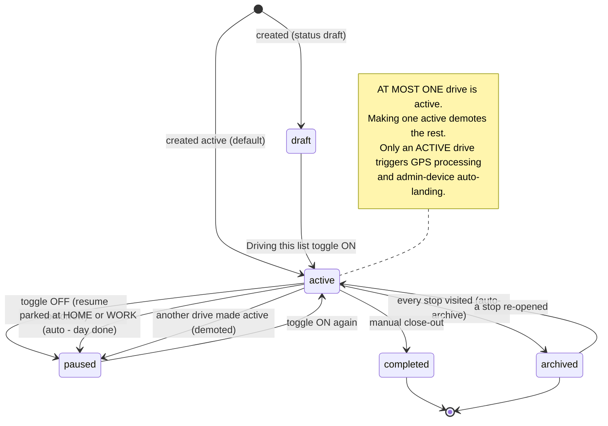

### 5.5b CHANGE — `drive_list_stops`  *(appended from external-PRD review)*
The current schema has `is_optional`, `visited`, `visited_at`. To represent a discovery **detour** as a first-class stop on the active drive (rather than only rendering it), add:
- **Add** `is_detour` int (boolean) default 0 — a stop the system inserted because the car parked at a discovered place, not a pre-planned stop.
- **Add** `hitl_queue_id` int FK → `showroom_store_hitl_queue.id` (set null) — links the detour stop to the discovery it represents.
This lets 1.d insert a real detour stop (checked-off, `is_detour=1`, `hitl_queue_id` set) so the drive's completion math and the map treat it consistently, and the fork UI reads from a row instead of a side channel.

### 5.6 Tesla DB (`TESLA_DB`) — extend existing
- `tesla_telemetry_events` (exists) — already stores raw frames + hoisted `latitude/longitude/speed/shift_state/battery_level/odometer`. **Add** `destination_name` (text, from field 163 when available) and a derived `is_parked` (bool) so the park pipeline can query cheaply. (Optional; can be computed instead — see TASKS.)
- `tesla_webhook_events` (exists) — already stores webhook payloads + match result. No change required.

**`TESLA_DB` (separate D1 — `core-remodel-tesla-telemetry`).** Physically isolated from the app DB, so there are no FKs across the boundary — the park pipeline reads here and writes visit rows over in the app DB.

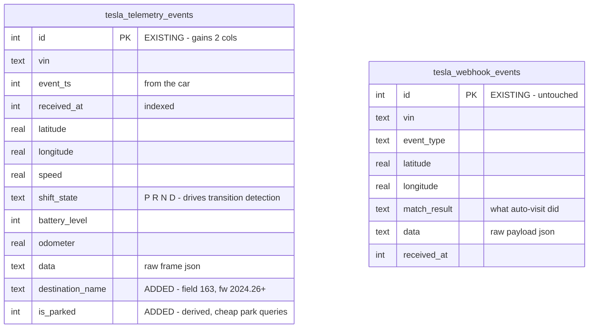

> Cross-DB note: `tesla_telemetry_events.vin` and the app DB's `showroom_visit_log.provenance_json` are the only linkage — deliberately loose, since D1 has no cross-database joins.

### 5.7 NEW — Discovery-search + exclusions  *(appended — real-time voice companion, §14)*
The on-demand "find me showrooms near here" flow is **worker-orchestrated and D1-backed** (the AI only orchestrates; the worker does the scrape and owns the rendered result). Artifacts are TSX-only (confirmed), so this gets dedicated tables, not the artifacts system.

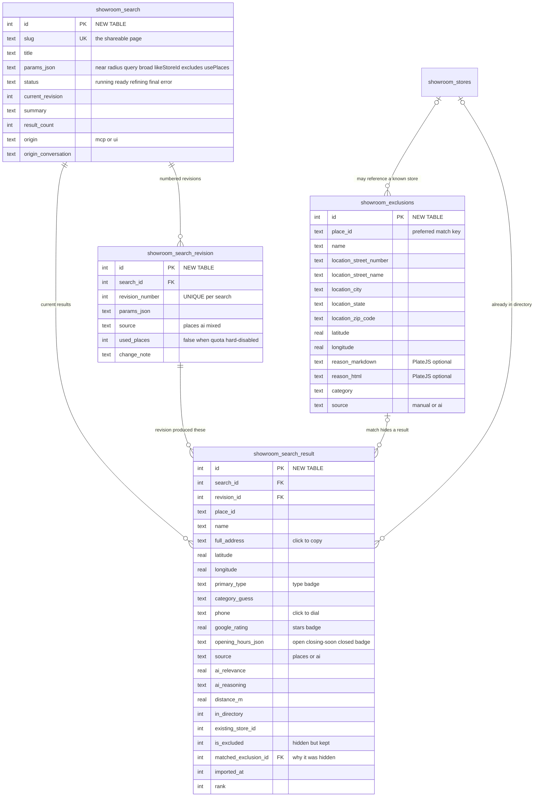

**`showroom_search`** (app `DB`) — one orchestrated search (a slug the user can open while still talking to Claude).
| column | type | notes |
|---|---|---|
| `id` | int PK | |
| `slug` | text unique | `/admin/shopping/showrooms/finder/<slug>` |
| `title` | text | human label the model gives it ("Remodel showrooms near Livermore, 1pm") |
| `params_json` | text (json) | the full query: `near` (point/area/`current-location`), `radiusM`, `query?` (optional — broad when absent), `broad` (bool), `excludeDirectory` (default true), `excludeNotInterested` (default true), `likeStoreId?`, `excludeCategories?`, `excludeStoreIds?` |
| `status` | text enum | `running` \| `ready` \| `refining` \| `final` \| `error`. A fresh slug is **pending** (`ready`, not yet `final`) — badged pending on the list — until the AI (or user) marks it `final`. |
| `current_revision` | int | latest revision number (see `showroom_search_revision`) |
| `summary` | text | short worker/AI summary of the result set |
| `result_count` | int | |
| `origin` | text | e.g. `mcp`, `ui` |
| `origin_conversation` | text | chat/session ref |
| `created_at` / `updated_at` | int timestamp | |

**`showroom_search_revision`** (app `DB`) — every change to a slug is a numbered revision (the model can always cite "revision N"). Mirrors the `artifact_revisions` pattern.
| column | type | notes |
|---|---|---|
| `id` | int PK | |
| `search_id` | int FK → `showroom_search.id` (cascade) | |
| `revision_number` | int | 1-based, per search |
| `params_json` | text (json) | the params used for this revision |
| `source` | text enum | `places` \| `ai` \| `mixed` (where this revision's results came from) |
| `used_places` | int (bool) | whether the Places API was actually called (vs hard-disabled by quota) |
| `change_note` | text | e.g. "excluded 'appointment only' + Foo Tile" |
| `created_at` | int timestamp | |
Unique `(search_id, revision_number)`.

**`showroom_search_result`** (app `DB`) — the result rows for a search (replaced on refine of the same slug).
| column | type | notes |
|---|---|---|
| `id` | int PK | |
| `search_id` | int FK → `showroom_search.id` (cascade) | |
| `revision_id` | int FK → `showroom_search_revision.id` (cascade) | which revision produced this row |
| `place_id` | text | Google Place id when available |
| `name` | text | |
| `location_street_number`/`location_street_name`/`location_city`/`location_state`/`location_zip_code` | text | mirrors `showroom_stores` normalized address |
| `full_address` | text | display/copy address string |
| `latitude`/`longitude` | real | |
| `category_guess` / `primary_type` | text | drive the **type badges** |
| `phone` | text | click-to-dial (`tel:`) |
| `website` | text | |
| `google_rating` | real | **stars badge** when available |
| `user_rating_count` | int | |
| `opening_hours_json` | text (json) | Places hours → the viewport computes **open / closing-soon / closed / closed-weekends** relative to the search time |
| `source` | text enum | `places` \| `ai` — where THIS candidate came from (model-submitted vs Places) |
| `ai_relevance` | real | 0–1 relevance score |
| `ai_reasoning` | text | why it's relevant (or not) |
| `distance_m` | real | from the search point |
| `in_directory` | int (bool) | already a registered showroom |
| `existing_store_id` | int | when `in_directory` |
| `is_excluded` | int (bool) | matched the not-interested list (kept, flagged, reported separately — not shown in the main list) |
| `matched_exclusion_id` | int FK → `showroom_exclusions.id` (set null) | which exclusion matched (so the model can explain *why* it was dropped) |
| `imported_at` | int timestamp | set when the user/AI imports this result into the directory |
| `rank` | int | sort order |
| `created_at` | int timestamp | |

**`showroom_exclusions`** (app `DB`) — the "seen it, not interested, never show me again" list. Net-new — today "rule out" only writes a 1★ rating on an already-imported store; there is no way to suppress a *candidate that was never imported*. Auto-applied to every discovery sweep.
| column | type | notes |
|---|---|---|
| `id` | int PK | |
| `place_id` | text | optional but preferred match key |
| `name` | text notNull | |
| `location_street_number`/`location_street_name`/`location_city`/`location_state`/`location_zip_code` | text | flat/normalized address (mirror `showroom_stores`) |
| `latitude`/`longitude` | real | optional — enables coord-proximity match when no place_id |
| `reason_markdown` / `reason_html` | text | "why I don't like it" — **PlateJS (markdown+html), optional**, captured in the exclude confirmation popup. Feeds the model's taste model. |
| `category` | text | |
| `source` | text enum | `manual` \| `ai` |
| `created_at` / `updated_at` | int timestamp | |
Match on `place_id` first; else fuzzy name + address/coord proximity. **Never resurfaces** in discovery (mirrors the `showroom_gaps` dismissed-key pattern). Indexes: `place_id`, `location_zip_code`.

---

## 6. Backend — the processing pipeline

### 6.1 The gating "box" (extensible)
Two independent decisions on every inbound Tesla event:

1. **Record?** (superseding) — `project_system_variables.tesla_record_telemetry == "true"`. When true, **every** telemetry frame and webhook is logged raw to `TESLA_DB`, unconditionally. When false, nothing is stored and processing is skipped entirely. This is the master switch on `/admin/config/tesla`.
2. **Process?** (extensible predicate) — a normalized `shouldProcessLocation(env, event)` that returns true when **any** enabled condition matches. **0022 ships exactly one condition: "a drive list is `active`."** The function is written as an OR of predicates so future conditions (event type, geofence, etc.) drop in without touching callers.

> Logging is independent of processing: data is always logged when recording is on, even when there's nothing to process.

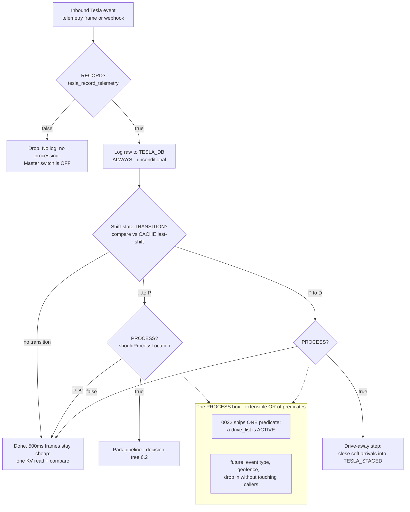

### 6.2 Park pipeline (decision tree)
Triggered when a park is detected (webhook `drive_state`/shift→P, or telemetry `Gear` transition to `P`), **and** recording is on, **and** `shouldProcessLocation` is true. Uses the parked `{lat,lng}` (from the event, else `getLocation`). "Within range" = configurable `tesla_proximity_radius_m` (default 250 m; home/work uses `tesla_home_work_radius_m`, default 150 m). All distance checks reuse `haversineMeters` against stored `latitude`/`longitude`.

**Transition detection (appended from external-PRD review).** Telemetry is ~500 ms — evaluating geospatial logic every frame is wasteful. The heavy pipeline runs **only on a shift-state *transition***, detected by persisting the **last shift state per VIN** in KV (`CACHE`, keyed `tesla:last-shift:<vin>`, short TTL) and comparing to the incoming frame:
- `…→P` (last `D`/`R`/`N`, now `P`) → **park event** → run the decision tree below.
- `P→D` (last `P`, now `D`) → **drive-away event** → run the departure step (close open `TESLA_SOFT_ARRIVAL` rows → `TESLA_STAGED` with `timestamp_departure`; see §6.2 drive-away).
- No transition → just log the raw frame (when recording), do nothing else.
This makes the raw 500 ms stream cheap (one KV read/write + compare) and confines all DB/Places/AI work to the two rare transition moments. Webhook `drive_state` events feed the same comparator, so either signal triggers it; dedupe on the event id via `CACHE` (existing `/webhook` pattern) so a webhook + its telemetry twin don't double-fire.

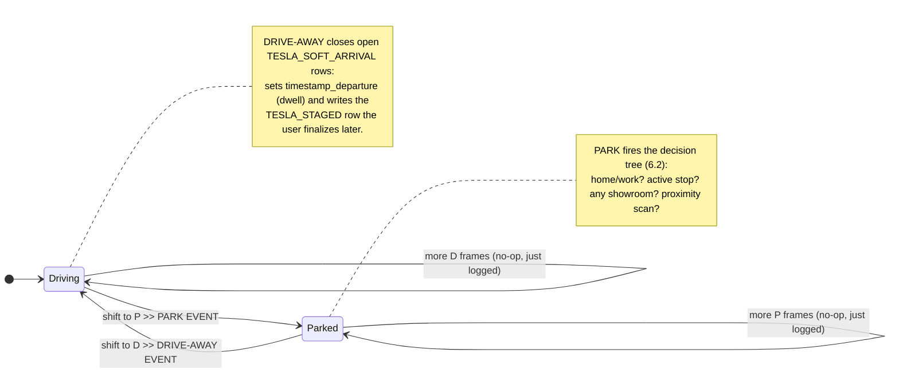

```
PARK EVENT (recording on, drive active)
│
├─ 1.a  Parked within range of HOME or WORK (configured coords)?
│        → set ALL active drives → paused  (the day is done)
│        → log, stop.  Processing halts (no active drive remains).
│
├─ 1.b  Parked within range of a stop on the ACTIVE drive?
│        → insert showroom_visit_log: type=TESLA_SOFT_ARRIVAL, status=TESLA_STAGED,
│          store_id, drive_list_id, drive_list_stop_id, arrival coords, provenance
│        → mark that drive stop visited (check-off) + flag "pending finalize"
│        → on NEXT drive-away (shift out of P / motion resumes):
│            insert showroom_visit_log: type=TESLA_STAGED, status=TESLA_STAGED,
│            store_id, drive_list_id, soft_arrival_id=<the soft row>,
│            timestamp_arrival (from Tesla/soft row), timestamp_departure=now
│        → stop.
│
├─ 1.c  Parked within range of ANY registered showroom (other drive / directory)?
│        → insert showroom_visit_log: type=TESLA_SOFT_ARRIVAL, status=TESLA_STAGED,
│          store_id (the matched showroom), drive_list_id (active), provenance
│        → (same drive-away → TESLA_STAGED follow-up as 1.b)
│        → stop.
│
└─ 1.d  Parked near NO known showroom → PROXIMITY SCAN
         → proximityScan({lat,lng,radiusM}) (normalized, reusable — §6.3)
         → if it returns a remodel-related candidate:
             • insert showroom_store_hitl_queue (user_decision=TBD, drive_list_id, proximity_scan_json)
             • insert a DETOUR drive_list_stop on the active drive (is_detour=1,
               hitl_queue_id set, visited=1/visited_at=now) — a first-class row so
               completion math + the map treat it consistently (§5.5b)
             • insert showroom_visit_log: type=TESLA_SOFT_ARRIVAL, status=TESLA_STAGED,
               hitl_queue_id, drive_list_id, provenance
             • on drive-away → TESLA_STAGED follow-up row (hitl_queue_id, departure)
         → else: log the park, no visit row.
```

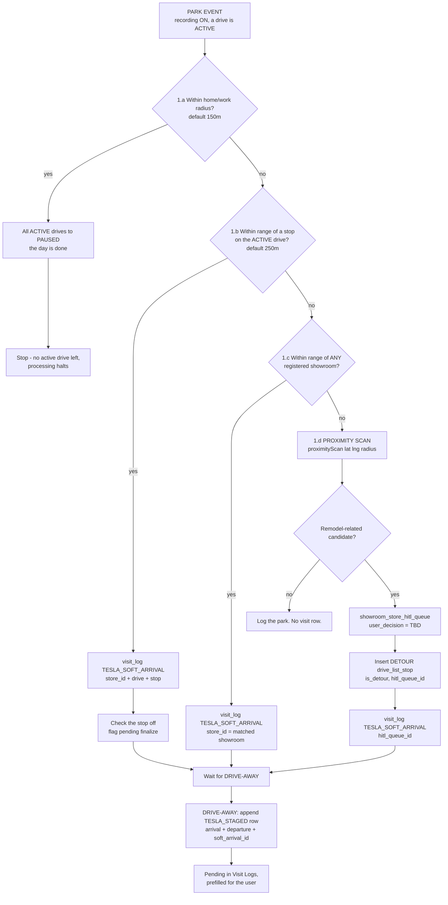

**Park to next-stop, end to end** (who calls what):

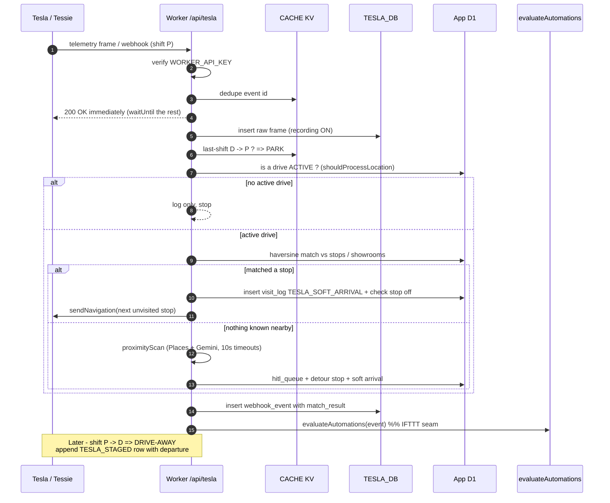

**Two-row model (per Justin's spec):** the `TESLA_SOFT_ARRIVAL` row asserts the *fact* the car parked there (even if the showroom was closed and he only peeked in the yard); the follow-up `TESLA_STAGED` row (created on drive-away, so it can carry a real departure time and thus a dwell duration) is the actionable entry the user finalizes. In the Visit Logs UI, the STAGED row is the pending item; the SOFT_ARRIVAL is its attached evidence.

### 6.3 `proximityScan` — normalized, reusable service
`src/backend/services/tesla/proximity-scan.ts` — `proximityScan(env, { latitude, longitude, radiusM }): Promise<ProximityCandidate[]>`.
- Google Places **Nearby Search** around the point (radius).
- Filter/classify results to remodel-relevant categories (stone, tile, flooring, paint, cabinets, plumbing/fixtures, lighting, appliances, hardware, windows/doors, contractors, design showrooms) — a keyword/type pre-filter to cut AI cost.
- Pass survivors to Gemini (existing `google/maps.ts` / gemini factory) with a structured-output schema matching the fields we capture at intake → returns normalized candidates.
- **Cost discipline:** invoked **only on park events while a drive is active** in 0022. The function takes a plain `{lat,lng,radiusM}` so a future "scan every N yards while driving" caller can reuse it unchanged (that caller is deferred pending a cost model — §9).
- Idempotency: dedupe candidates against existing `showroom_stores.place_id` and open `showroom_store_hitl_queue` rows before inserting.
- **Timeouts (required):** it runs inside `waitUntil` background processing, so **every** external fetch (Google Places Nearby, Gemini) must set `AbortSignal.timeout(10_000)` — an unresponsive upstream must never hang the background task. Errors are swallowed/logged, never allowed to reject an already-sent webhook response.

### 6.4 Home/Work resolution
- Primary residence + optional work address configured on `/admin/config/tesla` (address text → geocode to coords via existing `GoogleMapsService`, cached in `project_system_variables`).
- Also add a **"this is my primary residence"** toggle to the existing permit project-address config so the permit target address can *be* the home coordinate without re-entry.
- Future enhancement (noted, not built): Tesla telemetry `DestinationName` (field 163) / saved Home·Work labels could corroborate — but config-driven coords are the reliable 0022 path.

### 6.5 Navigation
- **Single destination** (existing `sendNavigation` → Tessie `/command/share`): used by the reusable Tesla button on stops and showrooms.
- **Whole-drive multi-waypoint** (NEW): "Send drive to car" → Tesla Fleet API `navigation_waypoints_request` via `api.tessie.com`, waypoints = **unvisited** stops on the active drive in order. Re-sends the remaining unvisited set when a stop is marked visited.
  - ⚠️ **Risk/spike:** the `navigation_waypoints_request` body is under-documented publicly (confirmed in research). **T-spike:** verify the exact payload against a live vehicle; **fallback** = send the first unvisited waypoint via `share` and advance sequentially on each park (already how park auto-advance works today).
  - **Timeout (required):** the waypoints fetch to `api.tessie.com` sets `AbortSignal.timeout(15_000)`, matching the existing `sendNavigation` wake-and-share timeout — a hung command must not stall the request.

---

## 7. API + MCP surface

**Surface map** — every MCP tool has a REST twin (parity is a requirement); both go through one service layer to D1.

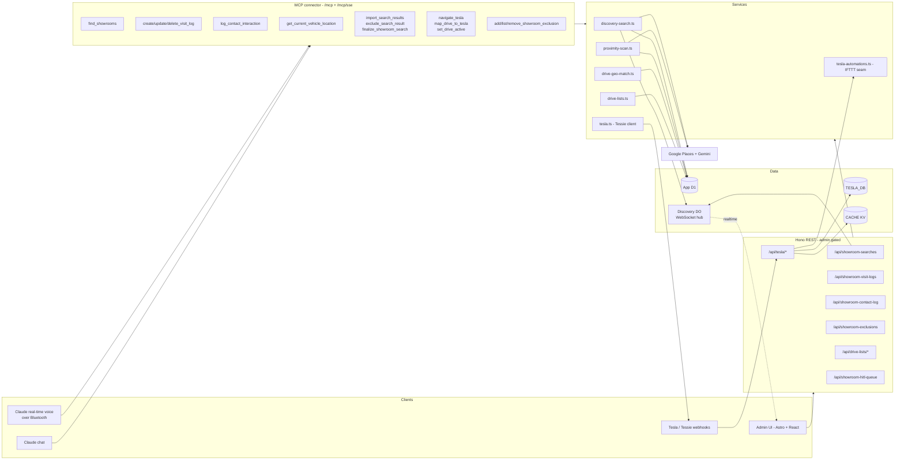

**MCP tool contracts** (the ones the voice loop leans on):

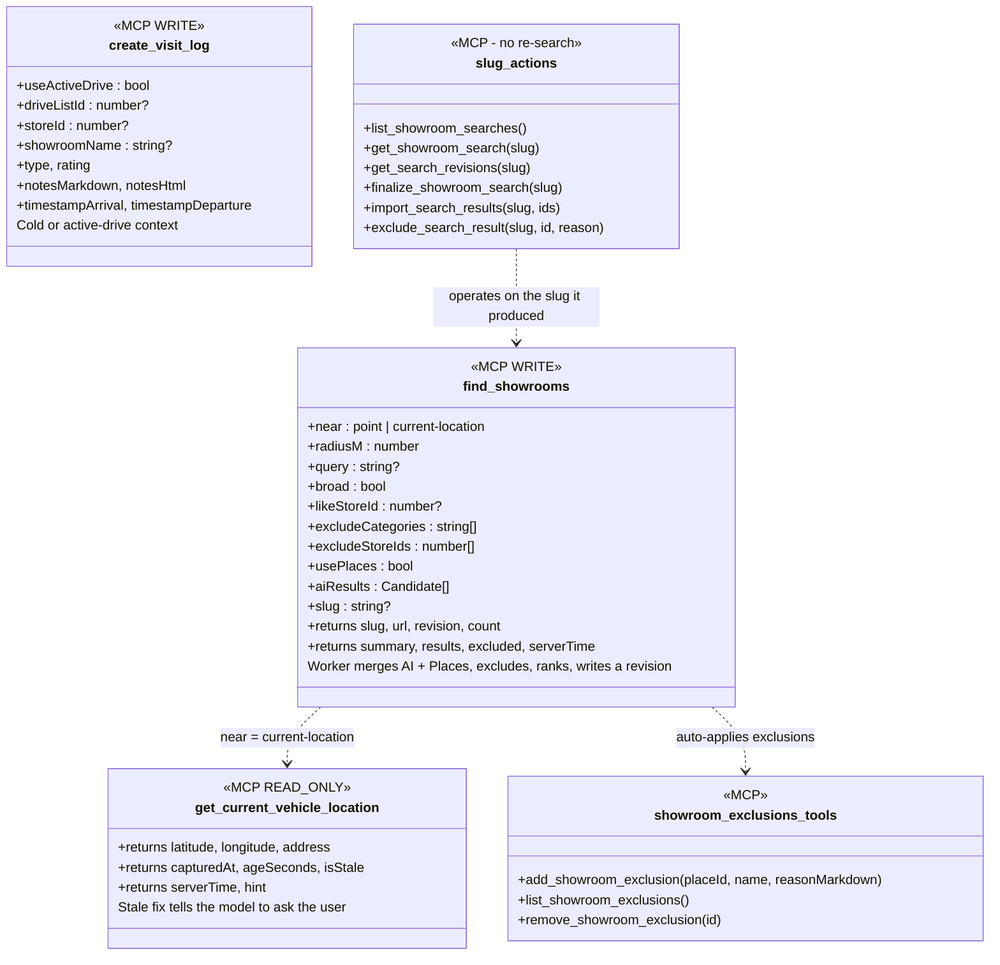

### 7.1 REST (Hono, admin-gated unless noted)
- `POST /api/showroom-visit-logs` — create (manual/new).
- `GET /api/showroom-visit-logs?status=pending|completed&storeId=` — list (Pending = `TESLA_STAGED|AI_STAGED|DRAFT`; Completed = `SUBMITTED`).
- `GET /api/showroom-visit-logs/:id` — one.
- `PATCH /api/showroom-visit-logs/:id` — finalize/update (status transitions, notes markdown+html, rating, type, departure).
- `GET /api/showroom-stores/:id/visit-logs` — visits for a store (viewport).
- `GET /api/showroom-hitl-queue?decision=TBD|PROCESS|DO_NOT_PROCESS` — discovery queue.
- `PATCH /api/showroom-hitl-queue/:id` — decide (`PROCESS` → run intake, set `store_id`; `DO_NOT_PROCESS`).
- `PATCH /api/drive-lists/:slug/active` — set active/paused (single-active enforced).
- `POST /api/tesla/navigate-drive` — multi-waypoint send for a drive (unvisited only).
- `POST /api/showroom-visit-logs` also serves the model's cold/active-drive create (`useActiveDrive`, `showroomName` resolution) — full CRUD (GET/PATCH/**DELETE**) at parity with the MCP tools (§14.1).
- `POST /api/showroom-contact-log` — log a phone/email/in-person interaction (mirrors `log_contact_interaction`).
- **Discovery search:** `GET /api/showroom-searches` (list), `GET /api/showroom-searches/:slug` (head + latest results), `GET /api/showroom-searches/:slug/revisions` (revision history), `POST /api/showroom-searches` (create/run), `POST /api/showroom-searches/:slug/refine` (new revision in place), `POST /api/showroom-searches/:slug/finalize` (status→`final`), `POST /api/showroom-searches/:slug/import` (bulk-import selected result ids → intake), `POST /api/showroom-searches/:slug/exclude` (result → `showroom_exclusions`, remove from slug). Execution runs in `waitUntil`; **realtime via WS** (§14.5), polling fallback.
- **Realtime:** `GET /api/showrooms/discovery/ws` (+ per-slug room) — WebSocket to the discovery broadcast DO.
- **Exclusions:** `GET/POST /api/showroom-exclusions` (reason = PlateJS markdown+html), `DELETE /api/showroom-exclusions/:id`.
- Config: reuse `GET/POST /api/admin/config` for the Tesla keys (no new route).
- Webhook/telemetry ingest: extend existing `/api/tesla/webhook` + `/api/tesla/telemetry` with the recording gate + park pipeline hook.

### 7.2 MCP tools (`src/backend/mcp/tools/tesla.ts`, new category `tesla` or under `drives`/`showrooms`)
- `get_current_vehicle_location` (RO) — `{lat,lng,address, capturedAt, ageSeconds, isStale, serverTime, hint?}` (§14.3). Backs "what's near me" + time/location grounding.
- **Visit CRUD (full, §14.1):** `create_visit_log` (cold or `useActiveDrive`/`driveListId`; optional `storeId`/`showroomName`), `get_visit_log`, `list_visit_logs`, `update_visit_log`, `delete_visit_log`. `stage_showroom_visit` (WRITE) = `AI_STAGED` convenience; `finalize_visit_log` = status→`SUBMITTED`. Extend `record_showroom_visit` to also insert a `SUBMITTED` `showroom_visit_log`.
- `log_contact_interaction` (WRITE) — phone/email/in-person → `showroom_store_contact_log` (§14.1).
- **Discovery orchestration (§14.2):** `find_showrooms` (WRITE — worker merges `aiResults[]` + (optional, quota-guarded) Places sweep, excludes directory + not-interested, ranks, writes a revision, returns `{slug,url,revision,count,summary,serverTime,results,excluded}`; params incl. `near`/`current-location`, `radiusM`, `query?`, `broad`, `likeStoreId`, `excludeCategories`, `excludeStoreIds`, `usePlaces`, `aiResults[]`; pass an existing `slug` to **refine in place**). `list_showroom_searches`/`get_showroom_search`/`get_search_revisions` (RO — pick up an existing slug). `finalize_showroom_search` (WRITE — mark `final`). `import_search_results` (WRITE — bulk-import result ids → intake). `exclude_search_result` (WRITE — result → exclusions, off the slug). All operate on a slug **without re-running a search**. Tool description states the model may ALSO use its own web tools (submit via `aiResults`).
- **Exclusions (§14.2):** `add_showroom_exclusion` (WRITE), `list_showroom_exclusions` (RO), `remove_showroom_exclusion` (WRITE).
- `whats_near_me` (RO) — thin wrapper: `find_showrooms` around the live location; returns candidates + already-registered nearby.
- `list_showroom_discoveries` (RO) + `decide_showroom_discovery` (WRITE) — triage the park-event HITL queue.
- `navigate_tesla` (WRITE) — single destination (store_id / stop / coords / address).
- `map_drive_to_tesla` (WRITE) — multi-waypoint send for a drive.
- `set_drive_active` (WRITE) — mark a drive active/paused.

**Cross-cutting:** every location/discovery tool returns `serverTime`; timestamped payloads include a worker-computed `ageSeconds` so the model is time-rooted (§14.3).

All tools: hand-written Zod v4, `READ_ONLY`/`WRITE` annotations, examples, `url` fields to the relevant page — matching `tools/drives.ts`.

---

## 8. Config (`/admin/config/tesla`)
Backed by `project_system_variables` (category `tesla`), reusing `GET/POST /api/admin/config`:
- `tesla_record_telemetry` — Switch (`"true"`/`"false"`). **Master switch.**
- `tesla_primary_residence_address` (+ resolved `tesla_home_lat`/`tesla_home_lng`).
- `tesla_work_address` (+ resolved `tesla_work_lat`/`tesla_work_lng`, optional).
- `tesla_proximity_radius_m` (default 250), `tesla_home_work_radius_m` (default 150).
- `tesla_proximity_scan_enabled` (Switch; on = allow §6.3 during active drives).
- `tesla_location_stale_seconds` (default 300) — age past which `get_current_vehicle_location` reports `isStale` (§14.3).
- Add nav entry to `config-nav.ts`; page mirrors `PropertyAddressConfigApp.tsx` inside `ConfigShell`.
- Add a **"primary residence"** toggle to the permit address config so home coords can be shared.

---

## 9. Cost & telemetry strategy
- **Logging** every 500 ms frame is the user's explicit ask ("log everything") — honored while `tesla_record_telemetry` is on. Note: ~170k rows/day/vehicle. `TESLA_DB` is isolated for exactly this. A per-VIN coalesce (write on state-change / N-second cadence) is the documented upgrade lever if D1 volume bites (already noted in `tesla.ts`).
- **Places/AI cost is the real spend.** 0022 confines `proximityScan` to **park events during an active drive** (rare, bounded). 
- **Deferred (needs a cost model before building):** always-on "scan every ~400 yards while driving, no active drive." Captured as a future task, explicitly gated. Do **not** build in 0022.

---

## 10. Rollout phases
- **P0 — Foundation (mostly shipped):** drive lists, single-active, Tessie client, telemetry/webhook ingest, park auto-visit, automations placeholder. Marked `done` in the plan.
- **P1 — Visit log data + workspace:** `showroom_visit_log` table, REST + MCP, Visit Logs pages (list/finalize/new), PlateJS notes. Store viewport "Visits" section. *Ships value immediately even with GPS off.*
- **P2 — Config + gating:** `/admin/config/tesla`, recording master switch, home/work, `shouldProcessLocation`.
- **P3 — Park pipeline:** decision tree 1.a–1.c wired to telemetry/webhook; TESLA_SOFT_ARRIVAL → drive-away STAGED two-row flow; drive check-off ↔ visit-log linkage; drive `paused` state + Active toggle.
- **P4 — Discovery (HITL):** `showroom_store_hitl_queue`, `proximityScan`, decision tree 1.d, discoveries page, detour forks, `showroom_stores` proximity flags.
- **P5 — Navigation:** reusable Tesla button on showrooms; multi-waypoint "send drive to car" (+ spike); re-send-on-visit.
- **P6 — AI surface:** `whats_near_me`, `get_current_vehicle_location`, `stage_showroom_visit`, discovery/visit MCP tools.
- **P7 — Voice companion (§14):** full visit/contact CRUD (MCP+API parity, cold + active-drive), the worker-orchestrated discovery finder (`showroom_search`/`_result` + `find_showrooms` + finder pages), the `showroom_exclusions` not-interested list, time/location grounding (staleness + `serverTime`), and the real-time MCP keepalive fix.

Each phase is independently shippable; P1 alone is useful. P7 is the highest-leverage for the daily driving workflow — can be pulled forward after P1/P2 if the voice loop is the priority.

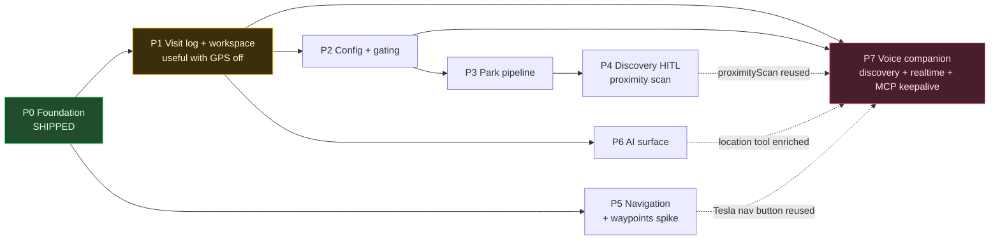

> Pull-forward path for the daily driving loop: **P0 → P1 → P2 → P7**. P3–P6 add automation depth but the voice + discovery loop works without them.

---

## 11. Acceptance criteria (headline)
- **A1.** A showroom can have N visit rows; the store viewport lists them, newest first, with a **PENDING** badge on non-`SUBMITTED` rows and a one-click **Finalize** into the same-page/full-page editor.
- **A2.** With GPS on + a drive active, parking at a listed stop auto-creates a `TESLA_SOFT_ARRIVAL`, checks the stop off, and — after the user drives away — leaves a `TESLA_STAGED` visit prefilled (arrival, departure, store, drive) awaiting finalize.
- **A3.** `/admin/shopping/showrooms/visitlogs` shows Pending first, Completed second; empty Pending shows a congratulatory state.
- **A4.** New visit log page: showroom autocomplete with **OTHER** → opens new-showroom intake modal → the created `store_id` binds to the form.
- **A5.** Parking near an unregistered remodel place (drive active) stages a discovery; the discoveries page lets the user PROCESS (→ intake) or reject; a drive-list detour fork appears.
- **A6.** "Navigate via Tesla" works from a drive stop **and** from a showroom viewport; "Send drive to car" pushes unvisited stops as waypoints (or the documented fallback).
- **A7.** `/admin/config/tesla`: master recording switch, home/work addresses; parking at home/work pauses all active drives.
- **A8.** All visit/discovery notes persist **both** markdown and html (PlateJS). Enforced in schema, API, MCP, and UI.
- **A9.** The AI can, via MCP: report the car's current location, list nearby candidate showrooms, stage visits, and triage discoveries.
- **A10.** The AI can full-CRUD a visit log and log a contact interaction (phone/email/in-person) by voice — cold or against "my active drive" with no id — mirrored 1:1 by REST.
- **A11.** `find_showrooms` (broad or specific) runs a worker-side sweep that auto-excludes the directory + not-interested list, persists a slug, and returns a small `{slug,url,summary}`; the slug page appears live in the finder and refines in place on a follow-up call. `add_showroom_exclusion` suppresses a candidate from all future sweeps.
- **A12.** `get_current_vehicle_location` returns `capturedAt` + worker-computed `ageSeconds` + `isStale` + `serverTime`; a stale fix makes the model ask the user rather than search a wrong point.
- **A13.** MCP tools stay available through a long real-time voice session (P7-INFRA-01), without regressing normal-chat MCP.

---

## 12. Risks & open questions
- **R1 (spike).** `navigation_waypoints_request` payload under-documented → verify live; fallback to sequential share.
- **R2.** Park detection reliability from Tessie webhook vs telemetry `Gear` — implement both; dedupe via `CACHE` (pattern already in `/webhook`).
- **R3.** GPS parking offset (park down the street) → radius is configurable; default 250 m; tune from real data.
- **R4.** Proximity-scan false positives (gas station, unrelated retail) → AI classifier + user HITL gate absorbs this by design; keep the reject path one tap.
- **R5.** D1 write volume from 500 ms logging → isolated DB now; coalesce lever documented.
- **Q1.** Should a `SUBMITTED` visit-log rating overwrite the `showroom_stores` denormalized snapshot? **Proposed:** yes — latest `SUBMITTED` wins the snapshot; the log keeps full history.
- **Q2.** Drive "Active toggle" off → `paused` vs `draft`? **Proposed:** `paused` (resumable), reserving `draft` for never-started.

---

## 14. Real-time voice driving companion  *(appended)*
The primary field workflow is a **hands-free Claude voice session over Bluetooth while driving**. Between showrooms the user dictates visit notes; on the road they ask "find me something nearby, I've got time to kill." Three capabilities must be first-class for that to work: full visit/contact CRUD from the model, a worker-orchestrated discovery search the model drives but doesn't render, and time/location grounding. Plus a reliability fix so tools don't drop mid-voice-session.

### 14.1 Visit + contact CRUD from the model (MCP **and** API, full parity)
The model must be able to log interactions conversationally, both **cold** and **in active-drive context**:
- **Cold:** "just record a showroom visit" / "I just had a phone call with X, log it" — no drive list involved.
- **Active-drive context:** "on my active drive I just visited X, here are the notes" — the tool resolves **the** active drive (single-active invariant) automatically; no id needed.
- Full CRUD, not just create: `create_visit_log`, `get_visit_log`, `list_visit_logs`, `update_visit_log`, `delete_visit_log` — mirrored 1:1 by REST (`/api/showroom-visit-logs`). Create accepts an optional `driveListId` OR a `useActiveDrive: true`, an optional `storeId` (or a `showroomName` the tool resolves/creates), `type`, `rating`, `notes` (markdown+html), arrival/departure.
- **Contacts:** `log_contact_interaction` (→ `showroom_store_contact_log`, `type` = `PHONE|EMAIL|SHOWROOM_IN_PERSON`, optional `showroomVisitLogId`) so "log a phone call" is one tool call.
- Notes obey the PlateJS rule: markdown+html both stored. When the model supplies plain text, the API derives html from markdown.

### 14.2 Worker-orchestrated discovery search (the "beefed-up" finder)
Today `search_showrooms` returns a handful of Places text-search hits, unpersisted. Replace/augment with an **orchestration split**: the model *orchestrates*, the worker *executes + renders*.

- **`find_showrooms` MCP tool** — the model calls it with intent (`near`/`current-location`, `radiusM`, optional `query`, `broad`, `likeStoreId`, `excludeCategories`, `excludeStoreIds`, **`usePlaces`**, **`aiResults[]`**, optional **`slug`**). It does **not** require a specialty — broad "anything home-remodel" is first-class. The **worker** then, as **one revision** of the slug:
  1. takes the model's own **`aiResults[]`** (candidates the model found with its *own* tools) — `source: "ai"`,
  2. if `usePlaces` and the Places API is available, runs a **wide Places sweep** around the point (`source: "places"`) — real radius/nearby search + paging (extend `placesTextSearchMany`: today a 50 km bias, single page ≤20),
  3. **merges + dedupes** AI + Places candidates,
  4. **auto-excludes** the user's directory (`showroom_stores.place_id`) and the **not-interested** list (`showroom_exclusions`) — flagging excluded rows `is_excluded` + `matched_exclusion_id` rather than dropping them silently,
  5. classifies/ranks survivors with Gemini (`likeStoreId` biases toward a loved store's profile), captures hours/type/rating/phone for the viewport,
  6. writes a new `showroom_search_revision` (+ its result rows); `create` makes revision 1 under a fresh slug, `slug` given → appends the next revision **in place**,
  7. returns a **small** payload: `{ slug, url, revision, count, summary, serverTime, results:[…], excluded:[{name, matchedExclusionReason}] }` — the `excluded` key is **separate** so if the user asks "why isn't Foo Tile here?", the model can answer *"it's on your not-interested list."* Raw result detail lives on the page, not the context.
- **Places hard-disable (cost guard).** `usePlaces` is a toggle, but even when true the worker **hard-disables** the Places call when the maps-usage D1 table reports the free tier is exhausted (would incur cost) — it reuses the existing `isUnderMonthlyQuota()` / `MAPS_MONTHLY_FREE_TIER_LIMIT` + usage log. When hard-disabled, the revision runs on `aiResults` only, `used_places=false`, and the summary says so, so the model/user know Places was skipped for cost (not error).
- **The result lives on a page, not in the model's context** (`/admin/shopping/showrooms/discovery/<slug>`), appearing live in the discovery list as it runs (§14.5 realtime).
- **Refine = a new revision, in place.** Same `slug` + adjusted params → the worker appends a revision and swaps the visible result set (status `refining` → `ready`). The model never rebuilds the page. Every slug keeps a numbered revision history.
- **Slug actions WITHOUT re-running a search (MCP + API parity).** Once a slug exists, the model (or UI) can operate on it directly: `list_showroom_searches` (pick up an existing slug), `get_showroom_search`, **mark it `final`**, **bulk-import** selected results into the directory (same intake path), **exclude** a result → `showroom_exclusions` (removes it from the slug). None of these re-run a search.
- **Model keeps its own tools.** The tool description states the model may *also* use its own web search/knowledge — `find_showrooms` is an accelerator (merge + exclusions + persistence + rendering), not a replacement, and the model can submit what it finds via `aiResults[]`.
- **Not-interested capture:** `add_showroom_exclusion` (place_id/name/address + optional PlateJS reason) — one call; auto-applied to all future sweeps. `list_showroom_exclusions` / `remove_showroom_exclusion` round out CRUD.
- Cost: user-initiated (not per-frame); quota-gate + hard-disable as above; dedupe before AI classification. (Deep browser-rendering scrape via `ShowroomResearchAgent` is a **future** "go deep on these" second pass; 0022 discovery is Places+Gemini breadth.)

**The voice loop, end to end** — note the model never holds the result list; it holds a slug.

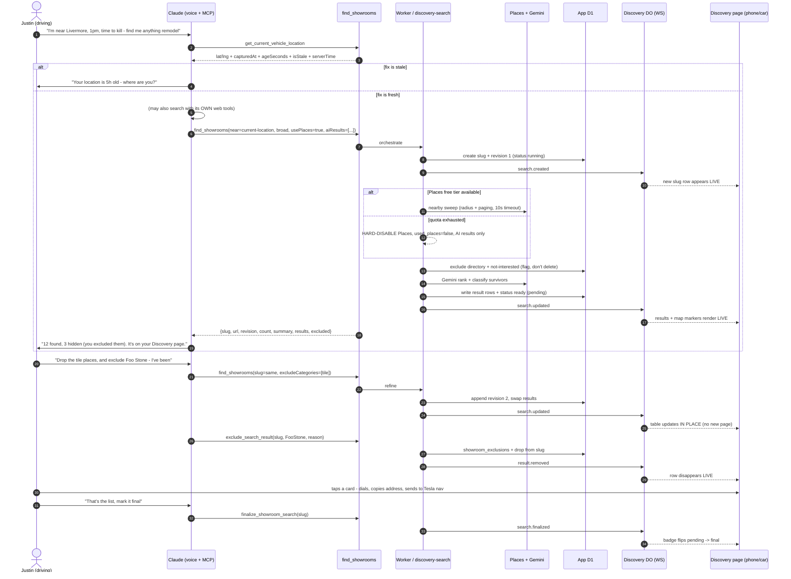

**Discovery slug state machine:**

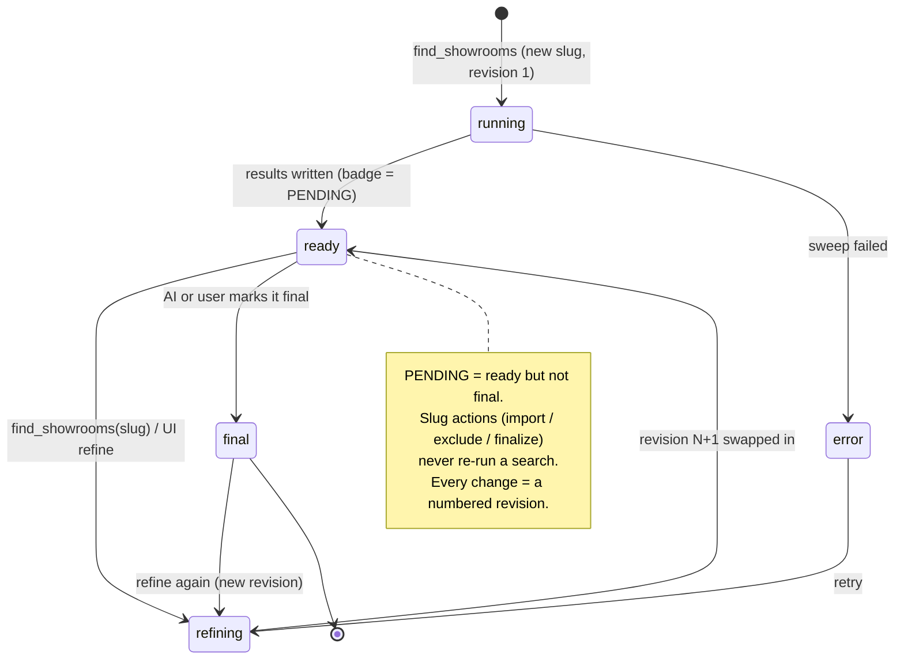

### 14.3 Time + location grounding (models are bad at "now")
Every location/discovery MCP tool returns `serverTime` (ISO) so the model is time-rooted on each call. Specifically:
- **`get_current_vehicle_location`** returns `{ latitude, longitude, address, capturedAt, ageSeconds, isStale, serverTime }`. `ageSeconds` = `serverTime − capturedAt` computed by the worker; `isStale` = `ageSeconds > tesla_location_stale_seconds` (config, default ~300s). When stale, the payload says so explicitly (`isStale: true` + a `hint` string) so the model asks the user for their location instead of trusting an 18,000-seconds-ago fix.
- `find_showrooms` with `near: "current-location"` uses this internally and refuses/falls back gracefully when the fix is stale (returns a `needsUserLocation` flag rather than searching a stale point).

### 14.4 Real-time (voice) MCP reliability — keep tools alive
**Symptom:** MCP tools report "down" during Claude *real-time voice* sessions but work immediately in normal text chat. **Findings:** the connector is served as Streamable-HTTP `/mcp` + SSE `/mcp/sse` via `OAuthProvider` → `RemodelMcpAgent` (`McpAgent` DO); the only keepalive is the `agents` library's 30 s SSE ping — **there is no app-level heartbeat/session-pinning**, and the DO is per-session. Long-lived voice sessions plausibly break on one of: (a) the voice connector negotiating a transport whose stream isn't kept warm, (b) **DO hibernation/eviction** between sparse voice tool calls, (c) OAuth **token expiry** over a long session.
- **Spike + fix task (P7-INFRA-01):** confirm which transport claude.ai voice negotiates and whether the `RemodelMcpAgent` DO is being hibernated/evicted mid-session; then add an app-level keepalive — e.g. a DO `alarm()`-driven self-ping / session-pin while a session is open, WebSocket auto-response/hibernation handling, and/or lengthened session TTL — so tools stay registered and reachable for the duration of a voice drive. Verify against a real voice session.
- This is scoped as investigate-then-implement (the exact fix depends on the transport finding); it must not regress normal-chat MCP behavior.

### 14.5 Realtime discovery pages (WebSocket)
The discovery **list** and **slug viewport** are **live** — a search kicked off by voice appears as a new row while the user is parked, revisions swap results in place, and a result removed (imported or excluded) via **UI, MCP, or API** disappears on the page in realtime, no refresh.
- Implement with a Durable Object broadcast hub (reuse the existing realtime pattern — `EstimateCollabHub` / `FloorplanSessionDO`; WebSocket route wired in `src/_worker.ts` like `/api/room/:name/ws`). Pages open a WS to a `discovery` room; every write path (`find_showrooms`, import, exclude, mark-final — whether from MCP, REST, or the UI) publishes a small event (`search.created`, `search.updated`, `result.added/removed`, `search.finalized`) that the hub fans out to subscribers.
- Writes stay in D1 (source of truth); the WS carries only change notifications (client re-reads or patches). Fall back to polling if the socket drops.
- Scope: the two discovery pages in 0022. (Other pages can adopt the same hub later.)

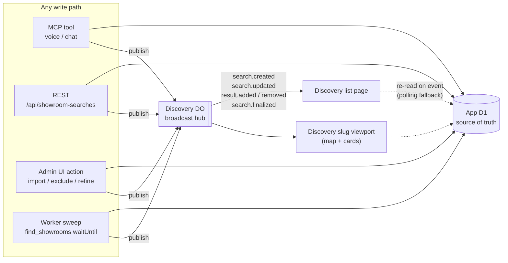

---

## 13. Appendix — reconciliation with the external (Gemini-chat) PRD
A second PRD was drafted in a separate Gemini chat. It largely mirrors this plan (same feature set, smaller schema). Everything in this plan is retained; the following were **appended** from that review, and a few of its suggestions were **intentionally not adopted** because they conflict with repo conventions.

**Adopted (appended above):**
- **Shift-state transition detection via persisted last-state (KV).** §6.2 — run the heavy pipeline only on `…→P` / `P→D` transitions, comparing the incoming frame to `tesla:last-shift:<vin>` in `CACHE`. Makes the 500 ms stream cheap and gives the drive-away step a precise trigger. (Its idea; it proposed `AGENT_ADHOC_MEMORY_KV` — we use `CACHE` for consistency with the existing webhook-dedup path.)
- **`drive_list_stops` detour columns** `is_detour` + `hitl_queue_id`. §5.5b — makes a discovery detour a first-class stop row (consistent completion math + map) instead of a side channel.
- **Staged-visit alert banner** on the showroom viewport (UX §1) — a prominent "Complete your visit notes" `Alert` for `*_STAGED` visits, alongside the header chip.

**Not adopted (kept our approach):**
- *Hand-written `0110_tesla_visit_tracking.sql` migration* → repo rule is **`pnpm run db:generate`** only; never hand-author migrations (`AGENTS.md`, project memory). Drizzle generates them.
- *"Workers AI verification" for proximity classification* → this repo calls **Gemini direct** (not via AI Gateway; every call logged to `gemini_usage_log`) per project memory. `proximityScan` uses the existing Gemini factory.
- *Dropping visit richness* → the external schema omits `rating`, GPS provenance (`arrival_lat/lng`, `match_distance_m`, `gps_source`, `provenance_json`), the `soft_arrival_id` self-ref, and the CHECK/XOR/unique constraints. **Retained** — they back the multi-visit history, the GPS-attestation moat (§1), and DB-level integrity (§5.1).
- *`interaction_type` default `SHOWROOM_IN_PERSON`* → we keep the enum **nullable/no default** so a legacy phone/email contact isn't silently mislabeled in-person; the visit-log flow sets `SHOWROOM_IN_PERSON` explicitly.
- Its MCP/API/frontend set is a subset of §7/UX (we additionally have `whats_near_me`, `get_current_vehicle_location`, discovery + finalize tools, the `/new` visit page, the "all caught up" empty state, and the two-row soft-arrival model). No reductions.
