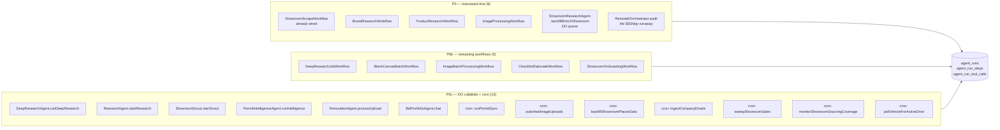
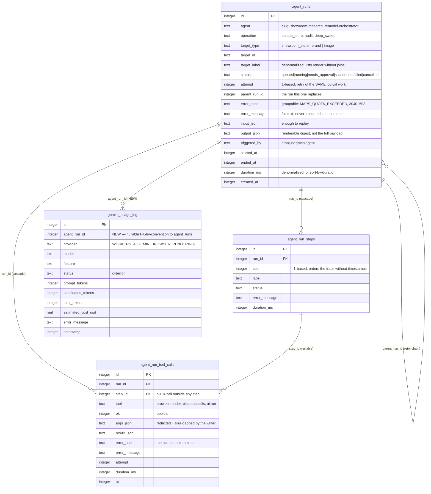
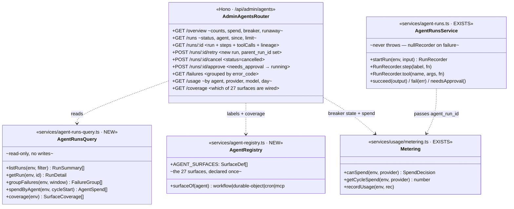
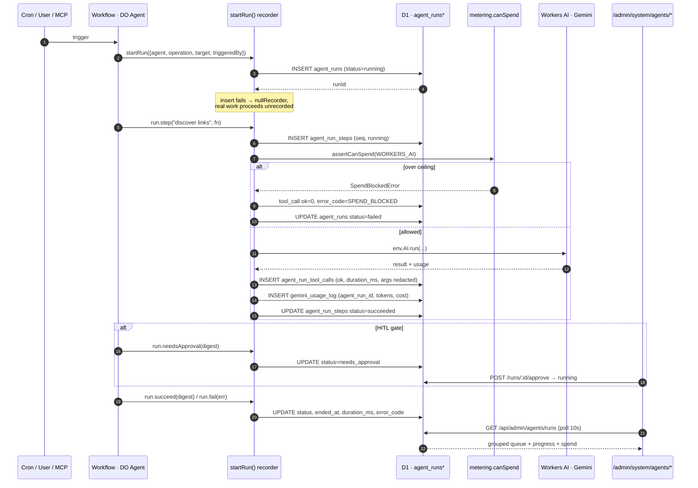
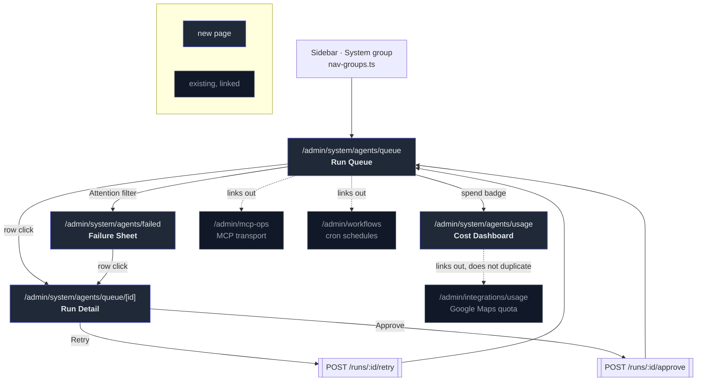

# 0026 — Agent Ops Transparency · Implementation Plan

**Plan slug:** `0026_agent_ops_transparency` → tracked live at `/admin/plans/0026_agent_ops_transparency`
**PRD:** [PRD.md](./PRD.md) · **Agent brief:** [PROMPT.md](./PROMPT.md)

---

## 0. What is already built (do not rebuild)

| Asset | File | State |
|---|---|---|
| `agent_runs` / `agent_run_steps` / `agent_run_tool_calls` | `src/backend/db/schema/agents/runs.ts` | **Merged on `main`.** Zero readers. |
| `startRun` recorder (`step`/`tool`/`succeed`/`fail`/`needsApproval`) | `src/backend/services/agent-runs.ts` | **Merged.** One caller. |
| `errorCodeOf` / `safeJson` redaction + size caps | `src/backend/services/agent-run-format.ts` | Merged. |
| `gemini_usage_log` (provider-agnostic, tokens + `estimated_cost_usd`) | `src/backend/db/schema/system/gemini-usage.ts` | Merged. |
| Spend breaker (`canSpend`, `tripBreaker`, `SpendBlockedError`) | `src/backend/services/usage/metering.ts`, `metered-ai.ts` | Merged. Fails closed. |
| Cron schedule config + run history | `src/backend/db/schema/admin/workflow_schedules.ts` | Merged, has its own `/admin/workflows` API. |
| Mermaid rendering in changelog detail | `src/frontend/components/mermaidcn/` | Merged. `client:load` required. |

**The only writer today** is `showroom-scrape-workflow.ts:213`. Everything else
in this plan hangs off closing that gap.

---

## 1. Instrumentation coverage map

27 surfaces. Ordered by value = (blast radius × failure rate × cost).



**Rule for every call site:** wrap, never rewrite. `startRun` is best-effort by
contract — it returns a no-op recorder rather than throwing — so adding it can
never break the work it measures. Do not add try/catch around it.

---

## 2. Data model

Existing tables, unchanged, plus **one additive column**.



### Migration (P1-DB-01)

Generated with `pnpm run db:generate`, applied with `pnpm run migrate:remote`.
**Never** hand-edit a migration, never `wrangler d1 execute --file`.

```sql
ALTER TABLE `gemini_usage_log` ADD `agent_run_id` integer;
CREATE INDEX `gemini_usage_log_agent_run_idx` ON `gemini_usage_log` (`agent_run_id`);
```

Additive + nullable + no backfill → safe against the ~20 concurrent branches
sharing this remote D1.

### The four queries that back the UI

```sql
-- Q1 · queue, grouped by status (index: agent_runs_status_created_idx)
SELECT r.status, r.id, r.agent, r.operation, r.target_label, r.attempt,
       r.triggered_by, r.error_code, r.duration_ms, r.created_at,
       COUNT(s.id)                                          AS steps_total,
       SUM(CASE WHEN s.status = 'succeeded' THEN 1 ELSE 0 END) AS steps_done
  FROM agent_runs r
  LEFT JOIN agent_run_steps s ON s.run_id = r.id
 WHERE r.created_at >= ?window
 GROUP BY r.id
 ORDER BY r.created_at DESC
 LIMIT ?limit;

-- Q2 · one run, full trace (indexes: run_seq_idx, tool_calls run_idx)
SELECT * FROM agent_runs       WHERE id      = ?id;
SELECT * FROM agent_run_steps  WHERE run_id  = ?id ORDER BY seq;
SELECT * FROM agent_run_tool_calls WHERE run_id = ?id ORDER BY at;
--   plus the retry lineage:
WITH RECURSIVE chain(id) AS (
  SELECT ?id UNION SELECT r.parent_run_id FROM agent_runs r JOIN chain c ON r.id = c.id
) SELECT * FROM agent_runs WHERE id IN (SELECT id FROM chain) ORDER BY attempt;

-- Q3 · failure triage — "5 runs failed the same way"
SELECT error_code, agent, operation, COUNT(*) AS n, MAX(created_at) AS latest
  FROM agent_runs
 WHERE status = 'failed' AND created_at >= ?window
 GROUP BY error_code, agent, operation
 ORDER BY n DESC;

-- Q4 · spend, attributed (needs the new column)
SELECT COALESCE(r.agent, '(unattributed)') AS agent,
       u.provider, u.model,
       SUM(u.total_tokens)        AS tokens,
       SUM(u.estimated_cost_usd)  AS cost_usd,
       SUM(u.status = 'error')    AS errored_calls
  FROM gemini_usage_log u
  LEFT JOIN agent_runs r ON r.id = u.agent_run_id
 WHERE u.timestamp >= ?cycleStart
 GROUP BY agent, u.provider, u.model
 ORDER BY cost_usd DESC;
```

---

## 3. API

New router `src/backend/api/routes/admin-agents.ts`, mounted at
`/api/admin/agents` — which puts it behind the existing
`app.use("/api/admin/*", requireAccessAuth)` gate at `api/index.ts:117`. No new
auth code.



Every response is Zod-validated via `@hono/zod-openapi` so `/openapi.json`,
`/scalar` and the MCP catalog stay honest. Hand-written Zod v4 schemas — never
`drizzle-zod` (it breaks `pnpm run build` on the pinned `drizzle-orm@0.33.0`).

---

## 4. Request flow — instrumented run, end to end



---

## 5. Screen map



---

## 6. Phases

Each phase = one PR, one QC script, one changelog entry. Task keys match the
`plan_tasks` rows staged in D1.

### P0 — Instrumentation coverage (`AGENT-P0-*`)
Close the writer gap. No UI. Value lands immediately because the ledger starts
filling.

- `P0-INST-01` `agent-registry.ts` — declare all 27 surfaces once (slug,
  display name, surface kind, expected cadence). Coverage + labels read from it.
- `P0-INST-02..07` — wrap the six highest-value surfaces (brand research,
  product research, image processing, showroom backfill queue task,
  orchestrator audit, deep-research job).
- `P0-INST-08` — thread `agent_run_id` from the recorder into `recordUsage`, so
  spend attributes without call-site changes.
- `P0-INST-09` — retention sweep in the existing `* * * * *` cron: prune
  `succeeded` > 30d, `failed` > 90d, via `db.batch()`.

### P1 — Data + read API (`AGENT-P1-*`)
- `P1-DB-01` migration: `gemini_usage_log.agent_run_id` + index.
- `P1-API-01..03` `agent-runs-query.ts` + `admin-agents.ts` router +
  zod-openapi schemas; mount under `/api/admin/agents`.
- `P1-API-04` runaway detector: runs/hour per agent vs 7-day trailing baseline.

### P2 — UI primitives (`AGENT-P2-*`)
The templates need six shadcn primitives this repo does not have:
`table`, `progress`, `collapsible`, `skeleton`, `pagination`, plus a small
`timeline` composed from `separator` + `item`. Install via the shadcn CLI under
the Monolith dark profile — do not hand-roll (the `/admin/plans` progress bars
are hand-rolled and should later be migrated onto `progress`).

### P3 — Queue + detail (`AGENT-P3-*`)
Retrofit templates 1 and 2. Status-grouped rows, live badge, progress ring,
agent-identity chip, surface badge, attempt chain, uninstrumented-surface
banner. Detail page: step trace with collapsible tool calls, failure alert with
the real upstream code, read-only run facts, Retry/Cancel/Approve.

### P4 — Failure sheet (`AGENT-P4-*`)
Retrofit template 3. KPI cards (exposure = runs blocked by breaker, backoff =
retrying count, coverage = wired surfaces, replayable = runs with `input_json`),
data-grid with agent/status/error filters, grouped-by-`error_code` view.

### P5 — Usage + cost (`AGENT-P5-*`)
Retrofit template 4. Spend-vs-cap pace chart (recharts, existing `chart`
primitive), provider mix from `METERED_PROVIDERS`, breaker-event feed, unit
cost, cost-by-agent table. Links to — does not duplicate —
`/admin/integrations/usage`.

### P6 — Wire-up + verification (`AGENT-P6-*`)
Nav entries in `nav-groups.ts` `system` group, QC script
`scripts/qc/pr_<n>.mjs` against `--preview`, changelog entry + `PhaseDetail`
with these diagrams, `npx tsc --noEmit`.

---

## 7. Guardrails (non-negotiable, from `AGENTS.md`)

1. **`db.batch()`, never `db.transaction()`** — D1 rejects `BEGIN` (error 7500);
   the callback never runs and the endpoint 500s.
2. **FKs, never denormalized `*_name`** — `target_label` is the sanctioned
   exception: a deliberate point-in-time snapshot, documented as such in the
   schema.
3. **`class`, never `className`, in `.astro`** — a `className` on a native
   element renders as a dead attribute and the page collapses to the top-left.
4. **Structured output with a JSON schema** for any AI call added here.
5. **Never log the auth token / `WORKER_API_KEY`** — `agent-run-format.ts`
   already redacts secret-ish keys and caps blob size. Route all writes through
   it.
6. **`pnpm run db:generate` → `pnpm run migrate:remote`.** Never raw SQL.
7. **Type-check separately** — `pnpm run build` is esbuild and does not check
   types. Run `npx tsc --noEmit`.
8. **QC against `--preview`, not production**, while the PR is open.

## 8. Verification

```bash
pnpm run deploy:preview                  # wcrp-<branch-slug>
pnpm run migrate:remote                  # shared D1 — additive only
pnpm run test:pr <n> -- --preview
npx tsc --noEmit
```

QC must assert: every new endpoint 200s with the expected shape; a synthetic
run written through `startRun` appears on the queue; a synthetic failure
carries `error_code` + tool call; `/usage` totals reconcile against a direct
`gemini_usage_log` sum; all four pages render (non-empty `<main>`, no
`className` regression).
