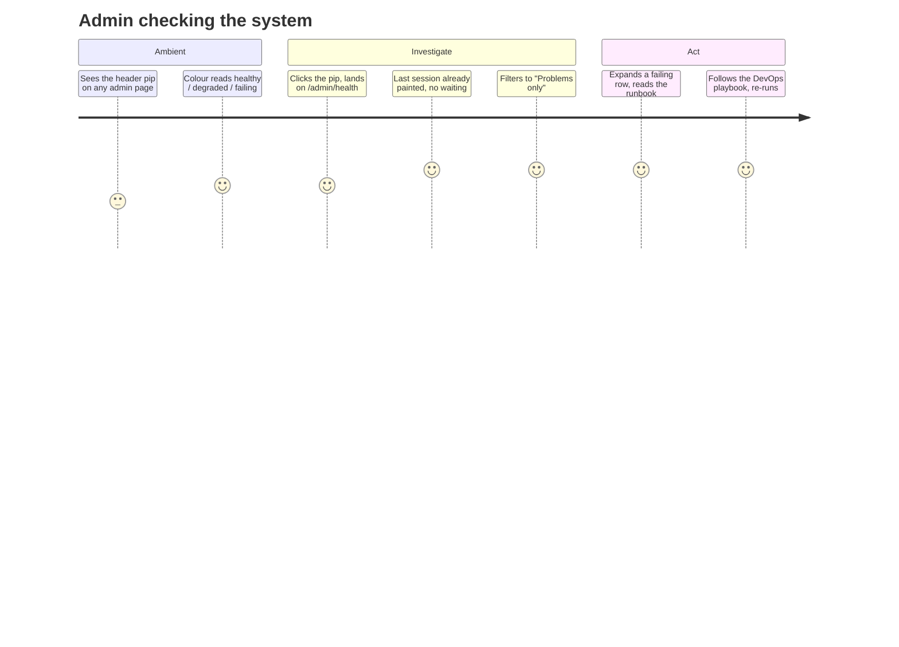
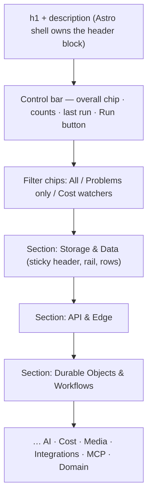

# 0028 — DESIGN_SPEC: `/admin/health`

Monolith rules apply: dark theme, tokens only, no traditional 1px borders beyond the existing
`border-border/60` hairlines, mono micro-labels at `text-[10px]` with wide tracking.

## Journey

## Layout

- **Section header** — sticky (`top-0`, `bg-background/90 backdrop-blur`): mono uppercase label, a
  worst-status dot, a hairline rule, the test count. Mirrors the exemplar's `DaySection`.
- **Rail** — `<ol className="relative pl-7">` with an absolutely-positioned 1px rail; each row's
  status icon sits in a 30px circle with `ring-4 ring-background` punching through the rail.
- **Row (collapsed)** — display name, `COST` chip when `isBillingRisk`, severity in mono, the last
  result details clamped to two lines, the probe `name` + duration in mono, a status chip, chevron.
- **Row (expanded)** — What it checks · Last result · then a `lg:grid-cols-2` of Success means /
  Failure means / Troubleshooting / DevOps playbook; footer with the owning `health.ts` path and one
  chip per binding type.

## States

| State | Rendering |
|---|---|
| Initial load | six full-width pulsing bars |
| Running | **every** row becomes a skeleton row (circle + two pulsing bars); button shows `Loader2` spinner; overall chip becomes a `RUNNING` chip with spinner; caption reads `probing N tests…` |
| Never run | rows render greyed with a `NOT RUN` marker and the probe's description |
| SUCCESS / DEGRADED / FAILURE | emerald / amber / rose — chip, rail dot, and row border tint |
| Unauthorised | error banner: "Not signed in as admin" (the page itself is behind the `/admin` gate) |

## Mobile

Designed at 375px first: one column, control bar stacks (`flex-col sm:flex-row`), filter chips wrap,
rows are full-bleed inside the container, runbook fields stack until `lg`. Nothing horizontally
scrolls; the only fixed-width element is the 30px rail circle.

## Header pip

`● HEALTHY` / `● DEGRADED 3` / `● FAILING 5` — mono, uppercase, `tracking-[0.18em]`, no border, hover
raises a faint background. Renders **nothing** when unauthenticated or when no session has ever run.
Desktop: right side of `AppHeader`, left of the config cog. Mobile: the sidebar's slim top bar, same
position.
