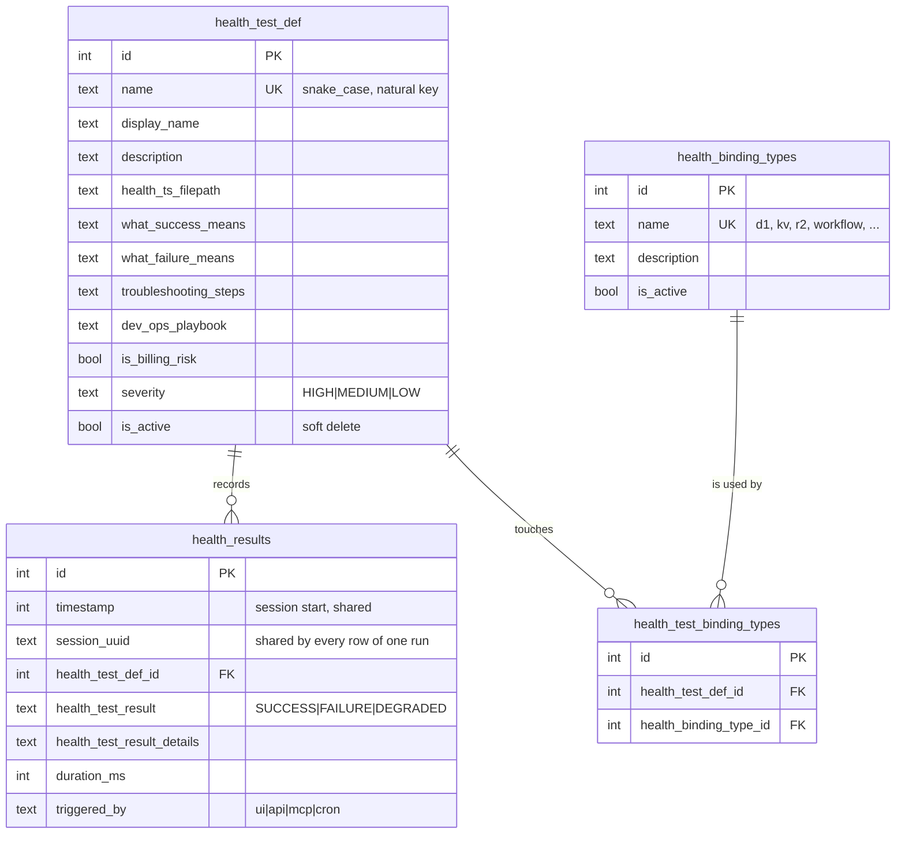
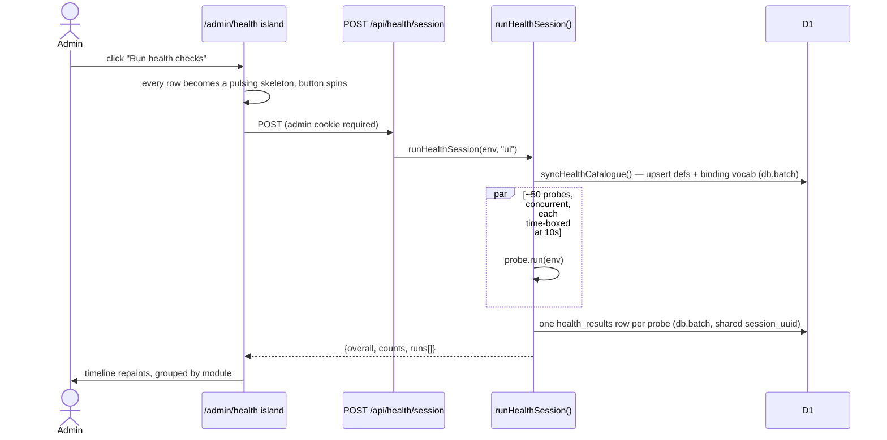
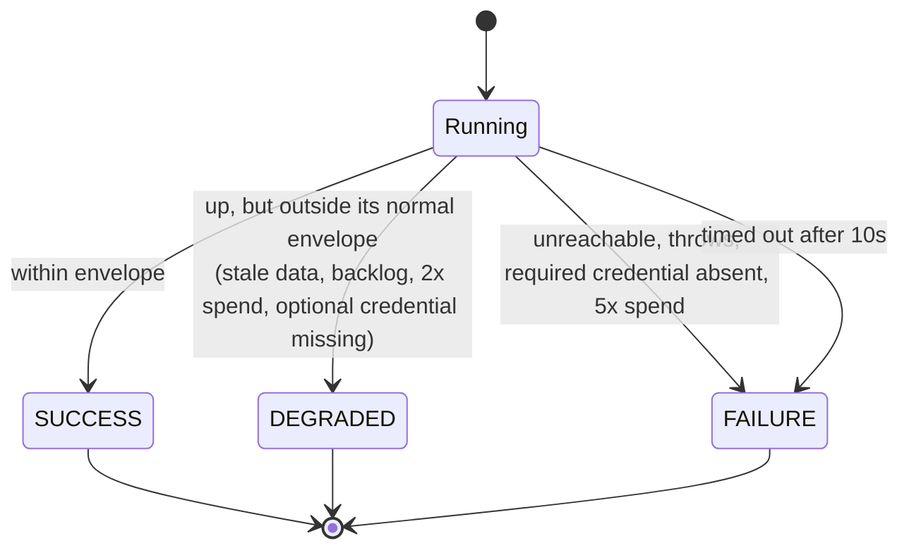

# 0028 — Health platform: per-module probes, D1 catalogue, admin dashboard

**Status:** in build · **Branch:** `claude/backend-health-checks-d1-d6df78`
**Plan slug (D1):** `0028_health_platform`
**Supersedes the UI of:** `0027_health_status_page`

## Context / problem

0027 shipped `/health` with five hardcoded binding pings (`services/health/screen.ts` →
`health_checks`). That surface answers "is D1 up" and nothing else:

- **No coverage.** Vectorize, the 9 Workflows, the 14 Durable Objects, ~30 Secrets Store
  credentials, Cloudflare Images, the MCP registry, the email pipeline, the Tesla telemetry DB and
  every data-integrity invariant are unchecked.
- **No cost watch.** This account has burned money silently before (the RemodelOrchestrator DO
  full-table-scan incident, ~$50/day). Nothing watches for a spend jump.
- **No runbook.** `status: down` on `kv_cache` tells a reader nothing about what that means, where
  the code is, or what to do. The knowledge lives only in a person's head.
- **No indexing.** `health_checks` has no notion of a *session*, so "what did the system look like
  at 14:02" is unanswerable, and results cannot be grouped, compared or trended.
- **Wrong audience.** The page is public while its content is a map of internal infrastructure.

## Design

### Ownership: the probe lives with the module

```mermaid
flowchart LR
  subgraph modules["Backend modules — each owns its own health.ts"]
    db["src/backend/db/health.ts"]
    api["src/backend/api/health.ts"]
    ai["src/backend/ai/health.ts"]
    rt["src/backend/realtime/health.ts"]
    wf["services/workflows/health.ts"]
    usage["services/usage/health.ts"]
    integ["services/{email,gmail,google,google-photos,tesla}/health.ts"]
    media["services/{image-processor,render,documents}/health.ts"]
    mcp["src/backend/mcp/health.ts"]
    show["services/showroom/health.ts"]
  end
  modules --> reg["services/health/registry.ts<br/>ALL_HEALTH_PROBES"]
  reg --> run["services/health/run.ts<br/>runHealthSession()"]
  run --> d1[("D1: health_test_def<br/>health_results")]
  run --> api2["/api/health/*"]
  api2 --> ui["/admin/health"]
  classDef done fill:#1f4d2e,stroke:#4ade80,color:#e8ffe8
  class reg,run done
```

A `HealthProbe` (`services/health/types.ts`) is **both the executable check and its own
documentation**. The literal fields — `whatSuccessMeans`, `whatFailureMeans`,
`troubleshootingSteps`, `devOpsPlaybook`, `bindingTypesTested`, `severity`, `isBillingRisk` — are
upserted into `health_test_def` by the runner on every session. There is no second place to keep in
sync and no hand-written seed SQL: the catalogue is generated from the code that runs.

### Data model

`binding_types_tested` is a **definition + mapping pair**, not a comma-separated column — the
dashboard filters by binding type, which is exactly the multi-select shape the repo rules require to
be relational.

`health_checks` (0027) is untouched: `GET /api/health` and any external uptime monitor keep working.

### A session

Every write is `db.batch()`. **`db.transaction()` is never used** — D1 rejects `BEGIN` (error 7500).

### Probe outcome states

### Cost discipline (non-negotiable)

Probes are bounded and free: binding presence, Secrets Store reads, `SELECT`/aggregate over D1, one
KV put/get of a tiny key, an R2 `head` or `list({limit:1})`. **No probe invokes a model, calls a paid
external API, creates a Workflow instance, or enumerates a bucket.** The probes that watch cost
(`isBillingRisk: true`) do so by reading local usage tables and comparing the last 24h against the
trailing 7-day average — DEGRADED at >2x, FAILURE at >5x.

### API

| Route | Auth | Purpose |
|---|---|---|
| `GET /api/health` | public | unchanged 0027 liveness ping (uptime monitors) |
| `POST /api/health/run` | public | unchanged 0027 five-binding screen |
| `POST /api/health/session` | **admin** | run every registered probe, persist a session |
| `GET /api/health/session/latest` | **admin** | last persisted session (first paint) |
| `GET /api/health/sessions` | **admin** | recent sessions, newest first |
| `GET /api/health/catalogue` | **admin** | every test + full runbook, grouped |
| `GET /api/health/badge` | admin-aware | tiny roll-up for the header pip (null when unauthed) |

### Frontend

- Page moves `/health` → **`/admin/health`** (301 in `LEGACY_REDIRECTS`), so it sits behind the
  existing `/admin` auth gate. The old public page and `HealthCheckApp` island are deleted.
- `HealthDashboardApp` is a **vertical timeline**, one sticky section per module group, each row
  expanding into that probe's runbook. Mobile-first: single column, stacked control bar, sticky
  section headers; the runbook's two-column grid appears from `lg`.
- Loading/running state = **pulsing skeleton rows** plus a spinner on the button and a `RUNNING`
  chip on the overall status.
- Filters: All / Problems only / Cost watchers.
- `HealthStatusBadge` — a coloured pip + one word in the global header (desktop) and the mobile
  sidebar bar, linking to `/admin/health`. Reads the last persisted session only; never probes.
- Sidebar: **System → System Health**.

## Success criteria

- Every listed backend module has a `health.ts` whose probes appear in the registry.
- `POST /api/health/session` returns ~50 probe results and writes the same number of
  `health_results` rows under one `session_uuid`; `health_test_def` is populated from code.
- `/admin/health` renders grouped results, skeletons while running, and a runbook per test; it 401s
  (and the page redirects to the gate) when not an admin.
- The header pip shows the last session's status on every admin page and links to the dashboard.

## Risks

- **Probe count vs. subrequest limits.** ~50 probes, each 1–3 D1/KV/R2 operations, is well inside a
  Worker's limits, but the runner time-boxes each probe at 10s and never fans out further.
- **A probe querying a table that a pending migration has not created** reports FAILURE. That is the
  correct signal (deploy-order fault) — probes use `tableExists()` so the message says so plainly.
- **Catalogue sync on every run** costs one upsert per probe. Bounded and idempotent; mappings are
  only rewritten when a probe's binding set actually changes.

## Verification

`npx tsc --noEmit` on the touched files; `pnpm run migrate:remote` + column verification;
`scripts/qc/pr_<n>.mjs` against the preview and production; a real session run with its output pasted
into the changelog entry.
