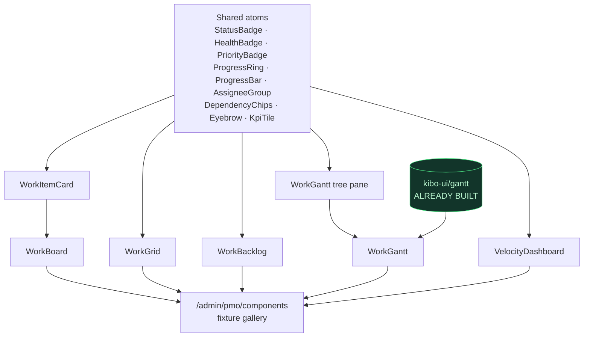
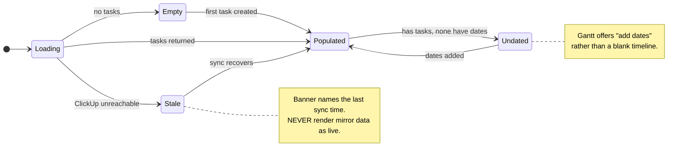

# 0028 — Design Spec: the PMO component layer

**Audience:** Claude AI Design, working with the Claude Code agent.
**Reference prototypes:** `docs/system/0001_pmo/*.html` — 7 saved pages. Six are
ReUI blocks; `engineering_velocity.html` is a raw TSX dump from devl.dev using
`@orbit/ui`. **Neither library is installed here.** We rebuild on shadcn + the
Monolith dark profile, matching the prototypes' *information design* and *density*,
not their imports.

> `sprint_backlog.html` and `sprint_backlog_drag.html` are byte-identical apart
> from asset paths. One page, not two. Do not build both.

---

## 1. Design principles carried from the prototypes

These are the things the prototypes get right and that we must not lose:

1. **Two encodings, deliberately different loudness.** Priority reads as a *filled
   tonal badge*; status reads as a *neutral outline badge with a colored dot*. That
   asymmetry is what keeps a dense grid scannable. Do not make them both loud.
2. **Status and health are separate axes.** A task can be `In Progress` and `At risk`
   at the same time. Never collapse them into one chip.
3. **Controls hide until hover.** Drag grips, row checkboxes, bar resize handles,
   per-column add buttons — all `opacity-0` at rest. The resting state is calm; the
   affordances appear under the cursor.
4. **`tabular-nums` on every number.** Ranks, keys, dates, points, percentages.
5. **Mono, uppercase, wide-tracked eyebrows** (10–11px, `tracking-[0.2em]`–`[0.3em]`)
   above every panel. This is the single strongest signature of the velocity page.
6. **Uniform density.** `text-xs`/`text-sm` base, `h-5` badges, `size-5`/`size-6`
   avatars, 36–40px rows.

## 2. Color system

Semantic tone tokens, applied with one recipe everywhere:

```
border-<tone>/15 bg-<tone>/10 text-<tone>-foreground
dark:border-<tone>/25 dark:bg-<tone>/15 dark:text-<tone>
```

| Meaning | Tone | Used for |
|---|---|---|
| Good / complete / on track | `success` (emerald) | `Done`, `On track`, `elite` rating, merged PRs |
| Active / informational | `info` (sky) | `In Progress`, open PRs, `Todo` dot |
| Caution | `warning` (amber) | `In Review`, `At risk`, `med` rating |
| Failure / stop | `destructive` (rose) | `Blocked`, `Urgent`, closed PRs, overdue dates, the today marker |
| Neutral | `secondary` | `Queued`, `Backlog`, unassigned |

**Two exceptions, both intentional:**

- **Gantt bar color is per-item, not per-status.** Each work item gets a stable hue
  from the Tailwind-500 ramp (blue, violet, cyan, teal, amber, emerald, rose, pink,
  orange, indigo), rendered as `bg-(--gantt-event-color)/20` track with a `/40`
  progress fill. Status still shows in the tree pane badge. This is what makes a
  dense timeline readable — status-colored bars turn into a wall of one color.
- **Progress ring color is threshold-derived**, not status-derived:
  `< 40%` rose · `40–74%` amber · `≥ 75%` emerald.

## 3. Components



### 3.1 `<WorkBoard>` — kanban

Source: `roadmap_kanban.html`. Generalize the existing `ClickUpKanban.tsx`.

- Horizontally scrolling row of `w-[18.5rem]` columns, `gap-3`, each a `bg-muted/50`
  panel with `rounded-xl` border.
- **Column header:** `size-2.5` status dot · title · count badge (outline, 10px,
  `h-4.5`) · one-line description · hover-revealed `+` and drag grip.
- **Card** (`min-h-[10.5rem]`, `p-3`, hover `border-foreground/20` + `shadow-sm`):
  1. Title (`line-clamp-2 text-sm font-medium`) + right-aligned category/workstream badge
  2. Description `line-clamp-2 text-xs text-muted-foreground`
  3. Meta line: highlight metric · `·` · checkpoint note
  4. Footer pinned `mt-auto`: `h-1.5` progress bar, then state label · `·` · `NN%`
     on the left and an assignee avatar group on the right
- Card drag between and within columns; column reorder via the header grip.
  Keyboard dnd is required (space to pick up, arrows, space to drop, escape).
- **Column set is configurable**, because the two projects differ:
  - *Software:* `Backlog` · `Planned` · `In Progress` · `In Review` · `Blocked` · `Done`
  - *Remodel:* `Not Started` · `Scheduled` · `In Progress` · `Awaiting Materials` · `Blocked` · `Complete`
- Prototype's vote/ARR chrome is **dropped** — no votes here. That slot carries the
  assignee group instead.

### 3.2 `<WorkGrid>` — grouped data grid

Sources: `roadmap_queue.html` (grouping, KPI strip, radial progress) and
`task_delivery.html` (sub-task nesting, tabs, filter chips, pagination).

- **KPI strip** above the grid: label + badge pairs separated by `border-l` —
  `Tasks N` · `Blocked N` (destructive) · `At risk N` (warning) · `Unassigned N`.
- **Filter bar** (`bg-muted/20`, `border-y`): search input with `SearchIcon`; right
  side `Display` popover (column visibility), `Collapse groups`, `New task`.
- **Tabs** above the filter bar where a scope split helps, each with a count pill.
- **Group header row** (`h-11`, `bg-muted/45`): collapse chevron · `size-2.5` dot ·
  group name · count badge · right-aligned muted description.
- **Task row** (`h-9`, indented `ps-8`): `size-7` bordered category icon tile · title
  (hover `text-primary`, hover-revealed `ArrowRightIcon`) · then right-aligned cells:
  assignee avatar group (`size-5`, `-space-x-1`, `ring-2 ring-background`, `--` when
  unassigned) · category badge with `size-1.5` dot · date badge with `CalendarDaysIcon`
  and `tabular-nums` · `size-5` radial progress ring + `NN%` · status badge ·
  `MoreHorizontalIcon`.
- **Sub-task row:** one level of nesting, indented `pl-12`, round checkbox; completed
  gets `line-through decoration-current/55 decoration-1` and muted text.
- No visible `<thead>` in the queue variant — group rows carry the structure. Keep it.
- Everything except the title is right-aligned, producing a clean ragged-right rail.
- Overdue dates flip to `text-destructive`.

### 3.3 `<WorkBacklog>` — rank-ordered drag list

Source: `sprint_backlog.html`.

- Single card, panel header: title · `Drag to prioritize` · `·` · `N items` ·
  `Reset order` button, **disabled until the order is dirty**.
- Columns: drag 44 · rank 56 · task 653 · owner 165 · group 130 · cycle 110 ·
  due 90 · status 125 · effort 80 · actions 56.
- **Rank #1 is special:** `text-primary font-semibold` with a `FlagIcon`. Ranks 2+
  are plain muted. This is the only emphasis on the page.
- Task cell: `size-8` rounded type-icon tile (`bg-muted`, `border-2 border-background`)
  + two lines — title over `KEY · type` in muted 12px.
- Status here is **text color inside a neutral outline badge**, quieter than the grid.
- Effort renders `N` + muted `pts` suffix.
- Drag to reorder by grip; keyboard equivalent required; `Task` column resizable.

### 3.4 `<WorkGantt>` — schedule

Source: `gantt.html`. **Wrap `src/frontend/components/kibo-ui/gantt/`, which already
provides drag-move, edge resize, today marker, markers, sidebar groups, and
daily/monthly/quarterly ranges.** The work is the tree pane and the data adapter,
not the timeline engine.

- Two panes split by a draggable `role="separator"` (`aria-valuemin=180`,
  `aria-valuemax=640`, default 520px).
- **Nav bar:** `Today` · scale switcher · prev/next chevrons · period title
  (`aria-live="polite"`) · assignee filter avatar group with `+N` overflow ·
  split `+ Add Task` button.
- **Tree pane columns:** `Name` (208px) · `Status` (96px) · `Assignee` (72px) ·
  `Due date` (72px) · actions (32px), plus a sticky `+` column menu.
- **Tree rows** (`h-10`): hover-revealed grip · indent `0` / `0.875rem` / `1.75rem`
  for group / task / sub-task · expand chevron *or* hover-revealed checkbox · a
  `size-2` dot matching the bar color · truncated name. Group rows show a `size-4`
  radial progress ring with `aria-label="49% complete"`.
- **Timeline header, two tiers:** week groups (`W23 May 31 - 6`) over day cells
  (`Mon 1`). Weekends get `bg-muted/25` plus a 135° hatch.
- **Bars** (`h-5`, `rounded-sm`): `/20` track, `/40` progress fill with a right
  border at the progress edge (removed at 100%), `CheckIcon` when complete, two
  hover-revealed `cursor-ew-resize` edge handles, label placed *outside* the bar.
  `aria-label` reads `"<name>, <start> - <end>, <year>, <name>, NN% complete"`.
- **Summary bars** for parent rows: `h-1.5` track with end caps and a trailing `NN%`.
- **Today marker:** 1px destructive gradient line + a `size-1.5` dot on the header.
- Floating bottom-right zoom `+`/`−`.
- **We add what the prototype lacks:** dependency arrows between bars (from
  `WorkItem.dependsOn`) and a critical-path highlight. Both must be toggleable — a
  dense Gantt with every arrow drawn is unreadable.

### 3.5 `<VelocityDashboard>`

Source: `engineering_velocity.html`. Hand-rolled SVG/div charts — **no chart library**,
matching the prototype. recharts stays for the budget dashboards.

- `mx-auto max-w-6xl space-y-6`.
- Eyebrow `Engineering · last 30 days` (mono, 10px, `tracking-[0.3em]`), title
  `Velocity`, two filter buttons on the right.
- **4 DORA tiles:** `Deploy frequency` · `Lead time` · `Change failure rate` · `MTTR`.
  Each: mono uppercase label, `text-2xl tabular-nums` value, signed trend with
  `ArrowUpRightIcon`/`ArrowDownRightIcon`, a rating word (`elite`/`high`/`med`/`low`),
  and an 80×18 SVG polyline sparkline at `text-foreground/40`.
  **Only `Deploy frequency` is higher-is-better** — trend polarity is per-metric.
- **Split panel `lg:grid-cols-[1fr_320px]`:**
  - Left — `PR throughput · last 8 weeks`: headline count, 3-swatch legend
    (`merged` / `open` / `closed`), and 8 stacked vertical bars with `W18`…`W25`
    labels. No axes, no gridlines, no tooltips.
  - Right — `CI health`: 4 label/value rows (`Pass rate`, `Flake rate`,
    `Avg duration`, `Total runs`), then `Slowest jobs` with 3 name/duration rows.
- **Top contributors** card: 5-col grid `[2rem_auto_1fr_auto_auto]` — rank `#1`,
  `size-7` avatar with initials fallback, name over an `h-1.5 bg-emerald-500/70` bar
  scaled to the max, right-aligned `NN merged` / `NN reviewed`, right-aligned lead time.

**Remodel variant.** The same shell with construction metrics instead of DORA:
`Tasks completed / week` · `Avg task cycle time` · `Schedule variance (days)` ·
`Blocked task count`. Throughput bars become tasks-completed-per-week; contributors
become trades. Same component, different metric config.

### 3.6 Shared atoms

`<StatusBadge>` · `<HealthBadge>` · `<PriorityBadge>` · `<ProgressRing>` ·
`<ProgressBar>` · `<AssigneeGroup>` (avatar stack + `+N` overflow + tooltip with
full names) · `<WorkItemCard>` · `<DependencyChips>` · `<Eyebrow>` · `<KpiTile>`.

## 4. Pages

Every page is a thin `.astro` shell mounting one React island, wrapped in
`<BaseLayout>`, following `src/frontend/pages/admin/studio.astro` exactly:
`<main class="container mx-auto px-4 py-8 pb-12">`, an `mb-8` header block with a
`size-6` lucide icon in the `<h1>` and a one-line `text-muted-foreground` description.

**Use `class`, never `className`, in `.astro` files.** `className` on a native
element renders as a dead attribute — the Tailwind classes never apply and the page
collapses to the top-left. Inside `.tsx` islands `className` is correct.

| Route | Icon | Island |
|---|---|---|
| `/admin/plans/[slug]` | `ClipboardList` | Board / Grid / Backlog / Gantt tabs over `plan_tasks` |
| `/admin/pmo/velocity` | `Gauge` | `<VelocityDashboard>` |
| `/admin/pmo/operations` | `HardHat` | Same tabs over `planning_tasks` |
| `/admin/pmo/schedule` | `CalendarRange` | `<WorkGantt>` across both sources |
| `/admin/pmo/components` | `Component` | Gallery of every component on fixture data |



## 5. States that must be designed, not skipped

- **Empty:** a plan with no tasks; a Gantt where no item has dates (offer "add dates"
  rather than a blank timeline); a board column with zero cards.
- **Undated items:** the prototype has two tasks with no bar at all. Keep that —
  they appear in the tree with no bar rather than being hidden.
- **Unassigned:** renders `--` plus an sr-only `Unassigned owner`.
- **No progress:** renders `-`, not `0%`. The difference matters.
- **Overdue:** date text flips to `text-destructive`.
- **Locked/read-only:** a `LockIcon` on the row (the prototype does this on
  `Perf audit`). This is the visual hook for `work_item_watchers.can_edit = 0`.
- **Loading:** skeletons at the correct row height so the layout does not jump.
- **Offline/stale (ClickUp down):** a banner stating the mirror is being served and
  when it was last synced. Never silently show stale data as live.

## 6. Accessibility

The prototypes are unusually strong here and it is worth matching:
`aria-roledescription="sortable"` on draggables with screen-reader dnd instructions;
`aria-live="polite"` on the Gantt period title and announcer; `aria-expanded` +
`aria-label` stating the child count on collapse toggles; `aria-sort` on the active
sort header; `aria-label` on every icon-only button; sr-only text behind every `--`,
avatar group, and progress ring. Every drag interaction needs a keyboard path.
