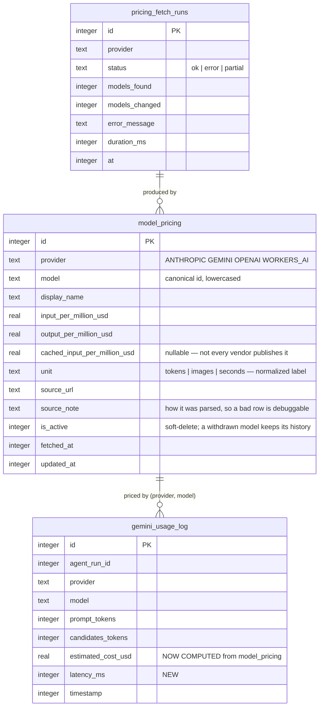
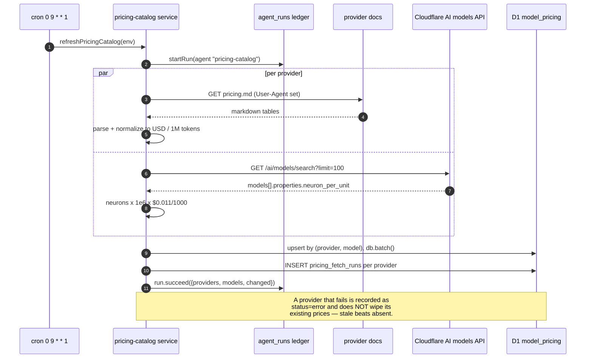
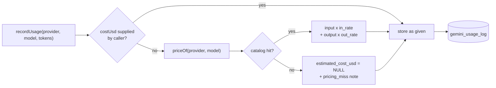
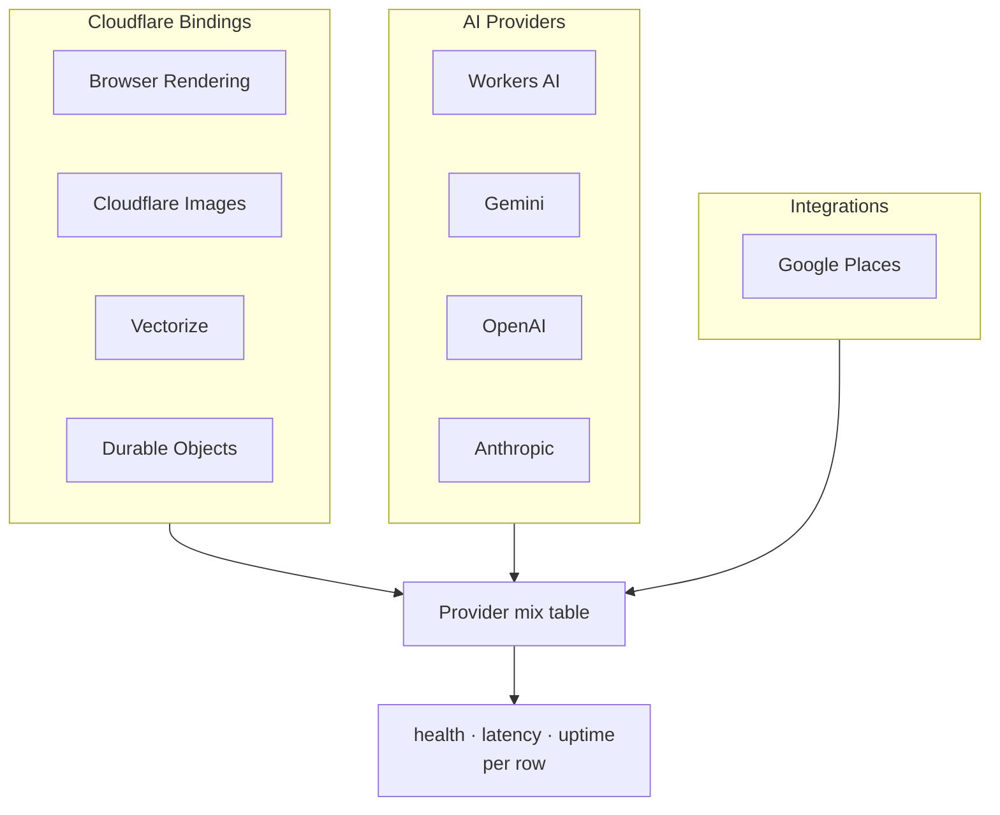

# 0029 — Provider Pricing & Health · Implementation Plan

**Plan slug:** `0029_provider_pricing_and_health` → `/admin/plans/0029_provider_pricing_and_health`
**Follows:** [0026 Agent Ops Transparency](../0026_agent_ops_transparency/PRD.md)

---

## 1. Problem

0026 shipped `/admin/system/agents/usage`. It works, and it is currently
**telling the truth about very little**:

| Symptom | Root cause |
|---|---|
| Every provider reads `$0` and unit cost is `$0.00/1M` | `gemini_usage_log.estimated_cost_usd` is **almost always null** — nothing computes it. The column has existed since the table was created and has no writer for most providers. |
| Cost cannot be checked against reality | No price list exists in the system. Rates live in provider docs that change without notice. |
| Provider rows read `CF_IMAGES`, `WORKERS_AI` | Raw enum values rendered directly to a human. |
| Seven providers in one flat list | A Cloudflare binding, a model vendor and a maps API are three different kinds of thing with three different failure modes. |
| No way to see if a provider is *working* | The page shows spend against a ceiling and nothing about whether calls are succeeding, how slow they are, or how long the provider has been stable. |
| Numbers render as `1398` and `$0.001` | Unformatted. |

The through-line: the cost page currently reports **spend it cannot compute**
against **providers it cannot name** with **health it does not measure**.

## 2. Approach

Four changes, in dependency order.

1. **A real price list, refreshed weekly.** Fetch published pricing for
   Anthropic, Gemini and OpenAI, plus the live Cloudflare Workers AI model
   registry, normalize everything to **USD per million tokens**, and store it in
   D1. Without this, every cost number downstream is a guess.
2. **Compute cost at write time.** `recordUsage` looks up the catalog and fills
   `estimated_cost_usd` from `prompt_tokens × input_rate + output_tokens ×
   output_rate`. Input and output are priced **separately** — output is
   typically 3–5× input, so a blended rate is not an approximation, it is a
   wrong answer.
3. **A provider registry.** Friendly names, groups, and per-provider health,
   latency and uptime derived from the ledger.
4. **Formatting.** Currency as `$ 100.00`, integers with thousands separators.

### Deviations from the brief, and why

- **`HTMLRewriter` is not used.** The three sources requested are
  `.md` / `.md.txt` endpoints — they return **Markdown, not HTML**, so an HTML
  parser has no elements to match. Parsing is a small Markdown-table reader
  (~40 lines, no dependency), which is both correct for the payload and lighter
  than the alternative. Cloudflare Workers AI has no doc page to scrape: it
  exposes a models API whose `neuron_per_unit` property converts to dollars at
  a fixed `$0.011 / 1,000 neurons`.
- **Storage is D1, not KV.** The brief's summary says "stores the pricing
  information into d1 tables"; the boilerplate requirements block says
  `PRICING_CACHE` KV. D1 wins because the price list must **join** against
  `gemini_usage_log` to compute cost per call, and because the house rule is
  Drizzle + D1. A KV blob cannot be joined and would have to be re-parsed on
  every write.

---

## 3. Data model



**Two additive migrations**, both nullable, both safe against the other live
branches on this D1:

```sql
-- new tables
CREATE TABLE model_pricing (...);
CREATE TABLE pricing_fetch_runs (...);
-- and one column on the existing usage log
ALTER TABLE gemini_usage_log ADD latency_ms integer;
```

`model_pricing` is keyed `UNIQUE (provider, model)` so a weekly refresh is an
upsert, not an append — the table stays the size of the catalog, not the size of
the history.

---

## 4. Weekly refresh



**Resilience rules**

- Each provider is fetched independently; one failure never aborts the others.
- A failed fetch **leaves the previous prices in place**. Deleting a catalog
  because a doc page 403'd would silently zero every cost number downstream.
- `User-Agent` header set on every request.
- The whole refresh is itself an instrumented agent run, so a broken parser
  shows up on `/admin/system/agents/failed` like anything else.

---

## 5. Cost computation



**A miss stores `NULL`, never `0`.** "We do not know what this cost" and "this
was free" must stay distinguishable — the whole point of the reconciliation
banner is that unknowns are visible.

Model ids are matched by exact id first, then by longest-prefix (so
`gemini-2.5-flash-preview-09-2025` prices off `gemini-2.5-flash` rather than
missing). The chosen rule is recorded in `source_note` so a surprising price is
traceable.

---

## 6. Provider registry, health, latency, uptime



Per row, computed over a 24h window of `gemini_usage_log`:

| Column | Rule |
|---|---|
| **Health** | no calls → `OFFLINE` · all ok → `SUCCESS` · all error → `FAILURE` · mixed → `PARTIAL` |
| **Latency** | median `latency_ms` (median, not mean — one 30s timeout must not swamp 500 fast calls) |
| **Uptime** | time since the most recent `status = "error"`, or since the first ever call if none |

`OFFLINE` means *no traffic*, which is not the same as *down*; the tooltip says
so, because an idle provider being red would train people to ignore the colour.

---

## 7. Phases

| Phase | Tasks | Deliverable |
|---|---|---|
| **P1** | `PRICE-P1-*` | `model_pricing` + `pricing_fetch_runs` tables, the four fetchers, the weekly cron, `GET /api/admin/agents/pricing` |
| **P2** | `PRICE-P2-*` | `latency_ms` column, cost computed at write time, latency captured in the metered wrappers |
| **P3** | `PRICE-P3-*` | provider registry (groups + friendly names), health/latency/uptime API |
| **P4** | `PRICE-P4-*` | usage page: grouped provider table, health badges, currency + integer formatting |

## 8. Guardrails

Unchanged from 0026 and binding here: `db.batch()` never `db.transaction()`;
`class` not `className` in `.astro`; `pnpm run db:generate` →
`pnpm run migrate:remote` and never raw SQL; `pnpm run build` does not
type-check, so run `npx tsc --noEmit`; QC against `--preview` while the PR is
open. Secrets (`CLOUDFLARE_WRANGLER_API_TOKEN`) are read from the secrets store
and never logged.
