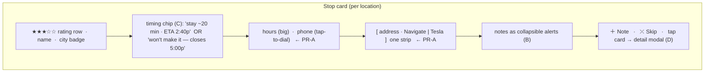
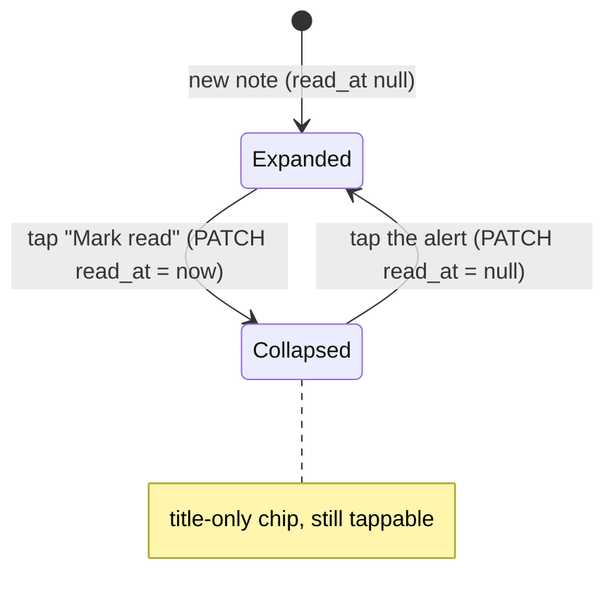
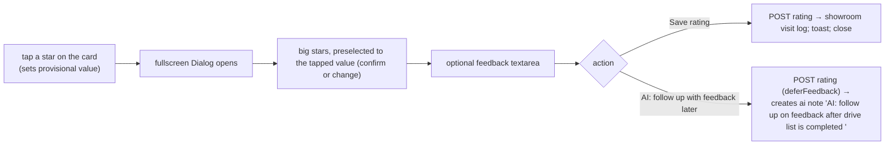
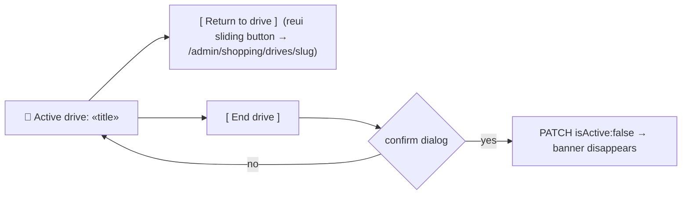
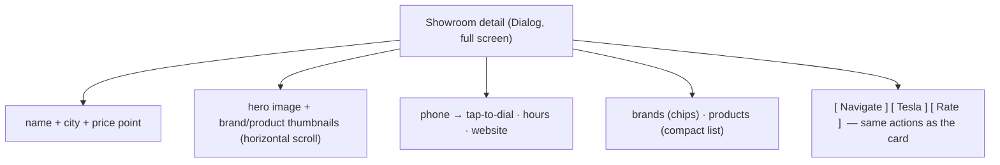
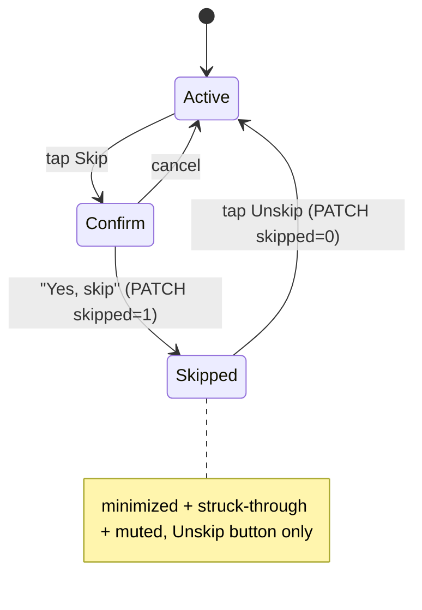

# 0031 — Design Spec (frontend)

Surface: `/admin/shopping/drives/[slug]` island `DriveViewportApp.tsx`, plus a new global
banner mounted in `BaseLayout`. Monolith rules: dark theme, theme tokens only, no 1px
borders (rings/dividers), high-contrast, big touch targets (this runs on a Tesla screen and
a phone). Build phases invoke the Better Design MCP (`get-ui-principle` / `get-ux-principle`
/ `get-review-rules`); this spec sets the target.

Two new dependencies (install with the shadcn CLI, `--dry-run` first, revert any shared
primitive it rewrites — repo rule):
- `@reui/c-alert-5` → `@/components/reui/alert` (`Alert`/`AlertTitle`/`AlertDescription`) — notes.
- `@reui/c-button-53` → sliding button — the banner's "Return to drive".

Modals use the repo's shadcn **Dialog (Base UI, not Radix)** — dismissal is controlled via
`onOpenChange`, no Radix `onEscapeKeyDown`/`onInteractOutside` props.

---

## Stop card — final anatomy (B + C + D layered on PR-A)

State-driven variants:
- **visited** → card `opacity-60`, name struck (existing).
- **skipped (#10)** → minimized + struck + muted; only an **Unskip** button shows.
- **suggested pitstop (#9)** → minimized, dashed, labeled "Proximity pitstop", **Add to
  drive** button; full affordances available on expand.

---

## #2 Notes as collapsible alerts

Every note (drive-global and per-location) is a `reui` `Alert`. Collapsed = title only;
expanded = title + body. `read_at` persists collapse across devices.

- Variant by `source`: `user` → `variant="info"`; `ai` (the follow-up reminder) →
  `variant="warning"` with a distinct icon so AI to-dos stand out.
- Drive-global notes render in the footer block (replacing the old plaintext cards);
  per-location notes render inside their stop card under the action strip.
- **＋ Note** on each card (and one at drive level) opens a compact inline composer
  (single-line `Input` + save) — no PlateJS; plain text by design (on-the-go).

## #7 Star rating → fullscreen modal

- Modal uses maximal screen real estate (large tap stars, ≥44px targets).
- Stars only render when the stop links a showroom; unlinked stops show no rating row.
- After save, the card's rating row reflects the new value (optimistic).

## #4 Global active-drive banner

Mounted once in `BaseLayout` as a `client:only` island; polls `GET /api/drive-lists/active`.
Renders nothing when no drive is active.

- Sticky top, high-contrast accent bar, sizeable Return button (primary), End button
  (ghost/destructive) gated behind a confirm Dialog.
- On the drive page itself, an **Activate this drive** button sits in the header; hidden /
  swapped for "Active" when this drive is the active one. Respects the 07:00–20:00 window
  (shows the 409 reason inline when outside).

## #8 Fullscreen showroom detail modal

Tap anywhere on a stop card (outside a button) → Dialog at full screen with a **condensed**
showroom card from `GET /api/showroom-stores/:id`:

- Only for linked stops. Lazy-fetch on open. Loading + error states.
- Reuses existing brand/product/photo data; no new backend beyond what
  `/api/showroom-stores/:id` already returns.

## #9 Proximity pitstop card

- Minimized by default under its nearest core stop, dashed, badge **"Proximity pitstop"**.
- Expand reveals a full card (Navigate, Rate, open modal) + **Add to drive** (promote).
- Promote → card converts to a normal optional stop and joins the timing recalc.

## #10 Skip

## Interaction parity / tokens

- All new tap targets ≥ `min-h-12` (car/phone). Buttons use theme tokens (`bg-muted`,
  `text-primary`, `bg-secondary`), no literal colors, no 1px borders.
- Optimistic updates with revert-on-failure + `sonner` toast, matching existing
  `toggleVisited`/`sendToTesla`.
- Progress math continues to run over shown, non-suggested, non-skipped stops.
