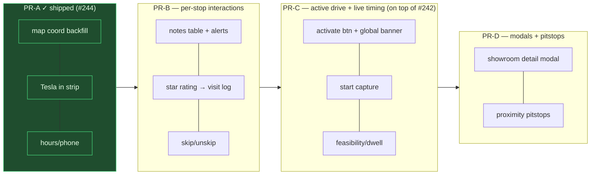
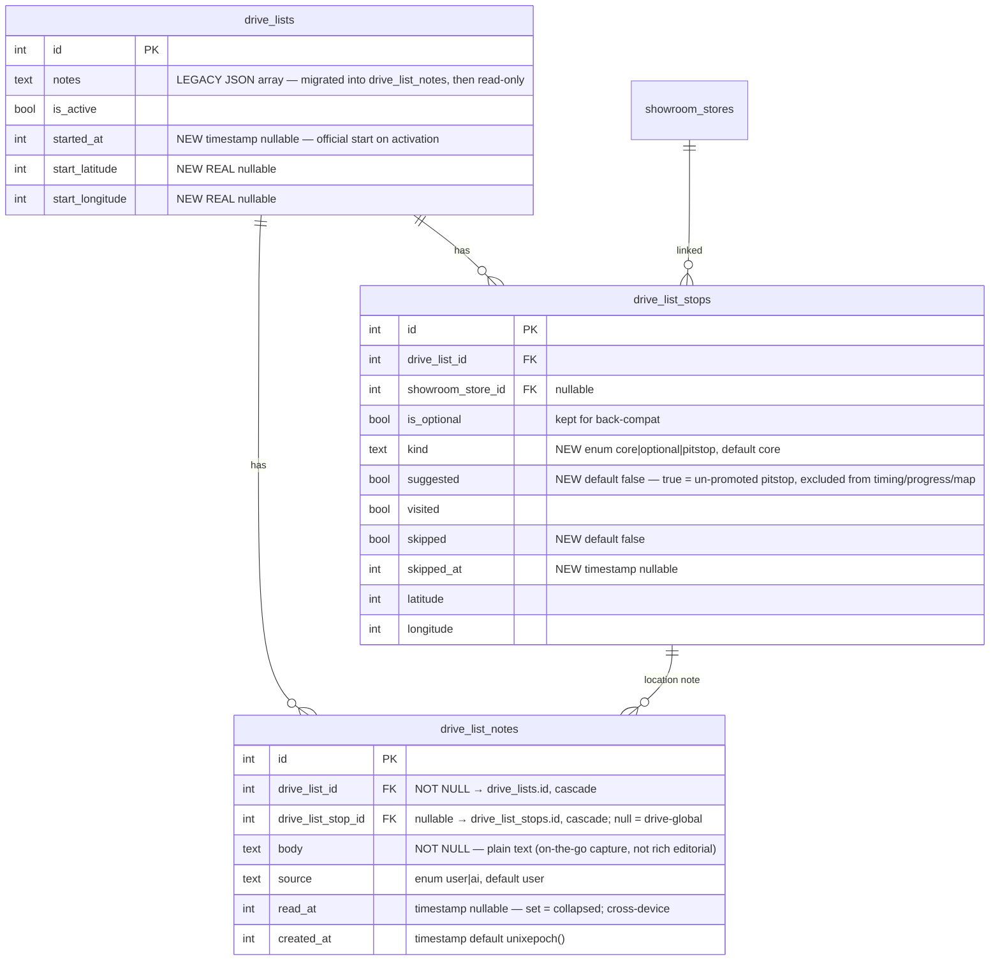
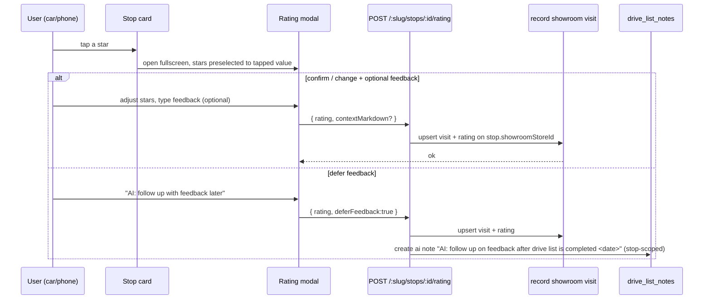
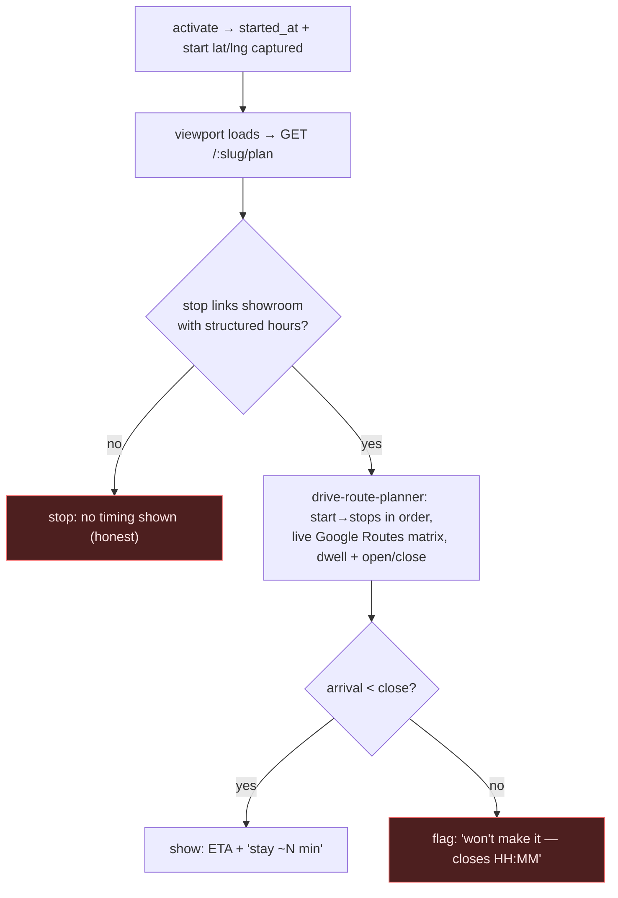

# 0031 — Drive List Ops: notes, ratings, skip, active banner, live timing, pitstops

> 🔗 **Cross-reference (2026-07-26):** the **`0032_location_visits_discovery`** pass touches the same `drive_lists` / `drive_list_stops` tables **additively** (adds `drive_lists.paused`, `drive_list_stops.is_detour` + `hitl_queue_id`) — no column overlap with 0031's `kind`/`suggested`/`skipped`/`started_at`. **Coordination point:** both write `drive_list_stops.visited` — 0031 via manual/rating, 0032 via automatic park-settle; keep them idempotent. Preview: https://core-remodel.hacolby.workers.dev/admin/changelog/preview/0032-location-visits-discovery · tracker: `docs/0032_location_visits_discovery/TRACKING.json`

**Status:** planning · **Owner:** Claude Code · **Extends:** `0022_gps_showroom_drives`,
builds Phase C on top of PR #242 (`0023_tesla_telemetry_webhooks`).
**Slug:** `drive-list-ops` · **Branch (PR-A already shipped):** `claude/drive-list-ui-improvements-b58ece` (#244)

## Context & problem

The drive viewport (`/admin/shopping/drives/[slug]`) is used live from a Tesla or phone
while shopping showrooms. PR-A (#244, merged separately) fixed the blank map and the
stop-card action strip. This plan covers the remaining 7 asks, which turn the sheet from
a static list into an operational tool for a live drive:

- Notes are drive-global only; there's no way to jot a note **on a location**.
- No way to **rate** a showroom from the stop, on the spot.
- No way to **skip** a stop and keep it visible-but-struck.
- No **active-drive** affordance on the drive page, and no cross-app banner to get back to it.
- Activating a drive captures **no start time / location**, so the sheet can't say
  "stay ~20 min here" or "you won't make Store 6 before it closes."
- No **detail modal** to confirm a showroom before committing to the detour.
- **Optional stops** are only the AI's picks; the system never suggests nearby open
  showrooms as **proximity pitstops**.

## Locked product decisions (from the user)

| # | Decision |
|---|---|
| Ratings (#7) | Write to the **showroom visit log** (canonical). Stops with no linked showroom show no stars. |
| Timing (#5) | Feasibility from the **linked showroom's structured hours** + live traffic (existing planner). Unlinked / hours-less stops show no timing rather than a wrong guess. |
| Pitstops (#9) | **Generate suggestions once at drive-list creation** (cheap — registered showrooms only, D1 haversine, no Google cost). A suggestion enters timing/recalc **only after the user promotes it** to a real stop. |
| Sequencing | Quick fixes (PR-A) first; then B → C → D as separate PRs. |

## Phase map



---

## Schema deltas

### New table `drive_list_notes` — unifies drive-level + per-stop notes

Today `drive_lists.notes` is a JSON string array (no ids, no read state). #2 needs every
note — drive-global **and** per-location — to render as a collapsible alert whose
read/collapsed state persists across the Tesla and the phone. That needs a row per note.
One table serves both: `drive_list_stop_id` null = a general drive note; set = a note on
that location.



**Migration notes (all additive; previews share prod D1 so nothing may be destructive):**
- `drive_list_notes` created; backfill: for each `drive_lists` row, `parseDriveNotes(notes)`
  → one `drive_list_notes` row (`stop_id` null, `source='user'`). `drive_lists.notes`
  stays for back-compat reads but new writes go to the table.
- `drive_list_stops`: add `kind` (backfill `kind = is_optional ? 'optional' : 'core'`),
  `suggested` (default 0), `skipped` (default 0), `skipped_at`.
- `drive_lists`: add `started_at`, `start_latitude`, `start_longitude`.
- `kind`/`suggested` govern rendering: `suggested=1` rows never count in progress, never
  enter the planner, render minimized until promoted.

### Compliance scan (currency / multi-select)

- **Notes** = plain `body` TEXT, deliberately **not** the PlateJS markdown+html rich-text
  pattern. Rationale: these are quick, one-line captures typed on a car/phone touchscreen
  mid-drive, matching the existing plain `drive_list_stops.note` — not editorial notes.
  **Flagged per the mandatory scan; keeping plain by design.** (Rich showroom notes still
  use `store_notes` markdown+html.)
- No currency or multi-select vocabulary is introduced. Ratings reuse the existing
  showroom visit-log 1–5 integer. Nothing else to bring into compliance.

---

## API deltas

All under the admin-gated `/api/drive-lists` router unless noted.

| Method | Path | Purpose | Phase |
|---|---|---|---|
| GET | `/api/drive-lists/active` | `{ slug, title } \| null` — the global banner's cheap probe | C |
| GET | `/:slug/notes` | notes for a drive, grouped `{ drive: [], byStop: { [stopId]: [] } }` | B |
| POST | `/:slug/notes` | create `{ body, stopId?, source? }` | B |
| PATCH | `/:slug/notes/:noteId` | toggle read `{ read: boolean }` (sets/clears `read_at`) | B |
| DELETE | `/:slug/notes/:noteId` | delete a note | B |
| POST | `/:slug/stops/:stopId/rating` | `{ rating, contextMarkdown? }` → records a showroom visit on the linked showroom; 400 if the stop links no showroom | B |
| PATCH | `/:slug/stops/:stopId` | extend existing handler: also accept `{ skipped }` and `{ suggested:false }` (promote) | B/D |
| GET | `/:slug/plan` | live per-stop timing `{ stops: [{ stopId, etaLocal, dwellMin, waitMin, feasible, reason }], startedAt, start:{lat,lng} }` | C |

**Activation (`PATCH /:slug { isActive:true }`)** — this handler is also edited by #242
(Tesla-stream DO signal). Build on #242's version. Add: on activate, set `started_at = now`
and capture `start_latitude/longitude` from the best available fix
(`get_vehicle_location` Tesla GPS → last phone fix), fire-and-forget, never blocking the
toggle. On deactivate, leave `started_at` (history).

### Rating flow (#7)



### Live timing / feasibility (#5)



Structured hours resolver: for the drive's day-of-week, read the linked showroom's
`showroom_store_hours` open/close → `opensAt`/`closesAt` "HH:MM" the planner already
consumes. Only linked stops with hours get timing; the rest render without it.

### Proximity pitstops (#9) — cheap suggest, pay-on-promote

```mermaid
sequenceDiagram
  participant Create as createDriveList (MCP + API)
  participant D1 as D1 (registered showrooms)
  participant Stops as drive_list_stops
  participant U as User
  participant Plan as GET /:slug/plan (planner)

  Create->>Stops: insert core stops
  Create->>D1: haversine — registered showrooms within 5–10mi of route,<br/>open during drive window, not already on drive (NO Google call)
  D1-->>Create: candidates
  Create->>Stops: insert as kind='pitstop', suggested=1, is_optional=1 (minimized)
  Note over Stops: suggested rows excluded from progress/timing/map
  U->>Stops: "Add to drive" (promote)
  Stops->>Stops: suggested=0
  U->>Plan: recalc — promoted pitstop NOW enters timing (Google Routes cost, once)
```

---

## Risks

- **#242 overlap on the activation handler.** Rebase Phase C onto #242 (or wait for its
  merge). Its `gating.ts` 07:00–20:00 activation window interacts with #5 "activation =
  start time" — a drive activated at 20:01 is 409'd, so start capture never runs; document
  that timing is a daytime-window feature.
- **drizzle-0.33 `.set()` inference fragility** (seen in PR-A). Keep new queries in the
  service layer, verify with the stash-diff method, judge by `pnpm run build` not raw tsc.
- **Planner cost.** `/:slug/plan` hits Google Routes. Cache per (drive, started_at, stop
  set) so a viewport refresh doesn't re-bill; invalidate on promote/skip/reorder.
- **shadcn/reui CLI rewriting shared primitives** — `--dry-run` first, diff
  `src/frontend/components/ui/` after, revert any primitive it touches (repo rule).
- **Unlinked stops** can't rate, time, or open a modal. Every such affordance must
  degrade (hidden/disabled), never error.

## Verification (per phase, QC targets the deployed preview + prod)

- **B:** `scripts/qc/pr_<B>.mjs` — create a note (drive + stop), toggle read, delete;
  post a rating → assert a showroom visit row appears with that rating; skip/unskip a stop.
- **C:** `pr_<C>.mjs` — activate (inside window) → assert `started_at`/start coords set;
  `GET /active` returns it; `GET /:slug/plan` returns per-stop timing with at least one
  feasible + the correct "won't make it" flag on a contrived late start.
- **D:** `pr_<D>.mjs` — a freshly created drive has ≥0 `suggested` pitstops (kind='pitstop',
  excluded from progress); promote one → it appears in `/:slug/plan`; showroom modal data
  endpoint returns name/phone/brands/products for a linked stop.

Each phase: preview + prod QC, changelog branch/entry/detail with Mermaid + the real QC
output, migration applied via `pnpm run migrate:remote` and verified on remote before merge.
