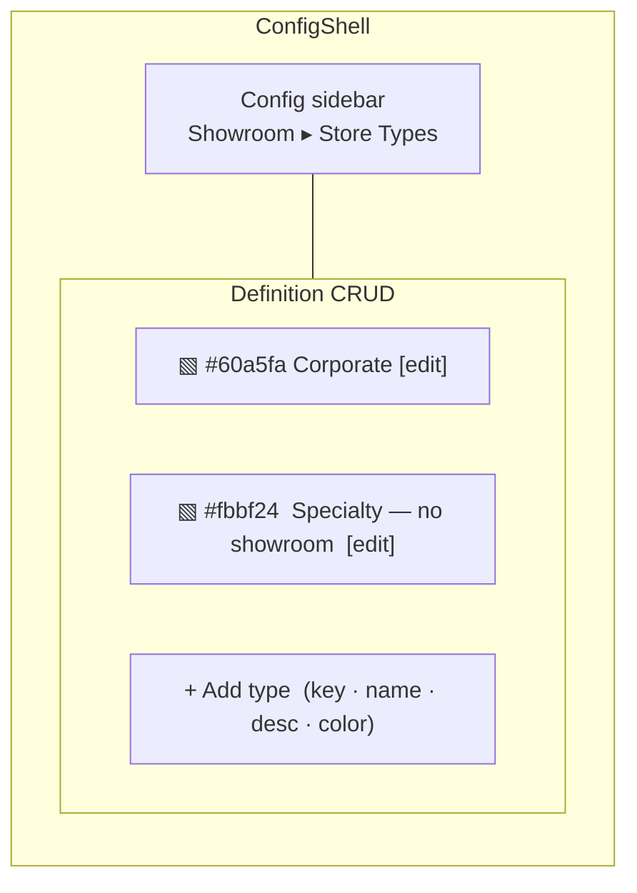
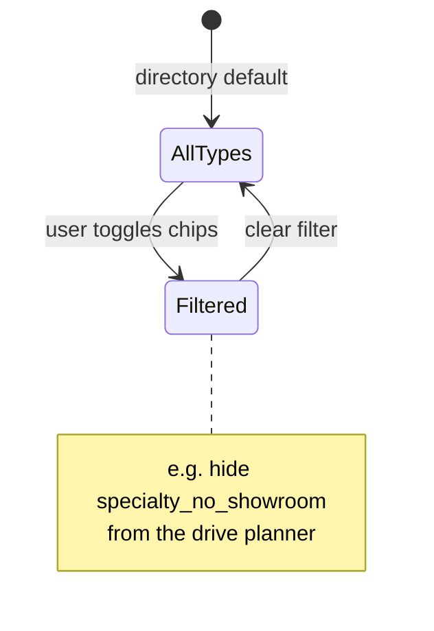

# 0031 — Design Spec: Store Type UI

Frontend surface for the business-model type. Three touchpoints: a config page,
a color-coded badge, and a filter. All dark-theme Monolith, Base UI primitives.

## 1. Config page — `/admin/config/showroom/store-types`

Built on **`ConfigShell`** (shared config sidebar + definition-table CRUD panel).
One row per type; add / edit / soft-deactivate. Because the definition carries
`html_color`, show a **color swatch** in each row and a **color picker** in the
add/edit form (same pattern as the colors config page).



- Row: `[swatch] displayName — description   · active toggle · edit`.
- Add/edit form fields: `key` (snake_case, unique, immutable once used),
  `displayName`, `description`, `html_color` (color picker), `is_active`.
- Soft-deactivate, never hard-delete — a retired type stays valid for stores
  that still point at it; it just drops out of the picker.

## 2. Type badge (color-coded)

Small pill using `html_color` as background/border tint, `displayName` as label.
Renders on the **directory card** (near the price-point / access badges) and on
the **store viewport header**. Falls back to a neutral pill if `html_color` null.

```
┌ Daltile — San Carlos ──────────────┐
│ ▧ Corporate   $$   PUBLIC           │   ← type badge, blue tint
│ Tile · Slab                         │
└─────────────────────────────────────┘
```

## 3. Type selector + filter

- **Intake / edit store:** single-select `ComboboxWithOther` bound to the active
  types; "Other" opens the create flow (writes a new definition row, selects it).
  NOT a native `<select>`. Single-select, so one value → `type_id`.
- **Directory / map / drive planner:** a type filter (multi-check chips, one per
  active type, color-dotted). Default = all shown. Lets the user hide
  `specialty_no_showroom` from walk-in planning, or isolate salvage yards.



## Components (reuse, do not hand-roll)

- `ConfigShell` — config page scaffold.
- `ComboboxWithOther` — single-select type picker with "Other" create.
- Color picker — same as colors config `hex_code` field.
- Badge — existing pill primitive; tint by `html_color` (Base UI `Badge`, no `size` prop).

## Parity notes

- Show `displayName`, never `key`.
- WCAG AA: badge text contrast must hold against the tinted background — if
  `html_color` is light, render dark text; compute at render, don't trust the hex blindly.
