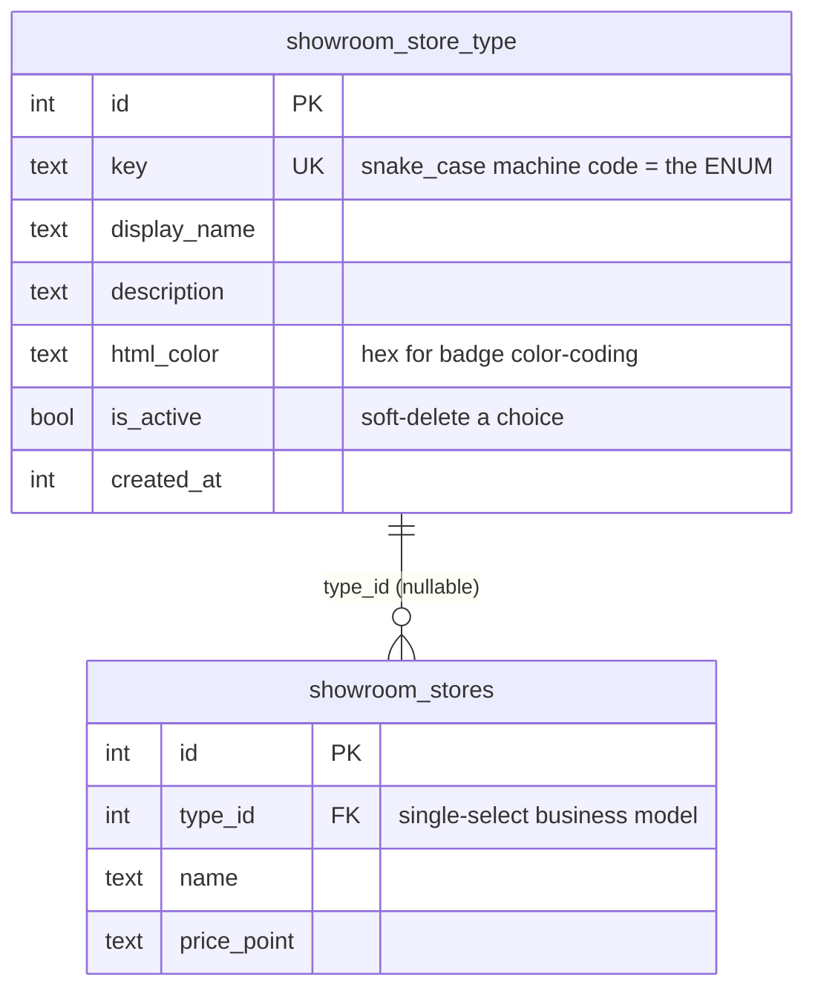
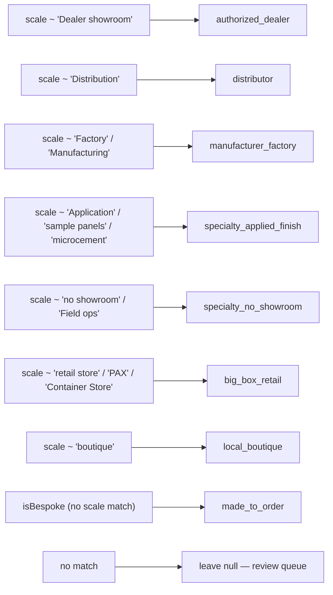

# 0031 — Showroom Store Type (business-model taxonomy)

## Context / problem

`showroom_stores` holds walk-in showrooms, but we also want to track vendors
that are **not** showrooms — precast/topcrete, poured concrete, plaster, and
other specialists that sit between a showroom and a contractor. They share every
satellite a showroom has (urls, contacts, hours, brands, notes, ratings), so a
separate table would force duplicating all of those. Instead we add a single
**business-model axis** to the store.

This axis is **orthogonal** to the existing `showroom_store_category` (what a
store *sells* — Tile, Windows, Plumbing; many-to-many). Type is how the business
*operates*, and a store is exactly **one** type → a single FK, no mapping table.

```mermaid
flowchart LR
  subgraph store[showroom_stores row]
    S[Daltile — San Carlos]
  end
  S -->|type_id 1:1| T[type: corporate]
  S -->|category M:N| C1[Tile]
  S -->|category M:N| C2[Slab]
  classDef axis fill:#1f2d4d,stroke:#60a5fa
  class T,C1,C2 axis
```

### Why not a separate `specialists` table

```mermaid
flowchart TB
  A[specialty vendor: Topcrete] --> Q{separate table?}
  Q -->|yes| D[re-create specialist_urls,<br/>specialist_contacts, specialist_hours,<br/>specialist_brands… — denormalized dup]
  Q -->|no: type_id on store| G[reuse showroom_store_links,<br/>contacts, hours, brand_mappings…<br/>for free]
  classDef bad fill:#4d1f1f,stroke:#f87171
  classDef good fill:#1f4d2e,stroke:#4ade80
  class D bad
  class G good
```

## Data model

Seed vocabulary (`key` — `display_name`) — **derived from the live 219-store
corpus (2026-07-25)**, not guessed. Example vendors are real rows.

| key | display_name | html_color | real example |
|---|---|---|---|
| `corporate` | Corporate / manufacturer | `#60a5fa` | Daltile, Pella |
| `authorized_dealer` | Authorized dealer | `#38bdf8` | Lema, Poliform |
| `local_boutique` | Local boutique | `#f472b6` | Splashworks, DJ Bath |
| `big_box_retail` | Big-box retail | `#fb923c` | IKEA PAX, The Container Store |
| `distributor` | Distributor / trade supply | `#22d3ee` | Duraamen, Archatrak |
| `manufacturer_factory` | Manufacturer / factory | `#818cf8` | Concreteworks, Closet Factory |
| `specialty_applied_finish` | Specialty — applied finish | `#2dd4bf` | Topcret, Craftex, Tile Tech |
| `specialty_no_showroom` | Specialty — no showroom | `#fbbf24` | Petty Masonry |
| `design_build` | Design-build | `#a78bfa` | — |
| `salvage` | Salvage / reclaim | `#a3a3a3` | Ohmega, Urban Ore, Building ReSources |
| `made_to_order` | Made to order | `#4ade80` | — |

`key` is UNIQUE and never rendered; UI shows `display_name`. New types are a row
insert via `/admin/config`, never a migration (no hard drizzle enum).

**Collapsible pairs** (drop to ~8 types if desired): `corporate`+`authorized_dealer`,
`manufacturer_factory`+`made_to_order`, `specialty_applied_finish`+`specialty_no_showroom`.

## Backfill source — the free-text `scale`, not the booleans

The type is **not net-new data**. The strongest signal is the store's free-text
`scale` descriptor, which already names the business model almost verbatim; the
booleans (`isBespoke`, `isAppointmentOnly`) are a weaker secondary hint.
Pattern-match `scale` → `key` (case-insensitive `LIKE`), fall back to booleans,
default the rest to review.

Known salvage yards have no `scale` and are matched by name/description
(`Ohmega Salvage`, `Urban Ore`, `Building ReSources`). Backfill is a
**best-effort fill** — it writes `type_id` and leaves the row flagged for human
confirmation, and never overwrites a type an admin already set.

## Phases

```mermaid
flowchart TB
  P1[P1 Schema + seed + backfill] --> P2[P2 API: type CRUD + store filter]
  P2 --> P3[P3 MCP: expose + filter by type]
  P2 --> P4[P4 Frontend: config page + badge + filter]
  classDef done fill:#1f4d2e,stroke:#4ade80
```

- **P1 — Schema.** `showroom_store_type` table (done: schema file written) +
  `showroom_stores.type_id` FK (nullable, `onDelete: set null`). `db:generate`,
  `migrate:remote`, verify column. Seed 6 types + run backfill.
- **P2 — API.** `GET /api/showroom-store-types` (list active), `POST` (create
  "Other"), `PATCH/:id` (edit / soft-deactivate). Store read returns the joined
  type; store create/update accepts `typeId`; directory LIST/SEARCH gains a
  `type` filter.
- **P3 — MCP.** `list_store_types` tool; `get_showroom`/`list_showrooms` return
  type; `update_showroom` accepts `typeId`; `search_showrooms` filters by type.
- **P4 — Frontend.** `/admin/config/showroom/store-types` (ConfigShell, with
  color picker on `html_color`); type badge (color-coded) on directory cards +
  store viewport; type filter in directory, map, and drive planner.

## Schema / API / MCP deltas

- **Schema:** +1 table `showroom_store_type`; +1 column `showroom_stores.type_id`.
- **API:** +3 routes (type CRUD); store create/update/read + directory filter touched.
- **MCP:** +1 tool `list_store_types`; 4 showroom tools gain `type`.
- **Migration tags:** one new (`0137_*`).

## Risks

- **Filter regression:** specialty-no-showroom vendors would clutter walk-in
  surfaces (directory/map/drives) if not filtered. Mitigate: ship the type
  filter in P4 alongside intake, default the directory to show all with a chip.
- **Backfill mis-guess:** a wrong auto-type is worse silent than blank. Mitigate:
  backfill only fills, never overwrites; flag low-confidence rows for review.
- **Two sources of truth:** booleans + type drifting. Mitigate: after backfill,
  booleans become display-only; document in `stores.ts`.

## Success criteria

- Every store can carry exactly one active type; adding a new type needs no migration.
- Topcrete/plaster/concrete vendors live in `showroom_stores` with
  `type = specialty_no_showroom` and are filterable out of walk-in surfaces.
- Config page manages the vocabulary (add / rename / recolor / soft-retire).
- Type badge renders with `html_color` on directory + viewport.

## Verification

- `pnpm run migrate:remote` then confirm `type_id` + `showroom_store_type` exist on remote.
- `scripts/qc/pr_<n>.mjs`: list types, create "Other", set a store's type, filter
  directory by type, regression-guard the plain store list. Run `--preview` + prod.
