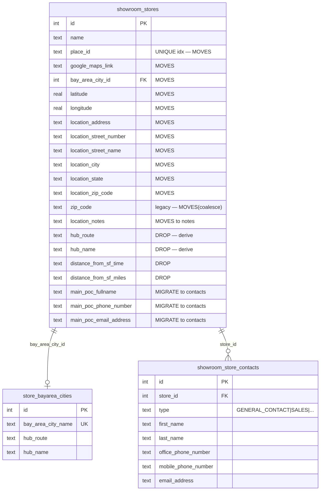
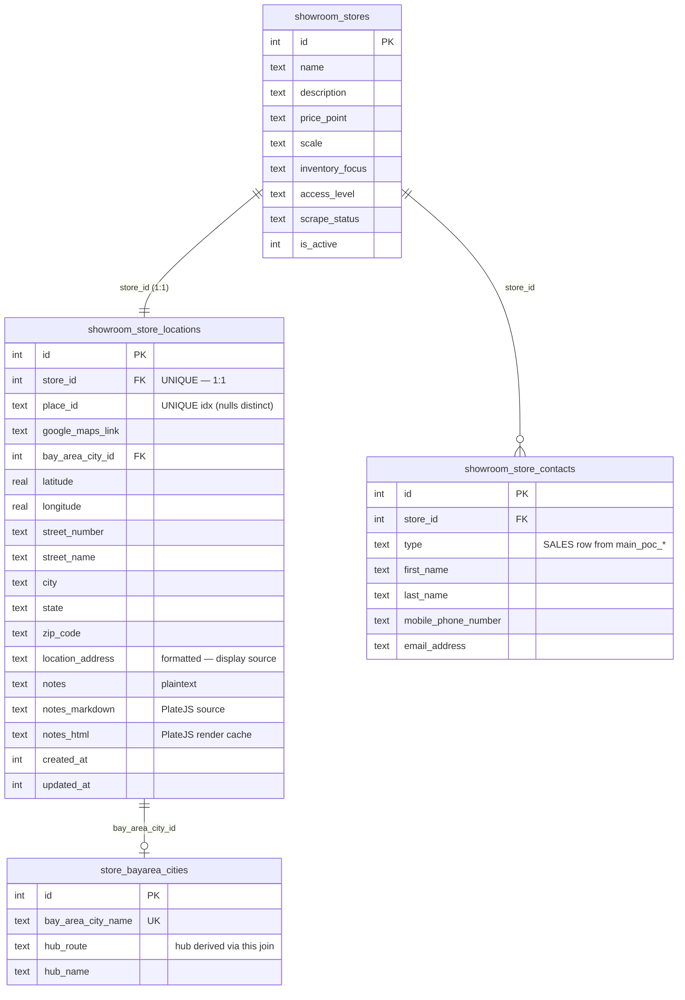
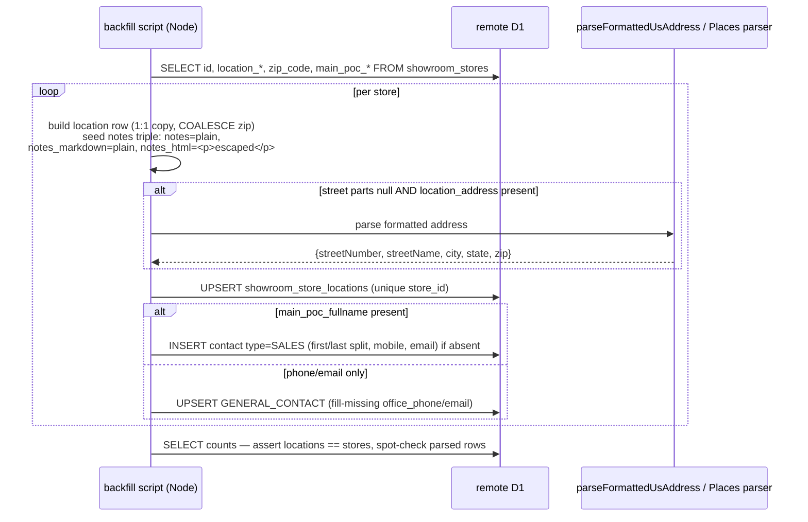

# 0031 — Showroom Stores → Location/Contacts Refactor

**Slug:** `showroom-stores-location-refactor`
**Branch:** `claude/showroom-stores-schema-refactor-6a547e`
**Status:** PLAN — awaiting approval (planning mode; no feature code written yet)
**Author agent:** Claude (Opus 4.8)
**Verified against:** `origin/main` (worktree 0 behind, 0 ahead at plan time)

> **DESIGN_SPEC omitted deliberately.** The chosen contract is *flat backward-compatible*
> (below), so the React frontend and all 13 response TS types are **untouched** except: two
> trivial `distance_from_sf_*` field-def removals (Phase C) and swapping the **notes** field
> to the existing `OverviewNoteEditor` (PlateJS) reusable component (task B9). Both reuse
> existing patterns — no new UX to spec. A proper nested `location{}`/`contacts[]` contract —
> which *would* need a DESIGN_SPEC — is deferred to **Phase D**.

---

## 1. Problem / context

`showroom_stores` has accreted ~20 location and point-of-contact columns that belong in
relational children. This is the same "denormalized name/blob columns on the parent" smell
the repo repeatedly warns against. The columns to relocate:

- **Location:** `place_id`, `google_maps_link`, `bay_area_city_id`, `latitude`, `longitude`,
  `location_address`, `location_street_number`, `location_street_name`, `location_city`,
  `location_state`, `location_zip_code`, `zip_code` (legacy dup), `location_notes`.
- **Dropped entirely (not moved):** `hub_route`, `hub_name` (derived from address now),
  `distance_from_sf_time`, `distance_from_sf_miles` (recomputable from coords).
- **Migrated to `showroom_store_contacts`:** `main_poc_fullname`, `main_poc_phone_number`,
  `main_poc_email_address`.

**Goal:** move location fields into a new 1:1 `showroom_store_locations` table, migrate the
`main_poc_*` scalars into the existing `showroom_store_contacts` table, derive hub/region
from address automatically, and drop the dead columns — **without breaking the flat API/MCP
contract the frontend depends on, and without losing a single row.**

### Approved decisions (2026-07-24)

| # | Decision | Choice |
|---|---|---|
| 1 | Response/request shape | **Flat, backward-compatible** now (JOIN + merge to top-level camelCase). Proper nesting deferred to Phase D follow-up patch. |
| 2 | Rollout | **Phased: expand → backfill → contract** (3 PRs, verify-before-drop). |
| 3 | `main_poc_*` named-person contact type | **`SALES`** (name-less phone/email upserts the store `GENERAL_CONTACT`). |
| 4 | Hub | **Derived from address** via the region service — no captured hub columns. Built to generalize beyond the Bay Area for eventual resale (Phase D2). |

---

## 2. Data model

### 2.1 Current (relevant slice)

### 2.2 Target

### 2.3 Column mapping (old `showroom_stores` → new home)

| Old column | New home | Notes |
|---|---|---|
| `place_id` | `showroom_store_locations.place_id` | UNIQUE index moves too (nulls distinct). |
| `google_maps_link` | `…locations.google_maps_link` | (Your list said `google_maps_url` — actual name is `google_maps_link`.) |
| `bay_area_city_id` | `…locations.bay_area_city_id` | FK → `store_bayarea_cities`. |
| `latitude` / `longitude` | `…locations.latitude` / `longitude` | |
| `location_address` | `…locations.location_address` | **Added to new table** (your list omitted it, but it is the display source read by directory/detail/brands/backfill — must move, not drop). |
| `location_street_number` | `…locations.street_number` | |
| `location_street_name` | `…locations.street_name` | |
| `location_city` | `…locations.city` | |
| `location_state` | `…locations.state` | |
| `location_zip_code` + `zip_code` | `…locations.zip_code` | `COALESCE(location_zip_code, zip_code)`. |
| `location_notes` | `…locations.notes` + `notes_markdown` + `notes_html` | Field is **PlateJS-authored** → keep all three versions (plaintext + markdown + html), per the `OverviewNoteEditor` / `notes_markdown`+`notes_html` convention. The existing plain value seeds all three on backfill. |
| `hub_route` / `hub_name` | **derived** | From `bay_area_city` join, else `resolveCityName(signals)`. Columns dropped. |
| `distance_from_sf_time` / `_miles` | **dropped** | Recomputable from coords; not carried. |
| `main_poc_fullname` | `showroom_store_contacts` (type `SALES`) | Split into first/last. |
| `main_poc_phone_number` | `…contacts.mobile_phone_number` | Name-less → `GENERAL_CONTACT.office_phone_number`. |
| `main_poc_email_address` | `…contacts.email_address` | |

---

## 3. The flat-contract strategy (why the frontend does not change)

Every frontend surface reads these as **flat top-level camelCase props**; nesting would
break 13 TS types and silently break `EditStoreModal` (its `[key:string]:unknown` index
signature returns `undefined` instead of erroring). So the external contract stays flat:

```mermaid
flowchart LR
    subgraph read["READ — one shared helper"]
        Q[loadStoreWithLocation] -->|LEFT JOIN locations| M[merge to flat<br/>camelCase keys]
        M -->|derive hub| H[hubRoute/hubName<br/>from city/region lib]
        H --> R[same JSON shape<br/>as today]
    end
    subgraph write["WRITE — one shared helper"]
        B[flat request body] --> F[field-out]
        F --> S[(showroom_stores<br/>identity cols)]
        F --> L[(showroom_store_locations)]
        F --> C[(showroom_store_contacts<br/>POC fan-out)]
    end
    R --> FE[Frontend — UNCHANGED]
    FE --> B
    classDef done fill:#1f4d2e,stroke:#4ade80
    classDef risk fill:#4d1f1f,stroke:#f87171
    class R,FE done
```

The `showroom_store_contacts` schema already documents this exact "field-out a submitted
payload" pattern, so this is idiomatic, not novel. The merge helper maps
`locations.notes → response.locationNotes` and `locations.location_address →
response.locationAddress` etc., so keys are byte-identical to today.

---

## 4. Rollout — expand / backfill / contract

```mermaid
flowchart TD
    A0[A1 backup remote D1<br/>wrangler d1 export] --> A1
    A1[A2 add locations schema<br/>db:generate] --> A2[A3 migrate:remote<br/>CREATE empty table]
    A2 --> A3[A4 backfill script<br/>copy + parse-gap-fill + POC→contacts]
    A3 --> A4[A5 run remote + verify counts]
    A2 --> A5[A6 dual-write<br/>writers write BOTH]
    A4 --> AQ[A7 QC pr-A]
    A5 --> AQ
    AQ --> B1[B1 read helper<br/>JOIN+merge+derive hub]
    B1 --> B2[B2/B3 repoint readers<br/>API + MCP]
    B1 --> B4[B4 field-out writer<br/>new table only]
    B4 --> B5[B5/B6 repoint writers<br/>API + MCP]
    B1 --> B7[B7 hub derivation]
    B2 --> BQ[B8 QC pr-B preview+prod]
    B5 --> BQ
    B7 --> BQ
    BQ --> C1[C1 drop-columns migration<br/>drop place_id uniq idx first]
    C1 --> C2[C2 migrate:remote + verify]
    BQ --> C3[C3 frontend cleanup<br/>remove distance_from_sf fields]
    C2 --> CQ[C4 QC pr-C regression]
    C3 --> CQ
    CQ --> D[Phase D — deferred follow-ups]
    classDef done fill:#1f4d2e,stroke:#4ade80
    classDef risk fill:#4d1f1f,stroke:#f87171
    class A0 risk
    class C1 risk
```

- **Phase A (PR-A) — expand & backfill.** Add the table, backfill it, and **dual-write**
  (writers write the new table *and* keep the old columns current). Reads stay on old
  columns this phase, so nothing can regress. Old columns remain authoritative + intact.
- **Phase B (PR-B) — cutover.** Switch reads to the JOIN+merge helper and writes to the
  field-out helper (new table only). Frontend untouched except the **notes** field, which
  swaps to the `OverviewNoteEditor` (PlateJS) so it emits `{markdown, html}` — the API now
  reads/writes the `notes` triple (B9). Verify on preview **and** prod.
- **Phase C (PR-C) — contract.** Drop the 20 dead columns (native `DROP COLUMN`; drop the
  `place_id` unique index first). Remove the two now-dead `distance_from_sf_*` field defs
  from `EditStoreModal` / hero edit modal. Regression QC.

### 4.1 Backfill sequence (Phase A)

Idempotent: upsert by unique `store_id`; contacts insert guarded so re-runs don't duplicate.

---

## 5. Full blast radius (from the code map)

### 5.1 Writers to repoint (Phase A dual-write, Phase B field-out)
- **API** `src/backend/api/routes/showroom-stores.ts`: `POST /` (create), `PUT /:id`,
  `PUT /:id/address`; `createStoreSchema` (lines ~192–267), `addressUpdateSchema` (~2115).
- **API** `showroom-backfill.ts` (granular street writer; apply paths ~635), `mcp.ts`
  `set_showroom_address` (~971), `research-jobs.ts` auto-create insert (~735),
  `showroom-contacts.ts` fill-blanks `locationAddress` (~463).
- **MCP** `showrooms/create_showroom.ts`, `import_showroom_from_place.ts`,
  `_shared.persistPlaceShowroom`, `update_showroom.ts` (**fans to both** location + contacts),
  `backfill_showroom_geo.ts`, `backfill_showroom_media.ts`.
- **Services** `services/showroom/onboarding.ts` (`mapPlaceDetailsToStoreInput`,
  `computeStoreGeoPatch`, `resolveStoreGeoPatch`, `upsertBayAreaCityId`),
  `services/showroom/places-backfill.ts`, `db/seeds/seed-showroom-stores.ts`.

### 5.2 Readers to repoint (Phase B JOIN+merge)
- **API** list `GET /`, detail `GET /:id` (whole-row spreads — every moved column),
  `PUT` responses, `brands.ts` (`locationAddress`), `showroom-sales.ts` (`locationCity`),
  `drive-lists.ts` + `tesla.ts` (`latitude`/`longitude`), `showroom-backfill.ts` cards.
- **MCP** `get_showroom` (+ `mcp.ts:571` context), `list_showrooms`, `search_showrooms`
  (place_id dedup), `find_known_showrooms` (place_id + city), `check_showroom_intake_status`
  (place_id lookup), and the full-row returns of create/import/update.

### 5.3 Reuse — do NOT reinvent
- **Address parser:** `parseGoogleAddressComponents` (`services/google/maps.ts:90`) for
  Places `addressComponents`; `GoogleMapsService.placeAddressComponents(placeId)` (~1121).
- **Region/hub:** `classifyBayAreaRegion`, `regionFromLatLng/Zip/Address`, `resolveCityName`
  (`src/backend/lib/bay-area-region.ts`) — the hub is derived here, on write and at read.
- **POC → contacts:** the existing backfill endpoint `showroom-contacts.ts:~664` already
  reads `main_poc_*` and builds contact rows — align the Phase A script with its mapping.
- **Legacy `showroom_pocs`** (separate old table used by `add_showroom_poc`/`get_showroom`)
  is **out of scope** — do not touch it.

---

## 6. Risks & mitigations

```mermaid
flowchart LR
    R1[Column-drop cascade wipe] -->|native ALTER DROP COLUMN<br/>per migration 0109, no __new rebuild| M1[DEFUSED — verify generated SQL]
    R2[place_id DROP blocked by UNIQUE idx] -->|drop showroom_stores_place_id_uniq first| M2[verify db:generate emits DROP INDEX]
    R3[Backfill data loss] -->|expand→backfill→verify BEFORE contract| M3[counts asserted; old cols kept in Phase A]
    R4[Free-text address parse wrong] -->|parser self-check + spot audit; placeId rows keep Places parts| M4[gap-fill only; never overwrites good data]
    R5[distance_from_sf_* dropped from response] -->|EditStoreModal index sig → undefined harmless| M5[remove 2 field defs Phase C]
    classDef done fill:#1f4d2e,stroke:#4ade80
    class M1,M2,M3,M4,M5 done
```

- **Cascade wipe (the big one):** memory `d1-drop-table-cascade-gotcha` warns a SQLite
  table-rebuild drop would cascade-delete `showroom_stores` children. **Defused:** this
  repo's drizzle-kit emits native `ALTER TABLE showroom_stores DROP COLUMN` (proven by
  migration `0109`), not a `__new_` rebuild. **Mandatory check:** after `db:generate` for
  Phase C, read the migration SQL and confirm it is native `DROP COLUMN` with no
  `__new_showroom_stores` table. If it is a rebuild, STOP and hand-author native drops.
- **`place_id` unique index:** SQLite refuses `DROP COLUMN` on an indexed column. The
  generated Phase C migration must `DROP INDEX showroom_stores_place_id_uniq` before
  dropping `place_id`. Verify; the new unique index lives on `showroom_store_locations`.
- **No `db.transaction()`** (dead on D1) — use `db.batch([...])` for multi-statement writes
  in the field-out helper; sequential + compensating-delete where a generated id must feed
  the next insert.

---

## 7. Compliance scan (mandatory)

| Data point | Currency? | Multi-select? | Verdict |
|---|---|---|---|
| `bay_area_city_id` | — | single-select FK to definition table `store_bayarea_cities` | **Compliant** — real FK, no comma-string. |
| `location.notes` (from `location_notes`) | — | — | **RESOLVED — full rich-text triple.** The field is PlateJS-authored, so it is stored as `notes` (plaintext) + `notes_markdown` (portable source) + `notes_html` (render cache), matching the repo's `OverviewNoteEditor` / `store_notes(contentMarkdown/contentHtml)` / `showroom_visit_log(notes_markdown/notes_html)` convention. API accepts/returns all three; the notes input becomes an `OverviewNoteEditor`. |
| `distance_from_sf_*`, `zip_code`, address parts | — | — | Plain scalars — no currency, no multi-select. |

No currency fields in scope. No open flags — `notes` is now a compliant PlateJS triple (task B9).

---

## 8. Verification per phase (targets the DEPLOYED worker)

- **A:** `showroom_store_locations` exists on remote; `SELECT count(*)` == stores count;
  spot-check 10 parsed addresses + POC→contact rows; dual-write parity probe.
- **B:** `scripts/qc/pr_<B>.mjs` against **preview** (`--preview`) and **prod** — list/detail/
  create/update return the same flat keys with correct values; hub derived correctly;
  MCP `get_showroom`/`search_showrooms` unaffected. Frontend smoke on preview.
- **C:** columns gone (`PRAGMA table_info(showroom_stores)`); every read endpoint still 200
  (a 500 here = unapplied migration or a missed reader); `pnpm run smoke`; regression QC.

Each PR ships a `scripts/qc/pr_<n>.mjs`, updates the D1 changelog rows (branch + entry +
detail + verification block with real output), and the PR body links the changelog entry.

## 9. Rollback

- Phase A/B are additive + dual-path — revert the code PR; the new table is harmless if
  unused. Phase C is the only destructive step: the **backup from A1** is the restore path
  for the dropped columns, and Phase C is not started until B is green on prod.

## 10. Deferred (Phase D — separate feature requests, NOT built here)
- **D1** Proper nested `location{}` / `contacts[]` contract + frontend type rewrite
  (the "correct way" follow-up you asked for).
- **D2** Generalize the hub/region classifier from Bay-Area-hardcoded into a geocode-backed,
  multi-market region service (for eventual resale of the app).
