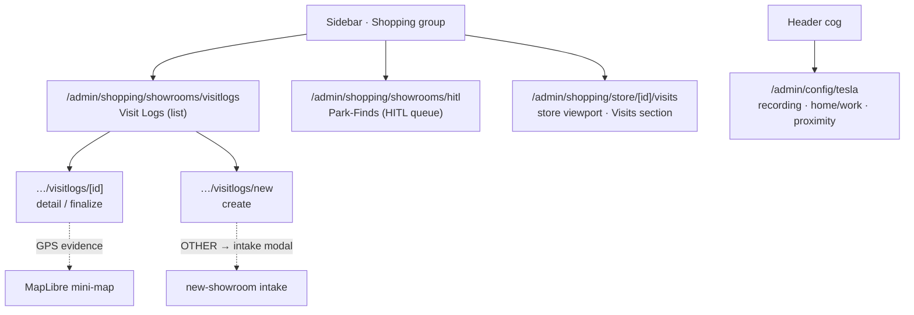
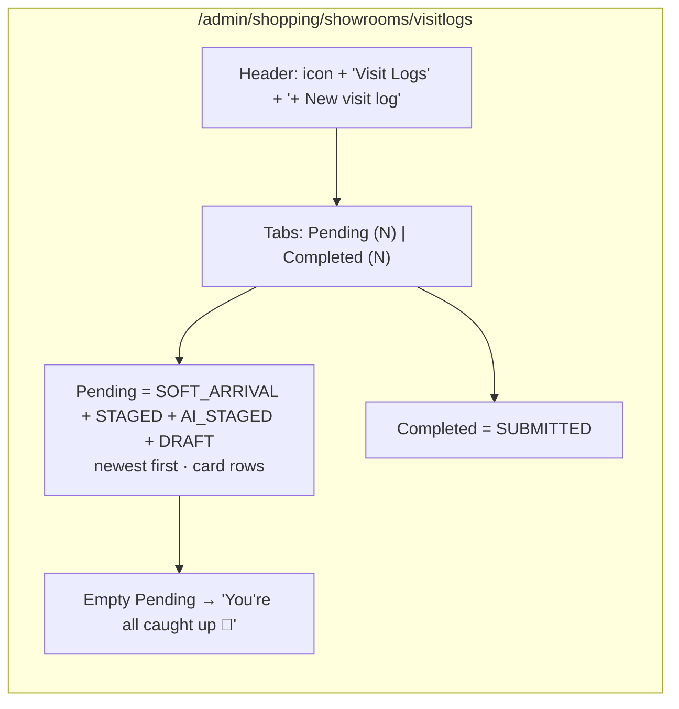
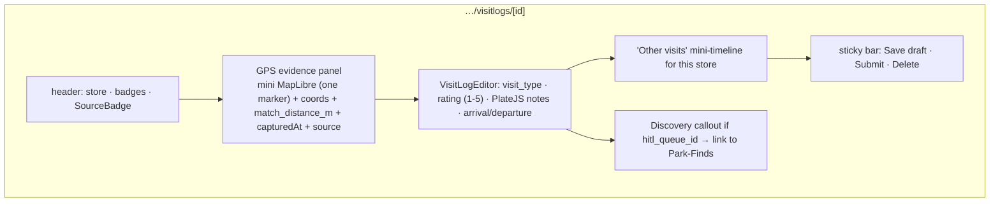
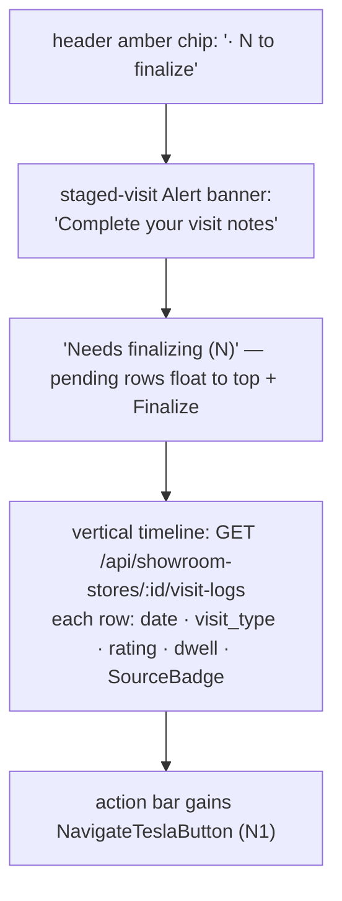
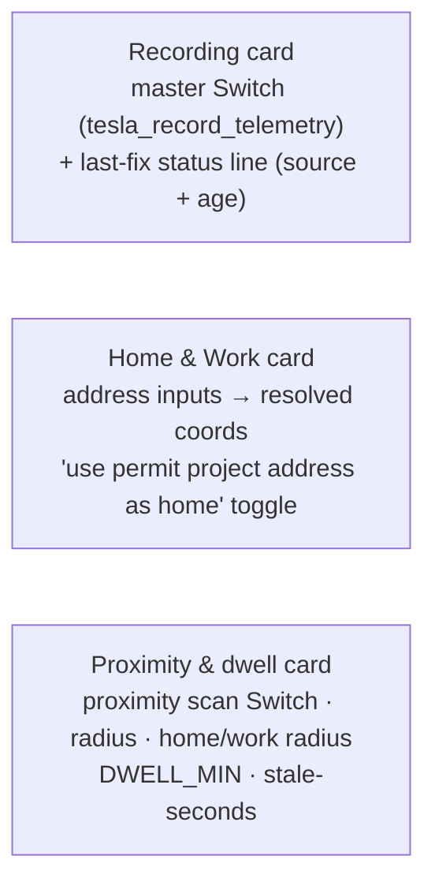
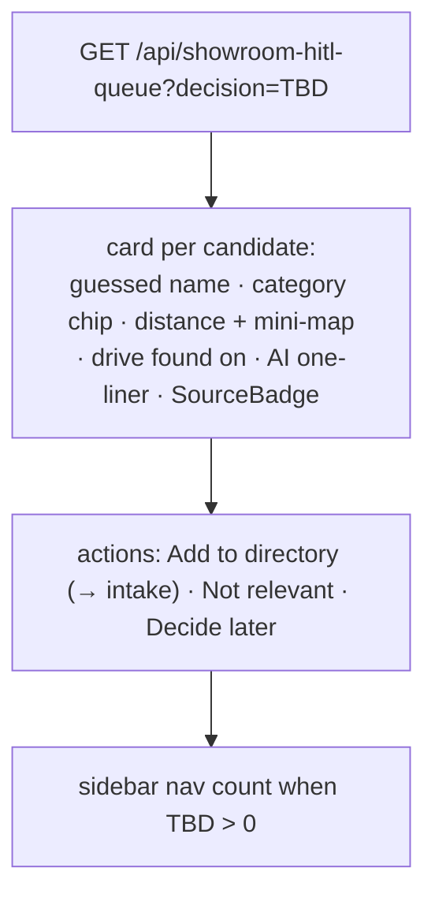

# 0032 — Design Spec (frontend)

**Preview changelog:** https://core-remodel.hacolby.workers.dev/admin/changelog/preview/0032-location-visits-discovery
**Scope of this spec:** the surfaces owned by *this* pass — the **Visit Logs workspace** (V2), the **Tesla config** completion (C1), the store-viewport **Visits** section, and the **Park-Finds** HITL page shell (D1). The discovery-finder realtime pages (D2) are specced separately by the pass that owns them.

Every page is a thin Astro shell mounting one React island in `<BaseLayout>`, following the canonical `studio.astro` structure (`class` not `className`; `container mx-auto px-4 py-8 pb-12`; header block with a 24px lucide icon). Components are Base UI (not Radix). Reusable pieces are built first and shared.

---

## 1. Information architecture

---

## 2. Shared components (build first)

| Component | Purpose | Notes |
|---|---|---|
| `VisitStatusBadge` | `TESLA_SOFT_ARRIVAL` · `TESLA_STAGED` · `AI_STAGED` · `SUBMITTED` | color-coded; PENDING = anything not SUBMITTED |
| `VisitTypeChip` | visit_type (`WALK_IN_*`, `APPOINTMENT`, `SOFT_ARRIVAL`) | icon + label |
| `VisitLogEditor` | the finalize/create form | `OverviewNoteEditor` (PlateJS → md+html), rating, type, arrival/departure, store bind |
| `ShowroomAutocomplete` | store picker with **OTHER** | `ComboboxWithOther`; OTHER → intake modal → binds `store_id` |
| `SourceBadge` | which location source staged it | `tessie-poll` / `phone` / `ai` / `tessie-stream` / `manual` — makes provenance visible |

> `SourceBadge` is 0032-specific and important: the user is deliberately running off multiple location sources, so *every* staged visit shows **how** it was captured and how far the fix was from the store (`match_distance_m`) — the attestation story, surfaced.

---

## 3. Visit Logs workspace — list

Each **pending card**: store name (or discovery name if `hitl_queue_id`), `VisitStatusBadge`, `SourceBadge`, `match_distance_m` ("parked 40 m away"), drive context, arrival time + dwell, a one-click **Finalize** → detail. Data: `GET /api/showroom-visit-logs?status=pending`.

---

## 4. Visit Logs — detail / finalize

Finalize = `PATCH /api/showroom-visit-logs/:id` (status→`SUBMITTED`, notes md+html, rating, visit_type, departure). Submitting a rating updates the store snapshot (latest SUBMITTED wins). Never blocks: a staged row can be saved as DRAFT.

---

## 5. Visit Logs — new (create)

`ShowroomAutocomplete` (OTHER → intake modal → bind `store_id`) · `visit_type` · rating · arrival/departure · PlateJS notes · optional "attach to my active drive". `POST /api/showroom-visit-logs`. Mirrors the MCP `create_visit_log` exactly (parity).

---

## 6. Store viewport — Visits section

New `SectionKey: "visits"` in `StoreViewportApp` + `VALID_SECTIONS` (component + both astro pages), path `/admin/shopping/store/[id]/visits`.

---

## 7. Tesla config completion — `/admin/config/tesla`

Mirror `PropertyAddressConfigApp` inside `ConfigShell`. Three cards:

Optimistic `POST /api/admin/config`. Add `config-nav.ts` entry. The **"primary residence"** toggle also appears on the permit address config so home coords are shared, not re-entered.

---

## 8. Park-Finds (HITL) — page shell (D1)

`/admin/shopping/showrooms/hitl` — the park-event discovery queue (renamed from "discovery" to avoid colliding with the on-demand finder).

---

## 9. States & tokens
- Follow the default dark shadcn theme; theme-aware.
- Loading: skeleton rows. Error: inline retry. Empty: the celebratory "all caught up" for Pending; a neutral empty for Completed/queue.
- PENDING is amber; SUBMITTED is emerald; SourceBadge uses a muted outline with a per-source icon (car / phone / sparkle-AI / hand-manual).
- Every note field is PlateJS (`OverviewNoteEditor`) → persists **both** markdown and html. Never a bare `<textarea>`.
- Rating uses a real 1–5 star control; store on submit.

---

## 10. Parity contract
Every Visit Logs / HITL action has a REST route AND an MCP tool that go through one service layer. The UI is never a privileged path — the voice loop (another pass) must reach the same behavior. This spec's job is to make the *human* surface; the MCP twins are specced in the implementation plan §6 (V2).
