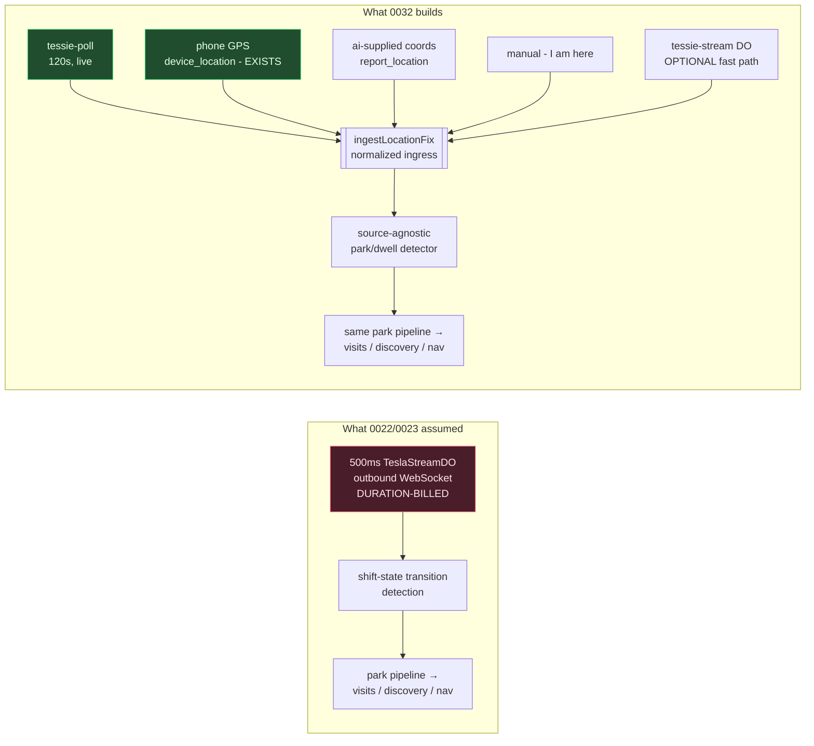
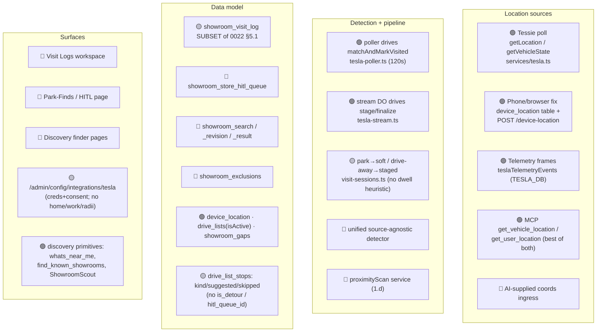
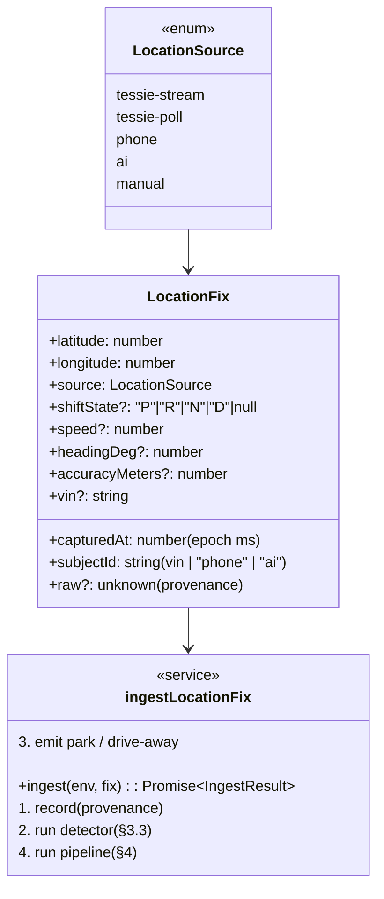
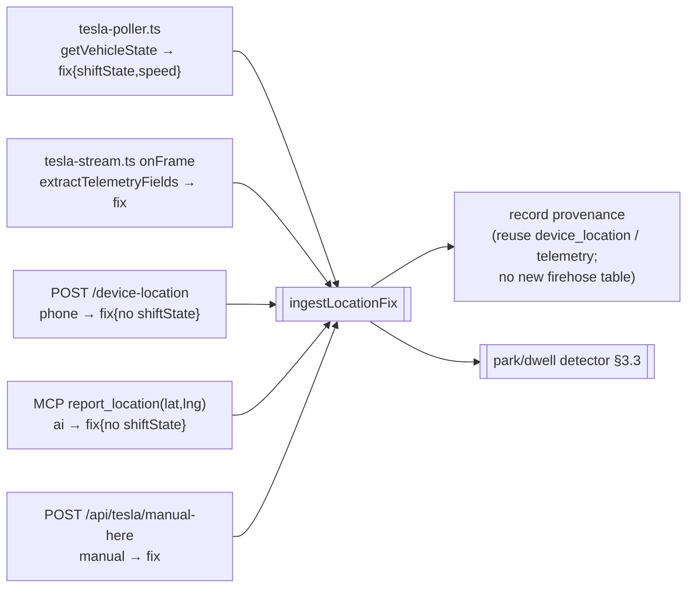
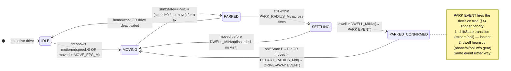
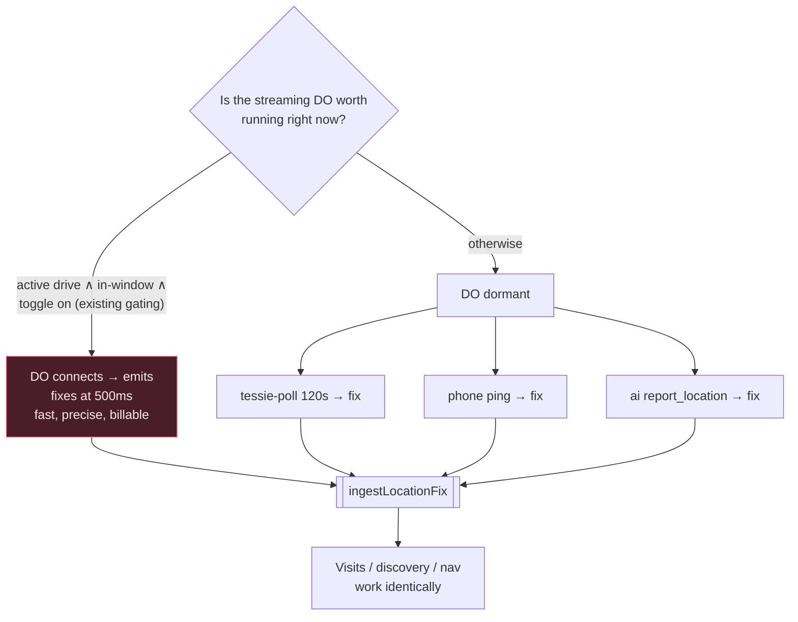
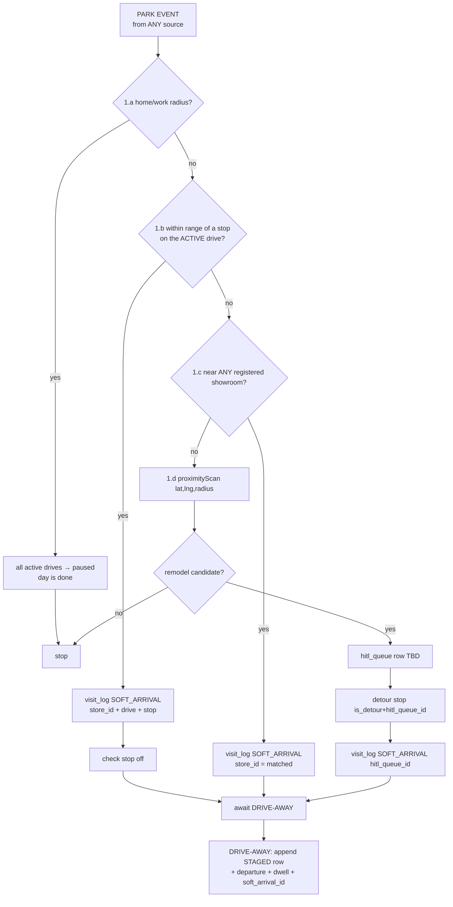
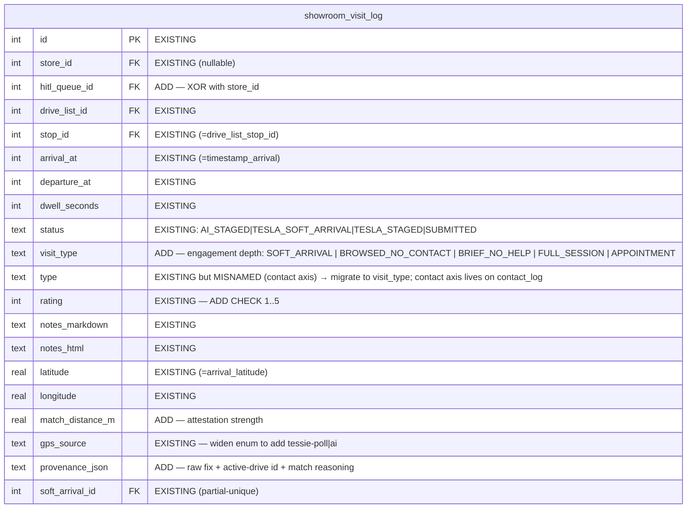
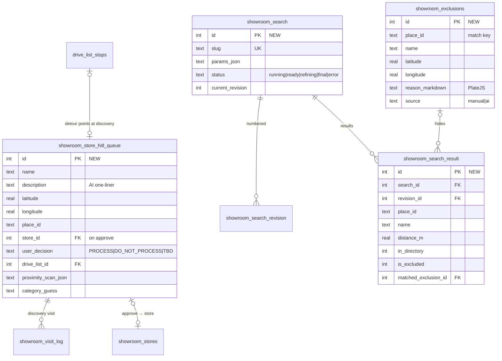
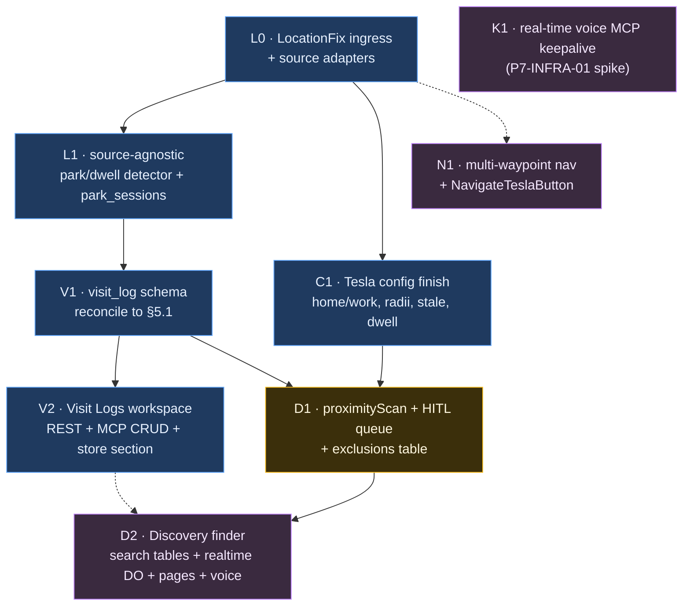

# 0032 — Location-Source-Agnostic Visits & Discovery

**Status:** Planning → ready to review
**Owner:** Justin (product), coding agent (implementation)
**Preview changelog:** https://core-remodel.hacolby.workers.dev/admin/changelog/preview/0032-location-visits-discovery
**Supersedes the ingest framing of:** `0022_gps_showroom_drives` (P1–P7), `0023_tesla_telemetry_webhooks` (the streaming-DO-first execution)
**Cross-references (do NOT duplicate):** `0031_drive_list_ops` (drive-sheet UX — separate track), `docs/plans/2026-07-21-drive-visit-state-machine.md` (`tesla_park_sessions` — folded in here)

> **The reframe in one sentence.** 0022/0023 built the visit-capture & discovery vision *on top of* a billable 500 ms Tesla streaming Durable Object. This plan **decouples every user-facing feature from the stream** by introducing a normalized location ingress that any source can feed — a Tessie poll, a phone GPS ping, an AI agent supplying coordinates, or (optionally) the streaming DO — and hangs the whole pipeline off *that*. The stream becomes one optional "fast-path" source, not a dependency.

---

## 1. Why this plan exists

The user's directive: **de-emphasize the streaming DO; make the features around it work with just Tessie polling, phone location, or an AI agent supplying GPS coordinates every so often.**

The good news, confirmed by reading the specs *and* the shipped code: **almost nothing actually needs the stream.** Exactly one step is stream-coupled — automatic *park/drive-away detection* — and even 0022 already routes webhook `drive_state` events through the same comparator. Everything downstream (the decision tree, two-row staging, proximity discovery, the finder, visit/contact CRUD, "what's near me", nav, config) operates on a single `{lat, lng, timestamp, shiftState?}`.

---

## 2. Current state — what's already built (verified in-repo)

Legend: 🟢 shipped · 🟡 partial/diverges from spec · 🔴 absent.

**Key reusable assets already in the repo** (build on, don't rebuild):
- `services/tesla.ts` — `getLocation`, `getVehicleState`, `sendNavigation`, `tessieConfigured`.
- `device_location` table + `POST /api/showroom-stores/device-location` + newest-row readers (**phone source, done**).
- `services/tesla/visit-sessions.ts` — `stageSoftArrival` / `finalizeSoftArrivals` (two-row core, already source-agnostic in shape — takes a `ParkFix`).
- `services/drive-geo-match.ts` — `haversineMeters`, `initialBearing`, `matchAndMarkVisited` (active-drive-scoped, 250 m).
- `services/google/maps.ts` — `placesNearby`, `placesTextSearchMany`, `reverseGeocode`, `isUnderMonthlyQuota()` + usage log (**Places plumbing + quota gate, done**).
- MCP `whats_near_me` (proximity + undiscovered sweep), `find_known_showrooms` (dedupe/exclusion primitive), `get_user_location` (best-of phone+Tesla).
- `showroom_gaps` table/lifecycle pattern (a proven "queue with decisions" shape to model the HITL queue on).

---

## 3. The architecture — a normalized location ingress

### 3.1 The `LocationFix` contract

Every source normalizes to one shape and calls one function. This is the entire decoupling.

### 3.2 Source adapters — thin, each just builds a `LocationFix`

> **No new high-volume table.** Provenance reuses the existing sinks (`teslaTelemetryEvents`, `device_location`); the ingress writes only *events of interest* (a park session), not every fix.

### 3.3 The source-agnostic park/dwell detector

This generalizes the `tesla_park_sessions` state machine (2026-07-21 plan) so it works **with or without `shiftState`**. That's the crux: a phone or AI fix has no gear, so we fall back to a **dwell heuristic**.

**Detector state** lives in KV (`CACHE`, key `loc:detector:<subjectId>`), never a growing table — mirrors the existing `tesla:last-shift:<vin>` pattern. Constants (config-driven, §7):
- `DWELL_MIN` (default **5 min**, config-adjustable — a real showroom stop, not a red light; low enough to catch a quick slab-yard peek). CONFIRMED 2026-07-26.
- `PARK_RADIUS_M` (default 60 m — "same spot across fixes").
- `DEPART_RADIUS_M` (default 120 m — "the car left").
- `MOVE_EPS_M` (default 40 m — GPS jitter floor).

A **park session** row (`park_sessions`, §5.4) is the durable anchor so app-close/phone-sleep can't lose an in-flight visit — exactly the #178 design, generalized past Tesla.

### 3.4 Where the streaming DO fits now

The DO keeps all its existing safety (circuit breaker, native alarms, write budget) — but it's now **strictly optional**. Turn it off and the poller + phone + AI keep every feature alive at ~120 s granularity. This is the cost lever the user asked for.

---

## 4. The park pipeline — unchanged logic, new trigger

Once `ingestLocationFix` emits a **PARK** or **DRIVE-AWAY** event, the existing 0022 decision tree runs verbatim — it only ever needed one `{lat,lng}`.

**Drive-away** = the detector's `PARKED_CONFIRMED → MOVING` transition (gear change, or the car moved > `DEPART_RADIUS_M`), so a poll/phone stream closes the dwell just as well as the 500 ms stream.

---

## 5. Data model deltas

### 5.1 Reconcile `showroom_visit_log` to 0022 §5.1 (it's currently a subset)

**Reconciliation decisions to confirm with the user (flagged, not silently chosen):**
- **D-1 (CONFIRMED 2026-07-26).** Two separate entities, cleanly split:
  - **`showroom_visit_log.visit_type` = engagement depth of the visit** — `SOFT_ARRIVAL` (auto-staged, not yet classified) · `BROWSED_NO_CONTACT` (walked through, spoke to no one) · `BRIEF_NO_HELP` (asked someone, got pointed, no real engagement) · `FULL_SESSION` (worked the floor, pulled samples, real consultation) · `APPOINTMENT` (scheduled). This is the quality signal that matters for the future sale of the app.
  - **`showroom_store_contact_log` = who/how you communicated** — `type` = `PHONE | EMAIL | SHOWROOM_IN_PERSON`, PLUS an **optional `showroom_visit_log_id` FK** (0022 §5.3). So an in-person contact made *during* a visit links back to that visit and carries `type = SHOWROOM_IN_PERSON`; a phone/email contact stands alone with a null visit link. This lets "who did I actually talk to on the floor that day" be a first-class, queryable fact.
  - Migrate the mislabeled existing `type` values onto the right axis.
- **D-2 (CONFIRMED 2026-07-26).** Add `hitl_queue_id`. The "exactly one of store_id / hitl_queue_id" rule is enforced **only once the visit is confirmed** (status `SUBMITTED`, and for `TESLA_STAGED`/`DRAFT` where a target is known); while a row is still an unconfirmed `TESLA_SOFT_ARRIVAL`/`AI_STAGED` auto-arrival, "neither yet" is allowed. Implemented as a partial CHECK (`status IN (...) → the XOR holds`) plus service-layer validation on finalize.
- **D-3.** `match_distance_m` + `provenance_json` are additive/nullable — safe.

### 5.2 New tables (0022 §5.2 / §5.7)

Plus the small existing-table adds: `drive_lists += paused` (status enum widen), `drive_list_stops += is_detour + hitl_queue_id`, `showroom_stores += is_identified_by_proximity_scan + proximity_scan_json`, `contact_log += showroom_visit_log_id + type`. (`drive_list_stops` already has `kind/suggested/skipped` from 0031 — additive, no conflict.)

### 5.3 Migrations
All via `pnpm run db:generate` → `migrate:remote` (app DB) and `db:generate:tesla` → `migrate:tesla:remote` (`TESLA_DB`). **Never hand-author.** Every add is additive/nullable so concurrent branch previews keep working. CHECK constraints via Drizzle `check()` in the table builder; verify the generated SQL before applying.

### 5.4 New `park_sessions` (the detector anchor)
Generalizes #178 `tesla_park_sessions`, keyed on `subject_id` (vin|phone|ai) not just VIN: `id`, `subject_id`, `drive_list_id?`, `stop_id?`, `store_id?`, `hitl_queue_id?`, `latitude/longitude`, `source`, `parked_at`, `departed_at?`, `dwell_seconds?`, `status (parked|settled|discarded)`, `visit_log_id?`. Partial-unique on `(subject_id)` where `status='parked'` (one open park per subject).

---

## 6. Phasing & ownership

| Phase | Scope | Owner | Maps to |
|---|---|---|---|
| **L0** | `LocationFix` type, `ingestLocationFix`, adapt poller/stream/phone, add `report_location` MCP + `manual-here` route | **This pass (mine)** | 0023 ING-03 seam; new |
| **L1** | Park/dwell detector (shiftState OR dwell), `park_sessions` table, wire park/drive-away → pipeline | **This pass (mine)** | #178; 0022 §6.2 P3-SVC-01 |
| **V1** | `showroom_visit_log` reconcile (visit_type, hitl_queue_id+XOR, match_distance_m, provenance_json, rating CHECK, gps_source enum) | **This pass (mine)** | 0022 §5.1 / 0023 P1-DB-01 |
| **V2** | Visit Logs workspace (list/detail/new), REST CRUD, MCP CRUD (create/get/list/update/delete/stage/finalize), store viewport "Visits" section | **This pass (mine)** | 0022 P1 + §14.1 |
| **C1** | `/admin/config/tesla` completion: home/work geocode, radii, `tesla_location_stale_seconds`, `DWELL_MIN` etc. | **This pass (mine)** | 0022 P2 |
| **D1** | `proximityScan` service (reuse `placesNearby`+`find_known_showrooms`), `showroom_store_hitl_queue`, `showroom_exclusions`, decision 1.d, Park-Finds page | **Shared** (service mine, page could be another pass) | 0022 P4 |
| **D2** | `showroom_search/_revision/_result`, `find_showrooms` orchestration, discovery realtime DO, finder pages, voice CRUD parity | **Another agent / later pass** | 0022 P7 |
| **N1** | Multi-waypoint `navigate-drive` + waypoints spike, `NavigateTeslaButton` shared component | **Another agent / later pass** | 0022 P5 |
| **K1** | Real-time voice MCP keepalive spike + fix | **Another agent / later pass** | 0022 P7-INFRA-01 |

> **My pass (0032)** owns L0→L1→V1→V2→C1 (+ the D1 *service*) — the source-agnostic foundation plus the Visit Logs workspace, which is the user's stated #1 priority and "ships value even with GPS off." D2/N1/K1 are scoped and handed off in `TRACKING.json`.

---

## 7. Config keys (`project_system_variables`, category `tesla`)
`tesla_record_telemetry` (master) · `tesla_primary_residence_address` + `tesla_home_lat/_lng` · `tesla_work_address` + `tesla_work_lat/_lng` · `tesla_proximity_radius_m` (250) · `tesla_home_work_radius_m` (150) · `tesla_proximity_scan_enabled` · `tesla_location_stale_seconds` (300) · **new:** `loc_dwell_min_seconds` (300 = 5 min) · `loc_park_radius_m` (60) · `loc_depart_radius_m` (120). Reuses `GET/POST /api/admin/config`.

---

## 8. Cost & safety
- **The whole point:** with the DO off, cost is ~1 Tessie cached read / 120 s while a drive is active + the same read on a phone/AI ping. No 500 ms firehose, no duration-billed socket.
- **Places/AI** spend stays confined to park-event `proximityScan` (rare) + user-initiated `find_showrooms`, both behind the existing `isUnderMonthlyQuota()` hard-disable.
- Detector state is KV (self-replacing), not a growing table — no `$700`-class runaway surface.
- Deferred (needs a cost model): always-on drive-by scanning with no active drive (0022 `PX-DEFER-01`).

---

## 9. Verification plan
- **L0/L1:** unit-test the detector with synthetic fix sequences per source — a poll-only sequence (no shiftState) still fires park via dwell; a phone sequence fires drive-away via `DEPART_RADIUS_M`; sub-`DWELL_MIN` park is `discarded`.
- **V1:** migration applies on local D1; XOR/CHECK reject bad rows; existing rows migrate cleanly (visit_type backfill).
- **V2:** QC script drives the visit-log REST CRUD + MCP parity; workspace renders Pending-first + empty state.
- **End-to-end (real):** with the **DO off**, take a drive with phone location on (or the poller) → a visit stages on arrival and finalizes on drive-away → appears in Visit Logs. This proves the decoupling on real hardware.
- Each phase: `scripts/qc/pr_<n>.mjs` against preview + prod, changelog entry with QC output + remote-migration status, changelog link in the PR body.

---

## 10. Decisions (all CONFIRMED 2026-07-26)
1. **D-1 — visit_type = engagement depth; contact_log stays separate + gains an optional visit FK.** ✅ (§5.1)
2. **D-2 — "exactly one of store_id / hitl_queue_id" enforced only once confirmed; neither-yet allowed while an unconfirmed auto-arrival.** ✅ (§5.1)
3. **DWELL_MIN = 5 min, config-adjustable.** ✅ (§3.3)
4. **Phone is a first-class source** — a phone fix alone can stage a visit (no Tesla required). ✅
5. **AI-supplied coords via a dedicated `report_location` MCP tool** that feeds the detector (so "I'm at the stone place" stages the visit like the car would). ✅
6. **D2 / N1 / K1 are a separate later pass** so 0032 (L0–V2, C1, D1) stays independently shippable. ✅
