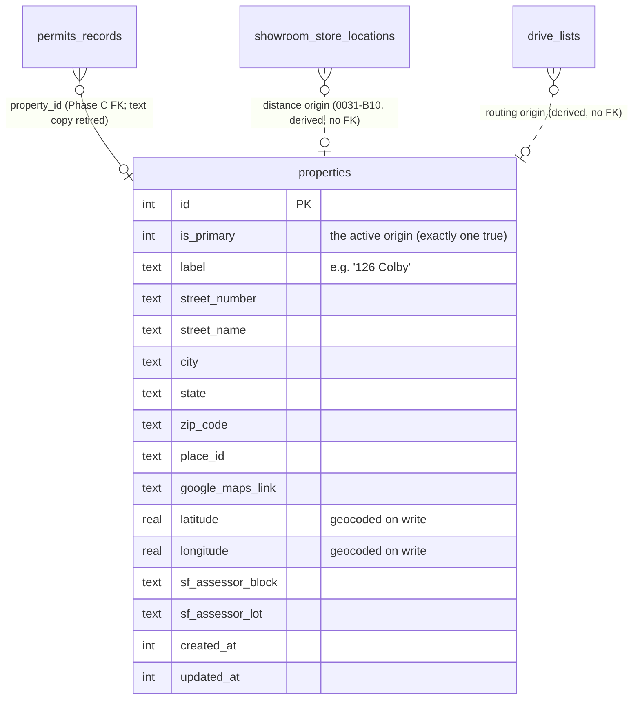
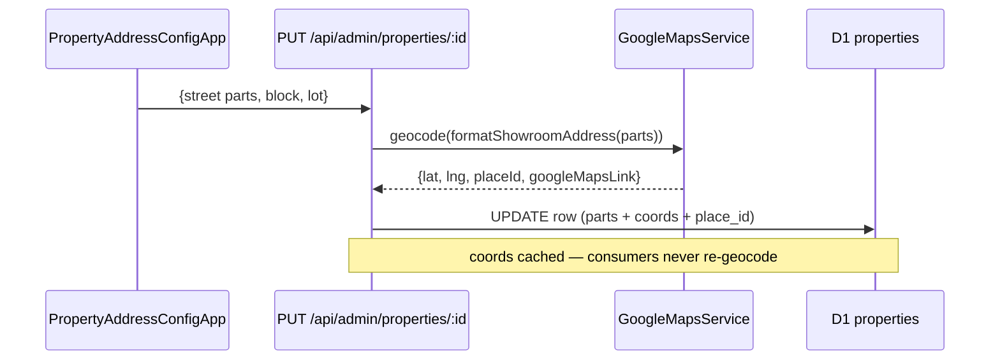

# 0032 — Property / Origin Config (first-class, relational)

**Slug:** `property-origin-config`
**Branch:** TBD (cut fresh from `origin/main`)
**Status:** PLAN — awaiting approval (planning mode; no feature code yet)
**Unblocks:** `0031` task **B10** (dynamic distance) — 0031-B10 reads this table's coords.

> **DESIGN_SPEC:** minor. One existing config page (`/admin/config/address` →
> `PropertyAddressConfigApp`) is repointed from the generic config KV to typed CRUD; the
> field set barely changes. No new UX surface to spec.

---

## 1. Problem

The target property — the home being renovated — is the origin for permits, drive routing,
and showroom proximity. Today it is **fragmented and partly hardcoded**:

- `/admin/config/address` (`PropertyAddressConfigApp`) writes address / ZIP / block / lot into
  the **generic `/api/admin/config` key-value store**, and the React form **hardcodes fallback
  defaults** (`permits_block: "5934"`, `permits_lot: "5"`, …) instead of trusting D1.
- The **routing / distance origin is hardcoded in code** — `"126 Colby St, San Francisco, CA"`
  in `mcp/tools/drives/plan_drive_route.ts:132`, `api/routes/showroom-scout.ts`,
  `services/google/maps.ts`, and OpenAPI examples.
- `home/permits_records.property_address` is a **denormalized free-text** copy, not a relation.

Consequences: the property lives in three places (KV, code constants, denormalized text), none
of them relational. You cannot JOIN "the property" to permits, drives, or showrooms, and a
resale/multi-property future is impossible without a rewrite.

**Goal:** one **first-class `properties` D1 table** (structured address + geocoded coords +
assessor block/lot), with **CRUD APIs**, that every consumer reads — killing the hardcoded
origins and the KV fallback, and making the property **joinable** across the system.

---

## 2. Data model

- **`properties`**, not a single-row `property_config` — one row now (`is_primary = true`),
  but rows-per-property makes the resale / multi-property future free. `is_primary` selects the
  active origin. Display address is **derived** from the structured parts (`formatShowroomAddress`,
  shared with 0031) — never a stored raw string (AI abuses a free field; same rule as 0031).
- **Coords are geocoded on write** (reuse `GoogleMapsService`), so every proximity/distance
  consumer works off lat/lng, not a re-geocode per read.

---

## 3. Rollout

```mermaid
flowchart TD
    A1[A1 properties schema + db:generate] --> A2[A2 migrate:remote]
    A2 --> A3[A3 CRUD API /api/admin/properties<br/>geocode-on-write]
    A3 --> A4[A4 backfill: KV config + hardcoded 126 Colby -> row is_primary]
    A4 --> A5[A5 QC pr-A]
    A5 --> B1[B1 de-hardcode code origins<br/>read primary property]
    A5 --> B2[B2 repoint PropertyAddressConfigApp<br/>drop hardcoded defaults]
    B1 --> B3[B3 QC pr-B]
    B2 --> B3
    B3 --> C1[C1 optional: permits_records.property_id FK<br/>retire denormalized text]
    B3 --> U[unblocks 0031-B10]
    classDef done fill:#1f4d2e,stroke:#4ade80
    class U done
```

- **Phase A — table + API + backfill.** Create `properties`; CRUD at `/api/admin/properties`
  (admin-gated); geocode on write. Backfill one `is_primary` row from the existing config KV
  (`permits_block`/`permits_lot`/address/zip) + the hardcoded `126 Colby` origin, geocoded.
  **This alone unblocks 0031-B10** (the coords now exist in a real table).
- **Phase B — de-hardcode.** Replace the `"126 Colby St, …"` code constants with a read of the
  primary property (`getPrimaryProperty(env)` helper). Repoint `PropertyAddressConfigApp` to the
  typed CRUD and **delete its hardcoded defaults**.
- **Phase C — relational ties (optional / follow-on).** Add `permits_records.property_id` FK and
  retire the denormalized `property_address` text (per the FK-not-name rule). Gated behind the
  0033 audit's read of who else denormalizes the address.

### 3.1 Geocode-on-write

---

## 4. Consumers to repoint (de-hardcode)
- `mcp/tools/drives/plan_drive_route.ts:132` — `origin: { address: "126 Colby St, …" }` → primary property.
- `api/routes/showroom-scout.ts` — routing origin example/default.
- `services/google/maps.ts` — `homeAddress` callers.
- `api/routes/openapi.ts`, `budget-tracker.ts` — hardcoded strings (examples vs live — audit each).
- `frontend/components/config/PropertyAddressConfigApp.tsx` — drop `DEFAULTS`, read the row.
- **0031-B10** — showroom distance origin (cross-plan consumer).

## 5. Reuse — do NOT reinvent
- `GoogleMapsService` (`services/google/maps.ts`) for geocoding + `parseGoogleAddressComponents`.
- `formatShowroomAddress(parts)` — the display-address helper introduced in 0031 (share it).
- The existing admin-config auth gate + `ConfigShell` page scaffold.

## 6. Compliance scan
- Address stored as **structured parts** + derived display (same anti-abuse rule as 0031). ✓
- No currency, no multi-select, no rich text in scope. ✓
- `block`/`lot` are single scalars (SF assessor). ✓
- **FK-not-name:** Phase C retires the denormalized `permits_records.property_address` in favour
  of `property_id` — actively *fixing* a name-column smell, not adding one. ✓

## 7. Risks
- **Geocode failure** → store parts, leave coords null, flag; distance consumers degrade
  gracefully (show address, no distance) rather than 500.
- **Only one `is_primary`** — enforce with a partial unique index / write-time guard so two rows
  can't both claim primary.
- **D1: no `db.transaction()`** — `db.batch([...])`; migrations via `db:generate` + `migrate:remote`.
- **Don't break permits** — Phase C FK migration keeps the text column until the FK is backfilled
  and verified (expand/contract), never a hard swap.

## 8. Verification
- A: `properties` exists on remote; one `is_primary` row; coords geocoded; CRUD round-trips.
- B: no code path references the `"126 Colby"` string (grep clean); config page reads/writes the row.
- C: `permits_records.property_id` populated for the primary; text column retired only after parity.

## 9. Deferred
- Multi-property / multi-tenant UI (rows already supported; UI later).
- Migrating the *rest* of the config KV into typed relational tables — informed by the **0033**
  audit (which classifies every isolated/config table).
