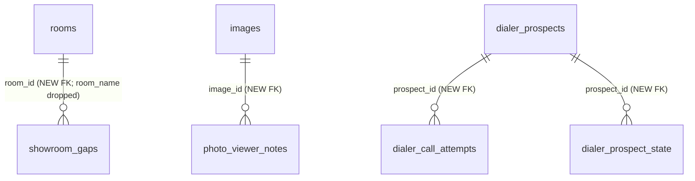

# 0033 — D1 Table Integrity Audit & Targeted Remediation

**Slug:** `d1-table-audit`
**Status:** PLAN — awaiting approval. **Phase A (audit) is already complete** (findings below);
Phases B/C are the proposed remediation, gated on your per-item approval.

> **Methodology correction (important).** The trigger was "260 tables, 49 with no FK — why are
> they in lala land?" But **FK-isolation ≠ dead or broken.** The real signal is *"is the table
> read/written by code, and by whom?"* On that signal, **49 of the 50 isolated tables are alive**
> — they are logs, ledgers, config/vocab, and registries that are FK-free *by design*. We do NOT
> auto-add FKs and we do NOT fabricate seed data (both are in the pasted `audit-and-fix.mjs`; both
> are forbidden here — mock data is banned, and a blind FK-add forces a SQLite table rebuild that
> can cascade-wipe children). Remediation is a short, hand-picked list.

---

## 1. Audit result (Phase A — done)

Read-only pass over all `sqliteTable(...)` defs + every `.references()` edge + code-usage grep.

```mermaid
flowchart TD
    T["264 table defs · 263 unique<br/>(1 dead duplicate def)"] --> I["50 isolated<br/>(no in/out FK)"]
    I --> S["45 STANDALONE_BY_DESIGN<br/>used, FK-free on purpose — LEAVE"]
    I --> O["4 ORPHANED_MISSING_FK<br/>real parent exists — ADD FK"]
    I --> D["1 DEAD_UNUSED<br/>saved_image_searches — DROP"]
    classDef ok fill:#1f4d2e,stroke:#4ade80
    classDef warn fill:#4d3a1f,stroke:#fbbf24
    classDef bad fill:#4d1f1f,stroke:#f87171
    class S ok
    class O warn
    class D bad
```

Note: our code-based count is **50** isolated; the CSV-based export said **49** — the delta is the
methodology (schema-`.references()` graph vs the exported FK CSV) and the lone dead table. Not
material; the classification is what matters.

### The 5 real actions (everything else is left alone)

| # | Table | Action | Detail |
|---|---|---|---|
| 1 | `saved_image_searches` | **DROP** | 0 code refs; only *named* in a never-built plan-0010 "recovery" task. Confirm 0010 abandoned, then drop. |
| 2 | `canvasInspirationReferences` (dup def in `images/image_base_canvas.ts:77`) | **DELETE dead code** | Duplicate const; the barrel uses `images/canvas_inspiration_references.ts`. Code-only, no migration. |
| 3 | `showroom_gaps.room_id` | **ADD FK → rooms** + **drop `room_name`** | Strongest case: has a `*_id` naming an existing table AND a denormalized `room_name` (the exact anti-pattern CLAUDE.md bans). Join `rooms` for the name. |
| 4 | `photo_viewer_notes.image_id` | **ADD FK → images.id** | `image_id` TEXT → `images` UUID PK. |
| 5 | `dialer_call_attempts.prospect_id` + `dialer_prospect_state.prospect_id` | **ADD FK → dialer_prospects.id** | Both point at the dialer root (text-slug PK) with no constraint. |

The **45 STANDALONE_BY_DESIGN** are documented as intentional (Phase B7) so the next audit doesn't
re-flag them: changelog/plan/agent-ledger tables, MCP-ops + permits clusters (soft text-key links on
append-only logs), usage meters (`gemini_usage_log`, `google_maps_usage_log`), config/vocab
(`project_system_variables`, `sales_tax_rates`, `model_pricing`, `device_preferences`), integration
logs (clickup/tesla/health/workflow), and KV-style stores (`agent_adhoc_memory`, `google_oauth_tokens`).

---

## 2. Target relations (Phase B FK adds)

---

## 3. The dangerous part: adding an FK on D1 safely

Adding an FK to an existing SQLite/D1 table forces a **12-step table rebuild** (create `__new_`,
copy, **drop old**, rename). The memory `d1-drop-table-cascade-gotcha` warns that the intermediate
DROP cascades to children.

```mermaid
flowchart LR
    A[backup remote D1] --> B[validate: no orphan child rows<br/>whose parent id is missing]
    B -->|orphans found| F[flag/clean BEFORE rebuild<br/>never auto-delete]
    B -->|clean| C[db:generate the FK add]
    C --> D[READ generated SQL:<br/>is target a LEAF? no children to cascade]
    D --> E[migrate:remote + verify row count preserved]
    classDef risk fill:#4d1f1f,stroke:#f87171
    class A,D risk
```

**Why it is tractable here:** all four FK-target children (`showroom_gaps`, `photo_viewer_notes`,
`dialer_call_attempts`, `dialer_prospect_state`) are **leaf tables — nothing references them** — so
their rebuild has no children to cascade-wipe. Still mandatory: (a) A1 backup; (b) validate every
child row's `*_id` resolves to a real parent (an FK-add fails if any orphan row remains) — orphans
are **flagged for human decision, never auto-deleted**; (c) read the generated SQL and confirm the
rebuild touches only the one table; (d) verify row counts before/after.

---

## 4. Rollout

- **Phase A — audit (DONE).** Findings above; recorded in this plan + the changelog entry.
- **Phase B — targeted remediation (one PR per cluster, gated on your approval per item):**
  - `B1` Drop `saved_image_searches` (after confirming plan-0010 abandoned).
  - `B2` Delete the dead duplicate `canvasInspirationReferences` def (code-only).
  - `B3` `showroom_gaps`: add `room_id` FK → `rooms`, drop denormalized `room_name`, repoint the
    one reader to JOIN. (Highest value — fixes a banned anti-pattern.)
  - `B4` `photo_viewer_notes.image_id` FK → `images`.
  - `B5`/`B6` dialer `prospect_id` FKs → `dialer_prospects`.
  - `B7` Document the 45 standalone tables as intentional (a short registry note / comment set) so
    future audits don't re-flag them.
- **Phase C — repeatable audit (optional).** Land the read-only audit as
  `scripts/audit/d1-integrity.mjs` (SELECT/pragma only, NO fix half) + a health probe, so drift is
  caught continuously instead of by one-off CSV export.

## 5. Compliance & guardrails
- **No fabricated data.** Empty tables stay empty; we never seed mock rows (contra the pasted script).
- **No blind FK-adds.** Only the 4 where a `*_id` names an existing table; each validated for orphans
  first, each reviewed from its generated SQL.
- **FK-not-name:** B3 *removes* a denormalized `room_name` — the canonical fix, not a new smell.
- **D1:** `db.batch`, never `db.transaction`; migrations via `db:generate` + `migrate:remote`.

## 6. Verification
- Per FK: backup taken; orphan-row count = 0 (or flagged); generated SQL rebuilds only the target;
  row count preserved; endpoint that reads the table still 200.
- `saved_image_searches` drop: `PRAGMA table_info` gone; grep confirms 0 code refs remain.
- Full read-only re-audit at the end shows 46 standalone / 0 orphaned / 0 dead.

## 7. Explicitly NOT doing
- Not adding FKs to any of the 45 standalone tables (they are correct as-is).
- Not running the pasted `audit-and-fix.mjs` fix half (mock seeding + blanket FK-add).
- Not touching the soft text-key links in the MCP-ops or permits log clusters.
