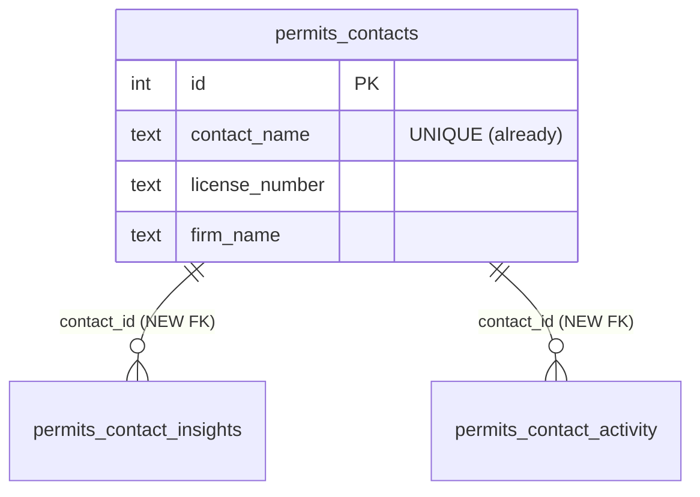
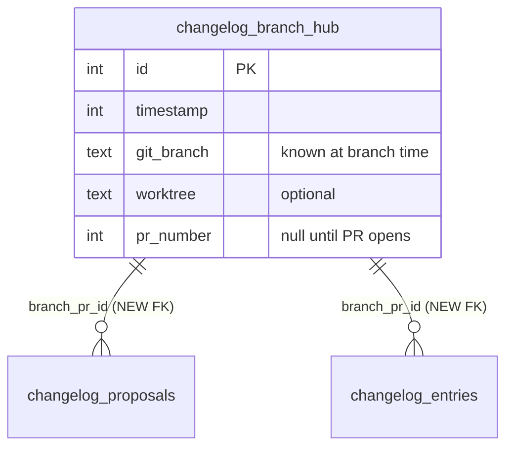
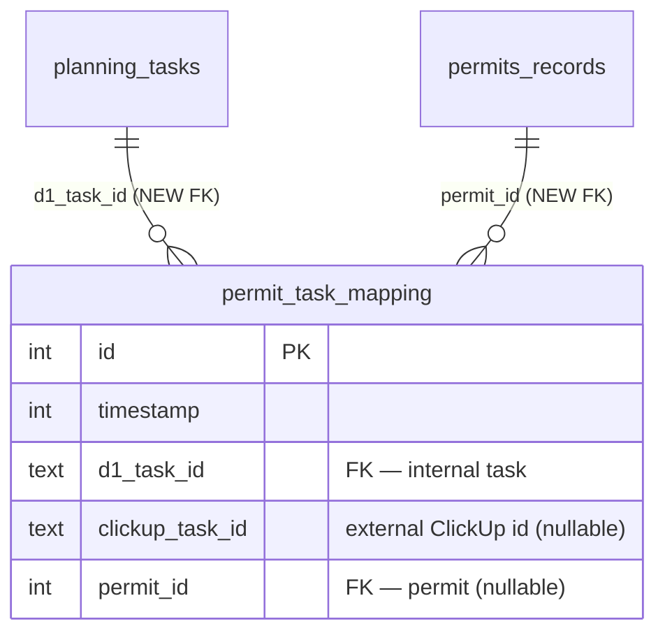

# 0033 — D1 Relational-Graph Audit & Connection Build

**Slug:** `d1-table-audit`
**Status:** PLAN — awaiting approval. **Phase A (audit + target resolution) is complete**; Phase B
(the connection build) is gated on your per-item approval, plus the 4 explicit confirms called out below.

> **Directive: MAXIMIZE the relational graph.** Default posture is **connect**, not "leave standalone."
> Every isolated table that carries an id/soft-key with a real INTERNAL counterpart gets wired — a
> **direct `*_id` FK** where the target is one of our tables, or a **bridge/mapping table** where the
> id is external (ClickUp task id) or the link is many-to-many. A table stays standalone ONLY when the
> referent truly has no internal table (a cookie id, a Gmail message id, a CF workflow-instance id) —
> and even then we make it *joinable* through a bridge where useful.
>
> Two guardrails are absolute: **(1) no fabricated/seed data**; **(2) no blind rebuilds, no guessed
> parents** — every FK/bridge validates orphans first (flag, never auto-delete), reads the generated
> SQL, and confirms an ambiguous parent with a human. Adding an FK forces a SQLite table rebuild — back
> up first.

---

## 1. Audit result (Phase A — done)

Read-only pass over all `sqliteTable(...)` defs + every `.references()` edge + code-usage grep, then a
second pass resolving the exact parent + mechanism for every connectable column from the writers.

```mermaid
flowchart TD
    T["264 defs · 263 unique<br/>(1 dead duplicate def)"] --> I["50 FK-isolated"]
    I --> W["~14 CONNECT now<br/>direct FK / bridge — target confirmed"]
    I --> C["4 CONNECT (needs a decision)<br/>task target · changelog hub · audit_run_id · mcp invocations"]
    I --> K["~28 KEEP standalone<br/>logs / ledgers / config / external ids"]
    I --> D["1 DROP dead · 1 DELETE dup def"]
    classDef ok fill:#1f4d2e,stroke:#4ade80
    classDef warn fill:#4d3a1f,stroke:#fbbf24
    classDef bad fill:#4d1f1f,stroke:#f87171
    class W ok
    class C warn
    class D bad
```

(Code-based count 50; the CSV export said 49 — the delta is `d1_migrations`, the migration-runner
system table, which isn't in the Drizzle schema. Immaterial.)

### 1.1 Method note
A schema-only pass (Gemini) proposed many FKs from column names alone. Working from the **code +
writers** corrected several: `showroom_gaps.material_id` → `material_schedule_items` (there is **no
`materials` table**); ClickUp/`device_id` have no internal parent (bridge, don't direct-FK); permits
must FK on `contact_id`, never `contact_name` (name-join is banned); and `gemini_usage_log.agent_run_id`
must stay unlinked (its parent ledger is pruned — an FK would delete spend history on retention).

---

## 1.2 Owner-specified designs (AUTHORITATIVE)

### A. Permits — `permits_contacts` = the unique-person hub

- `permits_contacts.contact_name` is **already `.unique()`**, and so is `permits_contact_insights.contact_name`
  — so "unique people" is largely enforced; keep/strengthen the unique key (prefer `license_number` when
  present, else normalized `contact_name`).
- Add `contact_id INTEGER REFERENCES permits_contacts(id) ON DELETE CASCADE` to `permits_contact_insights`
  **and** `permits_contact_activity`; **backfill 1:1** via the unique `contact_name` (case/whitespace-exact —
  surface any non-match, don't drop). Then `contact_name` becomes a JOIN, not a stored copy.

### B. Changelog — a branch/PR hub links proposals → entries → PR

- The hub row is created **at branch time** (`git_branch` known, `pr_number` null) so a proposal FKs to it
  **before any PR exists**; when the PR opens, UPDATE `pr_number`, then create the entry FK'd to the same hub.
- **RECOMMEND: extend the existing `changelog_branches`** (it already has `branch` + `pr_number` + `status`
  + `pr_url`) to BE this hub — add `worktree` + `timestamp`, FK `proposals.branch_pr_id` /
  `entries.branch_pr_id` → `changelog_branches.id`. Avoids a 4th changelog table. *(Owner may prefer a
  distinct `changelog_branch_pr`; pick one — never both.)* **CONFIRM.**
- Append-only-safe because the write path (`services/changelog-proposals.ts`, `POST /api/changelog/*`)
  **ensures the hub row first**, then writes children.

### C. `permit_task_mapping` — the task ↔ ClickUp ↔ permit bridge

- This is the hub that ties an **internal task**, its **ClickUp task**, and a **permit** together — and it
  gives the otherwise-external `clickup_task_id` an internal linkage (ClickUp logs join through it).
- **CONFIRM the `d1_task_id` target:** two internal task tables exist — `plan_tasks` (software roadmap,
  INTEGER id) and `planning_tasks` (home-remodel tasks, **UUID TEXT** id). Permits are home-domain, so the
  likely target is **`planning_tasks`** (hence `d1_task_id TEXT`). Confirm before wiring.
- `clickup_task_id` + `permit_id` nullable so a row can record a partial link; forward-populated at link
  time — **no historic backfill** (the association was never recorded). ClickUp remains its own source; this
  bridge records *correspondences*, it does not mirror ClickUp rows.

---

## 1.3 Resolved connection matrix (from the code)

### Tier 1 — WIRE NOW (direct FK, target confirmed by the writer, low risk)
| child.column | → target (PK type) | onDelete | nullable | note |
|---|---|---|---|---|
| `dialer_prospect_state.prospect_id` | `dialer_prospects.id` (TEXT slug) | CASCADE | no (is PK, 1:1) | |
| `dialer_call_attempts.prospect_id` | `dialer_prospects.id` (TEXT) | CASCADE | no | |
| `photo_viewer_notes.image_id` | `images.id` (TEXT UUID) | CASCADE | no | schema already says "FK by convention" |
| `showroom_gaps.room_id` | `rooms.id` (INT) | SET NULL | yes | **+ DROP `room_name`**, JOIN for label |
| `showroom_gaps.material_id` | `material_schedule_items.id` (INT) | SET NULL | yes | no `materials` table exists |
| `showroom_gaps.sweep_session_id` | `sourcing_sweep_sessions.id` (INT) | SET NULL | yes | currently unwritten → 0 orphans |
| `truth_table_activities.replaced_by_activity_id` | self `.id` (TEXT) | SET NULL | yes | revision chain |
| `mcp_conversations.session_id` | `mcp_sessions.id` (TEXT) | SET NULL | yes | low-volume, written after session |
| `mcp_agent_issues.session_id` | `mcp_sessions.id` (TEXT) | SET NULL | yes | |
| `mcp_feature_requests.session_id` | `mcp_sessions.id` (TEXT) | SET NULL | yes | |
| `health_email_loopback.g2w_worker_email_id` | `worker_emails.id` (INT) | SET NULL | yes | agent bonus find — internal id |

### Tier 2 — CONNECT, needs your decision (the 4 confirms)
| Item | Shape | Confirm |
|---|---|---|
| `permit_task_mapping.d1_task_id` | bridge (§1.2-C) | **`planning_tasks` vs `plan_tasks`** as the internal task target |
| Changelog hub | extend `changelog_branches` vs new `changelog_branch_pr` (§1.2-B) | which table is the hub |
| `clickup_task_flags.audit_run_id` / `clickup_system_alerts.audit_run_id` → `agent_runs.id` | **writer change** — orchestrator must store `run.id` (INTEGER) instead of the random UUID it stores now; then FK `ON DELETE SET NULL` (ledger is pruned, no cascade) | adopt `run.id` vs keep a parallel column |
| `mcp_tool_invocations.session_id` → `mcp_sessions.id` | high-volume log; documented `db.batch` ordering hazard (child can insert before parent) | keep text, OR fix write-order in `mcp/logging.ts` then FK |

### Tier 3 — KEEP standalone (correct as-is; documented in B-doc task)
- `gemini_usage_log.agent_run_id` — **deliberately non-FK**: the `agent_runs` ledger is pruned (30/90d)
  while this spend log is permanent; an FK/cascade would destroy spend history. A dangling id reads
  "(unattributed)" by design. **Do not FK.**
- `truth_table_activities.track_id` (self-family grouping key), `embedding_id` (Vectorize external).
- `device_preferences.device_id` (a cookie uuid) + `device_location` — **deferred to plan 0034
  (Identity, Auth & RBAC).** The owner wants device→user identity: `devices` (cookie ↔ device ↔ user) FK'd
  to a real `users` table, with `user_type` → user and `permissions` → user_type. That is a net-new auth
  subsystem, not a table-wiring, so 0033 leaves the device tables standalone and 0034 owns their linkage.
- External ids, now joinable via bridges where relevant: `clickup_task_id`/`clickup_list_id`,
  `workflow_run_history.workflow_instance_id`, `health_email_loopback` Gmail ids, `showroom_stores.place_id`,
  `google_*` ids.
- Pure logs/ledgers/config/registries with no internal parent (changelog entries beyond the hub FK,
  `mcp_sessions` root, usage meters, `sales_tax_rates`, `model_pricing`, `project_system_variables`, …).

### DROP / DELETE
- `saved_image_searches` — 0 code refs; only named in a never-built plan-0010 task. **DROP** (confirm 0010 abandoned).
- `canvasInspirationReferences` duplicate def in `images/image_base_canvas.ts:77` — **DELETE dead code** (barrel uses the standalone file). Code-only.

---

## 2. Target relations (the graph after Phase B)

```mermaid
erDiagram
    rooms ||--o{ showroom_gaps : room_id
    material_schedule_items ||--o{ showroom_gaps : material_id
    sourcing_sweep_sessions ||--o{ showroom_gaps : sweep_session_id
    images ||--o{ photo_viewer_notes : image_id
    dialer_prospects ||--o{ dialer_call_attempts : prospect_id
    dialer_prospects ||--o{ dialer_prospect_state : prospect_id
    mcp_sessions ||--o{ mcp_conversations : session_id
    mcp_sessions ||--o{ mcp_agent_issues : session_id
    mcp_sessions ||--o{ mcp_feature_requests : session_id
    truth_table_activities ||--o{ truth_table_activities : replaced_by_activity_id
    worker_emails ||--o{ health_email_loopback : g2w_worker_email_id
    permits_contacts ||--o{ permits_contact_insights : contact_id
    permits_contacts ||--o{ permits_contact_activity : contact_id
    planning_tasks ||--o{ permit_task_mapping : d1_task_id
    permits_records ||--o{ permit_task_mapping : permit_id
    changelog_branch_hub ||--o{ changelog_proposals : branch_pr_id
    changelog_branch_hub ||--o{ changelog_entries : branch_pr_id
```

---

## 3. Adding an FK on D1 safely (applies to every wiring)

Adding an FK forces a 12-step SQLite rebuild (create `__new_`, copy, **drop old**, rename); the DROP can
cascade to children.

```mermaid
flowchart LR
    A[backup remote D1] --> B[validate: every child *_id resolves to a real parent]
    B -->|orphans| F[FLAG for human — never auto-delete]
    B -->|clean| C[db:generate the FK/bridge]
    C --> D[READ generated SQL: rebuild touches ONLY the target?]
    D --> E[migrate:remote + verify row count preserved + endpoint 200]
    classDef risk fill:#4d1f1f,stroke:#f87171
    class A,D risk
```

Most Tier-1 targets are leaf tables (no children) → their rebuild can't cascade-wipe anything. The
exceptions (`mcp_*`, `showroom_gaps`, `truth_table_activities` self-ref) are still leaves. New bridge
tables (`permit_task_mapping`) and new columns (`contact_id`, `branch_pr_id`) are additive — lowest risk.

---

## 4. Rollout — one PR per cluster, each gated

- **A — audit + target resolution (DONE).**
- **B — connection build:**
  - `B0` Back up remote D1 (restore path for every rebuild).
  - `B1` DROP dead `saved_image_searches` (confirm plan-0010 abandoned).
  - `B2` DELETE dead duplicate `canvasInspirationReferences` def (code-only).
  - `B3` Tier-1 direct FKs — dialer (×2), `photo_viewer_notes`, `showroom_gaps` (×3 + drop `room_name` +
    JOIN), `truth_table_activities` self-FK, `mcp_*` (×3 nullable), `health_email_loopback.g2w_worker_email_id`.
    Validate orphans per column first.
  - `B4` **Permits hub** — enforce unique people; add `contact_id` FK on `permits_contact_insights` +
    `permits_contact_activity`; backfill via unique `contact_name`; retire the name copy.
  - `B5` **Changelog hub** — extend `changelog_branches` (+`worktree`,`timestamp`); FK
    `proposals.branch_pr_id` / `entries.branch_pr_id`; make the write path ensure-hub-first. *(confirm)*
  - `B6` **`permit_task_mapping`** bridge — new table (`d1_task_id`→`planning_tasks`, `permit_id`→
    `permits_records`, `clickup_task_id` text); wire ClickUp logs to join through it. *(confirm task target)*
  - `B7` `audit_run_id` → `agent_runs.id` — orchestrator writer change + FK SET NULL. *(confirm)*
  - `B8` Document the Tier-3 standalone tables as intentional (per-cluster note) so future audits don't re-flag.
  - `B9` QC: re-run the read-only audit; touched endpoints 200; changelog + PR links.
- **C — repeatable audit (optional).** `scripts/audit/d1-integrity.mjs` (SELECT/pragma only, NO fix half)
  + a health probe, so drift is caught continuously.

## 5. The 4 confirms (blocking Tier-2 only — Tier-1 can start immediately)
1. `permit_task_mapping.d1_task_id` → **`planning_tasks`** (home) or `plan_tasks` (roadmap)?
2. Changelog hub: **extend `changelog_branches`** or add a new `changelog_branch_pr`?
3. `audit_run_id`: change the orchestrator to store `run.id`, or keep a parallel `agent_run_id` column?
4. ~~A `devices` registry~~ — **moved to plan 0034 (Identity, Auth & RBAC).** Device→user linkage is
   part of the new auth subsystem, not this audit. 0033 leaves device tables standalone.

## 6. Compliance & guardrails
No fabricated data. No guessed parents (4 confirms above). FK-not-name (permits + `showroom_gaps.room_name`
both *remove* denormalized names). `gemini_usage_log` stays unlinked on purpose. D1 `db.batch`, never
`db.transaction`; migrations via `db:generate` + `migrate:remote`.

## 7. Verification
Per FK/bridge: backup taken; orphan count 0 (or flagged); generated SQL rebuilds only the target; row count
preserved; reader endpoint 200. Final re-audit: the ~14 Tier-1/2 links present, 0 orphaned, 0 dead.

## 8. Explicitly NOT doing
Not FK-ing `gemini_usage_log.agent_run_id`; not name-joining anything; not fabricating data; not mirroring
ClickUp rows into D1 (the bridge records correspondences only); not inventing a `devices` table unless
confirm #4 says so.
