# 0034 — Identity, Auth (Clerk) & RBAC

**Slug:** `identity-auth-rbac`
**Status:** PLAN — awaiting approval (planning mode; no code yet).
**Provider decision:** **Clerk** (managed/hosted) for authentication; **D1** for the relational identity
graph + RBAC (authorization). Clerk owns *who you are*; our D1 owns *devices, roles, permissions, joins*.
**Consumes:** the device tables 0033 deferred here.

> **Build note:** the implementing agent MUST load the Clerk skills (`clerk-setup`,
> `clerk-astro-patterns`, `clerk-backend-api`, `clerk-webhooks`) before writing code — the
> Cloudflare-Workers-edge integration has real gotchas (see risks).

---

## 1. Problem
The app has **no real auth**. "User" today = a `remodel_device` cookie; authorization is a **single shared
secret** — the `remodel_access` cookie is just `SHA-256(WORKER_API_KEY)` (`api/middleware/auth.ts`), so every
authorized device has identical, total access. The hand-rolled `auth/users` + `auth/sessions` tables are
scaffolding, effectively unused. To ship/sell this, we need real accounts, roles, per-user permissions, and a
device→user identity chain wired into the relational graph.

## 2. Architecture — Clerk (authn) + D1 (authz)

```mermaid
flowchart LR
    Clerk["Clerk (hosted)<br/>signup · signin · MFA · social · reset"] -->|"webhook user.*<br/>(svix-signed)"| WH["/api/webhooks/clerk"]
    WH --> U[("users mirror<br/>clerk_user_id UNIQUE")]
    Req[request] --> MW["Clerk session middleware<br/>verify token"] --> U
    CK["remodel_device cookie"] --> DEV[("devices<br/>device_cookie_id UNIQUE")]
    DEV -->|user_id FK| U
    U -->|user_type_id FK| UT[("user_types (roles)")]
    UT -->|user_type_permissions| MAP[("mapping")]
    MAP --> P[("permissions")]
    DPREF[("device_preferences")] -->|device_id FK| DEV
    DLOC[("device_location")] -->|device_id FK| DEV
    classDef ext fill:#2a2a4d,stroke:#8b8bd6
    class Clerk ext
```



**Division of responsibility:** Clerk holds credentials/PII and issues sessions; D1 stores a **thin user
mirror** (`clerk_user_id`, email, name — synced by webhook) so every domain table can FK to a real `users.id`.
Authorization (roles + permissions) lives in **our** D1 so it joins the domain graph — not in Clerk metadata.

## 3. Data model

```mermaid
erDiagram
    users ||--o{ devices : "user_id"
    users }o--|| user_types : "user_type_id"
    user_types ||--o{ user_type_permissions : "user_type_id"
    permissions ||--o{ user_type_permissions : "permission_id"
    devices ||--o{ device_preferences : "device_id"
    devices ||--o{ device_location : "device_id"
    users {
      int id PK
      text clerk_user_id "UNIQUE — Clerk id"
      text email
      text name
      int user_type_id FK
      int created_at
    }
    user_types { int id PK; text name "UNIQUE"; text description; int is_active }
    permissions { int id PK; text perm_key "UNIQUE"; text name; text description; int is_active }
    user_type_permissions { int id PK; int user_type_id FK; int permission_id FK }
    devices { int id PK; text device_cookie_id "UNIQUE"; int user_id FK; int first_seen; int last_seen; text label }
```

- **`users`** — EXTEND the existing table (never rebuild): add `clerk_user_id TEXT UNIQUE`, `user_type_id` FK;
  deprecate `password_hash` (Clerk owns credentials — make nullable, drop in a later phase). Email/name synced
  from Clerk.
- **`user_types`** + **`permissions`** + **`user_type_permissions`** — the definition-tables + mapping RBAC
  pattern (config-driven per house rules; admin-gated `/admin/config/user-types` + `/permissions`). Seed roles:
  `homeowner`, `contractor`, `designer`, `admin`, `viewer`; seed permission keys per protected surface.
- **`devices`** — cookie ↔ device ↔ user. `user_id` nullable (a device exists pre-login); bound on sign-in.
- **`device_preferences.device_id`** (today a bare cookie PK) → FK `devices`; **`device_location`** gains a
  `device_id` FK (forward-only — historic fixes stay null, per 0033's no-fabrication rule).
- **`sessions`** (hand-rolled) — **deprecated**: Clerk verifies sessions per request; drop or repurpose after cutover.

## 4. Rollout (expand/contract; never break the running admin gate)

```mermaid
flowchart TD
    A[A: Clerk foundation<br/>SDK + Workers compat + env/secrets<br/>signin/up UI + session middleware<br/>webhook -> users mirror] --> B[B: RBAC schema<br/>user_types + permissions + mapping<br/>seed roles/perms + permission-check helper]
    B --> C[C: Device identity<br/>devices table + FK device_preferences/location<br/>bind cookie->device->user on login]
    C --> D[D: Cutover authz<br/>migrate remodel_access shared-secret gate<br/>to Clerk session + admin permission<br/>reconcile MCP OAuth]
    classDef risk fill:#4d1f1f,stroke:#f87171
    class D risk
```



- **Phase A — Clerk foundation.** Install `@clerk/astro` + `@clerk/backend`; **verify Cloudflare-Workers/edge
  compatibility FIRST** (the @astrojs/cloudflare adapter). Env: `CLERK_PUBLISHABLE_KEY` (public),
  `CLERK_SECRET_KEY` + `CLERK_WEBHOOK_SIGNING_SECRET` (Worker secrets). Sign-in/up pages, session middleware,
  and a **svix-verified `/api/webhooks/clerk`** that upserts the `users` mirror on `user.created/updated/deleted`.
- **Phase B — RBAC.** Schema + seed + a `hasPermission(user, key)` helper (joins users→user_type→permissions).
- **Phase C — device identity.** `devices` table; migrate `device_preferences.device_id` to the FK; add
  `device_location.device_id`; on sign-in, bind the current `remodel_device` cookie to the user's device row.
- **Phase D — authz cutover (the risky one).** Replace the `SHA-256(WORKER_API_KEY)` `remodel_access` gate with
  Clerk session + an `admin` permission. **Dual-gate transitionally** (accept either the legacy cookie OR a
  Clerk admin session) until every surface is migrated, then retire the shared secret. Reconcile with the MCP
  OAuth provider (`@cloudflare/workers-oauth-provider`) — it stays for `/mcp`, but its principal maps to a user.

## 5. Compliance & guardrails
- `user_types` + `permissions` + `user_type_permissions` = the mandated definition+mapping pattern (admin config
  pages, `is_active` soft-delete). ✓
- **Extend `users`, never rebuild** (memory rule). No fabricated users. No currency/rich-text in scope.
- D1: `db.batch` not `db.transaction`; migrations via `db:generate` + `migrate:remote`; adding FKs = table
  rebuild → back up + validate + read SQL (0033's safety flow).

## 6. Risks
- **Clerk on Cloudflare Workers (edge runtime)** — the #1 unknown. Verify `@clerk/astro`/`@clerk/backend` run
  under the @astrojs/cloudflare adapter (some Clerk middleware assumes Node). This is task **A1**; if it can't
  run in-Worker, fall back to `@clerk/backend` token verification + a custom Astro middleware. Load the Clerk
  skills before deciding.
- **PII/data ownership** — user identities live in Clerk, not your D1 (a resale/privacy consideration). D1 mirrors
  only id/email/name.
- **Cost** — Clerk is per-MAU; note for the business model.
- **Authz cutover breakage** — the shared-secret gate protects everything today; Phase D must dual-gate so admin
  access never drops mid-migration. Do NOT bump/rotate `WORKER_API_KEY` during the transition.
- **Webhook lag** — a user may hit the app before the `user.created` webhook lands; the session middleware should
  lazily upsert the mirror row on first authenticated request as a fallback.

## 7. Verification
- A: sign-in works in the deployed Worker; a Clerk user appears in the `users` mirror via webhook; protected route
  rejects anonymous.
- B: `hasPermission` returns correct booleans across roles; config pages CRUD roles/permissions.
- C: a signed-in device row links cookie→device→user; `device_preferences`/`device_location` resolve their device.
- D: every previously `remodel_access`-gated route accepts a Clerk admin session; legacy cookie still works until
  retirement; MCP OAuth unaffected.

## 8. Deferred / open
- Multi-tenant / organizations (Clerk Orgs) for true multi-property resale — a later phase once single-tenant auth is solid.
- Whether to mirror D1 roles into Clerk `publicMetadata` (for Clerk-side gating) — default no; D1 is the authz source.
