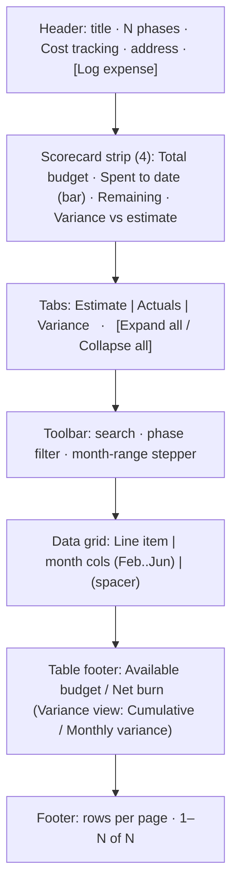
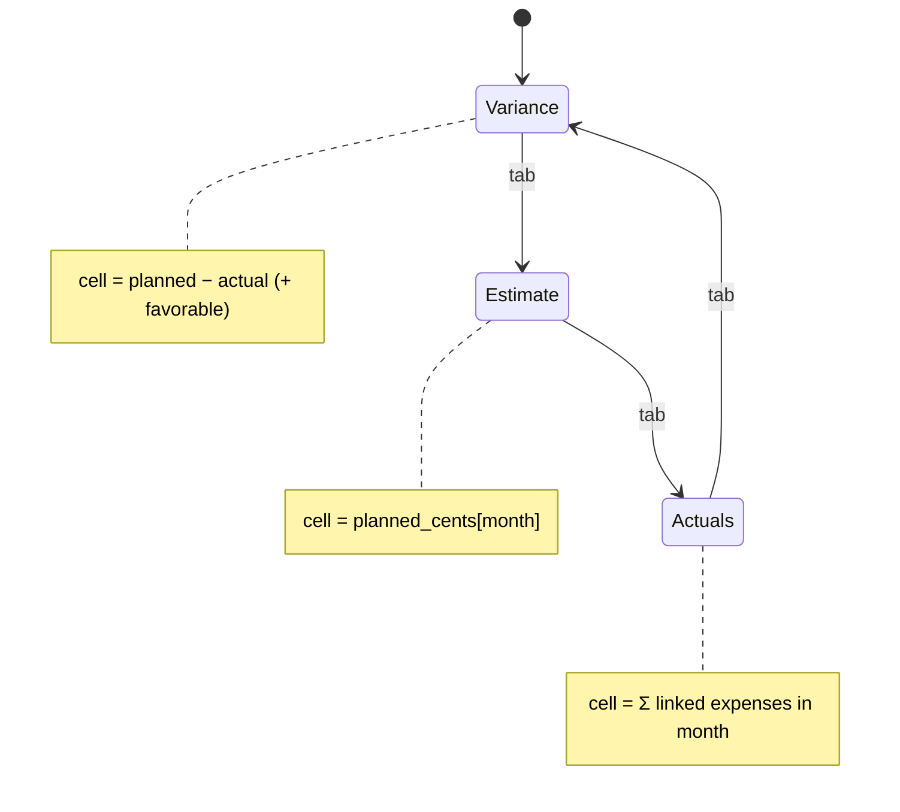
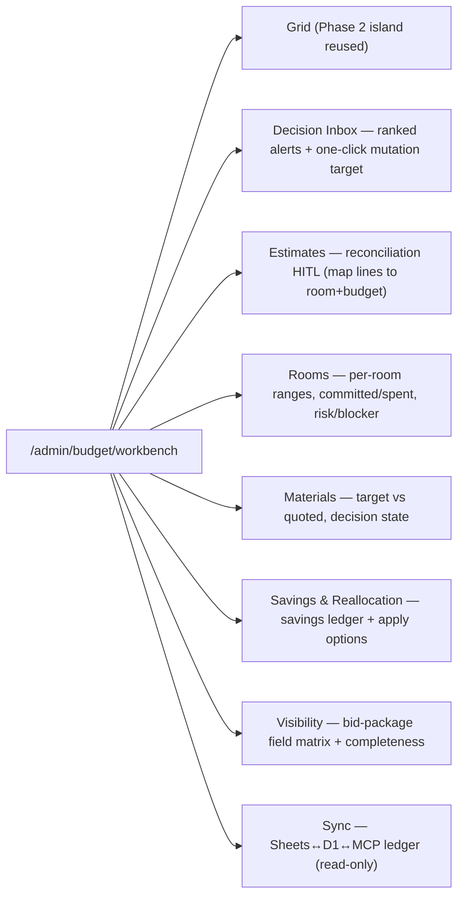
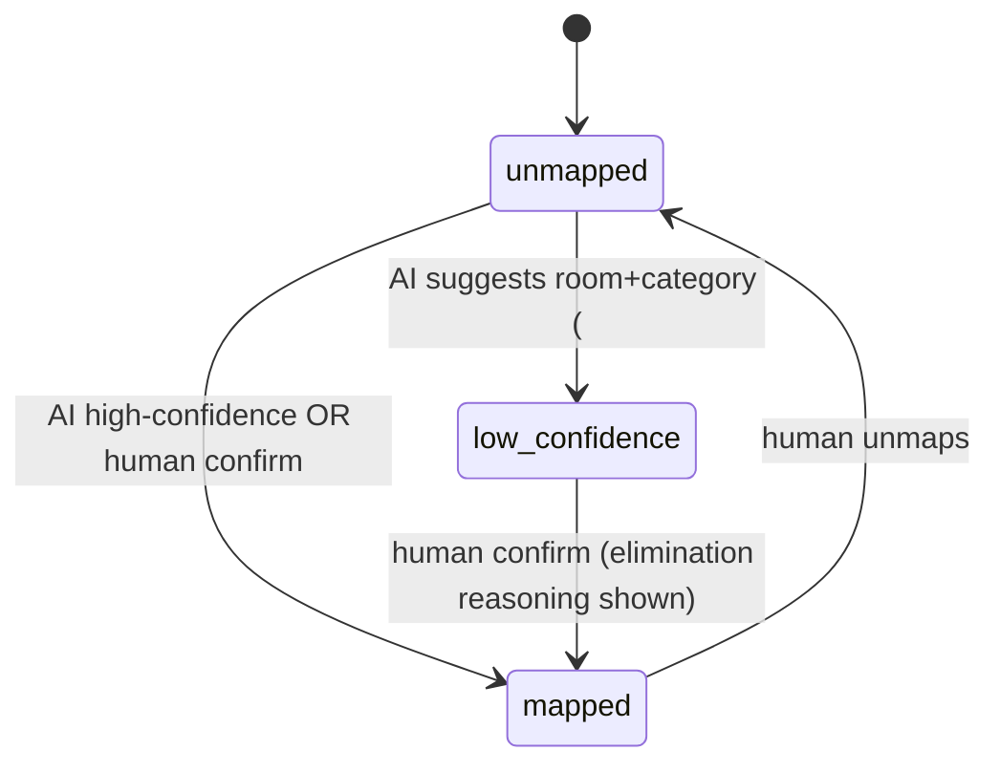

# 0035 — DESIGN SPEC: Budget Grid + Workbench

Source of truth for visual + interaction parity: the Claude-Design project `f89ef0fb` —
`RemodelBudgetGrid.dc.html` (the grid, Phase 2) and `BudgetWorkbench.dc.html` (the command center, Phase 8),
both dark-theme Geist/Geist-Mono, oklch tokens. This spec is the hand-off both Claude AI Design and the coding
agent build against. Production must use the repo's shadcn/Base-UI primitives and dark Monolith tokens — the
`.dc.html` inline styles are the *reference*, not the shipped CSS.

## A. Grid — `RemodelBudgetGrid` (Phase 2)

### A.1 Anatomy

### A.2 Row model
- **Phase row** (bold): caret (expand), phase name, **progress ring** (tone emerald/amber/danger) + `NN%`,
  then per-month phase totals. Click caret → toggle expand. Search auto-expands matches.
- **Line row** (muted, left-border indent): line label, optional **variance badge** `±NN%` with icon
  (triangle=critical/destructive, check=favorable/success, info=watch/warning) and a hover note; per-month cells.
- **Cell**: right-aligned tabular-nums. Estimate/Actuals → `$1,234`, zero = faint `$0`. Variance → `+$1,234`
  (emerald) / `($1,234)` (danger) / `—` (zero). Last month column tinted.
- **Footer rows** (2): Estimate/Actuals view → "Available budget" (funding − cumulative net, per month) +
  "Net burn" (−month total). Variance view → "Cumulative variance" + "Monthly variance".

### A.3 View state machine

### A.4 Interactions (production)
- **Inline plan edit** — click a planned cell in Estimate view → `CurrencyInput` popover → `PATCH
  /api/budget/plan-schedule` `{trackId, period, plannedCents, plannedText}`; optimistic, realtime broadcast.
- **Log expense** — header button → dialog (Base UI): item (links to a budget line via `track_id`), amount
  (`CurrencyInput`), date, category, vendor, room → `POST /api/budget-tracker/expenses` with `budgetItemTrackId`.
- **Filters** — search (label contains), phase single-select, month-range stepper (clamps `from`/`to`).
- **Expand/collapse all**, **rows-per-page** (phase count is small; pagination is cosmetic parity).
- **Density** comfortable|compact (row padding), **month window** default Feb–Jun 2026 (derive from data range).
- Empty states: no phases → "No budget phases yet" + link to config; item with no schedule → seed spread on first
  view (or a "Distribute estimate" affordance).

### A.5 Tokens / parity
- Colors: emerald `oklch(.72 .15 162)`, amber `oklch(.79 .15 78)`, danger `oklch(.7 .19 22)`; map to existing
  Monolith CSS vars (`--emerald`/`--warn`/`--danger` analogues already in the app).
- Fonts: Geist / Geist Mono (numbers). Tabular-nums on every figure. Progress ring = SVG dasharray 50.2655.
- Must match `studio.astro` shell: `<main class="container mx-auto px-4 py-8 pb-12">`, `mb-8` header with a
  `size-6` lucide icon (wallet/bar-chart) + muted description, island `client:only="react"`.

## B. Workbench — `BudgetWorkbench` (Phase 8)

A single command center at `/admin/budget/workbench` hosting the grid plus the procurement surfaces. Tabs:

### B.1 Decision inbox (Phase 4)
Alert card: severity dot (high/med/low), title, detail, entity chip, primary action button whose `target`
routes into the relevant surface (`rooms#id/budget`, `estimates#id/reconcile`, `summary/contingency`,
`materials#id`, `visibility/preview`). Alerts are **derived**, not authored — recomputed each load.

### B.2 Estimate reconciliation HITL (Phase 3)

Staging table: line description, amount, AI `suggestedRoom`/`suggestedCategory` + confidence, ranked candidate
rooms with the evidence that supports/eliminates each (ambiguous-parent doctrine). Confirm writes `room_id` +
`budget_item_track_id` + `mapping_status='mapped'`. Nothing enters a budget item unconfirmed.

### B.3 Rooms / Materials / Savings / Visibility / Sync
- **Rooms**: range low/high (from linked budget items), committed, spent, estimate count, open materials,
  risk + blocker chip. Row → room budget drill-in.
- **Materials**: name, room, target vs quoted, price posture (under/on/over), decision state
  (undecided/selected_not_purchased/selected_over_target/purchased). Reads material schedule + price obs.
- **Savings**: entries (item, budgeted, paid, saved, note) + reallocation options (apply → funding movement).
- **Visibility**: field matrix public/conditional/private + `show_budget_ranges` toggle + completeness % and
  blocker list; reuses `bid_portfolios`. Never expose committed/spent/contingency/AI flags externally.
- **Sync**: read-only ledger rows (source, channel, entity, detail, status, actor, at) over
  `google_sheet_sync_events`; conflict rows highlighted.

## C. Accessibility & responsive
- Grid horizontally scrolls inside its own `overflow-x:auto`; body never scrolls sideways.
- All buttons keyboard-focusable; variance badges carry `title`/`aria-label` (color is not the only signal —
  icon + sign text back it). Progress ring has an accessible label (`NN% of allocation spent`).
- Contrast AA on dark; tabular-nums for alignment; respects reduced-motion (ring/fade animations gated).
