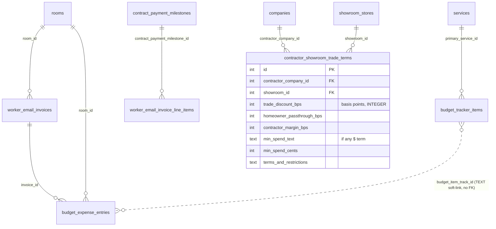

# 0035 — Budget / Procurement Graph (targeted links, no redundancy)

**Slug:** `budget-procurement-graph`
**Status:** PLAN — awaiting approval. Grounded in a read-only audit of the ACTUAL schema; a schema-only
proposal (Gemini) was ~half redundant and is filtered out below.

> **Why this is small.** The pasted "wire everything" migration proposed ~15 FK adds. Reading the real
> schema: **~7 already exist** under other names, **4 target the wrong column**, and **2 are gated on an
> architectural decision**. Only **~6 links + 1 new feature table** are genuinely missing and sound. We add
> exactly those. (Raw `ALTER…REFERENCES` + `PRAGMA foreign_keys=ON` from the proposal are both forbidden
> here — Drizzle-only; PRAGMA is a D1 no-op.)

---

## 1. Two findings that constrain everything

### Finding A — `budget_tracker_items` is revision-chained → never FK its `id`
Every edit inserts a NEW row (new `id`, same `track_id`) and deactivates the old. An FK to `id` **dangles on
the next edit**. The repo already solved this: `budget_item_material_mappings` references the stable
**`budget_item_track_id` TEXT** column with **no FK**. So every `budget_tracker_item_id → budget_tracker_items`
link the proposal wanted is **wrong-target** — re-spec as a `budget_item_track_id` TEXT column (no FK),
matching the existing pattern.

### Finding B — `companies` vs `estimate_companies` are two unlinked contractor tables
`companies` (directory, `business_type_id`) and `estimate_companies` (used by `estimates.estimate_company_id`
and `contracts.estimate_company_id`) both model a contractor/vendor, with no link between them. Bolting a
second `contractor_company_id → companies` onto estimates/contracts (which already link a contractor via
`estimate_company_id`) creates **dual sources of truth**. **DECISION REQUIRED (gates the contractor links):**
unify onto one contractor table (recommend `companies` as canonical + migrate `estimate_companies` refs, or a
bridge), before adding any new contractor FK.

---

## 2. Verdict matrix (what we DO vs DROP)

| Proposed | Verdict | Reason / correct shape |
|---|---|---|
| `showroom_product_mappings.canonical_product_id` / `canonical_showroom_id` | **DROP — redundant** | already has `showroom_id`→showroom_stores + `product_id`→products (both notNull). |
| `bid_portfolios.contractor_company_id` | **DROP — redundant** | already has `company_id`→companies. |
| `worker_email_invoices.floor_id` | **DROP — derivable** | `rooms.floor_id`→floors exists; add `room_id`, JOIN for floor (no denormalized parent). |
| `estimates.contractor_company_id` / `contracts.contractor_company_id` | **GATED (Finding B)** | contractor already via `estimate_company_id`; resolve the two-table split first. |
| `bid_portfolios` / `estimates` / `contracts` / `budget_expense_entries` `budget_tracker_item_id` | **RE-SPEC (Finding A)** | use `budget_item_track_id` TEXT, no FK. |
| **NEW `contractor_showroom_trade_terms`** | **BUILD — new feature** | no per-(contractor,showroom) trade-term table exists. |
| `worker_email_invoice_line_items.contract_payment_milestone_id` → contract_payment_milestones | **BUILD** | stable PK; labor-draw reconciliation is genuinely missing. |
| `worker_email_invoices.room_id` → rooms | **BUILD** | missing; sound. |
| `budget_tracker_items.primary_service_id` → services | **BUILD** | missing; on-row (re-copied per revision, OK). |
| `budget_tracker_items.primary_contractor_company_id` | **BUILD after Finding B** | target = whichever contractor table wins. |
| `budget_expense_entries.room_id` → rooms; `.invoice_id` → worker_email_invoices; `.budget_item_track_id` TEXT | **BUILD** | replaces loose `source_type`/`source_ref`/`vendor_name` text links. |

---

## 3. Target graph (only the BUILD items)

### `contractor_showroom_trade_terms` — the one new feature
Tracks the trade-discount economics between a contractor/designer and a showroom, and how much passes through
to the homeowner. **Compliance:** percentages as **INTEGER basis points** (not float); any dollar term as
**text + cents** (per the currency rule); `UNIQUE(contractor_company_id, showroom_id)`; the contractor FK
target depends on Finding B.

---

## 4. Rollout
- **Phase 0 — DECISION:** resolve `companies` vs `estimate_companies` (Finding B). Blocks only the contractor
  links; everything else proceeds.
- **Phase A — additive links (safe, mostly new nullable columns):** `worker_email_invoices.room_id`;
  `worker_email_invoice_line_items.contract_payment_milestone_id`; `budget_expense_entries.room_id` +
  `invoice_id` + `budget_item_track_id`; `budget_tracker_items.primary_service_id`. Backfill from existing loose
  text links (`source_ref`, `vendor_name`) where a confident match exists — flag ambiguous, never guess.
- **Phase B — new feature:** `contractor_showroom_trade_terms` table + CRUD + admin UI; wire the contractor FK
  per Phase-0's decision + `budget_tracker_items.primary_contractor_company_id`.
- **Phase C — (optional) contractor unification** per Finding B, if the decision is to merge the two tables
  (expand/contract migration).

## 5. Compliance & guardrails
- **Never FK `budget_tracker_items.id`** — use `budget_item_track_id` TEXT (Finding A).
- Trade-term pct = basis points; money = text+cents; no denormalized `floor_id` (JOIN via room).
- No fabricated data; backfill only confident text-link matches, flag the rest.
- D1 `db.batch` not `db.transaction`; Drizzle migrations only; FK-adds = rebuild → back up + validate + read SQL.

## 6. Verification
Each new link: orphan-validated, generated SQL rebuilds only the target, rows preserved, reader 200. Trade-term
table: CRUD round-trips; pct stored as bps; a sample passthrough computes correctly against a product price.

## 7. Explicitly NOT doing
The redundant adds (§2 DROP rows); any FK onto the revisioned `budget_tracker_items.id`; a second contractor
table before Finding B is decided; raw SQL / PRAGMA.
