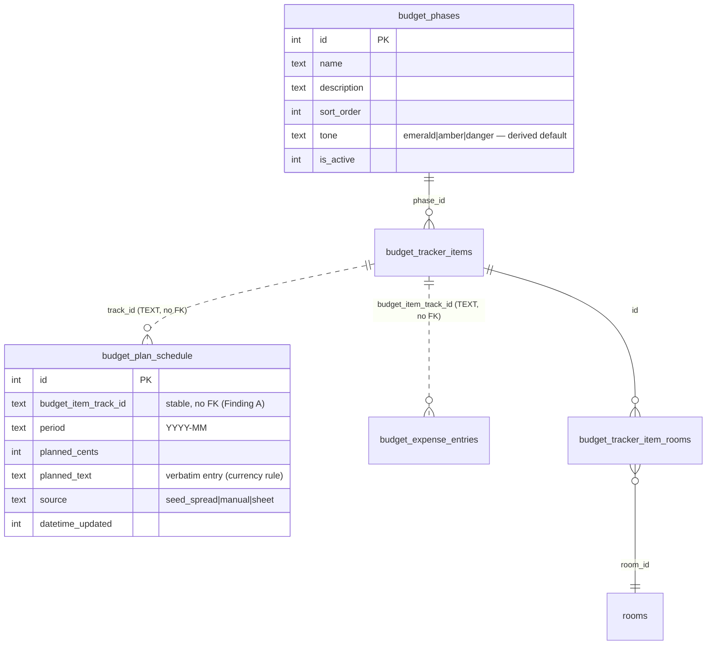

# 0035 — Budget & Procurement: Time-phased Grid + Workbench

**Slug:** `budget-procurement-graph` · **Status:** PLAN — awaiting approval.

This plan is the **umbrella** for the budget program. It absorbs the original 0035 "targeted FK links"
work as **Phase S (substrate)** — those links are prerequisites — and stacks the two things the user asked
for on top:

- **Grid** (Phases 0–2) — implement `RemodelBudgetGrid.dc.html`: a phase → line-item, **time-phased
  (monthly)** budget grid with Estimate / Actuals / Variance views, scorecards, per-phase progress, per-line
  variance flags, and footer rollups.
- **Workbench** (Phases 3–8) — the full `BudgetWorkbench` command center from the design project: estimate
  reconciliation (HITL), decision inbox, room finances, savings & reallocation, services/labor/trade-terms,
  bid visibility, and the sync ledger.

> Decisions locked with the user: **(1) full monthly time-phasing** (real plan schedule, not plan-as-total),
> **(2) build Grid AND Workbench** (grid first, workbench stacked).

---

## 1. What already exists (audited, do not rebuild)

```mermaid
flowchart TB
  subgraph LIVE["Live tracker model (the one MCP + /api/budget-tracker use)"]
    BTI["budget_tracker_items<br/>revision-chained, stable track_id<br/>execution_class, item_type, est_low/high_cents"]
    BTR["budget_tracker_item_rooms<br/>M:N to rooms (FK to ROW id)"]
    BEE["budget_expense_entries<br/>actuals — attributed by category text only"]
    BFA["budget_funding_accounts"]
    BIMM["budget_item_material_mappings<br/>track_id TEXT (no FK) -> material_schedule_items"]
  end
  subgraph SUB["Procurement substrate (exists, rich)"]
    EST["estimates / estimate_revisions / estimate_line_items<br/>estimate_room_mappings (revision-level)"]
    INV["worker_email_invoices / _line_items<br/>line match_status + material/service/product FKs"]
    CON["contracts / contract_payment_milestones"]
    SVC["services (flat catalog)"]
    BID["bid_portfolios + room_configs (per-section booleans, token share)"]
    WISH["wishlist_items"]
    SCN["remodel_scenarios (text-UUID id)"]
  end
  BTI --- BTR --- rooms
  BTI --- BIMM --- MSI["material_schedule_items"] --- products
  BEE -. "category text only, NO item link" .- BTI
  classDef gap fill:#3a1d1d,stroke:#f87171
  classDef ok fill:#1f4d2e,stroke:#4ade80
  class BTI,BTR,BEE,BFA,BIMM,EST,INV,CON,SVC,BID,WISH,SCN ok
```

**Frontend already shipped:** `/admin/budget/{tracker,dashboard,reconciliation,truth-table}` +
room-scoped `budget-table.tsx`, `BudgetCharts.tsx`, `BudgetSignals.tsx`. Reusable primitives present:
`CurrencyInput`, `MultipleSelector`, `ComboboxWithOther`, `ConfigShell`.

## 2. The gaps the design needs (what we build)

```mermaid
flowchart LR
  subgraph NEW["New schema"]
    PH["budget_phases (def table)<br/>+ budget_tracker_items.phase_id"]
    SCHED["budget_plan_schedule<br/>(item_track_id TEXT, period 'YYYY-MM', planned_cents)"]
    ELINK["budget_expense_entries.budget_item_track_id TEXT<br/>(= Phase S) -> actuals bucket by month"]
    ELMAP["estimate_line_items: + room_id, budget_item_track_id,<br/>mapping_status, ai_suggested_room_id/category, confidence"]
    SAV["budget_savings_entries + reallocation decisions"]
    VNOTE["budget_tracker_items: variance note (md+html)"]
  end
  subgraph COMPUTE["New compute (no table)"]
    GRID["/api/budget/grid — phase->item, monthly plan/actual/variance"]
    INBOX["/api/budget/inbox — derived alerts"]
    LABOR["labor/trade rollup from expenses+estimates x services"]
  end
  classDef n fill:#1e293b,stroke:#60a5fa
  class PH,SCHED,ELINK,ELMAP,SAV,VNOTE,GRID,INBOX,LABOR n
```

| Design element | Backing today | Action |
|---|---|---|
| Phase grouping | none on budget items | **NEW** `budget_phases` def + `phase_id` FK |
| Monthly plan per line | none | **NEW** `budget_plan_schedule` (track_id, period, planned_cents) |
| Actuals per line | expenses by category only | **NEW** `expense.budget_item_track_id` (Phase S A4) + bucket by `date_incurred` |
| Per-line variance flag/note | none | **NEW** derive type from variance %, store optional authored note (md+html) |
| Estimate line HITL mapping | line has only `service_id` | **NEW** columns on `estimate_line_items` + reconcile route + AI suggest |
| Decision inbox alerts | none | **NEW** compute endpoint (over-range, contingency, drift, unmapped, product-over-target, shareability) |
| Room finances (committed/spent/risk) | estimates-by-room in report | rollup once actuals link exists |
| Services tab | `services` catalog + `item_type='professional_service'` supported | reuse — filtered budget items, phased |
| Labor/trade rollup | `trade_data` catalog only | compute endpoint |
| Savings & reallocation | `get_reallocation_options` (compute only) | **NEW** savings table + persist applied reallocations |
| Bid visibility matrix | `bid_portfolios` per-section booleans | reuse + present as public/conditional/private |
| Sync ledger | `google_sheet_sync_events` + appsscript pull/push | read-only surface |

## 3. Data model — the grid core

- **Phase is a vocabulary** → `budget_phases` definition table + admin config page
  `/admin/config/budget/phases` (ConfigShell). `budget_tracker_items.phase_id` is a single-select FK
  (`ComboboxWithOther`, "Other" mints a phase).
- **Never FK `budget_tracker_items.id`.** `budget_plan_schedule` and the expense link both key on the stable
  **`track_id` TEXT** — same pattern as `budget_item_material_mappings`.
- **Currency rule.** Inline-editable planned cells store **both** `planned_cents` and `planned_text`.
- **UNIQUE**(`budget_item_track_id`, `period`) on the schedule; chunk seed inserts so (rows × bound-columns) ≤ 100 (D1 param cap) — for the 7-column plan-schedule that is ≤14 rows per statement, or emit one single-row INSERT per row via db.batch (the pattern Phase 1 actually ships).

### Grid math (mirrors `support.js` exactly)
- `estimate[i]` = `planned_cents` for month i · `actual[i]` = Σ linked expenses in month i · `variance[i] =
  estimate[i] − actual[i]` (+ = favorable/under).
- Phase row = Σ its line rows per month. Footer: **available budget** = funding − cumulative net; **net burn**
  = −Σ month; variance view footer = cumulative + monthly variance.
- Scorecards (whole project): total budget, spent-to-date (+% used bar), remaining (on-track/over), variance
  vs estimate (%). Progress ring per phase = spent / allocation.

## 4. Phase-by-phase rollout

```mermaid
flowchart TD
  S["Phase S — substrate FK links<br/>(original 0035: expense.track_id, invoice.room_id,<br/>line->milestone, tracker.primary_service_id, trade-terms)"]
  P0["Phase 0 — time-phasing foundations<br/>budget_phases, plan_schedule, variance note, seed/backfill"]
  P1["Phase 1 — Grid API + MCP get_budget_grid"]
  P2["Phase 2 — Grid UI /admin/budget/grid (impeccable)"]
  P3["Phase 3 — Estimate reconciliation HITL"]
  P4["Phase 4 — Decision inbox + room finances"]
  P5["Phase 5 — Savings & reallocation"]
  P6["Phase 6 — Services / labor / trade-terms"]
  P7["Phase 7 — Bid visibility + sync ledger surface"]
  P8["Phase 8 — Workbench shell /admin/budget/workbench"]
  S --> P0 --> P1 --> P2
  P0 --> P3 --> P4
  P2 --> P8
  P4 --> P8
  P5 --> P8
  P6 --> P8
  P7 --> P8
  S --> P6
  classDef done fill:#1f4d2e,stroke:#4ade80
  classDef grid fill:#1e3a5f,stroke:#60a5fa
  classDef wb fill:#3a2d1d,stroke:#f0b429
  class S,P0 done
  class P1,P2 grid
  class P3,P4,P5,P6,P7,P8 wb
```

**Phase S — substrate (prerequisite).** The original 0035 targeted links. Load-bearing for the grid+workbench:
`budget_expense_entries.budget_item_track_id` (actuals→item), `worker_email_invoices.room_id`,
`worker_email_invoice_line_items.contract_payment_milestone_id`, `budget_tracker_items.primary_service_id`,
`budget_expense_entries.room_id`+`invoice_id`, and the `contractor_showroom_trade_terms` table. Guardrails
unchanged (Finding A: never FK the revisioned `id`; Finding B: resolve `companies` vs `estimate_companies`
before any contractor FK; bps for pct; text+cents for money; Drizzle-only; backup+validate FK rebuilds).

**Phase 0 — time-phasing foundations (schema + seed).**
- `budget_phases` def table + config page; `budget_tracker_items.phase_id`.
- `budget_plan_schedule` table.
- Variance-note fields on items (`variance_note_markdown`/`_html`).
- Contingency: a reserved `budget_funding_accounts` row (`account_key='contingency'`) — no new table.
- **Seed job (idempotent):** for each active item with an estimate, spread the estimate midpoint across the
  item's active months → `planned_cents` rows (`source='seed_spread'`). Attribute existing expenses to items
  by a confident category/vendor match → set `budget_item_track_id`; flag ambiguous, never guess.

**Phase 1 — Grid API + MCP.** `GET /api/budget/grid?view=&from=&to=&phase=&q=` returns the exact shape the UI
needs (phases[], each with progress + monthly cells; footer rollups; scorecards). MCP `get_budget_grid` read
tool. PATCH `/api/budget/plan-schedule` for inline plan edits. QC script.

**Phase 2 — Grid UI (impeccable).** `/admin/budget/grid` thin Astro shell (studio.astro pattern) + `BudgetGridApp`
island rebuilt from `RemodelBudgetGrid.dc.html`. Inline monthly plan edit via `CurrencyInput`; "Log expense"
→ `record_expense` with item link; expand/collapse, search, phase filter, month-range, Estimate/Actuals/Variance
tabs. Live via existing `/api/budget-tracker/realtime`.

**Phase 3 — Estimate reconciliation HITL.** Add to `estimate_line_items`: `room_id` (nullable FK),
`budget_item_track_id` TEXT, `mapping_status` (unmapped|mapped|low_confidence), `ai_suggested_room_id`,
`ai_suggested_category`, `mapping_confidence` real. Reconcile route + AI suggest (structured output, **return
ids** validated against live rooms/categories). Staging/HITL UI (elimination reasoning, confirm in UI or MCP —
per the ambiguous-parent doctrine). Mount the currently-unwired `csv-ingestion.ts` if reused.

**Phase 4 — Decision inbox + room finances.** `GET /api/budget/inbox` derives ranked alerts
(unmapped_estimate, over_range, contingency, product_over_target, low_confidence_mapping, room_drift,
shareability_risk) with `{severity, entity, action, mutation, target}`. Room finance rollup
(committed/spent/risk/blocker per room) now that actuals link to items.

**Phase 5 — Savings & reallocation.** `budget_savings_entries` (budget_item_track_id TEXT no-FK — never the revisioned id; room_id FK, budgeted_cents, paid_cents,
saved_cents, note md+html). Reallocation: reuse `get_reallocation_options`; persist an applied decision as a
funding movement (contingency top-up / room offset). UI panel.

**Phase 6 — Services / labor / trade-terms.** Services tab = budget items `item_type='professional_service'`,
phased (fee_type, quoted, paid, status). Labor/trade rollup compute endpoint (expenses+estimate lines × service
category × contractor). Surface `contractor_showroom_trade_terms` (from Phase S) with a passthrough calculator.

**Phase 7 — Bid visibility + sync ledger.** Reuse `bid_portfolios`; present field visibility as
public/conditional/private (map from the per-section booleans + `show_budget_ranges`), completeness + blockers.
Read-only sync-history panel over `google_sheet_sync_events`.

**Phase 8 — Workbench shell.** `/admin/budget/workbench` command center assembling the tabs (Grid, Inbox,
Estimates, Rooms, Materials, Savings, Visibility, Sync) into one page, matching `BudgetWorkbench.dc.html`.

## 5. Mandatory compliance scan (currency / multi-select)

| Data point | Layer status | Action |
|---|---|---|
| `budget_plan_schedule.planned` | inline-entered money | **text+cents** + `CurrencyInput` |
| `budget_savings_entries.*_cents` | entered money | **text+cents** |
| variance note, savings note | user rich text | **markdown+html** (PlateJS), sanitize html |
| budget **phases** | vocabulary | **def table** + config page + `ComboboxWithOther` |
| expense **category** (free text today) | vocabulary, currently text | **FLAG** — recommend def table `budget_categories`; optional in P4, decide with user |
| estimate-line AI category | model output | **return id** against live vocab, validate before insert |
| trade-term pct | already bps | keep bps |

## 6. Guardrails (repo law)
- Never FK `budget_tracker_items.id` (revision-chained) — attach on stable `track_id` TEXT.
- Finding B gates all contractor FKs — resolve `companies` vs `estimate_companies` first.
- D1: `db.batch` not `db.transaction`; chunk unbounded inserts by (rows × columns) ≤ 100, NOT a fixed 20 (20×7-cols = 140 params, over the cap) — chunkSize = floor(100 / columnCount), or one single-row INSERT per row in db.batch; FK rebuild = backup → validate
  orphans → read generated SQL before `migrate:remote`.
- No denormalized `*_name`/`floor_id` — JOIN via FK.
- AI calls: structured output + JSON schema; never degrade a failed parse to `{}`; return ids not names.
- No fabricated seed data — seed plan from real estimates, flag ambiguous expense attributions.

## 7. Verification (per phase)
Each phase ships `scripts/qc/pr_<n>.mjs` run against **preview AND prod**, a changelog entry with the QC output
+ remote-migration status, and (schema phases) an ERD in the changelog `diagrams[]`. Grid QC asserts the
aggregation matches a hand-computed fixture; reconciliation QC round-trips a mapping through the HITL confirm.

## 8. Explicitly NOT doing (now)
- No Google-Sheets bi-directional write changes (read the ledger only).
- No contractor-table unification unless Phase-0/Finding-B decides to (kept optional).
- No new payment/transfer execution — money movement is planning-only (reallocation = re-tagging funding).
