# 0036 — Phase-Grouped Task/Changelog UX (one shared grid)

**Slug:** `phase-grouped-task-ux`
**Status:** PLAN — awaiting approval. **Has a DESIGN_SPEC** (`DESIGN_SPEC.md`) — real frontend.

## 1. Problem / goal
Task lists render inconsistently across the changelog surfaces. The **preview** changelog got phase-grouping
(#269) but not the rich grid the owner wants (expandable subtasks, assignee avatars, status/priority badges,
filters, tabs, pagination). The **committed** changelog uses a *separate* `changes[]` shape — not phase-grouped
tasks at all. The `/admin/plans` board is a third rendering.

**Goal:** ONE canonical **`<PhaseGroupedTaskGrid>`** component, backed by **one data source** (`plan_tasks`
grouped by `phase`), used by **every** changelist surface — proposed (preview) AND committed AND the plans
board — differing only by a lifecycle filter. Reference design: the owner's `TaskManagementGrid` component,
adapted to the repo's shadcn/Monolith primitives.

## 2. Key insight — same data, two lifecycle views

```mermaid
flowchart LR
    PT[("plan_tasks<br/>phase · status · priority · assignee · sortOrder")]
    PT --> G["&lt;PhaseGroupedTaskGrid&gt;<br/>group by phase · expand subtasks · badges · filters"]
    G --> PV["Preview changelog<br/>(proposed: pending/in_progress)"]
    G --> CV["Committed changelog detail<br/>(shipped: done/PR-linked)"]
    G --> PB["/admin/plans board"]
    classDef ok fill:#1f4d2e,stroke:#4ade80
    class G ok
```



The preview shows pending work; the committed changelog shows the SAME tasks once `done`/PR-linked; the plans
board shows all. No duplicate task model — the committed changelog's `changes[]` stays for prose/migrations, but
the **task list** everywhere is `plan_tasks` grouped by phase.

## 3. Data structures (the "setup appropriately" part)

```mermaid
erDiagram
    plans ||--o{ plan_phases : "plan_slug"
    plans ||--o{ plan_tasks : "plan_slug"
    plan_tasks ||--o{ plan_tasks : "parent_task_key (NEW — subtasks)"
    changelog_entries }o--|| plans : "plan_slug (NEW link)"
    plan_phases { text plan_slug; int phase; text title; int sort_order }
    plan_tasks { text plan_slug; text task_key; int phase; text parent_task_key "NEW"; text status; text priority; int assignee_participant_id; int sort_order }
```

Three additive changes — all backward-compatible:
1. **`plan_tasks.parent_task_key`** (nullable, self-ref within `plan_slug` by `task_key`) — enables the
   reference's expandable **subtasks**. A task with children renders a disclosure chevron; children indent.
2. **`plan_phases`** definition table (`plan_slug`, `phase` ordinal, `title`, `sort_order`;
   `UNIQUE(plan_slug, phase)`) — a durable phase **title** source. Today `phase` is a bare integer and titles
   are passed ad-hoc in each proposal's `phases[]`; persist them so BOTH the proposed and committed views render
   real phase names. `submit_feature_proposal` seeds it from the `phases[]` it already receives.
3. **`changelog_entries.plan_slug`** (nullable FK-by-slug → `plans`) — so a committed entry can render its
   plan's `plan_tasks` in the shared grid. (`changelog_proposals.plan_slug` already exists; entries lacked it.)

No new task model, no denormalized names, no comma-multi-values. `status`/`priority`/`change_type` stay the
existing single-select enums. Assignee resolves `assignee_participant_id → planning_participants → users`
(0034); the grid degrades to initials when no user/avatar.

## 4. Component — `<PhaseGroupedTaskGrid>` (see DESIGN_SPEC)
A shared React island rebuilt from the reference on the repo's shadcn/Monolith primitives (Base UI, NOT Radix;
dark-theme-first; no Unsplash/hardcoded avatars). Props: `{ planSlug, tasks, mode: "proposed"|"committed"|"board", filters? }`.
Renders: phase group headers + counts, parent rows with disclosure, indented subtask rows, `StatusBadge`,
`PriorityBadge`, assignee avatar/initials, workstream/project chip, search + tab (all/active/backlog) filters,
optional pagination. Live-updates via the plan's realtime room (same poke `update_plan_task` already fires).

## 5. Wiring
- **Preview changelog** — `components/changelog/ProposalBundle.tsx` swaps its board for `<PhaseGroupedTaskGrid mode="proposed">`.
- **Committed changelog detail** — `components/changelog/ChangelogEntryView.astro` / `pages/admin/changelog/[slug].astro`
  render `<PhaseGroupedTaskGrid mode="committed">` from the entry's `plan_slug` (done/shipped tasks).
- **Plans board** — `/admin/plans/<slug>` uses the same component (`mode="board"`).
- All three read `GET /api/admin/plans/<slug>` (already phase-grouped) + the realtime poke.

## 6. Rollout
- **A — data structures:** `plan_tasks.parent_task_key`; `plan_phases` table + seed from `submit_feature_proposal`
  `phases[]`; `changelog_entries.plan_slug` + backfill from matching proposals. Migrations additive.
- **B — component:** build `<PhaseGroupedTaskGrid>` per DESIGN_SPEC (states: loading/empty/filtered/error; a11y:
  keyboard disclosure, aria-expanded, focus rings; light+dark). Use Better-Design + shadcn skills.
- **C — wire** all three surfaces; realtime; delete the old bespoke boards.
- **D — (optional, depends on 0034)** real assignee avatars via `users`; subtask authoring UI.

## 7. Compliance & guardrails
- shadcn/Monolith primitives only (Base UI `render=` not Radix `asChild`; `Badge` has no `size`). `shadcn add --dry-run` first.
- No comma-multi-values; status/priority single-select enums. No denormalized names (assignee via join).
- `.astro` shells use `class` not `className`; page shell matches `studio.astro`.

## 8. Verification
Grid renders identical phase groups on preview + committed + board from one component; subtasks expand;
filters/tabs work; live poke updates without refresh; `tsc` delta empty; light+dark screenshots.

## 9. Deferred
Assignee avatars + "my tasks" personalization need 0034 (users). Drag-reorder, saved views — later.
