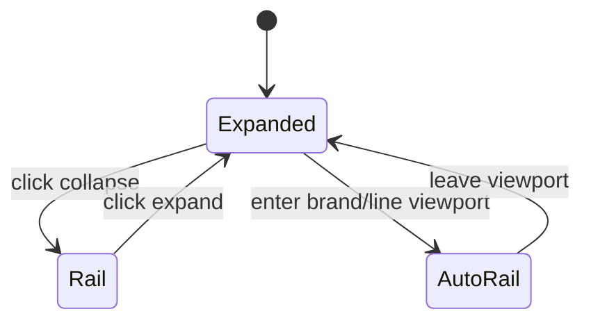
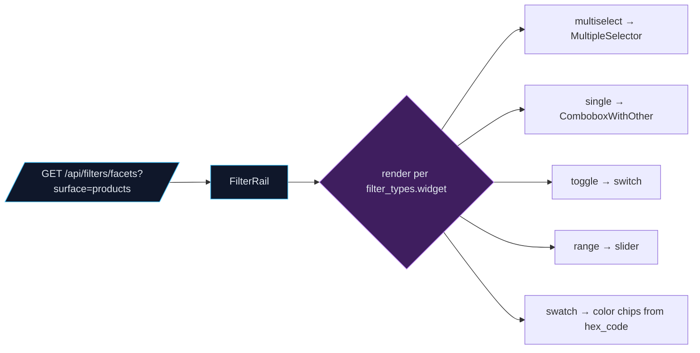
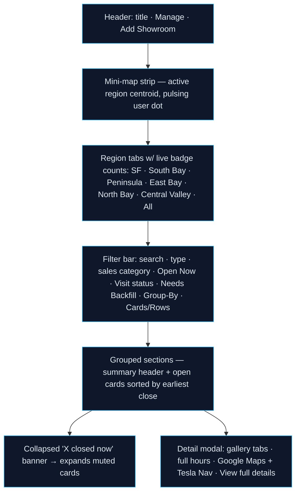
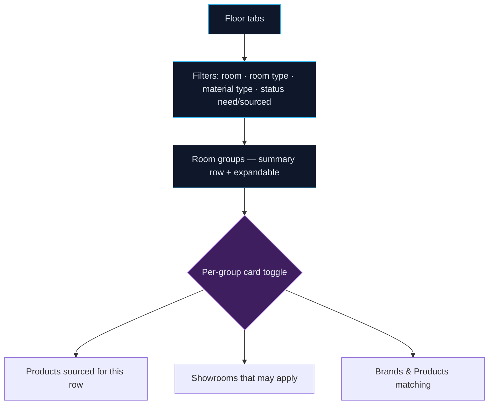
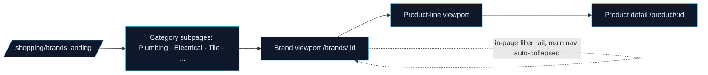
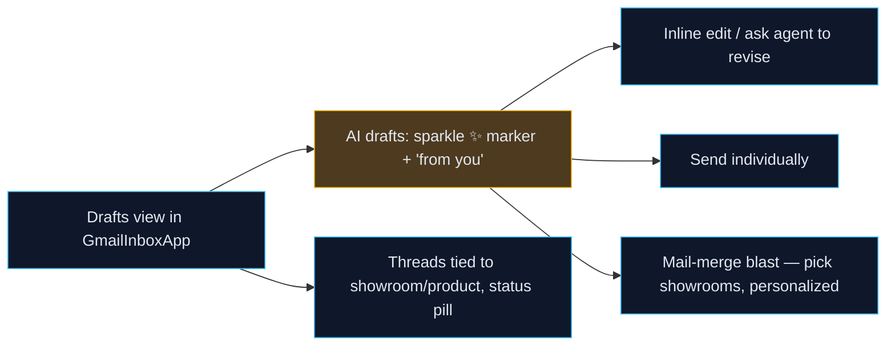

# 0037 — DESIGN_SPEC (Claude AI Design hand-off)

This is the brief **Claude AI Design** builds the frontend from, in parallel with Claude Code
building the backend/infra. Every surface below states its **data contract** (the API/props it
codes against) so design work is decoupled from backend timing. Theme = **Monolith** (dark,
shadcn/Base-UI primitives — buttons take `render={<a/>}` not `asChild`; `Badge` has no `size`).

---

## 0. Global — sidebar shell & collapse

- **Nested nav tree** (see IMPLEMENTATION_PLAN §2). Parents show a chevron; submenus start
  **collapsed**; the active route auto-expands its ancestors. Indent 12px per depth.
- **Label size** up to `text-sm` (from `text-[10px]`). Icons on every item (lucide, `size-4`,
  `text-muted-foreground`).
- **Collapse-to-rail toggle** (top of sidebar): `w-64 ↔ w-14`. Rail shows icons only with
  hover tooltips (name + badge). Persist in `remodel_sidebar_collapsed` cookie. On brand /
  product-line viewports the main sidebar **auto-collapses** to hand the space to an in-page
  filter rail.

---

## 0.5 FilterRail — one config-driven filter component (Phase 1)

Every faceted surface below (Showrooms, Materials, Brands/Products) uses **one** `FilterRail`
component fed by the filter framework — no bespoke filter code per page.

- **Auto-populated:** the rail shows only the facets (types) and values (definitions) actually
  **mapped to the active record set** — grouped by type, ordered by `sort_order`. No empty facets.
- **Widget per type:** `multiselect` (MultipleSelector), `single` (ComboboxWithOther), `toggle`
  (switch), `range` (slider), `swatch` (color chips from `hex_code`). Support "Other" creation
  where the type allows it (writes a new `filter_definition`).
- **Placement:** top filter bar on the table pages; a left **in-page rail** on brand/product-line
  viewports (main sidebar auto-collapsed).
- **Data contract:** `GET /api/filters/facets?surface=<products|showrooms|sale_items>` returns
  `{ types: [{ id,key,label,widget,definitions:[{id,value,hex_code,count}] }] }`. Selecting values
  filters by `filter_definition_id`.

---

## 1. Showrooms — grouped directory (`ShowroomsDirectoryApp` rebuild)

The user supplied a complete reference implementation (regional tabs, geolocation, mini-map,
multi-filter, dynamic grouping, closed-collapse, cards↔rows, Tesla-nav modal). **Use it as the
visual + interaction source of truth**, adapted to real data + Monolith tokens.

**Layout**

- **Regional tabs** auto-select nearest region via `navigator.geolocation` vs Bay-Area centroids
  (graceful SF default), with a subtle "auto-selected by location" notice.
- **Grouping switcher:** Sales Category (default) · Rating · Flagship · Closing Time. Group header
  shows count, distinct types, avg rating, open-now count.
- **Cards:** thumbnail, oversized translucent `$$$` badge, name, star + review count, visit badge,
  open/closed pill with `closesText`. Open stores sorted ascending by `closesAt`. Closed stores
  collapse into a banner (`"3 closed now — Fireclay, …"`) that expands to dimmed cards.
- **Rows view:** compact table (Showroom · Type · Rating · Hours · quick contact tel/website).
- **Modal:** Google-Places vs Your-Photos gallery tabs, weekly-hours disclosure, dual nav
  (`https://www.google.com/maps/dir/?api=1&destination=…` + **Tesla Nav** → `send_vehicle_navigation`),
  footer link to `/admin/shopping/store/:id`.

**Data contract** — `GET /api/showroom-stores` (list w/ type, rating, hours, price point, thumb,
lat/lng, visit status), `GET /api/showroom-stores/catalog/*`, plus **new** sales-category field
per store (compliance C1). Tesla nav via MCP `send_vehicle_navigation`.

---

## 2. Materials — grouped table (`MaterialsScheduleApp` rebuild)

- Group by **room**, tabbed by **floor**. Each room group is a summary row (material count,
  sourced/open, est. spend) that expands.
- **Per-group card toggle** — the differentiator: within a room grouping the user flips what
  cards render: **Products** (what's sourced), **Showrooms** (what might apply), or
  **Brands & Products** (candidates matching the material spec).
- Status chips: `need to source` (amber) / `sourced` (emerald).

**Data contract** — `GET /api/materials` (room, type, status, brand/model, purchased),
`GET /api/materials/:id/match` (spec→product candidates), `/api/showroom-stores`, `/api/brands`.

---

## 3. Brands & Products — ecommerce + runway

**3a Grid (ship first)**

- **Landing:** brand cards using `brands.iconCfImagesUrl` (logo) + a hero from `brand_images`
  (imageKind lifestyle/catalog), price point, rating, product-line count.
- **Brand viewport:** product-line cards, each cycling `brand_images` (imageKind product) with
  price point; brand marketing/lifestyle imagery up top like a magazine spread. **In-page filter
  rail**; main sidebar auto-collapsed.
- **Product-line viewport:** products with `product_images` + price. Same in-page rail.

**3b Runway (follow-up):** the landing becomes an auto-cycling "runway" — brands loop with their
marketing materials (magazine style) above an animated product-line introduction slideshow.
Pause on hover, respects `prefers-reduced-motion`.

**Data contract** — `GET /api/brands` (list: logo, ratings, productCount, types),
`GET /api/brands/:id` (product lines + up-to-24 non-rejected `brand_images` + products w/ imageUrl),
`GET /api/products/browse` (min price + newest image + brand/type facets). Category subpages =
facet-filtered views of the same endpoints.

---

## 4. Shopping Journal — handwritten journal

- Entries laid out as **handwritten notes on paged spreads**; tabbed "pages" the user flips;
  a search bar filters entries. Warm paper texture over the dark shell (or a light "paper" panel
  inside the dark app). Date + location + linked showroom/product chips per entry.
- **Data contract** — `GET /api/shopping-journal` (entries w/ markdown/html, date, links).

---

## 5. Purchase Ops

- **Review dashboard** (`/shopping/review`): stat tiles for pending Price-Card and Product-Photo
  reviews, each linking to its queue. (Reuse existing review pages as the drill-down.)
- **Invoices / Deliveries:** table pages, Monolith styling; light status columns. Schema/props
  finalized in the Phase 4 spec.

---

## 6. Gmail drafts — Concierge outreach in `GmailInboxApp`

- Drafts render like normal Gmail drafts but carry a **sparkle** marker + "AI-drafted" hint.
- **Send individually** or **mail-merge blast** (select showrooms → one personalized send each,
  from the user's Gmail). Confirm modal before any send.
- Threads show their linked showroom/product + a status pill (draft/sent/replied).
- **Data contract** — new `/api/outreach/*` (list drafts, send, blast, status) backed by
  `email_outreach_threads` + Gmail `drafts.*`; the Concierge chat page (assistant-ui) shares it.

---

## 7. Tokens & interaction rules (Monolith)

- Dark theme, rings + dividers (no 1px borders), high-contrast type. Charts/badges use existing
  Monolith palette. Motion: subtle, `prefers-reduced-motion` honored, runway loop pausable.
- Every page follows the mandatory Astro shell (`class` not `className`, `container mx-auto px-4
  py-8 pb-12`, icon + title + description header, one island below).
- Accessibility: keyboard nav for tabs/menus/modals, ARIA on the collapse toggle and gallery tabs,
  WCAG AA contrast.
