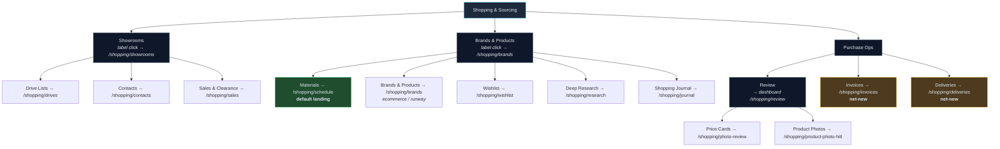
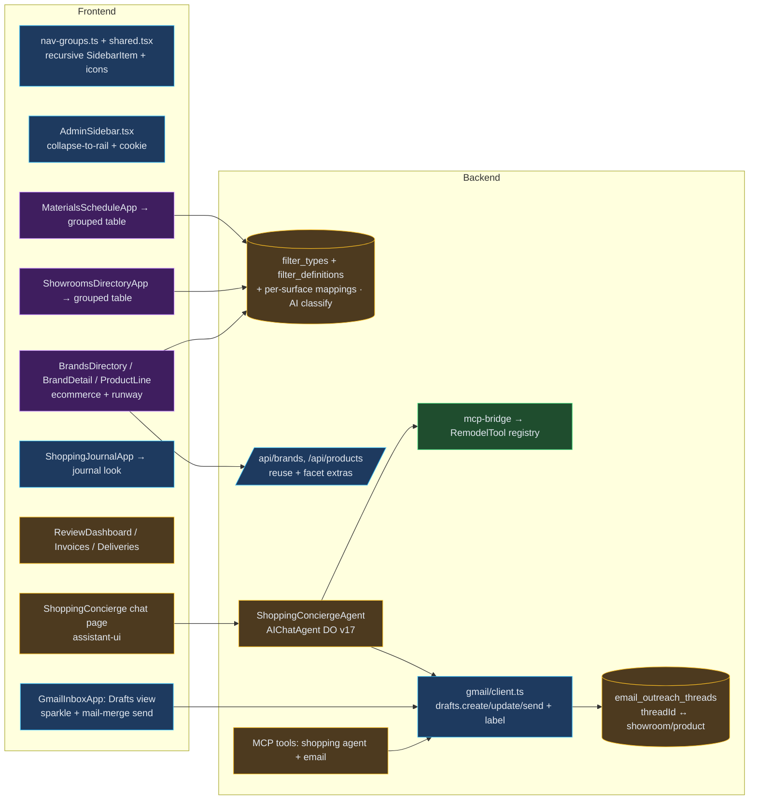
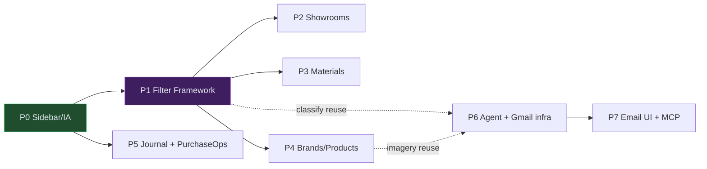
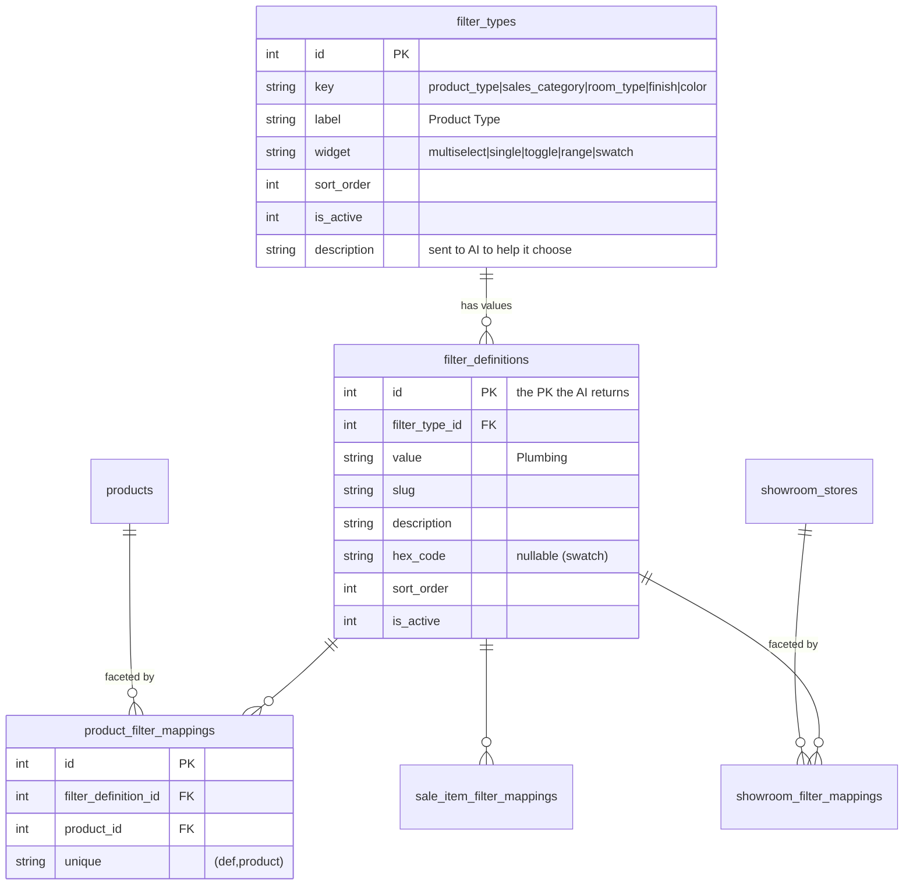
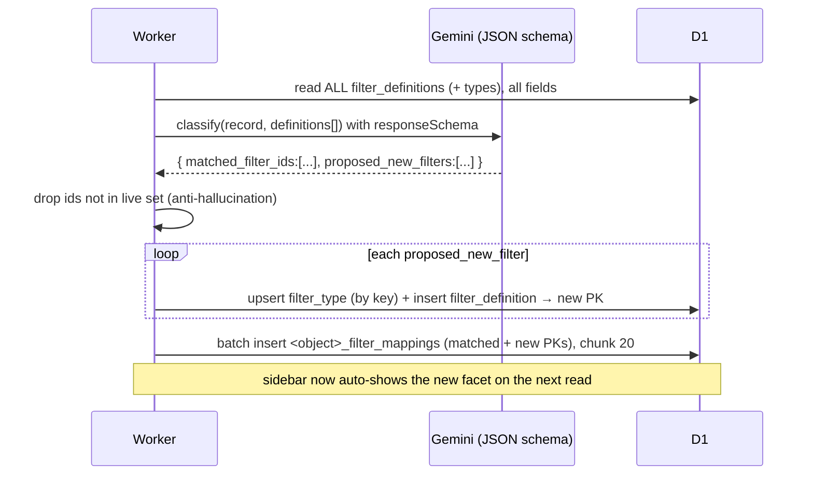
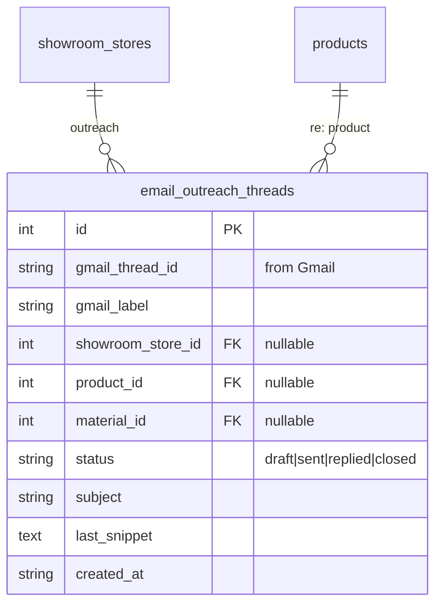

# 0037 — Shopping & Sourcing Refactor + Shopping Concierge Agent

**Status:** planning · **Slug:** `shopping-sourcing-refactor` · **Owner:** Claude Code (infra) + Claude AI Design (frontend, in parallel)
**Preview changelog:** `/admin/changelog/preview/shopping-sourcing-refactor`

---

## 1. Context & problem

The **Shopping & Sourcing** area grew organically into a flat 15-item sidebar with tiny
text and no structure. Two of its core pages (Showrooms, Materials) are dense card lists
that waste screen real-estate. There is no shopping-aware assistant to find sales or draft
vendor outreach.

- **Sidebar** (`src/frontend/components/sidebar/nav-groups.ts:56-77`) — 15 flat links,
  `text-[10px]` labels, no grouping, no icons, **no submenu model** (`SidebarItem` in
  `shared.tsx:12` is strictly `{ href, label, badgeCount? }`), and **no collapse-to-rail**
  anywhere in the app (`AdminSidebar.tsx:223` is a hardcoded `w-64`).
- **Showrooms** (`ShowroomsDirectoryApp.tsx`, 2631 lines) — 3 card views (map/list/directory).
  The user wants a single grouped **table/card hybrid** with regional tabs, geolocation
  auto-select, a mini-map header, multi-filter, dynamic grouping, and a Tesla-nav modal.
- **Materials** (`MaterialsScheduleApp.tsx`, cards grouped by room) — wants a grouped table
  with floor tabs, room/type/status filters, and per-row toggles to show sourced products /
  applicable showrooms / matching brands+products.
- **Brands & Products** — no proper ecommerce surface. But the imagery is already scraped:
  `brand_images.imageKind` ∈ {logo, product, lifestyle, catalog}, `brand_product_lines`,
  `product_images`. `GET /api/brands/:id` already returns product lines + images.
- **No shopping agent.** The user wants a concierge that knows the wishlist / brands /
  materials / budget / style, finds sales, and drafts quote-request emails to showrooms —
  surfaced both as an in-app chat page **and** as MCP tools.

### Goals

1. Restructure the shopping sidebar into a 3-group nested tree, larger text, icons, and a
   **collapse-to-rail** toggle for the whole sidebar.
2. Rebuild **Showrooms** and **Materials** as grouped, space-efficient tables (design hand-off
   to Claude AI Design).
3. Build a **Brands & Products** ecommerce surface (grid first, animated "runway" as a
   follow-up phase) with brand → product-line → product drill-down and in-page filter rails.
4. Polish **Shopping Journal** (handwritten-journal look) and add a **Purchase Ops** group
   (Review dashboard, Invoices, Deliveries).
5. Ship a **Shopping Concierge** agent (Agents-SDK chat DO) + Gmail draft/label/thread-tracking
   infrastructure, with drafts surfaced inside the existing Gmail inbox component (sparkle-marked),
   individual + mail-merge send, and MCP parity.

### Non-goals

- Rescraping brand/product imagery (already present; we consume it).
- Auto-sending email without the user in the loop (see §7 — draft-first, explicit send).
- Replacing the drives/contacts/sales pages (they only move in the IA; content untouched).

---

## 2. Target information architecture (sidebar)



- **Submenus collapse by default.** Clicking a submenu label both expands it **and** navigates
  to its section landing page (Showrooms → directory, Brands & Products → ecommerce).
- **`Review` is a 3rd nesting level** (Purchase Ops → Review → Price Cards / Product Photos).
  The nav model must support recursive `children`, not just one level.
- Existing pages that only **move** in the IA: drives, contacts, sales, research, journal,
  wishlist, price-card review, product-photo review. **Net-new pages:** Review dashboard,
  Invoices, Deliveries.

---

## 3. Architecture map — what changes where



---

## 4. Phases (each phase = one PR unless noted)

### Phase 0 — Sidebar & IA foundation  *(unblocks everything; ship first)*
- Extend `SidebarItem` → `{ href?, label, icon?, badgeCount?, children?: SidebarItem[], navigateOnExpand? }`.
  `href` optional (pure-parent nodes), recursive `children`.
- `RenderGroup`/`NavLink` in `shared.tsx` → render nested tree (indent per depth, chevron on
  parents, submenu collapsed by default, active-route auto-expands ancestors). Clicking a
  submenu label with `navigateOnExpand` expands **and** navigates.
- Bump label size from `text-[10px]` → `text-sm` (readability); keep group headers as accents.
- `AdminSidebar.tsx` collapse-to-rail: toggle button, `w-64 ↔ w-14` (icon-only rail),
  persisted in a `remodel_sidebar_collapsed` cookie (mirror `device-landing-preferences`
  cookie=user convention), tooltips on the rail.
- Re-author the `shopping` group to the §2 tree. Reconcile the hub-landing list in
  `shopping.astro:5-22` with the new IA.

### Phase 1 — Filter Framework + currency compliance  *(NEW foundation; every table below consumes it)*
A **generic, AI-curated faceting system** that replaces per-vocabulary tables. It is a definition
+ mapping pair (§5) whose values are curated by the AI classifier and whose UI is driven by config
columns on the definition. See §5.1 for the schema and the classify contract.
- **Schema:** `filter_types` (the facet + how it renders on the bar) → `filter_definitions`
  (values) → per-surface `<object>_filter_mappings` (real FK joins). First instances:
  `product_filter_mappings`, `showroom_filter_mappings`, `sale_item_filter_mappings`.
- **AI classify service:** given a record (product cell / sale item), send the model the **entire
  live `filter_definitions` set (all fields incl. id)** grouped by type, with a strict JSON schema:
  `{ matched_filter_ids: number[], proposed_new_filters: [...] }`. Worker validates ids against the
  live set, creates any proposed types/defs (mints PKs), writes all PKs into the mapping table
  (`db.batch`, chunk 20, `onConflictDoNothing`). Return ids, never names; never degrade a bad parse
  to `{}` — log it.
- **Config-driven `FilterRail`** (frontend): auto-populates from the distinct mapped defs on the
  active record set, grouped by type, rendered per `filter_types.widget` (multiselect / single /
  toggle / range / swatch).
- **Admin config page** `/admin/config/filters` (manage types + definitions), per repo config rule.
- **MCP:** `list_filter_types`, `list_filter_definitions`, `create_filter_definition`,
  `classify_record_filters` — so the Concierge agent can qualify products the same way.
- **Currency compliance (comply-all):** add `price_cents` to `wishlist_items` and `products`,
  backfill from text where parseable, `CurrencyInput` on any new-entry form (C3/C4).

### Phase 2 — Showrooms grouped table  *(design hand-off; consumes filter framework)*
- Rebuild `ShowroomsDirectoryApp` per `DESIGN_SPEC.md §Showrooms`: regional tabs w/ live badge
  counts, geolocation auto-select nearest region, header mini-map, multi-filter bar (type,
  sales category, open-now, visit status, needs-backfill), grouping switcher (sales category /
  rating / flagship / closing time), closed-showroom collapse banner, cards↔rows toggle,
  detail modal with Google-Maps + Tesla-nav (reuse `send_vehicle_navigation`).
- Wire to existing `/api/showroom-stores` + `showroom-catalog`. **Sales category** = a
  `filter_type` (`sales_category`) via the Phase 1 framework (seed + backfill `showroom_filter_mappings`).

### Phase 3 — Materials grouped table  *(design hand-off)*
- Rebuild `MaterialsScheduleApp`: group by room, **floor tabs**, filters (room, `room_type`,
  `material_type`, status need-to-source/sourced) — all filter framework types where a vocab is
  wanted; status stays an enum. Per-group **card-mode toggle**: show sourced Products / applicable
  Showrooms / matching Brands & Products for that grouping.
- Reuse `GET /api/materials`, `GET /api/materials/:id/match` (spec→product match),
  `/api/showroom-stores`, `/api/brands`.

### Phase 4 — Brands & Products ecommerce  *(design hand-off; runway = 4b follow-up)*
- **4a (grid):** `/shopping/brands` ecommerce grid; category subpages (Plumbing, Electrical…) =
  facet views over the `product_type` filter framework; brand viewport (`/brands/[brandId]`) with
  product-line cards + cycling `brand_images` (imageKind product/lifestyle/catalog) + price point;
  product-line viewport → products with `product_images` + price. In-page `FilterRail` with **main
  sidebar auto-collapsed**. Consumes `GET /api/brands`, `/api/brands/:id`, `/api/products/browse`.
- **4b (runway):** auto-cycling brand/product-line showcase (magazine loop) on the landing.
  Deferred until 4a data + layout proven.

### Phase 5 — Journal + Purchase Ops
- Shopping Journal: handwritten-notes styling, tabbed "pages", search over entries
  (`/api/shopping-journal`).
- Review dashboard (`/shopping/review`): counts + queues linking Price-Card review + Product-Photo
  review (reuse `list_pending_product_photos`, price-observation review status).
- **Invoices** + **Deliveries** pages (net-new). Invoices reads worker-email invoice HITL
  (`worker-emails.ts`); Deliveries is a light status tracker (schema TBD in phase spec).

### Phase 6 — Shopping Concierge agent + email infra  *(backend-heavy)*
- `ShoppingConciergeAgent extends AIChatAgent<Env>` (new DO, migration **tag v17**), modeled on
  `showroom-scout` + its `mcp-bridge.ts` (reuse the `RemodelTool` registry in-process).
- Context tools: wishlist, brands, materials, budget, sales, style/mood, **filter framework**
  (can classify + curate facets while sourcing).
- **Gmail infra (net-new):** add `drafts.create` / `drafts.update` / `drafts.send` to
  `services/gmail/client.ts`; create a Gmail label (e.g. `core-remodel/quote-requests`);
  new D1 table `email_outreach_threads` tying Gmail `threadId` ↔ showroom / product / material /
  drive context; status poll via label + `searchMessages`.
- Register agent in `_worker.ts` + `wrangler.jsonc` (DO binding + v17 tag).

### Phase 7 — Email UI + MCP draft tools
- `GmailInboxApp`: a **Drafts** view rendering AI-authored drafts with a **sparkle** marker;
  inline edit; **send individually** or **mail-merge blast** (personalized per showroom, from
  the user's Gmail). Threads shown tied to their showroom/product.
- MCP tools: `list_outreach_drafts`, `draft_quote_email`, `update_outreach_draft`,
  `send_outreach_draft`, `blast_quote_requests`, `check_outreach_status` (all draft-first;
  send is explicit).



---

## 5. Data model deltas

### 5.1 Filter framework (Phase 1)



- `filter_types` carries the **bar config** (`widget`, `label`, `sort_order`) so the sidebar is
  fully definition-driven. `filter_definitions` are the AI-curated values (PKs the model returns).
- One `<object>_filter_mappings` table **per surface** (real FKs, never polymorphic). Instantiate
  as each phase adopts it; `product_filter_mappings` + `showroom_filter_mappings` come first.
- The old one-off `sales_categories` idea is **subsumed**: it is just `filter_type.key='sales_category'`.

**AI classify → curate loop:**



### 5.2 Outreach threads (Phase 6)



- **`email_outreach_threads`** — the worker's index tying Gmail threads to showroom/product
  context so status can be pulled back by label + search.
- **Deliveries** (Phase 5) may add a light `deliveries` table — deferred to its phase spec.
- FK discipline: every mapping is `*_id` FK + JOIN for display names. No denormalized `*_name`.

---

## 6. MANDATORY compliance scan (currency + multi-select)

**User decision: COMPLY ALL.** Resolutions below.

| # | Data point | Resolution |
|---|---|---|
| C1 | Showroom **Sales Category** | → `filter_type='sales_category'` in the Phase 1 framework + `showroom_filter_mappings` (comply). |
| C2 | Material **room type** / **material type** | → `filter_type='room_type'` / `'material_type'` in the framework (comply). Status stays an enum. |
| C3 | Wishlist **price** (`wishlist_items.price`) | Add `price_cents` + `CurrencyInput` on new entry; backfill from text (comply). |
| C4 | Product **price** (`products.price`, has `msrpCents`) | Add `price_cents` for sort/compare (comply). |
| C5 | Material **type** vocab (`material_categories`) | Already def+mapping; keep, and surface it as a framework type where the new UI needs it. |

C3/C4 land in Phase 1 (schema foundation). All new multi-selects route through the filter
framework rather than one-off tables.

---

## 7. Shopping Concierge — behavior & email autonomy

```mermaid
sequenceDiagram
  actor U as Justin
  participant C as Concierge (chat / MCP)
  participant W as Worker (Gmail client)
  participant G as Gmail
  U->>C: "get quotes on the wishlist plumbing from nearby showrooms"
  C->>C: read wishlist + brands + budget + showroom sales-cats
  C->>W: draft_quote_email / blast_quote_requests (per showroom, personalized)
  W->>G: drafts.create + apply label core-remodel/quote-requests
  W-->>C: draft ids + thread ids → email_outreach_threads (status=draft)
  C-->>U: drafts staged (sparkle) in Gmail inbox Drafts view
  U->>U: edit / approve
  U->>W: send individually OR mail-merge blast
  W->>G: drafts.send
  G-->>W: threadId (sent)
  W->>W: status=sent; poll label for replies
```

- **Draft-first, from your Gmail.** Agent never sends silently; it stages Gmail drafts that
  appear as normal drafts (sparkle marker) in `GmailInboxApp`. Send is an explicit user action —
  one-by-one or a personalized mail-merge blast.
- **Thread tracking:** every draft/send is indexed in `email_outreach_threads` and labeled, so
  the worker can pull reply status via label + search and tie threads to showrooms/products.
- Sends still respect the platform safety rule (sending email = explicit user action).

---

## 8. Risks & mitigations

- **Nav model change is load-bearing** (every admin page renders the sidebar). Mitigate:
  Phase 0 ships alone, additive type change (`children?` optional), snapshot-test the rendered
  tree, verify no `className`-in-`.astro` regressions.
- **Two big rebuilds (Showrooms, Materials)** run in parallel with Claude AI Design — keep the
  API contracts stable and documented in `DESIGN_SPEC.md` so the design agent codes against them.
- **Gmail drafts are net-new** in the client — DWD scope must include draft create/send; verify
  the service account has `gmail.compose`/`gmail.modify`. Label creation is idempotent.
- **D1 discipline:** batch writes via `db.batch()`, chunk any `inArray`/multi-row at 20, no
  `db.transaction()`. Mail-merge blast = per-recipient sequential draft with compensating cleanup.
- **DO migration tag v17** — never bump on an unmerged branch that also deploys (10074). Land the
  agent PR, then deploy from main.

---

## 9. Verification (per phase)

- `scripts/qc/pr_<n>.mjs` exercising the touched API/MCP surface + regression guard, run against
  **preview and production** (`pnpm run test:pr <n> -- --preview` and prod).
- Phase 0: visual QC of the nav tree + collapse on a preview deploy; `tsc --noEmit` diff (baseline).
- Phase 5/6: draft round-trip (create → label → thread row → send → status), MCP tool smoke.
- Changelog entry per phase with the real QC output pasted in.

---

## 10. Success criteria

- Sidebar is a 3-group nested tree, readable text, icons, and collapses to a rail (persisted).
- Showrooms + Materials render as grouped tables that fit more per screen with working filters.
- Brands & Products drills brand → line → product with real scraped imagery; in-page filter rail.
- Shopping Journal reads like a journal; Purchase Ops groups Review/Invoices/Deliveries.
- Concierge (chat + MCP) drafts personalized quote emails into Gmail with a sparkle marker,
  tracked by label + thread, sendable individually or as a mail-merge — never auto-sent.
