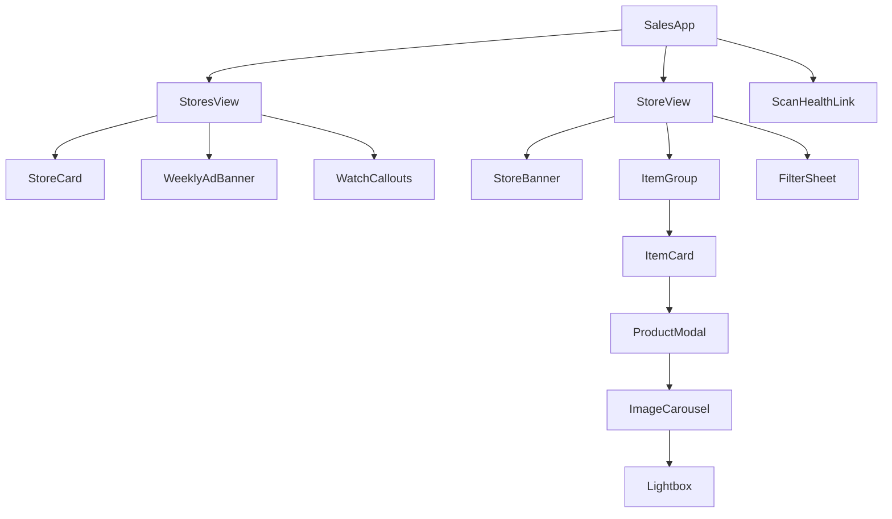
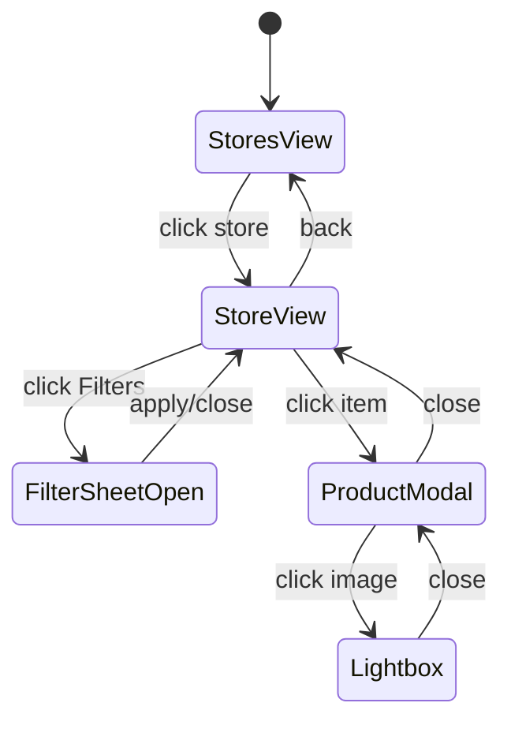
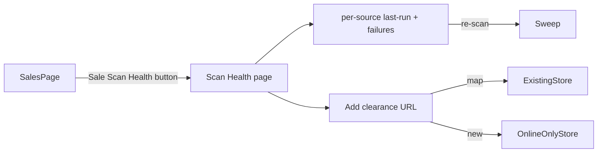

# 0038 — Sales & Clearance · DESIGN_SPEC

Hand-off brief for **Claude AI Design** + the coding agent. Reference mockups
(provided by Justin) are the **visual + interaction source-of-truth**:
`AISalesTrackerApp` (store list) and `StoreSalesDetailApp` (store detail). Both
are mock-data prototypes — production wires them to real endpoints and swaps
their raw Tailwind primitives for this repo's **Base-UI shadcn** primitives
(Base UI, not Radix; `render={<a/>}` not `asChild`; `Badge` has no `size` prop).

Theme = **Monolith dark**. Tokens only (`bg-card`, `border-border`,
`text-foreground`, `text-muted-foreground`, `bg-muted`, `primary`). No raw hex
except the semantic accent set already in the mockups (sky = AI, emerald =
savings, rose = price-crash, amber = promo). No 1px hard borders where a
ring/divider reads better.

---

## 1. Route & shell

- Route stays `/admin/shopping/sales` (`sales.astro` → `SalesApp` island).
  Astro shell MUST follow the page-styling rule (`class` not `className`,
  `container mx-auto px-4 py-8 pb-12`, header block with a 24px lucide icon —
  use `Tag` or `Percent`).
- **No main sidebar collapse.** The `AdminSidebar` stays. Filters live in a
  **right-side Sheet** that only exists on the store-detail (items) view and
  only opens on a filter-button click.
- Single-island state machine (no router change needed): `view = 'stores' |
  'store'`, `activeStoreId`, `filterSheetOpen`, `activeItemId` (modal).

---

## 2. Stores view (top level — req 3)

Card per store, from `GET /api/showroom-sales/stores`. Adapt the
`AISalesTrackerApp` article layout:

- **Header:** store logo (`iconCfImagesUrl`/favicon) with `ShoppingBag`
  fallback avatar; store name; domain; category chip.
- **Metric box (3-up):** Max discount · **Avg drop vs last week** (sparkline +
  `TrendingDown`) · Items on sale (count).
- **Change badges (req 8):** small pill row — `N new`, `N price-drops`, `N gone`
  — driven by `change_status` aggregates. New/unread = accent, count = 0 hidden.
- **Artwork (req 3):** the metric box + sparkline IS the "pretty artwork";
  price-range shown as `$low – $high`. Optional tiny color-swatch cluster of the
  store's most common sale colors.
- **Footer:** "Shop store clearance" external link (`target="_blank"
  rel="noreferrer"`) + scanned-ago timestamp.
- **Click store name/card → StoreView** (not the external link — the external
  link is a distinct button).

**Empty / nothing-new state (req 8, 10):** if a store has items but none unread,
show a muted "All caught up" ribbon. If the whole page has zero new since last
review, a top banner says so (mirrors the PDF's "nothing new" state).

---

## 3. Store detail (drill — req 4, 5)

From `StoreSalesDetailApp`. Two parts:

### 3a. Store banner
Logo, name, domain, scanned-ago, promo code badge (if detected), 3-up metrics,
AI summary + top highlights checklist. "Back to all stores" button (sets
`view='stores'`).

### 3b. Grouped item grid (req 5) + right-side filter Sheet
- **Grouping:** items grouped by **subcategory/type** (sink, faucet…) with a
  group header + count; ungrouped items under "Other". (You asked for "grouped
  somehow" — type is the most useful axis; group-by control can offer
  brand/condition later.)
- **Item card (req 5):**
  - Image from `sale_item_images` (primary). **On image error → cute fallback
    icon** (`ShoppingBag`/`ImageOff`) — never a broken img.
  - Discount badge `-N%`, condition tag (floor model / open box) if not `new`.
  - **Brand + model name.**
  - **Original price (strikethrough) · sale price (emerald) · discount amount ·
    qty.** Prices from `*_text` (display) — cents only for sort.
  - `deal_score` chip when scored (e.g. `Deal 82`), AI insight one-liner.
  - Watch heart + quick "not interested" (also in modal).
- **Filter button** (top of grid) opens the **right-side Sheet** (shadcn
  `Sheet side="right"`), containing: search, **type** (subcategory), **category**
  (plumbing/electrical), **color** (`MultipleSelector` w/ swatches), **size**,
  price slider, discount tier, condition, in-stock/qty. Active filter count on
  the button. Sheet closes on apply/escape. **Sheet renders only in StoreView.**

---

## 4. Product modal (req 6)

shadcn `Dialog` (Base UI). **Uses as much page space as needed** — wide
(`max-w-5xl`+), two-column on desktop: media left, details right.

- **Image carousel** left: cycle all `sale_item_images`; thumbnails strip;
  click image → **lightbox / shadow box** (full-screen overlay, prev/next, esc
  to close). Failed images → fallback icon tile.
- **Details right:** every field — brand, product line, model, sku, category /
  type, colors (swatches), size, original/sale/discount/shipping (text values),
  condition (floor model/open box/return/damaged), warranty (yes/no + terms),
  qty, damage notes (rendered html), deal terms.
- **Deal intelligence block:** `deal_score`, savings + realness, risk,
  alternatives list, shipping-edge note, `deal_insight_html` verdict.
- **Direct listing link:** `source_url`, opens new tab (`target="_blank"
  rel="noreferrer"`).
- **Actions (req 6):** **Add to Watch list** and **Not interested** — either,
  neither, or switch. Optimistic; hits `/watch` and `/dismiss`. "Not interested"
  visually dims the card and drops it from default views (kept in data).

---

## 5. Weekly ad + watch callouts (req 9, 10, 13)

- **Weekly ad banner/notification** at the top of StoresView from
  `GET /api/showroom-sales/ad/latest`: "This week's clearance ad — 6 new finds,
  3 price drops". Buttons: **Open PDF** (new tab, R2 URL) · **Print**. Shows the
  empty state ("No new finds this week") and any **failed-site** warning inline.
- **Watch-list callouts (req 9):** a pinned strip on StoresView listing watched
  items with a **detected change** (price/qty/color/gone/closeout) — accent
  card, "was $X now $Y", jump to the item modal. From `GET …/watch`.

---

## 6. Sale Scan Health page (req 7)

New page `/admin/shopping/sales/scan-health` (own `.astro` shell, page-styling
rule, `Activity`/`Radar` icon). Named **"Sale Scan Health"** — reachable from a
button at the top of the sales page.

- **Per-source table:** store, clearance URL, last run status
  (`ok/empty/no_new/failed`), items found/new, last scraped, error text on
  failure. Failed rows highlighted (req 7: "why did they not have items").
- **Manual add (req 7):** form to add a clearance URL — either map to an
  existing showroom (combobox) **or** create an **online-only store**
  (`is_online_only`). Posts `/sources`.
- **Row actions:** re-scan this source now; open source URL.

---

## 7. States & a11y checklist

- Loading skeletons for store cards + item grid; error toast on fetch fail.
- Empty states: no stores, no items after filter (reset button — from mockup),
  no watch changes, no weekly ad yet.
- Image fallback everywhere (`load_ok=false` + client `onError`).
- Keyboard: modal + sheet + lightbox trap focus, esc closes; carousel arrow
  keys; all interactive controls reachable; WCAG AA contrast (Monolith dark).
- Prices as `tabular-nums`; strikethrough original; emerald sale.
- Base-UI gotchas: Dialog dismissal via controlled `onOpenChange` guard (no
  Radix `onInteractOutside`); buttons-as-links use `render`.

---

## 8. Component reuse (ponytail)

- `Sheet`, `Dialog`, `Badge`, `Button`, `Input`, `Slider`, `MultipleSelector`
  (colors w/ swatch), `ComboboxWithOther` (store map), `CurrencyInput` (n/a for
  display but for any manual price edit), existing `SaleCard` visual language.
- Reuse `FacetSection` pattern from current `SalesApp` for the Sheet's checkbox
  groups.
- Sparkline: small inline SVG (no new dep) or existing recharts mini — prefer
  inline SVG for a 12-point weekly trend. ponytail: no chart lib for a sparkline.
