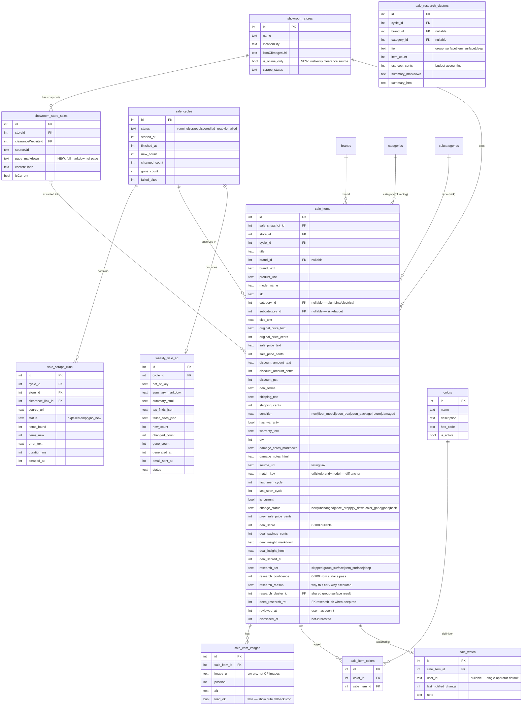
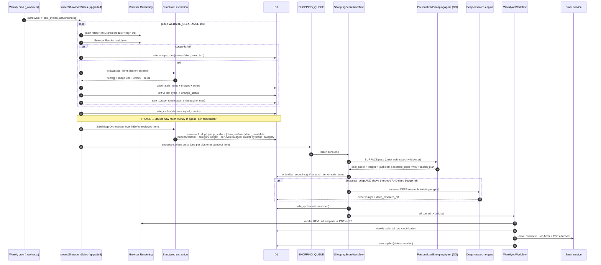
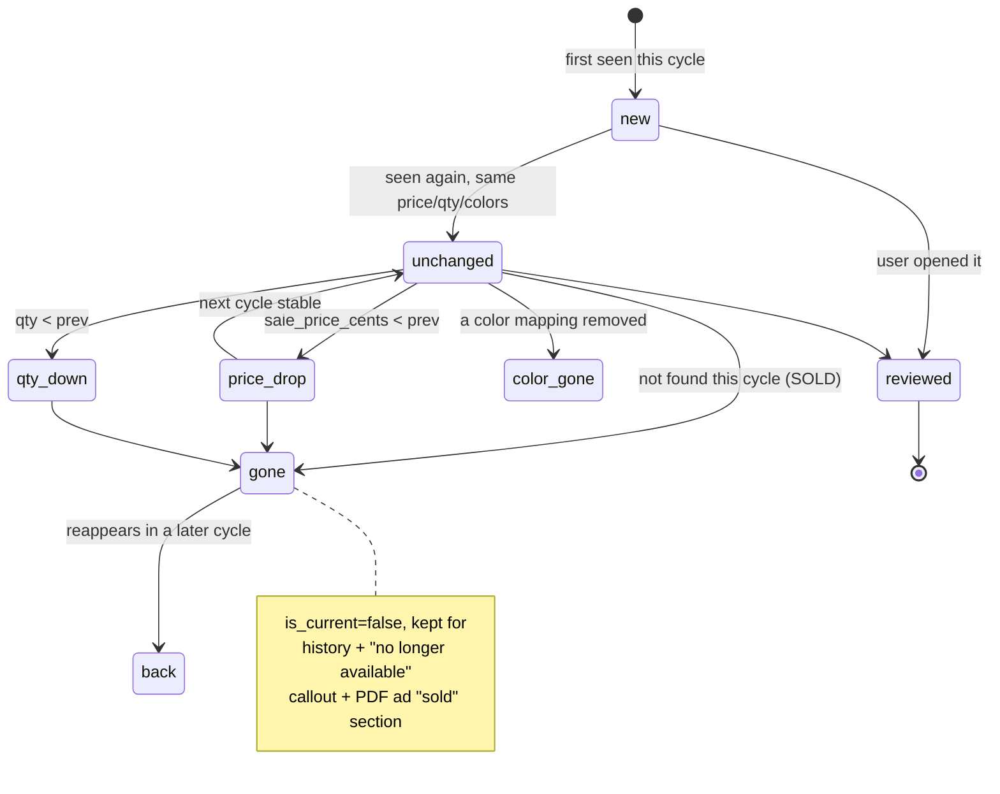
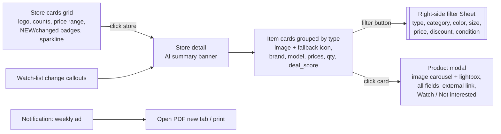

# 0038 — Sales & Clearance Overhaul

**Slug:** `sales-clearance-overhaul` · **Owner:** Justin · **Status:** planning
**Supersedes the flat item-grid on** `/admin/shopping/sales`.

---

## 1. Problem & context

The Sales & Clearance page today is a **flat grid of sale items** with a small
left filter rail (brand / category / dealLabel / city / showroom + a discount
slider). It works, but:

- **Sale items are not real rows.** Each clearance page becomes ONE
  `showroom_store_sales` row whose `clearanceDetailsJson` blob holds an
  `items[]` array (`ClearanceItem`). Because items are JSON, you cannot filter
  by color/size, attach per-item images, watch a single listing, or diff a
  listing across weeks.
- **No change-detection.** Nothing tells you what is *new since you last
  looked*, what *dropped in price*, what *sold out*, or which color/qty changed.
- **No store-first browse.** You want to scan by **store** first (pretty cards
  with counts + price range + artwork), then drill into a store's items.
- **No deal intelligence.** Raw prices with no judgement on whether a "deal" is
  actually a deal.
- **No weekly artifact.** No mailer/PDF, no email, no notification, no
  visibility into which clearance sites failed to scrape.

### What exists we build ON (do not rebuild)

| Concern | Existing asset |
|---|---|
| Clearance scrape | `sweepShowroomSales` — `src/backend/services/showroom/sales.ts` |
| Browser Rendering | `scrapeUrl` / `extractJson` / `capturePdf` / `uploadPdfToR2` / `extractLinksFromHtml` — `src/backend/ai/tools/browser-rendering.ts` |
| AI structured output | `src/backend/services/structured-output.ts` (Gemini→kimi-k2.7), `src/backend/utils/ai-json.ts` |
| Clearance URL discovery | `classifySiteLink` → `WEBSITE_CLEARANCE` link on `showroom_store_links` |
| Data model (snapshot) | `showroomStoreSales`, `ClearanceItem`, `ClearanceDetails` — `db/schema/showroom/sales.ts` |
| Price condition enum | `productPriceObservations.condition` incl. `clearance`, `floor_model` |
| Scan logging | `showroomScanLog` — `db/schema/showroom/scan_log.ts` |
| Raw-image-URL convention | `CF_IMAGES_SKIPPED` (brand-image-harvest) — keep sale images as raw `src`, no CF Images |
| API surface | `showroomSalesRouter` — `src/backend/api/routes/showroom-sales.ts` |
| Frontend | `SalesApp.tsx`, `sales.astro` |
| Email | `src/backend/services/email/*` (worker email routing) + Gmail send |
| Deep-research tooling | `src/backend/ai/deep-research/*` — reuse browser+search tool pattern for the shopping agent |

---

## 2. Current vs. target

```mermaid
flowchart LR
    subgraph NOW["NOW"]
        A1[clearance page] --> A2[showroom_store_sales row<br/>clearanceDetailsJson blob]
        A2 --> A3[SalesApp flat item grid<br/>brand/category/city filters]
    end
    subgraph TARGET["TARGET"]
        B1[clearance page] --> B2[plain fetch HTML + Browser Render markdown]
        B2 --> B3[AI structured extract]
        B3 --> B4[(sale_items rows<br/>+ image mapping<br/>+ color mapping)]
        B4 --> B5[change-detection diff vs last cycle]
        B5 --> B6[shopping agent deal_score + insight]
        B6 --> B7[Store cards to Item cards to Product modal]
        B6 --> B8[weekly PDF ad to R2]
        B8 --> B9[notification + email]
    end
    NOW -.migrate/backfill.-> TARGET
    classDef gone fill:#4d1f1f,stroke:#f87171
    classDef new fill:#1f4d2e,stroke:#4ade80
    class A2,A3 gone
    class B4,B5,B6,B8 new
```



---

## 3. Target data model



### Compliance notes (CLAUDE.md — mandatory, folded into Phase A)

- **Currency = text + cents** for every price: `original_`, `sale_`,
  `discount_amount_`, `shipping_`. Frontend uses `<CurrencyInput>`; API accepts
  text and derives cents.
- **Colors = definition + mapping**, never comma-joined. `colors` def
  (id/name/description/hex_code/is_active) + `sale_item_colors` mapping with a
  UNIQUE `(color_id, sale_item_id)`. Rendered with swatches + "Other" create.
- **Category / type = shared `categories` + `subcategories`** (verify these
  tables exist; if not, Phase A creates them). "Plumbing" = category, "sink" =
  subcategory. Extraction returns **ids** from the live vocab (validate before
  insert; a hallucinated id must never reach a FK — per CLAUDE.md AI rule).
- **Size** stays free text (`size_text`) — dimensions/"36 in" is not a bounded
  vocabulary. ponytail: promote to a definition table only if you later want to
  filter by discrete sizes.
- **Rich text** (`damage_notes`, `deal_insight`) stored as **markdown + html**.

---

## 4. Per-cycle pipeline (the heart)



### Change-detection state machine (per `match_key`, across cycles)



- **`match_key` priority:** `source_url` → `sku` → normalized `brand+model`.
  No match → treat as `new`. ponytail: fuzzy `brand+model` uses lowercased,
  punctuation-stripped compare; upgrade to embeddings only if false-splits show
  up. Comment names the ceiling.
- **Diff runs inside the sweep**, per store, comparing this cycle's rows to the
  prior cycle's `is_current` rows for that store.

### Categorization reliability (grouping depends on it)

Grouping items by **type** only works if the scrape reliably assigns
category/subcategory. Guardrails so we never dump a big "Uncategorized" pile:

- Extraction returns **ids** for `category_id`/`subcategory_id` from the live
  vocab (per the AI structured-output rule). Give the model the vocab as
  `id: name — description` and validate ids before insert.
- **Two-pass fallback:** if the first pass leaves an item uncategorized, a
  cheap second classify pass runs over just those items (title + brand +
  markdown snippet) against the vocab. Still unknown → `subcategory_id=null`
  but keep `brand_text`/`title`; the item groups under its **brand** (not a
  generic bucket) so the UI still reads well.
- **Quality gate on the run:** if a page yields items where uncategorized rate
  exceeds a threshold (e.g. > 30%), mark `sale_scrape_runs.status` with a
  `low_quality` note (surfaced on Sale Scan Health) so a weak scrape is visible
  and fixable — not silently shown as a wall of uncategorized cards.
- **New vocab is allowed:** genuinely new types (per the multi-select rule) can
  create a subcategory via the definition-table create path, not be forced into
  a wrong existing one.

---

## 5. Shopping intelligence — cost-aware triage (Phase C)

**Money is the constraint.** Deep research costs **$2–7 per run** — never run it
per item. A triage orchestrator reviews the whole cycle's new items and spends
**as little as possible per item**, escalating only when value AND uncertainty
justify it. Every item still ends with a `deal_score` + insight; deep research is
the gated exception. The personalized shopping agent stays broad and reusable —
it's the **surface-tier worker** here.

### The three tiers

| Tier | Who | Cost | When | Output |
|---|---|---|---|---|
| **0 — Triage / route** | `SaleTriageOrchestrator` (1 structured AI call over the item list) | ~nil | every cycle | per item/cluster route: `skip` · `group_surface` · `item_surface` · `deep_candidate` |
| **1 — Surface pass** | `PersonalizedShoppingAgent` DO (quick `web_search` + `browser_render`) | cheap | most items, **batched by cluster** | `deal_score` + insight + `{sufficient | escalate_deep, why, search_plan}` |
| **2 — Deep research** | existing deep-research engine | $$$ | only escalated + above threshold + budget left | expert insight (warranty, panel-ready, who-to-call, left-hinge…) + `deep_research_ref` |

### Routing logic (orchestrator)

```mermaid
flowchart TD
    N[NEW unreviewed items this cycle] --> O[SaleTriageOrchestrator<br/>cluster by brand+category]
    O --> P{per item / cluster}
    P -->|"price < surface_min AND commodity"| SKIPG[group_surface:<br/>one pass for the whole brand/category cluster]
    P -->|"mid value OR standout"| ITEM[item_surface:<br/>its own quick pass]
    P -->|"high price AND high complexity<br/>(appliance, panel-ready, warranty)"| DC[deep_candidate]
    SKIPG --> S[Surface pass]
    ITEM --> S
    DC --> S
    S --> E{agent verdict}
    E -->|sufficient| DONE[(write score + insight,<br/>research_tier set)]
    E -->|escalate_deep AND above threshold AND budget left| DEEP[Deep research]
    E -->|escalate but over budget / below threshold| DONE2[(keep surface insight,<br/>flag 'deep suggested' for user)]
    DEEP --> DONE3[(richer insight + deep_research_ref)]
    classDef spend fill:#4d3a1f,stroke:#fbbf24
    class DEEP spend
```



- **The Sub-Zero case:** $5k + appliance + panel-ready/warranty/hinge unknowns →
  `deep_candidate`; surface pass confirms high value + inconclusive → escalates →
  deep research returns the left-hinge / panel / warranty / who-to-call insight.
- **The $99 showroom sink:** below `surface_min` + commodity category →
  `group_surface` with the other sinks/that brand → one cheap pass →
  "standard undermount, used floor unit, not even a good sale price, get nicer
  brand-new for a bit more." Sufficient → stop. **Insight still recorded.**
- **Clustering justifies the spend:** N cheap same-brand/same-category items →
  ONE surface pass covers the cluster (`sale_research_clusters`), shared summary
  fans out to each item's insight. Never a run per trivial item.

### Escalation contract (surface → deep)

The surface agent returns, in its structured output, a `recommendation`:
`{ needs_deep: bool, reason, search_plan[], confidence }`. The workflow gates the
escalation on: `needs_deep && sale_price_cents ≥ deep_research_min_price_cents &&
cycle deep-runs < deep_research_per_cycle_budget`. Over budget or under threshold
→ **do not spend**; keep the surface insight and set `research_reason="deep
suggested but gated"` so the item shows a "deep research available" affordance the
user can trigger manually (MCP `score_sale_item` / a button).

### Config (thresholds — start as constants, promote to a config page later)

```
surface_min_price_cents        = 15000   # $150 — below this, only group_surface
deep_research_min_price_cents  = 150000  # $1,500 — floor to even consider deep
deep_research_per_cycle_budget = 5       # max deep runs per cycle (cost cap)
high_complexity_categories     = [appliances, plumbing_fixtures, hvac, ...]
```
ponytail: constants + a comment naming the ceiling; move to a `sale_research_config`
row (or existing config) only when you want to tune from the UI. **Log every
`skip` and every budget-gated escalation** — no silent truncation (CLAUDE.md).

### Infra (same Queue + Workflow spine, your call)

- `SHOPPING_QUEUE` (producer+consumer) — producer enqueues surface tasks the
  orchestrator selected (per cluster or standout item), not raw item ids.
- `ShoppingScoreWorkflow` — durable per-task steps: surface pass → conditional
  deep escalation → write. Retries one task, not the cycle.
- `PersonalizedShoppingAgent` DO — reusable, generic `ShoppingTask{ intent,
  subject, budget?, constraints[] }`; `intent="deal_surface"` here. Tools:
  `web_search`, `browser_render`, `get_sale_item`. Future intents reuse it.
- Deep tier reuses the **existing** deep-research engine (`ProductResearchWorkflow`
  / `backend/ai/deep-research`) — do not rebuild it.
- Bump the DO migration tag; export DO + workflow in `src/_worker.ts`.

---

## 6. Weekly PDF ad + delivery (Phase D)

- **Trigger:** after `sale_cycles.status=scored` (all new items scored).
- **Build:** author an **HTML ad template** (server-rendered string, same data
  as frontend) → `capturePdf` (Browser Rendering) → `uploadPdfToR2` → key on
  `weekly_sale_ad.pdf_r2_key`.
- **Sections:** intro (cycle summary), per-store spreads (logo, counts, price
  range, top finds w/ deal_score), **"Price drops since last week"**, **"Sold /
  no longer available"**, **"Nothing new since your last review"** state, and a
  loud **"Could not scrape — check manually"** list from `sale_scrape_runs
  status=failed`.
- **Surface:** `weekly_sale_ad` row → notification on the sales page (badge +
  "This week's ad") → open PDF in new tab (R2 signed/proxied URL) → printable
  (browser print of the same HTML).
- **Email:** overview (top finds, counts) + **PDF attached**, via the existing
  email service. Empty-cycle email still sends: "No new clearance finds this
  week" + any failed-site warnings.

---

## 7. Frontend (Phase E)

Store→items, single drill, items **grouped** (by subcategory/type by default).
Filters open as a **right-side Sheet**, only on the item view, only on button
click — **no main sidebar collapse**. Reference components (provided by Justin)
are the visual/interaction source-of-truth; production wires them to real data
and this repo's Base-UI shadcn primitives. Full detail in `DESIGN_SPEC.md`.



---

## 8. Phases, deliverables, verification

```mermaid
flowchart TD
    A[A. Schema + migration + backfill] --> B[B. Scrape upgrade + change-detection]
    B --> C[C. Shopping agent: Queue+WF+DO]
    B --> E[E. Frontend]
    C --> D[D. PDF ad + notification + email]
    A --> E
    classDef done fill:#1f4d2e,stroke:#4ade80
```



| Phase | Deliverable | Verify |
|---|---|---|
| **A** | New tables + `is_online_only` + `page_markdown`; drizzle migration; backfill `clearanceDetailsJson.items[]` → `sale_items` (+ images, colors, prices text/cents) | `migrate:remote`; row-count backfill matches JSON item count; QC `pr_<n>.mjs` asserts tables + backfill |
| **B** | Upgraded `sweepShowroomSales`: plain-fetch images + markdown + row extraction + **reliable categorization** + diff + `sale_scrape_runs` | Run `POST /sweep`; assert new rows, `change_status` values, a forced failure logs `status=failed`, uncategorized rate under gate |
| **C** | `SaleTriageOrchestrator` + `SHOPPING_QUEUE` + `ShoppingScoreWorkflow` + `PersonalizedShoppingAgent` DO (surface tier) + deep-research escalation; `deal_score`/insight/`research_tier` written | Cheap item → `group_surface` insight, no deep spend; high-value+complex item → escalates to deep; deep runs ≤ per-cycle budget; skips + gated escalations logged |
| **D** | `WeeklyAdWorkflow` → PDF in R2 → `weekly_sale_ad` + notification + email w/ attachment | Trigger ad; PDF opens; email lands (unit-testing label); empty-cycle + failed-site callouts render |
| **E** | Store cards, grouped item cards, product modal (carousel+lightbox), right-side filter Sheet, Sale Scan Health page, badges, watch callouts | Preview deploy; click-through; badges reflect `change_status`; Sheet opens only on item view |

### API deltas (Phase B/C/E)

- `GET /api/showroom-sales/stores` — store aggregation cards (count, price
  range, new/changed counts, latest cycle, sparkline points).
- `GET /api/showroom-sales/store/:id/items` — grouped items + facets (type,
  category, color, size, condition, discount).
- `GET /api/showroom-sales/item/:id` — full item + images + colors + deal.
- `POST /api/showroom-sales/item/:id/watch` · `DELETE …/watch`
- `POST /api/showroom-sales/item/:id/dismiss` (not-interested)
- `GET /api/showroom-sales/watch` — watch list + detected changes (callouts).
- `GET /api/showroom-sales/scan-health` — per-source last run + failures.
- `POST /api/showroom-sales/sources` — manually add a clearance URL (map to
  existing store OR create online-only store).
- `GET /api/showroom-sales/ad/latest` — weekly ad meta + PDF URL.
- Facets endpoint extended: `type/category/color/size/condition`.

### MCP tool deltas (per CLAUDE.md registry rule)

New `tools/sales/` domain: `list_sale_stores`, `list_sale_items`,
`get_sale_item`, `watch_sale_item`, `dismiss_sale_item`, `add_clearance_source`,
`get_scan_health`, `get_weekly_ad`, `score_sale_item` (manual re-score). One
file per tool; add to `tools/index.ts`; update `/connect/tools` catalog.

---

## 9. Risks

- **D1 rules:** multi-row inserts (items, images, colors) must **chunk at ~20**
  and use `db.batch()` — never `db.transaction()`. Backfill + per-page insert
  both hit this.
- **Extraction leniency vs. FK integrity:** lenient schema, but validate
  `category_id`/`subcategory_id`/`color_id`/`brand_id` against live vocab before
  insert; unmatched → leave FK null + keep `*_text`. Never insert a placeholder
  FK.
- **Image hotlinks rot:** `sale_item_images.load_ok` flips false on client image
  error → cute fallback icon (req 5). No CF Images spend.
- **Deep-research cost ($2–7/run) is the top risk:** triage orchestrator gates
  it behind price threshold + complexity + a per-cycle budget cap; most items
  get a cheap surface pass, cheap commodity items get ONE clustered pass. Log
  every skip + every budget-gated escalation (no silent truncation). Thresholds
  start as constants, promotable to a config page.
- **DO migration tag:** new DO collides on preview if tag not bumped; deploy
  from `main` after merge (deploy topology rules).

---

## 10. Success criteria

- Sale items are real, filterable rows with per-item images + colors + prices
  (text+cents).
- Store→items browse with grouped items + right-side filter Sheet.
- Product modal: carousel + lightbox + external link + Watch / Not-interested.
- Cross-cycle badges: new / price-drop / qty-down / color-gone / gone.
- Watch-list change callouts on the main page.
- "Sale Scan Health" page shows per-site last run + failures + manual add.
- Every new unreviewed item carries a `deal_score` + insight.
- Weekly PDF ad in R2, surfaced as notification + new-tab + print, emailed with
  attachment; empty + failed-site states explicit.
