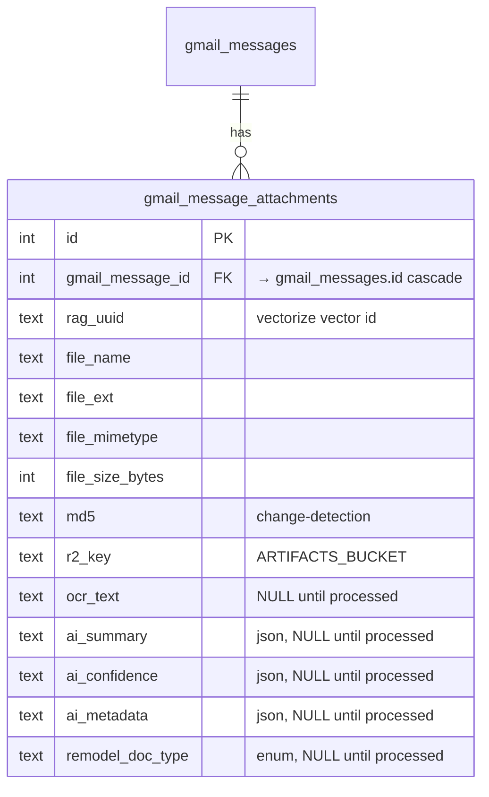
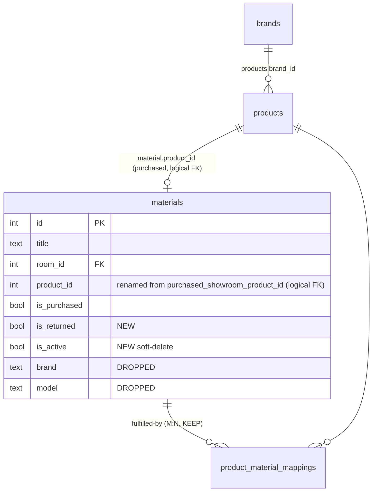
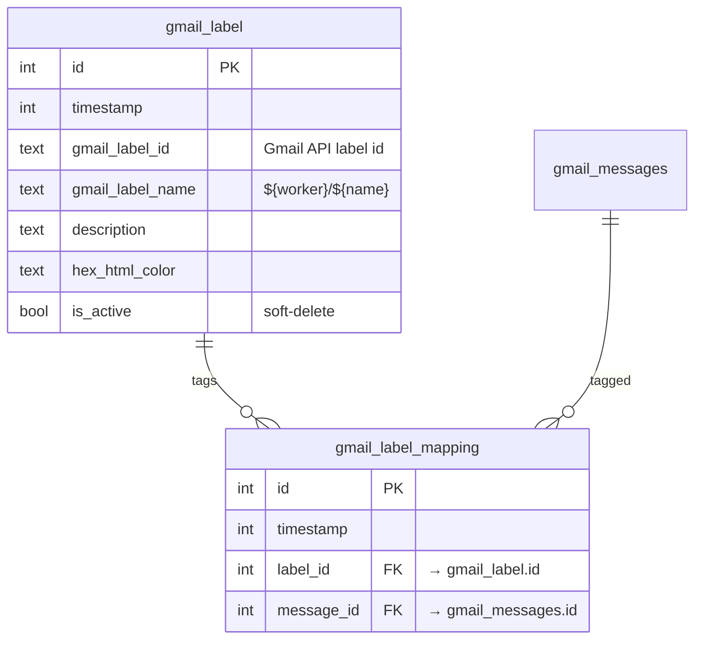

# 0039 — Gmail Ingest Gate + Material/Label Cleanup

Cheap, domain-matched vendor-email pull into the existing extraction pipeline,
**plus** the material-schedule cleanup and user-managed Gmail label ingestion the
same effort surfaced. Zero AI/OCR spend until a message is proven relevant OR a
user explicitly labels it.

## Problem

Vendor mail (e.g. Pietra Fina, `nancy@pietrafina.com`) lands in Justin's
personal Gmail (`justin@126colby.com`), not `remodel@hacolby.app`. The worker's
extraction pipeline (`src/backend/services/email/pipeline.ts` — OCR + classify +
route + persist) only sees mail Cloudflare Email Routing delivers to
`remodel@hacolby.app`. Gmail is synced to D1 (`gmail_threads`, `gmail_messages`,
`gmail_message_participants`) but display-only, no attachment handling. So a
domain that matches showroom #222 (`pietrafina.com`) gets nothing pulled in.

Alongside it, `material_schedule_items` carries stale denormalized columns
(`brand`, `model`), no soft-delete, and a plain `purchased_showroom_product_id`
that should be a proper `product_id` fed by the brand/product ensure flow.

## Decisions (locked with Justin)

- **Extend** `gmail_message_participants` (not a new `gmail_message_recipients`).
- Match scope: showroom stores **and** directory companies (contractors).
- No `contractor_business` table — a contractor is a `companies` row
  (`directory/companies` + `business_types`), contacts are `company_contacts`.
- **Keep `product_material_mappings`** (product↔material, M:N) and **add**
  `gmail_message_material_mapping` (email↔material provenance — a different axis).
- Label ingest: **dedup ledger prevents reprocessing; the user's label stays**
  on the message and is recorded in `gmail_label_mapping`.
- `product_id` stays a **documented logical FK** (lazy reference), not a hard FK
  — a hard FK reintroduces the `products`↔`material` circular import the schema
  deliberately avoids.
- No spend before match: attachment `ocr_text`/`ai_*` fill only after the gate
  passes (or the message is user-labeled).

---

## Part A — Gmail schema

### New `gmail_message_attachments`

`remodel_doc_type`: `INVOICE, RECEIPT, QUOTE, CONTRACT, CHANGE_ORDER,
SPEC_SHEET, PRICE_LIST, OTHER`.

### Extend `gmail_message_participants` (plays the recipients role)

Add: `recipient_type` (`FROM|TO|CC|BCC`), `first_name`, `last_name`, and FKs
`showroom_store_id`→`showroom_stores.id`,
`showroom_store_contact_id`→`showroom_store_contacts.id`,
`contractor_business_id`→`companies.id`,
`contractor_business_contact_id`→`company_contacts.id`. Keep existing `role`.

### `gmail_messages`: add `body_plain_txt`, `body_html` (keep `body`).

---

## Part B — Ingest gate (the $0 filter)

```mermaid
flowchart TD
    cron[Cron: scan gmail_messages] --> lbl{message carries an<br/>active gmail_label?}
    lbl -- yes --> force[PROCESS unconditionally<br/>record gmail_label_mapping]:::spend
    lbl -- no --> meta[record metadata + md5]
    meta --> dedup{message_id seen?}
    dedup -- yes --> stop[STOP: already processed]
    dedup -- no --> dom[unique FROM/TO/CC/BCC domains<br/>minus exclusions]
    dom --> match{domain == showroom<br/>OR company website?}
    match -- no --> skip[skipped_no_match — COST $0]:::zero
    match -- yes --> proc[resolve/create contact, set FKs]
    force --> mk{domain matches<br/>a showroom/business?}
    mk -- no --> create[create showroom/business + contact<br/>from email info]
    mk -- yes --> proc
    create --> proc
    proc --> pipe[processEmail: OCR + classify + persist<br/>+ draft reply → HITL]:::spend
    classDef zero fill:#1f4d2e,stroke:#4ade80;
    classDef spend fill:#4d3a1f,stroke:#fbbf24;
```

Exclusion set: `@126colby.com`, `@hacolby.app`, `jmbish04@gmail.com`,
`jasonowyong87@gmail.com`. Domain sources: `showroom_store_links` (`type=WEBSITE`)
+ `companies.website`.

---

## Part C — Material-schedule cleanup

`material_schedule_items` is populated by MANY writers — **verify all when
changing columns**: MCP `create_material` / `update_material` /
`link_material_to_room` / `mark_material_purchased`; API `worker-emails.ts`,
`wishlist.ts`, `showroom-gaps.ts`, `materials.ts`; service
`materials/deduction.ts`.

Changes:
- **Drop `brand`, `model`.** D1 column-drop rebuilds the table → children
  (`product_material_mappings`, `worker_email_invoice_line_items` reference it)
  are at cascade-wipe risk. Use backup→rebuild→restore (see
  `d1-drop-table-cascade-gotcha`), NOT a raw drizzle-kit column drop.
- **Add `is_returned`** (boolean, default false).
- **Add `is_active`** (boolean, default true) for soft-delete. Every material
  READ must filter `is_active`. Flip `materials.ts` hard-`delete` to a soft flip.
  New MCP `soft_delete_material` (+ accept `isActive`/`isReturned` on
  `update_material`).
- **Rename `purchased_showroom_product_id` → `product_id`** (logical FK to
  `products`/`showroom_store_products`). Write path on purchase:
  `ensure_brand(name)` → `ensure_product({brandId, itemName})` (both already
  idempotent) → set `material.product_id`. Brand/model display now derives via
  the product join, replacing the dropped columns.

---

## Part D — Provenance + user-managed labels

### New `gmail_message_material_mapping` (email↔material provenance)

`id, material_item_id→material_schedule_items.id, message_id→gmail_messages.id,
message_attachment_id→gmail_message_attachments.id (optional)`.

### New `gmail_label` + `gmail_label_mapping` — generalize the existing safety-net

`inbox-label.ts` ALREADY auto-creates the `core-remodel/inbox` label
(`${worker}/${child}`), lets the user file missed mail into it, and a cron pulls
everything under it through the inbound pipeline regardless of domain. We
generalize the single hardcoded label into a DB-managed set:

- Seed the parent `core-remodel` + first child row from the existing label.
- MCP tools: `create_gmail_label`, `list_gmail_labels`, `soft_delete_gmail_label`
  (create-on-the-fly, soft delete). Creating a row also creates the nested Gmail
  label via the existing label API helpers.
- Cron iterates every `is_active` label, `label:"${name}"` search, and processes
  each message **unconditionally** (same as worker mail). Dedup ledger prevents
  reprocessing; the label is **kept** and recorded in `gmail_label_mapping`.
- Labeled mail whose domain matches nothing → **create** the showroom/business +
  contact from the email (reuse the showroom-contact autopopulate create-half),
  then process.

---

## Part E — Draft-reply HITL

After a message is processed, draft a reply (reuse Gmail `create_reply_draft`)
and stage it for human review/approve/edit on the frontend before it can be
sent. Draft state tracked in D1; the send action stays user-gated.

---

## Phases / success criteria / risks

- **P0 Gmail schema · P1 gate · P2 bridge** — as Parts A/B. Pietra Fina thread
  `19f4ded890f5e58d` pulled in, estimate OCR'd, resolved to showroom #222, typed
  `QUOTE`; non-match recorded once, `skipped_no_match`, $0; dedup holds.
- **P3 material cleanup** — brand/model gone (no child data lost), `is_active` /
  `is_returned` live and filtered, `product_id` rename + ensure flow, soft-delete
  MCP.
- **P4 provenance + labels** — `gmail_message_material_mapping`; `gmail_label` /
  `gmail_label_mapping` seeded from `core-remodel/inbox`; label MCP tools; a
  user-labeled plumbing-quote thread with an unknown domain is processed AND its
  showroom/business+contact created.
- **P5 draft-reply HITL** — processed message yields a staged draft; send stays
  user-gated.
- **P6 cron + backfill + QC** — scheduled scan + backfill; QC vs preview + prod.

Risks: D1 rebuild cascade (Part C), 100-param / batch chunking, circular-import
FK (kept logical), never insert a placeholder into a NOT NULL FK (reject/skip),
structured AI output only.
