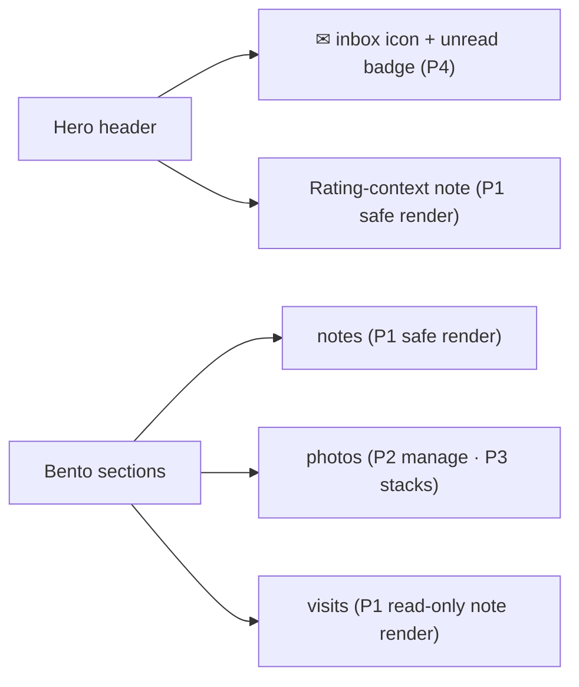
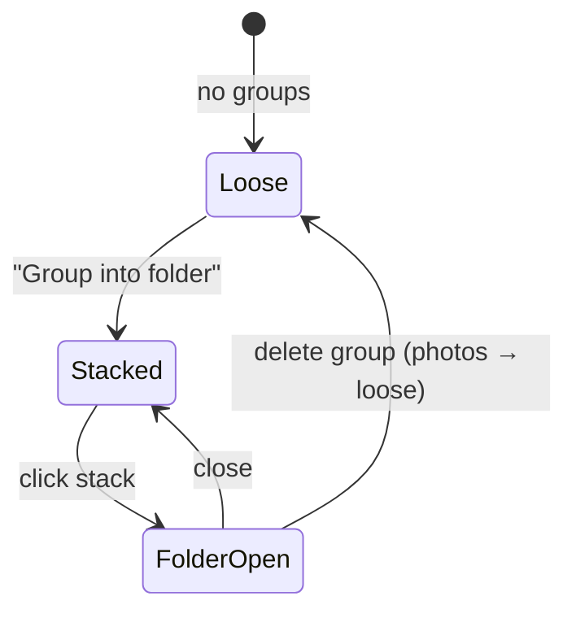

# 0040 — Showroom Detail Overhaul · Design Spec

Frontend brief for `StoreViewportApp.tsx` (island at `/admin/shopping/store/:id`).
Dark Monolith theme, Base UI primitives (not Radix), shadcn registry components.

## Surfaces touched

## P1 — Notes rendering

- **Component:** route homeowner-authored notes through the existing
  `MarkdownProse` (react-markdown + remark-gfm, no `rehype-raw`). Feed it the
  `*Markdown` field (source of truth). Keep `PROSE_CLASS` styling parity.
- **Fallback:** legacy rows with only `*Html` → sanitized `dangerouslySetInnerHTML`
  as today.
- **Visit-log notes:** add a read-only render on `VisitCard` (line-clamped preview)
  and the visit-log detail hero. Uses `MarkdownProse` on `notesMarkdown`.

## P2 — Image management

- Photos section: on hover each card shows a checkbox (multi-select) + a kebab
  menu (Add note · Re-tag kind · Delete). Selection bar: **Delete selected**,
  **Group into folder** (P3).
- Note editing keeps the polaroid flip (`ShowroomPhotoPolaroid`); extend to any
  kind, not just visit.
- **Upload sources unified:** file upload and Google Photos picker both funnel to
  `POST /:id/photos`. Picker result (`File[]`) is handed to the same uploader; no
  separate "Google" affordance downstream.

## P3 — Photo stacks

- **Stack card:** fanned polaroid look — cover image on top, 2–3 offset cards
  behind, a count chip ("7"), the group **name**, and a **price** chip
  (`price_text`). Hover lifts the fan slightly.
- **Layout order:** stacks first (sorted `sort_order`), then loose photos, in one
  responsive grid. **Zero groups → today's flat grid**, no stack chrome at all.
- **Folder modal** (shadcn Dialog = Base UI): header = editable name; a
  carousel/lightbox of members; right rail = `OverviewNoteEditor` description +
  `<CurrencyInput>` pricing + member management (add from loose / remove to loose)
  + **Delete folder**. Save is explicit.
- **Create:** select loose photos → selection bar **Group into folder** → name
  prompt → creates group, moves selected in.

## P4 — Inbox

- **Hero icon:** a `lucide` mail icon button, right of the title cluster. Unread
  count as a small badge (hide at 0). `aria-label="Inbox (N unread)"`.
- **Panel:** click toggles a two-pane inbox below the hero (or a slide-over):
  `GmailThreadList` (left) + `GmailThreadView` (right), same as `CompanyGmailPanel`.
  Matched `@domain`/email chips shown above the list.
- **Read semantics:** opening a thread in the view marks its messages read; badge
  decrements without a full refetch (optimistic + reconcile).

## Tokens / parity

- Reuse `PROSE_CLASS`, existing polaroid styling, section header pattern. No new
  color tokens. Icons from `lucide` at `size-6 text-muted-foreground` in headers,
  `size-4` inline. Respect the mandated page-shell rules (this is an island under
  an existing compliant `.astro` shell — no shell changes).
