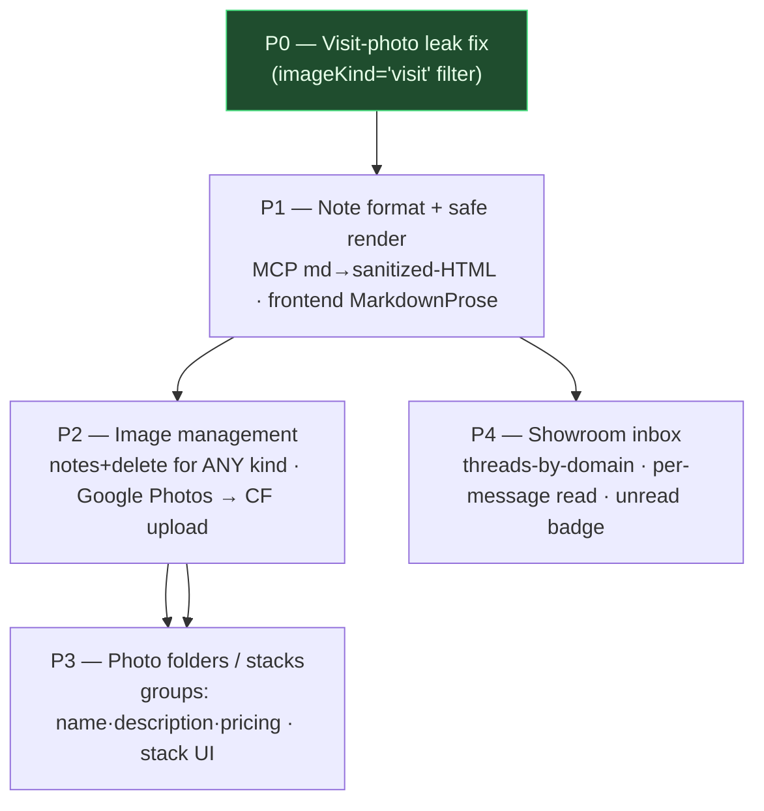
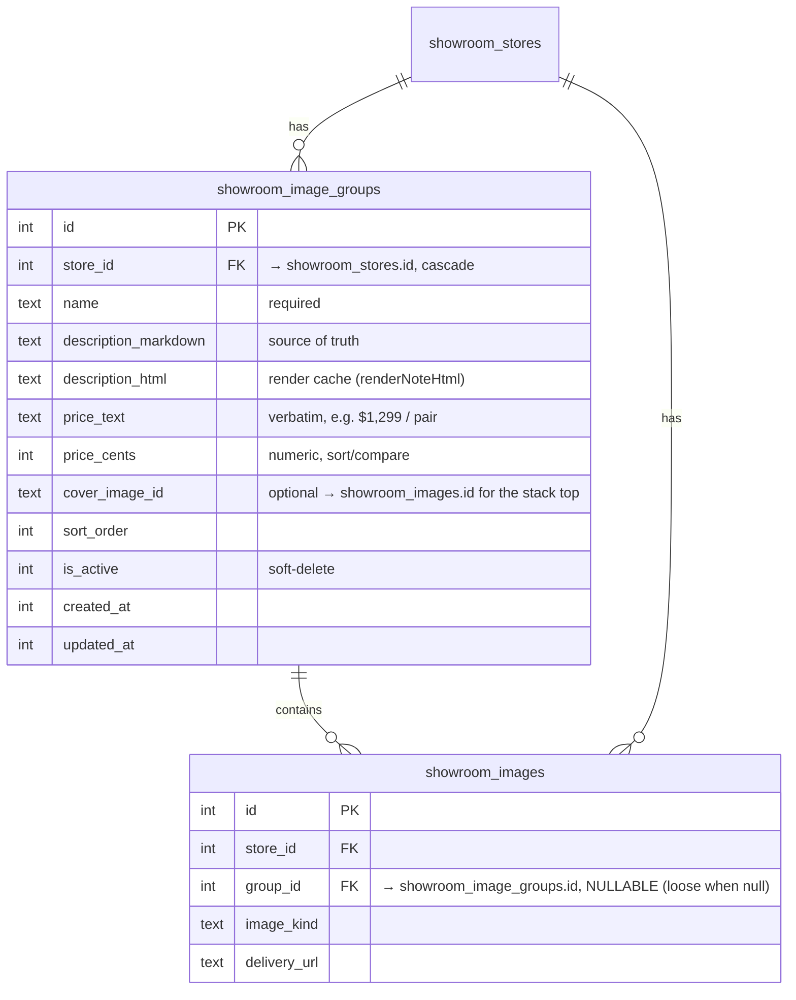
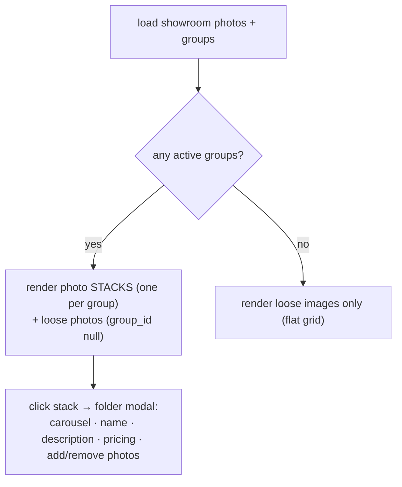
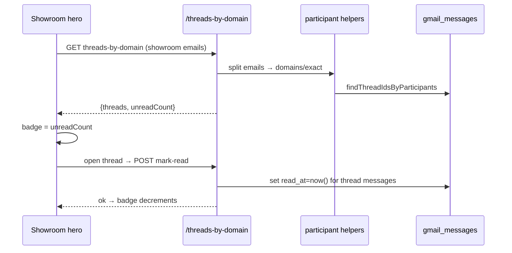

# 0040 — Showroom Detail Overhaul

**Slug:** `showroom-detail-overhaul`
**Preview:** https://core-remodel.hacolby.workers.dev/admin/changelog/preview/showroom-detail-overhaul
**Status:** planning → building (P0 shipped)

## Context / problem

The showroom **detail** page (`/admin/shopping/store/:id`, island
`StoreViewportApp.tsx`) accumulated several defects and gaps that surfaced while
using it in the field:

1. **Visit-photo leak (bug).** The "Your visit photos" card showed images that
   were *not* taken on the visit — storefront/website images the sourcing sweep
   scraped. Root cause: `GET /api/showroom-stores/:id/photos` filtered only by
   `storeId`; scraped rows live in the *same* `showroom_images` table.
2. **Visit notes render as raw Markdown.** MCP note tools store notes verbatim.
   `record_showroom_visit` copies Markdown straight into the HTML column and
   `add_showroom_note` never writes HTML at all. The frontend renders the HTML
   column via `dangerouslySetInnerHTML`, so raw `**Markdown**` shows on the page.
   Visit-log notes have **no read-only render path** anywhere.
3. **No image management.** Only visit photos can get a note or be deleted, and
   only one at a time via the polaroid flip. No way to manage the other image
   kinds, and Google Photos picks aren't unified into the upload flow.
4. **No grouping.** Several photos of one product can't be grouped, named,
   described, or priced. The viewport shows a flat grid only.
5. **No inbox.** Emails to/from a showroom's domain exist in the Gmail store but
   aren't surfaced on the showroom page, and there's no unread signal.

## Non-goals

- Per-*visit* photo association (photos link to the store, not a `visit_log` row).
  Out of scope; noted as a known structural gap.
- Managing the Google **Places** gallery (`showroom_photos_mapping`) as first-class
  user content — it stays re-fetchable/read-only. "Google images are irrelevant
  in this context" (owner).
- Reconnecting Cloudflare↔GitHub CI. Deploys stay agent-owned.

## Phase map



Each phase is one PR. P0 already merged-ready. P3 depends on P2 (shared image
grid/card). P4 is independent of P2/P3 and can land in parallel.

---

## P0 — Visit-photo leak fix ✅ (this PR)

**Change:** widen `showroom_images.image_kind` enum to include `"visit"` (drizzle
enum is TS-only — the column is plain `TEXT`, **no migration**), and filter
`GET /:id/photos` to `imageKind = 'visit'`. Removed the `as unknown` insert cast
that only existed because `visit` wasn't in the enum.

- `src/backend/db/schema/showroom/showroom_images.ts` — enum widened.
- `src/backend/api/routes/showroom-stores.ts` — `GET /:id/photos` now
  `and(eq(storeId), eq(imageKind,'visit'))`; insert cast removed.

**Verify:** `GET /api/showroom-stores/:id/photos` returns only visit rows; scraped
storefront rows no longer appear in the "Your visit photos" card.

---

## P1 — Note format + safe render

**Two-sided fix: force correct format on write, tolerate bad format on read.**

### Write side (MCP + REST)
- New backend util `src/backend/services/notes/markdown.ts`:
  `renderNoteHtml(markdown: string): string` — Markdown → a **small, sanitized**
  HTML subset (headings, lists, bold/italic, links, paragraphs), HTML-escaping
  text first. Mirror the frontend `OverviewNoteEditor.markdownToHtml` subset so
  read/write agree; no new heavy dependency, no `rehype-raw`. Single source of
  truth for every write path.
- Tools that take a note now treat **Markdown as source of truth** and derive
  HTML with `renderNoteHtml`, persisting **both** columns:
  - `add_showroom_note` — write `contentMarkdown` **and** `contentHtml`.
  - `record_showroom_visit` — stop copying Markdown into `ratingContextHtml`;
    render it. Same for the mirrored store note.
  - visits domain (`_shared.ts writeShape`): if `notesHtml` is absent but
    `notesMarkdown` is present, derive it; if both present (PlateJS caller), trust
    the caller's html but still sanitize.
- **Validation + docs:** each tool description states "Body is Markdown; HTML is
  derived server-side." Reject a note that is empty after trim (existing) and one
  that contains raw `<script`/event-handler attributes (defense-in-depth).

### Read side (frontend safety net)
- Render notes from the **Markdown source of truth** via the existing
  `MarkdownProse` (react-markdown, no `rehype-raw` = safe) rather than trusting the
  stored HTML blob. Where only legacy HTML exists, keep the sanitized
  `dangerouslySetInnerHTML` fallback.
- Add the missing **visit-log read-only note render** (hero of the visit-log
  detail, and on the showroom `VisitCard`/visits section) — today it only ever
  renders inside the live PlateJS editor.

```mermaid
sequenceDiagram
  participant Agent as MCP caller (chat/AI)
  participant Tool as note tool
  participant Util as renderNoteHtml()
  participant DB as D1
  participant UI as StoreViewportApp
  Agent->>Tool: note = "**Markdown**"
  Tool->>Util: renderNoteHtml(md)
  Util-->>Tool: sanitized <strong>…</strong>
  Tool->>DB: store {markdown, html}
  UI->>DB: read note
  UI->>UI: MarkdownProse(markdown)  %% source of truth, safe
  Note over UI: stored html is a cache; never trusted for safety
```

**No schema change.** Columns already exist (`content_html`,
`rating_context_html`, `notes_html`).

---

## P2 — Image management (any kind)

Generalize the visit-only note/delete surface to **every `showroom_images` row**.

- **Backend:** the existing `PUT /photos/:imageId/note` and
  `DELETE /:id/photos/:imageId` already operate on `showroom_images` by id — no
  `imageKind` restriction to remove; they work for any kind already. Add a
  `PATCH /photos/:imageId` for `altText` + `imageKind` re-tagging, and a bulk
  `DELETE` for multi-select. Note bodies go through `renderNoteHtml` (P1).
- **Google Photos → CF upload (unify):** when the picker returns selections for a
  showroom, upload each to Cloudflare Images through the **same** path as file
  upload (`POST /:id/photos`), producing `showroom_images` rows with
  `imageKind='visit'`. No separate table, no external references — treated exactly
  like a file upload. (Picker already hands the browser `File[]`; route those
  `File[]` into the existing uploader.)
- **UI:** the Photos section gets multi-select (checkbox on hover), a bulk
  delete, per-image note (existing polaroid flip), and re-tag. Applies to all
  `showroom_images` regardless of kind.

---

## P3 — Photo folders / stacks

Group visit photos into named, described, **priced** folders that render as
stacks.

### Schema



- New table `showroom_image_groups`. New nullable `group_id` FK on
  `showroom_images` (null = loose photo). Pricing stored **text + cents** per repo
  convention (CurrencyInput on the UI). Description stored **markdown + html**.
- Migration: `pnpm run db:generate` → `migrate:remote`. Additive only (new table +
  nullable column) so every other branch's preview keeps working.

### Viewport render logic



- A **stack** = a fanned card showing the cover image + count. Stacks first, then
  loose photos. No groups at all → today's flat grid (no empty stack chrome).
- **Folder modal:** carousel/lightbox of member photos, editable name /
  description (PlateJS) / pricing (CurrencyInput), add-photos (multi-select from
  loose), remove-photo (→ loose), delete-group (photos fall back to loose).
- **Create a group:** multi-select loose photos → "Group into folder" → name it.

### MCP (optional, this phase)
- `create_image_group`, `add_images_to_group`, `set_image_group_details`
  (name/description/pricing) so a chat session can organize photos too. Pricing in
  cents; description markdown → html via `renderNoteHtml`.

---

## P4 — Showroom inbox + per-message read

Surface Gmail threads matched to the showroom's email domain, with a
**per-message** unread badge.

### Schema
- Add `read_at` (nullable `timestamp`) to `gmail_messages`. Single-user system
  (`cookie=user`), so a per-message timestamp is sufficient — no per-user join
  table. Additive, benefits the global inbox too. Migration via `db:generate` →
  `migrate:remote`.

### Backend
- New `GET /api/showroom-stores/:id/threads-by-domain` — gather the showroom's
  emails (`showroom_stores.email_address`, `main_poc_email_address`,
  `showroom_pocs.email`, `showroom_store_contacts.email_address`), feed the
  **generic** helpers `splitCandidateEmails` + `findThreadIdsByParticipants` +
  `buildInboxThreadItem`, return the existing `ThreadsByDomainResponse` shape.
- Response adds `unreadCount` (messages with `read_at IS NULL` in matched threads)
  and per-thread `unread`.
- `POST /api/gmail/threads/:threadId/mark-read` — stamp `read_at=now()` on that
  thread's messages. Called when the thread opens in the viewer.

### Frontend
- **Email icon in the hero** with an unread-count badge (count from
  `threads-by-domain`). Click → reveal an inbox panel (reuse `GmailThreadList` +
  `GmailThreadView`, mirroring `CompanyGmailPanel`). Opening a thread marks its
  messages read → badge decrements live.



---

## Compliance scan (repo-mandated: currency + multi-select)

- **Currency (P3 group pricing):** stored as `price_text` **+** `price_cents`;
  UI uses `<CurrencyInput>`. ✅ compliant.
- **Rich text (P1/P3 notes + descriptions):** stored `*_markdown` **+** `*_html`;
  authored with PlateJS `OverviewNoteEditor`. ✅ compliant.
- **Multi-select:** no new free-text multi-select vocabulary introduced (image
  `kind` is a fixed enum, not a user vocabulary). Nothing to flag.

## Risks

- **Sanitizer correctness (P1):** hand-rolled subset must escape before marking.
  Reuse the frontend converter's proven logic; unit self-check on `<script>` and
  attribute injection.
- **`read_at` backfill (P4):** existing messages default `NULL` = unread, which
  would light up every showroom badge on day one. Migration backfills historical
  messages to `read_at = created_at` (treat pre-existing as read); only new
  ingests are unread.
- **Stack perf (P3):** groups + loose in one payload; cap cover-image fetch, lazy
  the folder modal contents.

## Verification (per phase)

- QC script `scripts/qc/pr_<n>.mjs` per PR, run against **preview** and **prod**
  (regression). Paste output into the PR + changelog entry.
- P0: assert scraped rows excluded from `/photos`.
- P1: assert a Markdown note round-trips to sanitized HTML; `<script>` stripped.
- P3: assert group create/add/remove/delete and loose fallback; pricing cents.
- P4: assert domain match returns expected threads; mark-read decrements unread.
