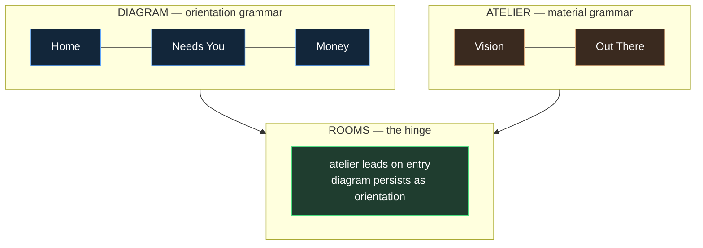
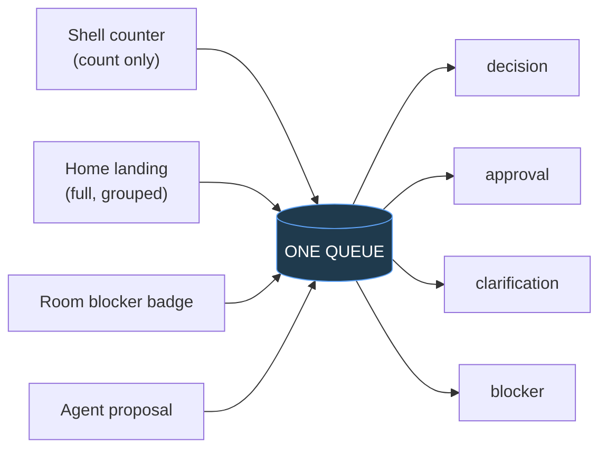
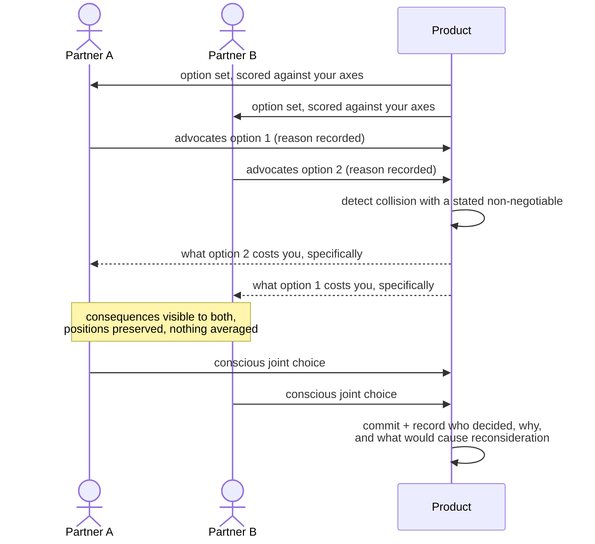

# 0041 · Design Spec — Homeowner Experience

> The brief Claude AI Design builds the frontend from, in collaboration with the coding agent.
> Direction resolved through Impeccable: seed `70a4d826`, mode **Operate**, grounded direction 7 of 7 by resonance (transit wayfinding), corrected by the product doctrine to **"Diagram outside, Atelier inside."**

---

## 1 · Direction contract

**THESIS** — A remodel is a network, not a checklist. Wayfinding systems discard geographic truth to answer the only questions that matter under stress: where am I, what connects, what comes next. That grammar carries orientation and *only* orientation. It refuses the KPI-tile dashboard the category ships, and it stops at the door of every surface where the homeowner is supposed to feel something.

**OWN-WORLD** — Two layers, never blended into a compromise.

- **Diagram.** Room lines in permanent functional color. Uniform node dots for stops, ringed double-circles for interchanges. Strokes at 45°/90° **only where the geometry encodes a relationship**. One line weight per meaning. Tiny set-caps grotesk labels. Hairline ground. No card wrappers, no button shells, no borders-for-decoration.
- **Atelier.** Imagery at real scale, not thumbnails. Material shown as material. Side-by-side comparison as a first-class layout. Room-rich, tactile, warm. Provenance stays legible but recedes.

**STORY** — The homeowner arrives unsettled and mid-process. They see the whole project in one read, learn what is owed to them, step into a room that looks like the life they are trying to build, make one decision with its consequences visible, and leave with the project measurably closer to something a professional can act on.

**FIRST VIEWPORT** — Home is the project diagram, full-bleed. Room lines run the width, each carrying its stop marker, money against plan, and an attention badge. One threshold rule crosses every line. Needs You is docked at the interchange, honest and short. The shell carries only a count.

**FORM** — Grounded direction 7 of 7, seed `70a4d826`. Landing staging: the diagram's native network-with-you-are-here. Dealt **advocacy-quorum** staging adopted for the partner decision screen only, where it is literally true — two people advocate, consequences are visible, nothing commits until a conscious joint choice.

---

## 2 · Which layer leads where

| Destination | Leads | Why |
|---|---|---|
| **Home** | Diagram | The whole point is orientation |
| **Needs You** | Diagram | A queue is structure, not atmosphere |
| **Money** | Diagram | Exposure and consequence are relationships |
| **Vision** | Atelier | If this reads as a database the product has failed |
| **Out There** | Atelier | Finds are objects you fell for; show them as objects |
| **Rooms** | **Both** | Atelier for what it will feel like; diagram for where it stands |



---

## 3 · The Diagram component

### Rules

- **Room line color is permanent identity.** Assigned once, carried everywhere that room appears — budget rows, photo groups, receipts, bids, notifications, the car screen. Functional; never decorative; never re-themed per page.
- **Stops** are the room's real trade progress. Uniform solid dots. The current stop carries a you-are-here marker.
- **Interchanges** are ringed double-circles, used for exactly one thing: the crossing from Out There to In Here.
- **The threshold** is a single rule drawn across every line at the same position. A line that has crossed it reads unmistakably different from one that has not.
- **Geometry discipline:** a 45° turn must mean something. Where nothing is being encoded, use ordinary layout. Decorative diagonals are a defect.
- **Color is never the sole carrier.** Every line has a label; every stop has a shape. Required for accessibility and for the car.

### Anatomy

```
━━━━━━━━━━━━━━━━━━━━━━━━━━━━━━━━━ TRANSLATION-READY ━━━━━━━━━━━━━━━━━━━━

KITCHEN        ●━━━━━●━━━━━◉─ ─ ─ ○ ─ ─ ─ ○      $48,200 / $52,000
               SRC   FIX   ROUGH  FIN   SIGN     ▲ 2 need you

PRIMARY BATH   ●━━━━━●━━━━━●━━━━━◉─ ─ ─ ○        $19,400 / $18,000 ⚠
               SRC   FIX   ROUGH  FIN   SIGN     ▲ 5 parked
               ↳ ↺ 3 reopened · KITCHEN wall relocation, 14 Aug
               ↳ ⚠ tile sub lost · blocks final inspection

DOWNSTAIRS     ◉─ ─ ─ ○ ─ ─ ─ ○ ─ ─ ─ ○ ─ ─ ─ ○  not started
               SRC   FIX   ROUGH  FIN   SIGN

              ◎ ── the interchange ── 12 finds waiting for a room
```

`●` settled stop · `◉` current stop, you-are-here · `○` not reached · `◎` interchange · `↺` reopened by a named cause · `⚠` open impact

### The stop never retreats

**Resolved rule: the stop holds; reopened decisions are a separate marker.**

Work already reached is never erased from the line. When something upstream invalidates a settled decision, the room keeps its position and gains an attributable `↺` beneath it. Primary Bath above is still drawn at `FIN` — because it *got* there — while carrying three reopened decisions and one active impact.

This is the single most important emotional decision in the whole design. The alternative — sliding the marker back to `SRC` — is the exact visual that makes a homeowner feel they lost two months, and it is where projects and partnerships break.

> **No unattributed regression.** Every reopening names its cause. The system explains the fork so a partner or a contractor does not have to.

**Attribution is not blame.** A homeowner is allowed to change their mind, and the marker says so plainly — *"reopened by: your range change, 14 Aug"* — because that is the record of a decision they made, not a mark against them. The copy here must never read as fault. For the bad-faith cases the opposite is true: a contractor's abandonment or breach is named, timestamped, and evidenced, because that record is what the homeowner takes to a lawyer or a licensing board.

### Cost-of-change preview

Shown *before* a change commits, priced against the stage the project is actually in.

```
CHANGING THIS NOW

  committed already      $4,200   vanity ordered, ships 8 Sep
  returnable                 no   past the 30-day window
  change order            likely  GC contract §7 — 15% + materials
  permit                affected  fixture schedule was filed
  timeline                +9 days critical path

  two weeks ago this cost nothing
```

Not a deterrent — the difference between discovering a cost after the fact and choosing it with eyes open. It is the soft-landing principle applied one step earlier, and it is what makes consulting the system first a habit instead of a chore.

### Responsive

| Context | Behavior |
|---|---|
| Desktop | Full network. All lines, all stops, threshold across everything. |
| Phone | Lines become weighted rows; the threshold still crosses all of them. Capture is one-handed and reachable with a thumb. |
| **Tesla / in-car** | **Sets the legibility floor.** Fewest nodes, largest labels, glanceable stop state. Capture and confirm only — no spec editing in a vehicle. |

---

## 4 · Screen by screen

### Home

- Project diagram, full-bleed, above everything.
- Needs You docked at the interchange — grouped **by consequence and decision type**, not by urgency alone. Short and honest; if there are three things, show three things.
- Recent movement: what changed since you last looked, in plain language.
- No KPI tiles. No progress rings. No project-wide progress bar — six rooms at six stops *is* the status.

### Vision — atelier leads

- The **living brief**: desired experiences, rituals, dislikes, must-feel and must-work outcomes, in the homeowner's own words.
- **Named profile up front, axes underneath.** The archetype is a conversation starter, not a destiny.
- Both partners' positions visible side by side. **Disagreement is preserved, never averaged.**
- **Non-negotiables** are explicit objects, per person, optionally per room.
- **Divergence** surfaces as an invitation: *"You started as Jetsons; your last nine choices show low maintenance tolerance and a strong preference for tactile control. Want to update the picture?"* Never a correction, never automatic.

### Rooms — the hinge

- **Entry is atelier.** What this room will feel like: references, renders, materials at real scale, the selections you have made shown as objects rather than rows.
- **Orientation persists.** The room's own line and stop state stay visible without competing.
- **Spec work happens in place.** No modal for specification; modals are for assignment only.
- **The threshold is explained, never merely enforced.** A blocked room names the exact missing field and links to where to resolve it.
- Every value carries confidence: `known` · `assumed` · `range` · `unknown`. **False precision is the failure mode**; an honest `unknown` is a valid, recorded state.

### Out There — atelier leads

- Capture is instant and forgiving; enrichment happens after.
- Agents propose a destination **with the reasoning shown** — ranked candidates and the evidence that supports or eliminates each room.
- **Nothing crosses on its own.** The human confirms the room and the governing intent.
- Parking is a first-class action, not a failure to decide. A parked find keeps *why it mattered*.

### Money — diagram leads

- Committed vs. paid vs. exposed, per room, in the room's own color.
- Consequence framing: what this choice costs somewhere else.
- **Soft landing** whenever a constraint kills the preferred option: preserve the governing intent, generate at least one alternative that honors it differently, show consequences across budget, schedule, maintenance, aesthetics, function, and dependencies — then let the homeowner choose. Never jump to the cheap substitute.

### Needs You — one queue, two entry points



---

## 5 · Partner alignment — advocacy-quorum staging

The one place the dealt staging is literally true.



- Optimize for: **protect non-negotiables, expose consequences, seek a conscious joint choice.**
- Never: silently split the difference, hide one partner's position, or let a professional's preference stand in for an agreement that did not happen.

---

## 6 · Motion

- **One** orchestrated behavior in the product: a find drawing into an interchange when it is committed to a room. That single motion carries the whole thesis.
- Nothing else animates. No scattered hover effects.
- Reduced-motion: the find snaps to its committed position.

---

## 7 · Accessibility and the physical scene

- Line color never carries meaning alone — label plus stop shape, always.
- Contrast and hit targets set by the **in-car** case, not the desktop.
- The showroom case sets one-handed reach for capture.
- Plain language is an accessibility requirement here: a first-time remodeler must be able to act without domain vocabulary, and every professional term appears with its plain-language explanation alongside.

---

## 8 · The living graph

The Diagram gains a second reading: not just *where things are*, but *what is happening to them and what that threatens*.

### Blast radius

When a node is unhealthy, the connected nodes it puts at risk are highlighted **in the same view** — never in a separate report. The homeowner sees the reach of a problem before it lands on them.

```
     ⚠ tile sub lost
     │
     ├─ delays ──────▶ PRIMARY BATH ─── blocks ──▶ final inspection
     │                      │
     │                      └─ reopens ──▶ shower surround
     │                                        └─ reopens ──▶ niche dimensions
     └─ inflates ────▶ bath labor ─── threatens ──▶ KITCHEN contingency
```

- **Health is derived, never stored** — a function of open impacts and everything blocking them. Same discipline as readiness: one resolver.
- Severity reads through weight and state, not through alarm color alone. A project with three yellow nodes must not look like an emergency.
- An impact carries its own provenance chip: rule · agent · conversation · contractor · homeowner · integration.

### Traversal over time

The graph is navigable **zoomed out, zoomed in, in the moment, and over time**. Scrubbing back shows what the project looked like before a fork — which is how anyone reconstructs "how did we get here" without a person having to narrate it.

- Zoomed out: the whole project as nodes and edges, health visible, history scrubbable.
- Zoomed in: one room's own chain of causes.
- The default view is always *now*; history is entered deliberately, never as a surprise.

---

## 9 · Conversational capture — assistant-ui

The graph only exists if entering it is cheap and immediately rewarding. Forms will not produce it. The capture surface is a **threaded agent conversation** built on `assistant-ui`.

- **Voice transcription** is first-class, not a fallback. The real capture moment is someone standing in a half-demolished room, or driving away from a site.
- **Generative UI for the confirmation loop.** The agent restates what it understood as a structured proposal — impact, targets, effects, confidence — and the user corrects it visually *and* verbally until it is right. Nothing commits before that.
- **Full MCP parity.** The same capture works from a chat session in the car, on site, or at the desk.
- The thread is the audit trail. What was said, what the agent understood, what the human corrected, and what was finally committed all stay attached to the impact.

**Rule:** the conversation may propose anything and commit nothing. Consequential writes need the confirmation step, exactly as everywhere else in the product.

---

## 10 · Forecasting surfaces

Two tiers, visually distinct, never blended. Blending them is how the feature becomes noise.

| | **Alarm** | **Watch list** |
|---|---|---|
| Bar | Named trigger + evidence + a mitigation already started | Known category risk for this area or project type |
| Reads as | Something is happening to *your* project | Something to expect, explicitly not a prediction |
| Placement | Needs You, and on the affected node | A quiet standing panel; never in the queue |
| Without its evidence | **Does not render at all** | n/a |

- Every alarm ships with its **pre-staged mitigation** — the point is that the homeowner is never flying blind, and never has to invent a response under stress.
- An alarm is a **conversation point**, and is presented as one: shareable to a partner and to the contractor, so the group prepares together instead of discovering separately.
- Locality intelligence renders as what it is: *"Permits of this type in this jurisdiction have run 60–90 days"* with its source, not as a confident date.
- **Unknown stays first-class.** A forecast with no basis is not shown. False precision is the failure mode here more than anywhere else in the product.

---

## 11 · Anti-goals

KPI tiles · progress rings · indigo/teal SaaS accent · cream-and-serif "artisanal home" editorial · gamified celebration of spend · a single project progress bar · decorative diagonals · fear-based framing · a 140-link sitemap wearing softer labels · contractor software with a homeowner skin · mood-board-toy surfaces that never become dimensions, materials, tolerances, costs, owners, and evidence.
