# 0041 · Homeowner Experience — "Diagram outside, Atelier inside"

> **Status:** proposed · **Slug:** `homeowner-experience` · **Filed:** 2026-07-30
> **Preview changelog:** https://core-remodel.hacolby.workers.dev/admin/changelog/preview/homeowner-experience
> **Plan board:** https://core-remodel.hacolby.workers.dev/admin/plans/homeowner-experience

---

## 1 · Context and problem

### What exists

- A single Cloudflare Worker running a real renovation with real data: 146 showroom stores, real products, price observations, visit logs, drives, park-finds, budget items, measurements, permits, receipts, and a working MCP tool surface.
- **140 Astro pages**, nearly all under `/admin/*`, behind one shared access gate.
- Navigation split by **job type** — Plan / Budget / Contractors / Shopping & Sourcing / Photos & Renders / Documents / System — roughly 60 sidebar leaves, four levels deep under Shopping.

### Why that cannot go public

- The page count is an **implementation inventory, not an experience architecture**. It is an org chart of the software, not a map of the homeowner's problem.
- It leaves coordination as the user's job. `PRODUCT.md` says coordination is *ours*.
- It assumes an expert operator who already knows the domain. The public product's primary user may never have remodeled anything.

### The governing insight

> **The adversary is drift, not the contractor.**
> Intent degrades when it is scattered across memory, screenshots, texts, vague allowances, and disconnected tools. Every exploit a homeowner suffers — the protective overbid, the "I'm not a marriage counselor" dodge, the wedge driven between two partners — needs **ambiguity** to operate in. Specification does not armor the homeowner against people; it removes the thing the exploit requires. Which is why it also helps a *good* professional: they want an unambiguous scope too.

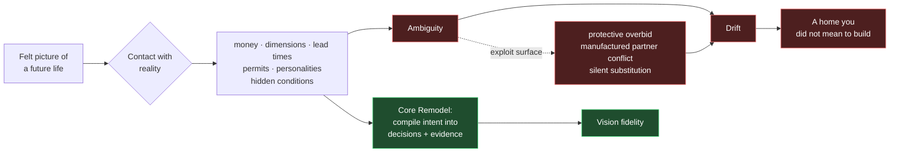

---

## 2 · The product model

Core Remodel is a **homeowner Vision-to-Reality operating system**. Not project management, not a marketplace, not a rendering tool, not a risk dashboard.

### Three systems at once

| System | Gives the homeowner | Prevents |
|---|---|---|
| **Possibility** | A place to discover, compare, visualize, and articulate the life they want | The dream reduced early to a contractor's easiest default |
| **Coordination** | One shared current state across rooms, money, sourcing, decisions, people, next actions | The homeowner becoming the unreliable human integration layer |
| **Evidence** | A durable record of scope, approvals, measurements, receipts, changes, field reality | Memory disputes, silent drift, orphaned decisions, expensive ambiguity |

### The compiler

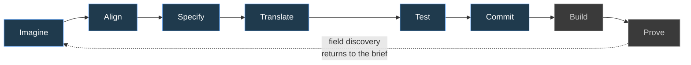

### The four truths

The moat is not any single truth — it is the **relationship** between them. A render knows which products and dimensions it represents. A purchase knows which room decision authorized it. A site issue knows which intent and budget it threatens.

| Truth | Contains | Failure when isolated |
|---|---|---|
| Aspiration | Desired life, feeling, aesthetic, function, priorities | A beautiful concept with no build path |
| Decision | What was chosen, rejected, deferred, approved, and why | "I thought we decided…" |
| Market | Products, vendors, bids, lead times, prices, alternatives | Selections that cannot be bought or compared |
| Field | Measurements, site conditions, installed work, photos, issues | A digital project that diverges from the actual house |

---

## 3 · Information architecture

**Seven destinations. Six ship in v1.** Pages remain implementation details behind these jobs; the goal is not to make every page discoverable, it is to make the next meaningful action obvious from context.

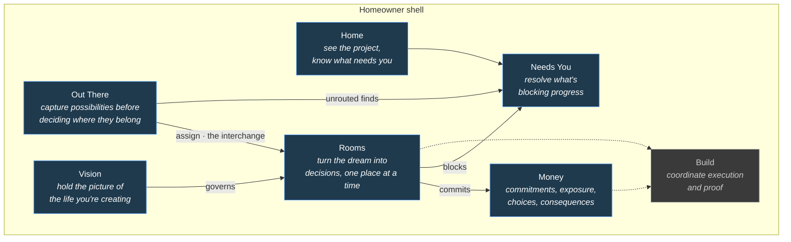

### IA rules

1. Organize around homeowner jobs and project state, never database nouns or admin modules.
2. The **room is the durable cross-phase anchor**, but whole-project lenses are allowed for money, schedule, people, and risk. Do not force project-wide concerns into a fake room.
3. Surface only the controls needed at the homeowner's current maturity and project phase.
4. **One Needs You queue** behind every badge, landing prompt, room blocker, and agent request.
5. Out There → In Here is a first-class intake workflow: capture quickly, enrich, suggest destination, **require human commitment**.
6. Every significant object carries provenance, status, next action, related room, governing decision.
7. Power users search and jump directly; first-timers never learn the sitemap.

### The navigation test

> From any screen a homeowner can answer three questions: **Where am I in the project? What changed? What needs me next?**

### Triage of the existing 140 pages

Every page is scored, with an owner and a reason. This is a Phase 0 deliverable, not a side effect.

| Question | Signal |
|---|---|
| Which homeowner job does this advance? | No clear job → out of public navigation |
| What event brings someone here? | No natural entry event → merge into a parent context |
| What action leaves the page? | Read-only inventory → embed where it becomes useful |
| Room-, project-, or portfolio-scoped? | Mixed → split views or add an explicit lens |
| Can it be a drawer, panel, section, or filtered state? | Yes → reduce the route count |
| Does a beginner need it now? | No → progressive disclosure or power mode |
| Does it duplicate status found elsewhere? | Yes → single source, link to it |

---

## 4 · The visual direction

**Diagram outside. Atelier inside.**

Selected via the Impeccable direction roll (seed `70a4d826`, grounded direction 7 of 7 by resonance: transit wayfinding), then corrected by the product doctrine — the wayfinding grammar is **orientation only** and must never make a home feel like infrastructure.

| Layer | Carries | Grammar |
|---|---|---|
| **Diagram** | orientation, state, movement, dependency, blockage | Room lines in permanent functional color · uniform node dots · ringed interchanges · 45°/90° **only where geometry encodes a relationship** · tiny set-caps grotesk labels · hairline ground · no card chrome |
| **Atelier** | material, image, comparison, feeling, the felt vision | Generous imagery at real scale · material samples · side-by-side comparison · room-rich surfaces · provenance legible but not dominant |

| Destination | Leads with |
|---|---|
| Home · Needs You · Money | Diagram |
| Vision · Out There | Atelier |
| **Rooms** | **Both — atelier for what it will feel like, diagram for where it stands.** This screen is where the product either works or does not. |

Full detail in [`DESIGN_SPEC.md`](./DESIGN_SPEC.md).

---

## 4b · Remodel type governs the trajectory

Rooms do not operate in a vacuum, and neither do projects. **Why** someone is remodeling changes what money means, who the actors are, and what "done" is. This is a top-level project attribute, not a style profile — and it must be in the schema from day one, because retrofitting it is expensive.

| Type | Motivation | What changes | v1 |
|---|---|---|---|
| **Lifestyle change** | Expand for a growing family; make the layout practical; open the plan so the family feels together | Focal rooms carry high homeowner confidence — and the highest ripple risk, because the homeowner does not yet see the consequences | ✓ |
| **Flip** | Maximize profit | Money surface means margin; "done" means marketable to a broad audience, not to one style profile; portfolio-scoped across 5–6 properties | later |
| **Catastrophic rebuild** | Nature (earthquake, flood, wildfire, landslide) or accident (leak, electrical fire, gas explosion) destroyed part or all of the home | An entirely different flow: insurance claim reporting, pre-loss inventory, public adjuster, defending against bad-faith underpayment that starves the rebuild of capital. Usually in-kind restoration, often no architect | later |

**Catastrophic is deferred, and the space is deliberately held.** The founder is himself a homeowner who suffered one and is still inside it — while *not* following the in-kind mold, having chosen to rebuild to a different layout. That flow needs its own plan: insurance reporting artifacts, inventory capture, budget under claim uncertainty, adjuster guidance, and only then the rebuild.

### 4b.1 · The insurance chapter — specified, deferred

**Purpose, stated plainly:** get the homeowner *through* the insurance fight and out the other side, so they can move on to the remodel. It is not a grievance archive. It is a guide for someone who has lost their home and is now being told the total loss is worth $30,000, that remediation is their bill, that the claim is not covered by an adjuster who never set foot on the property, and that temporary housing will not be paid — for over a year.

**What it does:**

| Capability | Content |
|---|---|
| **Skip the noise — do these now** | An ordered, plain-language sequence for the first days and weeks. Put it in writing. Request the adjuster's report. Read your own ALE / loss-of-use clause. Check whether your policy has an **appraisal clause** — the standard mechanism for a valuation dispute |
| **Hire a public adjuster** | What one does, when it is worth it, how they are paid — plus a directory built from the **state's own licensee list**, which is public record |
| **Know what the law already requires** | Statutory acknowledgment, investigation, and payment deadlines; unfair-claims-settlement-practices statutes; state-specific rules such as minimum ALE durations after a declared disaster. **Every claim cites the statute, the regulation, or the user's own policy language** |
| **Warning signs, anonymized and aggregate** | What homeowners in this state are reporting *right now* as patterns — denial of temporary housing, valuation far below replacement cost, coverage denial without a site visit. Patterns, never attributed to a named carrier |
| **Your state's own channel** | The Department of Insurance complaint process, linked directly, for the homeowner's jurisdiction |

**Where the line is, precisely.** The risk was never the advocacy — it is a **published factual claim about a named carrier's conduct, built on user reports the platform cannot verify**. Everything above sits clear of that line. Carrier-attributed misconduct records and carrier-level scorecards stay out until they have their own review.

> **The defensible version is the stronger product.** A homeowner in a hotel they are paying for does not need a carrier scorecard. They need the appraisal clause in their policy, the deadline their insurer just blew past, the complaint form, a licensed public adjuster, and what to put in writing today. That is more useful *and* it is the version that survives contact with an insurer's lawyers.

**Two rules this flow must carry:**

1. **The insurance chapter is a phase, not a label.** Once the claim closes, the system does not know the user came from a catastrophic loss. They are a remodel user like any other. Someone who lost everything must not be permanently filed under it by the software that helped them get out.
2. **Information, not legal advice.** Explain how coverage disputes work and point to the state's own channels and to licensed professionals. Never tell a homeowner their claim is covered or that they should sue. That boundary is separate from defamation and matters on its own.

Graduates to its own `docs/####_*` bundle when it is scheduled.

---

## 4c · Rooms are not silos — the anatomy is a graph, not a map

A transit map is static topology. What actually happens in a remodel is a **versioned dependency graph**: the original home was designed by architects with a purpose and structure wrapped around it; changing one thing creates static that has to be resolved somewhere else.

### The wound this fixes

A homeowner turns a room to `FINISH_SPEC`, then sees it back at `SOURCING` and asks *how did that happen*. That moment is where projects break — the partner has to become the one who explains the forks, or a flipper blames a contractor who then feels blamed for something that was never theirs.

> **No unattributed regression.**
> A room never regresses mysteriously. Work already done is never erased. A settled decision is **reopened by a named cause**, always.

**Attribution is not blame.** A homeowner is allowed to change their mind, and *"you chose the Wolf over the Invisacook"* is the record of a decision they made — not a mark against them. The rule forbids **unexplained** regression, not human agency.

For the bad-faith cases it inverts entirely: **attribution is the entire point.** A contractor abandoning mid-project, refusing to honor a contract, or acting in bad faith needs a named, timestamped, evidenced record. That is not a UX nicety; it is what a homeowner hands a lawyer or a licensing board.

**Resolved:** the stop holds. Reopened decisions are a separate, attributable marker beside it.

```
PRIMARY BATH   ●━━━━━●━━━━━●━━━━━◉─ ─ ─ ○
               SRC   FIX   ROUGH  FIN    SIGN
               ↳ ↺ 3 reopened · caused by KITCHEN wall relocation
```

### Impacts are a ticketing model, not a room-to-room edge

Ripples are only one source of disruption. A subcontractor is lost, tariffs move material cost, code changes before the permit is filed, demo uncovers asbestos, PG&E will not schedule the service install, weather takes a week. These are the same kind of object: **an Impact**, typed from a definition table, attached to any number of targets, able to **block other impacts**.

**People are a first-class impact source**, not an edge case. The definition table carries a whole class of party impacts:

| Party impact | Notes |
|---|---|
| `homeowner_change_of_mind` | Legitimate and expected. The most common impact in any real project |
| `contractor_terminated` | The homeowner fired them |
| `contractor_abandonment` | They walked |
| `bad_faith` / `contract_breach` / `fraud` | Refusing to honor the contract, misrepresentation, billing fraud — applies equally to a GC, a sub, a vendor, a supplier, or a showroom |
| `sub_loss` | Lost through no one's fault — the sub took other work, went out of business |
| `vendor_failure` | Won't honor a quote, indefinite backorder, discontinued mid-project |

Every party impact carries an **actor party FK** — `actor_party_kind` + `actor_party_id` reaching `household_members`, `companies`, or a vendor/showroom record. A party is referenced by id and joined for the display name. Never a name string on the impact.

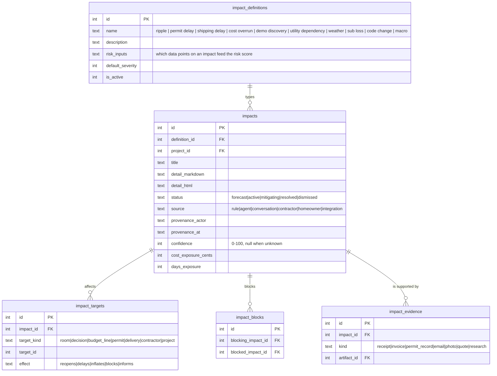

**Note the shape.** `impact_definitions` is a definition table whose `risk_inputs` declares which fields feed scoring, so a new impact type is configuration rather than a migration. `impact_targets` is the mapping table — one impact reaches any number of heterogeneous targets. `impact_blocks` gives the bug-tracker semantics: this one cannot be resolved until that one is.

### Where dependencies come from — all four, each with provenance

| Source | Strength | Why it is not enough alone |
|---|---|---|
| **Known-ripple rule library** | Deterministic, explainable, works on day one with zero history. Move a wall → plumbing, electrical, permit, flooring transition, HVAC | Cannot know your specific weird case |
| **Agent, from decision content** | Catches the specific and the strange; lands as a proposal with reasoning | Must never write unconfirmed |
| **The conversation itself** | When a ripple gets *explained*, that explanation is the capture. Voice in, structured graph out | Requires the conversational surface to exist |
| **The contractor, in the field** | The trade sees ripples first. One tap: "this affects the primary bath," with their name on it | Requires the contractor surface |
| **External / macro** | Tariffs, supply shocks, code changes, sub loss, weather — no room caused these | Needs integrations and research, not inference |

**Nobody will hand-author a dependency graph.** The rule library and the conversation are the two paths that actually produce data; the others enrich.

### Change Impact Assessment — the interview behind a mind change

A change of mind is not a field edit. **What it costs is a function of where the project stands when it happens.** The same swap is free in `SOURCING`, costs a change order in `ROUGH_IN`, and costs a permit revision plus a fabrication change after that.

**Two paths, both supported:**

- **Consult-first** — the homeowner asks the system *before* committing. This is the good path and the product should make it the tempting one.
- **Retroactive** — they already decided, and the system catches up. Always available, never punished.

**The assessment asks, in order:**

| Domain | Questions |
|---|---|
| **Purchases & materials** | Are there existing orders with vendors or suppliers affected? Has the homeowner received the material yet? Do they want to return it? Do the invoice T&Cs allow a return? What is the policy, the window, the restocking fee — and does the homeowner qualify? |
| **Contracts** | Is there a contract in place with the GC or a sub? Does this change touch its scope? Is a **change order** required? What does the contract say the change order costs? |
| **Regulatory** | Does this affect the permit? The drawings? The **structural calculations**? |
| **Timeline** | What does this do to the critical path and to everything sequenced behind it? |

`assessment_question_definitions` is a definition table, so the interview grows without a migration — the same discipline as `impact_definitions`. Each answer is a row carrying its own confidence, evidence link, and cost/days exposure.

### The canonical worked example — the Wolf range

Real cascade, real dependencies, exactly as it happens:

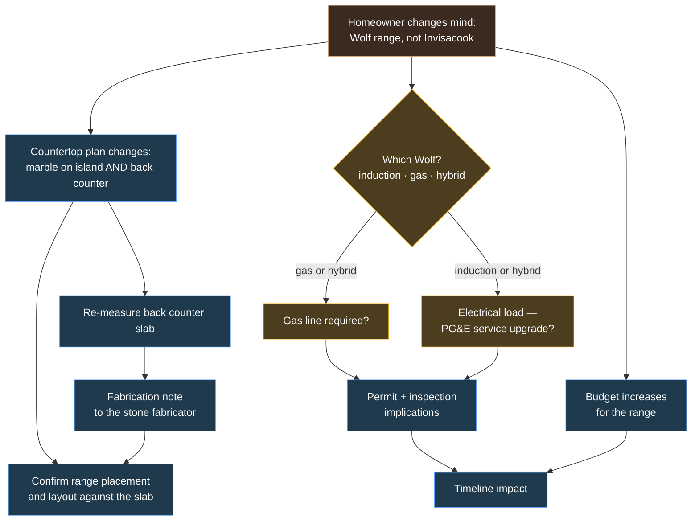

One sentence from a homeowner — *"actually, let's do a Wolf"* — produces a slab change, a budget increase, an open fixture question, a possible utility upgrade, a permit question, a re-measure, a fabrication note, a layout confirmation, and a timeline effect. **Nine consequences from one preference.** This is what the product exists to hold, and it is exactly what a homeowner cannot hold in their head.

### The cost-of-change preview

The incentive that makes consult-first a habit rather than a chore.

Before a change is committed, the system shows **what it costs right now**, priced against the current stage: money already committed, returnability of what has shipped, whether a change order is triggered, permit exposure, and days added. And where honest, what it *would* have cost earlier — *"free two weeks ago, a change order today."*

This is not a deterrent. It is the difference between a homeowner discovering the cost after the fact and choosing it with their eyes open — which is the same soft-landing principle applied one step earlier.

### Node health propagates

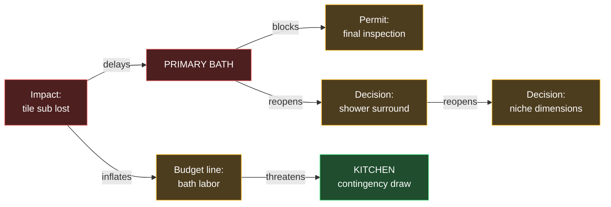

Health is **derived, never stored** — a node's state is a function of its open impacts and everything blocking them. Connected nodes at risk are highlighted, so the homeowner sees the blast radius before it lands.

### Capture is a conversation, not a form

The graph only exists if entering it is cheap and immediately useful. The capture surface is a **threaded agent conversation on the frontend built on `assistant-ui`**, with **voice transcription** and **generative UI** for the confirmation loop — the agent restates what it understood, the user corrects it visually and verbally, and the structured impact lands only once it is right. **Full MCP parity**, so the same capture works from a chat session in the car or on site.

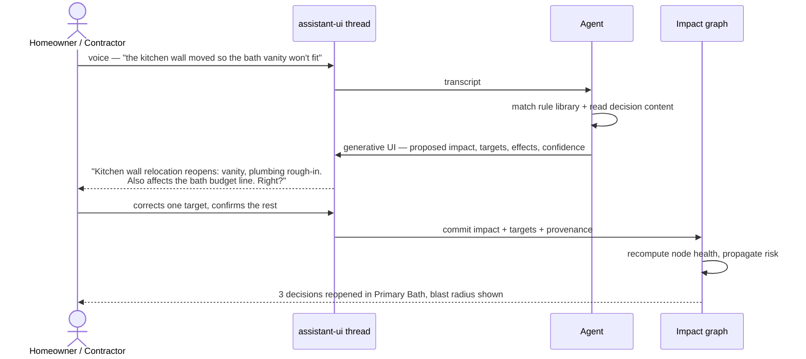

### Traversing it over time

The graph is navigable **zoomed out and zoomed in, in the moment and over time** — the full history of what changed and why. This is what lets a partner or a contractor stop being the person who has to explain the forks.

---

## 4d · Forecasting is the ROI

Forecasting is where the doctrine's **emotional fidelity** criterion actually gets earned:

- The homeowner is mentally prepared *before* a risk becomes real, and recognizes it in the moment.
- Each forecast arrives with a **mitigation already started**, so nobody is flying blind.
- The system is visibly monitoring, proactively, with the contractor looped in — which is what makes the difference between sleeping and not.
- A forecast becomes a **conversation point** for the homeowner, their partner, and their contractor to prepare together, which prevents the friction that breaks these relationships.

### What a forecast is allowed to be based on

**Crying wolf destroys the exact trust this feature exists to build.** Two tiers, hard-separated:

| Tier | Bar | Sources |
|---|---|---|
| **Alarm** | Must name its trigger, its evidence, and a pre-staged mitigation. No basis, no alarm | This project's own permit records, receipts, invoices, quotes, deliveries, contractor flags, open impacts |
| **Watch list** | Quieter tier of known category risks, clearly labeled as *what to expect*, never as a prediction about your project | Area aggregates, historical patterns, locality research |

### Locality intelligence

- **Permit system integration** — already live in this repo for SF. Watch the current project's records, *and* gather trend data: how long this permit type actually takes in this jurisdiction, what inspection issues recur in this area.
- **AI locality research** — the agent researches where the user's project actually is: online forums, local building code, jurisdiction quirks. It becomes locally expert so it can advise and anticipate. Reuses the existing deep-research engine.
- Cross-project pattern learning (this vendor slips, this sub is reliable) is designed for but not shipped — it means nothing until there are enough tenants to learn from.

---

## 4e · Rooms have tense — space versus use

**The kitchen does not move. The space that serves as the kitchen changes.**

This is not pedantry; it is the difference between a model that can express a real remodel and one that cannot. The founder's actual case: the kitchen was going to move downstairs, and instead the upper-floor kitchen and living room are **trading places**. Nothing is relocating — two spaces are exchanging uses.

The existing schema already has the right primitive, and its own docstring names this exact scenario:

- **`rooms`** is the **space**. `roomCode` is its stable slug and never changes.
- **`remodel_scenarios`** — *"Top-level redesign/relocation scenarios. Example: 'Kitchen to lower family room'."*
- **`scenario_room_plans`** — *"Lets an as-is room be repurposed into a to-be usage."* `roomId` is the space; `proposedUse` is what it becomes.

A relocation is therefore expressible without any new concept: put a plan row on the downstairs space with `proposedUse: "kitchen"`. Reuse these; do not invent a parallel model.

### The path reference needs a tense

`${room.floor}/${room.name}` is the right display identity — hierarchical, human-readable, unambiguous to the trade, sorts and groups for free, and it settles most of what room colour was reaching for. But it is **time-dependent**:

| Tense | Before the swap | After the swap |
|---|---|---|
| **as-is** | `Upper Level/Kitchen` | `Upper Level/Kitchen` — the space that *is* the kitchen today |
| **to-be** | `Upper Level/Kitchen` | `Upper Level/Living Room` — that same space, once the plan lands |

After a swap, an untensed `Upper Level/Kitchen` refers to **two different physical spaces** depending on which one you meant. So:

- **Every room reference resolves against a tense**, and the tense is explicit wherever both could be meant. Bare paths are as-is.
- **The space's `roomCode` is the join key.** The path is display, never identity — the same discipline as `properties.label`: relate by id, join for the name.
- When discussing plans, the product says `Lower Level/Kitchen` and means *"the space that will be the kitchen, which is downstairs."* That sentence is the acceptance test for whether the system understood.

### Paired moves — the one real gap

`scenario_room_plans` can express each half of a swap, but nothing binds them. **Two spaces trading uses is one decision, not two**, and neither half is coherent alone: approving "upper NE becomes living room" without "upper SW becomes kitchen" leaves a house with no kitchen.

Model the pairing rather than trusting a human to remember it — two plan rows that must be approved, costed, and rippled together. This is the same mutual-blocking shape as `impact_blocks`, pointed at plans.

### A room move is a large-ripple decision

Changing what a space is used for is among the highest-ripple decisions in a remodel, and the rule library must know it: plumbing, gas, electrical load, ventilation, structural floor loading, permits, and — in a swap — the paired space, all at once. `ripple_rules` gets a `use_change` and a `use_swap` trigger.

---

## 4f · Home is the floorplan, not a drawing

**Correction to the comps.** Home is not a diagram to be rendered — it is the **floorplan the project already has**, with clickable room dots, which exists today at `/floor-plan` and is backed by real columns on `rooms`: `floorplanFloorKey`, `floorplanXPct`, `floorplanYPct`, and the region bounding box.

The homeowner sees where a room *is* while choosing it. Placement is information, and a parallel-track abstraction throws it away.

That reframes the whole rendering question:

| Surface | What it actually is | Built with |
|---|---|---|
| **Home** | The floorplan with room dots, carrying stop state, money against plan, and attention badges | The existing `/floor-plan` implementation, extended. **Layout and hairlines — no diagram engine.** |
| **Blast radius / dependency lens** | A node-link graph where lines cross | **`mind-elixir`**, already in production here in four components |
| **Money — committed → paid → exposed** | A flow | **`@visx/sankey`** + `d3-sankey`, already installed |
| **Docs and plan diagrams** | Declarative diagrams | **`mermaidcn`**, already present |

**Do not hand-roll SVG for any of these.** Every capability above is already installed and, in the case of `mind-elixir`, already used in production in this repo. An earlier draft of this plan was heading toward custom SVG for the Home diagram; that was the wrong instinct and it is recorded here so it is not repeated.

### What room colour is actually for

Narrowed, after review. Colour is **weak for identification and strong for path-tracing**:

- On the floorplan and in lists, a room is identified by its **path** and its **position**. The name is always present, so colour there is decoration.
- In the **dependency lens**, where lines cross at a shared wall or a shared panel, colour is the only thing that lets the eye follow one line through a junction — there is no room for a label at a crossing.

So: **colour belongs to the dependency lens, not to room identity.** A blast-radius view shows three to six rooms, never nineteen, which makes the palette trivially discriminable and retires the whole "nineteen mutually distinguishable hues" problem. `rooms.lineColorHex` stays, scoped to that job.

This also survives colour-vision deficiency and the in-car screen, which the original identity-based scheme did not.

---

## 4g · Permits are a jurisdiction capability, not a feature

The SF DBI integration is real and stays. **It is also not generalisable**, and the plan must not assume it is.

San Mateo is one county away and does not publish permits online at all. Every jurisdiction has its own schema, its own portal, or no portal. Building "permits" as though it were one integration would produce a product that works in exactly one city.

### The model

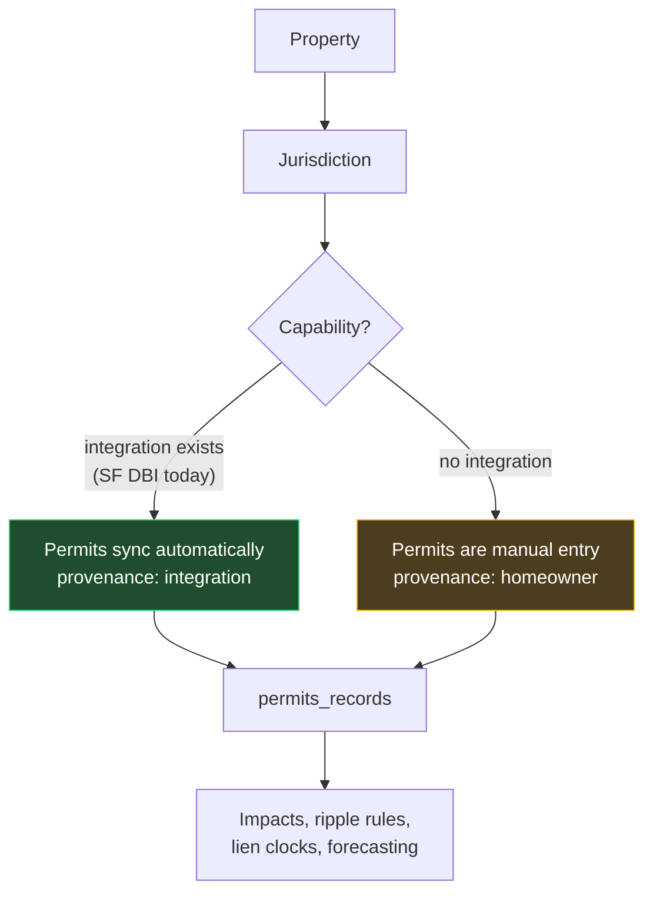

- A property has a **jurisdiction**, and a jurisdiction has **declared capabilities** — permit search, permit detail, inspection history, assessor parcel keys, none.
- Where a capability exists, data syncs. Where it does not, **manual entry is the normal path, not a degraded one.** For v1 that is most users.
- **Assessor block and lot stay, and stay optional.** They are not SF trivia: block/lot is the one key that recurs across otherwise incompatible DBI schemas, which makes it the closest thing to a portable permit join key. Present where the jurisdiction uses it, null where it does not.

### The consequence nobody would notice until it bit

Two downstream systems assume permit data has a provenance they can trust, and they must not:

1. **Ripple rules** that fire on "permit filed" have to work identically when a human typed it. A rule keyed to an integration event silently never fires for a manual-entry user — which is a rule that is broken for most of the market and looks fine in testing.
2. **Forecasting's evidence gate** must distinguish sources. An alarm evidenced by a jurisdiction feed and one evidenced by *the homeowner asserting a date* are not the same confidence and cannot render identically. The evidence row already carries `kind` and `recordedBy`; the alarm surface must use them rather than treating all evidence as equal.

Both are cheap now and expensive later.

---

## 5 · Schema deltas

### Room lines and readiness

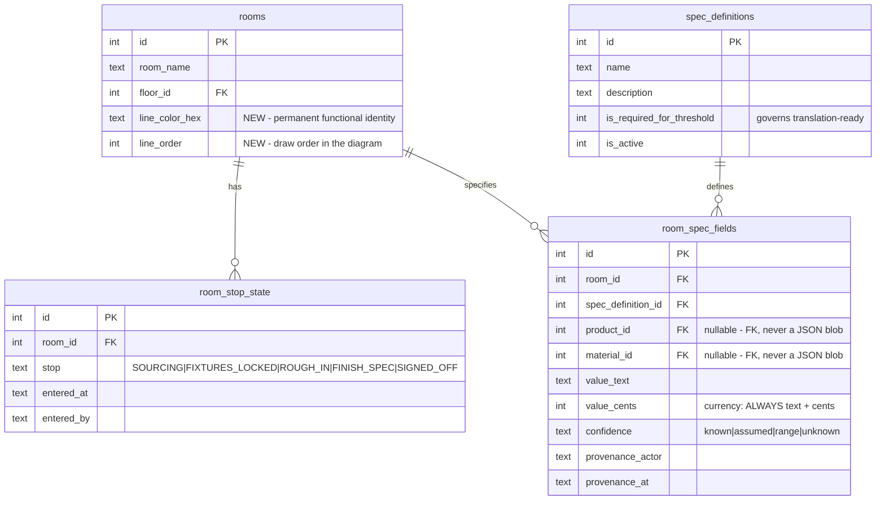

### Style profile — named up front, axes underneath

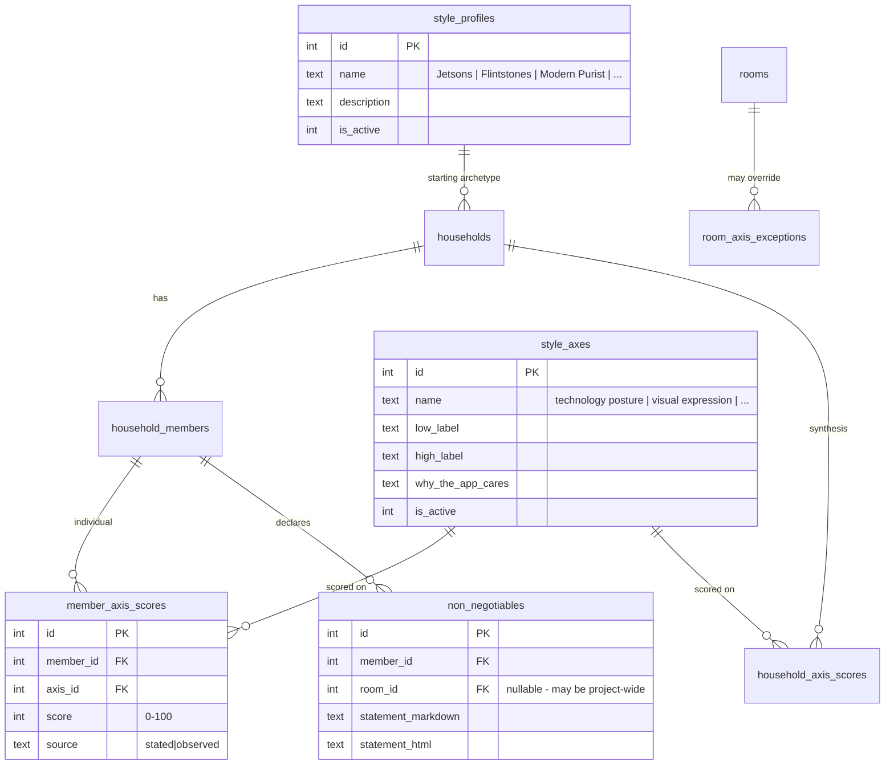

**Note the shape:** eight axes are a **definition table**, member scores are a **mapping table**. No delimited strings, no JSON blob of preferences. Disagreement is preserved by storing per-member scores alongside the household synthesis — the product never averages two people into mush.

### Out There → In Here

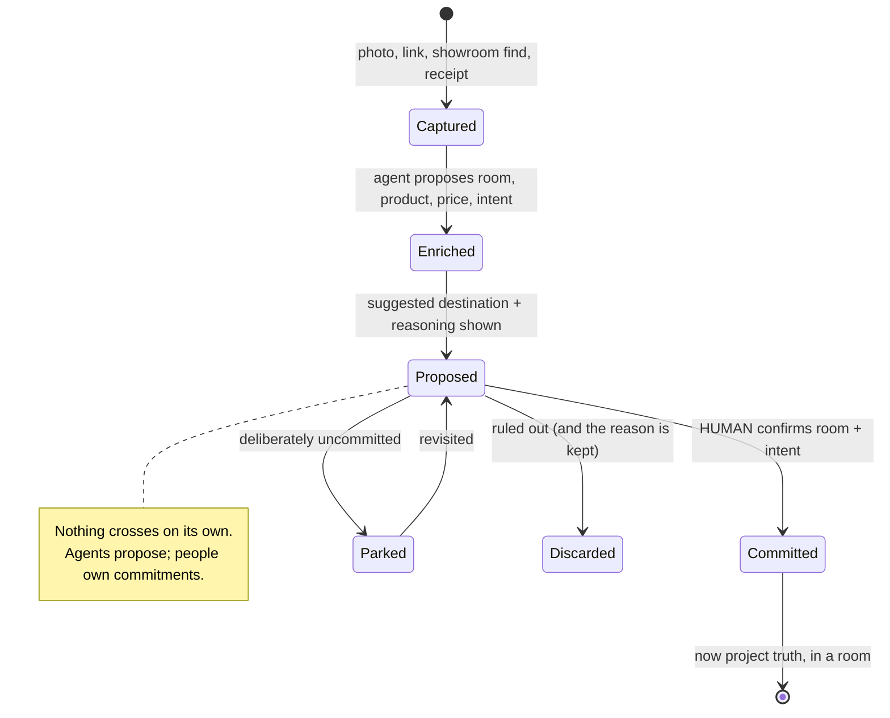

### The interchange, end to end

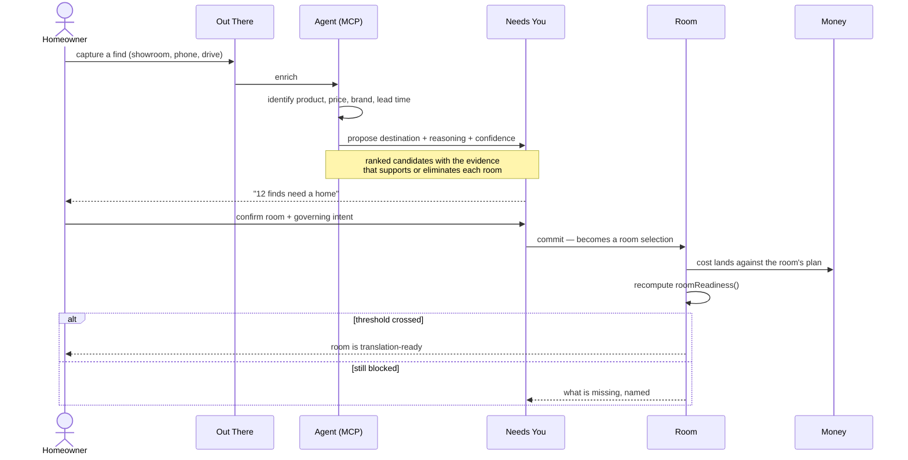

### The room lifecycle

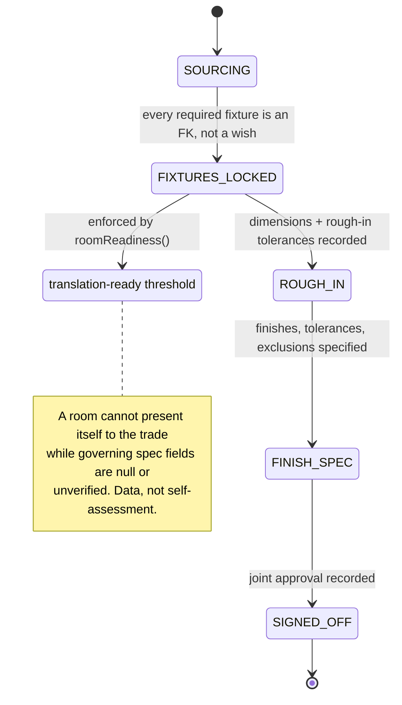

---

## 6 · Phases

| Phase | Name | Outcome |
|---|---|---|
| **0** | Foundation & truth | 140-page triage; project type; room line identity + stop state; spec fields; **the decision graph**; **impact definitions, impacts, targets, blocking**; the single readiness resolver; the health resolver |
| **1** | Shell & Home | Six destinations mount; the Diagram component; one Needs You queue behind landing + shell counter |
| **2** | Vision | Profiles, axes, non-negotiables, partner alignment, divergence detection |
| **3** | Rooms | The room workspace — atelier + diagram — the enforced threshold, and the **reopened-decision marker** |
| **4** | Out There | Capture → enrich → propose → human commit; the interchange |
| **5** | Money | Budget, commitments, exposure, bids, soft landing |
| **6** | **The living graph** | Impact surfaces, blocking semantics, derived node health with blast radius, the traversable history — zoomed out, zoomed in, over time |
| **7** | **Conversational capture** | `assistant-ui` threaded agent, voice transcription, generative-UI confirmation loop, full MCP parity |
| **8** | **Forecasting & locality** | Evidence-gated alarms with pre-staged mitigations; the watch list; permit-system integration for current-project watching and area trend gathering; AI locality research on code and forums |
| **9** | *(deferred)* | Build; trade-ready package + vendor quote flow; contractor portal; designer/architect surface; flipper portfolio mode; **catastrophic rebuild + insurance flow** |

Task rows live in [`TASKS.json`](./TASKS.json) and mirror `plan_tasks` 1:1.

---

## 7 · Success criteria

| Signal | A good result looks like |
|---|---|
| Comprehension | A first-time homeowner can explain the six destinations after a short tour |
| Orientation | Every screen reveals room/project scope, current state, and next action |
| Emotional fidelity | Vision surfaces feel like the homeowner's future home, not a compliance database |
| Decision quality | Tradeoffs show the governing intent and downstream consequences |
| Complexity control | Advanced detail appears when the project needs it, not all at once |
| Orphan rate | Products, changes, messages, and costs disconnected from rooms and decisions → approaches zero |
| Translation readiness | An outside professional can identify scope, open questions, exclusions, and governing intent without a live walkthrough |

---

## 8 · Risks

| Risk | Mitigation |
|---|---|
| Wayfinding grammar makes a home feel like infrastructure | Diagram never leads inside Vision or Rooms; atelier surfaces get real image scale, not thumbnails in a data table |
| 45°/90° geometry wastes width and turns decorative | Geometry only where it encodes a relationship; everything else is an ordinary layout |
| The enforced threshold becomes a wall a homeowner cannot pass | Every block names the exact missing field and links to where to resolve it; `unknown` is a valid recorded state, and a deliberate unknown can be waived with a reason |
| Two readiness implementations drift | One server-side `roomReadiness(roomId)`; the badge, the threshold, and any future contractor gate all call it |
| Profile becomes a cage | Axes underneath; room-level exceptions; divergence surfaced as an invitation to update, never a correction |
| Building six destinations at once produces six half-surfaces | Phase order is strict; Phase 3 (Rooms) is the make-or-break and gets the most room |
| Public work destabilizes the live single-tenant system | Net-new routes alongside; `/admin/*`, `nav-groups.ts`, and today's dark theme are untouched |
| **The dependency graph stays empty because nobody authors it** | The rule library seeds it deterministically on day one; the conversation is the primary authoring path; the agent and the contractor enrich. A graph that requires manual curation is a graph that will not exist |
| **Forecasting cries wolf and destroys the trust it exists to build** | Hard two-tier separation. An alarm without a named trigger, evidence, and a pre-staged mitigation cannot render. The watch list is visibly not a prediction about your project |
| **The reopened marker becomes a wall of shame** | Work reached is never erased; the cause is always another decision or an impact, never a person; the marker reads as attribution, not fault |
| **Impact types multiply into an unmaintainable enum** | `impact_definitions` is a definition table whose `risk_inputs` declares its own scoring fields — a new type is configuration, not a migration |
| **Node health becomes stale or contradictory** | Health is derived, never stored. One resolver, same as readiness |
| **Catastrophic/insurance gets built ad hoc because the founder is living it** | Explicitly deferred with its space held; the crowd-sourced insurer-behavior idea gets its own review before any of it is built |

---

## 9 · Verification

- **QC script per PR:** `scripts/qc/pr_<n>.mjs` using the shared helpers, run against **both** the branch preview (`--preview`) and production.
- Migrations applied with `pnpm run migrate:remote` only, verified on remote before merge.
- Readiness resolver gets a direct unit check: a room with a null required spec field must never report translation-ready.
- Every phase updates `plan_tasks` as it moves — `in_progress` → `in_review` + PR → `done`.

---

## 10 · Open decisions — do not invent

- Product name (working: **Core Remodel**).
- Pricing strategy and which capabilities sit behind an upgrade.
- Tenant/account model, partner co-ownership, invite flow, per-tenant isolation.
- Contractor authentication vs. today's token links (`/bid/[token]`).
- How `/admin`'s operator views eventually collapse in, or retreat behind a power-user door.
- Doctrine §14 Q01 / Q05 / Q06 — dominant emotional promise, the success moment, and what the product must never become. Working defaults in use; not decisions.
- **Whether the trade-ready package belongs in v1.** The founder called it "the highest-leverage screen" and then did not select it for the first mainstream release. Recorded here as: design the spine so it cannot be precluded, ship it immediately after. Flag if that reading is wrong.

### Resolved and moved out

Two decisions this plan carried as open are now answered, and large enough to have their own bundle: **[0042 Contract Intelligence & Disputes](../0042_contracts_disputes/IMPLEMENTATION_PLAN.md)**.

- *What bad-faith records are for* — resolved as **full visibility and a true accounting that survives a dispute**, because a bad-faith actor's winning strategy is induced amnesia. Append-only timestamped evidence, independently tracked contested items, violation flagging with required citations, licensing-board complaint drafting, and a replacement-contractor handoff package. Builds directly on this plan's impact graph: a dispute is an impact with a sub-graph, and its branches are `impact_blocks` edges.
- *How machine-readable contracts and vendor T&Cs need to be* — resolved as **critical**, feeding pre-signature review, change-order awareness, payment-schedule QC, and vendor recourse. It is what lets this plan's Change Impact Assessment answer its own contract and purchases questions instead of asking the homeowner to go read an invoice.
