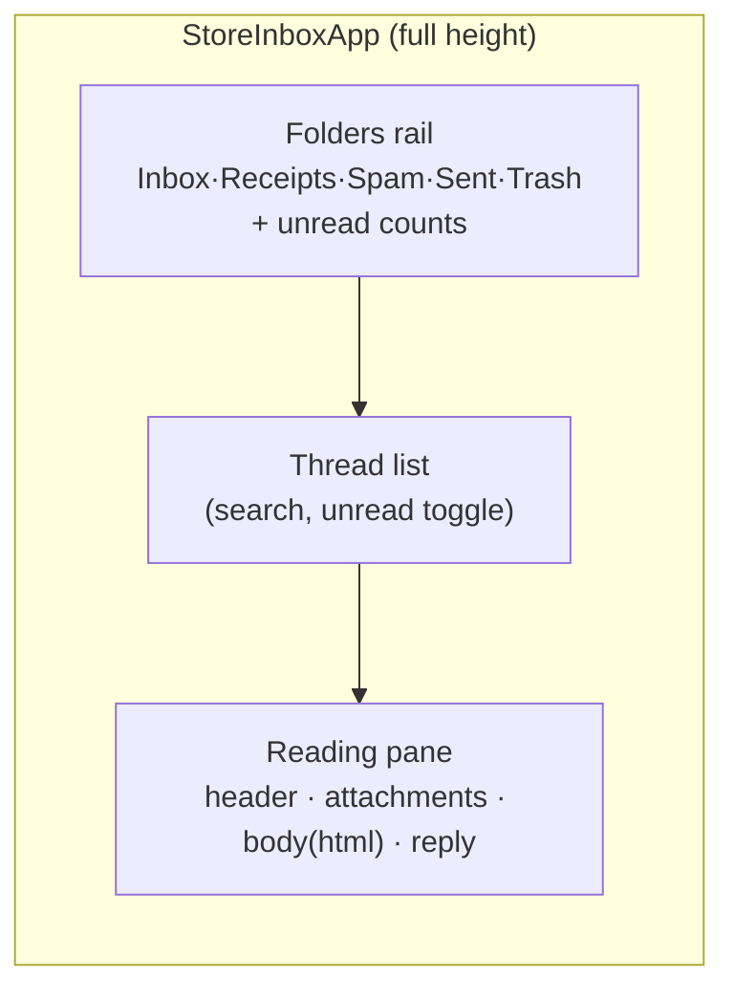

# 0041 — DESIGN_SPEC: Full-page Store Inbox

Route: `/admin/shopping/store/[id]/inbox` — thin Astro shell → `StoreInboxApp`
island, wrapped in `<BaseLayout>`. Full-width (no `max-w`). Base UI shadcn
primitives (NOT Radix). Reuses `gmailApi`, message/thread types, and
`OverviewNoteEditor` (PlateJS).

## Layout — sidebar-09 three-column mail, hand-ported

- **Folders rail** (icon rail, ~64px collapsed / labeled): Inbox, Receipts,
  Spam, Sent, Trash. Each shows its unread/count. Drives `?folder=` on the
  `threads-by-domain` call. Header shows store name + "auto-scoped" chip so it's
  clear only this showroom's mail appears.
- **Thread list** (~320-360px): reuse `GmailThreadList` look — sender, date,
  subject, 2-line teaser, unread dot. Search + "Unreads only" switch.
  Row actions on hover: mark read/unread, delete (→ Trash).
- **Reading pane** (fills rest): sender/recipients/date header; **attachment +
  embedded-image strip** (thumbnails for images via `deliveryUrl`, file cards
  for docs); HTML body (sanitized) with quoted-reply trimmed behind a
  "show trimmed" `…` toggle (Gmail-style); reply composer at bottom.

## Reply composer

- **PlateJS** (`OverviewNoteEditor variant="page"`), emits `{markdown, html}`.
- Toolbar (built-in): headings, bold/italic, lists, links. Attach + inline-image
  buttons. **AI-draft** button (fixed) fills the editor from `/draft-assist`.
- **MCP hint line** under the composer:
  > 💬 Prefer to answer by chat? Ask your MCP tool: **"reply to gmail thread
  > `{threadId}` for {storeName}"** — it can draft and send from here.
  (Gives the assistant the exact thread id to act on.)
- Send → `POST /threads/:id/reply { html, markdown }` (HTML MIME).

## Folder semantics

| Folder | Filter |
|---|---|
| Inbox | `isSpam=0 AND deletedAt IS NULL` (normal + receipts) |
| Receipts | `classification IN (receipt,invoice,quote) AND deletedAt IS NULL` |
| Spam | `isSpam=1 AND deletedAt IS NULL` — each row shows its `spamRationale` chip |
| Sent | locally-inserted reply/compose rows |
| Trash | `deletedAt IS NOT NULL` |

## States

- Empty folder → muted "No mail in {folder} for {store}."
- Loading → skeleton rows.
- Reading pane empty → "Select a message."
- Spam row → small amber `Spam · {rationale}` badge; Receipt row → `Receipt` badge.

## Parity / reuse

- Do not pull `sidebar-09` via `shadcn add` (rewrites shared primitives). Port
  its visual structure onto existing `ui/` primitives + the current two-pane
  flex from `ShowroomGmailPanel`.
- Full-width `<main class="w-full px-4 md:px-8">` per the P1 layout rule.
