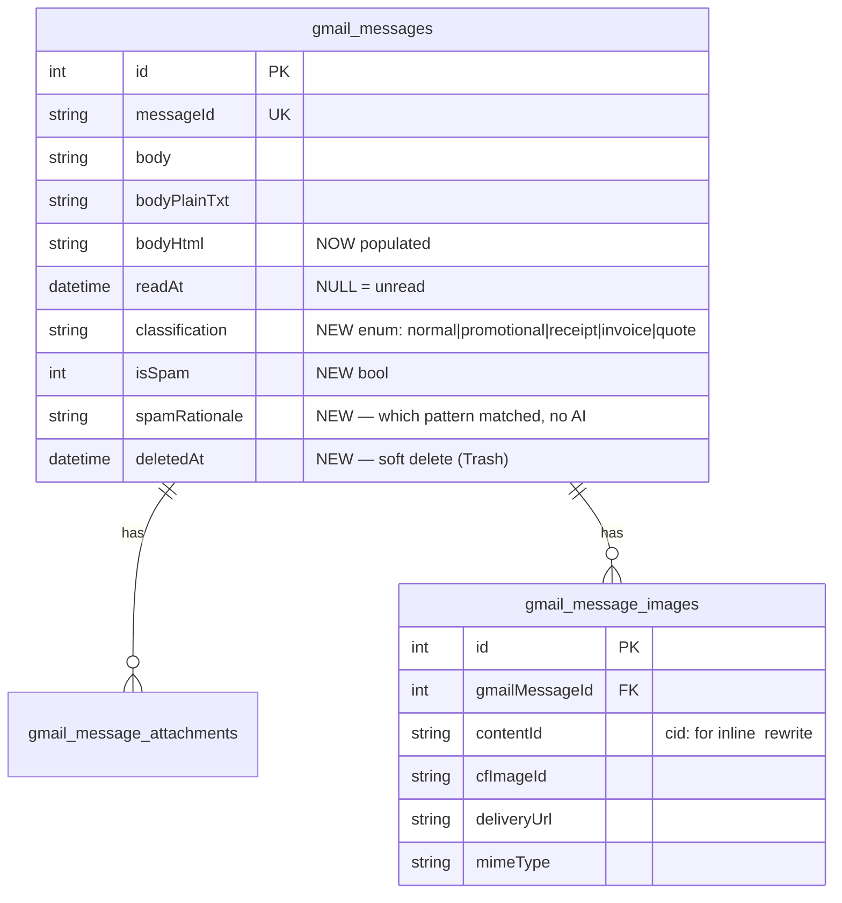
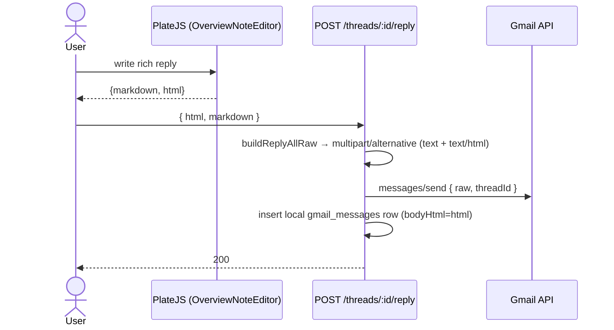

# 0041 — Store Inbox + Ingestion Gating + Full-Width Pages

**Slug:** `store-inbox`
**Branch:** `claude/showroom-inbox-filtering-0294ec`
**Status:** planning (Phase 1 shipped in-branch)

---

## 1. Problem / context

Three connected complaints from the showroom viewport:

- **Layout** — viewport/data pages jam content into a narrow centered column
  (`container mx-auto max-w-5xl`), wasting the full page. Should use full width.
- **Inbox is a cramped inline panel** — the per-showroom inbox is a `h-[560px]`
  collapsible panel inside the viewport; it gets cut off. It deserves its own
  full-page route, auto-scoped to that showroom.
- **Inbox is under-featured & noisy** — no delete / mark-unread, the AI-draft
  button silently fails, replies are plaintext (want PlateJS rich text),
  attachments/embedded images don't render, and marketing blasts flood it.

Prior fix already landed this branch: showroom inbox now matches the showroom's
**own** domain (website + store email) domain-wide and POC/contact emails by
**exact address** (was domain-matching reps at other companies → the flood).
See `buildShowroomMatchSpec` in `services/gmail/participants.ts`.

---

## 2. Current architecture (what exists)

```mermaid
flowchart TD
  cron["cron 15 */4 * * *"] --> A["Path A: ingestCompanyEmails<br/>(ingestion.ts)"]
  cron --> B["Path B: runIngestGate<br/>(ingest-gate.ts)"]
  A -->|"body only"| GM["gmail_messages"]
  B -->|"body + bodyPlainTxt"| GM
  B -->|"bridge raw RFC-822"| PE["processEmail<br/>(services/email/pipeline.ts)"]
  PE --> WE["worker_emails (+ invoices, attachments→R2)"]
  B -.->|"metadata only, no bytes"| GMA["gmail_message_attachments"]
  GM --> API["GET /showrooms/:id/threads-by-domain<br/>(participant match)"]
  API --> Panel["ShowroomGmailPanel (inline, h-560)"]
  Panel --> TL["GmailThreadList"] & TV["GmailThreadView"]

  classDef gap fill:#4d1f1f,stroke:#f87171
  class GMA gap
```

Key facts the plan builds on:

- **`bodyHtml` column exists but is never written** — `extractMessage`
  (`client.ts`) discards HTML, returns plaintext only. Rich HTML lives on the
  bridged `worker_emails.bodyHtml`, joinable by message-id.
- **Attachment bytes** go to `worker_email_attachments` (R2 `emails/{id}/{file}`);
  `gmail_message_attachments` gets metadata only, `r2Key` NULL.
- **Receipt extraction already exists** — `processEmail`→`analyzeAndPersist`
  writes `worker_email_invoices` (`kind: receipt|invoice`) + line items + runs
  material-room deduction. Path B already bridges every gated message into it.
- **CF Images helper** — `ImageProcessorService.uploadToCloudflareImages()` +
  `getDeliveryUrl()` (`services/image-processor/service.ts`).
- **No delete / mark-unread routes; no HTML reply path; no quote-trimming.**
- **draft-assist** exists (`POST /draft-assist`, Workers AI llama-3.3) but its
  `catch` swallows every error into a generic 500 — prime suspect is reading
  `raw.response` when the model returns `choices[0].message.content` (documented
  repo gotcha).

---

## 3. Target architecture

```mermaid
flowchart TD
  msg["raw Gmail message"] --> ext["extractMessage()<br/>+ trimQuotedReply()<br/>+ keep HTML"]
  ext --> gate["classifyMessage() — deterministic, NO AI"]
  gate -->|"unsubscribe / mailing list / view in browser…"| spam["isSpam=1<br/>classification=promotional<br/>spamRationale='matched: unsubscribe'"]
  gate -->|"receipt|invoice|quote + ($ OR attachment)"| rc["classification=receipt<br/>→ processEmail receipt parser"]
  gate -->|"else"| norm["classification=normal"]
  ext --> img["embedded images → uploadToCloudflareImages()<br/>→ gmail_message_images.deliveryUrl"]
  spam & rc & norm --> GM["gmail_messages (+ classification, isSpam, spamRationale)"]
  GM --> route["GET /showrooms/:id/threads-by-domain?folder=inbox|spam|receipts"]
  route --> page["/admin/shopping/store/:id/inbox<br/>StoreInboxApp (full-page, sidebar-09 style)"]
  page --> folders["folders: Inbox · Receipts · Spam · Sent · Trash"]
  page --> reply["PlateJS reply (OverviewNoteEditor) → HTML MIME send"]
  page --> acts["delete · mark read/unread · attachments+inline images"]

  classDef new fill:#1f4d2e,stroke:#4ade80
  class spam,rc,img,folders,reply,acts,route new
```

---

## 4. Data model deltas

Migration is additive (safe for every other branch's preview sharing prod D1).

---

## 5. Phases & tasks

| Phase | Workstream | What |
|---|---|---|
| **P1** ✅ | frontend | Widen viewport/data pages (`w-full`, drop `max-w`). Store/material/product/compare/directory/products-browse. Modals + forms stay narrow. |
| **P2** | docs | This bundle + preview changelog + D1 tasks. |
| **P3** | schema | Migration: `classification`, `isSpam`, `spamRationale`, `deletedAt` on `gmail_messages`; new `gmail_message_images`. `db:generate` + `migrate:remote` + verify. |
| **P4** | ingestion | `client.ts`: keep HTML, `trimQuotedReply()`. New `classifyMessage()` (deterministic). Wire into both insert sites (`ingestion.ts`, `ingest-gate.ts`). Receipt → existing `processEmail`. Embedded images → CF Images + `cid:` rewrite. |
| **P5** | api + frontend | Routes: `DELETE /threads/:id`, `POST /threads/:id/mark-unread`, attachments+images on `GET /threads/:id`, HTML reply MIME, `folder` param + spam/receipt counts. Fix `draft-assist` envelope. New `inbox.astro` + `StoreInboxApp` (sidebar-09-style, folders incl. Spam), PlateJS reply, MCP-reply note. Inbox button → navigate. |

### Spam heuristics (deterministic, P4)

Lower-case the plaintext body, then:

- **Spam** if body contains any of: `unsubscribe`, `mailing list`,
  `view this email in a browser` / `view in browser`, `manage preferences`,
  `you are receiving this`, `update your preferences`, `opt out`,
  `email preferences`, `no longer wish to receive`. Record the matched phrase in
  `spamRationale`. → `isSpam=1`, `classification=promotional`. Still ingested,
  lands in **Spam** folder.
- **Receipt/invoice/quote** if body (or subject) contains `receipt`, `invoice`,
  `quote`, `order confirmation` **AND** (`$`/currency present **OR**
  `hasAttachments`). → `classification=receipt` and route into `processEmail`'s
  existing extractor. (Spam + receipt can co-occur — a promo with a real quote;
  receipt classification wins for parsing, isSpam still flagged for foldering.)
- Else `classification=normal` → normal inbox.

---

## 6. Reply send (HTML) sequence

`buildReplyAllRaw` today is plaintext-only — extend to emit a
`multipart/alternative` MIME with a `text/html` part (keep a plaintext fallback).

---

## 7. Risks

- **Migration before deploy** — new columns must hit remote D1 before code that
  reads them, or every inbox route 500s. `migrate:remote` + verify first.
- **shadcn sidebar-09 trap** — `shadcn add` rewrites shared primitives (button,
  badge…). Repo is Base UI, not Radix. Hand-port the sidebar-09 *visual*
  structure onto existing primitives + the existing two-pane flex; do NOT
  `shadcn add --overwrite`.
- **draft-assist** — diagnose via `wrangler tail` before rewriting; likely a
  one-line envelope fix (`choices[0].message.content`).
- **Two insert sites** — spam/classification must be set in BOTH `ingestion.ts`
  and `ingest-gate.ts`, or centralized in `client.ts` extract. Prefer central.

---

## 8. Success criteria

- Store viewport + siblings render full-width. ✅ (P1)
- `/admin/shopping/store/:id/inbox` is a full-page inbox showing ONLY that
  showroom's mail, with Inbox/Receipts/Spam/Sent/Trash folders.
- Delete, mark read, mark unread all work and persist.
- AI-draft button produces a draft (no silent 500).
- Reply composer is PlateJS; sent mail carries an HTML body.
- Attachments + embedded images render inline.
- Marketing blasts land in Spam (with a rationale), not the main Inbox; receipts
  are flagged and their line items extracted.
