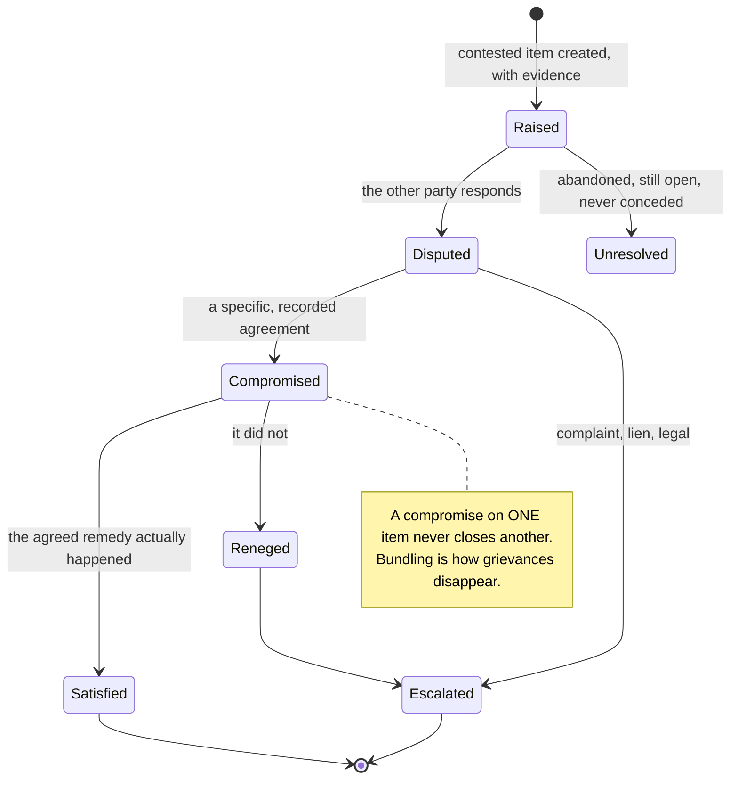
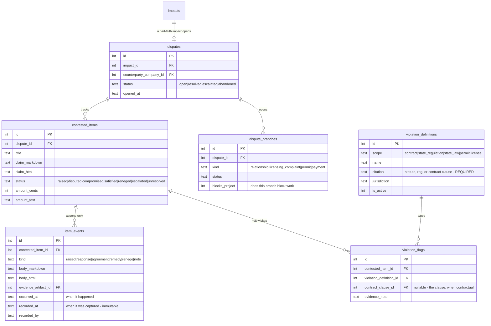
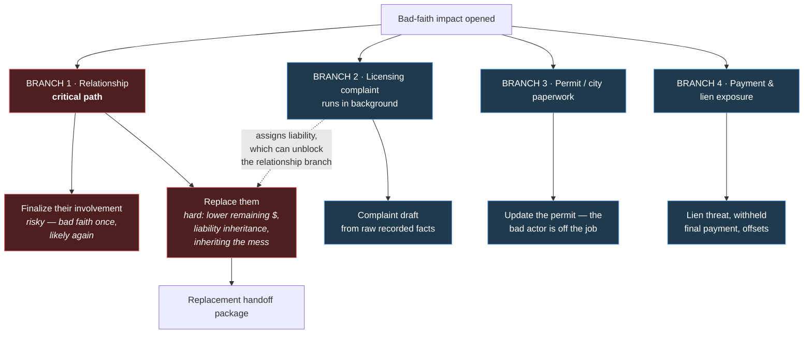
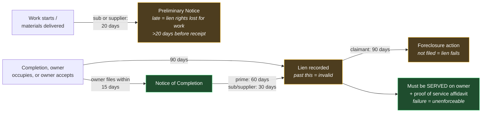
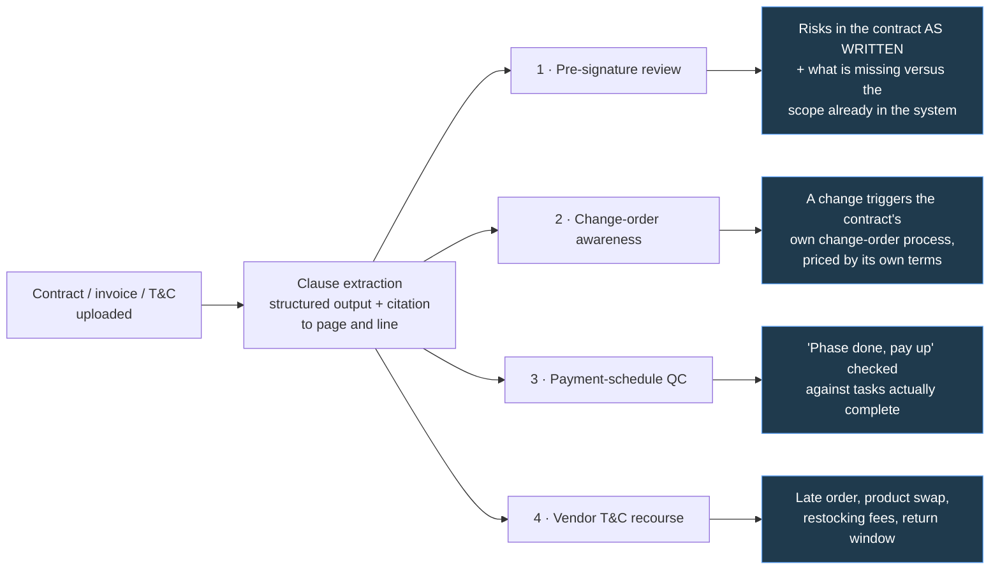

# 0042 · Contract Intelligence & Disputes

> **Status:** proposed · **Slug:** `contracts-disputes` · **Filed:** 2026-07-31
> **Depends on:** [0041 Homeowner Experience](../0041_homeowner_experience/IMPLEMENTATION_PLAN.md) — specifically the impact graph, `nodeHealth()`, and the traversable history.
> **Preview:** https://core-remodel.hacolby.workers.dev/admin/changelog/preview/contracts-disputes

---

## 1 · Why this exists

Two capabilities that 0041 deferred as open decisions, now resolved and specified. They share one spine — **documents the system can actually read** — and one thesis.

> **Drift is still the adversary. This is drift inside a conflict.**
>
> A bad-faith actor's winning strategy is **induced amnesia**. Stall, deflect, argue an adjacent point, and keep going until the homeowner can no longer reconstruct the original grievance: *"what were we fighting about again? I just know they were acting in bad faith and I'm pissed."*
>
> That is not a memory failure. It is the strategy working. And it wins legally too, because the paper trail then supports the contractor's version — *"the homeowner got confused, your honor; the contract clearly states XYZ, they said ABC, I agreed and came back and did that work, then four weeks later they were back complaining. I did my due diligence and worked toward a compromise. They keep moving the goal posts."*

The product's answer is the same one it gives everywhere else: **the homeowner never loses the thread.**

---

## 2 · A dispute is an impact with a sub-graph

The 0041 impact model already has the right shape. A dispute is a `bad_faith` / `contract_breach` / `fraud` impact that owns a set of **contested items**, each independently tracked.

**This is the whole point.** Five grievances get bundled into one argument, the contractor concedes the cheapest one, and the other four evaporate. Tracking them separately makes that impossible.



**Contemporaneous beats reconstructed.** Evidence rows are append-only and timestamped at the moment of capture, not backfilled. That serves the homeowner's own memory first, and its weight as evidence second. It reuses 0041's traversable history — scrub back and see what was true when.



---

## 3 · Branches run independently; the record is shared

When a contractor acts in bad faith, several things open at once. One is critical-path; the others must be able to proceed without waiting on it.



Branches are `impact_blocks` edges in the 0041 graph, so blast radius and node health already work on them for free.

### Branch 1 — the relationship, and the handoff problem

Replacing a contractor mid-project is hard for structural reasons, not emotional ones: the remaining scope is worth less, nobody wants to inherit liability for another contractor's work, and nobody wants the mess.

**The replacement handoff package must not lead with the grievance.** A package headlined *"my last contractor screwed me"* filters exactly wrong — good contractors walk away from apparent conflict, and bad ones read it as an easy mark. It leads with:

1. The project's **original goals**, unchanged.
2. **Current state** — what is done, what is verified, what remains, in trade terms.
3. **What is known about the condition** they would be inheriting, stated factually.
4. The dispute, **disclosed completely and available**, but as fact rather than as headline.

This is the 0041 trade-ready package with a mid-project delta and a disclosure section. It should reuse it, not fork it.

### Branch 2 — the licensing complaint

Sometimes elective. **Sometimes it is the only path forward** — when a defect creates liability no other contractor will touch, the complaint is what assigns that liability and unblocks the project.

The founder's two real cases, which this branch is designed against:

| Case | What happened | What the record needed to carry |
|---|---|---|
| First contractor | Operating as a contractor while holding only an HIS registration; took money, abandoned the job. CSLB investigated, took a deposition, and nothing came of it | License-status-at-time-of-contract as a recorded fact; the money trail; abandonment timeline |
| Roofer | Failed the contracted warranty terms; damaged solar on reinstallation; **spliced DC solar conductors** — out of scope, no change order, no permit, no licensed electrician — and papered it with a licensed electrician's name after the fact. Result: a live fire hazard no contractor will touch on liability grounds. Meanwhile demanding the $30k final payment with no offsets for the damage they caused, and threatening a mechanics lien | Scope vs. work performed; missing change order; missing permit; licensure of the person who actually did the work; the paperwork discrepancy; damage offsets; the lien threat and its clock |

**What the system produces:**

- **Violation flags** against three scopes — the contract's own clauses, state regulation, and state law — each carrying a **required citation**. `violation_definitions.citation` is NOT NULL for exactly this reason.
- A **draft complaint** for the homeowner's state licensing board, assembled from the recorded facts, in the board's own structure.

> **PRODUCT.md principle 7 governs this branch absolutely.** Every statute, regulation, deadline, and clause is cited and verifiable, or it is phrased as the question to ask. A fabricated citation in a complaint or in front of a board destroys the homeowner in the exact moment they need standing. This is also **information, not legal advice** — the product assembles facts and points at the board's own process; it does not tell a homeowner they will win.

### Branch 4 — payment, offsets, and the lien clock

A withheld final payment, damage offsets, and a mechanics lien threat are a single connected exposure with **statutory deadlines attached**.

**These deadlines are published, so the product computes them.** Earlier drafting of this plan hedged here — unnecessarily. CSLB publishes the windows; the system applies them to recorded event dates and cites the source. That is not inventing day counts, it is applying documented ones.



| Clock | Window | Effect if missed |
|---|---|---|
| Preliminary Notice (sub/supplier) | 20 days after starting work or delivering materials | Lien rights lost for anything more than 20 days before receipt. Laborers exempt; a prime contractor does not send one |
| Recording the lien | 90 days from completion, owner occupancy, or owner acceptance | Lien is not valid |
| Owner's Notice of Completion | Owner files within 15 days of completion | **Shortens the claimant's window** — prime to 60 days, sub/supplier to 30 |
| Foreclosure action | 90 days from recording | Lien fails. Claimants with valid claims routinely miss this |
| Service on the owner | Lien + Notice of Mechanics Lien served, with proof of service affidavit | **Unenforceable** without it |

Two more that matter and are cheap to check:

- **A non-licensed individual cannot foreclose a mechanics lien on work valued over $500** — BPC §7031. Directly relevant when the counterparty's licensure is in question.
- **Removing an invalid lien:** certified-mail request citing the specific checklist deviations; attorney's fees recoverable if you prevail (Civil Code §8488); petition to release under Civil Code §§8480–8488.

**Preventive posture, from the same publication** — conditional release before payment, unconditional release after, and the right to **withhold the next payment until unconditional releases for the previous one are in hand**. Plus joint checks and the sub/supplier list. These become checklist state on the payment branch, not prose in a help page.

> **Running a live lien clock on a real, active dispute is operational work, not planning work.** The schema and the citations are specified here; standing up the founder's own timeline is a separate, more urgent task and should be treated as one.

### Jurisdiction capability — the lien clock cannot assume synced permits

See [0041 §4g](../0041_homeowner_experience/IMPLEMENTATION_PLAN.md). Permits are a **jurisdiction capability**, not a feature: SF DBI is integrated, San Mateo one county over publishes nothing online, and every jurisdiction has its own schema or no portal at all. **For most v1 users, permit records are manual entry, and that is the normal path rather than a degraded one.**

Three consequences land directly on this plan:

1. **Every clock input must accept a human-entered date.** A lien window computed only from a synced feed simply never runs for most of the market, and it looks correct in testing against SF.
2. **Provenance changes what may be asserted.** A completion date from a jurisdiction feed and one the homeowner typed carry different confidence. The clock still computes — but a deadline derived from an unverified date is presented as *"based on the completion date you entered"*, never as fact. This is `PRODUCT.md` principle 7 applied to a date rather than a citation.
3. **Statutory windows are per-jurisdiction.** `violation_definitions.jurisdiction` already exists for this; the windows table follows the same rule. **A jurisdiction with no seeded rules gets no computed clock, not a guessed one** — CA/CSLB first, and silence everywhere else until someone does the work.

### Communication guardrails when a dispute opens

CSLB's "unhappy with your contractor" publication carries behavioral instructions that change what the homeowner should *do the moment a dispute starts* — surfaced at that moment, not buried:

- **Put it in writing**: the exact problems, the requested resolution, and a reasonable deadline. First-class **and** certified mail, or a PDF attached to email. Keep a copy.
- **Problems must relate to work in the written contract and signed change orders.** Grievances outside that scope weaken the record.
- **If escalation looks likely, limit informal back-and-forth** — texts and scattered emails complicate later review. This is the single most actionable and least obvious instruction in the corpus, and it argues for the product becoming the channel of record early.
- **Photograph defective and incomplete work before any new contractor starts.**
- **Ask a replacement contractor whether they are willing to explain the prior work's problems to others** — that explanation carries weight in a CSLB complaint.
- Give the contractor a genuine opportunity to respond first. The product should make the good-faith attempt easy and record that it happened.

Also worth carrying as a deadline: **consumers have four years to file a CSLB complaint** about a faulty project, extendable by written warranty terms in the contract.

---

## 4 · Contract & terms intelligence

**Machine-readable is critical**, and it feeds four live surfaces — not just the dispute.



### 1 · Pre-signature review

Review the draft **before it is signed**, against the scope already registered in the system **and against the regulator's own published rules**.

- **Problematic language**, flagged.
- **Where more detail is required** — especially payment triggers.
- **What is missing** — derived from the work the system already knows about. The translation thesis pointed at the contract itself: the system knows your scope, so it can tell you what the contract fails to cover.
- **Silence is never treated as absence.** If a change-order clause cannot be located, the review says *"no change-order clause found — confirm before signing,"* never *"there is no change-order clause."* That distinction is the dangerous failure in this whole feature.

#### The rule source: CSLB publications, seeded — not retrieved

`r2_resources/cslb_docs/publications/` holds five CSLB publications with text extractions: the home improvement contracts consumer guide, the mechanics lien prevention guide, lien release forms, the "unhappy with your contractor" process, and the "what if a lien is filed" guide.

> **These are authored into seeded definition rows with exact citations. They are NOT a retrieval corpus consulted at request time.**
>
> A check must be deterministic and its citation must be exact — principle 7 enforced structurally rather than trusted to a model. Retrieval may supply explanatory prose; it must never supply the rule. `contract_check_definitions` and `violation_definitions` are the runtime source of truth, and the publications are the provenance recorded on each row.

#### Hard checks, with their citations

Every one of these is a boolean or numeric test against extracted clauses, not a judgment call:

| Check | Rule | Source |
|---|---|---|
| Written contract required | Any home improvement over **$500** combined materials + labor | BPC 7151 / 7151.2 |
| Down payment cap | Not more than **$1,000 or 10% of contract price, whichever is less**, excluding finance charges. No exception for special-order materials. Blanket performance/payment bond is the only exception | CSLB Consumer Guide |
| Payment schedule present | Must show the **amount of each payment** and **explain what work, materials, or services** are performed for that payment | CSLB Consumer Guide |
| No advance overpayment | **Payments cannot exceed the value of the performed work** | CSLB Consumer Guide |
| Mechanics Lien Warning | Required in the contract | BPC 7159(e)(4) |
| Right to cancel | **3 business days**, or **5 if the buyer is 65 or older**; refund within **10 days** of cancellation. Not applicable if negotiated at the contractor's place of business; voided for service-and-repair contracts | BPC 7159(e)(6)(b) |
| Change orders in writing | Price changes **must** be by written change order that becomes part of the contract | CSLB Consumer Guide |
| Warranty terms | Must specify **which parts are covered** and the **duration** | CSLB Consumer Guide |
| Start and end dates | Contract must identify when work begins and ends | CSLB checklist |
| Permit responsibility | Contract states who pulls permits, and whether fees are in the price | CSLB checklist |
| Contractor identity | License number, address, phone present | CSLB Consumer Guide |
| Signature authority | A salesperson may only sign if a **CSLB-registered HIS** | BPC 7151.2 |
| Finance charges | Calculated and laid out separately from the contract amount | CSLB Consumer Guide |
| Sales commission | Paid **pro rata** in proportion to the payment schedule | CSLB Consumer Guide |
| Workers' comp | Required if the contractor has employees | CSLB Consumer Guide |
| Sub/supplier list | Contract should identify subs and suppliers, and when each starts and finishes | CSLB lien guide |

#### Specificity grading — CSLB's own three-tier rubric

The regulator publishes the scale, so the product does not need an opinion. Every line item is graded against it, with the publication's own examples as the reference:

| Tier | CSLB's example |
|---|---|
| **Good expectations** | *"Install xx (quantity) Company XYZ upper/lower maple kitchen cabinets, model ABC, style/color 0123, European hinges, hardware model 1000, per plan dimensions and diagram."* |
| **Trouble ahead** | *"Install maple kitchen cabinets."* |
| **Good luck** | *"Install some cabinets."* |

The review grades each scope line and each payment trigger, shows the tier, and — because it already holds the registered scope — **drafts the upgrade**. It knows the actual fixture, model, room, and dimension, so it can propose the "good expectations" version of a line the contractor wrote as "trouble ahead."

#### Payment triggers must be measurable — and that is a QC requirement, not a preference

> *"Upon delivery of phase 1, pay"* fails three ways at once.
>
> 1. It fails the statutory requirement to **explain what work, materials, or services** that payment covers.
> 2. It invites payment **exceeding the value of performed work**, which the rule prohibits.
> 3. **It makes payment-schedule QC impossible.** An unmeasurable trigger cannot be verified by the system, by the homeowner, or by a court.

So the review carries one hard, testable criterion:

**Every payment trigger must resolve to conditions the system can later verify.** The pre-signature review exists partly to make the contract machine-checkable — a milestone that cannot be mapped to verifiable state is flagged before signature, with a proposed replacement drawn from the project's own scope and inspection points.

That closes the loop with Phase 2: a contract that passes review is a contract payment QC can actually enforce.

### 2 · Change-order awareness

When the contract defines a change-order process and a change occurs, the system knows: it triggers that process, prices it by the contract's own terms, and updates the record. Wires directly into 0041's Change Impact Assessment, which already asks *"what does the contract say the change order costs"* — this is what answers it.

### 3 · Payment-schedule QC

**The sharpest tooth in the product, and the cheapest to build.**

A contractor states a phase is complete and payment is due. The system checks that claim against the tasks actually marked complete for that phase and answers in real time.

```
PAYMENT REQUESTED · Phase 3 · $30,000
  contract §4.2 — due on completion of rough-in

  system state
    ✓ plumbing rough-in          verified 12 Aug
    ✓ electrical rough-in        verified 14 Aug
    ✗ rough-in inspection        NOT PASSED
    ✗ shower pan test            not recorded

  2 of 4 phase conditions unmet
```

This requires no confrontation skill from the homeowner. It is not an argument — it is state. That is what the Anti-Gaslight idea was reaching for and never quite had: **not a counter-script, just the record.**

### 4 · Vendor and supplier T&C

Invoices carry terms too. Extract them and the system can advise in the moment:

- An order is late and now impacts the timeline — what the terms actually provide.
- Options to change a product on an existing invoice.
- Restocking fees, return windows, and whether the homeowner still qualifies.

This is what makes 0041's Change Impact Assessment able to answer its purchases questions instead of asking the homeowner to go read an invoice.

---

## 5 · Phases

| Phase | Name | Outcome |
|---|---|---|
| **0** | Document intelligence foundation | Contract / invoice / T&C ingestion; clause extraction with **required citation to source**; `contract_clauses`, `vendor_terms`; explicit not-found handling |
| **0b** | **CSLB rule seeding** | `contract_check_definitions` authored from the publications with exact citations — the hard checks table and the three-tier specificity rubric. Seeded rows, not a retrieval corpus |
| **1** | Pre-signature review | Problematic language flagged; hard checks run; line items graded on CSLB's rubric with drafted upgrades; **every payment trigger tested for verifiability**; gaps versus registered scope; silence flagged as unknown, never as absence |
| **2** | Payment-schedule QC | Phase conditions from the contract mapped to verifiable system state; the real-time answer |
| **3** | Change-order awareness | Contract's own change-order process triggered and priced; feeds 0041 Change Impact Assessment |
| **4** | Vendor T&C recourse | Late orders, product swaps, restocking fees, return windows |
| **5** | Dispute model | `disputes`, `contested_items` with independent status, append-only `item_events`, `dispute_branches` as impact-blocking edges |
| **6** | Violations & citations | `violation_definitions` with NOT NULL citation across contract / regulation / law / permit / license scopes; flagging against contested items |
| **7** | Complaint drafting | State licensing board draft assembled from recorded facts, in the board's own structure |
| **8** | Replacement handoff package | 0041's trade-ready package plus mid-project delta and factual disclosure — scope-led, never grievance-led |
| **9** | **Lien clock & preventive posture** | Computed statutory windows from recorded events, each citing its source; conditional/unconditional release tracking; Preliminary Notice register; Notice of Completion prompt; joint-check option |
| **10** | **Dispute communication guardrails** | Surfaced the moment a dispute opens: written notice with deadline, certified mail, scope discipline, limit informal channels, photograph before replacement, four-year CSLB complaint window |

---

## 6 · Risks

| Risk | Mitigation |
|---|---|
| **A fabricated citation reaches a board, a court, or a contractor** | PRODUCT.md principle 7. Extraction cites page and line; `violation_definitions.citation` is NOT NULL; anything unverifiable is phrased as the question to ask. Unverifiable does not ship |
| **Extraction silence read as absence** | "No clause found — confirm" is a distinct state from "no clause exists." Never collapse them |
| **The product drifts into practicing law** | Assemble facts, cite sources, point at the board's own process and at licensed professionals. Never predict an outcome, never advise to sue |
| **Bundling makes grievances disappear** | Contested items carry independent status. A compromise on one never closes another |
| **The record becomes a grievance archive instead of a path forward** | Every dispute has branches with next actions. The goal is to close the chapter and get back to building |
| **The handoff package scares off good contractors** | Scope-led and state-led; the dispute disclosed completely but never as the headline |
| **Evidence backfilled after the fact** | `item_events` are append-only with separate `occurred_at` and immutable `recorded_at` |
| **Payment QC produces false accusations** | It reports system state and contract conditions, nothing more. It never characterizes intent |

---

## 7 · Open decisions

- Which state licensing boards get structured complaint templates first (CA/CSLB is the founder's own case and the obvious first).
- Whether extracted clauses need human confirmation before they can be cited in a complaint draft — leaning yes.
- Whether the dispute record ever leaves the tenant (export to counsel is clearly yes; anything beyond that is not decided and inherits the 0041 review requirement).
