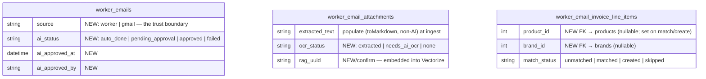
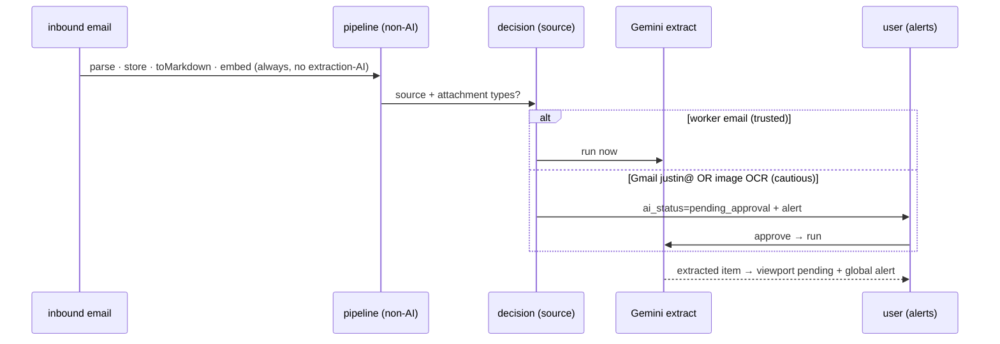

# 0042 — Email OCR/Extraction, Trust-Gated AI, Alerts & Product Mapping

**Slug:** `email-extraction-alerts`
**Builds on:** #310 (0041 store inbox + Gmail→processEmail bridge)
**Status:** planning

---

## 1. Problem / intent (from the user)

- Attachments (quotes/invoices/receipts/contracts) should get **OCR/text extraction
  + embeddings automatically, without AI** where possible, so a doc "sits ready."
- **If OCR needs AI vision** (image attachments), don't run it silently — **flag it
  pending AI processing** for the user to approve.
- **Trust boundary by source:** mail from the **worker email** (remodel@hacolby.app)
  is trusted → process fully (AI too). Mail from **`justin@126colby.com`** (Gmail)
  is treated with caution → run the non-AI half now, **gate the AI extraction behind
  the user's approval** (prompt-injection / spend caution).
- After AI extraction: the **extracted quote/invoice** appears as a **pending item in
  the showroom viewport** AND in a **global alerts center**; its price lands on the
  product; its lines **match tracked products or auto-create brand/product**.
- The user needs **"you received email" alerts**.

---

## 2. What already exists (reuse — do NOT rebuild)

```mermaid
flowchart LR
  subgraph reuse["Reuse as-is"]
    tm["env.AI.toMarkdown<br/>(PDF/Office = deterministic, NON-AI)"]
    po["product_price_observations<br/>record_price_observation"]
    ep["ensure_brand / ensure_product<br/>(idempotent dedup)"]
    rt["publishRealtimeEvent<br/>+ /api/realtime WS"]
    hitl["worker-emails.ts confirm/link/create-material HITL"]
  end
  classDef k fill:#1f4d2e,stroke:#4ade80
  class tm,po,ep,rt,hitl k
```

- **`toMarkdown` on PDF/Office = non-AI** deterministic text (images are skipped
  today; images need vision AI → pending).
- **Embeddings**: inbound pipeline embeds nothing today; `bge-large` + `VECTOR_INDEX`
  helper exists on the Gmail sync — reuse the model, add it to the doc pipeline.
- **No trust gate today**: every email (incl. Gmail-bridged) runs Gemini
  unconditionally. **This is the amendment to #310.**
- **No global alerts UI**: `notifications` table is orphaned; per-domain queues are
  siloed. → build an **aggregator** (chosen).

---

## 3. Target flow

```mermaid
flowchart TD
  m["inbound email (worker OR Gmail-bridged)"] --> nonai["ALWAYS auto, NO extraction-AI:<br/>parse · store · attachments→R2 · toMarkdown(PDF/doc) · embeddings→Vectorize"]
  nonai --> src{"source?"}
  src -->|"worker email (remodel@) = trusted"| ai["run Gemini extract now"]
  src -->|"Gmail (justin@) = cautious"| pend["ai_status = pending_approval<br/>+ alert 'approve AI processing'"]
  src -->|"image attachment (needs vision OCR)"| pend
  pend -->|"user approves"| ai
  ai --> ext["worker_email_invoices + line items (existing)"]
  ext --> map["match lines → tracked products (ensure_product)<br/>OR auto-create brand/product"]
  map --> price["price → product_price_observation"]
  ext --> alert["GLOBAL alert + showroom viewport pending item"]
  map --> alert
  nonai --> mail["'you got mail' realtime poke"]

  classDef new fill:#1f4d2e,stroke:#4ade80
  class nonai,pend,map,price,alert,mail new
```

---

## 4. Schema deltas (additive)

- **Alerts = aggregator, NO new alerts table.** A read endpoint UNIONs: unread
  `gmail_messages`, `worker_emails` where `ai_status='pending_approval'`, unconfirmed
  `worker_email_invoices`, staged `material_room_proposals`, and extracted-quote
  pending-maps. Each row carries a deep-link to its existing review surface.

---

## 5. Phases

| Phase | Workstream | What |
|---|---|---|
| **P0** | pipeline | Refactor `pipeline.ts`: hoist `extractAttachmentText` (non-AI) + add **embeddings** out ahead of the Gemini call; make AI extraction a separately-callable step. Add `deferAiUntilApproval` to `RouteDecision`/profile. Populate `worker_email_attachments.extracted_text` + embed to Vectorize. |
| **P1** | trust gate | Worker-email routes → AI runs now. **Gmail bridge (`GATE_DECISION`) → `deferAiUntilApproval=true`**: non-AI + embeddings run, then stamp `worker_emails.ai_status='pending_approval'`. Image attachments → `ocr_status='needs_ai_ocr'` → pending. **Amends #310's Path A/B auto-bridge.** |
| **P2** | approval | `POST /api/worker-emails/:id/approve-ai` (+ MCP `approve_email_ai`) → runs the deferred Gemini extract (image OCR via vision model) → normal downstream. Realtime poke on completion. |
| **P3** | alerts | `GET /api/alerts` aggregator + header **bell** (count) + `/admin/alerts` live feed (WS via `publishRealtimeEvent`). Pipeline fires a `mail_received` poke. |
| **P4** | showroom | Extracted quote/invoice → **pending item in `StoreViewportApp`** (per-store panel) + a global alert; price → `record_price_observation` (source=manufacturer/showroom, confidence=extracted). |
| **P5** | products | For each line: `ensure_brand` + `ensure_product` (dedup) → `link_product_to_showroom` → set line `product_id`/`brand_id`; show as **"new from quote — confirm/map"** in the viewport. |

---

## 6. Trust gate (the security core)

Rationale: Gmail content is attacker-reachable (anyone can email justin@); running
an LLM extraction on it unprompted is a prompt-injection + spend surface. Non-AI
text + embeddings are safe (no interpretation/action), so those run to keep the doc
"ready," and the interpretation step waits for a human.

---

## 7. Risks / notes

- **Amends #310**: the Path A/B Gmail bridges currently auto-run Gemini. P1 changes
  them to defer. Merge #310 first, then 0042.
- **Deterministic vs vision `toMarkdown`**: confirm image inputs are the only ones
  needing the vision model; route only those to `needs_ai_ocr`.
- **Product auto-create** relies on `ensure_*` dedup to avoid catalog forks; creation
  is **post-approval** so a human already gated the extraction.
- **Embeddings** use `bge-large` (an AI model but non-interpretive) — treated as safe
  auto per the "non-AI-ish, cheap" bucket; document this explicitly.
- Migrations additive; `migrate:remote` + verify before deploy.

## 8. Success criteria

- A Gmail PDF quote → text-extracted + embedded automatically, shows as
  **pending AI approval**; nothing interpreted until approved.
- A worker-email invoice → fully auto-processed (no approval needed).
- Approving a pending email runs the extraction; the quote appears in the showroom
  viewport (pending-map) + the global alerts bell, price on the product.
- Unmatched lines auto-create brand/product (deduped), matched lines link.
- Header bell shows unread email + pending-AI + items-to-map, live.
