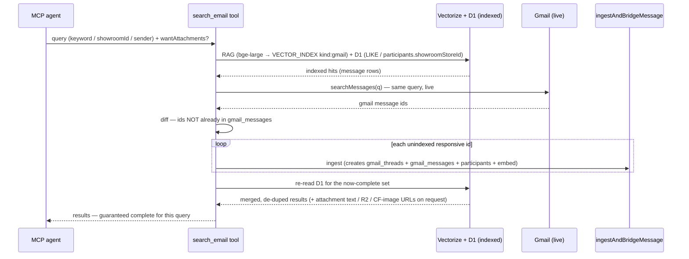
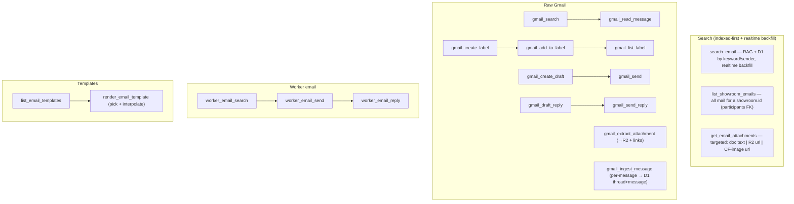
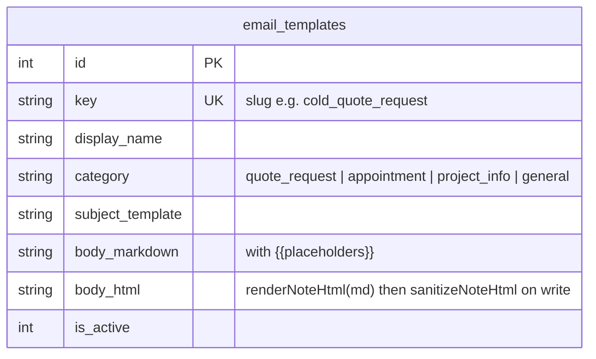

# 0043 — Email MCP Suite (search · raw Gmail/worker ops · templates)

**Slug:** `email-mcp-suite`
**Status:** planning

---

## 1. Intent (from the user)

Give the MCP agent a fast, complete path to email:

- **Search-first, indexed-first, then realtime-complete.** Search the *indexed*
  email first (RAG + D1: by showroom.id, by sender, by keyword). Then go out to
  **Gmail live for the same query**, ingest any responsive-but-unindexed
  messages (creating the thread row in D1 too), so the agent always has
  everything from Gmail **and** worker email.
- **Attachments**: on request, return the extracted **doc text**, or the **R2
  URL** / **Cloudflare Images URL** for images — targeted grabs, with the worker
  uploading to R2 if not already indexed.
- **Raw Gmail ops**: native search, create label, add-to-label, list-in-label,
  read, create draft, send, draft reply, send reply, extract attachments,
  trigger ingestion of unlogged messages.
- **Raw worker-email ops**: search, send, reply.
- **Editable email templates**: boilerplate the agent reviews + picks (cold
  product/pricing quote requests, appointment scheduling, general project info
  with contractor name / timeline / design-doc + photo links). AI can edit
  templates; the user edits them at `/admin/config`.

---

## 2. What already exists (reuse — almost everything)

```mermaid
flowchart LR
  subgraph reuse["Reuse as-is"]
    cli["gmail/client.ts: searchMessages · getMessage · ensureLabel ·<br/>modifyMessageLabels · sendMessage · buildReplyAllRaw · buildComposeRaw ·<br/>getAttachmentBytes · getRawMessage"]
    auth["getGmailAccessToken (SA delegation)"]
    part["participants: findThreadIdsByParticipants · buildShowroomMatchSpec ·<br/>showroomStoreId resolution FK"]
    vec["VECTOR_INDEX.query pattern (draft-assist) · bge-large embeddings"]
    tool["defineTool · ToolCtx{env,db,props} · READ_ONLY/WRITE presets"]
    cfg["config-vocab CRUD (store_types) · ConfigShell · renderNoteHtml/sanitizeNoteHtml"]
  end
  classDef k fill:#1f4d2e,stroke:#4ade80
  class cli,auth,part,vec,tool,cfg k
```

Net-new is small: an **`email` MCP domain**, an **`email_templates`** config
vocab, and a few thin helpers (export `ingestAndBridgeMessage` for per-message
ingest, export `embedMessage`, a `searchGmailVectors` helper).

---

## 3. Search flow — indexed-first, then realtime-complete

**Attachments in results**: for each matched message, when `include:"text"` →
`gmail_message_attachments.ocrText` (or trigger extract); `include:"files"` →
`r2Key` served URL + `gmail_message_images.deliveryUrl` for inline images.

---

## 4. Tools (new `email` domain)

All tools: a **hand-written Zod v4 `inputShape`** validated at the trust boundary
(never drizzle-zod), `getGmailAccessToken` once per handler, ≥1 example each, and
an annotation that matches the tool's REAL side-effect — `READ_ONLY` only for the
pure reads (`list_showroom_emails`, `gmail_read_message`, `worker_email_search`),
**`WRITE_IDEMPOTENT`** for anything that ingests/uploads (`search_email` with
`live:true`, `get_email_attachments`, `gmail_ingest_message`, label ops),
`WRITE` for `*_send`/`*_reply`/`*_create_draft`. A tool that writes during a
"search" must NOT be labelled READ_ONLY.

---

## 5. Templates — `email_templates` config vocab

- **Rich text = markdown + html both** (the repo convention): `body_markdown` is
  the round-trippable source of truth; `body_html` is generated from it via
  `renderNoteHtml` and **sanitized with `sanitizeNoteHtml` on every write** (same
  pipeline as `store_notes` / visit notes). Placeholders are interpolated into the
  sanitized html at render time, never re-injected as raw markup.
- Seeded with the boilerplate the user named: **cold product/pricing quote
  request**, **appointment scheduling**, **general project info**.
- `{{placeholders}}` resolved by a render helper from `project_system_variables`
  (timeline, contractor name…), `properties` (address), `companies`/showroom
  rows (recipient), and `supporting_documents` / inspiration images (design-doc
  + photo links) — always by FK/JOIN, never denormalized.
- Editable by the user at `/admin/config/email-templates` (ConfigShell + PATCH).
  The AI edits via a **`WRITE`-annotated** `edit_email_template` MCP tool, gated
  by the connector's `remodel` scope; edits are sanitized on write and land as a
  reviewable change (the user sees the new body in the config UI), never a silent
  overwrite of a template mid-send.

---

## 6. Phases

| Phase | What |
|---|---|
| **P1** | Scaffold: add `"email"` to `ToolCategory`; export `ingestAndBridgeMessage` (per-message) + `embedMessage`; `searchGmailVectors` helper; `tools/email/` + barrel + register. |
| **P2** | Search tools: `search_email` (indexed-first RAG+D1 + realtime Gmail backfill), `list_showroom_emails`, `get_email_attachments` (text / R2 / CF-image). |
| **P3** | Raw Gmail tools: search/read/label×3/draft/send/reply×2/extract-attachment/ingest-message. |
| **P4** | Worker-email tools: search/send/reply (`worker_emails` + Gmail-API send). |
| **P5** | Templates: `email_templates` table + `/api/config/email-templates` CRUD + `/admin/config/email-templates` page + render helper + `list/render_email_template` tools. Seed the boilerplate. |

Each phase its own PR; QC + changelog per repo rules. Migration only in P5
(email_templates) — additive.

---

## 7. Risks / notes

- **Realtime backfill cost**: `search_email` may ingest N new messages per query.
  Cap the live Gmail fetch (e.g. top 25), ingest only responsive-unindexed, and
  it composes with the 0042 trust gate (Gmail-sourced defers AI — non-AI OCR +
  embeddings run, extraction stays gated).
- **Startup CPU** (10021) is already near the limit (see 0042 deploy). ~20 new
  tools = more registry/schema work at module load. Keep tool modules lean; if
  the deploy flakes, this is the first suspect.
- **Send is a real outbound action** — `WRITE`, never `READ_ONLY`; the MCP scope
  already gates to the trusted user. Draft-then-send split lets the agent stage.
- **Per-message ingest idempotency depends on a DB-level guarantee, not app
  logic.** Dedup on `gmail_messages.messageId` only holds if that column has a
  **unique index** — otherwise two concurrent live-backfills (P2 `search_email`)
  can both pass the "not indexed yet" check and double-insert. P1 must **confirm
  the unique index exists on `gmail_messages.messageId` (add it if missing)** and
  `ingestAndBridgeMessage` must insert with `onConflictDoNothing()` so a race
  degrades to a no-op, not a duplicate row.

## 8. Success criteria

- `search_email "quote from Pietra Fina"` returns indexed hits AND pulls any
  matching Gmail message not yet in D1, with attachment text/URLs on request.
- `list_showroom_emails(222)` returns all Pietra Fina mail.
- Agent can natively search/label/draft/send/reply in Gmail and worker email.
- Agent picks a seeded template, it interpolates project info, and the user can
  edit templates at `/admin/config/email-templates`.
