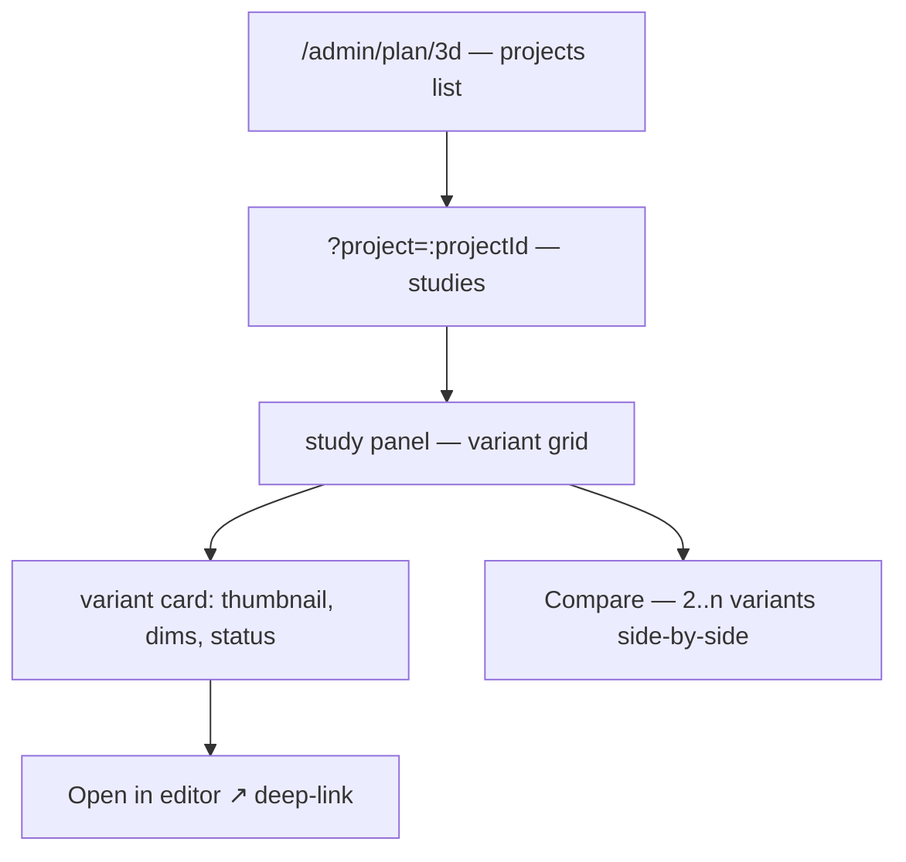

# 0043 — DESIGN_SPEC: `/admin/plan/3d`

Frontend brief for the Core-Remodel admin surface. Built by Claude Code + Claude AI Design against
this hand-off. Dark Monolith theme, shadcn (Base UI primitives — `render={<a/>}`, not `asChild`;
`Badge` has no `size`). Page follows the mandatory shell (BaseLayout, `container mx-auto px-4 py-8`,
header block with a 24px lucide icon, `client:only="react"` island).

## Purpose

Browse and drive the layout explorations: **projects → studies → variants**, open any variant in
the Pascal editor, see snapshot thumbnails, and compare variants in a study side-by-side.

## Information architecture

## Screens & states

### 1. Projects index — `/admin/plan/3d`
- Header: floorplan/layout lucide icon + "Layout Studio" + one-line description.
- Grid of **project cards**: name, scope chip (`floor`/`room`/`whole home`), study count, variant
  count, last-modified, latest thumbnail.
- Empty state: "No layout projects yet — create one from a floor or room." + primary action.
- Loading: skeleton cards. Error: inline alert + retry.

### 2. Project detail — `/admin/plan/3d?project=:projectId`
- Breadcrumb + project header (scope, linked floor/room name via join — never a stored name).
- **Study accordion / sections**, each: title + description, "Compare" button, variant grid.
- "New study" (title + description form — `title` required).
- "New variant" per study → calls `generate_floorplan_variant`; choose **base (from measurements)**
  or **from an existing variant + intent** (text). Show the deterministic-vs-AI choice plainly.

### 3. Variant card
- Snapshot **thumbnail** (or a "no snapshot yet" placeholder), title, description, status badge
  (`draft`/`active`/`archived`), version, parent-lineage chip if branched.
- Exact dimensions summary (from provenance: room sizes used).
- Actions: **Open in editor ↗** (`PASCAL_EDITOR_URL/scene/:variantId`, new tab),
  **Capture snapshot** (calls `capture_scene_screenshot`), rename, archive.
- **Provenance disclosure** (collapsible): measurement IDs + confidence + generation source/intent.
  Reinforces "dimensions are measured; the shape is an editable approximation."

### 4. Compare — study-scoped
- Select 2..n variants → side-by-side columns: thumbnail, dimension deltas, intent/notes.
- Backed by `compare_layout_variants`.

## Components (reuse, don't hand-roll)
- Rich text (study/variant description) → PlateJS `OverviewNoteEditor` (`{markdown, html}` — store
  both `*_markdown` + `*_html`). Do **not** use a bare `<textarea>`.
- Cards, badges, accordion, dialog (Base UI), skeletons from the existing shadcn registry.
- Thumbnails via `imagedelivery.net/<id>/public`.

## Interaction parity with the plan
- Every write action maps 1:1 to an MCP tool / REST route (§7 / §4 of IMPLEMENTATION_PLAN) — the UI
  is a second front-end onto the same operations Claude uses; no bespoke endpoints.
- Realtime: variant thumbnail/version updates can poll (or subscribe to a DO channel later) — a
  snapshot capture should reflect without a full reload.

## Copy guardrails
- Where a base variant is shown: "Rooms placed at measured sizes — refine walls in the editor."
  Never imply the generated base is a finished architectural plan.

## Non-goals (this spec)
- No in-admin 3D rendering (that's the editor). Admin shows thumbnails + metadata only.
