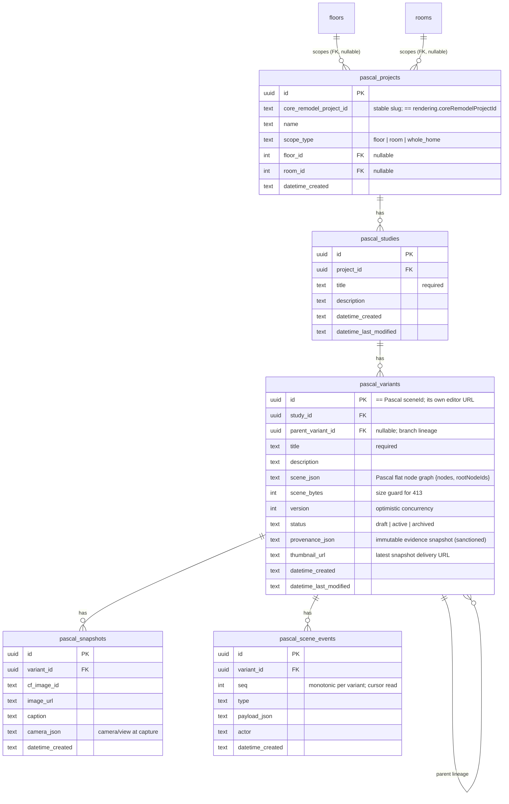
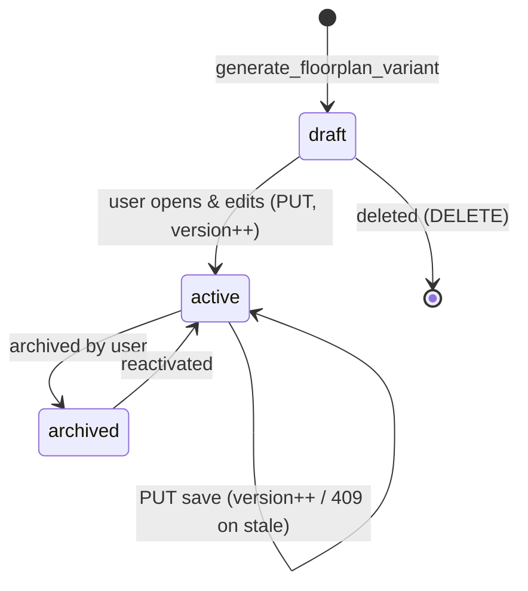
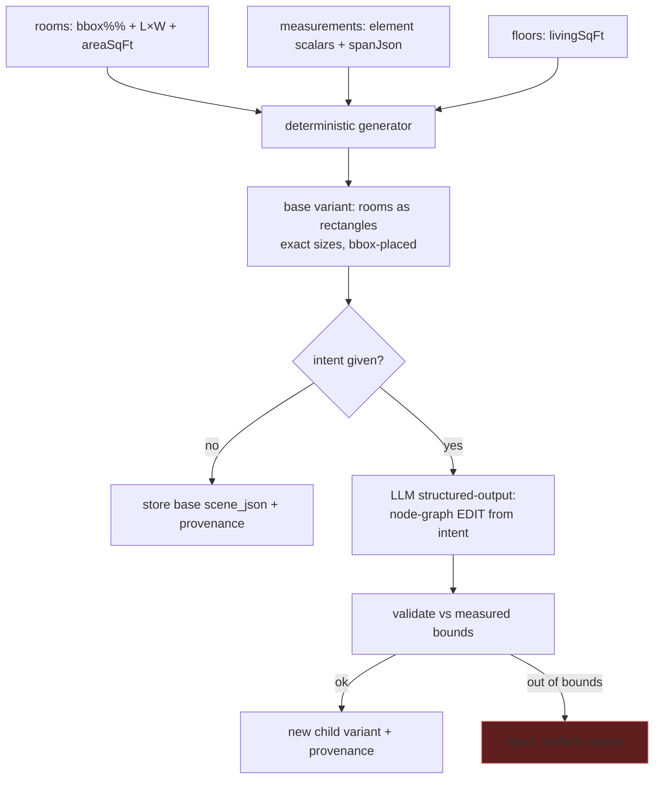

# 0043 — Pascal ⇄ Core-Remodel Rendering Integration

**Status:** planned · **Slug:** `pascal-core-remodel-integration` · **Owner branch:** `claude/pascal-core-remodel-worker-8c8451`
**Companion repo:** `jmbish04/editor` (Pascal, deployed `https://3d-remodel.vercel.app`)

---

## 1. Context & problem

The user wants to explore renovation **layouts** in a real 3D/2D editor — e.g. *"try a few
island placements upstairs"* and *"a few kitchen-table-next-to-island layouts"* — where each idea
is its own editable floorplan, and snapshots of each get captured back into the project.

Pascal (`pascalorg/editor`) is a client-side WebGPU/Three.js scene editor. It **cannot** run on
Cloudflare Workers (SSR + WebGPU), so it lives on Vercel. Its stock build is **local-only**
(*"scenes are not saved"*, IndexedDB) — no backend, no API. So there is **no wire to integrate with
yet on either side**; both must be built.

**Division of ownership (fixed):**

- **Core-Remodel (this worker) = system of record + durable scene store.** Owns projects,
  studies, variants, the scene-graph JSON, measurements, provenance, permissions. Never runs
  Three.js.
- **Pascal (Vercel) = thin rendering client.** Owns geometry→mesh rendering and visual editing.
  Its function filesystem is ephemeral, so it **must** use a remote storage adapter pointed at this
  worker.

```mermaid
flowchart LR
  subgraph Claude["AI (Claude via MCP)"]
    A[intent: 'try island placements upstairs']
  end
  subgraph Worker["Core-Remodel Worker (system of record)"]
    MCP["/mcp tools"]
    REST["/api/pascal/v1/* scene store"]
    GEN[deterministic generator]
    D1[(D1: pascal_* tables)]
  end
  subgraph Vercel["Pascal editor (Vercel, thin client)"]
    ADP[remote storage adapter]
    UI[WebGPU editor UI]
  end
  A --> MCP --> GEN --> D1
  REST <--> D1
  ADP -- "Bearer WORKER_API_KEY (server-only)" --> REST
  UI --> ADP
  MCP -. "capture_scene_screenshot (Browser Rendering)" .-> UI
  classDef store fill:#1f3a5f,stroke:#60a5fa
  class D1,REST store
```



---

## 2. Grounded reality (verified against the tree, 2026-07-31)

- **No geometry is stored.** `rooms` has percent-of-image annotations only:
  `floorplanBboxXPct/YPct/WPct/HPct`, `floorplanXPct/YPct` (dot), plus scalar
  `lengthFeet/Inches`, `widthFeet/Inches`, `areaSqFt` (`src/backend/db/schema/home/rooms.ts:88-101`).
  `measurements` stores element-scoped scalars (`elementType` = wall/door/window/stair/…, with
  `lengthFeet/Inches`, `heightFeet/Inches`, unstructured `spanJson`) — **no coordinates, no wall
  endpoints, no adjacency** (`src/backend/db/schema/home/measurements.ts:106-168`).
  → **Deterministic generation can only emit rectangles at exact measured sizes, positioned by the
  floorplan bbox.** True walls/adjacency are the user's job in the editor. This is stated as a
  limitation everywhere, not hidden.
- **Existing "render" tools are AI image generation** (Gemini/Fal nano-banana), unrelated to this.
  This feature adds a **new** `pascal` domain; it does not touch the image pipeline.
- **REST pattern:** Hono + `@hono/zod-openapi`; routers in `src/backend/api/routes/*`, mounted in
  `src/backend/api/index.ts` (`app.use(prefix, requireAccessAuth)` then `app.route(prefix, router)`).
- **Auth:** `WORKER_API_KEY` bearer via `isRequestAuthenticated` (`src/backend/utils/access.ts:144`),
  `x-worker-api-key`/`Authorization: Bearer`, cookie = `SHA-256(key)`. Constant-time compare.
- **Browser Rendering:** REST only via `CF_BROWSER_RENDER_TOKEN` secret
  (`src/backend/ai/tools/browser-rendering.ts:59-69`, `POST …/browser-rendering/snapshot`,
  `waitUntil: networkidle2`) — no `env.BROWSER` binding. Spend-gated + ledgered.
- **CF Images:** `src/backend/services/render/cf-images.ts` — `uploadBytesToCfImages(env, bytes,
  mime, filename) → { imageId, deliveryUrl }`; delivery = `https://imagedelivery.net/<id>/public`.
- **MCP add-a-tool:** new folder `src/backend/mcp/tools/pascal/` with one `defineTool` per file +
  `pascalTools[]` in `pascal/index.ts`, spread into `ALL_TOOL_GROUPS`
  (`src/backend/mcp/tools/index.ts:27-46`). No route wiring; registry feeds `/api/mcp` + `/connect`.

---

## 3. Data model (new `src/backend/db/schema/pascal/`)

FK-only, no denormalized name columns. Scene stored as **one JSON blob per variant** → sidesteps
the D1 100-bound-param cap (no multi-row node inserts). Blob capped; oversize → move to R2 (later)
and reject at the API with `413`.



**Sanctioned denormalization:** `provenance_json` on a variant is a deliberate **immutable
snapshot** of the evidence at generation time — authoritative Core-Remodel measurement IDs, source
revision, unit, value, confidence, aggregate confidence, generation timestamp, request ID. Updating
it never updates the business records. This is the one documented exception to the FK rule
(matches the editor contract's "immutable measurement evidence snapshots").

**Compliance scan (mandatory):** no currency fields, no user-managed multi-select vocabularies in
this surface. `scope_type`/`status` are fixed enums, not config vocabularies — no
definition/mapping tables required.

---

## 4. The wire — REST `/api/pascal/v1/*` (this worker implements; editor consumes)

Auth: **`WORKER_API_KEY` bearer, server-only** (the editor's remote adapter holds it as a Vercel
server env var; browsers never call this worker directly). This **supersedes** the earlier
browser-scoped-token idea — the editor mediates all calls server-side, which is strictly safer.

| Method | Route | Purpose | Returns |
|---|---|---|---|
| POST | `/projects` | create project mapping | `ProjectStatus` |
| GET | `/projects/:projectId` | project + rendering status | `ProjectStatus` |
| GET | `/scenes?projectId=…` | list scenes (variants) for a project | `SceneMeta[]` |
| PUT | `/scenes/:sceneId` | create / version-update a scene | `SceneMeta` |
| GET | `/scenes/:sceneId` | load graph + metadata | `SceneWithGraph` |
| PATCH | `/scenes/:sceneId` | rename | `SceneMeta` |
| DELETE | `/scenes/:sceneId` | delete rendering state | `204` |
| POST | `/scenes/:sceneId/events` | append scene event | `SceneEvent` |
| GET | `/scenes/:sceneId/events?after=<seq>` | read events after cursor | `SceneEvent[]` |

**Contract shapes** (Zod, authored here; editor's `SceneMeta / SceneWithGraph / ProjectStatus /
SceneEvent`): `sceneId == pascal_variants.id`; every scene carries `projectId` **and**
`rendering.coreRemodelProjectId` and they must match at the boundary (reject `422` otherwise).

**Status codes:** `409`/`412` version conflict (optimistic; PUT takes `expectedVersion` /
`If-Match`), `404` missing, `400`/`422` invalid payload or identity mismatch, `413` oversize scene.



---

## 5. Snapshots — worker-side `capture_scene_screenshot`

Per the editor contract, capture is a **worker MCP tool** using Cloudflare Browser Rendering →
Cloudflare Images. No Cloudflare credential ever reaches the browser.

```mermaid
sequenceDiagram
  participant C as Claude / admin UI
  participant W as Worker
  participant BR as CF Browser Rendering (REST)
  participant IMG as CF Images
  C->>W: capture_scene_screenshot(sceneId, projectId, w, h, setAsThumbnail)
  W->>W: authorize projectId (WORKER_API_KEY gate)
  W->>BR: POST /snapshot  PASCAL_EDITOR_URL/scene/:sceneId  (waitUntil networkidle2)
  BR-->>W: PNG (reject empty / non-image / >10MB)
  W->>IMG: uploadBytesToCfImages(bytes) → {imageId, deliveryUrl}
  W->>W: insert pascal_snapshots; if setAsThumbnail → variant.thumbnail_url
  W-->>C: {imageId, deliveryUrl, sceneId, sceneVersion}
```

⚠️ **Phase-0 spike (de-risk before building on it):** Browser Rendering is a **headless** browser;
rendering a **client-side WebGPU/Three** scene may paint blank (no GPU / async canvas). The spike
loads a real `/scene/:sceneId` and checks the PNG isn't blank. **Fallback if it fails:** editor-side
canvas capture — the editor grabs its own WebGL canvas and `POST`s bytes to a worker
`/api/pascal/v1/scenes/:id/snapshot` endpoint that uploads to CF Images. (This is why the user's
original "editor uploads direct" path stays in reserve.)

---

## 6. Geometry generation



- **Deterministic base** = rectangular seed. Exact dimensions (feet/inches → metres); shape and
  adjacency approximated from the floorplan bbox. Honest, measured starting point — not final walls.
- **AI variant** = `generate_floorplan_variant` with an `intent`. LLM emits a node-graph **edit**
  (move/add/remove) via structured output (JSON schema — never "reply with JSON"). Validated against
  measured room bounds before write. New variant, `parent_variant_id` = source, provenance records
  intent + assumptions + confidence.
- **AI must return node ids, validated against the live graph** before applying (no hallucinated
  ids reaching a write).

---

## 7. MCP tools (new `pascal` domain, `/mcp` connector)

| Tool | Annotation | Purpose |
|---|---|---|
| `create_render_project` | WRITE_IDEMPOTENT | map a floor/room → a Pascal project |
| `create_study` | WRITE | grouping (title+description), e.g. "island placement" |
| `get_render_context` | READ_ONLY | measurements + constraints + existing variants for the AI |
| `generate_floorplan_variant` | WRITE | deterministic base (no intent) or AI edit (intent + fromVariant) |
| `list_studies` / `list_variants` | READ_ONLY | browse |
| `compare_layout_variants` | READ_ONLY | side-by-side dims + snapshots within a study |
| `get_variant_editor_link` | READ_ONLY | deep-link `PASCAL_EDITOR_URL/scene/:variantId` |
| `capture_scene_screenshot` | WRITE | Browser Rendering → CF Images → snapshot/thumbnail |
| `get_render_status` | READ_ONLY | variant version/status/thumbnail |

---

## 8. Phases & tasks (mirrors D1 `plan_tasks`)

**Phase 0 — De-risk (spike).**
- `p0-browser-render-spike` — prove Browser Rendering can screenshot a live WebGPU scene; decide
  worker-capture vs editor-capture fallback.
- `p0-editor-contract-handoff` — confirm `/scene/:sceneId` deep-link route + remote-adapter env
  (`CORE_REMODEL_API_URL`, `CORE_REMODEL_API_TOKEN`) with the editor agent; hand over PROMPT.md.

**Phase 1 — Schema + scene store (the wire).**
- `p1-schema` — `pascal/` drizzle tables + `db:generate` + `migrate:remote` + verify columns.
- `p1-shapes` — Zod `SceneMeta/SceneWithGraph/ProjectStatus/SceneEvent` + identity-match guard.
- `p1-rest` — `/api/pascal/v1/*` router (9 routes), optimistic version (409/412), 413 size cap,
  events append/cursor-read; mount behind WORKER_API_KEY gate.
- `p1-qc` — `scripts/qc/pr_<n>.mjs` exercising the wire against preview + prod.

**Phase 2 — Deterministic generator + product MCP tools.**
- `p2-generator` — rooms/bbox/measurements → Pascal node-graph JSON (rectangular seed) + provenance.
- `p2-mcp-core` — `create_render_project`, `create_study`, `generate_floorplan_variant` (base),
  `get_render_context`, `list_studies`, `list_variants`, `get_variant_editor_link`,
  `get_render_status`.

**Phase 3 — AI variants, compare, snapshots.**
- `p3-ai-variant` — `generate_floorplan_variant` intent mode (structured output + bounds validation
  + lineage).
- `p3-compare` — `compare_layout_variants`.
- `p3-screenshot` — `capture_scene_screenshot` (worker Browser Rendering + CF Images) OR editor-capture
  fallback per p0.

**Phase 4 — Admin UI + docs + ship.**
- `p4-admin-ui` — `/admin/pascal` (projects → studies → variant cards + snapshots + deep-links +
  compare); BaseLayout shell. See DESIGN_SPEC.
- `p4-connect-docs` — verify `/connect/tools` catalog cards for the new domain.
- `p4-changelog` — changelog branch + entries + detail page + verification block.

**Editor side (jmbish04/editor — other agent, contract only):** remote storage adapter →
`/api/pascal/v1/*`; deep-link scene load; save→PUT; snapshot capture path. See PROMPT.md §Editor.

---

## 9. Success criteria

- From Claude: create a project for "upstairs", a study "island placement", generate a base variant
  + two AI variants; each opens as its own floorplan at `PASCAL_EDITOR_URL/scene/:id`.
- Editor loads a scene from this worker, edits, saves back; version increments; stale save → 409.
- A snapshot is captured to CF Images and shows as the variant thumbnail in `/admin/pascal`.
- `compare_layout_variants` returns the study's variants with dims + thumbnails.
- Unauthorized/identity-mismatched calls fail before touching the store.
- QC green on preview and prod; migrations applied to remote and verified.

## 10. Risks

- **Headless WebGPU screenshot** may be blank → p0 spike + editor-capture fallback.
- **No true geometry in DB** → base is rectangular/approximate by design; set expectations in UI copy.
- **Scene blob size** in D1 → `scene_bytes` guard + `413`; R2 offload if it bites.
- **Two-repo rollout ordering** → worker wire ships first; editor adapter builds to the frozen
  contract; events endpoints can return empty until the editor needs them.
