# 0043 · Room model overhaul

> **Status:** proposed · **Slug:** `room-model-overhaul` · **Filed:** 2026-08-02
> **Depends on:** [0041](../0041_homeowner_experience/IMPLEMENTATION_PLAN.md) — the impact graph, room tense, and `nodeHealth()`.

---

## 1 · What is actually wrong with `rooms`

Checked against remote before designing. The picture is better in one place and worse in another than it looks.

### Not wrong: floor ids

`233121` is a **real floor** — `outside` — and `233122` is `all_levels`. **Zero orphan FKs.**

| id | key | name | active rooms |
|---:|---|---|---:|
| 1 | `lower_level` | Lower Level | 18 |
| 2 | `upper_level` | Upper Level | 23 |
| 233121 | `outside` | Outside | 3 |
| 233122 | `all_levels` | All Levels | 0 |

Floors 1–2 got clean autoincrement ids; the other two came from a seed that supplied explicit ids. Cosmetically alarming, functionally fine.

### Actually wrong

1. **`all_levels` is not a floor.** It is a *scope marker* — "this applies to the whole house" — smuggled into a table of physical locations. It currently has zero rooms, so it is cheap to remove now and expensive once something uses it. Whole-project concerns belong at the project level, not in a fake floor (0041 already says: do not force project-wide concerns into a fake room).
2. **`rooms` is carrying four unrelated concerns**: identity, measurements, notes, and problem tracking — as loose columns (`problemAreas`, `plumbingNotes`, `electricalNotes`, `structuralNotes`, `hvacNotes`, `generalNotes`, `metadata`). Each is a one-per-room text field, so today a room cannot have two plumbing notes, or a note that concerns both plumbing and structural.
3. **Measurements are stored converted.** `lengthFeet` + `lengthInches` + `widthFeet` + `widthInches` + `areaSqFt` store the same fact in several units, which is the money-as-float mistake in a different costume: the moment one is edited the others are wrong and nothing reconciles them.

### The constraint that shapes the whole migration

**Columns cannot be safely dropped from `rooms`.** On SQLite a column drop is a table rebuild, and on D1 a rebuild of a parent with children is the documented way child data silently disappears. `rooms` has many children.

So every "move X out of rooms" below is: **add the new table → backfill → stop writing the old column → mark it deprecated in the schema docstring → leave it in place.** Nothing is dropped. A later, deliberate, backed-up rebuild can reclaim them if it is ever worth it.

---

## 2 · Corrections to the spec

Two mapping tables were shaped against the wrong pair. Recorded so the reasoning survives.

### Notes — the mapping is note↔type, not room↔type

As specified, `room_note_type_mapping(room_id, room_note_type_id)` maps a *room* to a type, and `room_notes` carried no `room_id` at all. But the stated goal —

> *"notes that have multiple type involvements … when we need trades to collaborate on an issue that impacts all of them"*

— is a property of **a note**, not of a room. A room "having" a plumbing type means nothing; a *note* being both plumbing and structural is the case that matters.

**Corrected:** `room_notes` owns `room_id`; the mapping joins `room_note_id` ↔ `room_note_type_id`.

### Problems — one instance row, not two tables

`room_problem_mapping(room_id, problem_type_id, notes)` and `room_problems(room_id, overview)` both describe "a problem this room has." That is one concept split across two tables, and it creates the question "which one is the problem?" at every join.

**Corrected:** `room_problems` is the instance. Because a problem can genuinely be more than one type — an active leak is both *Active Water Leak* and *Code Compliance* — the mapping joins `room_problem_id` ↔ `room_problem_type_id`, mirroring the notes fix.

---

## 3 · Measurements

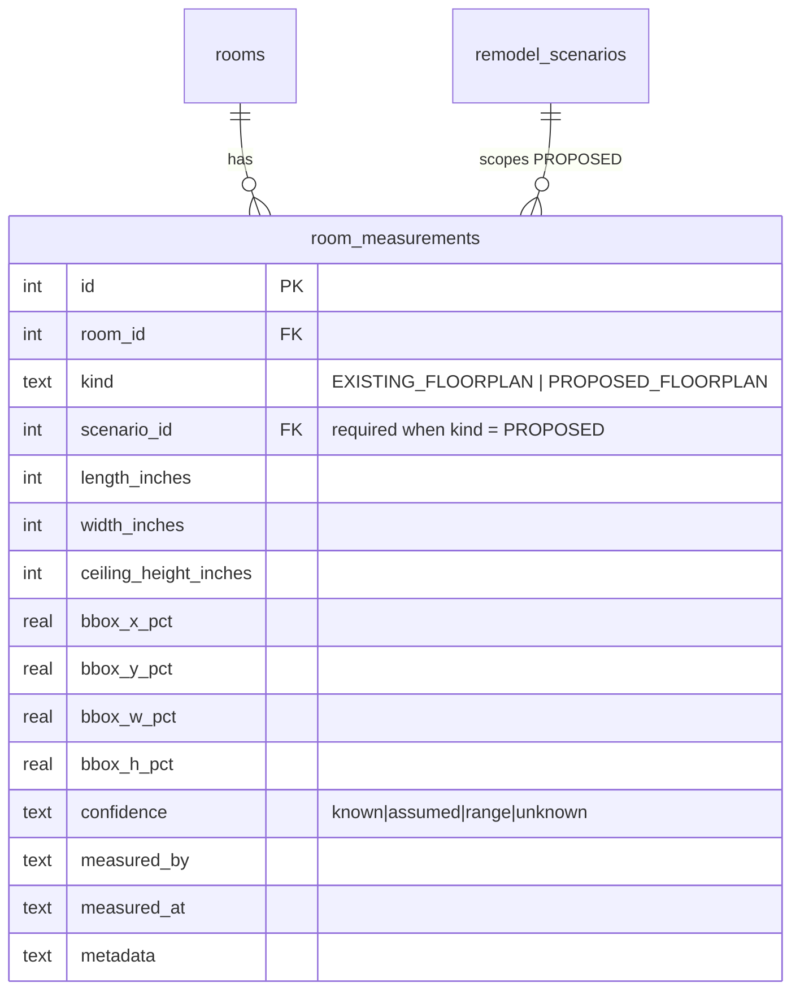

**Inches, integers, canonical.** Feet, metres, and square footage are **computed on read, never stored**. This is the same discipline as money's text + cents: one source of truth, every derived form calculated. A stored `areaSqFt` is a value that goes stale silently the first time a wall moves.

- The API exposes conversions (`ft`, `m`, `sqft`, `sqm`); D1 holds inches only.
- `confidence` reuses the 0041 vocabulary. A measurement nobody verified is `assumed`, and `roomReadiness()` already refuses to let an assumed value satisfy the trade threshold.
- **`kind` is the tense axis from 0041 §4e.** `PROPOSED_FLOORPLAN` **requires a `scenario_id`** — otherwise "proposed" is ambiguous the moment there are two scenarios, which is exactly the kitchen/living-room swap.
- The bbox columns move here too, because a proposed layout has a *different* bbox than the existing one. They stay on `rooms` as deprecated for now.

---

## 3b · Walls are the graph the ledger could not hold

### What the first attempt got right, and the one thing it got wrong

`measurements` (0006 Phase 1, 14 rows on remote) is a better as-is ledger than it is given credit for: `element_type` polymorphism across room / closet / window / door / shower / wall, optional room and floor, an authoritative `areaSqFt` override for irregular footprints, and real provenance via `source` + `isApproximate` + `accuracyNote`. Its docstring even names the skylight case explicitly.

**Its single failure: it tried to hold a graph in a JSON column.**

`spanJson` was the escape hatch for "a skylight's distance from each of the four surrounding walls" — but JSON cannot hold a foreign key, so *"36 inches from **that wall**"* degrades to a string nothing can join on. And "what is on the other side of this wall" had nowhere to live at all. That is why the model stalled at Phase 1: the next step was not expressible in it.

**Keep the ledger. Add the graph.** They are different things, and asking one table to be both is what stopped it.

| Concern | Home |
|---|---|
| "This dimension is X, measured this way, to this confidence" | `measurements` — kept, migrated to canonical inches |
| "This wall separates these two rooms, is load-bearing, and has a window 36 inches from its left end" | New relational tables below |

### Walls as first-class, shared between rooms

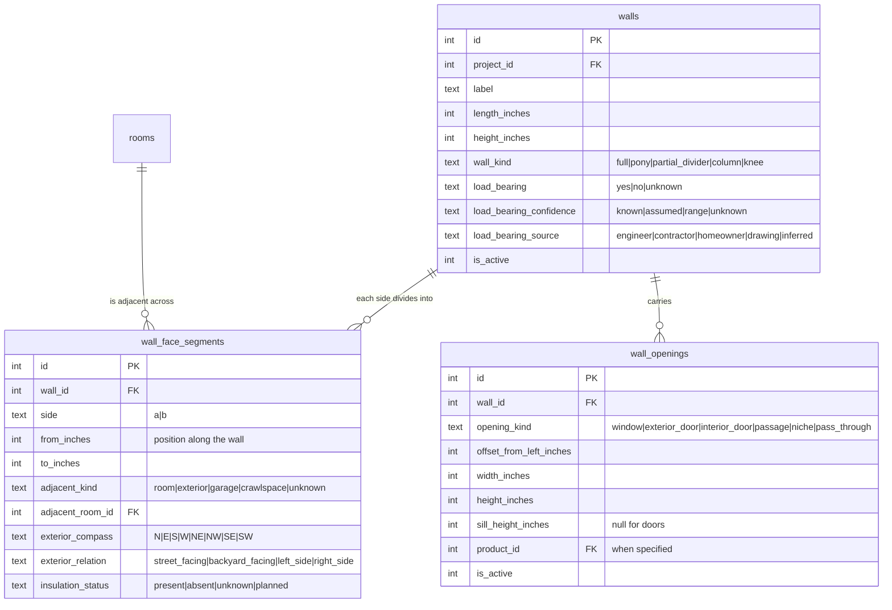

**A wall belongs to the project, not to a room.** One wall separates two spaces, and modelling it per-room would store it twice and let the copies disagree — the same error as a denormalised name.

**Segments in inches, not percentages.** The 30/30/30/10 case — part exterior, part guest bath, part living room, part laundry — is four segments with real positions. Percentages were the intuitive framing but they silently rescale the moment the wall is resized, so a 30% laundry share quietly becomes a different number of inches with no event recording it. Inches survive; the percentage is derived for display.

**Openings store offset + width, never both sides.** "Wall length to the left of the window and to the right" is one measurement and one derivation: right = `length_inches − offset − width`. Storing both is the feet-and-inches mistake again — two columns holding one fact, disagreeing the first time either is edited.

**Load-bearing is not a boolean.** The phrasing was *"known to be **or confirmed to be** load bearing"* — which is two different states, and the difference is whether a homeowner should be quoting it to a contractor. It carries a confidence and a source, reusing the vocabulary `roomReadiness()` already enforces. An `assumed` load-bearing wall is a question, not a fact.

### Ceiling features positioned by real references

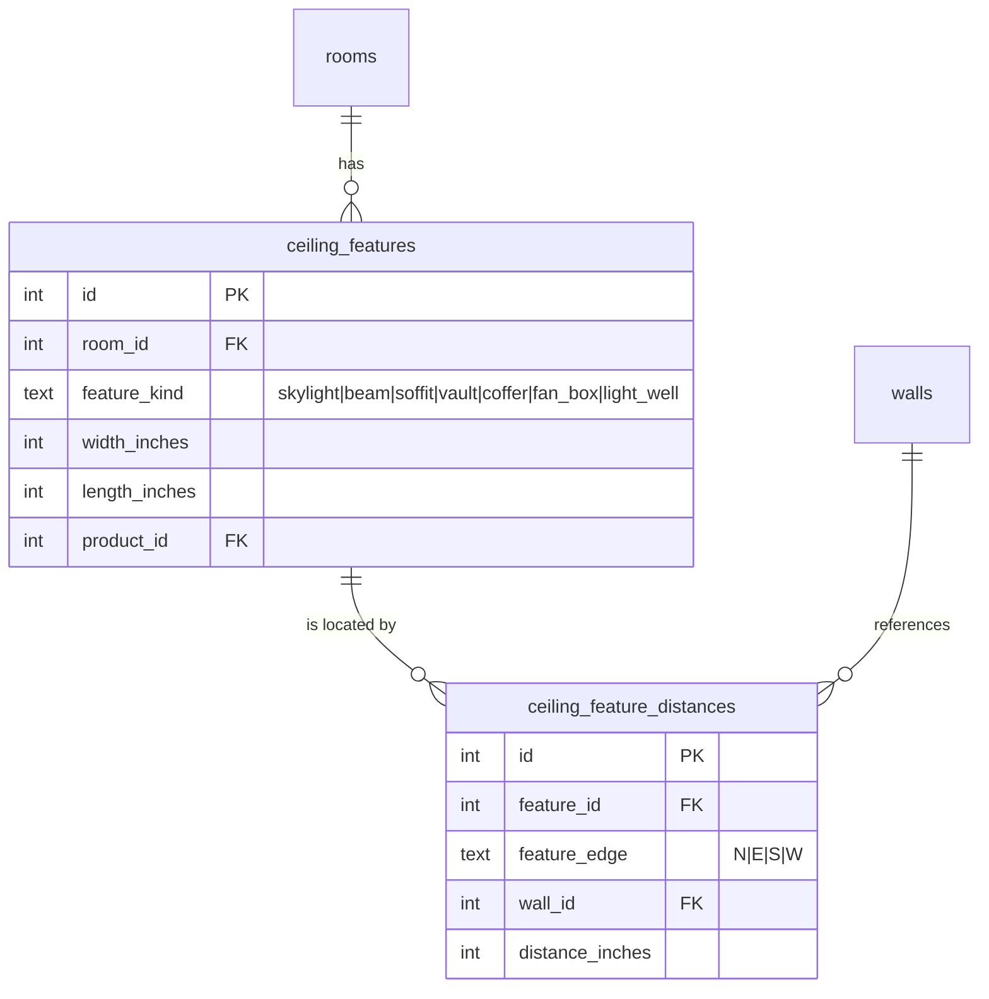

This is the `spanJson` case done relationally. A 4×4 skylight recorded as *west edge 126" to the entry wall, north edge 36" to the shower wall, east edge 23" to the back wall, south edge 36" to the vanity wall* becomes four rows with real `wall_id` FKs.

**And it locates the feature without coordinates.** Given the room's own dimensions, four edge-to-wall distances place the skylight unambiguously — the agent can say "the skylight sits in the back third, centred" and be *right*, rather than guessing. That was the point of the original design and JSON could not deliver it.

### The tense axis applies to walls too

A wall has an as-is state and a to-be state, and the to-be belongs to a scenario — the same rule as §3 and 0041 §4e. Planned changes are **not** columns on `walls`:

`wall_planned_changes(wall_id, scenario_id, change_kind, …)` where `change_kind` ∈ `keep | resize | reposition | remove | add`. A removed wall is one of the highest-ripple decisions in a remodel, and expressing it as a scenario-scoped row rather than a flag means it can be proposed, costed, and rolled back without mutating the as-is record of the house.

### Existing items — the fit-check that pays for itself

Measure what is already in the room even when it is being replaced. The case that justifies it is not documentation, it is **shopping**:

> A homeowner sees an 8-foot interior door in a showroom and adds it to a wishlist. The ceiling in that hallway is 8'0". Nobody catches it until delivery.

`room_existing_items(room_id, item_kind, width/height/depth_inches, disposition, product_id)` where `disposition` ∈ `keep | replace | remove | relocate`. Two uses:

1. **Keep** items must be accounted for in the to-be plan — a piece of furniture that no longer fits is a discovery nobody wants at the end.
2. **Replace** items give the shopping surface a baseline, so a candidate product can be fit-checked against the actual opening, ceiling, and clearance before it is bought.

### Capture: this is 0041 Phase 7, pointed at the floorplan

The half-built idea — a live floorplan canvas where an agent plots the wall it needs, the homeowner speaks *"forty and a half inches"*, and the measurement draws itself for confirmation — is **not new work.** It is 0041's conversational capture (`assistant-ui` thread + voice transcription + generative-UI confirmation loop) with the floorplan as the confirmation surface instead of a card.

That matters for sequencing: the capture problem is already funded in 0041 Phase 7, and this model is what gives it something precise to write. The confirmation step is also what makes voice capture safe — *"is this the wall I mean"* is exactly the generative-UI restatement, and getting the wrong wall is the failure mode that would otherwise poison the whole dataset.

---

## 3c · The chain this all serves

> **measurements → materials → quantity → budget → market research and showroom shopping → communication with the trade**

Measurements are not documentation. They are the first link in the only chain that matters, and every table below earns its place by moving something along it. A wall length that never becomes a paint quantity that never becomes a budget line that never becomes a showroom question was not worth capturing.

This is also the answer to "why so much detail": the detail is what lets a homeowner walk into a showroom already knowing what they need, and hand a contractor a scope that can be priced without a site visit. That is the product's stated positioning, made concrete.

---

## 3d · Eight subsystems that are actually three primitives

Wall technical details, ceiling technical details, lighting, window coverings, finishes, blocking, in-wall utilities, and acoustics all decompose identically. Building eight bespoke schemas would produce eight things that drift; the pattern underneath is small.

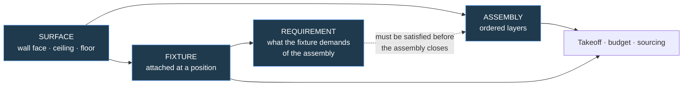

### 1 · Assemblies — an ordered stack of layers on a surface

Every finish is a build-up, and they share one shape:

| Surface | Assembly |
|---|---|
| Party wall, acoustic | studs → mineral wool → MLV → 5/8" Type X → Green Glue → 5/8" Type X → Level 5 → primer → paint |
| Shower wall | framing → cement board → liquid waterproofing → thinset → tile → grout |
| Floor | subfloor → uncoupling membrane → thinset → tile |

So: `surface_assemblies(surface_kind, surface_id, scenario_id, …)` with `assembly_layers(assembly_id, position, layer_kind, product_id, spec_json, thickness_inches)`.

**This subsumes most of the wall and ceiling technical detail as layers rather than columns.** Drywall level, thickness, and layering strategy are properties of a drywall layer. Insulation type is a layer. MLV, Green Glue, resilient channel, uncoupling membrane, waterproofing — all layers. Adding a new material technique becomes a row, not a migration, which is the same principle as `impact_definitions.riskInputs`.

**And it makes the takeoff fall out.** Quantity per layer × surface area × waste factor, straight into the budget. A `finish_level` column on `walls` could never do that.

### 2 · Fixtures — a thing attached to a surface at a position

Sconces, TVs, medicine cabinets, rainfall heads, curtain tracks, floating vanities, recessed speakers, exhaust fans, faceplates, in-wall safes, laundry chutes. One table: `surface_fixtures(surface_kind, surface_id, fixture_type_id, offset_x_inches, offset_y_inches, product_id, scenario_id, …)`.

Faceplates are fixtures, which handles the multi-switch case cleanly — two faceplates at either end of a living room, and the stair pair with a switch at the garage entrance and another upstairs, are four fixture rows on three walls with a shared circuit reference. No special model needed.

### 3 · Requirements — what a fixture demands of the assembly

This is the layer that makes the whole thing worth building, and it is where the questions come from.

| Fixture | Requirements it imposes |
|---|---|
| Wall-mounted TV | solid blocking · electrical at height · cable raceway · optional recessed niche for flush mount |
| Floating vanity | blocking rated for the loaded weight · plumbing in-wall · finish continues behind |
| Medicine cabinet | rough opening dimensions from the spec sheet · electrical if lit |
| Lit mirror | electrical pre-run · hue coordination with the room's lighting plan |
| Wall-mounted faucet | in-wall valve · access · finish penetration coordination |
| Ceiling rainfall head | ceiling blocking · plumbing drop · waterproofing above |
| Recessed curtain track | **ceiling assembly coordination** — the pocket must exist before the ceiling closes |

`fixture_requirements(fixture_type_id, requirement_kind, spec, blocks_assembly_close)` — and that last flag is the valuable one. **A requirement that must be satisfied before the wall or ceiling is closed is a hard sequencing constraint**, and missing it is the single most expensive category of remodel mistake: opening a finished wall because nobody blocked for the TV.

### The prompted questions are `ripple_rules` — for the third time

*"Will a TV be wall mounted in this room?"* is not a form field. It is a rule that triggers on **room type + intent** and resolves to `must_confirm`, exactly like tile-into-the-bathroom. Answering yes instantiates the fixture and its requirements, which then appear as blocking, electrical, and sequencing constraints — and as budget lines.

That the same engine now answers ripples, material applicability, **and** scoping questions is a strong signal it is the right primitive. One engine, three uses; not three engines.

### Finishes as definition tables

`paint_sheen_def` and `tile_format_def` are correct as drafted in spirit — vocabularies with display names and plain-language descriptions, admin-manageable, seeded with sensible starters. `tile_install_profile_def` captures the substrate / waterproofing / uncoupling / thinset / grout / joint / pattern / trim combination as a reusable named profile, which is genuinely useful because those choices travel together.

Finishes attach through the assembly layers rather than through their own mapping tables — a paint profile is the top layer of a wall assembly, a tile profile is a three-or-four-layer stack. That keeps floor and wall finishes on one mechanism instead of two.

### Progressive disclosure is not optional here

`PRODUCT.md` names the primary user as a **first-time remodeler who needs structure handed to them.** This model can ask about RSIC-1 clips, Level 5 finish, and mineral wool R-values — which is the right depth for a sophisticated owner and completely wrong as an onboarding experience.

**Intent gates the depth**, using the mechanism from §5a:

| Intent | What is asked |
|---|---|
| `OUT_OF_SCOPE` | nothing beyond dimensions |
| `SURFACE_REFRESH` | the finish layer and its quantity |
| `TARGETED_FIXTURE` | that fixture, its requirements, and the trade it drags in |
| `FULL_REMODEL` | the assembly, acoustics, blocking, and sequencing questions |

Depth is earned by scope, never presented by default. A homeowner replacing a toilet must never meet the acoustic decoupling questionnaire.

### Corrections to the drafted schema

| Drafted | Problem |
|---|---|
| `import { createInsertSchema } from 'drizzle-zod'` **in a schema file** | **Breaks `pnpm run build`.** On the pinned `drizzle-orm@0.33.0` this fails at build even though `tsc` passes. Zero schema files in this repo import it, and `measurements.ts` states the convention: *"validating enums at the API boundary rather than in the database."* Hand-write the route Zod schemas |
| `text('id').primaryKey()` with hand-authored ids | Repo convention is `integer("id").primaryKey({ autoIncrement: true })`. Hand-authored string ids also make seeds fragile |
| `.superRefine()` validation on the schema | Belongs at the API boundary, same rule as enums |
| `uncouplingMembraneRequired` restricted to `concrete_slab` | **Domain-wrong.** Uncoupling membranes are routinely specified over plywood subfloors — that is one of their primary uses. This validation would reject correct data, which is worse than no validation |
| `type` enum duplicated as a column *and* a def table | Same error corrected three times already: the def table is the vocabulary; the column is an FK |

---

## 4 · Notes

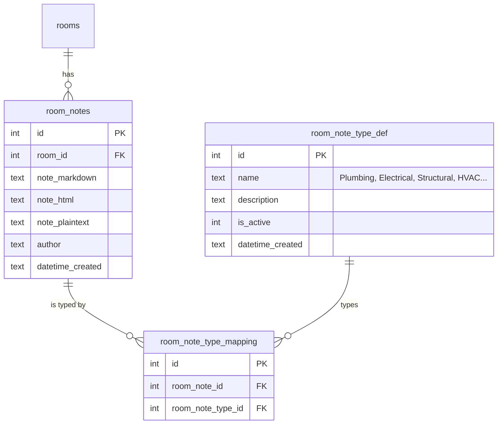

- **Three formats, always.** Markdown is the portable source of truth, HTML is the render-ready cache, plaintext is what search and embeddings consume. Notes are captured with PlateJS, which emits all three — never a bare `<textarea>`.
- `room_note_type_def` gets an admin page at `/admin/config/room/note-types`, on the existing `ConfigShell` scaffold.
- The six `*Notes` columns on `rooms` are backfilled into typed notes and deprecated in place.

---

## 5 · Problems

The largest addition, and the one with the most value beyond what was specified.

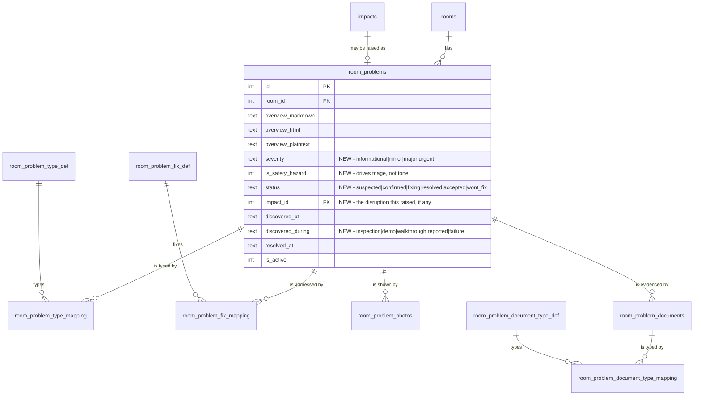

### What the spec did not include, and why each earns its place

| Addition | Why |
|---|---|
| **`severity` + `is_safety_hazard`** | The example types span *Squeaky floor* and *Active Water Leak*. Those are not the same thing, and a list that sorts them together is a list nobody trusts. Safety is a separate flag from severity because a hazard is not merely "very major" — it changes what the product is allowed to stay quiet about. |
| **`status` lifecycle** | A problem is not a fact, it is a thread: suspected → confirmed → fixing → resolved → accepted. Without it, "problems" becomes a list that only grows, which is how a feature stops being opened. `wont_fix` is deliberate and recorded, not silence. |
| **`impact_id`** | A problem found during demo **is** a `demo_discovery` impact in 0041. Linking rather than duplicating means a problem inherits blast radius, blocking, and node health for free. **Do not build a second disruption system.** |
| **`discovered_during`** | Provenance for problems. A defect found at inspection and one found by failure carry different weight with a contractor, an insurer, and a licensing board. |
| **`resolved_at`** | Time-to-resolve is the one metric that tells a homeowner whether their contractor is actually working the list. |

### Photos — FK to `images`, not a URL

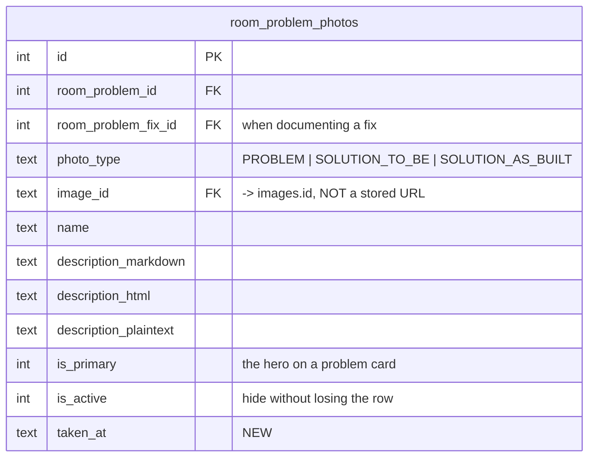

- **`cf_photo_url` becomes `image_id` → `images.id`.** The `images` table already owns Cloudflare Images ids, dedupe, soft-delete, and a room FK. Storing a URL would denormalise all of it and break the moment a variant changes.
- **`SOLUTION_AS_BUILT` added** to the enum. `PROBLEM` and `SOLUTION_TO_BE` cover the before and the plan, but the *after* is what proves the fix happened — and it is what a homeowner needs when a defect recurs and the contractor says it was fixed.
- `is_primary` should be enforced as **one per problem** by a partial unique index, the same pattern `properties.is_primary` already uses.
- **`taken_at`** because photo order matters in a dispute, and upload order is not capture order.

### Documents

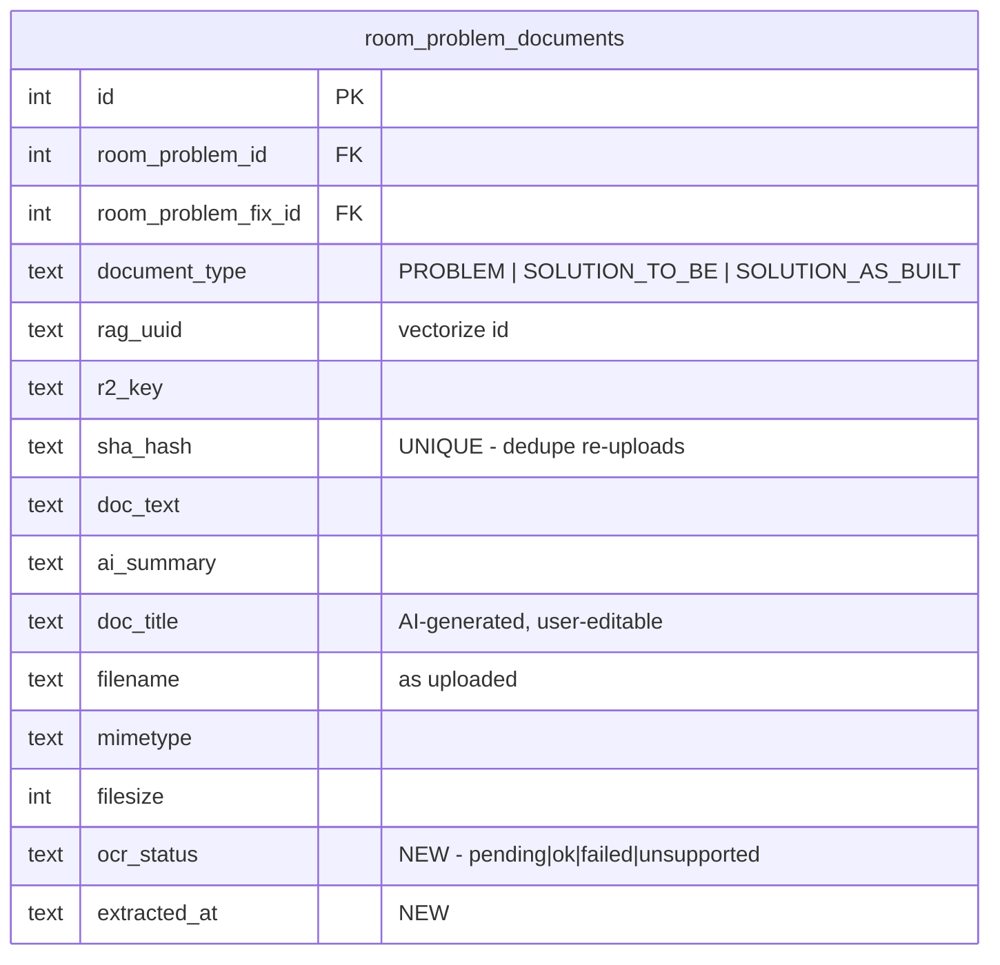

- **`sha_hash` is UNIQUE.** Re-uploading the same PDF must dedupe rather than create a second row with a second embedding — otherwise RAG returns the same document three times and the homeowner stops trusting search.
- **`ocr_status` + `extracted_at`** because extraction fails and a null `doc_text` currently cannot be told apart from "a document with no text." That ambiguity is the same class of bug as treating a missing contract clause as an absent one.
- `documents` (the existing table) is **not** reusable here — it is `{userId, title, content}` with Slate JSON, a note editor, not a file store.
- `rag_uuid` ties a document to its Vectorize embedding. Note the 64-byte id cap.

### Fixes

`room_problem_fix_def` is the vocabulary (Remediation, Drainage Installation…), `room_problem_fix_mapping` joins problem ↔ fix with its own three-format notes. **A fix should also be able to carry a cost and an owner** — `estimated_cost_cents` + `estimated_cost_text` and a `company_id` FK — because "what will this cost and who does it" is the first question after "what is wrong," and without it the fix list cannot reach the budget.

---

## 5a · Room remodel intent — and why every room gets mapped

### The argument for mapping rooms nobody is touching

Onboarding asks for every room, including the ones out of scope. That friction needs a reason, and there is a good one:

> *"I'm only remodeling the kitchen — why would I measure the rest of the house?"*
>
> Because the new hardwood has to match. The moment the homeowner decides the floor should be continuous, they need square footage for **every** room — and by then they are not in a mood to go measure the house. The system cannot ask for it retroactively at the moment it becomes useful.

The same shape recurs:

- **Ripple into unintended rooms.** Electrical work for the kitchen surfaces a panel or a circuit issue that lands in a room nobody planned to touch, and it needs documentation.
- **Expansion.** A remodel that grows into part of an adjacent room needs that room's dimensions before the decision, not after.
- **AI context.** An agent reasoning about one room with no model of the house gives worse answers than one that knows the whole floor.

**A fully-mapped house is the cheap insurance.** Out-of-scope rooms are mapped for spatial continuity, whole-house material maths, and ambient context — not because anyone plans to work on them.

### The shape: intent lives on the definition, and a room can hold several

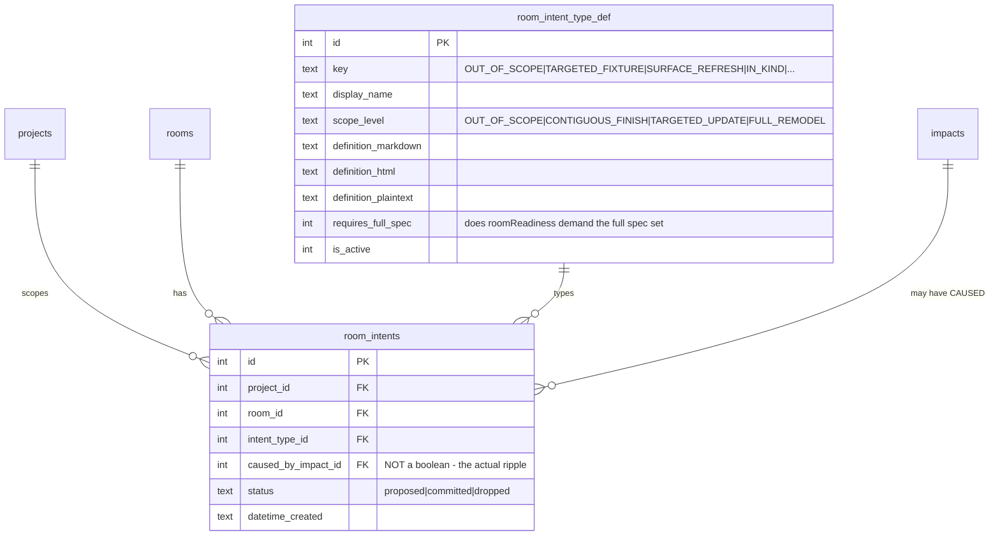

### Five corrections to the drafted schema

| Drafted | Problem | Corrected |
|---|---|---|
| `scopeLevel` **and** `intentType` columns | The same fact twice. `OUT_OF_SCOPE`, targeted-update and contiguous-finish appear in **both** enums, so the two columns can disagree — and eventually will | `scope_level` lives on `room_intent_type_def`. Derived, cannot drift, still groups and filters |
| `intentType` as an enum-constrained text column | Defeats the def table: adding an intent type still needs a migration | `intent_type_id` FK to the def table. A new type is a row |
| One intent per room | The Toto case is *two or three*: `TARGETED_FIXTURE` for the toilet, `MEP_CHANGE` for the outlet it requires, and possibly `SURFACE_REFRESH` for floor continuity | Many intents per room |
| `hasTradeRippleEffect` boolean | Says work exists because of something elsewhere but not **what**. Cannot be traced, explained, or acted on — and 0041 already models exactly this | `caused_by_impact_id` FK. A ripple is an impact with an effect targeting this room. **Do not add a boolean beside a graph that answers more** |
| `notes` as one text column | Contradicts §4 — notes are typed, many-per-room, and three-format | Use `room_notes`; drop the column |

Also: timestamps follow the repo convention — `integer({ mode: "timestamp" })` defaulting to `unixepoch()`, not TEXT `CURRENT_TIMESTAMP`. And `project_id` / `room_id` are real FKs, which the draft omitted.

### The bug this exposes in shipped code

**`roomReadiness()` as built would block every out-of-scope room forever.**

It requires each `spec_definitions` row flagged `isRequiredForThreshold` on **every** room, globally. So a room nobody is touching would sit permanently un-ready, demanding a shower valve and a drywall finish level. The threshold would be meaningless the day a real house is loaded.

**Intent has to gate the requirement set.** `spec_definitions.appliesToRoomKinds` was the wrong axis; what matters is **applies to intents**:

- `OUT_OF_SCOPE` → requires nothing. Dimensions only, and even those are optional until a whole-house material makes them matter.
- `TARGETED_FIXTURE` → requires the spec for *that fixture* and any trade it drags in, nothing else.
- `SURFACE_REFRESH` → requires the surface finish and the measurement it is calculated from.
- `IN_KIND` / `FULL_REMODEL` → the full set.

`roomReadiness()` therefore takes the room's intents into account, and a room with no intent is not "unready" — it is **not in scope**, which is a different and honest state. This is the same distinction as `unknown` versus `missing`: absence of scope is not failure to specify.

### Open: does this collide with `scenario_room_plans`?

`scenario_room_plans` already holds per-room, per-scenario `proposedUse` + `stage` + `estimatedCostCents`. Intent is *also* a to-be statement about a room, which is the same "two tables, one concept" error caught twice already in this plan.

Two candidate resolutions, and this needs deciding before either is built:

1. **Intent is committed, scenarios propose.** `room_intents` holds the current plan; a scenario may propose a different intent set, and approving the scenario writes them. Clean separation, one more join.
2. **Intent is an attribute of the plan row.** `scenario_room_plans` grows `intent_type_id`, and the committed plan is simply the approved scenario. Fewer tables; requires every project to have a scenario, which is friction on day one.

Recommendation: **(1)**, because a homeowner states intent long before they have a scenario, and forcing a scenario to exist first inverts the real sequence.

---

## 5b · Floor-wide and multi-room scope — fan out in the API, not in the data

Paint, flooring, windows, a problem affecting a whole storey, a document covering a floor: plenty of things attach to more than one room. `all_levels` existed to express that, and it was the wrong instrument — a fake floor is a shortcut in the data that **every query then has to know about forever**, and the first one that forgets it produces a wrong answer silently.

**The rule: the UI offers the shortcut, the API resolves it, the database stores per-room rows.**

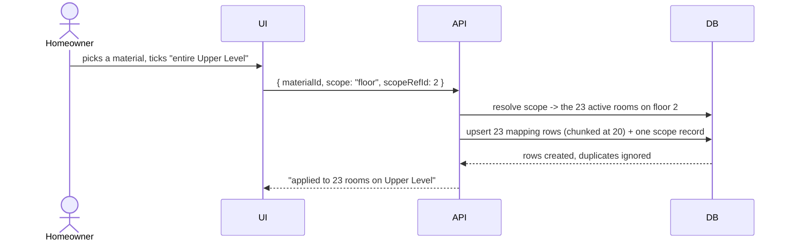

Every consumer keeps joining one way — `WHERE room_id = ?` — with no awareness that a floor was ever involved. That is the whole point.

### But store the intent alongside the rows

Fan-out on its own throws away *what the user actually said*, and three things immediately want it back:

1. **A room added to that floor later** should be offered the floor-wide materials it is missing. Bare rows cannot know they were floor-wide.
2. **Editing** should be one operation on the decision, not twenty-three edits.
3. **The UI should show "entire Upper Level" back**, not twenty-three ticked boxes. Those are different sentences, and only one of them is what the homeowner said.

So each fan-out also writes one `room_scope_applications` row:

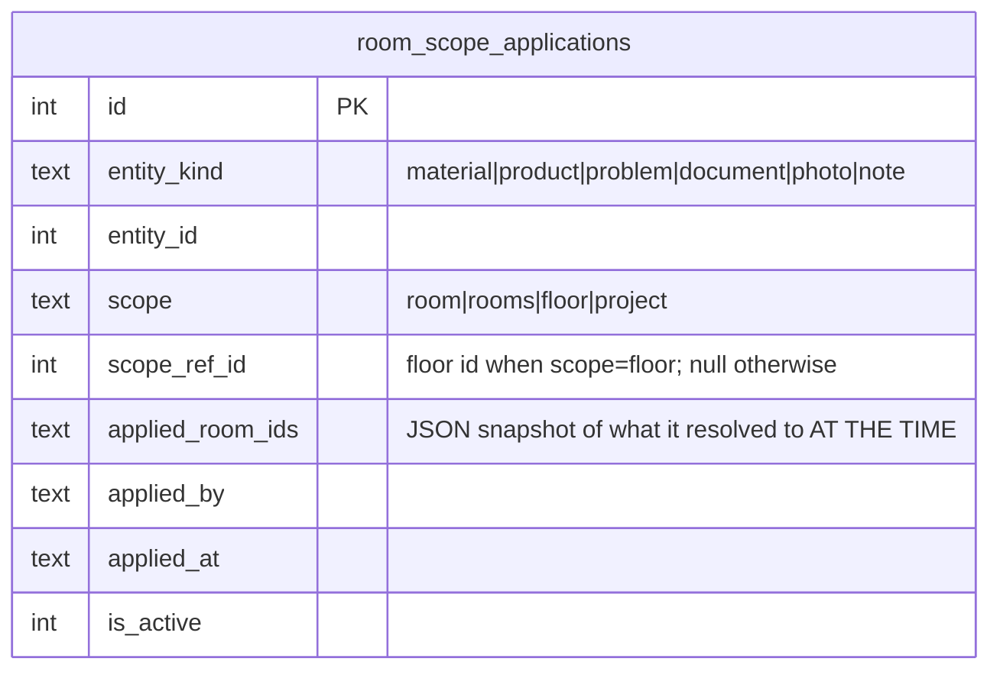

- The mapping rows remain **the truth**. This table is the **provenance of the selection** — it explains the rows, it does not replace them.
- `applied_room_ids` is a deliberate point-in-time snapshot, named for what it is. It answers "what did this mean when it was applied," which is different from "what would it mean now" — the same distinction as `decision_reopenings.reasonAtTime`.

### Implementation notes that will otherwise bite

- **One shared helper, not five implementations.** Materials, products, problems, documents, photos, and notes all need identical behaviour. `resolveRoomScope({ scope, scopeRefId, roomIds })` returns the room set; each entity's mapping writer consumes it. Six bespoke versions will drift.
- **Chunk at 20.** This is a fan-out feature *by design* — 23 rooms × several columns exceeds D1's 100-bound-parameter cap in a single statement. Chunk, then `db.batch()` each chunk.
- **Idempotent.** Re-applying "entire floor" must not double up: every mapping table carries a UNIQUE on `(entity_id, room_id)` and the writer uses `onConflictDoNothing`.
- **Resolve against ACTIVE rooms only.** `rooms.isActive = false` are merged or deactivated records; fanning out onto them would resurrect dead rooms into live scope.
- **Scope is not membership.** Removing a room from the floor-wide set is a per-room delete plus a note on the scope record — it must not silently re-apply on the next fan-out.

### `all_levels` therefore goes

It has zero rooms, its purpose is served properly by the mechanism above, and leaving it invites exactly the shortcut this section rejects. Retire it, and if scope markers are ever needed in `floors` again, add an explicit `is_physical` flag so a non-floor cannot quietly become a floor.

---

## 5c · Material types, applicability, and takeoffs

### The type carries the envelope; the application carries the fact

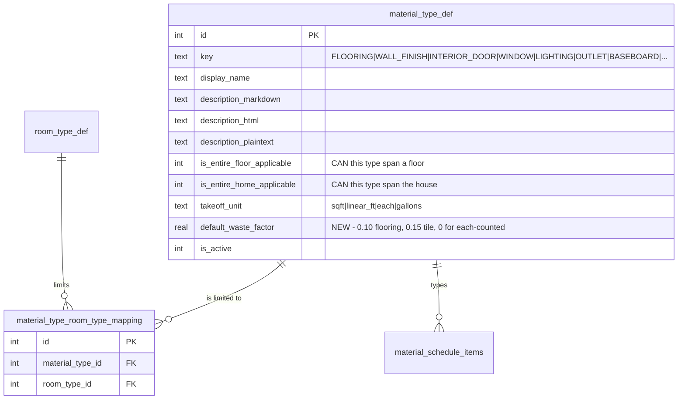

**The flags describe what a type *can* do, not what was done.** "Flooring can span the house" is a property of flooring; a specific tile SKU inherits it. What actually happened is already recorded by `room_scope_applications` from §5b. Keeping the two separate is what stops the same fact living in two places and drifting.

**`isRoomTypeUnique` + one `room_type_id` becomes a mapping.** A shower valve is unique to bathrooms *and* wet rooms; a range hood to kitchens *and* a butler's pantry. A single-value constraint on a genuinely many-valued relationship is the same shape corrected twice already in this plan, so it is corrected here up front rather than after it ships.

### Applicability rules — reuse `ripple_rules`, do not build a second engine

The flooring logic is a rules problem with exactly the structure 0041 already has: trigger → consequence → does a human have to confirm.

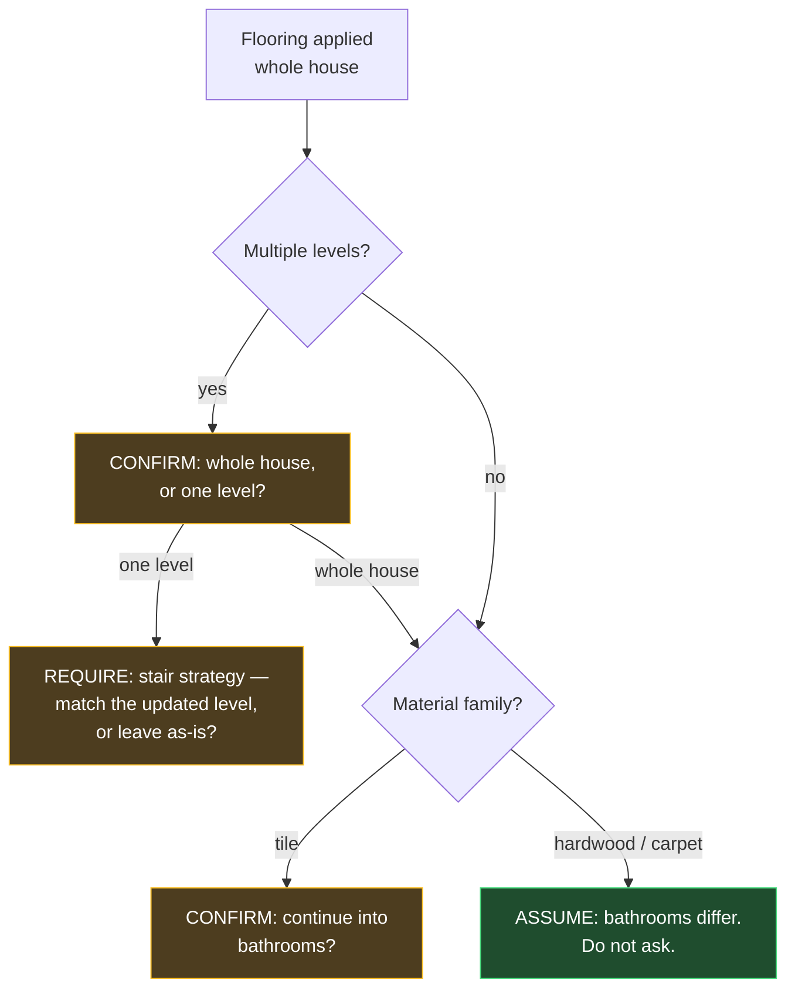

**The valuable part is not the branching — it is knowing which branches are questions.** Tile continuing into a bathroom is genuinely ambiguous, so it is a confirm. Hardwood continuing into a bathroom is almost never the intent, so it is an assumption and asking would be noise. An app that asks both is a nag; an app that asks neither is wrong. That distinction is the product.

So the rule row carries an explicit resolution:

| `resolution` | Behaviour |
|---|---|
| `auto_apply` | Extend the material without asking |
| `auto_exclude` | Do **not** extend; state the assumption where it is visible, do not interrupt |
| `must_confirm` | Stop and ask, with the reason shown |
| `must_specify` | Cannot proceed until the homeowner supplies a decision — the stair case |

`ripple_rules` already has `trigger_match`, `consequences`, `rationale`, `strength`, and `jurisdiction`. Adding `resolution` and reusing it beats a parallel `material_applicability_rules` table that would drift from it.

**The stair case is the good one.** Choosing one level forces a stair decision — the stairs are the seam between two flooring strategies and there is no defensible default. `must_specify` is exactly right: not a nag, a genuine unknown that blocks a correct takeoff.

### Takeoffs — computed, never stored

Square footage of flooring, linear feet of baseboard, gallons of paint, counts of doors, outlets and lights. All **derived on read** from measurements + intent + material type, never written to D1 — the same rule as measurements themselves. A stored takeoff is wrong the first time a wall moves, and nobody notices.

| Takeoff | Needs | Status |
|---|---|---|
| Flooring sqft | area + waste factor | Ready — area is derivable from length × width, or the explicit override |
| Paint sqft | **perimeter** × ceiling height − openings | **Blocked — see below** |
| Baseboard linear ft | **perimeter** − door openings | **Blocked** |
| Interior doors | count of door openings | Needs an openings model |
| Lighting / outlets | count | Needs an openings/fixtures model |

### The gap: perimeter is not derivable

`length × width` gives area for a rectangle and nothing useful for anything else. `rooms.areaSqFt` exists precisely because rooms are not rectangles — its docstring cites the L-shaped lower foyer at 77.28 sq ft.

**Paint and baseboard are perimeter problems, and perimeter cannot be inferred from an area override.** Two rooms of identical area have wildly different perimeters.

So `room_measurements` gains:

- **`perimeter_inches`** — measured, not computed. Without it, baseboard and paint takeoffs are guesses presented as numbers, which is worse than no number at all.
- **`ceiling_height_inches`** — already in §3, and paint depends on it.
- **`openings`** — a small child table (`room_openings`: kind = `door | window | passage | niche`, width/height in inches, plus a `product_id` FK when it is a specified door or window). Openings are what get subtracted from paint and baseboard, and counted for the door takeoff. They are also what `FENESTRATION_CHANGE` intent operates on.

**`default_waste_factor` on the type.** Every real takeoff adds waste — roughly 10% for plank flooring, 15% for tile with a diagonal lay, none for anything counted individually. A takeoff without it under-orders, and under-ordering tile means a dye-lot mismatch, which is not a rounding error but a re-do. The factor is a default on the type and overridable per material.

**Every takeoff reports its inputs and its confidence.** A number computed from an `assumed` measurement is presented as an estimate with its basis shown, never as a quantity to order from. This is `PRODUCT.md` principle 7 applied to arithmetic: do not hand someone a number they will act on without showing what it rests on.

---

## 6 · Further schema work, as requested

Ordered by how much each would hurt to retrofit.

### Highest value

1. **`room_problems` → budget.** A confirmed problem with a fix and a cost should be promotable to a budget line in one action, carrying its provenance. Today an unplanned discovery enters the budget as an untraceable number, which is exactly how a homeowner loses the thread on why they are over.
2. **Rooms ↔ materials/products already exist but are not tensed.** `material_schedule_items.roomId` points at a space. After a use-swap, does the tile belong to *the space* or *the kitchen*? Almost always the space. Worth an explicit decision and a comment, because the wrong answer silently moves everyone's finishes during a swap.
3. **Trade coverage per room.** There is no table saying which contractor is responsible for which room's scope. `room_trade_assignments(room_id, company_id, trade_type_id, scope_notes)` is what makes "who do I call about this" answerable, and it is what the 0042 replacement-handoff package needs to say what a replacement is inheriting.
4. **Permits ↔ rooms.** `permits_records` exists but is property-scoped. A permit usually covers *specific* rooms, and the ripple rules already assume permit-affects-room. Without a mapping, "does this change affect the permit" cannot be answered per room.

### Worth doing, lower urgency

5. **Room timeline.** One append-only `room_events` stream — stop changes, notes, problems, photos, purchases, visits — is what makes the room screen's history readable without seven joins, and it is the substrate for 0041's traversable history.
6. **Deprecate `rooms.metadata` and `rooms.problemAreas`.** Both are JSON escape hatches that this plan replaces with real tables. Stop writing them.
7. **`floors` should lose `all_levels`** and gain an explicit `is_physical` flag if scope markers are ever needed again — so a non-floor cannot quietly become a floor.
8. **Room kinds as a definition table.** `rooms.asIsUse` and `scenario_room_plans.proposedUse` are free text. Both should reference a `room_use_def` vocabulary — otherwise "kitchen", "Kitchen", and "kitchen " are three different uses and the swap logic cannot match them.

### Deliberately not proposed

- Merging `rooms` into a generic "spaces" table. The gain is theoretical and the migration touches every child.
- Dropping the deprecated columns. See §1 — not worth a rebuild of a parent with children on D1.

---

## 7 · Migration order

| Phase | Work |
|---|---|
| **0** | Definition tables + their admin pages: note types, problem types, fix types, document types, room uses. Plus `resolveRoomScope()` and `room_scope_applications` — every later phase fans out through it, so it lands first. |
| **1** | `room_measurements` + backfill from the `rooms` dimension columns; API conversions; deprecate in place |
| **2** | `room_notes` + mapping; backfill the six `*Notes` columns into typed notes; deprecate in place |
| **3** | `room_problems` + types, fixes, photos, documents; link to `impacts` |
| **4** | Promote-to-budget, trade assignments, permit↔room mapping |
| **5** | `room_events` timeline; retire `all_levels`; `room_use_def` |

Every phase is additive. Nothing is dropped from `rooms`.

---

## 8 · Open decisions

- Do materials and products belong to **the space** or to **the use** across a swap? (Recommendation: the space.)
- Should `room_problems` be visible on the **public/vendor** surfaces, or operator-only until a fix is scoped? A visible problem list changes what a bidder prices.
- Does a problem need **multi-room** support — one leak affecting two rooms — or is a per-room problem with a shared impact enough? (Recommendation: the latter; the impact graph already does multi-target.)
