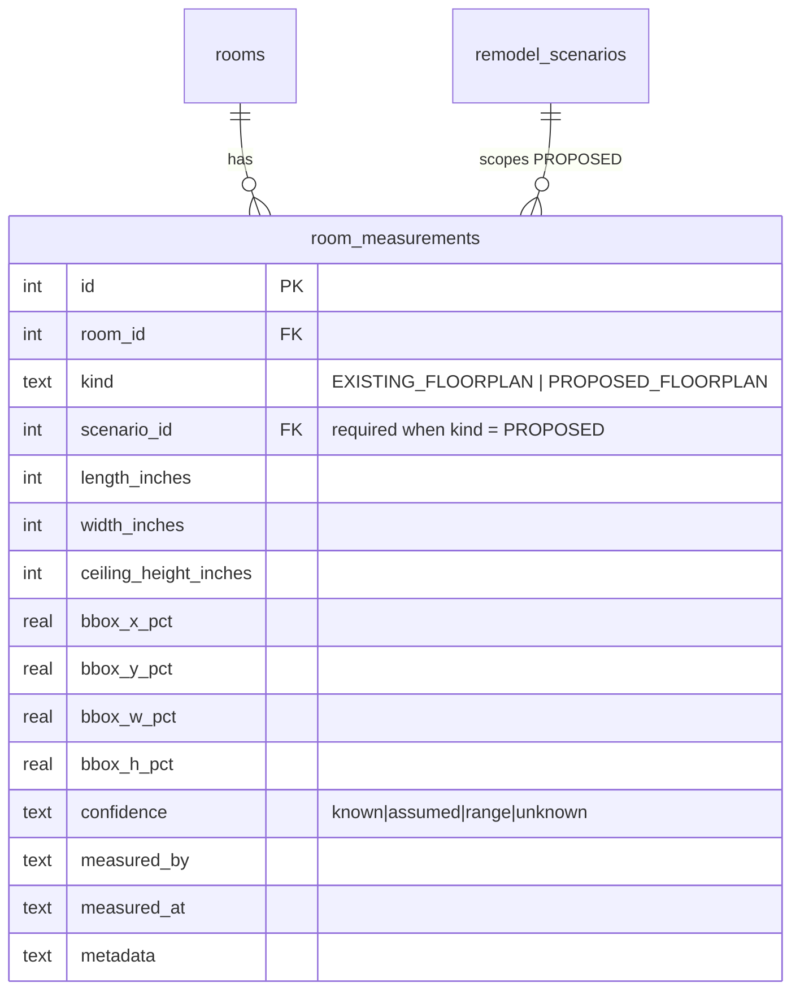
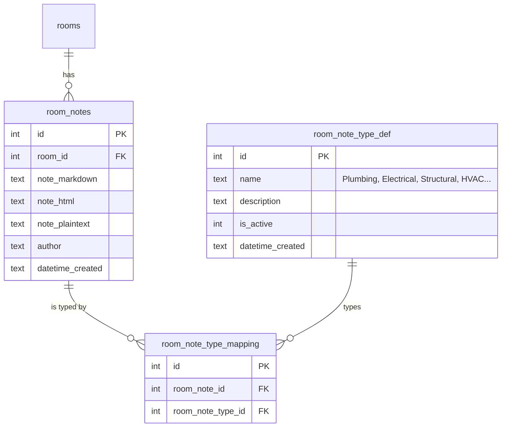
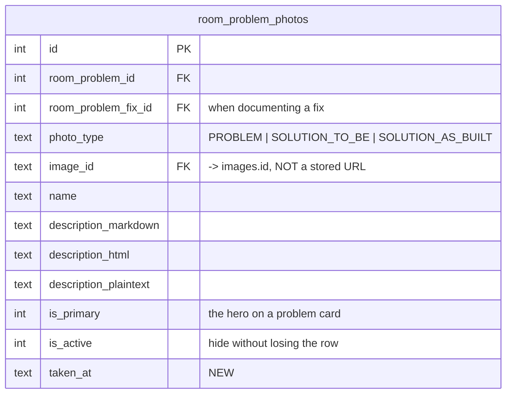
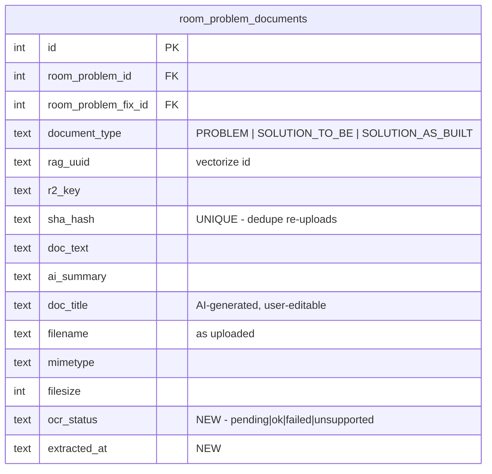

# 0043 · Room model overhaul

> **Status:** proposed · **Slug:** `room-model-overhaul` · **Filed:** 2026-08-02
> **Depends on:** [0041](../0041_homeowner_experience/IMPLEMENTATION_PLAN.md) — the impact graph, room tense, and `nodeHealth()`.

---

## 1 · What is actually wrong with `rooms`

Checked against remote before designing. The picture is better in one place and worse in another than it looks.

### Not wrong: floor ids

`233121` is a **real floor** — `outside` — and `233122` is `all_levels`. **Zero orphan FKs.**

| id | key | name | active rooms |
|---:|---|---|---:|
| 1 | `lower_level` | Lower Level | 18 |
| 2 | `upper_level` | Upper Level | 23 |
| 233121 | `outside` | Outside | 3 |
| 233122 | `all_levels` | All Levels | 0 |

Floors 1–2 got clean autoincrement ids; the other two came from a seed that supplied explicit ids. Cosmetically alarming, functionally fine.

### Actually wrong

1. **`all_levels` is not a floor.** It is a *scope marker* — "this applies to the whole house" — smuggled into a table of physical locations. It currently has zero rooms, so it is cheap to remove now and expensive once something uses it. Whole-project concerns belong at the project level, not in a fake floor (0041 already says: do not force project-wide concerns into a fake room).
2. **`rooms` is carrying four unrelated concerns**: identity, measurements, notes, and problem tracking — as loose columns (`problemAreas`, `plumbingNotes`, `electricalNotes`, `structuralNotes`, `hvacNotes`, `generalNotes`, `metadata`). Each is a one-per-room text field, so today a room cannot have two plumbing notes, or a note that concerns both plumbing and structural.
3. **Measurements are stored converted.** `lengthFeet` + `lengthInches` + `widthFeet` + `widthInches` + `areaSqFt` store the same fact in several units, which is the money-as-float mistake in a different costume: the moment one is edited the others are wrong and nothing reconciles them.

### The constraint that shapes the whole migration

**Columns cannot be safely dropped from `rooms`.** On SQLite a column drop is a table rebuild, and on D1 a rebuild of a parent with children is the documented way child data silently disappears. `rooms` has many children.

So every "move X out of rooms" below is: **add the new table → backfill → stop writing the old column → mark it deprecated in the schema docstring → leave it in place.** Nothing is dropped. A later, deliberate, backed-up rebuild can reclaim them if it is ever worth it.

---

## 2 · Corrections to the spec

Two mapping tables were shaped against the wrong pair. Recorded so the reasoning survives.

### Notes — the mapping is note↔type, not room↔type

As specified, `room_note_type_mapping(room_id, room_note_type_id)` maps a *room* to a type, and `room_notes` carried no `room_id` at all. But the stated goal —

> *"notes that have multiple type involvements … when we need trades to collaborate on an issue that impacts all of them"*

— is a property of **a note**, not of a room. A room "having" a plumbing type means nothing; a *note* being both plumbing and structural is the case that matters.

**Corrected:** `room_notes` owns `room_id`; the mapping joins `room_note_id` ↔ `room_note_type_id`.

### Problems — one instance row, not two tables

`room_problem_mapping(room_id, problem_type_id, notes)` and `room_problems(room_id, overview)` both describe "a problem this room has." That is one concept split across two tables, and it creates the question "which one is the problem?" at every join.

**Corrected:** `room_problems` is the instance. Because a problem can genuinely be more than one type — an active leak is both *Active Water Leak* and *Code Compliance* — the mapping joins `room_problem_id` ↔ `room_problem_type_id`, mirroring the notes fix.

---

## 3 · Measurements

**Inches, integers, canonical.** Feet, metres, and square footage are **computed on read, never stored**. This is the same discipline as money's text + cents: one source of truth, every derived form calculated. A stored `areaSqFt` is a value that goes stale silently the first time a wall moves.

- The API exposes conversions (`ft`, `m`, `sqft`, `sqm`); D1 holds inches only.
- `confidence` reuses the 0041 vocabulary. A measurement nobody verified is `assumed`, and `roomReadiness()` already refuses to let an assumed value satisfy the trade threshold.
- **`kind` is the tense axis from 0041 §4e.** `PROPOSED_FLOORPLAN` **requires a `scenario_id`** — otherwise "proposed" is ambiguous the moment there are two scenarios, which is exactly the kitchen/living-room swap.
- The bbox columns move here too, because a proposed layout has a *different* bbox than the existing one. They stay on `rooms` as deprecated for now.

---

## 4 · Notes

- **Three formats, always.** Markdown is the portable source of truth, HTML is the render-ready cache, plaintext is what search and embeddings consume. Notes are captured with PlateJS, which emits all three — never a bare `<textarea>`.
- `room_note_type_def` gets an admin page at `/admin/config/room/note-types`, on the existing `ConfigShell` scaffold.
- The six `*Notes` columns on `rooms` are backfilled into typed notes and deprecated in place.

---

## 5 · Problems

The largest addition, and the one with the most value beyond what was specified.

### What the spec did not include, and why each earns its place

| Addition | Why |
|---|---|
| **`severity` + `is_safety_hazard`** | The example types span *Squeaky floor* and *Active Water Leak*. Those are not the same thing, and a list that sorts them together is a list nobody trusts. Safety is a separate flag from severity because a hazard is not merely "very major" — it changes what the product is allowed to stay quiet about. |
| **`status` lifecycle** | A problem is not a fact, it is a thread: suspected → confirmed → fixing → resolved → accepted. Without it, "problems" becomes a list that only grows, which is how a feature stops being opened. `wont_fix` is deliberate and recorded, not silence. |
| **`impact_id`** | A problem found during demo **is** a `demo_discovery` impact in 0041. Linking rather than duplicating means a problem inherits blast radius, blocking, and node health for free. **Do not build a second disruption system.** |
| **`discovered_during`** | Provenance for problems. A defect found at inspection and one found by failure carry different weight with a contractor, an insurer, and a licensing board. |
| **`resolved_at`** | Time-to-resolve is the one metric that tells a homeowner whether their contractor is actually working the list. |

### Photos — FK to `images`, not a URL

- **`cf_photo_url` becomes `image_id` → `images.id`.** The `images` table already owns Cloudflare Images ids, dedupe, soft-delete, and a room FK. Storing a URL would denormalise all of it and break the moment a variant changes.
- **`SOLUTION_AS_BUILT` added** to the enum. `PROBLEM` and `SOLUTION_TO_BE` cover the before and the plan, but the *after* is what proves the fix happened — and it is what a homeowner needs when a defect recurs and the contractor says it was fixed.
- `is_primary` should be enforced as **one per problem** by a partial unique index, the same pattern `properties.is_primary` already uses.
- **`taken_at`** because photo order matters in a dispute, and upload order is not capture order.

### Documents

- **`sha_hash` is UNIQUE.** Re-uploading the same PDF must dedupe rather than create a second row with a second embedding — otherwise RAG returns the same document three times and the homeowner stops trusting search.
- **`ocr_status` + `extracted_at`** because extraction fails and a null `doc_text` currently cannot be told apart from "a document with no text." That ambiguity is the same class of bug as treating a missing contract clause as an absent one.
- `documents` (the existing table) is **not** reusable here — it is `{userId, title, content}` with Slate JSON, a note editor, not a file store.
- `rag_uuid` ties a document to its Vectorize embedding. Note the 64-byte id cap.

### Fixes

`room_problem_fix_def` is the vocabulary (Remediation, Drainage Installation…), `room_problem_fix_mapping` joins problem ↔ fix with its own three-format notes. **A fix should also be able to carry a cost and an owner** — `estimated_cost_cents` + `estimated_cost_text` and a `company_id` FK — because "what will this cost and who does it" is the first question after "what is wrong," and without it the fix list cannot reach the budget.

---

## 6 · Further schema work, as requested

Ordered by how much each would hurt to retrofit.

### Highest value

1. **`room_problems` → budget.** A confirmed problem with a fix and a cost should be promotable to a budget line in one action, carrying its provenance. Today an unplanned discovery enters the budget as an untraceable number, which is exactly how a homeowner loses the thread on why they are over.
2. **Rooms ↔ materials/products already exist but are not tensed.** `material_schedule_items.roomId` points at a space. After a use-swap, does the tile belong to *the space* or *the kitchen*? Almost always the space. Worth an explicit decision and a comment, because the wrong answer silently moves everyone's finishes during a swap.
3. **Trade coverage per room.** There is no table saying which contractor is responsible for which room's scope. `room_trade_assignments(room_id, company_id, trade_type_id, scope_notes)` is what makes "who do I call about this" answerable, and it is what the 0042 replacement-handoff package needs to say what a replacement is inheriting.
4. **Permits ↔ rooms.** `permits_records` exists but is property-scoped. A permit usually covers *specific* rooms, and the ripple rules already assume permit-affects-room. Without a mapping, "does this change affect the permit" cannot be answered per room.

### Worth doing, lower urgency

5. **Room timeline.** One append-only `room_events` stream — stop changes, notes, problems, photos, purchases, visits — is what makes the room screen's history readable without seven joins, and it is the substrate for 0041's traversable history.
6. **Deprecate `rooms.metadata` and `rooms.problemAreas`.** Both are JSON escape hatches that this plan replaces with real tables. Stop writing them.
7. **`floors` should lose `all_levels`** and gain an explicit `is_physical` flag if scope markers are ever needed again — so a non-floor cannot quietly become a floor.
8. **Room kinds as a definition table.** `rooms.asIsUse` and `scenario_room_plans.proposedUse` are free text. Both should reference a `room_use_def` vocabulary — otherwise "kitchen", "Kitchen", and "kitchen " are three different uses and the swap logic cannot match them.

### Deliberately not proposed

- Merging `rooms` into a generic "spaces" table. The gain is theoretical and the migration touches every child.
- Dropping the deprecated columns. See §1 — not worth a rebuild of a parent with children on D1.

---

## 7 · Migration order

| Phase | Work |
|---|---|
| **0** | Definition tables + their admin pages: note types, problem types, fix types, document types, room uses |
| **1** | `room_measurements` + backfill from the `rooms` dimension columns; API conversions; deprecate in place |
| **2** | `room_notes` + mapping; backfill the six `*Notes` columns into typed notes; deprecate in place |
| **3** | `room_problems` + types, fixes, photos, documents; link to `impacts` |
| **4** | Promote-to-budget, trade assignments, permit↔room mapping |
| **5** | `room_events` timeline; retire `all_levels`; `room_use_def` |

Every phase is additive. Nothing is dropped from `rooms`.

---

## 8 · Open decisions

- Do materials and products belong to **the space** or to **the use** across a swap? (Recommendation: the space.)
- Should `room_problems` be visible on the **public/vendor** surfaces, or operator-only until a fix is scoped? A visible problem list changes what a bidder prices.
- Does a problem need **multi-room** support — one leak affecting two rooms — or is a per-room problem with a shared impact enough? (Recommendation: the latter; the impact graph already does multi-target.)
