# 0043 · Schema & interaction diagrams

> Visual companion to [IMPLEMENTATION_PLAN.md](IMPLEMENTATION_PLAN.md).
> ✅ = built and applied to remote. Everything else is proposed.

---

## 1 · The physical model — rooms, walls, surfaces

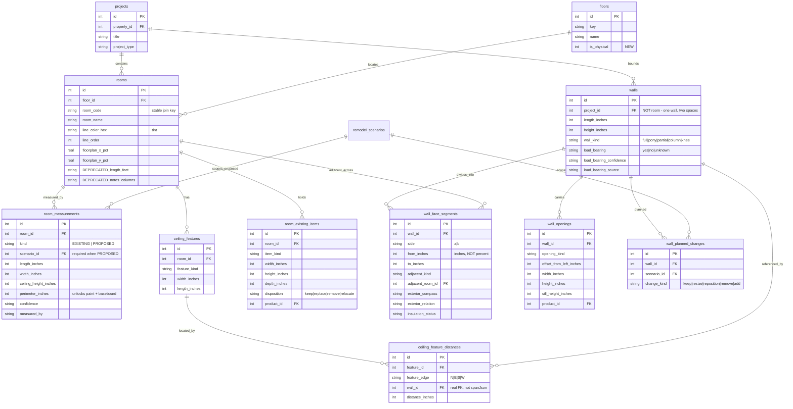

---

## 2 · Surfaces — assemblies, fixtures, requirements

The three primitives that replace eight would-be subsystems.

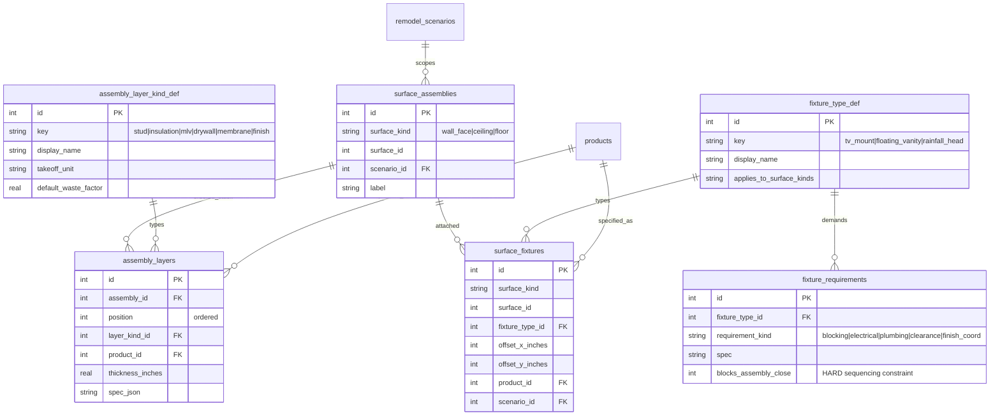

**`blocks_assembly_close` is the highest-value column here.** A requirement that must be met before a wall or ceiling closes is a sequencing constraint, and missing it means opening a finished wall.

---

## 3 · Notes, problems, intent

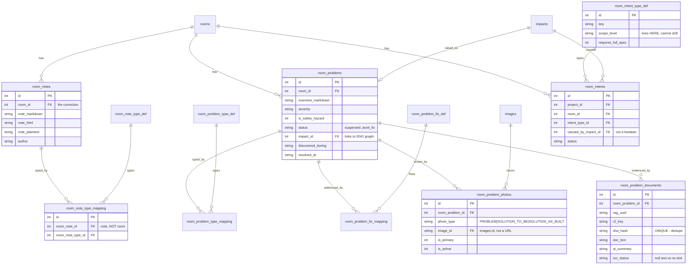

---

## 4 · The 0041 spine this hangs from ✅

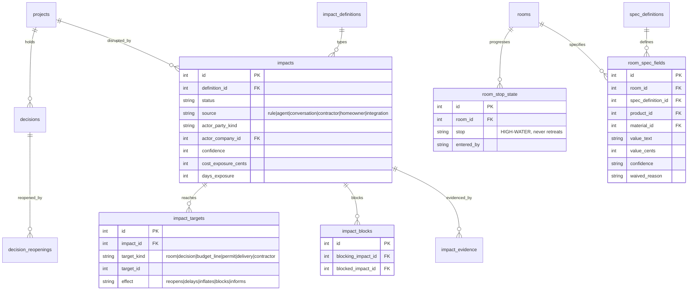

---

## 5 · Service interactions

The resolvers and engines, and what each is allowed to touch. **There is exactly one of each.**

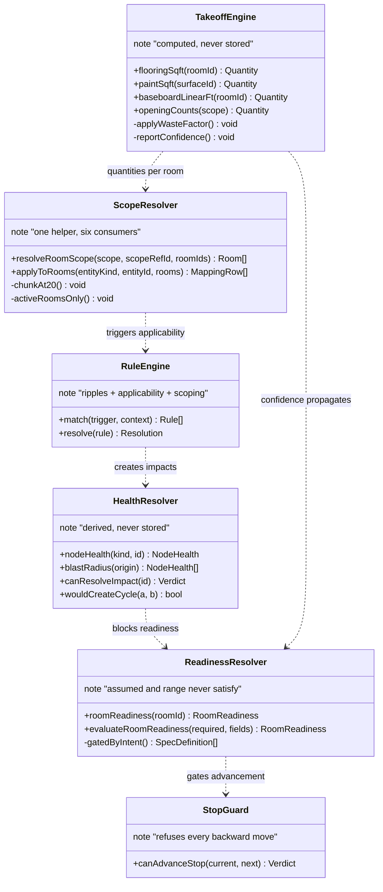

**Why one of each matters:** two readiness implementations would drift, and a drifting readiness guarantee tells a homeowner they are ready to face the trade when they are not.

---

## 6 · The chain — measurement to trade

```mermaid
flowchart LR
  M["MEASUREMENT<br/>walls, openings,<br/>perimeter, ceiling"] --> D["DISTINCTION<br/>load-bearing? tile or wood?<br/>wall-hung vanity?"]
  D --> R["RULE<br/>ripple_rules matches"]
  R --> I["IMPACT<br/>+ REQUIREMENT"]
  I --> MAT["MATERIAL<br/>assembly layers,<br/>fixtures"]
  MAT --> Q["QUANTITY<br/>area x layers x waste"]
  Q --> B["BUDGET<br/>per room, per line"]
  B --> S["SOURCING<br/>showroom, vendor,<br/>package quote"]
  S --> T["TRADE<br/>priceable scope,<br/>no site visit"]
  classDef start fill:#1f3a4d,stroke:#60a5fa,color:#fff
  classDef mid fill:#4d3d1f,stroke:#fbbf24,color:#fff
  classDef end fill:#1f4d2e,stroke:#4ade80,color:#fff
  class M,D start
  class R,I,MAT,Q mid
  class B,S,T end
```

**A distinction that does not move something along this chain was not worth capturing.**

---

## 7 · Ripple — remove the wall between kitchen and living room

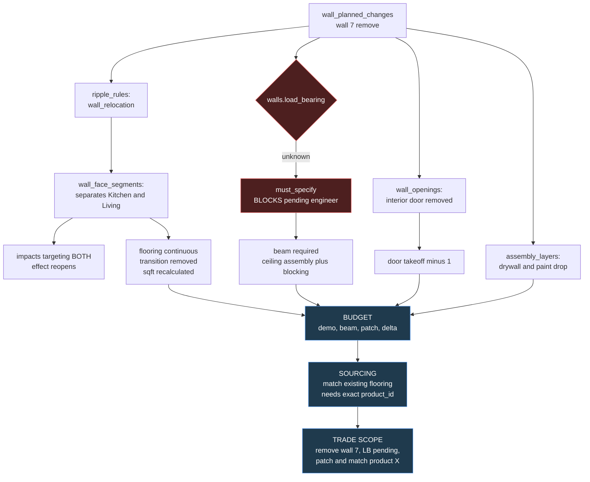

**Every arrow is data, not inference.** The system knows both rooms are affected because `wall_face_segments` says so; knows a door disappears because `wall_openings` says so; knows the flooring needs matching because `assembly_layers` holds the existing product id.

---

## 8 · Materials, rooms, budget — the relationship

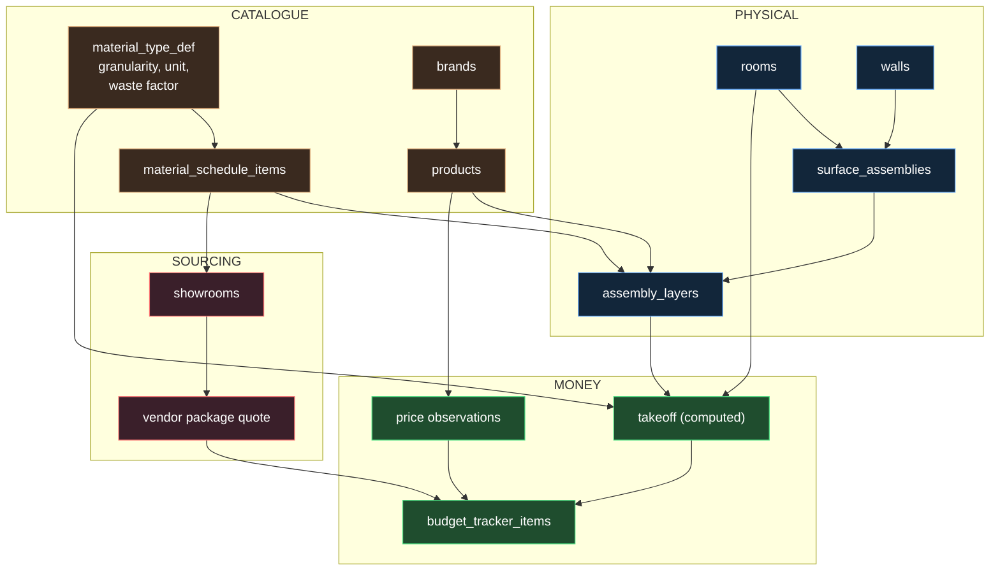

**The takeoff is the join.** It is the only thing that turns a physical fact into a number a budget can hold, and it is computed on read — never stored, because a stored quantity is wrong the first time a wall moves and nobody notices.

---

## 9 · Applicability — which branches are questions

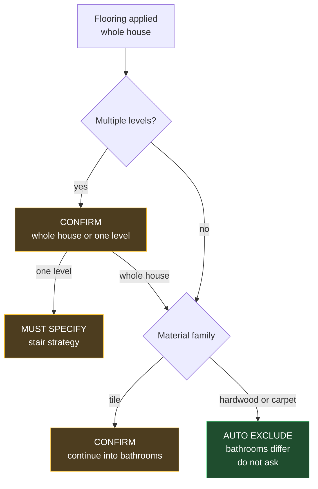

**An app that asks both is a nag; one that asks neither is wrong.** Encoding which is which is the product.

---

## 10 · Scope fan-out

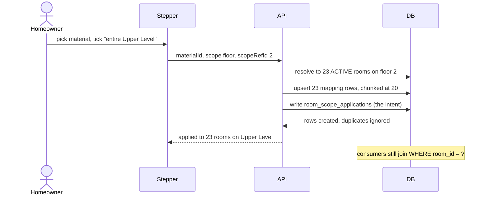

---

## 11 · Voice capture on the floorplan

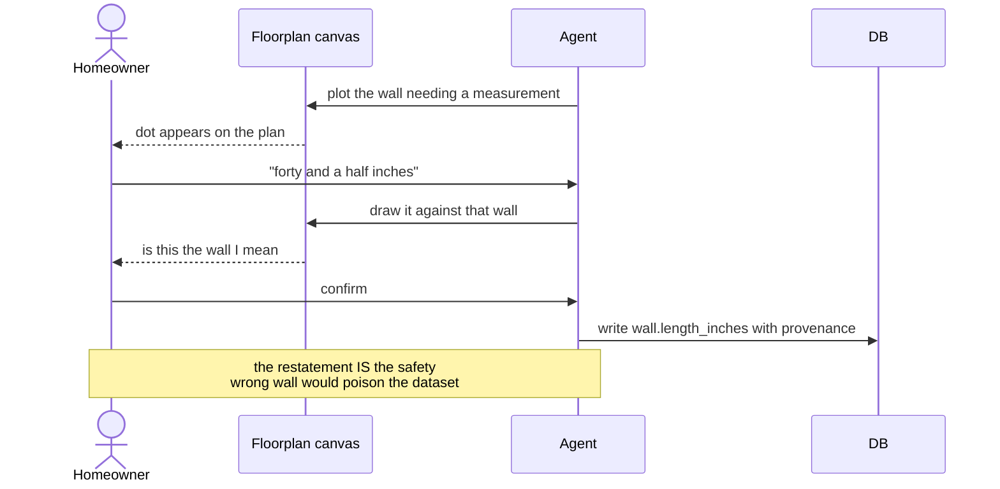

---

## 12 · Lifecycles

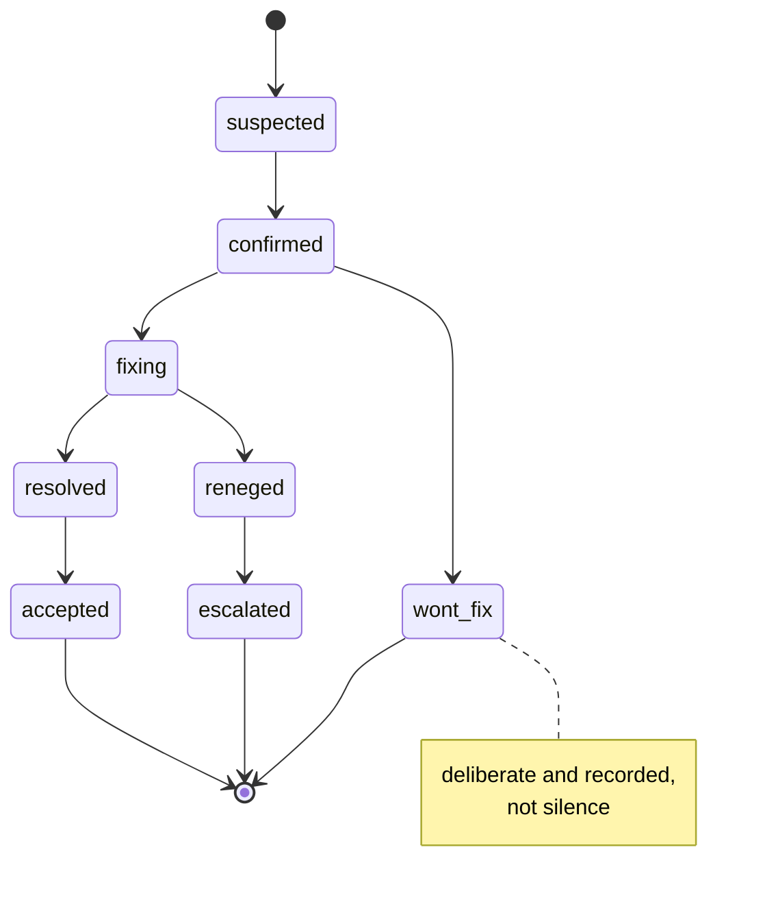

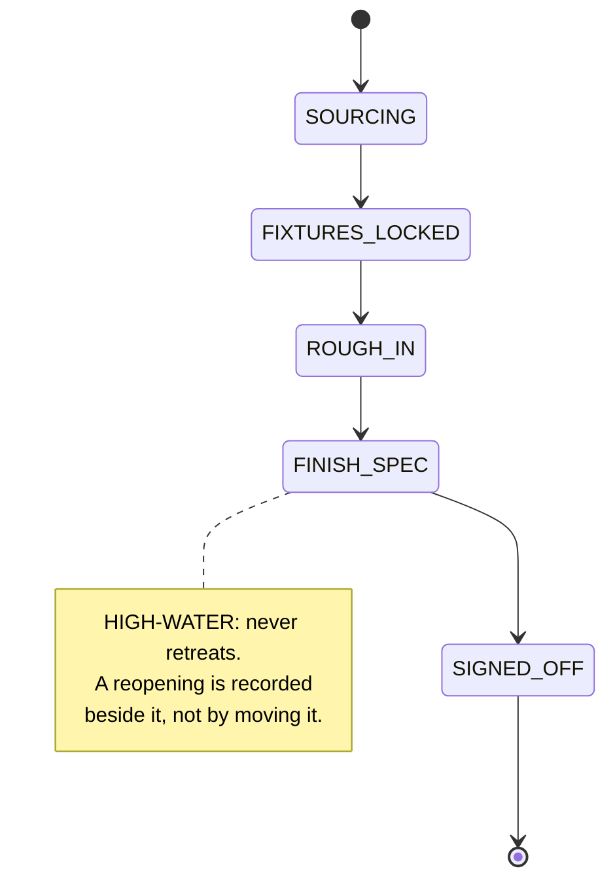

---

## 13 · How the three plans interlock

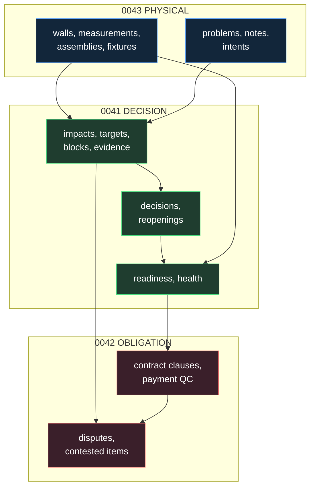

Each plan references the others **by id**, never by duplication. A room problem raises an impact; an impact blocks readiness; readiness gates what a contract may be asked to price.
