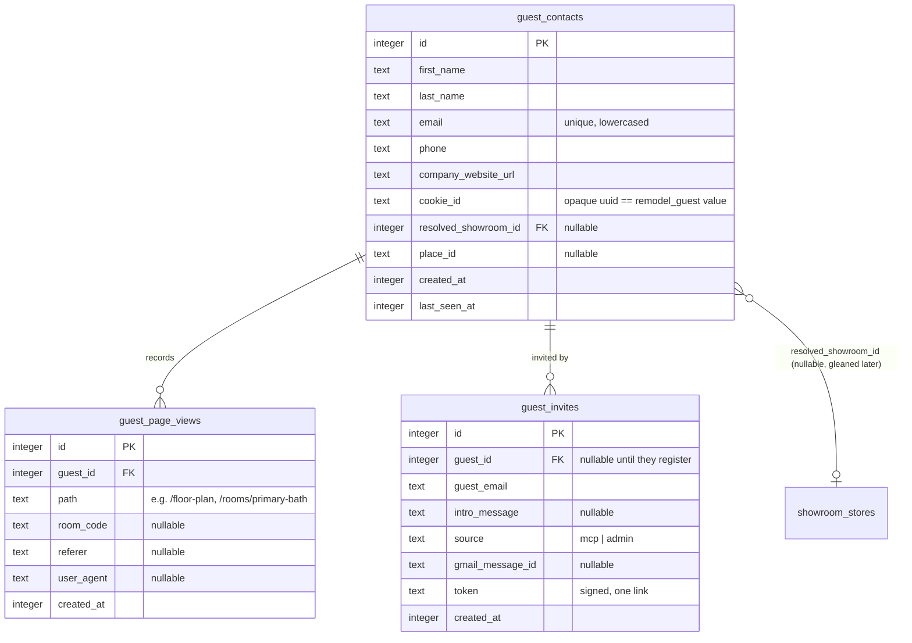
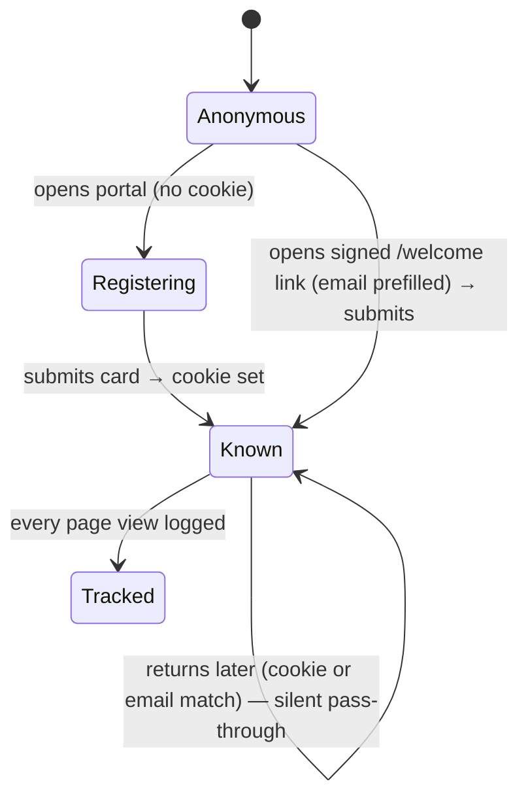

# 0043 — Vendor Guest Portal

**Slug:** `vendor-guest-portal`
**Status:** proposed — awaiting review of the preview changelog
**Owner:** Claude Code + Justin

---

## 1. Problem / context

- Justin shares 126 Colby's floor plan + room photos with **vendors and showrooms** — it's often the price of entry to a conversation.
- Today that means digging the plans out of email and re-sending them every time.
- We already have a **public, photos-only room view** (0042 follow-up, PR #315): `/floor-plan` → click a room → `PublicRoomGalleryApp` (listing + inspiration photos, no private data).

What's missing, and what this feature adds:

1. A **memorable short URL** — `remodel.hacolby.app` — to hand out verbally or type on mobile.
2. A **clean, chrome-less viewport** — no admin sidebar / "Enter Admin Portal" — just the plan and the images.
3. A **soft registration wall** — "give us your digital business card to see the photos" — capturing **first name, last name, email, phone, company website URL** before anything is shown. Not anonymous, but frictionless.
4. A **guest cookie** so returning guests skip the wall; a returning guest is matched by email/phone and **passed straight through** (no "you already did this" error).
5. **Silent page-view tracking** in D1 for every guest, so Justin can later say "I saw you looked at the primary bath — here's more."
6. A **baked-in email-onboarding flow**: an **MCP tool** and an **admin button** that, given just an **email + optional intro message**, send a boilerplate + Justin's note + a **direct login link** (email pre-filled) — sent **as justin@126colby.com** so replies come back to him.

### Non-goals (this feature)

- No real authentication / passwords for guests (frictionless by design — see §9 security).
- No RBAC roles yet (tracked separately; the public endpoints stay the public-safe surface).
- Full showroom auto-creation from the website is a **stretch phase** (P7), not the floor.

---

## 2. Decisions (confirmed with Justin)

| # | Decision | Choice |
|---|---|---|
| D1 | Short domain | **`remodel.hacolby.app`** — `hacolby.app` zone is already in the Cloudflare account; wire as a Worker custom domain. |
| D2 | Gate placement | **At entry** — register before seeing anything; then floor plan + all galleries. |
| D3 | Guest identity strictness | **Frictionless** — trust what they type, set a cookie, returning guests matched by email/phone are passed through silently. |
| D4 | Email sender identity | **justin@126colby.com** via the existing Gmail send path (`POST /api/gmail/compose`, service account impersonates Justin). Worker address (`remodel@hacolby.app`) is the documented fallback. |
| D5 | Boilerplate source | A **guest-portal config** managed at `/admin/config/*` (intro boilerplate + house-summary blurb), stored as markdown + html. |

---

## 3. Architecture map

```mermaid
flowchart TD
  subgraph Entry
    D[remodel.hacolby.app] -->|custom domain route| W[core-remodel Worker]
  end

  W --> GATE{guest cookie valid?<br/>remodel_guest → guest_contacts row}
  GATE -->|no| REG[Registration wall<br/>name · email · phone · website]
  REG -->|POST /api/guest/register| UPS[(upsert guest_contacts<br/>match by email/phone)]
  UPS -->|set remodel_guest cookie| PORTAL
  GATE -->|yes| PORTAL[Chrome-less Guest Portal]

  PORTAL --> FP[Floor plan (public catalog)]
  PORTAL --> GAL[Room gallery<br/>/api/rooms/code/:code/public]

  PORTAL -. every page .-> TRK[(guest_page_views<br/>silent, waitUntil)]

  subgraph Outreach
    MCP[[MCP: send_guest_invite]] --> COMPOSE
    ADMINBTN[Admin: Send invite button] --> COMPOSE
    COMPOSE[Compose: boilerplate + intro + signed login link] --> GM[Gmail compose AS justin@126colby.com]
    GM --> LINK[remodel.hacolby.app/welcome?t=SIGNED]
    LINK -->|prefills email| REG
  end

  classDef safe fill:#1f4d2e,stroke:#4ade80,color:#e6ffe6
  classDef priv fill:#4d1f1f,stroke:#f87171,color:#ffe6e6
  class GAL,FP safe
  class TRK priv
```

**Trust boundary:** the `remodel_guest` cookie is an **identity** cookie, distinct from the homeowner `remodel_access` cookie. It NEVER grants access to homeowner/admin surfaces — a guest can reach only the portal pages and the already-public `/api/rooms/code/:code/public`, `/api/rooms/catalog`, and `/api/guest/*` endpoints.

---

## 4. Data model (new tables)



- **Identity match (frictionless):** `guest_contacts.email` is unique (lowercased, trimmed). `register` upserts by email; if the email exists, we update the row + reissue the cookie and pass through (no error). Phone is a secondary match signal, not a hard key.
- **Config** (boilerplate): a small `guest_portal_settings` singleton row (or reuse the existing config/settings mechanism) with `intro_boilerplate_markdown/html` and `house_summary_markdown/html` — **rich text stored as markdown + html** per the repo convention.
- **Compliance scan (currency / multi-select):** this feature has **no currency fields** and **no multi-select vocabularies**. Company website is a single URL; boilerplate is rich text (markdown+html). Nothing to bring into definition/mapping compliance.

---

## 5. Registration + return flow

```mermaid
sequenceDiagram
  actor V as Vendor
  participant B as Browser
  participant W as Worker
  participant D as D1

  V->>B: open remodel.hacolby.app
  B->>W: GET / (no remodel_guest cookie)
  W-->>B: Registration wall (chrome-less)
  V->>B: first/last, email, phone, website → Continue
  B->>W: POST /api/guest/register
  W->>D: SELECT guest_contacts WHERE email=?
  alt new guest
    W->>D: INSERT guest_contacts (+ cookie_id)
  else returning guest
    W->>D: UPDATE last_seen_at (no error, pass through)
  end
  W-->>B: Set-Cookie remodel_guest=<cookie_id>; 200
  B->>W: GET /floor-plan (cookie present)
  W-->>B: Floor plan (portal shell)
  Note over W,D: every portal GET → waitUntil INSERT guest_page_views
```



---

## 6. Email onboarding flow

```mermaid
sequenceDiagram
  actor J as Justin / Claude
  participant M as MCP / Admin UI
  participant W as Worker
  participant C as guest_portal config
  participant G as Gmail API (as justin@126colby.com)
  actor V as Vendor

  J->>M: send_guest_invite(email, intro?)
  M->>W: POST /api/guest/invite
  W->>C: load boilerplate + house-summary
  W->>W: sign token = HMAC(email, WORKER_API_KEY)
  W->>G: compose(to=email, subject, body = boilerplate + intro + link)
  G-->>V: email "Here are our plans — click to view"
  V->>W: GET remodel.hacolby.app/welcome?t=SIGNED
  W-->>V: Registration wall, EMAIL PREFILLED (verified from token)
  Note over W: token only prefills; guest still completes name/phone/website
```

- **Link contents:** `https://remodel.hacolby.app/welcome?t=<token>` where `token` is a URL-safe signed blob of the (lowercased) email. On load, the Worker verifies the signature and pre-fills the email field. The token is not a password; it only saves typing an email.
- **Sender:** `POST /api/gmail/compose` (existing) → sends as justin@126colby.com. If Gmail is unavailable, fall back to the worker email service (`remodel@hacolby.app`). The `guest_invites` row records `gmail_message_id`.
- **Boilerplate:** pulled from config every send (house summary — "~2,000 sq ft, full remodel, 3 baths…" — is editable at `/admin/config`). The MCP/admin caller supplies only `email` + optional `intro`.

---

## 7. Phases & tasks

```mermaid
flowchart LR
  P0[P0 Custom domain<br/>remodel.hacolby.app] --> P1
  P1[P1 Chrome-less portal shell] --> P2
  P2[P2 Guest identity + registration gate] --> P3
  P2 --> P5
  P3[P3 Silent page-view tracking] --> P6
  P5[P5 Email onboarding<br/>MCP + admin button] --> P6
  P4[P4 Boilerplate config] --> P5
  P6[P6 Admin guest management] --> P7
  P7[P7 stretch: glean showroom from website]
  classDef stretch fill:#3a3a1f,stroke:#facc15
  class P7 stretch
```



| Phase | Deliverables |
|---|---|
| **P0** | `remodel.hacolby.app` custom-domain route in `wrangler.jsonc`; verify DNS + TLS; portal renders on it. |
| **P1** | `GuestLayout.astro` (no admin nav/sidebar/config cog); portal routes (`/`, `/floor-plan`, `/rooms/[slug]`) render chrome-less for guests; homeowner still uses the workers.dev app for admin. |
| **P2** | D1 `guest_contacts`; `remodel_guest` cookie + `guest-access` util (distinct from homeowner); `POST /api/guest/register`, `GET /api/guest/me`; gate middleware; registration card component. |
| **P3** | D1 `guest_page_views`; `waitUntil` logger on portal page loads (+ a light client beacon for SPA route changes); nothing user-visible. |
| **P4** | `guest_portal_settings` (intro boilerplate + house summary, markdown+html) + `/admin/config/portal/onboarding` page (ConfigShell). |
| **P5** | `POST /api/guest/invite` (compose via Gmail as Justin, record `guest_invites`); **MCP tool `send_guest_invite`** (`outreach` domain, WRITE); `/welcome?t=` signed-link prefill; **admin "Send invite" button**. |
| **P6** | `/admin/guests` — list guests, per-guest page-view trail, resolved showroom, "Send invite" button. |
| **P7** | *(stretch)* from `company_website_url` → resolve/create a showroom (reuse showroom intake / Places), set `resolved_showroom_id`. |

Success criteria per phase live in the D1 `plan_tasks` rows (seeded via the feature proposal) and mirror `TASKS.json`.

---

## 8. API / MCP / schema deltas

**New D1 tables:** `guest_contacts`, `guest_page_views`, `guest_invites`, `guest_portal_settings` (drizzle schema → `pnpm run db:generate` → `migrate:remote`).

**New API (Hono):**
- `POST /api/guest/register` — upsert by email, set `remodel_guest` cookie, return `{ guest }`.
- `GET /api/guest/me` — resolve current guest from cookie (for gate + prefill).
- `POST /api/guest/track` — log a page view (also done server-side on SSR loads).
- `POST /api/guest/invite` — admin-gated; compose + send onboarding email; record invite.
- `GET /api/admin/guests` + `GET /api/admin/guests/:id/views` — admin management (homeowner-gated).

**New MCP tool** (registry, `tools/outreach/send_guest_invite.ts`): `send_guest_invite({ email, introMessage? })` → `WRITE`, ≥1 example; returns `{ sent, guestEmail, gmailMessageId }`. Docs card auto-renders on `/connect/tools`.

**Custom domain:** `remodel.hacolby.app` added to `wrangler.jsonc` (and the preview deriver leaves it off previews).

---

## 9. Security & privacy

- **Distinct cookie.** `remodel_guest` is an opaque uuid mapped to a `guest_contacts` row. It is NOT `remodel_access` and grants **zero** homeowner/admin access. The gate only ever unlocks portal pages + the already-public room endpoints.
- **No private data on the wire.** The portal consumes only `/api/rooms/catalog` and `/api/rooms/code/:code/public` — both photos/name/dimensions only (verified in PR #315 QC).
- **Signed invite links.** `/welcome?t=` carries an HMAC-signed email (key = `WORKER_API_KEY`); a bad signature just means "no prefill", never access.
- **Frictionless ≠ verified.** Anyone can type any email; acceptable because the gated content is non-sensitive marketing photos. Documented, not a bug.
- **Tracking scope.** `guest_page_views` records path + room + UA/referer for guests only; no cross-site data, no third parties.

---

## 10. Verification plan

- `scripts/qc/pr_<n>.mjs` per phase PR: registration upsert + cookie; returning-guest pass-through (no error); gate blocks unregistered; page-view rows written; invite composes + records `gmail_message_id`; **regression guard** that homeowner/admin endpoints still 401 for a guest cookie.
- Browser: registration wall → submit → floor plan → open room → gallery; chrome-less shell (no admin nav); returning visit skips the wall; `/welcome?t=` prefills email.
- Custom domain: `curl -I https://remodel.hacolby.app` → 200 + correct TLS.
