# 0044 — Upgrade the MCP server to Code Mode (Cloudflare)

**Slug:** `mcp-code-mode`
**Status:** planning
**Docs grounded via Cloudflare docs MCP** (`/agents/tools/codemode/*`, `@cloudflare/codemode`).

---

## 1. What "Code Mode" is (per Cloudflare)

Instead of advertising **N MCP tools** to the model (each schema in context, each a
separate call), Code Mode advertises **one `code` tool**. Its description carries
**generated TypeScript definitions** for the upstream tools; the model writes a
**JavaScript async arrow function** that calls them as `codemode.tool_name(args)`,
executed in a **sandboxed Dynamic Worker**. The model can loop, filter, and chain
dependent calls in code, returning only the final result.

> Cloudflare's own framing: *"give a model one `codemode` tool instead of a large
> prompt full of tool definitions."*

Core pieces (all from `@cloudflare/codemode`):
- **`codeMcpServer({ server, executor })`** (`@cloudflare/codemode/mcp`) — wraps an
  **existing `McpServer`** so every registered tool becomes a typed `codemode.*`
  method behind a single `code` tool. **← the direct upgrade path for us.**
- **`DynamicWorkerExecutor({ loader: env.LOADER })`** — runs the model's code in a
  Dynamic Worker: **network-isolated** (`fetch`/`connect` blocked by default),
  console captured, 30s timeout.
- **`ToolDispatcher`** — RPC target: the sandbox calls back to the **host** to run
  the real tool handler. *Our handlers stay host-side (they touch D1/env); the
  sandbox only orchestrates.*
- **search-and-execute** (`codemode.search()` / `codemode.describe()`) — for a large
  catalog, keep the full type catalog OUT of context; the model discovers methods
  on demand.
- **Durable approvals** (`createCodemodeRuntime` + connectors + durable log) — a
  WRITE-annotated method **pauses** execution → host approves (`approveExecution`)
  → completed calls **replay** from the log, the approved action runs, the same
  program continues. `pendingApprovals()`, `rejectExecution()`, `rollbackExecution()`.

---

## 2. Why we want it (three problems it solves at once)

```mermaid
flowchart TD
  P1["87→100+ MCP tools (0043 adds ~20 email)"] --> A["context bloat: every tool schema in the model prompt"]
  P1 --> B["startup-CPU 10021: registering every tool + Zod schema at module load<br/>(prod already retry-flaked this session)"]
  P1 --> C["multi-tool workflows = many brittle chained tool calls"]
  A & B & C --> CM["Code Mode: ONE code tool"]
  CM --> S1["types generated, not all in initial context (search/describe)"]
  CM --> S2["fewer registered tools → lower startup CPU"]
  CM --> S3["model writes orchestration code (loops/filters/dependent calls) in a sandbox"]
  CM --> S4["durable HITL approvals for WRITE/send — aligns with the 0042 trust gate"]
  classDef win fill:#1f4d2e,stroke:#4ade80
  class CM,S1,S2,S3,S4 win
```



The 0043 email suite is the poster child: *"search indexed, then live-Gmail
backfill responsive-unindexed, then return"* is one clean code block in Code Mode
vs. a fragile chain of separate tool calls.

---

## 3. What we already have (small delta)

```mermaid
flowchart LR
  have["HAVE"] --> h1["RemodelMcpAgent extends McpAgent, server = new McpServer(),<br/>registers getAllTools() (registry.ts, 87+ tools)"]
  have --> h2["LOADER worker_loaders binding (wrangler.jsonc:526)"]
  have --> h3["nodejs_compat; compat date 2026-05-17"]
  have --> h4["tool annotations READ_ONLY/WRITE/WRITE_IDEMPOTENT/DESTRUCTIVE"]
  need["NET-NEW"] --> n1["npm i @cloudflare/codemode"]
  need --> n2["wrap server with codeMcpServer + DynamicWorkerExecutor"]
  need --> n3["map annotations → requiresApproval (durable approvals)"]
  need --> n4["maybe bump agents 0.12.3 → ≥0.16 for createCodemodeRuntime<br/>(or use the standalone codeMcpServer path first)"]
  classDef k fill:#1f4d2e,stroke:#4ade80
  class h1,h2,h3,h4 k
```



---

## 4. Target architecture

```mermaid
sequenceDiagram
  participant M as Model (Claude / connector)
  participant C as code tool (codeMcpServer)
  participant X as DynamicWorkerExecutor (sandbox, no network)
  participant D as ToolDispatcher (host RPC)
  participant H as our defineTool handler (env + D1)
  M->>C: one call: code = "async()=>{ const q=await email.search_email(...); ... }"
  C->>X: run code in Dynamic Worker
  X->>D: codemode.search_email(args)  (RPC to host)
  D->>H: run real handler (Gmail fetch + D1) host-side
  H-->>D: result
  D-->>X: result
  X->>D: codemode.gmail_send(args)  [WRITE → requiresApproval]
  D-->>C: PAUSED {executionId, pending}
  C-->>M: status: paused (surface approval)
  M->>C: approveExecution(id)
  C->>X: replay completed calls from durable log, run gmail_send, continue
  X-->>C: completed {result, logs}
  C-->>M: final result
```

Key invariant: **tool handlers run on the host** (they need D1/env/Gmail); the
sandbox only runs the model's orchestration JS and is network-isolated.

---

## 5. Phases

| Phase | What |
|---|---|
| **P0 — spike** | `npm i @cloudflare/codemode`. Stand up a throwaway `/mcp/code` endpoint wrapping ~5 tools with `codeMcpServer({ server, executor: new DynamicWorkerExecutor({ loader: env.LOADER }) })`. Prove: a model-written code block runs, calls a tool host-side, returns. **Measure startup-CPU + context-size delta** vs. the 87-tool `/mcp`. Bump compat date if the SDK requires. |
| **P1 — wrap the full registry** | Expose Code Mode over the WHOLE registry at `/mcp/code` (keep legacy `/mcp` direct-tools for back-compat). Generated TS types from our tool `inputShape`s. Verify `RemodelMcpAgent` still OAuth-gates + logs invocations (per-tool logging now happens at dispatch). |
| **P2 — search/describe** | Add the search-and-execute pattern so 100+ tool types stay out of initial context (`codemode.search()`/`describe()`). Confirm the startup-CPU headroom this buys (de-risks 0043 adding ~20 more tools). |
| **P3 — durable approvals** | Map annotations → `requiresApproval` (WRITE/WRITE_IDEMPOTENT/DESTRUCTIVE pause; READ_ONLY auto). Wire `approveExecution`/`rejectExecution`/`pendingApprovals` + surface pending in the alerts center (0042 P3). Likely needs `agents` ≥0.16 (`createCodemodeRuntime`) — evaluate the bump vs. a custom `Executor`. |
| **P4 — cut over + docs** | Make Code Mode the default connector surface; keep `/mcp` as fallback during a deprecation window. Update `/connect` docs. Regression: existing chat flows still work. |

Each phase its own PR; QC + changelog per repo rules. No D1 migration (infra only)
unless P3 needs a durable-log table (the runtime may own its own storage — confirm).

---

## 6. Risks / decisions

- **agents 0.12.3 vs durable runtime (≥0.16).** `codeMcpServer` (standalone
  `@cloudflare/codemode/mcp`, v0.2.1) works WITHOUT the agents durable runtime —
  start there (P0-P2). Durable approvals (P3) is where an `agents` bump (or a custom
  Executor) is decided; treat the bump as its own reviewed change (agents is a deep
  dependency: DO migration tags, AIChatAgent, routeAgentRequest — see the repo's
  agents gotchas).
- **Compat date.** Docs examples use `2026-06-24`; ours is `2026-05-17`. Bump only if
  the SDK/worker-loader requires it (test in P0).
- **Startup CPU (10021).** Code Mode should *reduce* it (fewer registered tools) —
  P0 must measure to confirm, since that's a primary motivation.
- **Handler location.** Do NOT move tool handlers into the sandbox — they need
  D1/env/Gmail and the sandbox is network-isolated. Handlers stay host-side, invoked
  via `ToolDispatcher`. Existing `defineTool` handlers are unchanged.
- **Back-compat.** Keep `/mcp` (direct tools) live through P1-P4 so the claude.ai
  connector + Claude Code keep working during rollout.
- **Security.** Sandbox `globalOutbound: null` (no arbitrary network from
  model-written code) is a *feature* — orchestration can't exfiltrate; only our
  vetted host handlers touch the network.

## 7. Success criteria

- One `code` tool replaces the 87+ direct tools on `/mcp/code`; a model writes a
  multi-step code block (e.g. the 0043 email search) that runs in the sandbox and
  returns a single result.
- Measured **lower startup CPU** and **smaller initial tool-context** than `/mcp`.
- WRITE/send actions pause for approval; approve → replay+continue; reject/rollback
  work; pending approvals surface in the alerts center.
- `/connect` documents the Code Mode connection; legacy `/mcp` still functions.
