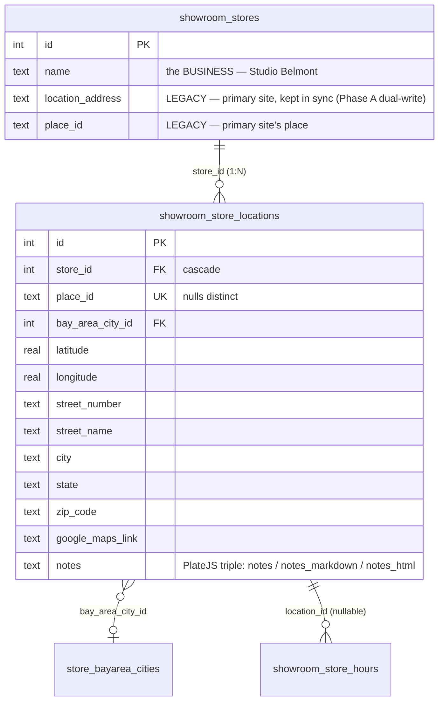
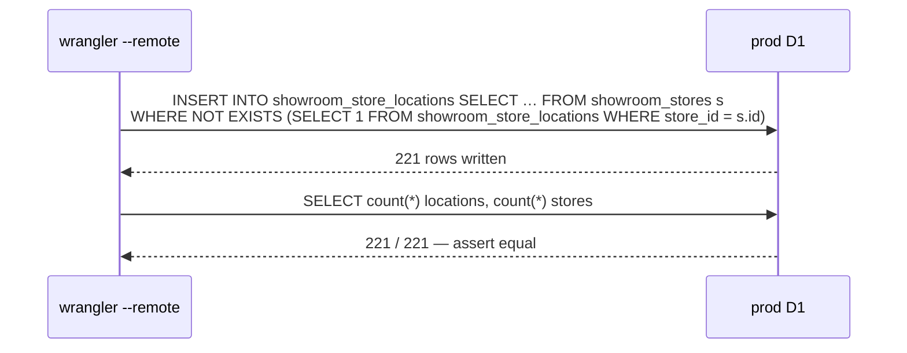

# 0045 — Showroom multi-location, wired end to end (MCP first)

> **Slug:** `showroom-multi-location-mcp`
> **Depends on:** `0031_showroom_stores_location_refactor` Phase A (table shipped, PR #278)
> **Status when written:** table exists on prod, **0 rows**, **0 code references**

---

## 1. Context — what is actually true today

- **The intent is right and already designed.** Plan `0031_showroom_stores_location_refactor`
  says one `showroom_stores` row is the *business* (Studio Belmont, TAZ, IRG…) and
  `showroom_store_locations` holds N *sites*, joined by `store_id` FK.
- **Only the table shipped.** PR #278 ("0031 Phase A") merged **five files**: the drizzle
  schema, the migration, and the snapshot. Nothing else.
- **Verified against prod on 2026-08-04:**

  | Check | Result |
  |---|---|
  | `select count(*) from showroom_store_locations` | **0** |
  | `select count(*) from showroom_stores` | **221** |
  | `grep -rn showroomStoreLocations src/` | 2 hits, **both schema files** (`store_location.ts`, `hours.ts`) |

- **So every read and every write in the app still uses the flat address columns on
  `showroom_stores`** (`location_address`, `location_city`, `latitude`, `place_id`, …).
  One store = one address, exactly as before.
- **The reported symptom is the direct consequence.** A chat agent was given a business
  card from the San Carlos site of a store already registered at Emeryville. It could only
  see one address, so it offered to *overwrite* Emeryville; asked to add a location instead,
  it correctly reported no such tool exists; asked to list multi-location stores, it had
  nothing to query.

```mermaid
flowchart LR
  subgraph today["TODAY — shipped state"]
    S[(showroom_stores<br/>221 rows<br/>flat address cols)]
    L[(showroom_store_locations<br/>0 rows<br/>zero code refs)]
    S -->|read by| API[API + MCP + frontend]
    L -.->|nothing| X((  ))
  end
  classDef dead fill:#4d1f1f,stroke:#f87171
  classDef live fill:#1f4d2e,stroke:#4ade80
  class L,X dead
  class S,API live
```



---

## 2. Goal

- **Make locations real data**, then **make MCP fluent in them** — read, write, and search.
- **Do NOT do the 0031 Phase B/C cutover in this plan.** Phase B repoints every API reader,
  every service writer and the frontend; Phase C drops 20 columns. That is a separate, much
  larger blast radius. This plan finishes **Phase A** (backfill + dual-write) and adds the
  MCP surface on top, which is additive and reversible.

### Non-goals (explicitly deferred to 0031 B/C)
- Repointing `src/backend/api/routes/showroom-stores.ts` reads/writes.
- Frontend location editing UI.
- Dropping `location_*` columns from `showroom_stores`.

---

## 3. Target model



- **Primary location** = the location row whose `place_id` equals the store's `place_id`;
  falls back to the lowest `id`. It is a *derived* label, **not a stored column** — no
  `is_primary` flag to drift.
- **Display address is derived**, never stored (`formatShowroomAddress(parts)`), per the
  0031 decision that a free-text address gets abused by AI ("SF Bay area").

---

## 4. Phases

```mermaid
flowchart TD
  P1[P1 — backfill<br/>221 stores → 221 locations] --> P2[P2 — read helper<br/>loadStoreLocations + formatShowroomAddress]
  P2 --> P3[P3 — MCP reads<br/>get_showroom.locations[]<br/>list_showrooms.locationCount + multiLocationOnly]
  P2 --> P4[P4 — MCP writes<br/>add / update / delete_showroom_location]
  P3 --> P5[P5 — dedupe fix<br/>find_known_showrooms + search_showrooms match location place_ids]
  P4 --> P5
  P5 --> P6[P6 — QC + deploy]
  classDef risk fill:#4d1f1f,stroke:#f87171
  class P1 risk
```

### P1 — Backfill (the one destructive-adjacent step)
- Idempotent `INSERT … SELECT … WHERE NOT EXISTS`, one location per existing store, copying
  the flat columns across. `COALESCE(location_zip_code, zip_code)`.
- Lives at `scripts/sql/backfill_showroom_store_locations.sql`, applied with
  `wrangler d1 execute core-remodel --remote --file …`. It is **data**, not schema — it is
  deliberately not a drizzle migration.
- **Assert after:** `count(locations) == count(stores)` and every `store_id` distinct.
- Safe to re-run: the `NOT EXISTS` guard makes a second run a no-op.



### P2 — Shared read helper
- `src/backend/services/showroom/locations.ts`
  - `formatShowroomAddress(parts)` — assembles `"123 Main St, San Carlos, CA 94070"` from
    the structured parts, skipping blanks. Ships with an `assert` self-check.
  - `loadStoreLocations(db, storeIds)` → `Map<storeId, LocationDto[]>`, one query, chunked
    at 20 ids for the D1 100-bound-param cap.
  - `LocationDto` carries `id`, `address` (derived), the raw parts, coords, `placeId`,
    `googleMapsLink`, `cityName`/`hubRoute`/`hubName` (derived from `bay_area_city_id` via
    `classifyBayAreaRegion`), `isPrimary`, and the notes triple.

### P3 — MCP reads
- `get_showroom` gains `locations: LocationDto[]` and `locationCount`.
- `list_showrooms` gains `locationCount` per row + a `multiLocationOnly?: boolean` filter —
  this is the "show me the chains" query that had no answer.
- Both tool **descriptions** rewritten to state the model out loud, so an agent reading the
  catalog knows a store has *many* sites before it proposes overwriting one.

### P4 — MCP writes (one file per tool, per the registry convention)
| Tool | Annotation | Notes |
|---|---|---|
| `add_showroom_location` | `WRITE` | Adds a site to an existing store. Rejects a `placeId` already held by ANY location (unique index) with a message naming the store that owns it. |
| `update_showroom_location` | `WRITE` | Patch one location by `locationId`; only passed fields change. |
| `delete_showroom_location` | `DESTRUCTIVE` | Hard delete by `locationId`; refuses to delete the **last** location of a store. |

- **Dual-write (Phase A contract):** when the mutated location is the primary, the write
  fans out to the legacy `showroom_stores` columns so every un-migrated reader stays
  correct. Non-primary locations touch the store row not at all.
- No `db.transaction()` — D1 has none. `db.batch([...])` where two statements must land
  together.

### P5 — Dedupe / discovery correctness (the sibling-caller fix)
- `find_known_showrooms` and `search_showrooms` currently match an inbound `placeId` only
  against `showroom_stores.place_id`. After P1 every location carries a `place_id` too, and
  new sites will only ever exist there. Both must match against **locations first**, and
  report **which store** owns the matched site.
- Without this, an agent that scans a Places result for a chain's second site sees "not
  registered" and creates a **duplicate store** — the exact failure this whole model exists
  to prevent.

### P6 — QC + deploy
- `scripts/qc/pr_<n>.mjs` run against **preview** and **prod**.
- `pnpm run deploy` from `main` after merge (nothing auto-deploys).

---

## 5. Risks

```mermaid
flowchart LR
  R1[Backfill double-inserts] -->|WHERE NOT EXISTS guard + count assert| M1[idempotent]
  R2[place_id unique collision on insert] -->|pre-check + named error| M2[agent told which store owns it]
  R3[Legacy readers go stale] -->|dual-write primary → showroom_stores| M3[Phase A contract held]
  R4[Agent deletes a store's only site] -->|refuse last location| M4[guarded]
  R5[D1 100-param cap on loadStoreLocations] -->|chunk ids at 20| M5[bounded]
  classDef done fill:#1f4d2e,stroke:#4ade80
  class M1,M2,M3,M4,M5 done
```



- **Two sources of truth for the primary address** is the honest cost of not doing Phase B.
  It is time-boxed: 0031 Phase B removes it. Dual-write keeps them equal in the meantime;
  the QC script asserts parity.

---

## 6. Compliance scan (mandatory)

| Data point | Currency? | Multi-select? | Verdict |
|---|---|---|---|
| `location.bay_area_city_id` | — | single-select FK → `store_bayarea_cities` | **Compliant** — real FK. |
| `location.notes` | — | — | **Compliant** — PlateJS triple (`notes` / `notes_markdown` / `notes_html`) already in the shipped schema. |
| address parts, coords, `place_id` | — | — | Plain scalars. |

No currency fields in scope. No comma-separated multi-values introduced.

---

## 7. Success criteria

- `select count(*) from showroom_store_locations` == `select count(*) from showroom_stores` on prod.
- `get_showroom` returns a `locations[]` array for every store.
- `list_showrooms({ multiLocationOnly: true })` returns the chains, and nothing else.
- `add_showroom_location` puts a San Carlos site on an existing Emeryville-registered store
  **without touching** the Emeryville row.
- `find_known_showrooms` matching a chain's second site reports the OWNING store, not "none".
- QC green on preview **and** prod.
