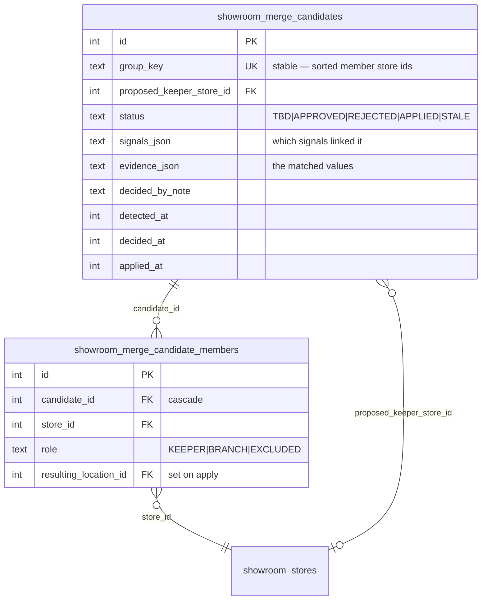
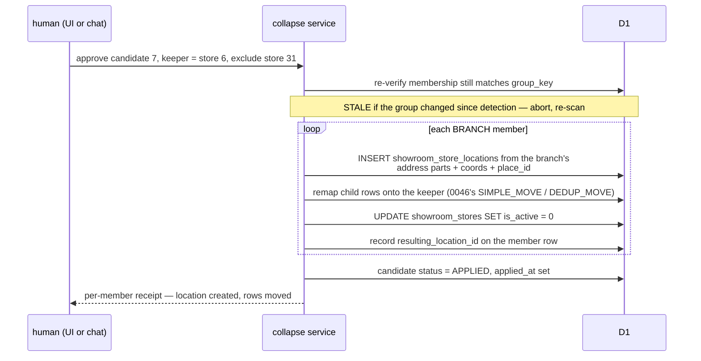

# 0047 — Collapse chain branches into one business (Tier 2)

> **Slug:** `showroom-branch-collapse`
> **Depends on:** 0045 (locations exist + `add_showroom_location`), 0046 (detection + `branchCandidates`)
> **Decision on file:** Tier 2 **proposes, never auto-merges** — human confirms every collapse.

---

## 1. Where this starts

0046 made the detector honest. It now finds groups where **two or more REAL rows**
(each with its own zip/place_id) belong to one business — and deliberately refuses to
touch them, returning them as `branchCandidates`. There is currently **no way to act on
one**, so the backlog just gets re-reported every run.

Live on prod today, 12 candidates covering ~30 store rows. The big ones:

| Business | Rows | Linked by |
|---|---|---|
| Studio Belmont | 5 | website |
| Homewise Appliance | 5 | website, name |
| All Natural Stone | 4 | website, name |
| Daltile Stone & Slab | 4 | website, name |
| Porcelanosa | 3 | address, website, name |
| Lema, Bedrosians, Aquabella, Topcret, KOHLER, Saratoga/Los Gatos Plumbing, UnitedPorte/Italdoors | 2 each | — |

Each is one business filed as N stores. Under 0045 it should be **one store row with N
location rows**.

```mermaid
flowchart LR
  subgraph now["TODAY"]
    A[(store 6<br/>Studio Belmont Flagship)]
    B[(store 7<br/>Studio Belmont SF)]
    C[(store 23<br/>San Jose)]
    D[(store 26<br/>Walnut Creek)]
    E[(store 31<br/>Novato)]
  end
  subgraph after["AFTER 0047"]
    K[(store 6 — Studio Belmont<br/>the BUSINESS)]
    K --> L1[location: Flagship]
    K --> L2[location: SF]
    K --> L3[location: San Jose]
    K --> L4[location: Walnut Creek]
    K --> L5[location: Novato]
  end
  now -->|human-confirmed collapse| after
  classDef bad fill:#4d1f1f,stroke:#f87171
  classDef ok fill:#1f4d2e,stroke:#4ade80
  class A,B,C,D,E bad
  class K,L1,L2,L3,L4,L5 ok
```

## 2. Why this is not just "run the merge tool"

`dedup_showroom_stores` **discards** the loser's address — correct when the loser is a
duplicate stub, catastrophic when it is a real branch. Collapsing must **carry each
loser's site across** as a location row (address parts, coords, place_id, phone, hours)
before soft-deleting the store row. That is a different operation, and it is why 0046
refuses to do it.

It is also the first operation in this repo that is **destructive to real, distinct
data** if the grouping is wrong — and 0046 already proved the grouping can be wrong in
non-obvious ways (the SF Design Center blob; Leandro Quintal riding a suite-less address
edge into Marblus). Hence: propose, show evidence, human confirms, then apply.

---

## 3. Model

- **`group_key` is derived, stable and unique**: the sorted member store ids joined. Re-running
  the scan upserts rather than duplicating, and a group whose membership changes becomes a
  NEW candidate while the old one goes `STALE` — never silently mutated under a pending decision.
- **No denormalized names anywhere.** Members relate by `store_id`; display names JOIN.
- **`role = EXCLUDED`** is how a human says "these four are one business, but that fifth row
  is a different company" — the Leandro Quintal case, resolved per-member instead of
  rejecting the whole group.

---

## 4. Phases

```mermaid
flowchart TD
  P1[P1 — schema<br/>candidates + members] --> P2[P2 — scan<br/>reuse 0046 detection, upsert candidates]
  P2 --> P3[P3 — collapse service<br/>carry site across, THEN soft-delete]
  P3 --> P4[P4 — MCP<br/>list / get / resolve / apply]
  P2 --> P5[P5 — review UI<br/>/admin/shopping/showrooms/merge-review]
  P4 --> P6[P6 — QC + deploy]
  P5 --> P6
  classDef risk fill:#4d1f1f,stroke:#f87171
  class P3 risk
```

### P1 — schema
Two tables above. `pnpm run db:generate`, apply with `migrate:remote`, verify.

### P2 — scan (`scan_showroom_merge_candidates`)
Runs 0046's `groupBySignals` + the `isReal >= 2` classification and upserts a candidate per
branch group. Idempotent by `group_key`. Never writes to `showroom_stores`.

### P3 — the collapse service (the dangerous part)

- **Order matters:** create the location BEFORE soft-deleting, so a failure never loses the
  address. Sequential + compensating delete (D1 has no transactions; `db.batch()` cannot feed
  a generated id into the next statement).
- Reuse 0046's child-table move maps rather than re-listing 25 FK tables.
- A branch with no usable address is reported and skipped, never collapsed to nothing.

### P4 — MCP (chat parity, per the ambiguous-parent doctrine)
`list_merge_candidates` (READ_ONLY), `get_merge_candidate` (READ_ONLY, full evidence),
`resolve_merge_candidate` (WRITE — approve/reject/exclude a member), `apply_merge_candidate`
(DESTRUCTIVE — only on an APPROVED candidate).

### P5 — review UI
`/admin/shopping/showrooms/merge-review`, thin Astro shell + one React island, per the page
shell rules. Per group: proposed keeper (switchable), each member with address/phone/site,
the matched evidence, per-member keep/exclude, approve/reject.

### P6 — QC + deploy
`scripts/qc/pr_<n>.mjs` against preview AND prod. Collapse is exercised on a **throwaway
pair created by the test and removed after**, never on live rows.

---

## 5. Risks

```mermaid
flowchart LR
  R1[Wrong group collapses a real business] -->|human confirm + per-member EXCLUDE| M1[no auto-apply, ever]
  R2[Address lost between insert and delete] -->|create location FIRST, compensating delete| M2[address never orphaned]
  R3[Group changed since detection] -->|re-verify group_key on apply| M3[STALE, abort + re-scan]
  R4[Branch has no address] -->|report + skip that member| M4[never collapsed to nothing]
  R5[D1 100-param cap on child remaps] -->|chunk at 20, reuse 0046 helpers| M5[bounded]
  classDef done fill:#1f4d2e,stroke:#4ade80
  class M1,M2,M3,M4,M5 done
```

## 6. Compliance scan

| Data point | Currency? | Multi-select? | Verdict |
|---|---|---|---|
| `status`, `role` | — | single-select, small fixed vocab | TEXT enum, consistent with `user_decision` on the park-find queue. Not a user-managed vocabulary, so no config page. |
| `signals_json` / `evidence_json` | — | — | Point-in-time detection artifact, not a duplicate of another table. Legitimate JSON, same as `proximity_scan_json`. |

No currency fields. No comma-separated multi-values.

## 7. Success criteria

- Every `branchCandidate` from 0046 appears as a reviewable candidate row.
- Approving one collapses N stores into 1 business + N locations, with **no address lost**
  and every child row remapped.
- A member marked `EXCLUDED` is left completely untouched.
- Re-running the scan after an apply produces no new candidate for that group.
- `dedup_showroom_stores` still reports 0 runaway components (0046 regression).
- QC green on preview and prod.
